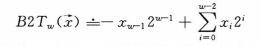
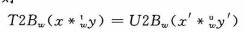
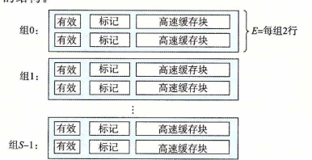

# 深入理解计算机系统

## 2 信息表示和处理

### 2.1 信息存储

记X,Y为32位二进制数，0表示低位，31表示高位，记A1为X中为1的下位集合，A2为0的下位集合；记B1为Y中为1的下位集合，B2为0的下位集合;A1+A2=B1+B2={0,...,31},那么逻辑运算可以表示为集合运算：

* X&Y = 将A1∩B1的比特位设置为1，其余为0
* X|Y=将A1∪B1的比特位设置为1，其余为0
* X^Y=将(A1∩B2)∪(A2∩B1)的比特位设置为1，其余为0

这个概念的理解可以见2-13题

2.12 C:

x^(0xFF & (~x))也可以

### 2.2整数表示

#### 2.2.1 原码补码

* 原码：+0=0..0，有-0：100,...0。最高位为符号位，为1表示这是一个正数，为0表示这是一个负数。+1用0....1表示，-1用10...01表示，两者相加如果不考虑进位的话得-0，考虑进位之后得-2；
* 反码：+0=0...0，有-0，11...11，+x + (-x)=-0（11....1)，+1用0....1表示，-1用11...10表示，两者相加考不考虑进位都是1....1

* 补码：没有-0的概念，+x + (-x)=-0,假设32位数据，那么相加的结果是第33位为1，低32位为0的一个数。+1用0....1表示，-1用11...11表示,两者相加考虑进位的话是10..(32个0)，去掉溢出的1是+0。

#### 2.2.2 有符号和无符号的转换

强制转换的结果保持位值不变，只是改变了对位值的解释方式

```c
short v = -12345;
unsigned short uv = (unsigned short) v;//53191
```

v和uv的补码完全一致，只是意义变了，对于uv来说，最高位的1不表示符号，而是表示值。

还有对于UMax（1(32个1)），强转为int后变成-1（最高位表示符号）

一个负有符号数比如-12345，它的B2T公式为



它的相反数12345就是上面式取负号,x(w-1)变成1，后面的变成-1，它的无符号形式变成53191，前面x(w-1)变成1，后面不变，两者相加，后面项消掉，得到2^(w-1)+2^(w-1)=2^(w),对于-1和Umax，它们俩之和也是2^(w)，即一个位于[Tmin,0)的有符号负数x，满足-x+T2U(x)=2^(w)

综上，T2U(x) = x + 2^w  当x<0时， x>0时T2U(x)=x

有符号数无符号数做比较时，将有符号的强转为无符号的，再进行比较。如果一个有符号和一个无符号进行比较，将无符号的强转为有符号的，那么最后是按照有符号的规则比，如:

2147483647 > (int) 2147483648U//   1(true)

#### 2.2.3 扩展一个数字的位表示

什么时候发生扩展（强制把较小数据类型转为较大数据类型时）？

```
short sx = -12345;
int x = (int) sx;//-12345
```

将一个无符号数转为更大的数据类型，在前面填充零即可。

将一个补码转为更大的数据类型，在前面填充最高位，如果高位是0就填0，高位是1就填1，扩充后的值和之前的值大小一致，这可以利用B2T公式证明。

同时出现扩展和符号转换时，先执行哪个转换？

C语言规定，先执行数据类型转换，再执行符号转换；

```
short x = -12345;
unsigned int y = x;//等价于y = (unsigned)(int)x，先强转为int，再转为无符号
```

#### 2.2.4 截断

截断无符号数&截断补码（取模关系）

什么时候发生截断（强制把较大数据类型转为较小数据类型时）：

```
int x = 53191;
short sx = (short) x;//sx = -12345 
```

这里对于补码的截断是指，对于一个32位的数，把它截断到16位后，那么第15位就变成符号位了，截断之后的数还是一个补码。

注意截断补码时，可能截断之前是个正数，截断之后变成一个负数了，所以先取mod，再将截断之后的数转为有符号的数，即x'=U2T(xmod(2^k))

#### 2.2.5 无符号数的计算

无符号数之间做计算时可能会得到一个负数的值：

```
unsigned l = 0;
l-1;//结果还是一个无符号数，为Umax
```

### 2.3 整数计算

#### 2.3.1 加法

**无符号加法**：

0<=x,y<=2^w-1，正常进位，如果溢出到第w位了，将其舍弃掉后得到的0-w-1位就是结果的无符号码。

判断溢出的充要条件：结果小于任意一个加数

反证：如果x<=x+y-2^w成立或y<=x+y-2^w，那么会有x>=2^w或y>=2^w

因为溢出后存在两个无符号数相加结果为0的情况，所有w位无符号数形成一个阿贝尔群（有逆元），一个元和逆元之和为0。x(x!=0)和它的逆元x'满足x+x'=2^w。当x=0时不满足这一性质，它的逆元为0

**补码加法**：

先将两个数转为无符号数，再把结果从无符号数转成补码。

* 正溢出：两个正数相加超过Tmax，导致第w-1位变成1，它们的最大值为2^w-2，首先将相加后的各个位执行B2U操作，变成一个无符号数，然后执行U2T操作，那么正溢出时U2T(B2U(x+y))=x+y-2^w
* 负溢出，第w位为1，第w-1位为0，还是把它作为无符号数处理，首先将x、y转为无符号数，为x+2^w、y+2^w，将两者之和再转为补码，即[(x+2^w)+(y+2^w)]-2^w=x+y+2^w

判断溢出条件：原则为看两个值加一起之后是否超过上下限，具体手段为判断x,y,sum与0的关系

练习题2.32 判断x-y是否发生溢出，要把y=Tmin这种情况单独拿出来考虑。实际中当x为非负数时发生溢出，x为负数时没有发生溢出。

补码加法会形成一个阿贝尔群，它的逆元为-x，当x=Tmin时，它的逆元为Tmin

**补码的非（减法）：**

非和按位取反不是一回事。

一个补码T的非和这个补码之和为0。对于Tmin，它的非还是Tmin;其他的x!=Tmin，它的非=-x。

-x=~x+1，即按位取反后加1

#### 2.3.2 乘法

无符号乘法：使用两者乘积(2w位)的低w位表示。

补码乘法：先将结果对2^w取模，再将结果执行U2T。

补码和无符号执行相乘操作后位级是等价的，即一个对于两个位向量x,y。将它们分别以无符号和补码形式相乘之后的结果的位向量是一样的()

练习题3-25给出判断乘法溢出的条件

```
int x,y;
unsigned int ux = x;
unsigned int uy = y;
```

可以证明x\*y = ux\*uy

为啥？两种位数肯定是一样的，但是值不一样。但是，我们知道无符号和有符号做比较时有符号会转为无符号的数，所以等式左边也会先转为无符号的再根右边比较

**乘以一个常数：**

常使用位移和加法代替乘法，比如x * 14，将14拆分为二进制序列0...01110，那么它就等价于

* A:x<<3+x<<2+x<<1
* B:x<<4-x<<1

机器如何选择使用哪种A还是B?  看移位和加法的总操作数(2.41)。

无符号数x左移k位等价于x以无符号形式乘法乘以2^k；补码左移k位等价于x以补码乘法乘以2^k。

当右移w以上的位时，相当于乘以2^w，由于两种乘法都要对2^w取模，所以最后结果为0

#### 2.3.3 除法

无符号数使用逻辑右移实现除法，相当于x除以2^k之后再向下取整。

补码使用算术右移，相当于x除以2^k之后再向下取整的补码。

x/y ：当x>0,y>0时结果为真实值的向下取整:4/3=floor(1.3)=1;当x<0,y>0时结果为真实值的向上取整 : -4/3=ceil(-1.3)=-1

算术右移实际上都是在执行向下取值，比如+1右移1为结果为0，1/2=0，对正数没问题。

对于负数，-1右移1位后结果还是-1（-1/2=-0.5)此时还是向下取整，导致结果为-1。所以，对负数x执行除法操作时会先加上一个偏移量实现结果的向上取整：(x+y-1)/y《==》(x+1<<k-1)>>k

### 2.4 浮点数

#### 2.4.1 浮点数表示

IEEE浮点数标准：V=(-1)^s * M \* 2^E(V这里是用二进制表示的)  M是尾数，E是指数取值可以在[1,2)也可以在[0,1)

浮点数表示：

* 规格化（指数位不全为0或全为1）移动小数点使M>=1，规格化只能表示1必须总是使M>=1，没法表示0
* 非规格化：指数位全0(不用移动小数点，此时V<1,M<1)，全1(无穷大或NaN)，非规格化可以表示0(指数位全0，M也全0)

当非规格化的浮点数指数全是0时，E和规格化时的最小值一致，对于float，规格化时E最小值为-126，那么浮点数全是0时E部分也是-126，这样的目的是为了实现最大非规格化的数(<1)和最小规格化数(>1)之间的平滑过渡。对于float，正数情况下，最大非规格化数为0.1(23个1)\*2^(-126)，最小规格化数为1 \* 2^(-126)。两者实现了平滑过渡。

对于浮点数，超过其最大能表示的值就会溢出到无穷。

#### 2.4.2 舍入

向零舍入：1.5->1;2.5->2;-1.5->-1;

向偶数舍入:1.5->2;2.5->2;-1.5->-2。向偶数舍入和四舍五入类似，只是当取到0.5的时候不是向上舍入，而是向小数点前一位为基数的方向舍入，1.5就往2舍，2.5就往2舍。这样对比四舍五入的好处是有50%的可能性向上舍入，有50%的概率向下舍入，在统计方面更准确一点。

向上舍入&向下舍入：不说了

向偶数舍入可以用在二进制数上：

0为偶数，1为奇数，那么对于XXX.YY011采用向偶数舍入到小数点后两位，那么考虑Y后面的序列(这里是011)，如果它们大于中间值XXX.YY100的话就向上舍入(XXX.Y(Y+1))，小于的话向下舍入(XXX.YY)正好为XXX.YY100的话看最后一个Y是0还是1，执行向偶数舍入，即最后一个Y在舍入后是0.

#### 2.4.3 浮点数计算

浮点数加法，记为(f+)会对x+y后的结果进行舍入，浮点数加法有以下特点：

* 满足交换律：x(f+)y == y(f+)x
* 不满足结合率：(3.14 + 1e10 ) - 1e10最后结果是0（发生舍入），3.14 + (1e10 - 1e10) = 3.14，随便结合后结果不同。
* 满足单调性：a>=b==>x(f+)a>=x(f+)b
* 大部分数都有逆元，除了NaN，因为NaN和谁相加结果都是NaN

浮点数乘法,记为(f\*),会对x\*y后的结果进行舍入，浮点数加法有以下特点：

* 满足交换律：x(f\*)y == y(f\*)x
* 不满足结合率
* 满足单调性：a>=b,c>=0==>a(f\*)c>=b(f\*)c；a>=b,c<=0==>a(f\*)c<=b(f\*)c
* 除了NaN，对任x都有x(f\*)x>=0

浮点数x取非：实际上就是把符号位取反就得到-x。

int float double三者相互转换值：

* int 转float ：不会溢出，但是会发生舍入，比如对于Tmax，一共有31位1，而float算上23位尾数加上1位阶数最多24位1，所以后面的1被舍入了。
* double转float：值会溢出为正无穷和负无穷，也有可能因为精度问题发生舍入
* double/float转int：值会向零舍入，由于它们俩范围大于int，所以也会溢出。C语言并没有为溢出的值指出固定的结果。
* int float转double没事。

## 3 程序的机器级表示

### 3.2 程序编码

将p1.c和p2.c两个源文件编译成可执行文件p：

```
gcc -o -p p1.c p2.c
```

gcc是GCC C编译器，Linux上默认编译器。

-o表示最后生成的是可执行文件，这里是将p1,c、p2.c编译为一个可执行文件p。

执行编译的过程：

p1.c、p2.c——(预处理器插入#include)——>p1.i、p2.i——(编译器生成汇编代码)——>p1.s、p2.s——(汇编器转为二进制代码)——>p1.o、p2.o——(链接器执行合并)——>p

对.o（二进制）文件执行反汇编得到汇编语言，利用反汇编工具objdump

将一组目标代码链接起来，这些目标代码文件中必须有一个main函数。

汇编代码两种格式：

* AT&T模式:贝尔实验室格式的公式代码，GCC和objdump默认使用这种，举例：pushq %rbx 。把rbx寄存器的内容压入栈中。后缀q是大小指示符， 寄存器名字前加%。
* Intel模式：push rbx，省略后缀，寄存器前没有%

反汇编形成的汇编语言没有后缀。

将C语言与汇编结合的两种方式：

* 编写完整的C语言函数中，把这个函数放进一个独立的汇编代码文件中，让汇编器和链接器把这个函数和其他汇编指令合起来。
* 使用asm伪指令在C语言中包含汇编代码

数据格式：

Intel使用字(word)表示16位数据类型，short大小为1字，long大小在x86下是4字(8字节)。

b、w、l、q代表大小指示符后缀，分别表示传输单位为1字节，1字，两字，四字。浮点数使用s和l表示单精度浮点数和双精度浮点数，因为浮点数和整形使用的不是一个类型寄存器，所以l可作为双字和双精度的后缀。

### 3.3 访问信息

一共x86-64的CPU包含一组16个存储64位数据的同用寄存器，用于保存**整形数据或指针**，保存浮点型的后面会介绍。见图3-1，寄存器的数量和位数也是不断拓展的，比如保存返回值的寄存器rax一共64字节，可以在里面存放8位，16位，32位的数据。保存16位的数据，可以访问寄存器的低16位，保存64位数据时可以访问整个寄存器。

操作数：

大多数指令有一个操作数，它表示执行一个操作时所需要的源数据或者一个内存位置。比如把xxx压入栈中，这里xxx就是操作数。

操作数可以是1.立即数，代表一个常数值，用$后加一个整数表示立即数;2使用r表示寄存器，R[r]表示这个寄存器的值3.使用M[addr]表示取址操作，表示保存在内存addr位置的值。

我们在指令中会写内存地址，常数，寄存器之类的数据，不同写法代表不同的操作数，比如对一个常数18，直接写18对应的操作数为18这个内存地址保存的数（M[18），写$18对应的操作数为18这个数；写寄存器%rbx表示R[rbx]，即寄存器保存的数，写(%rbx)对应的操作数为M[R[rbx]]。这个详见图3-3

Imm(rb,ri,s)对应的操作数值为M[Imm+R[rb]+R[ri]\*s]，即[]中的内存地址对应的值

#### 3.3.1 数据传送指令

```
mov[后缀] S,D                //S->D
```

* S：一个保存在内存或寄存器中的立即数

* D：一个位置，它是内存地址或寄存器。

* **寄存器类型的操作数的大小必须与后缀匹配**。同样的数据S比如-1，使用movb只传递一个字节的数据，那么如果D是寄存器的话，只有会用一个字节来表示-1，即低8位变成FF；使用movw传递-1，那么D会使用两个字节来表示-1，低16位变成FFFF，前面位不受影响。（见练习3.2）

  比如movl %eax,(%rsp)只有第一个操作数代表寄存器，第二个操作数代表内存地址不是寄存器，它是32位的，所以使用传输4字节的后缀l；movw (%rax),%dx 第二个操作数代表寄存器，它是16字节，那就使用后缀w。

x86-64要求S和D不能都指向**内存位置**。两个可以都是寄存器，或者一个寄存器一个内存。

```
movl 0x101,0x102 //错误，它对应的操作数为M[0x101]和M[0x102]都指向内存。
```

后缀就是大小指示符，x86-64要求以movl以寄存器为目标地址时，将寄存器高位四字节设置为0。实际上，任何更新低位4字节的指令都会把高位4字节设置为0.

几个mov指令的常见例子

```
movw %bx,%sp //把bx中的数传输到sp中，这里直接写bx在表3-3对应的操作数值是R[bx]，即保存在bx中的一个常数
movb $-17, (%rsp)//(%rsp)对应的操作数是M[R[rsp]]，把常数-17传输到内存中的R[rsp]位置
```

movq指令只能以32位补码数字的立即数为源操作数，它会将32位符号扩展为64位传输到目的位置，也就是说：

```
movq %rax -12(%rbp)
```

它是先取出rax的低32位，然后符号扩展到64位，最后传送到M[%rbp-12]中。

movabsq可以传递64位的数，上面那个命令使用movabsq的话可以读取rax整个寄存器的数字，但是只能以寄存器为目的地址。

当把一个较小的源值传送到较大的目的地址时，可以使用movz或movs，前者将剩余字节填充为0，后者会判断要传递的数的正负，以符号填充剩余字节。

```
movsbw //将符号扩展的字节传递到字
movzbl //将零扩展的字节传递到双字
```

后面两位都是大小指示符，第一个表示的范围小于第二个。

注意没有movzxq指令，因为4字节传递到8字节的寄存器时高4位置零。

几个传输指令的例子：

```
rax以0011223344556677初始化,edx以00112233初始化
movb $0xAA,%rax// %rax=00112233445566AA，最后一字节保存AA
movsbq $0xAA,%rax //%rax=FFFFFFFFFFFFFFAA，将一字节符号扩展为8字节
movsbl $0xAA,%edx  //%edx=FFFFFFAA,将一字节符号扩展为4字节
```

练习3-3要注意，不使用扩展的mov指令传输数据时，如果S和D都是寄存器那么一定要保证S和D和后缀匹配，如：movw %di,%rdx di16位,rdx64位，这个语句是有错的,因为rdx和l不匹配；这种一方面可以把rdx修改为16位的dx，或者使用扩展mov指令 movswq  %di,%rdx或 movzwq %di,%rdx。

练习3-4指出，把一个char类型的转为int或unsigned int时，执行符号扩展movsbl，因为char本身是带符号的；把一个无符号类型转为其他类型时执行无符号扩展movzxx，在前面补1.

**栈操作：**

pushq S 把一个4字压入栈，栈顶指针寄存器rsp保存的值向下减去（值减小代表栈中原始增加）8个字节(q代表传输8个字节，这里开辟8个字节的栈空间)，然后把S保存在栈顶指针对应内存里M[R(%rsp)]<-S

popq D 把栈顶弹出的数据传输到D中，栈顶指针加8

### 3.5 算术逻辑操作

leaq S D 把操作数S的地址&S写入到D中，注意写入的是S的地址而不是S。D必须是寄存器，leaq可利用取址这一过程顺便完成某些计算。

一元操作符：操作数即是源又是目的，这个操作数可以是内存位置也可以是寄存器，但是不是立即数（对一个立即数做加1减1的操作也没什么意义）

二元操作符：第一个操作数为源，第二个操作数为目的，第一个操作数可以是立即数，第二个不可以是操作数。

移位操作的移位量可以是立即数，或者保存在单字节的cl寄存器中。cl寄存器一共8位，表明移位量可以有255种选择（去掉0），对于单字节数据的移位操作，cl的低3位(1-7)用于存储移位量；对于一个字大小数据的移位操作，cl的低4位(1-15)用于存储移位量;32位和64位以此类推。

**乘法**

两个64位数相乘的实际结果要用128位数来表示，最后会将截断的低64位作为乘法运算得到的最终结果。x86-64指令集对128位数提供有限支持，引入inttypes头文件，就可以使用__int128这个数据类型，它占128字节。

乘法指令(符号乘法imul、无符号乘法mul)，对于imul有两种类型：

* 有两个操作数：imulx S, D x=q时就是两个64位补码相乘得到64位的结果。
* 只有一个操作数 imulq S：将S与保存在rax寄存器的数相乘，结果为__int128位数据时，把高64位放在rdx中，低64位放在rax中。

**除法**

除法没有类似imul那样的双操作数情况，都是单操作数。它将被除数保存到rdx和rax俩个寄存器中（加一块128位)，一般被除数不最多是64位吗？rdx保存啥呢？规定补码除法会对被除数做一个符号扩展，把rdx填充为0或1；无符号除法把rdx填充为0就行(movl $0 %edx，高四位也变成0)。然后做完除法后，把商保存到rax中，把余数保存到rdx中（书中有误）

如果是idivl就把edx（高32位）和eax（低32位作为被除数），最后eax保存商，edx保存余数，最后结果都是32位。

除法不是w位除以w位，而是2w位除以w位得到一个w位的数，使用两个寄存器表示被除数，如果是16位的除法，那就使用dx和ax保存被除数，而且还要对保持高位部分的dx进行扩展。

### 3.6 控制

#### 3.6.1 条件码

条件码寄存器维护最近操作的结果，通过CF、ZF标志判断其是否进位、是否结果为零等。比如操作结果为负数，那就把条件码寄存器的SF位设置为1，否则置0.

关于补码溢出OF的那个C表达式值得关注，我们知道t=a+b，发生溢出的条件为A:ab同号、B:且a和t异号，那么表达可以表示为：(a<0==b<0)&&(a<0!=t<0)，使用短路，判断A和B。

除leaq指令外所有的指令都会更新条件码，还有的指令专门设置条件码寄存器的值不改变其他寄存器的值，比如cmp和test，test s1 s2<=>s1&s2，s1和s2的值不变，寄存器的值发生改变。

访问条件码：

set指令：根据条件码的组合将寄存器的最低字节或内存中某一个字节设为0或1，然后对剩下的高位清零。

如setl D：它就是判断有符号数的计算结果小于0的时候，将D（要被设为0或1的字节）设为1。

假设我们要比较a与b的大小，a和b是补码或无符号的。那这个C代码翻译成汇编语言就是计算t=a-b，根据t的值设置条件码。执行完`cmp %(保存a的寄存器) %(保存b的寄存器)`之后，条件寄存器的几个位就已经被设置好了，把SF^OF的结果作为D的值。这里使用条件码寄存器的两个条件进行判断的。对于两个有符号数a-b，当计算出的有符号数的值小于0时且没发生溢出时，SF为1,OF为0；但是发生了溢出的话，OF为1，如果a<b此时出现的是负溢出此时t>0 SF=0;a>b时此时出现的是正溢出，此时t<0 SF=1。所以使用SF^OF可以同时考虑a-b的值发生溢出以及没发生溢出时a是否小于b。

如果a和b是无符号的，假设a=1,b=2，a-b等价于U2B(a)+U2B(b)+1=1...1=UMax>a，发生了溢出此时cmp指令不会设置SF和OF而是会设置进位标志CF，一旦发生进位说明a<b，t>a，结果是个负数。D=~cf

练习题3.13&3.14表明汇编语言不会直接记录程序值类型，但是我们可以根据后缀和是否有符号推断出类型。

#### 3.6.2 跳转

jmp指令。直接跳转：跳转到汇编指令某一行对应的标记，如jmp .L1；间接跳转，跳转目的地从内存或寄存器中读取，要在操作数前加*， 如jmp \*%rax或jmp \*(%rax)

按条件跳转：jge Label //大于等于的时候跳转

跳转指令编码：

跳转指令格式为 jmp Label。在汇编语言中Label是符号，但是翻译成机器语言后需要对Label编码为二进制数据。目前最常采用的是PC相对编码。满足

Label的二进制编码+跳转指令下一行的地址 = 汇编语言中以16进制格式给出的跳转目标

例如

```
3: eb 03    jmp 0x8
5: 48 d1    sar %rax
```

 第3行是个跳转指令，eb为jmp编码，第1行一共两个字节所以下一行的起始地址为3+2 = 5。

Label对应二进制编码就是03，满足03 + 5 = 08，即

**条件传送指令**

处理器使用流水线技术提高效率，需要实现确定要被执行的指令，这样才能使流水线中填满了指令序列，加快指令执行速度。对于条件分支，cpu使用分支预测逻辑来预测哪个条件分支会执行，然后把那个分支的指令序列放到流水线中。然而，一旦预测错误，就会重新填流水线，这样就会额外需要15-30个时钟周期，性能下降。条件跳转属于**控制**的条件转移，根据条件决定哪段逻辑会被执行。

此时实现了条件传送指令，将一段代码使用条件传输指令编译来代替之前的（跳转+分支预测）。

对于if(condition) ，它根据条件结果返回x或y。它不会在汇编中使用它先计算出条件为true和条件为false的结果x,y，让这段逻辑统一返回x，最后再判断条件，如果为false那就执行x = y。把y赋给后返回x，这种情况属于数据的条件转移，执行的逻辑都是一样的，没有跳转，只是它会执行条件传输指令，不同条件会返回不同的数据。

例子：

cmovge S,R 如果比较结果为大于等于时，把S的值复制到R中，S为寄存器或内存，R为寄存器。我们使用条件传送指令实现x = y的操作，即数据的条件转移。

条件传送指令无需执行条件跳转指令的分支预测操作。

条件跳转指令的逻辑类似if else那种条件判断，条件传送指令类似三元条件表达式

ret = if condition?x:y //先计算出x和y的值，不满足条件就把x赋给y（数据的条件转移）

条件传送未必总能提高效率，比如计算x和y的过程很浪费时间时就会使用条件跳转指令，先预测，再计算。

条件传送也未必总能代替条件跳转，可以见P148的例子，预先计算出某个未经条件判断的结果可能会引发错误，比如空指针。

#### 3.6.3 循环

while do和for循环翻译成汇编语言分为跳转到中间和guarded-do两种模式。

* 跳转到中间：

  ```
  goto test //先去条件测试部分
  loop: 循环体语句
  test: t = test_expr//得到条件
        if (t)
        goto loop //条件满足后去循环体
  ```

  

* guarded-do

  ```
  t = test_expr//得到条件
  if(!t)
  	goto done
  loop: 循环体语句
  t = test_expr
  if(t)
  	goto loop//条件满足后去循环体
  done:	
  ```

  

#### 3.6.4 switch

使用跳转表实现，表中保存每个case对应的标签。

注意，在一个case内没有写break(goto done)会发生case穿透，进入下一个case。

### 3.7 过程

call指令 调用者把调用结束后它从哪个位置继续执行这一地址信息A压入栈，作为调用者栈帧的一部分；把被调用者的栈帧压入栈；把PC寄存器设为被调用者的起始位置。A是call指令下一条指令的地址

* call Label（直接）
* call *操作数（间接）

ret指令：被调用者的栈帧出栈，再弹出A，同时把PC设为A。

图3-27表格中，\*%rsp的代表返回地址；

%rax寄存器存放的值一般就是ret指令返回的调用结果；rdi保存第一个参数。

x86-64可以通过寄存器最多传递6个整形的参数，第一个参数使用rdi,第二个参数使用rsi，...详见图3-28.

如果参数超过6个那么多出的部分就要通过栈传递，在栈帧内为这些参数分配空间。（实际上是在内存中分配空间，然后栈帧内保存内存地址。此时栈帧从栈顶往下依次是：返回地址，第7个参数，第8个参数，详见图3-30，不管这些参数大小是多少，在栈帧中统一为其分配8字节的空间。(rsp+8)为第7个参数的内存地址，(rsp+16)为第8个参数的内存地址...

局部变量：在内存中分配空间，在栈帧中记录这个空间的地址，看起来就像在栈帧中分配了空间一样。

一个过程中创建的局部变量和参数不，不必每一个变量都独立占8字节，可以多个局部变量放在一个8字节的帧中。

图3-32表明，当被调用的proc开始执行时，此时栈顶保存的是call_proc的返回地址，所有要通过rsp+8获取第一个参数而不是rsp。

寄存器是所有过程公用的，分为

* 被调用者保存寄存器:rbx、rbp、r12-r15，被调用者执行结束后这几个寄存器的值要和执行前一样；
* 调用者保存寄存器:除了rsp和被调用者后所有其他的，被调用者会修改这些寄存器的值并且不保证复原，所有调用者如果有值要放到这些寄存器上时，需要先保存到栈里，然后调用结束后把这些值放回原位继续使用。

### 3.8 数组

数据元素紧密存放，每个数组有一个首地址x，第i个元素的地址为x+i\*T,T为数据类型所占大小。

对指针进行运算的值会根据指针所指向类型的大小进行伸缩，如int \* p，指向地址x，那么p+1指向地址x+4，指向x后4个字节

### 3.9 异质数据结构

对于结构体struct

```
struct X{
	int x;
	struct {
		int a;
		int b;
	} s;
}
```

那么X中所有数据在内存中也是紧凑保存的,为X维护一个指向首地址的指针p，p+0表示x，p+4表示s.a，p+8表示s.b

在C中为而节省内存，还有一种数据类型Union，

比如对于一个二叉树节点

```
struct node_s {
	struct node_s * l;
	struct node_s * r;
	double data[2];	
}
```

这样一个节点占32字节，节点中所有元素在内存里依次排列，互不重叠；如果使用union来建立节点的话，那么只需给节点分配节点中内存中最大元素所需要的空间即可，也就是说，不同元素其实是公用内存空间的。

```
union node_u {
	struct {
		union node_u *l;
		union node_u *l;
	} internal;
	double data[2];	
}
```

此时节点中只有两个元素，一个是结构体internal，占16字节，一个是data，占16字节，一个node_u就占16字节。

当我们确定对一个数据结构中不同字段的使用是互斥的就可以使用union，比如对于node_u类型的节点，有的节点只访问它的data，不访问它的internal，那么该节点的16个字节中数据的意义就是data；有的节点只访问它的internal，不访问data，那么16个字节的数据就代表左右子节点。只有保证互斥使用就不会出错。

当然使用union后就没法分辨叶子节点了，对于node_s，只要node_s.l==node_s.r==null，我们就知道这是叶子节点；然而在node_u中，我们不知道数据的含义，是node_s和node_r全为null，还是data[2]的两个元素都是Null，所以加入枚举类型成员加以区分。

联合还可以用于访问不同数据类型的位模式，比如一个8字节的Union，它可能保存Long，也可能保存double，两个数的位表示相同，但是值不同。

**对齐：**

编译器可以采用最小字节分配，这样一个数组、结构体中的元素就是紧凑的，彼此没有空隙；

也可以选择对齐，即类型T的内存地址必须是sizeof(T)的倍数，比如int类型地址就是4的倍数，long类型是8的倍数等，会在不同数据之间插入空隙，保证实现这一要求。

### 3.10 控制结合数据

对指针进行类型转换会发生什么事？它会改变指针运算的伸缩。

char \*p，将其强转为int \*类型，(int \* )p+7就是p+28，(int \*)(p+7)结果为p+7，先按照char的偏移7个字节后再转为int。

函数指针：指向该函数机器代码中第一行的地址。

C语言对数组引用不进行边界检查，由此可能导致内存越界引用和缓冲区溢出问题。

练习题3.46对理解缓冲区溢出有较大帮助，我们可能在栈中预先分配了一些空间，但是在一个过程中使用栈帧中这些空间时，超过了预先分配的空间，因为没有边界检查所以用满了这些栈帧的空间后不停，接着使用上一个栈帧的返回地址，导致调用结束后返回奇怪的位置；甚至是上一个栈帧中的其他元素，导致更莫名其妙的错误。

缓冲区溢出攻击：覆盖把上一个栈帧的返回地址，使其返回病毒程序。

对抗缓冲区溢出攻击的手段：

1.栈随机化：程序开始时在栈上分配一段随机的空间，使栈的位置难以预测，防止攻击者根据一些程序固定的栈位置发动攻击；

练习3.47：从最小的到最大的,,,说明变化区间覆盖了整个内存空间，那么大小就是最大的减最小的；nop长度为2^7，返回地址在这一区间内任一位置最终都会执行到病毒代码，第一次把它放在0位置可以筛选出0-2^7这一范围内的所有地址；第二次放在2^7位置可以筛选出2^7-2^8这一范围的所有地址综上只需常数2^6次。

2.栈保护者：分配新的栈时额外分出一些空间，在局部缓冲区之上保存金丝雀值，类似哨兵。如果使用的空间超过缓冲区并覆盖金丝雀值后，说明使用的空间已经超过了缓冲区，那么就返回错误。如3.48中带栈保护着的就多分配了一些栈空间。

3.限制可执行区域：限制哪些区域可以存放可执行代码。

在一些情况下，比如要在一个过程中生成一个变长数组，数组长度由参数确定;或者调用alloca库函数时，那么编译器是无法预先确定栈帧长度的，这样就没法使用rsp去引用各部分数据。所以使用帧指针rbp，把它放在这个栈帧最靠近栈底的位置，在调用一个过程时，使用基于rbp的偏移量去引用变长内容。

### 3.11 浮点数

我们前面提到的通用目的寄存器只用于保存整形数据和指针类型的数据，对于浮点数数据，使用一组XMM&YMM寄存器保存，YMM有256个字节，XMM为YMM的低126个字节，对标量数据（就是一个没有经过对齐的单个数据），就保存在寄存器的低32位或低64位。

#### 3.11.1 数据传输&转换

数据传输指令为vmov+后缀， vmov S,D 。其指令可以按照以下维度组合：

* S、D分别为内存或XMM寄存器。
* 传输的数据类型（单精度、双精度）

按照上面的分法可以分为4类，它们只能传送单个的标量数据，无法传递经过封装的数据，这个数据可以是对齐的也可以是不对齐的。

还有两个指令vmov指令的S和D都是Xmm寄存器，寄存器不用考虑内存中出现的数据对齐问题，反正就读32或64位低位字节就行了，那么这里就可以传递对齐的封装好的浮点数。

数据转换指令vcvt cvt代表convert，会执行数据转换，有以下几种情况：

* 浮点数——>整数: vct 内存/XMM   通用目的寄存器

  将内存和XMM中的的浮点数读取出来，截断为整形数据后保存到通用寄存器中。**截断方式在C语言中为向零舍入。**

* 整数——>浮点数:vct 内存/通用目的寄存器  XMM  XMM

  可以看到这种情况有3个操作数，第一、二操作数都是源，第三操作数为目的。实际上第2个操作数可以忽略，第二操作数一般都与第三操作数保持一致，一般都是把第一个操作数中保存的整形保存到目的XMM的对应低位中，那么目的XMM的高位部分数据还是之前的数据，低位部分是从rax或内存传过来的整形数据。还是如下面代码第二、三操作数都是xmm1。

  ```
  vcvtsi2sdq %rax,%xmm1,%xmm1//四字整数转双精度浮点数对应的指令
  ```

* 浮点数——>浮点数：vcvt XMM XMM XMM

  这里面涉及到单精度转双精度：将XMM低32位的数转为双精度后存放到XMM低64位中。

  双精度转单精度：将XMM低32位的数转为双精度后存放到XMM低64位中。

XMM的一些性质，比如函数返回的浮点数都放到xmm0中，类似rax：

所有XMM都是调用者保存的，被调用者可以修改它们的值不用还原；

一个函数的参数即包含整形数据又包含浮点数数据时，各自使用各自类型的寄存器按顺序传递，如

f(double a,long b,float c,int d)//xmm0,rdi,xmm1,rsi见练习3.52

#### 3.11.2 浮点数运算

包含vadd、vsub、vmul、vdiv、vmax、vmin它们包含两个源操作数和一个目的操作数：

vaddss  S1,S2,D// 单精度浮点数相加后结果保存在D中。D<-S1+S2

这里S1可以是XMM或内存，但是S2和D必须是XMM。

还有操作数为两个的运算指令，如sqrtss/sqrtsd     对操作数取根号之后放到D中。

float和int与double进行计算时，先将float和int转为double，然后在与double进行运算。

int和long在与float计算时会转为float。

注意，浮点数操作不能立即数为操作数，我们在整数运算中经常见到类似$1的操作数，但是浮点数不可以，必须为所有浮点数的常量值分配和初始化存储内存空间，然后把这些值从内存中读入。

也有对于浮点数的位级操作，对保存在XMM中的浮点数执行按位与vandp或按位异或vxorp。

关于练习3.56从内存中读数据，

```
vmovsd .L1(%rip),%xmm1
.L1:
	.long 4294967295
	.long 2147483647
	.long 0
	.long 0
```

每个.long表示四字节的数据，这四个数加一块刚好16字节 = 128bit的数据放入XMM中。

这四个数由低到高，第一个数是0xFFFFFFFF，第二个数是0x7FFFFFFF。拼在一起刚好是最高位为0其余位为1的一个64位数。

**浮点数比较：**

ucomiss S1,S2 S1可以是寄存器也可以是内存，S2必须在XMM中。

浮点数比较就是比较两个浮点数的大小然后设置条件寄存器中的条件码CF、ZF、和奇偶标志位PF(整数比较时只要结果有偶数个1就把PF设为1；浮点数比较时只要任一个是NAN时就把PF设为1。C语言规定比较双方有一方为NAN那么比较结果都为false，即使是NAN==NAN这种比较)

## 6 存储器层次结构

### 6.1 存储技术

#### 6.1.1 存储器

**随机访问存储器RAM**：

分为静态RAM(SRAM，只要通电就可以保持稳态，花费高，用于高速缓存存储器)和动态RAM(DRAM，对干扰很敏感，花费低，用于主存和帧缓冲区)。

传统DRAM结构：

* DRAM芯片
  * 超单元(d个，被组织成r行c列的矩阵)
    * DRAM单元(w个)，每个DRAM单元保存一个bit位的数据

那么一个DRAM芯片可以保存dw个比特的数据。

一个DRAM芯片通过地址引脚和数据引脚连接到内存控制器上。比如对于一个d=16,w=8,r=c=4的DRAM芯片，地址引脚有两个，可以传递0-3；数据引脚有8个，可以传递8位数据。

从DRAM读取(i,j)的数据：

* 内存控制器发送RAS(R as row)请求，通过地址引脚，传给DRAM行坐标i，DRAM把第i行数据放到内部行缓冲区。
* 内存控制器发送CAS(C as column)请求，通过地址引脚，传给DRAM列坐标j，DRAM把从内部行缓冲区取出第j个数据。
* 将这8位数据通过数据引脚发到内存控制器。

内存模块就是封装好的一组DRAM芯片，插入到主板的扩展槽上，通过引脚和内存控制器相连，将多个内存模块聚合成主存。比如要取出一个内存地址A的数据，首先确定包含A的内存模块，然后将A转换成每个DRAM的超单元坐标(i,j)。如果一个内存模块中有8个DRAM芯片，每个超单元保存8位，那么要取出一个64为的数据时，从第一个DRAM芯片的(i,j)取出8位,...拼接成64位数据后传出去。

**非易失性存储器：**

ROM(read-only memory)就是一种非易失性存储器，即使断电了里面保存的内容也不会丢失，存储在ROM中的程序常被称为固件，计算机通电之后就开始运行固件，比如BIOS等。

读事务：数据从主存通过总线传递到CPU。写事务：数据从CPU通过总线传递到主存。

CPU芯片<——(系统总线)——>IO桥<——(内存总线)——>主存

​                                                       |

​													(IO总线)

​													   |

​													IO设备

IO桥通过总线连接这3个设备，它将系统总线的信号翻译成内存总线的信号。

#### 6.1.2 磁盘

磁盘结构：

* 盘片
  * 表面
    * 磁道（同心圆）
      * 扇区（每个扇区数据位相等，通常是512字节）

多个盘片叠放在一起组成磁盘驱动器,它们绕着盘片中央的主轴旋转，所有盘片上距离主轴距离相等的磁道的集合就是柱面。

磁盘容量=每个扇区保存字节数\*每个磁道的扇区数\*每个表面的磁道数\*每个盘片的表面数\*多少盘片

读写磁盘时间：

* 寻道时间：读取某个目标扇区的内容，首先将传动臂移动到该扇区所在磁道上。
* 旋转时间：等到那个扇区转到读写头，最坏情况下刚寻好道扇区就转过去了
* 传送时间：磁盘正常转动，扇区转过读写头时，读写头读取内容

逻辑磁盘块：磁盘很复杂，为对OS隐藏磁盘结构，将每个扇区分配一个逻辑块，比如0,1,2.....。操作系统读取磁盘时，首先发命令到磁盘控制器，让其读某个逻辑块号，磁盘控制器维护 逻辑块号<->(盘面,磁道,扇区) 之间的映射，磁盘控制器的硬件会根据这个映射把读写头移动到扇区对应得柱面上，准备读入数据。

CPU访问磁盘：

内存映射I/O技术：将一个I/O设备连接到总线时，会为它关联一个或多个I/O端口，CPU要对这些I/O设备进行操作时，会对这个端口发命令，比如通过磁盘控制器对应的端口发命令。

DMA传送(direct memory Access)：CPU要从磁盘上某个地址读取数据，磁盘控制器接受命令后读取对应扇区的数据，然后直接传送到目的主存，而不是通过CPU传送到目的主存。设备可以自己执行读写总线事务而不需要CPU干涉的过程称为直接内存访问。

#### 6.1.3 固态硬盘

基于闪存，插到IO总线上的标准硬盘插槽，由闪存翻译层（将cpu对逻辑块的请求翻译成对底层存储设备的访问）和闪存芯片（分为块，块下设页）组成。

数据以页为单位读取，在一页所属的整个块被擦除之后，才能写这一页。一个块被擦除了，块中每一页可以无需再进行擦除就可以写一次。假设有一个页p已经有数据了，现在要给这一页放个新数据，那么会把这一页所属的块的所有带数据的页都复制到一个擦除过的块，然后才能进行对p的写。

对SSD的读写可以分为顺序读、顺序写、随机读、随机写。

随机写速度慢于顺序写：同样时是一个经过擦除的新块，使用顺序写会依次无冲突的把块填满，而采用随机写很有可能出现冲突，要修改一个已经有数据的块，导致发生上面提到的复制过程，速度变慢。

### 6.2 局部性原理

时间局部性：被引用过一次的内存会在不久再次被引用，而不是用完一次会就不用了或再次引用前被换出

空间局部性：一个内存位置被引用了，它周边的位置不久也会被引用，

```c
a[M][N];
for(int i = 0;i < M;i++) {
    for(int j = 0;j < N;j++) {}
}
```

对于一位数字，以循环方式遍历它的每个元素被称为步长为1的引用模式（顺序引用模式），这种引用方式具有很强的空间局部性；如果每隔k个元素进行访问，那就是步长为k的引用模式，与顺序引用模式相比空间局部性下降了。

对于二维数组的访问，在内存中是先存放第一行的所有元素，在存放第二行的所有元素，所以遍历二维数组时，外层循环是行那就空间局部性高；外层元素是列那就空间局部性低，访问的元素在内存上并不相邻。此时变为步长为N的引用模式。

取指令的局部性：

对于for循环，首先它的指令都是连续的保存在内存中，所以具有空间局部性。同时相同的指令多次执行，也具有时间局部性。

### 6.3 存储器层次

计算机中的存储器分为若干层次，越往顶层空间越小，访问速度越快，高层存储空间是第一层的缓存。

缓冲层次：L0(寄存器)——L1高速缓存(SRAM)——L2高速缓存(SRAM)——L3高速缓存(SRAM)——L4(主存DRAM)——L5(本地磁盘)——L6(远程)

不同层之间传输数据的单位是块，每一层可以划分为块的集合。同一层中块的大小一般是固定的，不同层次互相传输的块的大小确不固定，比如L1和L0之间块的大小通常是1字节，但是L1和L2之间传输的块一般是几十字节。L5和L4之间大小一般是几百字节。因为越底层访问时间越长，所以使用较大的块来补偿。

缓冲命中：需要取出k+1层的d，但是d已经被保存到第k层(k+1的缓存)了，所以直接从第k层取出即可。

缓存不命中：

* 缓存满了：从第k+1层取出d然后覆盖掉第k层的某个块，可以使用LRU作为替换策略
* 冷缓存：此时缓存还是空的，也会出现不命中，这种会经过缓存暖身之后就好了，只是个短暂状态。
* 冲突不命中：为提升性能，放置缓存时会有一种特别的放置策略，比如l层有8个块，那么把第k+1层的第x块放到k层中xmod8的位置。但是这样如果要循环访问第k层的0和8，就会出现每次访问时缓存都不命中的问题。
* 容量不命中：比如要把一个数组作为缓存，但是缓存太小了放不下这个数组。

### 6.4 高速缓存

位于CPU芯片上，在存储器层次中处于寄存器和主存之间的层次，它缓存的是来自主存中的块。

一个高速缓存的结构如下：

* 高速缓存
  * 高速缓存组(S个)
    * 高速缓存行(E个)
      * 1个有效位（为1表示这一行有数据，为0表示没有）
      * t个标记位（当把某一个来自内存的块放到这个缓存行时，会设置标记位，识别这个内存块）
      * 高速缓存块(B个字节大小，保存来自内存的块)

(s,e,b)(1<=s<=S,1<=e<=E,1<=b<=B)可以定位到某个组里某一行的某个字节。高速缓存的容量为C=S\*E\*B，单位是字节。

假设这台机器地址有m位，那么地址总共有2^m个。那这么些个地址，如何知道该把它放到缓存的哪个位置呢？首先把这m位地址分成3部分，对于某个m位的内存地址，高t位作为标记位，中间s=log2(S)位作为这个个内存地址对应的组编号，会把它放入到中间s位二进制数转为10进制后的组编号里，后面b=log2(B)位表示块偏移，即这个地址的数据放到s组的高速缓存行中的高速缓存块上B个字节的哪一个字节。

最后满足s+t+b = m

实际上按照这种方式就可以对2^m个地址进行分块了，要把内存中某个地址放入缓存时传递的单位是块而不是某一个字节，块的大小就是高速缓存块的大小就是B=2^b，在内存中会取出大小为B字节的块整体放到高速缓存中。比如要把0x0这个内存地址的数据放到缓存中了，那么就把(0x0，0x0+2^b-1)这个内存区间保存的所有数据都放到对应的高速缓存块中，然后0x0对应的块偏移是0，把这个块第0位置的数取出来就是0x0保存的数；块偏移为B-1的就是0x0+2^b-1这个内存地址对应的块偏移。

这样一个块的大小就是B，那么内存中共有2^m/2^b=2^(t+s)个块了，它们会根据组编号放到对应的组里。

一个高速缓存组里面有E个高速缓存行，按照E的取值可分为不同类型的高速缓存块：

**直接映射高速缓存**

E=1。每组只有一个高速缓存行。

假定地址共有4位，高度缓存(S,E,B)=(4,1,2)

那么对于1001这样的地址，按照地址是：1代表标志位，00是组号，1是块偏移，块大小为2字节，这个内存地址和1000会组成一个块，放到第0组，然后把第0组的标记位设置为1。可以看到，0000和0001组成的块也是放在第0组，只不过当这个块被保存到高速缓存块中时地址标志位为0。对于直接映射高速缓存，不同的块可能会放到同一个组上，这个时候使用标志位来区分不同的块。

抖动:高速缓存反复加载和驱逐相同的块，比如有程序依次引用0000和1000就会出现这种情况，因为一个缓存只能放置一个块，所以这两个地址对应的块会被反复被加载到第0组。抖动降低了时间局部性，因为好多内存位置还没来得及引用就被换出了。

为什么使用中间位做组索引，而不是使用高位做组索引，这是为了提高高速缓存的利用率。对于0000、0001、0010、0011，如果使用中间位，那么它们会被放到第0组和第1组；如果使用高位的话，它们都会映射到第0组，如果有程序依次遍历这4个内存地址的话，前者使用了一个组，后者使用了两个组，后者利用率大。

练习6-11，前2^t个大小为32字节的块都会放到组0，而组0的容量可以保存下这2^t个块的，所以只有1个组在活动。

**组相联高速缓存**

1<E<C/B，每组有E个高速缓存行，这样的高速缓存被称为E路组相联高速缓存。

因为一组中有多个缓存行，一方面对于组相同的不同块都可以保存到缓存中了，另一方面存取数据时必须搜索组中每一行，寻找相匹配的标记位。如果出现不命中时，需要到下级存储层中取出块放到本级缓存中并返回。如果本级缓存已经满了那就使用LFU和LRU替换最不常使用或最少使用的那一行。



一个两路组相联高速缓存

**全相联高速缓存**

E=B/C，只有一个组，组内有E行，这样所有内存都会放到这个组里，即s = 0。m位地址只划分为t位标记和b位块偏移。

**写**

写一个经过缓存的字w，如何更新下一级缓存中的w，假设w的数据原来是0xB,被修改为0xA

| L1:  0xA |
| -------- |
| L2:0xB   |

L1被修改之后，L2中的w如何修改：

* 直写：上一层的缓存被修改后立刻修改底层的响应缓存，这样会增加总线流量
* 写回：L1中即使被修改了也不立刻写到L2中，等到L1这个字w要被换出缓存了，就把它写入到L2中，这样总线流量比直写时少了，但是需要引入复制的逻辑证明上层缓存的块处于被修改过但是还没有写入到下一层缓存的状态。

写不命中时，有两种处理方式：

* 写分配：直接从底层取出一块放入缓存中并修改，它和写回的结果是一样的，底层和顶层缓存内容不一样。
* 非写分配：直接修改底层缓存的内容，它和直写的结果是一样的，底层缓存被修改了。


缓存性能参数和一些影响因素

| 指标\影响                                | 高速缓存大小                       | 块大小                                                       | 相联度                                                       |
| ---------------------------------------- | ---------------------------------- | ------------------------------------------------------------ | ------------------------------------------------------------ |
| 命中率                                   | 正相关                             | 提升空间局部性，但是块越大，总量固定，行数越少，降低时间局部性，抖动增加了，对命中率的影响取决于二者的平衡。 |                                                              |
| 命中时间（命中了之后取出这个缓存的时间） | 正相关（缓存越大自身硬件运行越慢） |                                                              | 正相关，行数多了搜索时间增加                                 |
| 不命中处罚（没命中从底层缓存取出的时间） |                                    | 块越大从底层传输时间越长                                     | 正相关，因为换出算法更复杂了。所以一般上层缓存使用较低的E，这样不命中处罚小一点，可以加快性能。 |

写策略：高速缓存一般用直写，它可以使用别的渠道（写缓冲区）更新内存。越往下，传送时间越长，所以为减少发生缓存间数据传送的数量，使用写回的更多一点。

### 6.5 高速缓存友好的代码

* 让常见的情况运行的更快。
* 尽量减少每个循环内部缓存不命中的数量。
* 加强对局部变量的反复引用，因为编译器能够将其缓存到寄存器中。
* 步长为1的引用模式最好，因为所有层次的缓存都是将数据存储为连续的块

对于练习题6.18-6.19

读总数：包括从缓存读取的和从寄存器读取的，对于一个grid\[i\]\[j\]，发生两次读取，分别读取x和y，所以读取总数为2\* 256  = 512.

对于grid，每行两个元素作为一个块，grid\[i\]\[j\]和grid\[i+8\]\[j\]共享一个组(0<=i<=7)

### 6.6 存储器性能

独吞吐量：每秒读取的字节数

对于一段序列，它本身的长度影响时间局部性，序列越长，后面的序列就越有可能与前面的序列元素共享缓存组，容易出现抖动，所以长度越小时间局部性越好；以什么样的步长读取这个序列代表空间局部性，步长为1时空间局部性最好。以不同的序列长度、不同的步长读取一个序列，测量读吞吐量，可以形成一个三维的存储器山，显示这个存储器时间局部性、空间局部性和性能的关系。

如何在代码中增强局部性：

* 大部分计算和访问出现在内循环上，注意内循环的实现
* 注意数据对象的内存顺序，以步长为1访问数据，最大化空间局部性
* 读入一个对象就尽可能多的使用它。


