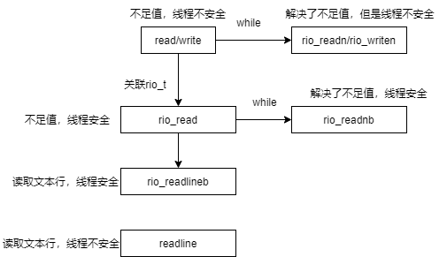
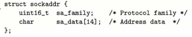
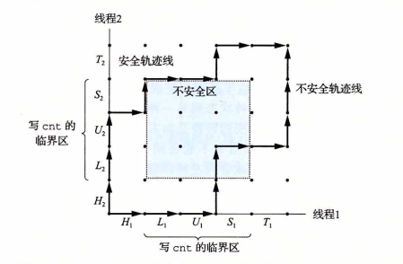

# 深入理解计算机系统（三）

## 10 系统IO

输入输出(IO)是主存与外部设备之间的数据交换。

### 10.1 Unix IO

unix中一切皆文件，包括IO设备，那么输入输出可以视为对相应文件的读写，使得输入输出的方式较为统一

* 打开文件：使用open函数，内核程序给文件返回文件描述符（一个整数），应用程序只需记住这个描述符就可找到文件，文件具体信息由内核记录。
* 文件描述符(fd)：非负整数，每个进程默认打开3个文件，标准输入0，标准输出1，标准错误2。一般open函数新打开一个文件，就返回给这个应用程序最低的未使用文件描述符，这个过程其实相当于在文件描述符表插入一个新项。
* 当前位置k：内核为每个打开的文件记录一个文件位置k，它是从文件头开始的字节偏移量。
* 读写文件：读n个字节到内存——从k读取n个字节到内存，同时更新文件位置为k+n，当k>=sizeof(文件长度)时触发EOF信号（注意文件结尾并没有EOF符号）；写n个字节到文件——从k往后写n个字节，更新文件位置k+n。
* close通知内核关闭文件，内核释放文件打开时的数据结构，恢复描述符到可用描述符池

### 10.2 文件

一个Linux文件存在type标识其类型，常见文件类型包括普通文件(包括只含ASCII或UNicode字符的文本文件和二进制文件(非文本文件的普通文件))、目录、套接字、命名通道、符号连接。

### 10.3 开关文件

```c
int open(char *filename, int flags, mode_t mode);
//返回文件描述符(int类型)
//flags是对文件的操作方式，包括只读、只写、可读可写
//mode是访问权限，即(拥有者/同组/所有人是否可用读/写/执行这个文件)，可以将一些常用的条件或起来形成集合A，然后在umask中灵活地选择一些条件B，那么最后这个文件实际权限就算A&~B
int close(int fd);
//关闭一个已关闭的描述符会报错
```

### 10.4 读写文件

```c
ssize_t read(int fd, void* buf, size_t n);
//从fd当前位置复制n个文件到内存位置buf，返回-1表示出错，0表示EOF，否则返回实际传送的字节数
ssize_t write(int fd, const void* buf, size_t n);
//从内存buf复制n个字节到fd的当前位置
//size_t和ssize_t有什么区别，前者在x86中被定义成无符号long，因为读取的字符数一般不可能是负数；后者是有符号的，因为read和write可能返回负数
```

不足值问题：

有时候我们要求读写n个字节，但是实际传送的字节不足n个，也就是说read和write的返回值会小于n，这种情况是由于读到EOF、从终端读、以及网络问题。

为解决不足值问题（保证要求传输多少最后就返回多少），那么需要通过while来调用read和write保证传输干净，或者利用封装的rio包。本书封装了一个解决不足值问题的rio包。

**rio包的优化：**

普通read函数和write函数：存在不足值问题，在一些要求鲁棒性的程序中会出现问题。

rio_readn和rio_writen函数：rio包对read和write的封装，内部使用while尽可能地read和write，保证没有遇到EOF时返回的是要求读取的字节数，遇到EOF则返回实际读取的字节数。但是rio_readn和rio_writen都不是线程安全的，它们直接往内存里写，一旦切换线程了那么读写内容不一样的线程可能会读写到错误的内存位置。

rio_read函数：带有缓冲区的IO函数是线程安全的，rio_read就是read函数的带缓冲区版本，它和read的语义几乎一致，唯一的区别在于实现rio_read时把fd和一个缓冲区结构体rio_t关联起来了。调用rio_read时，检查读缓冲区rio_t中是否有未读数据，如果有先将其读取到内存中；否则先把数据读到缓冲区，再从缓冲区把数据读到内存中。

rio_readnb：rio_read解决不足值的版本。

readline：封装函数，读取一个文本行，它虽然有缓冲区，但是缓冲区是静态的，依然不是线程安全的。

readlineb：和普通缓冲区rio_t关联，基于rio_read实现的线程安全的版本，它不是对readline的封装。



### 10.5 读取元数据&文件目录

```c
int stat(const char *filename, struct stat* buf);
int fstat(int fd, struct stat* buf);
```

读取文件元数据到buf中，一个使用的是文件名，另一个使用的是文件描述符，stat是一个记录文件所有元数据的结构体。

```c
DIR *opendir(const char *name);//以目录名为参数，返回指向目录流DIR的指针
struct dirent *readdir(DIR *dirp);//dirent是目录项的结构体，包括inode号和文件名，每调用一次readdir都会返回指向下一个目录项的指针（类似在目录流上的迭代器）
```

### 10.6 共享文件

一图胜千言：


注意，一个进程可多次open一个文件，两次open返回的fd位于这个进程的描述符表中的两项、在打开文件表中也是指向不同的文件(同一个文件可在打开文件表上重复多次)、但是对应v-node表中一个文件。

父进程fork一个子进程，子进程继承父进程的文件描述符，两个进程描述符表中同一条目指向打开文件表中同一文件。练习10.3可以体现这个问题。

### 10.7 IO重定向

linux中经常有这种重定向语句

ls > foo.txt   把ls的结果输入到foo.txt中。

重定向函数

```c
int dup2(int oldfd, int newfd);//在文件描述符中将oldfd的内容覆盖newfd的内容
```

这样newfd指向的打开文件表项不再是它自己的原来的文件，而是oldfd对应的文件，也就是说此时oldfd和newfd指向同一个打开文件表中同一个文件了。比如上面的foo.txt的fd为4，那么执行dup2(4,1)即可，让标准输出1指向foo.txt4。

### 10.8 标准IO

C提供了更加高级的输入输出函数，被称为标准IO库，替代Unix IO函数。标准IO将文件模型化为一个流，流就算指向FILE类型文件的指针，流是对文件描述符和流缓冲区的抽象。流缓冲区和rio的目的一样，那就**是尽可能少地调用开销较高的Unix IO函数**。

### 10.9 总结


在使用这些IO函数时有一些要注意的地方：

* 尽可能使用基于Unix IO封装好的标准IO（带缓冲区，更加高效，减少调用Unix IO的次数），而不是直接使用Unix IO。
* 不要使用读文本文件的函数(scanf、rio_readlineb)去读二进制文件。
* 对网络套接字使用自己封好的RIO函数，而不要使用标准IO。

第三点的原因在于，标准IO某种程度是双工的，就算说拿到一个文件FILE之后，可用对他read之后，再对他进行write，只要你在输入和输出之间调用lseek重新设置文件位置。但是，对于套接字文件，对它使用lseek是非法的，所以不能对同一个文件进行输入和输出两项操作了，而套接字这种网络通信文件，肯定是既要对它读也要对它写的。如果选择打开这个文件两次，一个专门用于读，一个专门用于写，那关闭文件的时候就要关闭两次，即对一个套接字文件调用两次fclose，在多线程场景下会导致问题。

这个也有反例，见11.3 CGI

## 11 网络编程

每个网络应用都是基于客户端——服务端模型组成，客户端和服务端之间的交互被称为事务（不同于数据库中的事务）。注意，这里的客户端和服务端指的都是进程，而不是机器。

### 11.1 网络结构

从微观到宏观：

* 对主机来说，网络只是一种IO设备，是一个文件，可对其进行输入输出操作
* 多个主机由集线器连接到一起组成一个以太网段（一个楼层或房间），关注集线器的性质
* 使用网桥连接多个以太网段组成局域网(LAN)，称为桥接以太网
* LAN可以由路由器连接起来，组成WAN
* 因特网：通过ip地址和tcp/ip协议栈将全球主机互联

域名和ip地址：可以是一对一、多个域名对应一个ip地址、多个域名对应同一组ip地址。localhost也是一个域名，代表本节，对应回环地址127.0.0.1

### 11.2 套接字接口

套接字：网络连接中的一个端点，每个套接字都有套接字地址，地址格式为"ip地址：端口号"

套接字接口：一组函数，用于网络连接。

因特网类型的套接字地址结构：sockaddr_in (这里in代表因特网)


AF_INET代表ipv4，其他两个成员代表端口号和ip地址，网络程序将32位的ip地址封装到结构体类型in_addr中了。

这个地址有很强的因特网色彩(ip协议)，一些套接字接口(connect,bind,accept)在设计时希望可以传入更常用的套接字地址类型，可以兼容其他类型的协议，一个通用的套接字地址为：sockaddr



使用这些接口函数时需要把sockaddr_in转成sockaddr。

服务端和客户端套接字接口的工作流程：


accept等待客户端的连接请求到达listenfd，服务端客户端同时创建了主动套接字，但是后面会进行不同的流程，服务端的套接字会转变为监听套接字，最后接受连接之后还会建立已连接套接字。

服务器连接结束之后别忘了close掉connfd，客户端close掉clientfd，listenfd继续监听。

函数签名

```c
int socket(int domain, int type, int protocol);//返回套接字描述符
int connect(int clientfd, const struct sockaddr *addr, socklen_t addrlen);
//描述符，addr是要连到服务端的套接字地址（客户端是怎么知道的）,addrlen是因特网套接字地址sockaddr_in的长度
int bind(int sockfd, const struct sockaddr *addr, socklen_t addrlen);
//通知内核联立sockfd和addr
int listen(int sockfd, int backlog);//转化sockfd为一个listenfd，侦听连接请求
int accept(int listenfd, const struct sockaddr *addr, socklen_t addrlen);
//在addr中写入客户端的套接字地址，返回已连接描述符
```

addrlen表示addr对应的sockaddr_in的大小。

已连接描述符（存在于一次连接的生命周期）!=侦听描述符（存在服务器整个生命周期），每次新接受一个连接都创建一个已连接描述符，这样设计可以让一个侦听描述符处理多个连接请求，基于这个原理可以创建并发服务器。

主机名字符串host(ip地址)、服务(端口)service和标准套接字结构之间的互相转化：

```c
int getaddrinfo(const char *host, const char* service, const struct addrinfo *hints, struct addrinfo ** result);
//host、service==>套接字地址结构
int getnameinfo(const struct sockaddr *sa, socklen_t salen, char *host, size_t hostlen, char *service, size_t servlen, int flags);
//套接字地址结构==>host、service
```

* getaddrinfo：给定主机和服务名，返回一个指向addrinfo类型的指针，记录在result中。

  

  一个主机名+服务名可能对应多个addrinfo，这些addrinfo以链表组织起来，result指向链表的头。addrinfo内部维持一个指向套接字地址的指针。主机名和服务名可以有一个为NULL，比如服务名为NULL时，那返回的addrinfo对应的主机名就都是host。但是不能都为NULL。hints是addrinfo类型，可以理解为对返回结果的一种筛选或者控制，比如指定hints中的ai_family为AF_INET，那返回的addrinfo的ai_family都是AF_INET(ipv4)

  addrinfp中很多字段可以和socket、connect等函数的参数对应上，比如ai_family字段对应socket的domain,实际可以先调用getaddrinfo拿到addrinfo，然后到addrinfo取出字段作为connect的参数进而调用connect。

* getnameinfo：sa指向套接字地址、host和service指向大小为hostlen和servlen的缓冲区。将sa中的主机名和服务名复制到host和service。flags是位掩码，控制返回结果的格式，NI_NUMERICHOST要求函数返回一个数字类型的host(实际就是32位ip地址)

套接字接口辅助函数：

将前面介绍过的函数组合到一起，封装为高级的辅助函数：

```c
int open_clientfd(char *hostname, char* port);
//客户端指定服务器的hostname和端口，与其建立连接，返回描述符或-1
int open_listenfd(char *port);
//服务端指定端口port监听，返回监听描述符或-1
```

这两个函数内部逻辑为：根据参数调用getaddrinfo返回对应的addrinfo——>遍历addrinfo，找到套接字地址，获取socket、connect那些函数的参数，挨个试能不能执行成功，成功了就返回描述符，否则返回-1.

echo服务器：

分为客户端程序和服务端程序，客户端反复读取文本行发送给服务端，服务端输出这些文本。

### 11.3 web服务器

web服务器响应给客户端的内容与MIME有关，如text/html代表html页面，image/gif代表gif图像

web服务器提供的内容包括

* 静态内容（从磁盘拿的）
* 动态内容（运行一个可执行文件，把它的输出展示给客户端）

可通过url指定服务器磁盘上的静态文件，也可以通过Url指定可执行文件，比如执行/cgi-bin/adder这个程序，传过去两个数，返回这两个数之和，那么请求url可以写为：

http://hostname:port/cgi-bin/adder?1&2

让程序计算1和2之和并返回。

服务器接到这样一个进程后，立刻fork一个子进程，让子进程执行cgin-bin/adder，这种接受客户端请求然后去执行的程序被称为CGI程序。CGI程序有很多环境变量，比如QUERY_STRING就保存查询字符串1&2，程序可以从环境变量中获取到1和2，在子进程加载CGI程序前，CGI将标准输出重定位到与客户端关联的已连接描述符描述符，使的输出到标准输出的内容可以直接输出到客户端。

注意，CGI程序中可以使用标准IO而不用使用RIO，原因在于它不用显式关闭描述符，应用程序退出之后，内核关闭所有文件描述符。

Tiny Web项目几个值得注意的点：

* 返回给客户端一个静态文件时，做法时先把静态文件通过mmap映射到虚拟内存中，然后把这段内存的数据复制到connfd
* 响应动态请求时的流程：fork子进程——>设置环境变量(保存url中的参数供程序使用)——>dup2重定向标准输出到connfd——>execve动态程序。主进程wait子进程执行结束后退出。

## 12 并发编程

三种构造并发程序的方法：

* 进程：每个逻辑流一个进程，由内核调度，进程之间通过IPC通信，各逻辑地址空间独立
* IO多路复用：执行一个逻辑流相当于进程中进入了某种状态，由程序员调度，共享地址空间
* 线程：单一进程，内核调度，共享地址空间

### 12.1 基于进程的并发

前面提到监听描述符和已连接描述符的区别，多个已连接描述符使服务器可以处理多个客户端的连接，每个连接有一个已连接描述符。如下图就是一个listenfd=3的服务器，处理两个客户端的连接请求，这两个客户端对应的connfd分别是4和5


每当接受到一个来自一个客户端的请求，父进程就产生一个connfd，然后fork一个子进程来处理和这个客户端的连接。

注意，子进程一开始全盘继承父进程的地址空间和文件描述符，所以父进程会有connfd和listenfd，子进程也会有listenfd和connfd。父进程不需要connfd，所以**一定**要在fork子进程后就把它关闭；子进程不需要listenfd，所以**可以**关闭listenfd。为什么前者是一定，后者是可以呢？因为子进程处理完连接，exit之后，子进程的所有打开的文件描述符将自动关闭，即使不手动关listenfd，那子进程死之前也会把它关了，不会产生内存泄漏问题；但是父进程如果不手动关connfd，子进程退出后，connfd以及它对应的文件已经没用了，但是还存在一个父进程的引用，所以文件不会被回收，会导致内存泄漏。

### 12.2 基于IO多路复用的并发

IO多路复用的大概思想：

并发涉及到调度问题，即让谁执行。基于进程的并发是由内核实现调度的，由内核决定让哪个进程控制cpu；对于读写IO文件的程序来说，执行哪个程序也取决于IO设备什么时候准备好了，IO设备没准备好的程序，就是让它上CPU也没用；而不同IO设备准备好的时间是有先后的，所以IO多路复用的观点是让应用程序自行调度，检查哪个io设备准备好了就执行哪个程序。

执行检查的函数叫select，它是阻塞的，一旦有IO事件发生后结束阻塞，把控制返回给应用程序，


fdset是描述符集合，描述符集合相当于一个大小为n的位向量b0,b1,...,b(n-1)，这里的n就是参数n，位向量的大小，相当于【最大描述符+1】。bk=1时，k才是fdset中的一个元素。select函数检测到fdset中有描述符准备好时就会返回，并且重新设置参数fdset，将准备好的描述符k设置为bk=1，其他为0。

在调用select函数时，会用到两个fdset，一个是readset，用于标记位于fdset中的元素，下图0和3位于readset中，最大描述符为3，n=4。


另一个fdset是readyset，它被readset初始化，它被传入到select函数中，位为1的描述符表示是需要select监视的描述符，像上面的1、2select就不监视。当有描述符准备好之后，立刻修改readyset并返回，把准备好的描述符置为1，比如描述符1准备好了，那么readyset变成：


stdin准备好了的标志：发送了输入的IO事件，比如在键盘上打字，那么stdin就准备好了

listenfd准备好了的标志：监听到一个客户端连接请求

connfd准备好了：客户端/服务端传来数据

**设计一个IO多路复用的并发服务器**

一个服务器处理多个客户端的连接，而且还不fork新进程，在一个进程中完成调度，这个时候可以使用描述符池pool实现调度：


它内部维护一个listenfd和多个connfd，readset和readyset分别记录活跃的被检测的和准备好的描述符。FD_SETSIZE是最大描述符个数，clientfd是描述符的数组，用于检索准备好的connfd；clientrio是与这个描述符相对应的缓冲区用于读写。

起初clientfd是这样的，第一个元素是listenfd（假设描述符为4）,readset中也只有listenfd，其他元素初始值为-1：


当select监听到listenfd准备好的时候，就创建一个connfd，把它加入到clientfd和readset中，所以经过一段时间之后，clientfd可能是这样的，有一个listenfd和3个connfd：


select监听所有readyset的所有元素，返回准备好的描述符个数n_ready


这里揭示了maxfd的作用：记录被监视的最大fd的编号，用于select的n

知道有描述符准备好之后：

* 如果是listenfd准备好了(FD_SET(listenfd,&pool.readyset))，那就创建connfd，把它加入clientfd和readset
* 如果是其他描述符准备好了，那就遍历clientfd，检查这个connfd是否准备好了，如果准备好了就开始接受客户端发来的数据。 

遍历数组的终止条件：maxi记录数组此时保存过connfd的最大长度，每次新加入一个connfd时都要更新maxi,maxi起到加速作用；此外准备好的描述符只有pool.nready个，每次找到一个已经准备好的描述符就将其减1，如果遍历数组时已经找到pool.nready个描述符了就不用往下遍历了，起到加速作用。

处理完一个connfd时，将其在readset中置为0表明不再监视它，然后在clientfd中将它对应的位置置为-1，以后添加新connfd时会看前面有没有空出的-1，有就放在那里。

下图体现了处理完connfd6时，它的位置空出，然后交给新的connfd8，maxi之前的位置都存在过描述符，所以要遍历到maxi


IO多路复用的优点：在一个进程中，共享地址空间，使得共享数据很容易；避免了进程的上下文切换，效率高；缺点：因为需要自己实现调度逻辑，编码复杂

### 12.3 基于线程的并发

线程结合了进程和IO多路复用的特点，它们贡献同一个进程空间，但是由内核调度。

主线程可以创造对等线程，对等线程与主线程可以切换执行，线程切换的开销远小于进程切换的开销。

C语言处理线程的接口：Posix线程。内部定义许多操作线程的函数：

```c
====创建线程=======
int pthread_create(pthread_t *tid, pthread_attr_t *attr, func *f, void *arg);
//创建一个线程后会给这个线程分配一个线程id，放到tid中；f为函数指针，让线程执行这个函数f，arg是指针类型，是f的参数.
====终止线程=======
线程执行完毕自动终止(对应第一条隐式终止)、主线程调用phread_exit等待所有线程终止后主线程和进程终止、某个线程调用exit终止该线程所在进程的所有线程和进程、a线程调用pthread_cancel(b.tid)终止线程b
====回收线程======
pthread_join(pthread_t tid,void **thread_return)
该函数会阻塞直到tid结束，把tid的返回放到thread_return，然后回收tid的内存资源
和wait不同，它不是等待任一个线程终止就停止阻塞，因为这样设计太复杂，只可以指定某个线程等它终止。
====分离线程=======
线程默认是可结合的，可结合意味着可以被其他线程终止或回收，被其他线程回收之前内核资源不释放。如果线程是分离的那就无法被其他线程杀死或回收，它自己终止后由系统自动释放内存资源。分离线程常用于并发服务器，如主线程创建对等线程处理连接，大可使这个线程成为分离的(unjoinable)，等它自己终止了内核肯定会释放其内存资源，主线程就不操心怎么回收它了。
常见用法：
int pthread_detach(pthread_self());//一个线程传入自己的线程id自己detach自己
对等线程也可调用此函数让其他线程分离
====初始化线程========
int pthread_once(pthread_once_t *once_control, void (*init_routine)(void));
once_control一般都是PTHREAD_ONCE_INIT，是个全局变量，第一次确定once_control调用pthread_once时会执行函数init_routine，后面once_control与第一次调用相同时就不会再执行init_routine了。根据这个特性可以在init_routine中放入一些初始化函数初始化一些线程共享的变量，每个线程调用pthread_once时只会执行第一次
```

基于线程的并发服务器：

Accept一个连接，使用指针*connfdp执行得到的connfd，然后把connfdp作为pthread_create的第四个参数，创建新线程，让它对这个connfdp进行读写。因为线程的调度由内核决定，所以如果使用同一个指针connfdp去引用不同的conffd，可能会导致竞争，比如某几个线程读写同一个文件。所以对于一个connfd就要开辟一个堆内存去保存它的connfdp，这样避免了竞争。

练习12-5表明，线程共享内存空间，在对等线程关闭一个文件后就无需在其他线程关闭它了。

### 12.4 线程内存模型

这里如果一个变量并非是一个线程一份而是多个线程对应这一份那么认为这个变量是线程独立的，反正不独立，一个线程修改线程独立变量，其他线程不可见；修改了不独立变量，那么其他线程可见

线程不独立的变量：全局变量(定义在函数之外)、静态变量(定义在函数内部的非static)

线程独立变量：本地自动变量(定义在函数内部的非static变量)、通用目的寄存器

线程独立==无法共享？

否。其他线程可以持有指向本线程本地自动变量的指针间接达到共享。主线程定义了一个int i ，让全局变量指针p指向i，然后把p传给对等线程，那么即使i是线程独立的，但是其他线程也可以通过p去修改i，这种改变对于各个线程是可见的，所以i实际上是共享的。

线程不独立==一定共享？

否。某个全局变量p，只有主线程使用它了，其他线程压根没用到它，那么p实际上不是共享的，只有主线程在用。

### 12.5 信号量

多线程执行一段代码时会产生问题


图中cnt是全局的，初始值为0。两个线程并发执行cnt++时，最终cnt结果未必等于2niters

cnt++可以拆分为3个指令：

```
cnt内存->寄存器;
寄存器+1;
寄存器->cnt内存
```

如果A线程执行到第二步，此时B线程获取控制器执行两步，那么最终cnt=1。这里寄存器是线程独立的。

说明并发的图：进度图


横纵坐标为线程执行序列，中间的轨迹就是两个线程的并发执行情况，沿横轴的是线程1在执行，纵轴的是线程2在执行。

临界区：进度图中操作共享变量的区域，这一区域内出现并发的话就会导致问题，要保证安全只有确保一个线程在操作共享变量时不被打扰，反应到进度图上就是不允许轨迹线经过这一区域。




信号量s及其操作：P(s)，V(s)，把P和V放在操作全局变量的前后位置保证同时只有一个线程可以操作共享变量。

多个线程阻塞在P(s)时不能预测V会唤起哪一个线程。

使用信号量的互斥：互斥锁是值总为0和1的信号量，表示一组资源个数的信号量被称为计数信号量。

对于互斥锁来说，它的值永远不可能为-1，因为不会有两个线程都能执行P(s)让s-1，在进度图中加上不同操作后信号量的值，s为-1的区域是禁止区，不可能有轨迹线到达这里（到达这里意味着信号量为0时又被减了)，下图的临界区就是禁止区，刚好保证不会有轨迹线经过临界区。


**生产者消费者问题**

保证互斥访问缓冲区的互斥信号量mutex，阻塞生产者的计数信号量slots(初始为n)，阻塞消费者的计数信号量items(初始为0)，缓冲区大小为n。

这里存在的问题：为什么先执行P(slots)/P(items)，后执行P(mutex)，而不是使用相反顺序？

假设使用相反顺序，生产者线程获取mutex后一直在生产，导致slots为0了，那么后面的生产者会阻塞在slots上，也不会释放mutex，导致消费者线程阻塞到mutex上，形成死锁。消费者线程先获取mutex也是一样的。


上图就是在生产者——消费者进程开始时slots=n，items=0的临界情况，斜线表示slots禁止区的情况，竖线表示mutex禁止区。把获取mutex放后面时（第一幅图），此时轨迹线不可能向纵轴移动，因为items=0，不可能执行P(items)成功，所以轨迹线只能贴着x轴前进，不会发生死锁现象。而第二幅图slots的禁止区上移了，若轨迹线先沿纵轴走了一步，结果发现无路可走了，不论向上还是向右都会进入禁止区，这就是**死锁**

**读写者问题**

读者可以并发访问共享区，但是读写对共享区的访问是互斥的。读写优先级可以分为读者优先(有读者来了就立刻让它读，除非此时写正在占有共享区)和写者优先(写准备好了就可以，其实叫读写公平更合适一点)

读优先的读写代码演进：

1.首先保证读写互斥，使用互斥锁w

```c
//读者
P(w);
read;
V(w);
//写者
P(w);
write;
V(w);
```

2.这样的话当读和写都阻塞在P(w)的时候，V(w)会唤醒读还是写就不好说了，一旦唤醒的是写那么读就要等待，所以要保证一个读线程获取w之后，后面的读线程不用阻塞在P(w)，直接访问：

```c
//读者，使用readcnt(初值0)记录这是第几个读线程，第一个让它获取锁，后面的直接放过，最后一个读线程释放w
read_cnt++;
if(read_cnt == 1) {
    P(w);
}
read;
readcnt--;
if(read_cnt == 0) {
    V(w);
}
```

这样读线程之间的竞争会产生问题，比如第一个线程刚readcnt++，切到第二个线程执行了readcnt++，回到第一个线程时跳过判断条件，导致读线程根本没用获得w，会把写线程放进来。

采用下面这种方式会使第二个线程阻塞在P(w)，如果后面不断来读线程，会使第二个读线程产生饥饿

```c
if(read_cnt == 0) {
    P(w);
}
read_cnt++;
```

3.终极版——使用互斥锁保护read_cnt

```c
P(mutex);
read_cnt++;
if(read_cnt == 1) {
    P(w);
}
V(mutex);
read;
P(mutex);
readcnt--;
if(read_cnt == 0) {
    V(w);
}
V(mutex);
```

**基于线程的并发echo**

类似生产者消费者模式，主线程生产connfd，工作线程消费connfd


设计思路：主线程创造NTHREADS个工作线程，并让工作线程自己分离自己，让它们处于循环状态；没创建一个connfd，就把它插到全局缓冲区中，工作线程从缓冲区拉去connfd然后读取数据，最后工作线程释放connfd，开始新一轮的检查。

缓冲区设计的很巧妙，有两个指针front和rear，每次加入一个connfd就前进rear；每次消费一个connfd就前进front，使用缓冲区大小作为计数信号量保证front不会超过rear。

### 12.6 其他并发问题

线程不安全的函数：某个函数由多线程执行时会出现不同的结果。

比如：

* 不保护共享变量
* 多次调用时需要保持状态的函数
* 返回指向静态变量的指针的函数
* 调用了线程不安全的函数

1的解决方案：加上PV操作。

2的一个例子:


可以看到rand函数给定种子后，产生的值取决于之前的值，会形成一个序列，比如10，20，30

单线程的话肯定没问题，种子固定那么序列固定，但是多线程的话，线程1计算完新的next_seed的值还没赋给next_seed之后，线程2使用原来的next_seed又计算了一次，最后的序列可能是10，20，20

本质上还是因为对共享变量next_seed的并发访问。

解决方案是把next_seed变成非共享的。

3也是尽量返回指向局部变量的指针。

总之，要保证线程安全，对于共享变量的访问要加锁，或者尽量使用线程独立的变量代替共享变量。

**可重入函数**：被多个线程并发调用时不会引用任何共享数据。

可重入函数是线程安全函数的一个子集。

值传递的函数是显式可重入的，引用传递但是没用引用共享变量的函数是隐式可重入的。

**死锁**


在死锁状态，轨迹线无法前进。


