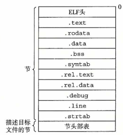
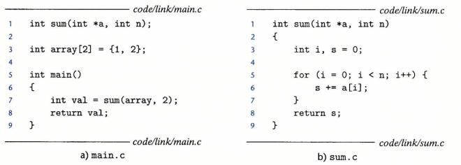
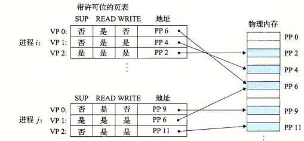

# 深入理解计算机系统（二）

## 7 链接

链接：将不同代码、数据片段搜集并组合为一个单一文件，链接过程可以发生在编译、加载和运行时，链接由链接器执行。

### 7.1 编译器执行流程

```
gcc -o -Og prog main.c sum.c
```

执行gcc可以调用编译驱动程序，将源文件main.c和sum.c编译为可执行文件prog，在命令行中调用./ prog就可以执行了，一组编译驱动程序包括预处理器、编译器、汇编器和链接器。

gcc参数的含义：

https://www.runoob.com/w3cnote/gcc-parameter-detail.html

-o:自定义输出文件的名字，如果不使用这个参数那么默认名字是xxx.out。

-O:优化生成代码

-g:生成调试信息

对于main.c，它的流程为：

main.c(C语言)——(预处理器)——>main.i(一个ASCII码的中间文件)——(编译器)——>main.s(汇编语言)——(汇编器)——>main.o(可重定位文件，还是汇编语言)——（链接器，执行符号解析+重定位）——>可执行文件

最后链接器把main.o和sum.o链接为prog。

```
ld -o prog ./tmp/main.o ./tmp/sum.o
```

ld是链接指令，./tmp是生成.i文件时产生的一个临时文件夹。、

链接器的两个作用：符号解析（把对符号的一个引用和这个符号关联起来）、重定位（把符号定义和内存位置关联起来，然后修改对符号的引用，让符号引用指向这些内存位置）

可重定位目标文件(.o)、可执行目标文件和共享目标文件都是目标文件，在unix系统中目标文件都是ELF格式。

### 7.2 可重定位文件格式

ELF格式的.o文件格式：



* ELF头：文件的一些元数据，比如文件类型、机器类型等
* 一个.xxx就是一个节
  * .text：已经被编译的程序的机器代码
  * .data：经过初始化的全局数据和静态C变量（包含全局静态和全局非静态）
  * .bss：保存A.被初始化为0的全局数据和静态C变量，B.未被初始化的静态变量。.bss本身不占存储空间，就是一个占位符，那些未被初始化或者被初始化为零的变量在运行时在内存中分配空间而不是保存在.o文件中（不占目标文件所占的磁盘空间），区分.data和.bss是为了提升空间效率，反正没有被初始化，运行时再分配空间也来得及。
  * 局部变量保存在文件中吗？静态局部变量保存在符号表中。
  * .symtab：符号表，存放程序中使用的符号（**只有函数+全局变量这两种，不包含局部变量**）的信息，不管是否以-g去执行编译都会有这种符号表。
  * .debug：符号表，存放程序中使用的符号（**函数+全局变量+局部变量**）的信息，只有加上-g才会在生成的.o文件中包含.debug节。
  * rel.text&.rel.data：存放程序和数据的重定位条目。
  * .line：字符串表，是一个字符串序列，每个字符串以null结尾，内容为.symtab和.debug中的符号名，还有节头部表的节名。
  * 节头部表：保存每个节的位置和大小。
* 在可重定位文件中还有一类特殊的伪节，这些节保存一些尚未运行时的一些特殊的符号，节头部表没有伪节的信息，可执行文件中没有伪节。如COMMON保存未被初始化的全局变量符号。为啥不把这个符号保存到.bss里？与后面符号解析的强弱引用有关。未被初始化的全局变量，首先它是可以跨文件使用的，有可能这个目标文件没有定义这个全局变量符号，在其他地方定义了，这个符号的意思可能还要后面环节才能确定；而已经初始化的全局变量的值目前就能确定，静态变量不管初始化与否，它不是全局使用的，其他文件中如何定义的一个同名静态变量符号与当前的没有关系，所以也不用放到后面跟其他目标文件链接时去确定符号的定义。一句话，COMMON保存需要和其他目标文件配合来确定定义的符号。

[^1]: C语言中的static表示可见性，用static修饰的变量和函数只能在该源文件内被访问，详见C程序设计语言4.6

### 7.3 符号表

一个目标文件中的符号表是保存这个目标文件中所使用的所有符号的表。

符号分类：

* 由模块m定义的，可以被其他模块使用的全局符号（非静态的C函数和非静态的全局变量）
* 由模块m定义并使用的局部符号（静态的C函数和静态的全局变量），不能被外部模块引用。
* 模块m引用的其他模块定义的符号，即外部符号（非静态的C函数和非静态的全局变量）

非静态局部变量不作为符号表.symtab中的一个表项。

每个符号在符号表中有一个条目，条目结构如下：


符号表是什么时候产生的，首先在main.i中已经有了符号，编译器把这些符号输入到.s文件中，汇编器把这些符号组成表放到.o文件中。

* .name：这个符号的名字在字符串表中的偏移（这里不是符号名字而是一个偏移量）
* .value：符号地址，对于可重定位文件来说，符号的value是该符号与该符号定义所在的节的一个偏移量；对于可执行文件，此时符号已经有了对应的内存地址，故value为内存地址。
* .binding：符号是本地还是全局的
* .section：符号定义所在节在节头部表的索引

### 7.4 符号解析

链接器执行符号解析：将输入到链接器中所有的可重定位目标文件中的【符号引用】和【符号表中的定义】关联起来。对于不是在当前模块中定义的全局符号，会假设该符号在其他模块中定义了，并为它生成一个链接器符号表条目。

全局符号的定义模块不明确，A模块的使用的一个符号可能定义在B模块中，所以全局符号就有强弱之分，经过初始化的符号就是强符号，未经初始化的符号就是弱符号。在链接时，出现两个同名不同义强符号，报错；同名一强多弱，择强；多个同名弱，随机选一个符号定义和这个引用绑定（反正都没初始化）。

汇编器把不同类型的符号放到不同位置：对于初始化为零或者不需要参考其他模块的，放到.bss中；需要参考其他模块再确定含义的，放到COMMON中。

**静态库**

在链接时，一些标准函数，比如输入输出函数，它们放在静态库libc.a中，在链接时如果可重定位文件中用到了libc.a中的符号，那么链接器就会把libc.a也作为链接中的一个输入（C编译器驱动总是传递libc.a给链接器）。

为什么使用库这种形式保存标准函数？

* A.如果令编译器可以直接识别标准函数，会增加编译器的复杂性。
* B.如果把所有标准函数都放到一个可重定位文件中，那么这个文件过于庞大，而且每次对标准函数更新后都需要更新整个文件。
* C.如果把每个标准函数独立封到一个可重定位文件里，把这些文件放到一个大家都知道的目录里。那么这需要程序员在链接时手动把用到的文件链接起来，复杂且易出错。

库是什么格式？把每个标准函数封装到目标文件里，然后再把文件放到静态库里。在链接时，如果用到了库中的某个函数，那么不用在ld命令后写这个目标文件的名字而是直接写这个库的名字，这是相对方案C的优点；链接器只复制被引用的模块到内存中而不是整个库，这是相对B的优点。

静态库在系统中的保存格式：存档格式(achieve)，后缀是.a，存档文件是一组目标文件集合，存档文件有一个描述文件内各目标文件大小和位置的头部。

自定义静态库：比如你写了a1.o和a2.o，要把它们俩形成一个静态库xxx.a，使用ar工具

```
ar rcs xxx.a a1.o a2.o
```

我们的main.o文件使用了这个库中a1.o的某个函数，那么在链接main.o时的指令：

```
gcc -static -o prog main.o ./xxx.a
```

static告诉链接器应构建一个完全链接的可执行目标文件，可以加载到内存并运行，加载的时候无需链接了。

**Linux符号解析方式**

按照可重定位文件和存档文件在命令行中出现的顺序扫描，在扫描中维护一个可重定位文件的集合E，未解析的的符号集合U，以及在前面输入文件中已经定义的符号集合D。

扫描文件f：

* f是可重定位文件，把f加入到E中，根据f中的符号定义和符号引用更新U和D
* f是存档文件，尝试匹配当前U中符号和f中的符号定义，如果f中的某个成员——可重定位文件m中有符号定义匹配上U中的这个符号，那么加m到E中，同时根据m中的符号定义和符号引用更新U和D。对存档文件中所有成员都进行这个过程直到U和D不再变化。最后把f中不属于E的成员都丢弃。

都扫描完了之后，U非空就报错；否则合并和重定位E中的文件，输出可执行文件。

顺序要求：扫描过程对可重定位文件和存档文件的处理是不同的，前者可直接入E，后者需要能够匹配U中某个符号才能加入E。这种区别导致，如果解析时把存档文件放到可重定位文件前面的话，最开始U是空集，所以没有m会加入到E中，后面再解析可重定位文件的时候，遇到的未定义符号如果它的定义在存档文件中那就没法解析了。所以在链接命令行要把存档文件的位置放到可重定位文件之后。

如果库函数不是独立的之间也有依赖关系，那么需要对库进行排序，libx.a中的符号引用定义在liby.a中（或者说libx.a调用了liby.a中的某个函数和方法），那就把libx.a放到liby.a之前。

命令行上可以重复出现某个库，比如foo.c调用libx.a，libx.a调用liby.a，liby.a又调用libx.a，那编译时命令行为

```
gcc foo.c libx.a liby.a libx.a
```

liby.a解决第一个libx.a中抛出的未定义符号，第二个libx.a解决liby.a中抛出的未定义符号

最好是使一个库内不要抛出未定义符号，让上面的libx.a和liby.a合并。

### 7.5 重定位

符号解析之后，链接器就知道每个符号的大小了，比如碰见一个int a就知道它占4字节，可以进行重定位操作。

重定位步骤：

1. 将相同类型的节合并，比如将不同输入中的.data节聚合为一个.data节。
2. 将运行时内存地址赋给新的聚合节和输入模块中每个符号。（**运行时内存地址怎么确定的？**）这样每条指令和全局变量就有唯一内存地址了。(**这里猜测就是给指令和变量分配一个虚拟地址**)
3. 使用重定位条目修改代码节和数据节中对符号的引用使其指向正确的运行时地址。（指向正确的虚拟地址）

重定位最终要确定的，是代码段中各种符号的运行时地址。

汇编器生成目标模块.o时，不知道代码和数据中符号的运行时位置，此时会为最终目标未知的**引用**生成一个重定位条目，在链接的时候链接器会把重定位条目，放在.rel.data（数据符号）或.rel.text（指令符号）中。

ELF重定位条目：


* offset：需要被修改的的引用在它所在节的偏移量，
* type：重定位类型，重定位就是要给符号指定一个内存时地址，type是什么类型，就分配什么类型的地址
  * R_X86_64_PC32：重定位一个使用32位PC相对地址的引用，为引用指定一个PC相对地址
  * R_X86_64_32：重定位一个使用32位绝对地址的引用，为引用指定一个绝对地址

* symbol：标识被修改的引用应该指向的符号
* addend：偏移

**重定位算法**

* 遍历所有的节
  * 遍历这个节里所有的重定位条目
    * 判断这个重定位条目的类型
      * 把这个重定位条目对应的符号的运行时地址赋给这个引用

实例：

源码




main.o中的汇编语言：


因为main.o此时还没有被分配内存地址，可以看到指令中array和sum的地址都是由0这个占位符代替，指定还不知道要到哪里去找array和sum。

不过此时array和sum的重定位条目也确定了，对于sum，它的重定位条目为:

* offset：sum这个引用在<main\>模块的偏移量为callq指令后面的那一个字节callq为e8，从行号可以看出callq的偏移量为e（相对于<main\>这节，.text节的头部），那么sum的偏移量就是后面的e+1=f。
* type：可以看出sum是PC相对值
* symbol：这个引用指向符号sum

重定位信息要修改.text节偏移量为f的这个引用的PC相对引用地址，使其指向符号sum的运行时地址。

> PC相对引用回顾：
>
> 
>
> 这是一个使用PC相对地址的代码块，第2行jmp要调整到的地址采用的就是PC相对地址，它的最终调整地址从汇编语言中可以看到是0x8，也就是第4行的test，那么机器码为什么是eb 03呢？PC相对地址使用机器码中的编码(03)加上下一行指令的地址(0x5,也就是PC寄存器目前所保存的地址)得到0x8作为最终的调整目标。第5行也使用了PC相对地址，编码f8=(11111000)，为-8 d-8=5，故jg要跳转到0x5这一行。跳转的好处在于，即使经过重定位之后也无需修改编码。

那么现在开始修改对sum引用的地址。

此时.text节的地址已经确定了，设为0x4004d0；sum定义的地址也确定了，设为0x4004e8。指向callq 的时候，需要在机器码中把对sum那部分的地址x修改为x + Addr(callq下一条指令的地址)=0x4004e8。

此时callq下一条指令的地址就是Addr(callq)+4(占位符长度，实际上就是addend)+1(callq自身所占的字节）=0x4004d0+0xe+1+4=0x4004e3。

那x=0x4004e8-0x4004e3=0x5。

这样就该把sum对应的机器码设为0x5。

对于绝对引用array的重定位更加简单，把bf 00 00 00 00后面的00 00 00 00修改为array符号的绝对地址就行，如果array的绝对地址为0x601018，那就改成0x601018。

结果：


### 7.6 可执行目标文件

链接器输出可执行目标文件，ELF可执行目标文件格式为：


ELF头包含程序入口点。此时.text和.data已经被定位到最终运行时的内存地址。

ELF可执行文件分为只读内存段和读写内存段，连续的段被映射到连续的内存段，这种格式使其容易被加载到内存中。在程序头部表（段头部表）中会记录段和内存的映射关系。

程序头部表格式：


从上图可以看出，对齐align表示成16进制就是0x200000，代码段没占满一个align，读写段在下一个align中。而且读写段并不是从0x600000开始的，它在文件中的偏移为0xdf8，在一个新的align中也是从0x600df8开始的，满足off mod align == paddr/vaddr mod align。

这里读写段的内粗比文件中段大小多了8个字节，这是因为我们前面说.bss不占文件的空间，但是分配内存时会为.bss中初始化为零的数据分配空间。

### 7.7 加载

对于一个可执行文件prog，执行

```
./prog
```

加载器会将这个程序加载到内存（和虚拟内存建立关联），然后跳转到程序入口点执行该程序。在Linux x86-64系统中，代码段总是从0x400000开始，后面是数据段、堆等：


2^48之后就是内核内存，使用malloc增加堆的空间时brk指针向内存地址值增大的方向增长；栈空间增加时栈指针往内存地址值减小的方向增长。代码段和数据段并非紧邻，而是由于align会有间隙。在分配堆、栈和共享库的时候，链接器会使用地址随机化策略，随机分配一个起始地址，但是它们三的相对位置不变。

可以看到，可执行目标文件的前五节.init、.text、.rodata、.data、.bss和虚拟内存中的前面的只读段、读写段相对顺序是一致的，.init从0x400000开始。

加载器的工作：

shell运行一个程序——>父shell进程生成一个子进程——>子进程执行execve命令启动加载器——>加载器删除子进程现有的虚拟内存段，创建新的代码、数据、堆、栈，并将堆栈初始化为零——>将虚拟空间中的页映射为可执行文件中的页的大小，将代码和数据段初始化为可执行文件中的内容——>加载器跳转到__start地址，调用main函数。

**注意：除了一些头部信息外，在加载过程中没有任何磁盘到内存的数据复制，只有当CPU开始执行并调度虚拟页的时候才会有数据进入内存。**

### 7.8 共享库

共享库是对静态库的一个改进，静态库的缺点在于：

* 许多代码可能使用静态库中提供的标准函数，如果把这些标准函数代码直接复制到文本段中，是对内存的极大浪费。

共享库是一个目标模块，可以在运行或加载时加载到内存的任意位置并与内存中的程序链接起来，这种链接方式是动态链接，由动态链接器执行，linux中共享文件以.so结尾。windows的.dll就是共享库。

所有引用了共享库的可执行目标文件可以共享这个库的代码和数据，无需将其复制到自己的代码和数据段中；在内存中.so文件的.text节副本可以被不同进程共享。

以a1.c、a2.c创建共享库xxx.so，编译指令：

```
gcc -shared -fpic -o xxx.so a1.c a2.c
```

-fpic：指示编译器生成位置无关代码 -shared：指示链接器生成共享目标文件

将xxx.so和main.c链接为可执行文件prog2

```
gcc -o prog2 main.c ./xxx.so
```

此时prog2已经能够在运行时和xxx.so动态链接。

链接时做的事：

链接器会先将xxx.so中的一些重定位和符号表信息复制到prog2中（先执行一部分静态链接），但是没有把xxx.so中的代码和数据复制到prog2中

加载和运行时做的事：

* 加载prog2到内存
* 根据prog2中的.interp节找到动态链接器，加载并运行动态链接器（动态链接器本身就是一个.so文件）
* 动态链接器重定位xxx.so的代码和数据到某个内存段
* 动态链接器重定位prog2对xxx.so中的符号引用

例子如下：.so文件在链接的时候有部分信息被复制到prog2中，最后的动态链接器将其和已经被加载到内存的prog链接起来。


上面是prog在加载时执行的动态链接。实际上，在prog2运行时也可以执行动态链接，而且这种方式有许多好处。

比如一个Web服务器，里面包含处理不同请求的动态内容，没有使用动态链接时会fork一个子进程，然后让生成动态内容的CGI程序在子进程中运行，开销比较大。使用动态链接之后，可以把这个动态内容放到共享库里，这样应用程序可以直接加载、链接这个函数，然后调用它，这样开销就小了很多。

Linux系统为动态链接器提供的接口：

```c
void *dlopen(const char *filename, int flag);
//加载和链接共享库filename，flag参数要么包括RTLD_NOW(通知链接器立即解析对外部符号的引用)，RTLD_LAZY(开始执行这个代码的时候再解析)
void *dlsym(void *handle, char *symbol);
//handle说一个已经open的共享库的句柄，symbol是一个符号，该方法返回该符号的地址
int dlclose(void *handle);
//如果没有其他程序使用这个共享库就卸载这个共享库
const char *dlerror();
//返回错误信息
```

**位置无关代码**

多个进程是如何共享共享库的呢？

一种常见的思路是把共享库放到一个固定的位置，其他进程都知道它在那个位置，加载器总在这个地方加载共享库。

这样设计的缺点：

* 不管进程需不需要用到共享库中的函数，这个共享库始终占一部分内存空间。
* 如果修改库使得库的大小发生变化，那么可能需要重新为库分配空间；库内的不同模块也有可能导致碎片。
* 不同系统，库在内存中的分配是不同的，这样会增加管理难度。

现代操作系统可以把共享库编译到系统内存的任意位置，而且调用方调用共享库定义的符号时无需使用链接器修改符号引用的位置。一个代码可以加载而无需重定位被称为位置无关代码。前面编译时使用的-fpic选项最后生成的就是位置无关代码(PIC)，要编译共享库必须总是使用-fpic。

对于一个普通目标模块，没必要把它编译成位置无关的，每个引用可以使用PC相对地址来编译，这样即使给这个模块加载到内存中，分配了内存地址时也无需修改这种编码。对于共享库，它内部定义的符号是给其他模块使用的，就需要把它编译为位置无关的。

要把某个模块A编译成PIC的，首先会在其数据段中生成一个全局偏移量表(GOT)，保存所有被A引用的全局数据目标，每个目标有一个8字节的条目，每个条目还有一个重定位记录。

实例：这是一个addvec.o，要把它编译为一个共享库（位置无关）

源码：


对应得可重定位目标文件：


GOT是一个列表，GOT[3]就是对addcnt这个符号的引用。看代码段，把R(Addr(下一条指令的地址)+0x2008b9)这个内存里的数据保存到rax中(rip代表下一条指令的地址)，这里就是从addl定位到GOT[3]，直接使用GOT[3]作为符号addcnt的地址。为什么直接把一个常数编码到代码段里呢？因为不论什么目标模块，其代码块到数据块的距离是固定的，GOT[3]到addl的距离也是固定的，这样即使把这个模块加载到内存之后也无需对mov重新编码。

这里addcnt是addvec.o这个模块自己定义的，如果某个模块调用定义在共享库中的符号，因为不知道这个符号的位置在哪，所以使用了**延迟绑定**技术，将符号和地址的绑定推迟到第一次调用时。这样做就无需对这个符号的引用做重定位操作了，可以节省重定位的开销。

延迟绑定的通过两个数据结构：GOT和PLT实现。一个目标模块调用了定义在共享库中的符号就会有GOT和PLT两个结构，前者在数据段中，后者在代码段中。

一个调用共享库addvec的文件的GOT和PLT：


GOT里面保存这个代码所引用的全局变量，GOT[0]和GOT[1]是动态链接器的信息，GOT[4]是调用共享库中的addvec的信息。

PLT就是动态确定符号位置的逻辑。PLT[0]是跳转到静态链接器中，PLT[2]是调用共享库符号addvec。

当程序开始执行时，GOT和PLT就会联合起来确定addvec的地址：

* 当指令执行到call addvec的时候，此时还不知道addvec，进入addvec对应得PLT[2]
* PLT[2]找到addvec对应得GOT[4]，但是此时GOT[4]也不知道addvec的地址，它又跳转回了PLT
* PLT接下来，PLT根据GOT[0]里面保存的动态链接器，以及addvec对应的符号编码0x1，根据动态链接器找到addvec的实际地址，然后改写GOT[4]为实际地址
* 以后再执行到GOT[4]的时候就知道addvec的实际地址了，直接跳过去就行，不用执行剩余部分了

大概逻辑为：

```
指令引用一个来自共享库的符号；
if (第一次引用)：
	找到GOT；
	通过动态链接器找到符号的地址改写GOT；
else:
	到GOT中直接找到引用的地址；
```

**总结：在编译和加载一个可执行目标文件时，都出了什么事？**

* 在整个编译过程的链接环节，此时要把各种分散的可重定位目标文件链接为一个可执行目标文件，首先链接器进行符号解析，把文件里用到的所有符号的定义找到（定义可能在本目标文件或其他目标文件中），然后重定位，把.data等节合并为一个大节，合并后的目标文件结构就和虚拟内存的结构对应上了，每个符号最终的地址也确定了，可以根据重定位条目，把代码中所有涉及到对符号的引用修改为它们的虚拟地址值，比如a这个符号可能在0x400010这个位置，把涉及代码中读写a的指令修改为到0x400010这个位置去读写a。
* 对于引用的来自共享库的符号，此时只是把这些符号的重定位条目和符号表信息复制到可执行目标文件中，没有在虚拟内存中给这些来自共享库的符号分配具体的位置，因为共享库的,text和.data可以加载到虚拟内存的任意位置，现在根本就不知道这些符号的地址是哪个。那么代码中涉及到引用共享库符号的代码怎么办？没事，给每个来自共享库的符号生成GOT和PLT这两种数据结构，分别放在可执行目标文件的数据段和代码段中，留着以后确定共享库地址用。
* 执行execve加载程序了，把可执行目标文件中的那些.data之类的和虚拟内存中的.data节建立关联，在目标文件的程序头部表中记录这种关联。因为一些私有的符号（所有非共享库符号的统称）位置已经确定了，建立起关联就没问题了。而对于共享库符号，现在在虚拟内存中还没有它一席之地呢，所以动态链接器开始干活，把这些来自共享库的.data、.text关联到虚拟内存的一段地址上，这段地址被关联之后就成为了虚拟内存中的共享库段。
* 程序开始从main执行了，这个时候可执行文件.data、.text涉及到引用共享库的符号还是不知道其具体地址，经过它们已经放到进程的虚拟内存中了。等到第一次执行到涉及共享库符号的指令时,动态链接器根据PLT和GOT再确定并修改代码中共享库符号的位置。这种延迟绑定技术是到执行了才修改，不是在共享库段被放到虚拟内存之后立即整体进行一次大的重定位操作，改写代码中所有共享库符号的位置，这样节省了重定位开销。

### 7.9 库打桩机制

打桩：截获对共享库函数的调用，使用自己的方法替代，有点像动态代理。给要被打桩的目标函数加上一个包装函数，让系统执行包装函数。

## 8 异常控制流

**什么是异常控制流(Exceptional Control Flow,ECF)？**

控制流：CPU运行时，程序计数器执行一系列指令：i0... ik i(k+1) ...

突变：控制流相邻指令的内存地址不相邻

异常控制流：突变可以是由程序代码逻辑导致的（内部状态变化），也可以由系统变化引起（外部变化），比如运行时收到了某个需要被处理的网络包。现代系统使控制流发生突变来处理这些外部系统的变化，这些突变就是异常控制流。

### 8.1 异常

处理器正在执行指令，执行到Icurr时，检测到有异常发生（具体表现为CPU中的状态位发生变化），于是去执行异常处理程序然后返回Icurr、Inext或者直接终止程序。


每个异常都有一个异常号，系统启动时会初始化一张异常表，异常表第k个条目对应异常k处理程序的地址。

流程：处理器检测到事件——>确定异常号——>通过执行间接过程调用触发异常——>通过存放异常表起始位置的异常表基址寄存器+异常号定位到异常处理程序并执行

异常VS过程调用：

后者把返回地址压入到栈中，而异常的返回地址需要根据异常类型来确定（比如是Icurr还是Inext）；如果处理异常时，控制从用户模式转为内核模式，那么处理器会把需要压入栈的东西放到内核栈中；异常处理程序运行在内核态下，对所有系统资源具有访问权限；异常如果中断了一个处于用户模式的程序的执行，那么会先将状态恢复为用户模式（从内核栈中弹出之前保存的状态），然后将控制传给被中断的程序。

异常分类：

* 中断：来自IO设备的信号，它是异步的，异步表示这个异常不是执行指令序列时的结果而是外部的信号。除中断外其他的异常都是同步的，同步表示这个异常是某一条指令的产物。
* 陷阱：有意的异常，用于系统调用。系统调用运行在内核模式中，可以执行特权指令，可以访问内核栈。
* 故障：错误程序引起，可以被故障处理程序修正，常见的故障：缺页异常
* 终止：不可恢复的异常，直接导致应用程序的终止。

LInux86-64的跳转表：每个条目记录了一个系统调用，帮助应用程序请求内核服务。比如read、write、fork等。C语言可以直接调用这些封装后的系统级函数，编译为汇编语言时会显示把调用的函数在跳转表中的索引（比如write对应1）放到rax寄存器中，执行syscall指令完成系统调用。

### 8.2 进程

进程：执行中的程序实例，系统中每个程序都运行在进程的上下文中，一个进程的上下文包括：

* 内存中程序的代码和数据
* 进程的栈、通用目的寄存器、程序计数器
* 环境变量、文件描述符的集合、页表、进程表

进程提供给程序独立的逻辑控制流和私人地址空间。

逻辑控制流：一个程序的指令序列。每个进程执行程序时有自己的逻辑控制流，看上去好像在独占处理器，不同进程会轮流使用处理器。

并发：执行时间想重叠的流是并发流，多个流并发执行任务的现象是并发。

多任务&时间分片：一个进程占据处理器执行任务的那一个时间片。

私有地址空间：每个进程为程序提供私有的地址空间。一般来说，一个私有地址空间会和时间内存中的字节建立关联，与某一进程建立关联的内存字节不能被其他进程访问（实现了私有这一特性）。一个进程的地址结构为：


以2^48-1为界，分为内核区和用户区。

用户模式&内核模式：处理器中有一个寄存器会提供模式位，模式位被设置了，表示系统处于内核态，否则处于用户态。处理器处于用户态时，不允许程序访问内核区数据，不允许执行特权指令。

进程从用户模式转为内存模式的唯一方法：通过中断、故障、系统调用这些异常。当异常出现，控制转移到异常处理程序，处理器设置模式位；当控制交还给应用程序时，处理器改回内核态。

上下文切换：内核中的调度器可以选择一个进程抢占当前进程，这种行为叫做调度。控制在进程中的转移过程中会进行上下文切换：1.保存当前进程上下文2.恢复抢占者的上下文3.将控制移交给新进程

系统调用（执行某个系统调用时需要等待系统资源，在此期间执行其他进程）、中断（简单点的例子比如定时器）都会导致上下文切换。当出现系统调用和异常时，某个进程从之前运行时的用户态进入内核态，这个时候内核可能会执行上下文切换操作，如图8-14，两次上下文切换都是在进程A和进程B的内核态完成的。

### 8.3 系统调用错误

当系统函数遇到错误时，通常返回-1，并且设置全局整数变量errno为这个错误对应的值，strerror函数会返回描述与errno关联的错误。

### 8.4 进程控制

**获取进程id**

```
pid_t getpid(void);//获取当前进程id
pid_t getppid(void);//获取当前进程父进程的id
```

pid_t是进程id类型的整数值，在linux上在type.h中它被定义为int。

**创建&终止进程**

进程状态：运行（在cpu上执行或等待被调度）、停止（挂起，此时不会再被调度，等到收到SIGCONT信号时进程才会再度被执行）、停止（永远停止了）

创建进程:fork。一个进程执行fork之后创建一个子进程，新创建的子进程和父进程的上下文完全相同（但是独立于父进程的上下文）。如下图执行Fork()之后，就创建了一个子进程，此时父进程和子进程都会并发地执行接下来的代码了。

调用一次，返回两次：Fork返回pid的值，在父进程中，Fork返回父进程pid；在子进程中，返回0。


得到的返回结果：


这里是先执行的父进程，再执行的是子进程。也有可能先执行子进程，后执行父进程。父子进程是并发执行的。

两个进程具有相同的地址空间，变量x一开始在两个进程中都是1；两个进程的地址空间是独立的，后面它们对的改变互不影响。

进程图可以体现fork之后的执行情况：


终止进程：

```
void exit(int status);//status是退出状态
```

**回收子进程**

当一个进程终止时，不会立刻被内核清除，它会保存已终止的状态，直到被父进程回收。父进程回收子进程时，内核将子进程的退出状态传递给父进程，然后抛弃终止的子进程。

终止还未被回收的子进程为僵尸进程。父进程死了还未终止的子进程是孤儿进程。内核让init进程(pid=1，系统启动时创造，所有进程的爸爸)作为孤儿进程的养父，会回收这个父进程的僵尸子进程。

等待子进程终止或者停止的函数：

```c
pid_t waitpid(pid_t pid, int *status_up, int options);
```

默认情况，waitpid挂起调用进程的执行，直到它的等待集合中有一个进程**终止**。如果等待集合中的一个进程刚调用时就终止了，那么waitpid就立刻返回。

* pid：指示等待集合。pid>0，等待集合为pid这个进程；pid=-1，等待集合为当前进程的子进程。
* options：修改默认行为。0是默认值；WHOHANG:等待集合中没有进程终止时，不挂起进程而是立刻返回；WUNTRACED：也是挂起，只不过当有进程**停止**（不仅仅是默认的终止）时也会结束挂起并返回该进程的pid；
* status_up：如果非NULL，那么该指针会指向导致返回的子进程的status。可以使用一些函数判断导致返回的字进程的status信息，比如WIFEXITED(\*  status_up)如果子进程是正常终止的就该函数就返回真。通过status_up可以找到子进程的退出状态status。

调用进程没有子进程，waitpid返回-1，并设置errno为ECHILD；waitpid被终止了，返回-1，设置errno为EINTR。

waitpid的简化版本：

```c
pid_t wait(int *status_up);//<==> waitpid(-1,int *status_up,0)
```


图8-18，8-19的过程如上图所示，父进程创建完一个子进程后，子进程终止，然后父进程创建下一个子进程。

区别在于，当前进程有多个已经终止的子进程时，waitpid返回这些进程的顺序是不固定的。而8-19使用数组来保存这些子进程的pid号，实现了按顺序回收子进程。

**让进程休眠**

```c
unsigned int sleep(unsigned int secs);//让进程挂起secs秒，到时间了返回0；没睡够被信号打断的话，返回剩下还要休眠的秒数
int pause(void);//让调用它的进程休眠直到被打断
```

**加载并运行程序**

```c
int execve(const char *filename, const char *argv[], const char *envp[]);
//filename：可执行目标文件 argv：参数列表 envp：环境变量列表
```

如果目标文件正常执行，execve不会有返回；找不到filename才会返回。

在7.7加载部分可以看到，执行execve函数后加载器运行，覆盖当前进程的地址空间，加载filename，最后执行mian函数。execve会调用启动代码，启动代码设置栈，把控制交给新程序的main函数：

main函数的形式为：

```c
int main(int argc, char **argv, char **enpv);
或
int main(int argc, char *argv[], char *enpv[]);
//argc：argv中非空指针的数量，argv和enpv是指向指针数组
```

在main开始指向时，此时filename这个可执行目标文件对应的用户栈为：


栈底是环境变量和命令行参数的字符串，其中环境变量字符串中由kv对组成。两个字符串以NULL结尾。argc、argv、enpv分别位于保存参数1，参数2和参数3的寄存器中。envp和argv分别是以NULL结尾的指向环境变量字符串和命令行字符串的指针数组，数组中每一个元素都指向命令行字符串或者环境变量字符串中的一项。

argv[0]一般指向可执行文件的名字，后面的指向其他参数。如可执行文件名字为prog，参数名为-lt -g，那么argv[0]指向prog、argv[1]指向-lt，argv[2]指向-g。

envp中的n是环境变量kv对数目，envp中每一个元素指向一个环境变量字符串中的一个kv对。

最下面是启动函数libc_start_main的栈帧和即将分配给main函数的栈帧。

fork是在新的子进程中运行与父进程相同的程序，父进程和子进程都会返回pid（父进程返回子进程pid，子进程返回0);execve没有返回，除非filename错误。

### 8.5 信号

**信号**：消息，通知进程系统中发生了什么事件，内核、进程都可以向进程发信号。Linux上支持30种信号，每个信号有一个编号，比如9代表SIGKILL。

**发送信号**：内核更新目的进程上下文中的某个状态，就相当于给这个进程发送了信号。进程要给其他进程发信号时，也会显式要求内核去更新目的进程上下文中的某个状态。

**接受信号**：目的进程被内核强迫对信号做出反应。

**待处理信号**：一个发出但是没有接受的信号，一种类型至多有一个待处理信号，如果一个待处理信号还没有接受，接下来又收到了这个类型的待处理信号，那么会直接丢弃第二个信号，不会让待处理信号排队。内核为每一个进程维护一个pending位向量。传来一个类型为k的信号，内核设置pending的第k位；接受了这个类型为k的信号，内核取消pending第k位。

**阻塞信号**：一个进程可以选择阻塞某种信号，这个信号可以被发送，但是不会被这个进程接受，直到取消阻塞时这个信号才可以被接受。内核还为进程维护blocked位向量，被阻塞的信号的集合。

**进程组**：每个进程属于一个进程组，通过getpgrp可以获取当前进程的id；setpgid设置进程的进程组。

**发送信号的方式**：

```
1./bin/kill
/bin/kill -9 15213  //给进程15213发信号9(SIGKILL)
/bin/kill -9 -15213  //给进程组15213发信号9(SIGKILL)

2.键盘发送信号
Ctrl+C：给所有前台进程发一个SIGINT信号，终止作业
Ctrl+Z：给所有前台进程发一个SIGTSTP信号，终止作业

3.int kill(pid_t pid, int sig);
pid>0，给进程pid发信号；pid<0，给进程组pid发信号；pid=0，给当前进程组发信号

4.unsigned int alarm(unsigned int secs);
安排内核在secs秒后发一个SIGALRM信号给调用者
```

**接收信号的逻辑**：

每一次内核将进程从p内核态切换为用户态时，它会检查p的pending&(~block)的待处理且未被阻塞的信号，如果有这种信号且不止一个，内核会强迫p接受某个信号（通常是信号编号最小的）。每个信号都有默认行为，比如SIGKILL的默认行为就是终止进程。

**改变信号相关联的行为**：

```
sighandler_t signal(int signum,sighandler_t handler);
```

sighandler_t是函数指针，指向自定义的信号处理程序handler，其函数签名为:

void 函数名(int sig);//sig为信号编号

signal将信号signum和自定义函数handler绑定到一起，进程收到信号后执行handler函数。

信号处理程序在运行时也会被其他信号中断。

**阻塞信号的机制**：

隐式阻塞：内核默认阻塞待处理信号

显示阻塞：可以调用方法阻塞信号

```
int sigprocmask(int how,const sigset *set,sigset *oldset)
```

sigset表示信号集数据类型，sigprocmask改变当前信号的阻塞集合，使用set替换oldset，替换方式为how，SIG_BLOCK表示将set中信号添加到oldset中；SIG_UNBLOCK表示在oldset中移除set中的信号；SIG_SETMASK用set替换oldset。执行完sigprocmask后，当前进程的阻塞集合中的信号将被阻塞。

**编写信号处理程序**：

信号处理程序之间以及和主程序会并发执行，在访问一些全局数据结构时导致安全问题。编写信号处理程序时，一些保守的原则为：

===================================函数层面============================================

* 尽可能简单
* 处理程序中只使用异步信号安全函数。异步信号安全函数要么可重入，要么不会被信号中断。

==================================全局变量层面==========================================

* 对errno的处理，errno是全局变量，很多函数会依赖errno，如果信号处理函数调用的一些函数出错了会设置errno的值，这会影响到其他函数对errno的依赖。所以可以在进入处理函数前保存errno的值，在处理函数结束后恢复errno的值，使得即使调用处理函数除了问题，errno的值不会因此改变。
* 共享全局变量的主函数和信号处理函数在执行时应阻塞所有信号，避免执行过程中全局变量被修改。
* 使用volatile声明全局变量，保证读取这个变量时都要从内存中读取不要从缓存中读取。（可见性）
* 信号处理过程中有全局标志这一概念，比如收到信号后信号处理程序就修改它的值，主函数看见这个全局变量值被修改后就知道信号执行完了。使用sig_atomic_t(C语言提供，整形数据类型)声明它，保证对这个变量的读写是原子性的（原子性）

下面这部分代码给出了读写全局变量时的套路

```c
volatile sig_atomic_t flag;//flag是全局标志

//读写全局变量
Sigfillset(&mask);//把所有信号都加入到mask中
sigprocmask(SIG_BLOCK,&mask,&prev_mask);//读写全局变量前阻塞全部信号
//读写flag的语句如,flag++
sigprocmask(SIG_SETMASK,&prev_mask，NULL);//恢复之前的阻塞集合
```

编写信号处理程序要注意到信号是不排队的，一个进程同类型的待处理信号只有一个，多的会被丢弃掉。一个父进程fork多个子进程，等子进程终止后发来SIGCHLD信号给父进程，父进程调用S其定义的IGCHLD的处理函数开始回收子进程。

如果在处理函数中写

```c
if waitpid(-1,NULL,0)<0
	//报错语句，表示此时没有子进程
//后续处理语句
```

收到一个SIGCHLD信号后立马在处理函数中判断是不是有子进程终止了，然后开始处理。如果此时3个子进程的SIGCHLD同时到达的话，第一个会被处理，第二个会称为待处理，第三个直接抛弃，那就少回收了一个进程。一个处理程序最多处理一个信号，回收一个子进程。

将处理函数改成：

```c
while(waitpid(-1,NULL,0)>0){
	//处理语句
}
```

这种方式如果第二个、第三个信号在执行第一个信号的处理语句时到达，尽管第三个信号还是会丢，但是第三个子进程还是会被处理，因为它使用了while循环查看所有终止的子进程，会把所有在执行时已经终止的进程全部回收。

这个例子来源于图8-36和图8-37，主要目的就是说信号有可能被丢弃，不能使用信号做一些计数类工作，比如第一种方式以信号个数来回收子进程就有可能导致遗漏，使用waitpid来统计终止的子进程才是更合理的方法。

**同步流**：

图8-39的程序有这个问题，即子进程和父进程是并发执行的，子进程如果先抢占时间片执行完之后，发一个SIGCHLD信号给父进程，父进程获取CPU控制权时，发现有一个信号SIGCHLD，然后执行处理函数deletejob。问题是此时父进程执行到哪不知道，它要是已经执行完addjob了，那还没问题；如果还没执行addjob就delete，会导致这个job以后永远都删不掉。


所以需要保证父进程在执行addjob前不会处理SIGCHLD信号，那么就可以在父进程开始fork子进程前先屏蔽SIGCHLD，等到执行完addjob了，才可以执行处理函数中的deletejob。


父进程一开始先屏蔽SIGCHLD，然后fork子进程。因为子进程无需屏蔽SIGCHLD，所有进入到子进程的时候解屏蔽SIGCHLD；父进程执行完addjob之后再解屏蔽SIGCHLD。addjob旁边的Sigpromasks是读pid时阻塞所有信号干扰，因为多个进程会共享pid。

**显式等待信号：**

上面的例子是要等待某些事情做完才可以运行信号处理程序，还有一种场景是要求进程显式等待某个信号处理程序运行完才可以做其他事情。

图8-41的思路是把pid当成flag，信号程序处理完之后修改pid，父进程看到pid被修改了就知道程序执行完毕了，开始做后面的事情。

思路1：父进程轮询pid，发现pid被改了之后跳出循环做别的事

```
while(!pid) {}
```

这种的坏处在于浪费处理器资源，如果轮询操作的话应该让进程挂起。

思路二：while用pause挂起进程，等到传来一个SIGCHLD信号时让进程起来查看pid改了没，问题是信号来的时机如果在pause之前，那进程可能就长眠了

```
while(!pid) {
	//SIGCHLD来了
	pause();//此时进程不会被SIGCHLD唤醒，
}
```

思路三：用sleep

```
while(!pid) {
	sleep(1);
}
```

时间不好确定。

所以此时可以使用sigsuspend

```c
int sigsuspend(const sigset_t *mask);//使用mask替换当前阻塞集合，挂起进程，直到收到一个在mask中不被阻塞的信号，然后结束挂起，转而去执行这个信号对应的处理程序
```

所以此时可以在while中放一个sigsuspend函数，等到有信号来了就结束挂起检查pid改了没

```
while(!pid) {
	sigsuspend(&prev);//prev什么信号也不阻塞，这里暂时停止对其他信号的阻塞，信号一来就结束挂起
}
```

当然，在调用sigsuspend之前要阻塞SIGCHLD，否则它如果在while和sigsuspend之间到的话会出现和pause一样的情况。

sigsuspend和pause那个有什么区别呢？前者把更换阻塞集和挂起放到一起执行了，可以保证取消对SIGCHLD的阻塞的瞬间就挂起程序，而如果使用pause，必须要保证在pause之前取消对SIGCHLD的阻塞，在取消阻塞和执行pause中间信号来了的话会导致程序永远睡眠。

### 8.6 非本地跳转

C语言提供了用户级异常控制流，可以从一个函数跳转到另一个函数，不用提供调用—跳转这种模式跳转到另一个函数。

实现非本地跳转的两大函数：

```c
int setjmp(jmp_buf env);//在env缓冲区中保存当前调用环境，供后面longjmp使用,不是由longjmp导致返回的情况下返回0。
int longjmp(jmp_buf env, int retval);//从env中触发setjmp的返回，并且setjmp的返回值就是retval
```

如图8-43所示，函数经过多层调用调用了longjmp(env,2)，一旦longjmp被执行，那么就会从env中恢复setjmp的执行环境，然后让setjmp返回retval，程序可以根据这个retval判断是哪出了问题。

非本地跳转也可以实现从信号处理函数跳转到另一个位置，而不是最后返回被信号中断的位置继续执行。比如，收到一个信号之后，让它直接会到main函数起始处执行而不是在收到信号的位置继续执行。（见图8-44）

```c
int sigsetjmp(sigjmp_buf env, int savesigs);//savesigs是信号上下文，包括待处理信号和阻塞的信号
int longjmp(sigjmp_buf env, int retval);
```

## 9 虚拟内存

虚拟内存是相对于主存的一个虚拟概念，将主存看作是磁盘的缓存，只保留活动区域，并根据需要在主存和磁盘间传送数据。为每个进程提供了一致（堆、栈、共享库这些段的排列方式每个进程都一样，方便管理）和独立（每个进程有自己独立的地址空间，不受其他进程影响）的内存空间。

### 9.1 寻址

物理寻址：主存就是有M个字节的连续数组，每个字节有自己物理地址，可以根据物理地址访问这个字节。（早期PC直接使用物理地址使用）

虚拟地址：现代计算机使用。CPU生成一个虚拟地址(VA)访问主存，VA被送到主存前先被送到CPU上的内存管理单元MMU翻译成物理地址(PA)，然后使用PA到主存中去寻址。

地址空间：连续的地址序列{0,1,2,.....}

虚拟地址空间：假设CPU是n位的，那么N=2^n内的数字都可以作为一个虚拟地址，虚拟地址空间为(0,1,....,N-1)

物理地址空间：物理内存有M个字节，那么物理地址空间为{0,1,...M-1}

### 9.2 页表实现虚拟内存

虚拟页：虚拟内存太大了，首先被分割为小单位——虚拟页，大小为P=2^p字节。

页帧：物理内存的页，大小也是P。

虚拟页的分类：虚拟页可以分入三大互不相交的集合，分别是 1.VM还没分配的虚拟页，这个虚拟页上还没有想关联的数据 2.这个虚拟页上已经关联上进程所需要的数据了（比如保存某个变量），但是还没有给这个虚拟页和一个物理页建立联系，也就是说这个虚拟页的数据目前没有保存在物理页上 3.已经缓存在物理内存上了。

虚拟页保存在磁盘上，物理内存可视为对活动的虚拟页的一个缓存。

虚拟页有一部分已经缓存在物理内存上了，而有一些还未缓存到物理内存上，根据这种区别可以提出虚拟内存的缓存概念，使用DRAM这种概念表示虚拟内存的缓存，DRAM就是主存，缓存虚拟页。和L1、L2、L3等SRAM不同，DRAM的不命中开销更大，导致DRAM往往是全相连的（只有一个组，里面有许多行，增加命中率），而且使用写回策略（因为DRAM对底层磁盘的访问时间长）。

页表：页表维护虚拟页和物理页的映射关系。每个进程都有自己的页表系统，页表属于进程上下文，保存在内存中。


PTE表示一个页表项，第i个虚拟页的相关信息保存在第i个页表项中。一个页表项中有有效位，如果对应的页表已经缓存在DRAM中了他就是1，否则为0。**在页表项中除了有效位之外还有其他信息，比如权限、是否共享之类的。**然后已经缓存的页表项中写的是物理页号，已分配但是未缓存的页表项指向磁盘上该虚拟页的位置。

页命中&缺页：CPU要访问属于某个虚拟页的一个虚拟地址，根据这个虚拟页的编号可以定位到页表中对应的PTE，根据有效位判断其已经缓存，然后提取出物理页号，CPU到这个物理页号去访问。如果发现这个虚拟页没有缓存到DRAM中（有效位为0）。**此时MMU触发缺页异常**，换出一个页，根据其是否被修改过判断是否将其写回磁盘，把这个虚拟页放到空出的页上，更新PTE(设置有效位和物理页号等)。缺页异常处理结束之后，重新执行导致缺页的指令，此时因为这个虚拟页已经缓存所以不会再缺页了。

分配页面：页面如何从未分配变成已分配？首先在磁盘上创建空间保存这个虚拟页，然后更新这个虚拟页对应的PTE，最后让PTE指向磁盘上的虚拟页。

内存映射：将一组连续的虚拟页与磁盘上一个对象关联起来，使得这部分虚拟页保存的是这个对象的内容。应用程序可以使用系统调用mmap自己做内存映射。页表的存在，可以让同一个进程的虚拟页面保存在不联系的物理空间上；也可以将不同进程的虚拟页映射到同一个物理页上实现共享。


内存保护：页表的存在可以实现内存保护，就是在每个PTE上加入许可位，比如进程是否只能在内核模式下才能访问这个虚拟页(SUP)，是否可以读写这个虚拟页。



如果指令违反这些许可条件将导致CPU触发一般保护故障，这种异常一般称为段错误。

### 9.3 地址翻译

页表维护虚拟页和物理页的映射，MMU利用页表进行翻译工作。翻译流程图：


虚拟页和物理页可以分为页号(VPN、PPN)和页偏移量(VPO、PPO)，p是页大小的位数，高位是页号。

CPU：提供VA给MMU，让MMU做一系列操作，**最后能够让内存直接把他要的数据返回给它。**

MMU：两次访问主存（如果出现缺页则会三次访问主存）。可以根据PTBR找到页表的位置，基于PTBR和虚拟页号计算出对应的PTE的地址PTEA。拿着这个地址到主存中获取对应的PTE；获取到PTE之后，接下来有两种情况：

* 拿到PTE之后，发现已经缓存了(页表命中)，把物理地址发给内存（第二次访问主存），让内存把对应位置的数据发给CPU。
* 没命中，那么控制权的路径为：MMU触发缺页异常——>缺页异常处理程序执行换页并更新PTE——>会到CPU导致缺页的那个指令（就是把VA发送给MMU的指令），MMU继续执行上面的操作(两次访问主存)，最后内存把数据发给CPU。第一次访问主存加上后面两次访问主存一共3次。

这个就是CPU+MMU+页表+主存联合起来实现地址翻译的大概流程。然而，现实中会有一些更加进阶的情况。

**进阶情况一：高速缓存**

在简化模型中我们的页表和数据都是保存在主存中的，MMU获取PTEA之后，到主存中找PTE；拿到PA后，到主存中找数据。实际上可以把一部分PTE和数据放到SRAM缓存上，MMU两次访问主存前先访问SRAM，如果没有的话把内存中的数据换到缓存上，再从缓存中拿到数据。

一般选择使用物理寻址的方式访问高速缓存，*就是CPU提出一个VA后，先把它翻译为PA，再用这个PA到高速缓存中取数据，而不是用VA到高速缓存中找数据。*

**进阶情况二:TLB**

把PTE放到SRAM上已经不能满足程序员了，干脆直接在MMU内部设置一个缓存——TLB。它是一个有T=2^t个组，相联度较高的缓存。它根据VPN中较低的t位确定组号，较高的n-p-t位作为标记。

此时的翻译过程修改为：MMU拿到VA之后，先到TLB中查看是否已经缓存对应的PTE了。如果缓存了，那么MMU就可以直接拿着PA去SRAM或主存中找数据（减少了MMU一次访问SRAM/主存）增加了速度；如果没缓存，MMU从SRAM/主存中取出他要的PTE，放到TLB中，再从TLB拿到PTE。

**进阶情况三：多级页表**

算一笔帐，假设每个PTE大小4B，一个页大小4kb，地址空间32位，那么整个页表大小要2^32 / 2 ^ 12 * 4 = 4mb

这么大的东西驻留内存也是很要命的，所以可以使用多级页表。每一级页表就一个页大小，那么一级页表中最多4kb/4=1024个PTE。最底层的页表对应1024个虚拟页，次底层对应2^20个虚拟页，上一级的PTE保存下一级PTE的地址，级别越高的PTE能覆盖的范围越大。


虚拟内存中没有被分配的那一堆连续的虚拟页，可以不用创建下级页表去指向它们，上级页表中这部分下级页表记为NULL。每个下级页表所对应的虚拟页的那一片区间一旦存在页被分配了，就创建这个下级页表，同时让上级页表的相应项指向它。

多级页表在节约内存方面具有的优点：下级页表按需创建，如果它负责的那一片区域还没有虚拟页被分配，它是不会创建的，节约了存储空间；只有一级页表需要常驻主存，下级页表按需换入主存，节省了主存空间。

多级页表的存在改变了VPN-VPO的格式，VPN保存的不再是虚拟页在假设的一整个页表中的偏移，而是多级页表中的索引：


上级页表保存下级页表地址；最后一级页表保存PTE；VPN中保存这个虚拟地址在各级页表中的偏移。

**端到端的地址翻译**

就是对上面知识的梳理，逻辑流程为：

根据VA确定它对应的PTE会保存在TLB哪个组中，缓存命中了就拿到PPN。接下来访问SRAM找数据，根据PPN较低的位数确定这个物理地址的数据会在哪个组中，命中了就直接返回。

### 9.4 Intel Core i7/Linux的内存系统

core7使用4级页表结构，使用CR3寄存器指向第一级页表的起始位置。

在各级页表加入更复杂的位：

一二三级页面条目


四级页表条目


这些位的加入可以实现更复杂的操作，比如位A是引用位，每次访问一个虚拟页时都设置A，可以根据这个位设置页面替换算法（被访问的少的直接换出）；一个页被修改之后设置D位，告诉内核将其换出之后是否要写回。

Linux进程的虚拟内存系统：


分为内核虚拟内存和进程虚拟内存，

Linux将虚拟内存组织为段的集合，.text、堆这些都是一个段。每个虚拟页都属于某个段，不属于任何段的虚拟页是不存在的。

内核为每个进程维护一个数据结构task_struct，保存这个进程所有必要的信息；mm_struct是task_struct中的一个字段，描述虚拟内存；pgd指向第一级页表地址，进程获取控制权后，就把pgd的值保存到寄存器中；mmap指向链表vm_area_struct，链表的每个节点描述一个段，节点元素指向段首、段尾，是否有读写权限，是否共享，下一个节点等信息。


Linux出现缺页之后，根据vm_area_struct首先判断这个虚拟地址是否位于段中（它的地址要在某个节点的vm_start和vm_end之间）；再判断是否这个内存是否访问合法（根据vm_prot判断是否有读写权限，判断是否在在用户模式下访问内核区）；最后判断是正常缺页之后换出某个页面，腾出物理页，最后重启引起缺页的指令。

### 9.5 内存映射

将虚拟内存和文件关联起来就是内存映射。

* 一个虚拟内存区可以映射到一个普通磁盘文件的连续部分，比如可执行目标文件。一个区域可以大于这个文件，多出的部分用零填充，每个文件被分为虚拟页大小的片，执行时CPU按需调度这些片；
* 也可以映射到一个匿名文件，匿名文件是由内核创造的、由二进制零组成的文件。虚拟内存映射到匿名文件的区域一般是.bss（保存未初始化和初始化为零的区域）、刚刚创建好的堆、栈。CPU第一次引用映射到匿名文件的页时，会在当前物理内存中选择一个牺牲页，把它换出去，然后用二进制零覆盖页面并更新页表。也就是说，CPU换入一个匿名文件的页时磁盘和内存之间是没有数据交换的，只是用零重新覆盖一下旧页面。虚拟内存中映射到匿名文件的区域中的页面叫请求二进制零的页。

交换空间：由内核维护，负责交换已经初始化的虚拟页面，交换空间限制当前进程能够分配的虚拟页面的总数。

私有对象&共享对象：一个对象可以与虚拟内存的区域相关联。这个对象可以是私有的，也可以是共享的。对于共享对象所映射的虚拟内存区域，某进程这一区域的修改对其他进程是可见的，而且也会体现在这个虚拟内存关联的物理内存上。一个共享对象，可以被关联到不同进程的虚拟内存空间中的不同位置，与物理空间中的同一份副本相关联。某进程对私有对象做的修改对其他进程是不可变的。

写时复制技术：私有对象映射到虚拟内存的方式。进程A由进程B fork而出，它们的虚拟空间是相同的，同一个私有对象在A和B的进程中有各自的区域，此时物理内存中只有这个私有对象的**一个副本**。是的，此时没有在物理内存给B新开辟一个保存私有对象的空间，A和B对应着同一个物理副本。当B要对这个私有对象中的某一页进行修改时，在物理内存中为这个新的页开一份空间，然后让B的相应PTE指向这个新空间。这就是写时复制机制，私有对象一开始只有一份副本，直到有一个进程要修改这个私有对象之后才会在物理内存中为这个进程创造它自己的私有对象空间。这样的好处在于节约宝贵的物理内存资源。


**从内存映射的角度看fork函数：**

* 为新进程创建各种数据结构 task_structs、mm_struct、页表等
* 为新进程分配pid
* 将父进程和新进程的每个页面都标记为只读，每个区域标记为私有写时复制，当有一个进程后面进行写操作时，写时复制机制会创建一个新页面

**从内存映射的角度看execve函数：**

* 删除当前进程虚拟内存空间的用户区（不包括内核区）
* 将私有区域(.data、.bss、.text)和可执行文件的对应节建立映射
* 使用动态链接器，把共享对象的.data、.text映射到共享区域
* 最后设置当前进程的PC，使之指向内存中代码区域的入口点

**用户级内存映射函数：**

```c
void *mmap(void *start, size_t length, int prot, int flags, int fd, off_t offset);
//将文件描述符fd指定的文件从偏移offset开始的length个字节映射到虚拟内存start处，返回指向虚拟内存的指针
int munmap(void *start, size_t length);
//删除虚拟地址start开始length个字节的区域
```

* prot为新映射的虚拟内存区域的权限位，如PROT_READ(页面可读)，PROT_EXEC(这个页面由可被CPU执行的指令组成)
* flags是被映射的对象类型，MAP_ANON表示匿名对象、MAP_SHARED表示共享对象

练习题9-5的思路：获取文件描述符，调用mmap函数，返回一个保存文件内容的数组buf，最后使用write函数把buf内容输出的标准输出文件（文件描述符为1）中。

### 9.6 动态分配内存

应用程序可以通过动态内存分配器增大brk指针（堆顶）生长到更高的位置，向虚拟内存申请堆空间。分配器将堆分为块，每块已分配或未分配。可以在程序中显式释放或通过内存分配器的隐式机制释放已分配的块。

显式分配器：应用程序显式释放一个块，如C语言中的malloc包中的malloc和free、C++中的new和delete。

隐式分配器：也叫垃圾搜集器，检测一个块什么时候不被程序使用了就释放这个块。

**malloc程序包**

```c
void *malloc(size_t size);//返回一个指针，指向大小为size字节的内存块，这个块会做对齐，32位中返回的地址是8的倍数，64位返回的地址是16的倍数。本书设定一个字大小为4字节，并让malloc地址双字对齐。
void *sbrk(intptr_t incr);//将内核的brk增加/缩减incr字节来调整堆的大小（incr<0表示减小），返回旧指针
void free(void *ptr);//ptr必须指向一个已分配块的起始位置，free会释放这部分堆内存。注意，ptr在执行了free之后还存在，不能再使用它，否则会报错
```

malloc不初始化它返回的内存，想把内存初始化为零得调用calloc；

malloc申请的区间如果超过堆内存后会扩展堆内存的空间，超过虚拟内存大小后会报错并返回null；

free只是释放已分配的堆块，不缩减堆内存，某个块被释放了之后它还是堆内存的一部分；sbrk可以缩减堆内存。

**内存分配器的两个目标：**

* 最大化吞吐率。吞吐率的定义为在单位时间处理的请求内存和释放内存的请求书。
* 最大化内存利用率。可以使用峰值利用率来体现利用率。定义有效载荷为一次请求所申请的块的字节数p，聚集有效载荷为经过一次请求后当前所有已分配块的有效载荷，第k次请求后的峰值利用率为第1次到第k次的最大有效载荷和第k次申请后堆大小的比值。

这两个目标是相冲突的，看下面例子：


为了获得最大的吞吐率，申请内存的时候直接在当前已分配内存的后面接着申请新空间就行了，这样很快，但是会造成内存利用率低。比如R3是一个释放R1申请的块的请求，R3之后0-8这个区间空闲。那R4是在哪分配呢？如果追求吞吐率还在后面追加会导致利用率的降低；如果为提升利用率，检测前面的空闲块能不能放，放完之后要不要分割，，，利用率是高了，但是处理一个请求的时间也变长了，降低吞吐率。

**碎片问题**

内部碎片：已分配块大于有效载荷

外部碎片：所有空闲内存合起来可以满足一个分配请求，但是它们单独无法满足这个请求。外部碎片难以量化，取决于分配器的实现和未来请求的方式，如果将来请求的块都比较小的话，那么也就没有外部碎片这一概念。所以分配器尽可能的维持少量大空闲块，而不是大量小空闲块，为的就是尽量减小外部碎片。

**分配器的实现**

设计分配器需要考虑的问题：

* 组织空闲块
* 放置策略：如何选择合适的空闲块放置新分配的块
* 分割：如果放置了一个块后还有剩余部分，要把剩下的空闲部分作为一个新的空闲块吗？
* 合并：尽可能地把小空闲块合并为大空闲块

基于以上考虑，可以使用隐式空闲链表这种数据结构来表征堆中的块。


这里假定是双字对齐（一字=4字节），所以一个块的大小和起始地址肯定是8的倍数，也就是说是xxxxx000，最后3位是0。块的头部(hdr)和尾部(ftr)各占4字节，内容相同，尾部是为了合并时检查前面的块是不是空闲块用的。头部记录块的大小，因为最后3位肯定是0，所以仅用第3-31位记录块大小就够了。为了在有限的空间尽可能多的记录信息，把最后一位用来标记这个块分配与否。填充是为了对齐用的。

假设一个块大小为32字节，已分配，那么它头部的数据就是0x20 | 0x1 = 0x21=0..0100001

堆就可以被组织为这样的一个隐式空闲链表的序列，说它是隐式的链表就是因为空闲块是通过头部表征大小的数据隐式连接着的。16/1表示块大小为16，已分配。


隐式空闲链表对最小块的大小有要求，因为要满足对齐要求，所以即使只申请一个字节，也要为这个字节分配4(头)+4(尾)+1(有效载荷)+7(填充)=16的块。

**放置策略**

* 首次适配：从头搜索空闲链表，遇到第一个合适的块就放置。
* 下一次适配：从上次查询结束的位置开始搜索合适空闲块
* 最佳适配：检查所有空闲块，找出能满足需求的最小空闲块。

搜索时间上，在隐式链表结构下三者都是O(N)，N为块的总数，最佳适配>首次适配>下一次适配 关于首次和下一次的搜索时间比较，有学者认为在某一个空闲块发现匹配后，下一次更有可能在这个空闲块的剩余部分发现匹配，如果这个想法成立，那么刚刚在满足第k次请求的空闲块剩下的部分可以满足第k+1次请求，下一次适配可以较快处理完请求。首次适配倾向于在起始处的块留下一些碎片，把一些大的空闲块放在后面。随着申请数的增加，每次申请都要跨过前面的碎片到后面去找合适的块，增大了搜索时间。

内存利用率上，最佳适配>首次适配>下一次适配 下一次适配前面的碎片就不管了，而首次适配还会检索一下前面的碎片。最佳适配尽可能把当前最小的碎片分配出去，留下相对较大的空闲块去满足以后的申请，利用率更大。

首次适配效果相对均衡。

**合并策略**

合并的目的是为了获取更大的空闲块，可以选择立即合并（每当有一个块被释放之后就合并相邻块）、也可以选择推迟合并（等到某个分配请求失败之后，扫描正个堆合并空闲块）。

如果使用分割的话，那么立即合并有可能导致抖动，比如一个3字节的空闲块和已分配块，释放掉3字节之后立即合并为6字节，然后再分配3字节之后再次分割，如果连续发出分配3字节和释放3字节的请求，那么就会出现分割-合并这种抖动，实际中使用推迟合并的多。

当某个空闲块前面和后面都是空闲块的合并图解：


通过前一个块的尾部判断其是否free（就在本块头部前一个字节）和下一个块的头部判断其是否free(本块尾部下一个字节)，然后合并，重新改写新快的头部和尾部。

**综合**

9.9.12介绍了实现一个隐式空闲链表。它把虚拟内存看作是一个连续数组，在堆上申请了一个空间模拟虚拟内存。限制了一个堆的最大申请空间。


heap是一个指针，执行这片内存的起始位置，我们malloc一个大小为MAX_HEAP的的内存作为模拟的虚拟内存，让mem_max_addr指向这个虚拟内存的尾部。brk初始指向heap，它是堆顶指针，指向堆区的下一个字节。

sbrk函数就是申请堆内存的函数，申请incr个字节就让brk向前移动incr个字节，如果超过mem_max_addr就返回-1，sbrk返回brk之前的位置。

**初始化空闲链表**：设置4个块，首先是一个用于对齐的块，然后是两个块，最后是下一个块的头部，brk指向下一块头部的下一个位置，如果下次要分配块了，那么此时brk刚好指在有效载荷的第一个字节。以后申请块时brk永远指向下一个块的有效载荷起始处。


初始化的隐式链表就是这种格式，初始只有4个块，brk指向hdr的下一个位置。

**名字发现**：知道了指向一个块有效载荷首位的指针bp，如何知道这个块的头，尾以及相邻块的位置？

图9-43的HDRP、FDRP、NEXT_BLKP、PREV_BLKP函数给出了这样的命名网络


通过bp直接推断出hdr，然后基于hdr中的size信息退出fdr，也就是说，如果重新设置了hdr中的size信息，那么FDPR得到的尾部的位置就是新size的位置，这就是图9-46合并代码中case2为什么使用的还是FDRP；前一个块prev的信息可以直接根据bp得到，下一个块next的位置也受hdr中的size影响。

**放置和分割策略**：这里选择的是首次适配和立即分割。设立最小块大小为16字节。分配之后剩下的块超过16字节就把它作为一个新的空闲块。

查看是否匹配的实现：find_fit(asize) asize为计算好的块的大小，返回合适空闲块的有效载荷的首指针

```c
find_fit(asize) {
    void *find_bp = heap + DSIZE;//find_bp是一个指针，指向第一个块的载荷处，DSIZE是常量，大小为双字
    while(find_bp != brk) {
        if (GET_ALLOC(HDRP(find_bp)) == 0 && GET_SIZE(HDRP(find_bp)) >= asize) {
            return find_bp;
        }
        find_bp = NEXT_BLKP(find_bp);
    }
    return null;
}
```

书上给的实现与我的不一致，使用的是for循环，而且终止条件是find_bp的size为零的时候，此时刚好到了brk。

放置函数place(bp,asize)的实现，其中bp是find_fit返回的适配块的有效载荷首地址

```c
place(bp, asize) {
    block_size = GET_SIZE(HDRP(bp));//空闲块大小
    if(block_size - asize < 2 * DSIZE) {//不分割
        PUT(HDRP(bp),PACK(block_size,1));
        PUT(FTRP(bp),PACK(block_size,1));//此时FTRP刚好就在新的位置
    }
    else {
        new_size = GET_SIZE(HDRP(bp)) - asize;
        PUT(HDRP(bp),PACK(asize,1));
        PUT(FTRP(bp),PACK(asize,1));//此时FTRP刚好就在新的位置
        new_bp = NEXT_BLKP(bp);
        PUT(HDRP(new_bp),PACK(new_size,1));
        PUT(FTRP(new_bp),PACK(new_size,1));//此时FTRP刚好就在新的位置
        
    }
}
```

**显式空闲链表**

显式空闲链表使用链表结构结构将空闲块组成一个双向链表，这样搜索空闲链表的时候时间复杂度可以由块总数降到空闲块的总数，空闲块的有效载荷部分会多出两个指针指向它的祖先和后继：


释放一个块的时间取决于如何组织空闲块：如下图空闲块链表目前为1->2，现在释放了3，那么把3插到链表的哪个位置就有说法了：


* 新释放的块插入到链表头，即3->1->2。这样释放一个块的时间是常数级，但是搜索块的时候更像下一次适配，内存利用率上有些低。
* 严格按照地址顺序，如3的地址大于2，就在链表中把3的位置放到2之后，即1->2->3。更接近首次适配，内存利用率高了，但是释放一个块的时间变成线性的了。

**分离存储**

不论是隐式空闲链表还是显式空闲链表，搜索适配的时间都和空闲块数是线性的甚至更大。分离存储可以加快搜索速率，将所有空闲块按照分为若干大小类，比如17-32的空闲块输入一个类，33-64的空闲块属于一个大小类，每个类的空闲块在一个链表上，有多个链表组织空闲块。适配一个块就到对应得空闲块上去分配。

### 9.7 垃圾收集

在一个支持垃圾收集的系统中，程序显式分配堆内存，但是重来不显示释放堆内存，垃圾收集器会自动回收不需要的堆内存。

垃圾收集算法很多，这里介绍标记-清除算法。

垃圾收集器将内存视为有向可达图，由根节点（不在堆内存中，但是存在指向堆内存的节点）和堆节点（堆节点就是已分配的堆块，每个块内也可以有指向堆节点的指针）。根节点不在堆内存中，可能是寄存器、栈中的变量，或者是读写数据区域内的全局变量。


Java这种语言对可达图的表示较为精确，可以有效识别出垃圾；C和C++的垃圾收集器较为保守，许多垃圾也会标记为可达的，但是不会有非垃圾被标记为垃圾。这样就导致在C中仅凭垃圾收集器无法回收全部垃圾。

C中执行malloc但是找不到合适的空闲块时会调用垃圾收集器，垃圾收集器调用free把垃圾释放掉，如果还是得不到合适的内存的话会申请额外堆内存。

图9-51说明mark-sweep函数的实现，mark的目的是递归地标记可达块，sweep对于可达块，解除其标记，对不可达块，直接释放掉。


为什么C中的mark-sweep是保守的？

void mark(ptr p)，其中isPtr的定义是如果p指向某个已分配块，那就返回指向这个块的起始位置的指针。这里的关键在于标记一个块后，遍历这个块内的每一个字（注意不是字节，是字，这里设定32位系统的字是4字节，字是一个完整的地址空间），把它们看作是指向某一个位置的一个指针，开始新的mark。

这样做会有问题的，因为第一C不使用任何类型信息来标记内存位置，假设读取到的一个字的内容为0x40004，那么问题来了，这个字表示内容是0x40004呢，还是代表0x400004这个地址(int 和int *分不清楚)

第二，就算这是个指针，它指向的位置到底是不是堆内存的有效载荷呢？万一指到栈上去了，或者别的什么位置？

第二个问题的解决方式是把所有已分配的块用平衡二叉树的方式组织起来，左子树的块地址小于右子树的块地址，分配块内使用left和right两个指针指向左右子节点


拿到一个地址就去查这个二叉树，看看这个地址能不能落在树中某一个节点的位置，如果能，说明其确实指向了已分配块的有效载荷。

`回顾：使用多级链表组织空闲块、使用二叉树组织已分配块，目的是加快搜索。`

第一个问题还是很难解决，因为无法区分指针类型和普通数据，导致0x400004指向一个已分配但是实际不可达块，按照sweep的逻辑还是把这个块标记为可达的，重而导致了C中垃圾收集器的保守。


