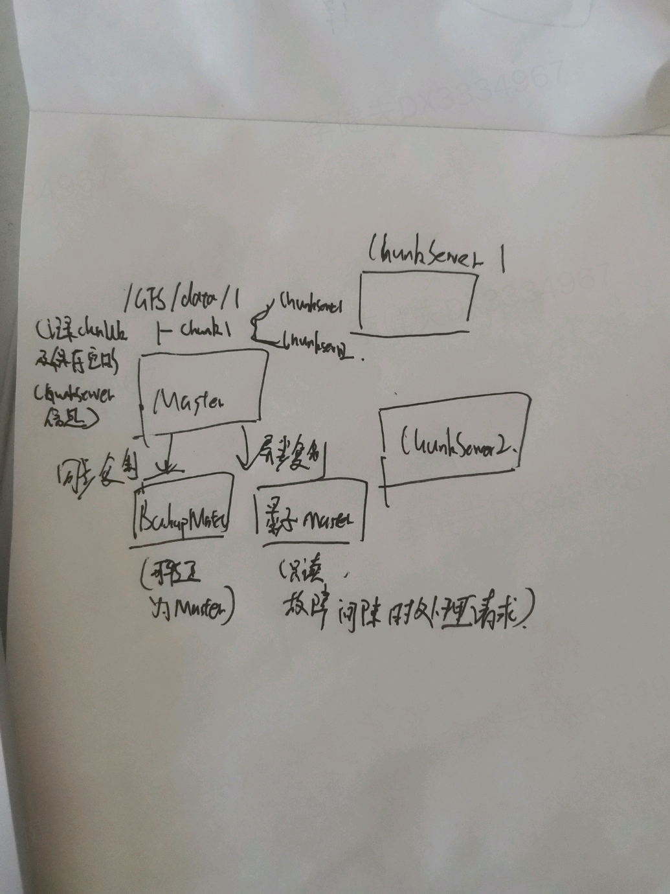
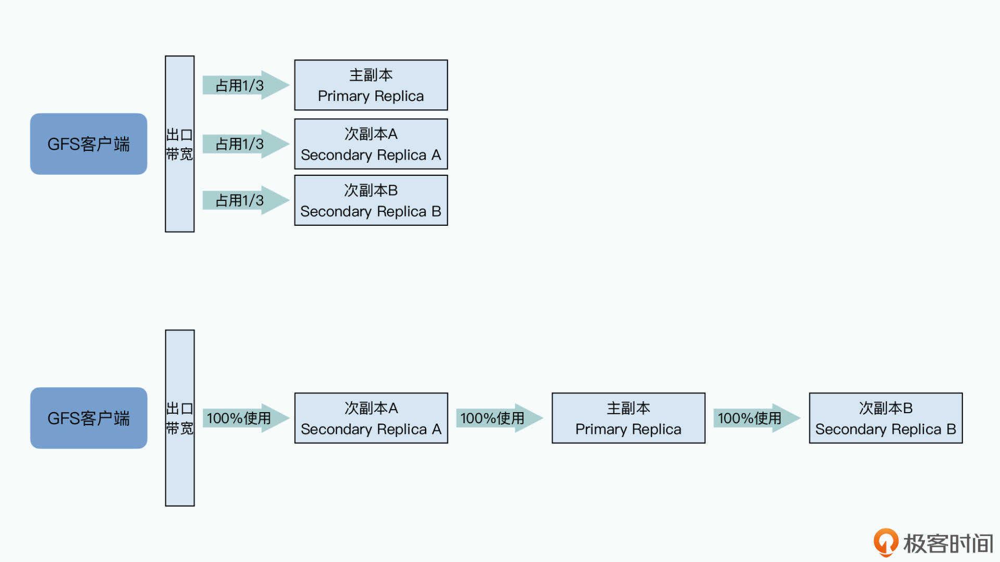
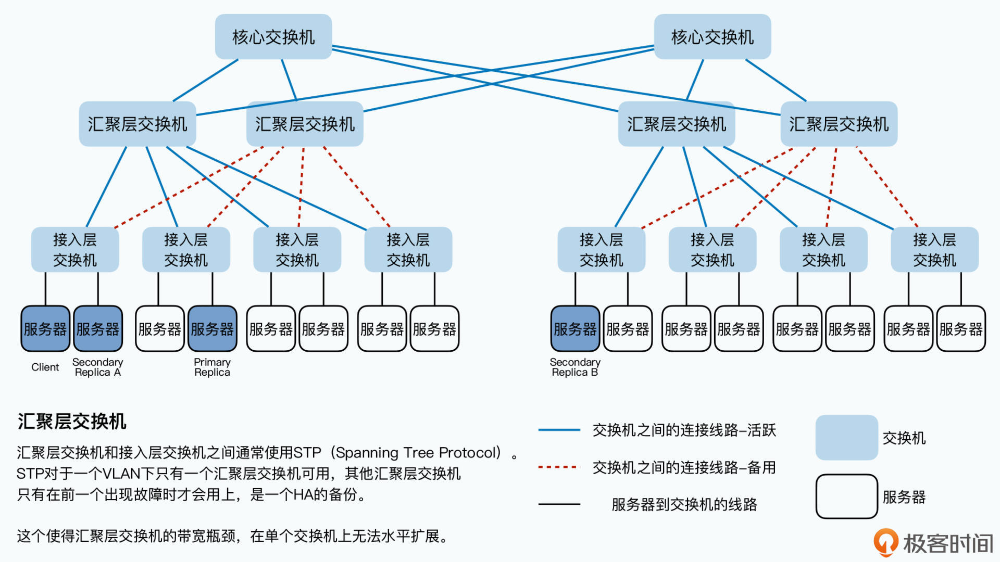

# hadoop权威指南

## 论文

### GFS

架构

Chunk：一个路径下的文件，可以分为64mb大小的chunk；一个chunk保存在3个chunkserver上；

读入数据过程:

* 【客户端与master交互】客户端提供要读取的**文件**+要读取的**offset**，master会计算出这些数据在哪个chunk内，然后提供给客户端chunkserver信息
* 【客户端与chunkserver交互】找其中任意的一个chunkserver读取自己所要的数据。（此阶段无需和master交互）

写入数据过程：

* 【客户端与master交互】客户端询问数据应该写入到那个cunkserver上，master回复具体的chunkserver信息以及哪个节点保存主副本哪个保存从副本。
* 【客户端与chunkserver交互】
  * 客户端把数据发给chunkserver,chunkserver缓存数据
  * 数据发送完毕后客户端发送**写请求**到主副本，这个时候才开始写入，因为客户端很多而且写入请求可能是并发发送的，每个请求是写入数据的某一段，所以chunkserver会会给这些请求排一个顺序，确保所有的数据写入是有一个固定顺序的，然后开始写入
  * 转发请求：主副本会把对应的写请求转发给所有的次副本，次副本的chunkserer开始排序+写入
  * 回复：次副本的数据写入完成之后，会回复主副本写完了；主副本回复客户端；

流水线式网络传输：

客户端发送数据到chunkserver时，不是把数据一份一份的发到chunkserver上，而是发到最近的chunkserver，依托这个chunkserver发到其他chunkserver。

原因：

要知道，我们几百台服务器所在的数据中心，一般都是通过三层交换机连通起来的：

- 同一个机架（Rack）上的服务器，都会接入到一台**接入层交换机**（Access Switch）上；
- 各个机架上的接入层交换机，都会连接到某一台**汇聚层交换机**（Aggregation Switch）上；
- 而汇聚层交换机，再会连接到多台**核心交换机**（Core Switch）上。

那么根据这个网络拓扑图，你会发现，两台服务器如果在同一个机架上，它们之间的网络传输只需要通过接入层的交换机即可。在这种情况下，除了两台服务器本身的网络带宽之外，它们只会占用所在的接入层交换机的带宽。

但是，如果两台服务器不在一个机架，乃至不在一个VLAN的情况下，数据传输就要通过汇聚层交换机，甚至是核心交换机了。而如果大量的数据传输，都是在多个不同的VLAN之间进行的，那么汇聚层交换机乃至核心交换机的带宽，就会成为瓶颈。

