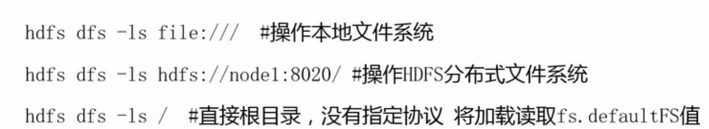
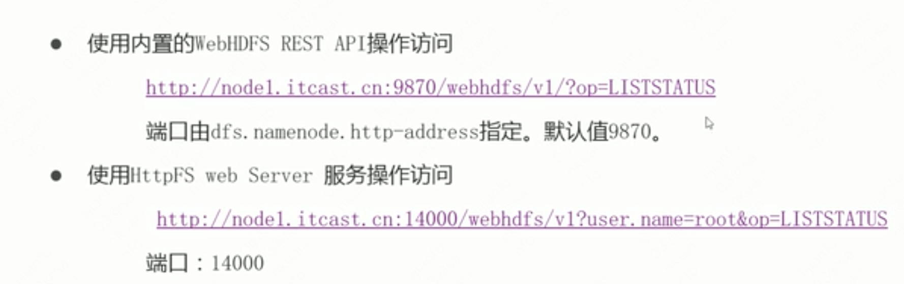
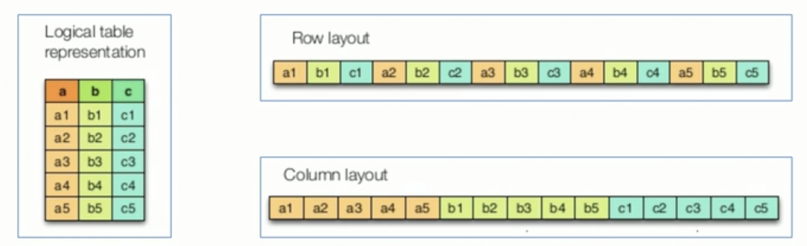
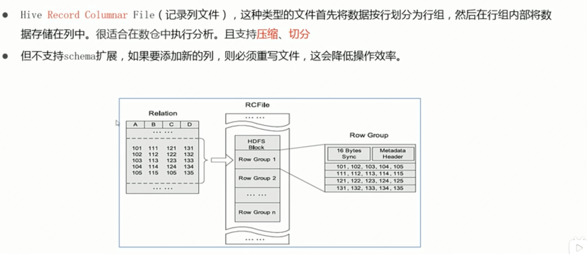
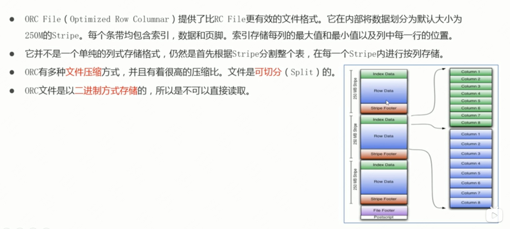
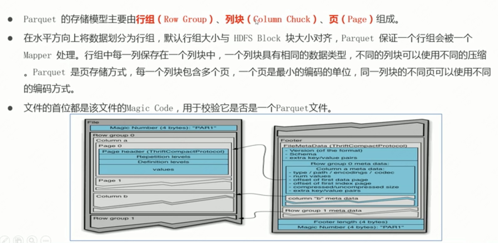
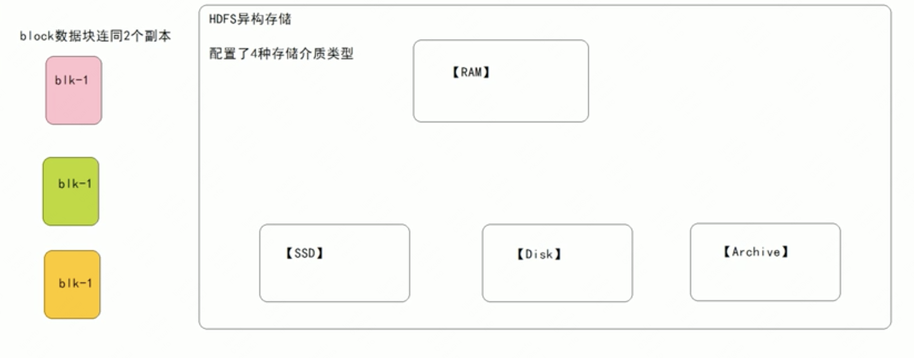
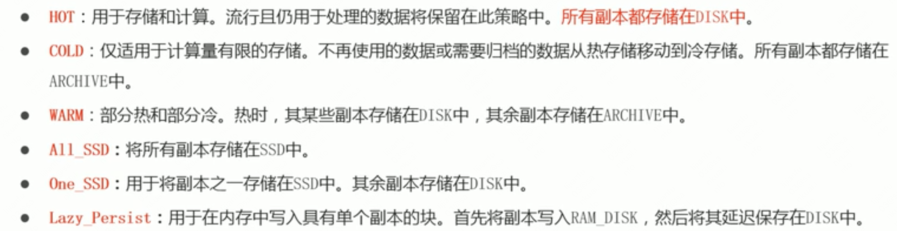

# hadoop权威指南

## 论文

### GFS

架构


Chunk：一个路径下的文件，可以分为64mb大小的chunk；一个chunk保存在3个chunkserver上；

读入数据过程:

* 【客户端与master交互】客户端提供要读取的**文件**+要读取的**offset**，master会计算出这些数据在哪个chunk内，然后提供给客户端chunkserver信息
* 【客户端与chunkserver交互】找其中任意的一个chunkserver读取自己所要的数据。（此阶段无需和master交互）

写入数据过程：

* 【客户端与master交互】客户端询问数据应该写入到那个cunkserver上，master回复具体的chunkserver信息以及哪个节点保存主副本哪个保存从副本。
* 【客户端与chunkserver交互】
  * 客户端把数据发给chunkserver,chunkserver缓存数据
  * 数据发送完毕后客户端发送**写请求**到主副本，这个时候才开始写入，因为客户端很多而且写入请求可能是并发发送的，每个请求是写入数据的某一段，所以chunkserver会会给这些请求排一个顺序，确保所有的数据写入是有一个固定顺序的，然后开始写入
  * 转发请求：主副本会把对应的写请求转发给所有的次副本，次副本的chunkserer开始排序+写入
  * 回复：次副本的数据写入完成之后，会回复主副本写完了；主副本回复客户端；

流水线式网络传输：

客户端发送数据到chunkserver时，不是把数据一份一份的发到chunkserver上，而是发到最近的chunkserver，依托这个chunkserver发到其他chunkserver。


原因：


要知道，我们几百台服务器所在的数据中心，一般都是通过三层交换机连通起来的：

- 同一个机架（Rack）上的服务器，都会接入到一台**接入层交换机**（Access Switch）上；
- 各个机架上的接入层交换机，都会连接到某一台**汇聚层交换机**（Aggregation Switch）上；
- 而汇聚层交换机，再会连接到多台**核心交换机**（Core Switch）上。

那么根据这个网络拓扑图，你会发现，两台服务器如果在同一个机架上，它们之间的网络传输只需要通过接入层的交换机即可。在这种情况下，除了两台服务器本身的网络带宽之外，它们只会占用所在的接入层交换机的带宽。

但是，如果两台服务器不在一个机架，乃至不在一个VLAN的情况下，数据传输就要通过汇聚层交换机，甚至是核心交换机了。而如果大量的数据传输，都是在多个不同的VLAN之间进行的，那么汇聚层交换机乃至核心交换机的带宽，就会成为瓶颈。

## hdfs

Hdfs shell cli：支持操作多种文件系统（包括本地文件file开头、分布式文件系统hdfs开头）

```
hdfs dfs 命令
```

https://blog.csdn.net/WQY992/article/details/89002269

hdfs dfs ls /查看当前文件系统




3种dfs命令的区别：

hadoop dfs（废弃）、hdfs dfs（只支持hdfs相关，包括local fs） 、hadoop fs（任意文件系统）

使用：

```
要将一些数据保存到hdfs的目录中
创建目录 hdfs dfs -mkdir /dicname
查看目录信息两种方式：1.访问nn的9870端口查看可视化页面 2.使用hdfs dfs ls命令
上传文件方式
hdfs dfs -put 本地文件 hdfs目录   //上传后会保留本地文件
hdfs dfs -moveFromLocal 本地文件 hdfs目录   //上传后会删除本地文件
查看文件内容3种方式：
hdfs dfs -cat 文件名
hdfs dfs -head 文件名  //查看文件前1kb的内容
hdfs dfs -tail 文件名  //查看文件最后1kb的内容
下载文件方式
hdfs dfs -get hdfs文件 本地目录  //下载文件到本地目录
hdfs dfs -getMerge hdfs文件 本地文件a //下载多个文件合并到本地文件a中
拷贝hdfs命令：
hdfs dfs -cp hdfs文件a hdfs文件b
查看剩余的磁盘空间
hdfs dfs -df /
查看某个hdfs文件/目录的空间使用量
hdfs dfs -du hdfs目录
```

Java api操作hdfs：

FileSystem是文件系统基类，根据配置类确定这是什么类型的文件系统(本地、hdfs。。。)创建一个与hdfs相连的客户端：

```java
conf = new Configuration();//可以在conf中指定fs.defaultFs的配置，指定为hfs的nn节点
FileSystem fs = FileSystem.get(conf);//根据conf建立与hdfs相连的文件系统
```

获得fs后就可以进行对hdfs系统的操作。

google option：命令行参数解析器：https://www.bilibili.com/video/BV1xp4y1W74g?p=44&spm_id_from=pageDriver

什么时候用？涉及到脚本操作的时候，比如执行java xxx.jar -x -h -p，，我们自己要定义一些脚本的命令参数，而且这个参数是不固定的，那就可以使用google option这个工具来解析这些参数。

访问hdfs的其他方式：

* 在安装来hadoop的机器上，可以直接执行hdfs dfs去访问hdfs集群

* 如果没有安装hadoop，那么也可以通过java api去访问

* 要是连java环境都没有呢？可以使用hdfs提供的webhdfs，通过http协议访问hdfs集群，可以实现上传文件，查看路径等场景，在浏览器上访问webhdfs相关的路径就可以访问hdfs。

* 基于restful的代理服务：httpfs。它是一种服务，独立于hdfs集群，可以通过访问httpfs，然后httpfs去访问hdfs集群。httpfs底层调用webhdfs去访问hdfs

  



这两种接口的访问例子。

**hdfs文件存储格式**

hdfs可以存储任意类型的数据

工具推荐：bigdata file viewer 查看二进制文件(orc格式、avro格式）内容 https://www.bilibili.com/video/BV1xp4y1W74g?p=59&spm_id_from=pageDriver

一张表，怎么保存

行式存储：同一行数据存储在一起，方便插入

列式存储：同一列数据存储在一起，方便查询



hadoop文本格式：

* Textfile 按行存储的文本格式（回车区分各行），包括xml、json等，不支持块级别压缩【多行数据一起压缩】，文本数据是按行压缩的

* sequence file:每条记录以k v形式存储的二进制文件，支持record级别【对每条记录压缩】和块级别压缩【对多条记录压缩】，可切分

* Avro file：行存储，支持块压缩，可切分，底层将数据序列化到一个块中保存

* Rcfile：行列存储的结合

  

* Orc file：rcfile的优化

  


* Parquet file：不同列可以采用不同的编码，一列之内不同也可以使用不同编码方式

  


hadoop下的文件压缩需要关注的点：压缩后的文件是否**支持切分**，切分之后还能识别这个文件的格式，以便于将不同切分放到不同机器上处理。

**hdfs异构存储**：hadoop2.6推出，数据按照使用频率分为冷、热、温、冻数据。将不怎么使用的数据放到比较便宜的存储上，比如hdd，而热数据放到ssd上。

hdfs中声明了4种异构数据类型：内存、disk[hdd]、ssd、archive[存储档案历史数据]。

但是hdfs并不知道机器上哪些是hdd，哪些盘是ssd，需要用户配置时声明


[ssd]是一个标签，代表这块盘是ssd，不加标签默认disk

块存储选择策略：



在hdfs配置文件中已经明确了不同存储介质的类型，对一个blk及其副本，选择把他们放入到哪个存储介质中就是块存储选择策略，在Blockstoragepolicysuite中已经定义好了6种存储策略。

默认是hot



设置某个路径path的存储策略：hdfs storagepolicies -set StoragePolicy -path -policy

hdfs黑白名单机制：

白名单：允许哪些机器加入到hdfs集群中，由参数dfs.hosts指定，位于hdfs-site.xml中

黑名单：禁止哪些机器加入到hdfs集群中，由参数dfs.hosts.exclude指定，位于hdfs-site.xml中

**高可用相关**：

单点故障，某一点故障导致系统不可运行。

解决单点故障方案：给节点备份，形成主备架构

主备集群：同一时间只有一个角色对外提供服务，其他角色负责和主角色保持数据状态同步。主角色挂掉备份顶上。

设计ha系统需要考虑的问题：

* 主备失去联系，导致集群无主或集群多个主，如何保证同一时间**有且只有一个主**？
* 数据一致性问题：解决方式是日志重演，主发生的事务性操作记录在日志中，备读取日志重演操作


## hive

内部表vs外部表：一般需要共享的表适合建成外部表，这样即使hive不需要这张表了，删除了元数据后，表实际还存在，可以被其他项目读取。

字段分隔符：建立表时不指定字段分隔符，那么就会hive就会使用字符SOH来区分两个字段，可以指定,为分隔符。

```
ROW FORMAT DELIMITED [FIELDS TERMINATED BY ',']
```

自己指定分隔符的好处在于，加入有一张以‘,’为分隔符的表tmp，且字段为id和name，那么我们可以自定义文本a.txt，里面数据格式是1001,lisi，然后把a.txt直接通过hdfs Put到tmp里，这样就会插入一条记录1001,lisi。把这个表从hdfs下载，可以看到文本格式也是用,分隔的。

## yarn

访问yarn ui：

拿到yarn的rm节点的域名，然后访问其8088端口(http服务)就可以看到整个集群的信息，包括资源和app。

yarn资源分配

https://zhuanlan.zhihu.com/p/335881182

通过yarn集群的web ui可以看到yarn集群总体的memory数据和所有vcore数据


