# 积累

## (1)String方法

path是一个List\<String\>,如何把它转成一个String呢，而且每个元素使用" "分隔？

```
String.join(" ",path);
```

使用String工具类提供的join方法，把path中各元素拼到一起，而且以空格分开。

去除字符串中所有空格操作：

```
s=s.replaceAll(" ","");
```

## (4)线段树

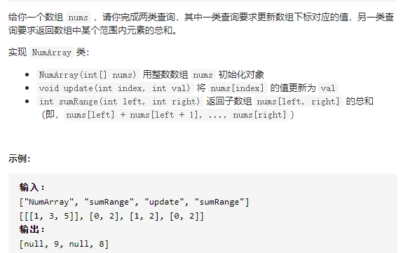

**线段树是一种非常灵活的数据结构，它可以用于解决多种范围查询问题，比如在对数时间内从数组中找到最小值、最大值、总和、最大公数、最小公倍数等。**

线段树示意图：

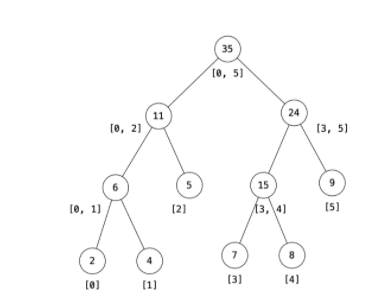


1. 从给定数组构建线段树的预处理步骤。
2. 修改元素时更新线段树。
3. 使用线段树进行区域和检索。

以这道题为例，构建线段树(它的树不是按照上面的图建的,它是把每两个节点组成一个叶子节点,当节点个数为奇数个时，数组第一个节点将不会有与之配对的节点，而且右子节点为奇数，左子节点编号为偶数，根节点编号为1)

```java
int[] tree;
int n;
public NumArray(int[] nums) {
    if (nums.length > 0) {
        n = nums.length;
        tree = new int[n * 2];
        buildTree(nums);
    }
}
private void buildTree(int[] nums) {
    for (int i = n, j = 0;  i < 2 * n; i++,  j++)
        tree[i] = nums[j];
    for (int i = n - 1; i > 0; --i)
        tree[i] = tree[i * 2] + tree[i * 2 + 1];
}

作者：LeetCode
链接：https://leetcode-cn.com/problems/range-sum-query-mutable/solution/qu-yu-he-jian-suo-shu-zu-ke-xiu-gai-by-leetcode/
来源：力扣（LeetCode）
著作权归作者所有。商业转载请联系作者获得授权，非商业转载请注明出处。
```

update操作：

```java
void update(int pos, int val) {
    pos += n;
    tree[pos] = val;
    while (pos > 0) {
        int left = pos;
        int right = pos;
        if (pos % 2 == 0) {
            right = pos + 1;
        } else {
            left = pos - 1;
        }
        // parent is updated after child is updated
        tree[pos / 2] = tree[left] + tree[right];
        pos /= 2;
    }
}

作者：LeetCode
链接：https://leetcode-cn.com/problems/range-sum-query-mutable/solution/qu-yu-he-jian-suo-shu-zu-ke-xiu-gai-by-leetcode/
来源：力扣（LeetCode）
著作权归作者所有。商业转载请联系作者获得授权，非商业转载请注明出处.

```

区域和检索操作：

```java
public int sumRange(int l, int r) {
    // get leaf with value 'l'
    l += n;
    // get leaf with value 'r'
    r += n;
    int sum = 0;
    while (l <= r) {
        if ((l % 2) == 1) {
            //l是右子节点，所以l之前的值不会被考虑，所以只加上tree[l],不用加上l的父节点。
           sum += tree[l];
           l++;
        }
        if ((r % 2) == 0) {
            //此时r为左叶子节点
           sum += tree[r];
           r--;
        }
        //上升到它们的父节点
        l /= 2;
        r /= 2;
    }
    return sum;
}

作者：LeetCode
链接：https://leetcode-cn.com/problems/range-sum-query-mutable/solution/qu-yu-he-jian-suo-shu-zu-ke-xiu-gai-by-leetcode/
来源：力扣（LeetCode）
著作权归作者所有。商业转载请联系作者获得授权，非商业转载请注明出处。
```

lc53最大子数组和也可以用线段树做：

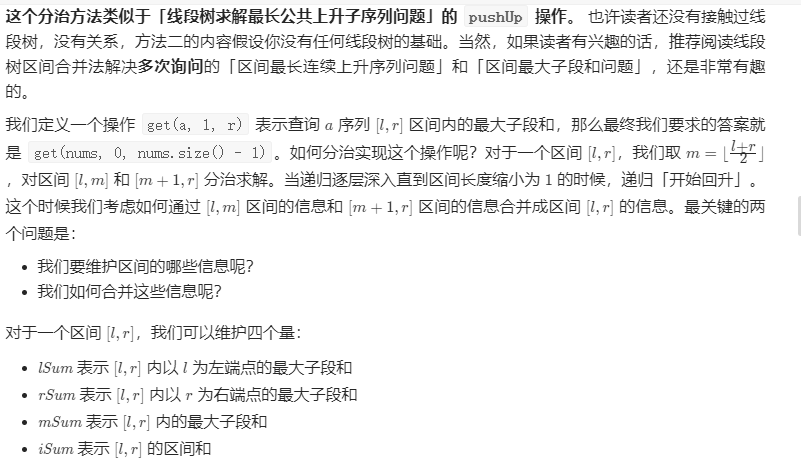

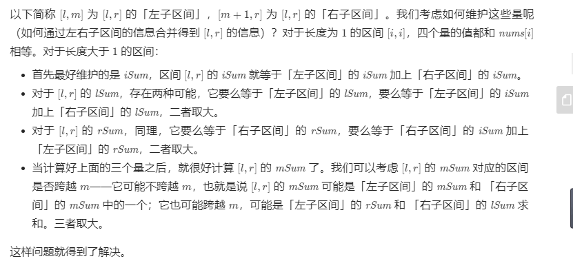

```java
class Solution {
    public class Status {
        public int lSum, rSum, mSum, iSum;

        public Status(int lSum, int rSum, int mSum, int iSum) {
            this.lSum = lSum;
            this.rSum = rSum;
            this.mSum = mSum;
            this.iSum = iSum;
        }
    }

    public int maxSubArray(int[] nums) {
        return getInfo(nums, 0, nums.length - 1).mSum;
    }

    public Status getInfo(int[] a, int l, int r) {
        if (l == r) {
            return new Status(a[l], a[l], a[l], a[l]);
        }
        int m = (l + r) >> 1;
        Status lSub = getInfo(a, l, m);
        Status rSub = getInfo(a, m + 1, r);
        return pushUp(lSub, rSub);
    }

    public Status pushUp(Status l, Status r) {
        int iSum = l.iSum + r.iSum;
        int lSum = Math.max(l.lSum, l.iSum + r.lSum);
        int rSum = Math.max(r.rSum, r.iSum + l.rSum);
        int mSum = Math.max(Math.max(l.mSum, r.mSum), l.rSum + r.lSum);
        return new Status(lSum, rSum, mSum, iSum);
    }
}

作者：LeetCode-Solution
链接：https://leetcode-cn.com/problems/maximum-subarray/solution/zui-da-zi-xu-he-by-leetcode-solution/
来源：力扣（LeetCode）
著作权归作者所有。商业转载请联系作者获得授权，非商业转载请注明出处。
```

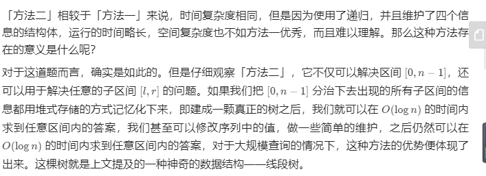

## (5)智力问题

### 1.Nim游戏

游戏规则是这样的：你和你的朋友面前有一堆石子，你们轮流拿，一次至少拿一颗，最多拿三颗，谁拿走最后一颗石子谁获胜。

假设你们都很聪明，由你第一个开始拿，请你写一个算法，输入一个正整数 n，返回你是否能赢（true 或 false）。

比如现在有 4 颗石子，算法应该返回 false。因为无论你拿 1 颗 2 颗还是 3 颗，对方都能一次性拿完，拿走最后一颗石子，所以你一定会输。

首先，这道题肯定可以使用动态规划，因为显然原问题存在子问题，且子问题存在重复。但是因为你们都很聪明，涉及到你和对手的博弈，动态规划会比较复杂。

如果我能赢，那么最后轮到我取石子的时候必须要剩下 1~3 颗石子，这样我才能一把拿完。

如何营造这样的一个局面呢？显然，如果对手拿的时候只剩 4 颗石子，那么无论他怎么拿，总会剩下 1~3 颗石子，我就能赢。

如何逼迫对手面对 4 颗石子呢？要想办法，让我选择的时候还有 5~7 颗石子，这样的话我就有把握让对方不得不面对 4 颗石子。

如何营造 5~7 颗石子的局面呢？让对手面对 8 颗石子，无论他怎么拿，都会给我剩下 5~7 颗，我就能赢。

这样一直循环下去，我们发现只要踩到 4 的倍数，就落入了圈套，永远逃不出 4 的倍数，而且一定会输。所以这道题的解法非常简单：


```java
bool canWinNim(int n) {
    // 如果上来就踩到 4 的倍数，那就认输吧
    // 否则，可以把对方控制在 4 的倍数，必胜
    return n % 4 != 0;
}
```

### 2.石头游戏

你和你的朋友面前有一排石头堆，用一个数组 piles 表示，piles[i] 表示第 i 堆石子有多少个。你们轮流拿石头，一次拿一堆，但是只能拿走最左边或者最右边的石头堆。所有石头被拿完后，谁拥有的石头多，谁获胜。

**假设你们都很聪明**，由你第一个开始拿，请你写一个算法，输入一个数组 piles，返回你是否能赢（true 或 false）。

石头的堆的数量为偶数，所以你们两人拿走的堆数一定是相同的。石头的总数为奇数，也就是你们最后不可能拥有相同多的石头，一定有胜负之分。

这题详见左神书P246

### 3电灯开关

这个问题是这样描述的：有 n 盏电灯，最开始时都是关着的。现在要进行 n 轮操作：

第 1 轮操作是把每一盏电灯的开关按一下（全部打开）。

第 2 轮操作是把每两盏灯的开关按一下（就是按第 2，4，6... 盏灯的开关，它们被关闭）。

第 3 轮操作是把每三盏灯的开关按一下（就是按第 3，6，9... 盏灯的开关，有的被关闭，比如 3，有的被打开，比如 6）...

如此往复，直到第 n 轮，即只按一下第 n 盏灯的开关。

现在给你输入一个正整数 n 代表电灯的个数，问你经过 n 轮操作后，这些电灯有多少盏是亮的？

使用boolean\[n]模拟电灯开关可能会超时，

### 4 可怜的小猪(458)

1000桶水，其中一桶有毒，猪喝毒水后会在15分钟内死去，想用一个小时找到这桶毒水，至少需要几头猪？

https://www.zhihu.com/question/60227816

**状态量确定：**

首先从信息论角度考虑这个问题：

1000桶水，有一桶水有毒，那么对应1000种情况，存储这些情况需要log2(1000)个bit；

1头猪每过15分钟就喝水，在1小时内有5种状态：(15分钟死亡，30分钟死亡，45分钟死亡，60分钟死亡，60分钟死亡)，4头猪就有5^4=625种状态，存储这些状态需要log2(625)个bit，这些bit无法完整存储1000个状态，所以4头猪不能检测出1000桶水，要5头猪才可以。

对应的信息墒公式分别为：

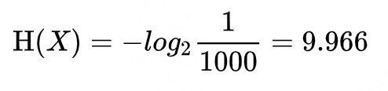

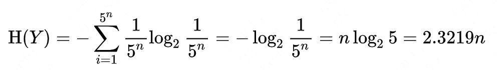

**编码：**

**一个状态对应水的编号**

5头猪，每头猪5种状态，上面5种状态用0-4表示，这5头猪的状态可以用s=(s0,s1,s2,s3,s4)来表示，其中每个sx取值为0-4；

不妨用这种状态来给水编号，可以知道毒水的编号等于猪的最终状态。

最终状态(0,0,0,0,0)代表所有猪都在第0分钟喝到了毒水，那么只有在毒水在第0分钟喂给所有猪才会出现这种状态，毒水在不同时刻喂给不同的猪会影响最终状，毒水就是0号水。

接下来要对状态进行搜索以确定最终状态

水的编号t:(t0,t1,t2,t3,t4)  含义：第ti时刻喂给第i头猪

最终状态编号：(s0,s1,s2,s3,s4) 含义：第i头猪在什么时间段内死亡

毒水对应的编号t = s。不考虑其他水，一桶水在s时喂给不同的猪后猪全部死亡，那么就是毒水。

**搜索**

搜索逻辑为【一桶一桶喂】：

```
for t in 1000:
	feed(t,pigs)//把这桶水喂给猪
	if (pigs.isAllDead){
		posion = t
	}
```

实际中可以把这些水按照时间批量的喂，记录猪的最终状态，那么60分钟后最终状态对应的水就是毒水，当然这种场景下猪就不是同时死的了而是异步死的。

**总结**：

* 首先计算出5。因为5是根据状态数量（猪的最终状态）和要检索的条件（水编号）计算出来的，一个最终状态对应一个水编号的一种选择。
* 用状态给水编号，因为毒水编号=最终状态，由此确定了水编号的含义【什么时候给什么猪喂这桶水】
* 搜索：对每个编号的水，按照其含义喂给猪，其中在喂毒水的时候猪会死亡确定这头猪的最终状态


## 43字符串相乘

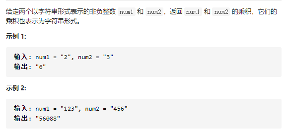

先实现加法，然后每得到的字符串错位与上一个字符串相加,cross代表错几位，最开始是0，当res长度为0时就加直接从尾部开始，后来每计算出一个新的tmp就把cross加1，代表从res的倒数第cross+1位开始与tmp相加，后cross位直接保存到最终结果即可。

我自己的做法(10%)

```java
class Solution {
    public String multiply(String num1, String num2) {
        if("0".equals(num1)||"0".equals(num2)) return "0";
        String res = new String();
        int cross = 0;
        for(int i = num2.length()-1;i>=0;i--){
            String tmp = multi(num1,num2.charAt(i));
            res = add(res,tmp,cross++);
        }
        return res;

    }

    public String multi(String s1,char ch){
        String ans = new String();
        int next = 0,index = s1.length()-1,y = ch-'0';
        while(index>=0||next>0){
            int x = index>=0?s1.charAt(index)-'0':0;
            int cur = x * y+next;
            ans = String.valueOf(cur%10) +ans;
            next = cur/10;
            index--;
        }
        return ans;
    }

    public String add(String s1,String s2,int cross){
        if(s1.length()==0) return s2;
        String ans = s1.substring(s1.length()-cross,s1.length());
        int index1 = s1.length()-cross-1,index2 = s2.length()-1,next = 0;
        while(index1>=0||index2>=0||next>0){
            int x = index1>=0?s1.charAt(index1)-'0':0;
            int y = index2>=0?s2.charAt(index2)-'0':0;
            int cur = x + y+next;
            ans = String.valueOf(cur%10)+ans;
            next = cur/10;
            index1--;
            index2--;

        }

        return ans;

}
}
```


## 18四数之和

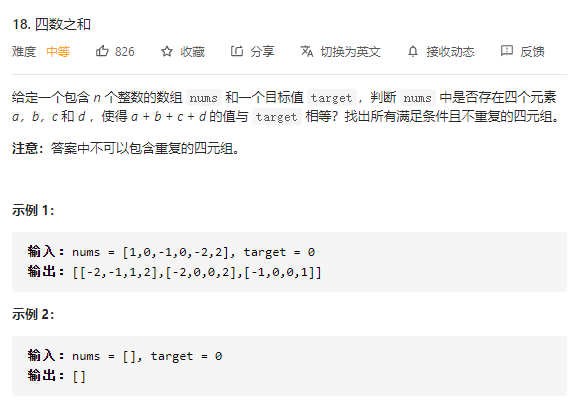

这道题使用的是labuladong的解法，设计了一个通用的nSum函数，k和n表示要把几个数加到一起，其中k不变，n每次都减一，为啥要设计这个k，后面再说；start表示从数组的第几个元素开始加，nSum的baseCase为n=2的时候，这个时候直接找到所有和为当前target的两个元素，并且返回到n=3。

n=3时把nums[i]加到n=2时的返回结果上即可，并且把它的结果返回到n=4即可。

这里出现一个问题，就是nSum返回的是List<List\<Integer>>类型，所以我们的res的实际类型可以是LinkedList<List\<Integer>>类型，但是不能是List<LinkedList\<Integer>>类型，注意，java中List<T\>和List<S\>两者即使S是T的实现类或子类，两者也是不能直接转换的；

这就导致最里面的那个小数组不能写成LinkedList类型，不然最后返回的时候会抛出异常。

设n=2时返回的结果是ret，它由长度为2的小list组成（如果n=2时有结果的话）。n=3时拿到ret,然后遍历ret中的每个list，把此时的nums[i]加入到list中，因为是从前往后遍历，nums[i]肯定小于list中的每个元素，所以应该把nums[i]加到位置0，后面加元素时应该也把元素加到位置0，能实现这一点的话使用LinkedList的addFirst()正好；但是我暂时想不到怎么样把里面的list变成LinkedList类型而且最后返回时还不报错，所以想个笨招：干脆从大到小加入元素，比如n=2时先加hi后加lo，后面依次把当前元素加到list尾部，当到达第n层的时候，把list逆转；k的作用就体现出来了—它就是保存一共有几个数相加，如果n==k，直接反转；

```java
class Solution {
    public List<List<Integer>> fourSum(int[] nums, int target) {
        Arrays.sort(nums);
        return nSum(nums,4,4,0,target);
    }

    public List<List<Integer>> nSum(int[] nums, int k,int n,int start,int target){
        List<List<Integer>> res = new LinkedList<List<Integer>>();
        if(n==2){
            int lo = start,hi = nums.length-1;
            while(lo<hi){
                int left = nums[lo],right = nums[hi];
                int sum = nums[lo]+nums[hi];
                if(sum<target){
                    while(lo<hi&&left == nums[lo]) lo++;
                }else if(sum>target){
                    while(lo<hi&&right==nums[hi]) hi--;
                }else{
                    LinkedList<Integer> re = new LinkedList<Integer>();
                    re.add(nums[hi]);
                    re.add(nums[lo]);
                    res.add(re);
                    while(lo<hi&&left == nums[lo]) lo++;
                    while(lo<hi&&right==nums[hi]) hi--;
                }
            }
            return res;
        }
        for(int i = start;i<nums.length;i++){
            
            List<List<Integer>> ret = nSum(nums,k,n-1,i+1,target-nums[i]);
            if(ret.size()>0){
                for(List<Integer> list:ret){
                    list.add(nums[i]);
                    if(n==k){
                        //保证顺序是从小到大的
                        Collections.reverse(list);
                    }
                    res.add(list);
                }
            }
            while (i < nums.length - 1 && nums[i] == nums[i + 1]) i++;
        }
        return res;
    }
}
```

## 887扔鸡蛋

这道题注意：

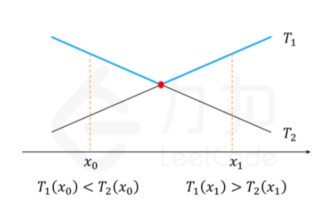

这种形式，T1和T2一个单调上升，一个单调下降，可以通过二分查找找到红点的坐标

## 换钱问题

### 1.换钱的方法数

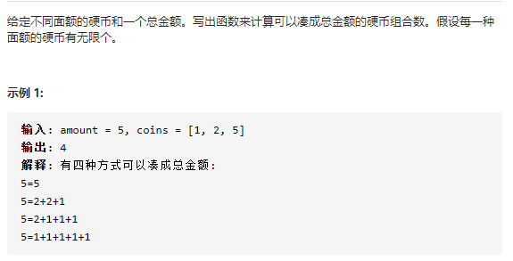

这是一个完全背包问题

```java
class Solution {
    public int change(int amount, int[] coins) {
        int n = coins.length;
        int[][] dp = new int[n+1][amount+1];
        for(int i = 0;i<=n;i++){
            dp[i][0] = 1;
        }
        for(int i = 1;i<=n;i++){
            for(int j = 1;j<=amount;j++){
                if(j>=coins[i-1]){
                    dp[i][j] = dp[i-1][j]+ dp[i][j-coins[i-1]];
                }else{
                    dp[i][j] = dp[i-1][j];
                }
            }
        }
        return dp[n][amount];

    }
}
```

这种初始化dp矩阵的方式和左神的不一样，它是初始化为n+1行，即什么硬币都不放算一行

假设amount=2,coins=[1,2,5]，表格为：

|      | 0    | 1    | 2    |
| ---- | ---- | ---- | ---- |
| 0    | 1    | 0    | 0    |
| 1    | 1    | 1    | 1    |

首先第一轮全是1（什么硬币都不放也算一种方案），第一行的话除了第一列其他的都是0

dp\[1\]\[1\]=dp\[0\]\[1\]+dp\[1\]\[0\]=1

如果初始化为n行，就是取消调什么硬币都不放这一行：

|      | 0    | 1    | 2    |
| ---- | ---- | ---- | ---- |
| 1    | 1    | 1    | 1    |

那么第一行就要进行初始化，否则后面不会得到正确的结果

两种初始化dp矩阵的方式都可以，个人认为前一种更好理解

## 表达式问题

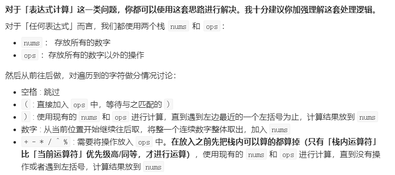

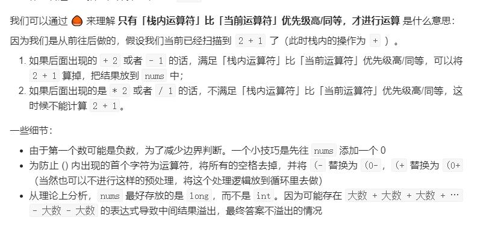

```java
class Solution {
    // 使用 map 维护一个运算符优先级
    // 这里的优先级划分按照「数学」进行划分即可
    Map<Character, Integer> map = new HashMap<>(){{
        put('-', 1);
        put('+', 1);
        put('*', 2);
        put('/', 2);
        put('%', 2);
        put('^', 3);
    }};
    public int calculate(String s) {
        // 将所有的空格去掉，并将 (- 替换为 (0-，(+ 替换为 (0+
        // 当然这里也可以不预处理，而是放到循环里面去做判断
        s = s.replaceAll(" ", "");
        s = s.replaceAll("\\(-", "(0-");
        s = s.replaceAll("\\(\\+", "(0+");
        char[] cs = s.toCharArray();
        int n = s.length();
        // 存放所有的数字
        Deque<Integer> nums = new ArrayDeque<>();
        // 为了防止第一个数为负数，先往 nums 加个 0
        nums.addLast(0);
        // 存放所有「非数字以外」的操作
        Deque<Character> ops = new ArrayDeque<>();
        for (int i = 0; i < n; i++) {
            char c = cs[i];
            if (c == '(') {
                ops.addLast(c);
            } else if (c == ')') {
                // 计算到最近一个左括号为止
                while (!ops.isEmpty()) {
                    if (ops.peekLast() != '(') {
                        calc(nums, ops);
                    } else {
                        ops.pollLast();
                        break;
                    }
                }
            } else {
                if (isNumber(c)) {
                    int u = 0;
                    int j = i;
                    // 将从 i 位置开始后面的连续数字整体取出，加入 nums
                    while (j < n && isNumber(cs[j])) u = u * 10 + (cs[j++] - '0');
                    nums.addLast(u);
                    i = j - 1;
                } else {
                    // 有一个新操作要入栈时，先把栈内可以算的都算了 
                    // 只有满足「栈内运算符」比「当前运算符」优先级高/同等，才进行运算
                    while (!ops.isEmpty() && ops.peekLast() != '(') {
                        char prev = ops.peekLast();
                        if (map.get(prev) >= map.get(c)) {
                            calc(nums, ops);
                        } else {
                            break;
                        }
                    }
                    ops.addLast(c);
                }
            }
        }
        // 将剩余的计算完
        while (!ops.isEmpty()) calc(nums, ops);
        return nums.peekLast();
    }
    void calc(Deque<Integer> nums, Deque<Character> ops) {
        if (nums.isEmpty() || nums.size() < 2) return;
        if (ops.isEmpty()) return;
        int b = nums.pollLast(), a = nums.pollLast();
        char op = ops.pollLast();
        int ans = 0;
        if (op == '+') ans = a + b;
        else if (op == '-') ans = a - b;
        else if (op == '*') ans = a * b;
        else if (op == '/')  ans = a / b;
        else if (op == '^') ans = (int)Math.pow(a, b);
        else if (op == '%') ans = a % b;
        nums.addLast(ans);
    }
    boolean isNumber(char c) {
        return Character.isDigit(c);
    }
}

作者：AC_OIer
链接：https://leetcode-cn.com/problems/basic-calculator-ii/solution/shi-yong-shuang-zhan-jie-jue-jiu-ji-biao-c65k/
来源：力扣（LeetCode）
著作权归作者所有。商业转载请联系作者获得授权，非商业转载请注明出处。
```

ops除了括号，栈顶操作符的优先级一定大于栈底操作符。

#  lc 高频面试题

## 25 k个一组翻转链表

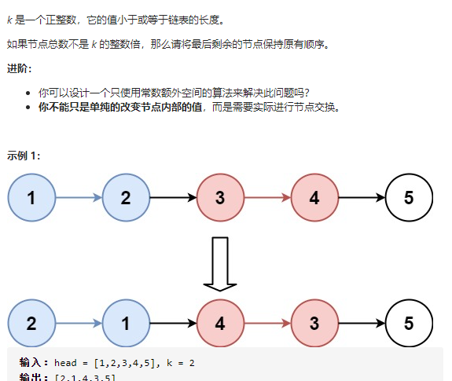

自己写了50分钟(100%,33%)

```java
/**
 * Definition for singly-linked list.
 * public class ListNode {
 *     int val;
 *     ListNode next;
 *     ListNode() {}
 *     ListNode(int val) { this.val = val; }
 *     ListNode(int val, ListNode next) { this.val = val; this.next = next; }
 * }
 */
class Solution {
    public ListNode reverseKGroup(ListNode head, int k) {
        ListNode tail = head,dumpy = new ListNode(0),pre = dumpy;
        while(head!=null){
            int cnt = 0;
            for(int i = 0;i<k;i++){
                tail = tail.next;
                cnt++;
                if(tail==null) break;
            }
            if(cnt==k){
                pre = reverse(head,pre,tail);
                head = tail;
            }else{
                break;
            }
 
        }
        return dumpy.next;

    }

    public ListNode reverse(ListNode head,ListNode pre,ListNode tail){
        ListNode cur = head,p = null;
        while(cur!=tail){
            ListNode next = cur.next;
            cur.next = p;
            p = cur;
            cur = next;
        }
        head.next = tail;
        pre.next = p;
        return head;
    }
}
```

做法就是：

* 比如k=2时要翻转3，4，那么把3前面的节点记为pre,4后面的节点记为tail，翻转1，2之后，把pre和tail与翻转后的链表连接起来。
* 每次都更新pre和tail，pre直接就是reverse方法返回的值，tail每次向前迭代k个
* 最后如果不到k个的话直接退出即可。
* 使用虚拟节点dumpy作为头节点。

## 140单词拆分II

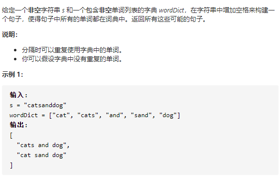

dp[i]表示i前的子串可以分解为wordDict中的单词。

```java
import java.util.ArrayDeque;
import java.util.ArrayList;
import java.util.Deque;
import java.util.HashSet;
import java.util.List;
import java.util.Set;

public class Solution {

    public List<String> wordBreak(String s, List<String> wordDict) {
        // 为了快速判断一个单词是否在单词集合中，需要将它们加入哈希表
        Set<String> wordSet = new HashSet<>(wordDict);
        int len = s.length();

        // 第 1 步：动态规划计算是否有解
        // dp[i] 表示「长度」为 i 的 s 前缀子串可以拆分成 wordDict 中的单词
        // 长度包括 0 ，因此状态数组的长度为 len + 1
        boolean[] dp = new boolean[len + 1];
        // 0 这个值需要被后面的状态值参考，如果一个单词正好在 wordDict 中，dp[0] 设置成 true 是合理的
        dp[0] = true;

        for (int right = 1; right <= len; right++) {
            // 如果单词集合中的单词长度都不长，从后向前遍历是更快的
            for (int left = right - 1; left >= 0; left--) {
                // substring 不截取 s[right]，dp[left] 的结果不包含 s[left]
                if (wordSet.contains(s.substring(left, right)) && dp[left]) {
                    dp[right] = true;
                    // 这个 break 很重要，一旦得到 dp[right] = True ，不必再计算下去
                    break;
                }
            }
        }

        // 第 2 步：回溯算法搜索所有符合条件的解
        List<String> res = new ArrayList<>();
        if (dp[len]) {
            Deque<String> path = new ArrayDeque<>();
            dfs(s, len, wordSet, dp, path, res);
            return res;
        }
        return res;
    }

    /**
     * s[0:len) 如果可以拆分成 wordSet 中的单词，把递归求解的结果加入 res 中
     *
     * @param s
     * @param len     长度为 len 的 s 的前缀子串
     * @param wordSet 单词集合，已经加入哈希表
     * @param dp      预处理得到的 dp 数组
     * @param path    从叶子结点到根结点的路径
     * @param res     保存所有结果的变量
     */
    private void dfs(String s, int len, Set<String> wordSet, boolean[] dp, Deque<String> path, List<String> res) {
        if (len == 0) {
            res.add(String.join(" ",path));
            return;
        }

        // 可以拆分的左边界从 len - 1 依次枚举到 0
        for (int i = len - 1; i >= 0; i--) {
            String suffix = s.substring(i, len);
            if (wordSet.contains(suffix) && dp[i]) {
                path.addFirst(suffix);
                dfs(s, i, wordSet, dp, path, res);
                path.removeFirst();
            }
        }
    }
}

作者：liweiwei1419
链接：https://leetcode-cn.com/problems/word-break-ii/solution/dong-tai-gui-hua-hui-su-qiu-jie-ju-ti-zhi-python-d/
来源：力扣（LeetCode）
著作权归作者所有。商业转载请联系作者获得授权，非商业转载请注明出处。
```

## 面试题02.01 移除重复节点

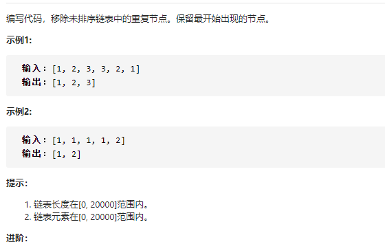

```java
/**
 * Definition for singly-linked list.
 * public class ListNode {
 *     int val;
 *     ListNode next;
 *     ListNode(int x) { val = x; }
 * }
 */
class Solution {
    public ListNode removeDuplicateNodes(ListNode head) {
        if(head == null) return head;
        ListNode dummy = new ListNode(-1);
        HashSet<Integer> set = new HashSet<>();
        ListNode cur = dummy;
        while(head!=null){
            ListNode next = head.next;
            head.next = null;
            if(set.add(head.val)){
                cur.next = head;
                cur = cur.next;
            }
            head = next;
        }
        return dummy.next;

    }
}
```

建立一个hashset用来保存当前的遍历到的元素

## 面试题02.04 分割链表

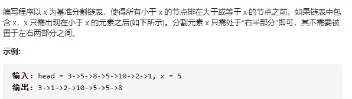

建立两个头节点，一个后面放所有小于x的链表，一个放所有大于等于x的链表，最后合并两个链表。

```java
/**
 * Definition for singly-linked list.
 * public class ListNode {
 *     int val;
 *     ListNode next;
 *     ListNode(int x) { val = x; }
 * }
 */
class Solution {
    public ListNode partition(ListNode head, int x) {
        if(head==null) return head;
        ListNode head1 = new ListNode(-1);
        ListNode head2 = new ListNode(-1);
        ListNode cur1 = head1,cur2 = head2; 
        while(head!=null){
            ListNode next = head.next;
            head.next = null;
            if(head.val<x){
                cur1.next = head;
                cur1 = cur1.next;
            }else{
                cur2.next = head;
                cur2 = cur2.next;
            }
            head = next;
        }
        ListNode next = head2.next;
        head2.next = null;
        cur1.next = next;
        return head1.next;

    }
}
```

## lc61 旋转链表

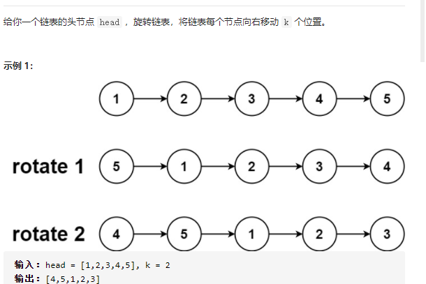

```java
/**
 * Definition for singly-linked list.
 * public class ListNode {
 *     int val;
 *     ListNode next;
 *     ListNode() {}
 *     ListNode(int val) { this.val = val; }
 *     ListNode(int val, ListNode next) { this.val = val; this.next = next; }
 * }
 */
class Solution {
    public ListNode rotateRight(ListNode head, int k) {
        if(head == null) return head;
        int n = 0;
        ListNode end = null,slow = head,fast = head,cur = head;
        while(head != null){
            end = head;
            head = head.next;
            n++;
        }
        if(k%n == 0) return cur;
        for(int i = 0;i < k%n;i++){
            fast = fast.next;
        }
        while(fast != null){
            fast = fast.next;
            slow = slow.next;
        }
        end.next = cur;
        while(cur.next!=slow){
            cur = cur.next;
        }
        cur.next = null;
        return slow;


    }
}
```

这道题难倒是不难，首先向右移动k次，那么倒数第k%n个节点会成为新的表头，如果k%n==0，就说明新表头就是原来的head，直接return即可。

* n是链表长度，首先计算出链表的长度，计算同时找到链表的最后一个节点end。

* 然后找到链表倒数第k%n个节点(让slow走n-k步，那么fast要先走k步，最后fast为null时一共走了n步)
* 让end的next指向head
* head一直向后走，当head的next是slow(新头)的时候将head.next置空，次此时得到一条以slow开头的链表。


# 常见算法题

## 1洗牌算法

**如何产生一个长度为100的数组，里面填满数字1-100不重复，而且数组内数字排序必须纯随机。**

Fisher–Yates随机置乱算法也被称做高纳德置乱算法，通俗说就是生成一个有限集合的随机排列。
 Fisher-Yates随机置乱算法是无偏的，所以每个排列都是等可能的，当前使用的Fisher-Yates随机置乱算法是相当有效的，需要的时间正比于要随机置乱的数，不需要额为的存储空间开销。

这个怎么理解呢？最后一个数为1-n之间任何一个数的概率肯定是1/n，倒数第二个数为1的概率等于

```
1/(n-1)*(n-1)/n+0*1/n = 1/n
```

等于最后一个数为1时和最后一个数不为1时的概率之和。那么倒数第三个数也可以以此类推。

倒数第三个数为1的概率等于（1不在倒数第一个数和倒数第二个数中）
$$
1/(n-2)*(1-(1/n+(n-1)/n*1/(n-1)))=1/n
$$
倒数第一个数为1的概率时是1/n，倒数第二个数为1的概率等于（倒数第一个数不为1且倒数第二个数为1）

```java
        int[] arr = new int[10];  
        int i;  

        //初始的有序数组  
        for (i = 0; i < 10; i++) 
       {  
            arr[i] = i + 1;  
        }  

        //费雪耶兹置乱算法  
       //每次生成的随机交换位置:
        for (i = arr.length - 1; i > 0; i--)
 {  
            //随机数生成器，范围[0, i]  
            int rand = (new Random()).nextInt(i+1);  

            int temp = arr[i];  
            arr[i] = arr[rand];  
            arr[rand] = temp;  
        }  
```

## 2.rand5实现rand7

```java
int Rand7(){
    Random r = new Random();
    int x = ~(1<<31); // max int
    while(x > 20)
        x = 5 * (r.nextInt(6) - 1) + r.nextInt(6)-1; // Rand25
    return x%7 + 1;
}
```

左神randm实现randn

假设m=3,要实现rand12,那就先取出12-1=11;把11转化成3进制102然后在每个位上调用rand1to3()，如果产生大于该位置的数，而且上一个位置产生的数是相等的（比如第二位产生1，而上一位产生的是1，那么就打回重新调用；当然如果上一位产生的数是0，那么此时这个数肯定小于n-1了，那就继续让它产生就行）


## 3.迷宫左手法则（网易笔试）

## 4.牛客试题

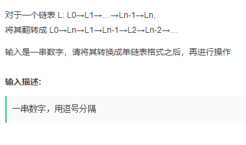

我自己写的（超时，但是通过自测数据）

```java
public class Main {
    //定义Node节点
    static class ListNode {
        int val;
        ListNode next = null;
 
        ListNode(int val) {
            this.val = val;
        }
    }
 
    public static void main(String[] args) {
        //1.获取控制台输入的信息
        Scanner scanner = new Scanner(System.in);
        String string = scanner.nextLine();
        String[] strings = string.split(",");
        //2.将输入的字符串构成带头节点的2个链表
        ListNode head = creatList(strings);
        head = reorderList(head);
        //3.输出
        while(head!=null){
            if(head.next==null){
                System.out.print(head.val);
            }else{
                 System.out.print(head.val+",");
            }
            head=head.next;
        }
 
    }
 
 
 
    /*
     * 将str创建带头结点的单链表
     */
    public static ListNode creatList(String[] strings) {
        ListNode head = new ListNode(0);
        ListNode tail = head;
        for (String str : strings) {
            ListNode newNode = new ListNode(Integer.valueOf(str));
            tail.next = newNode;
            tail = newNode;
        }
        return head.next;
    }
 
 
    /*
     * 思路：链表平均拆分，后半部分链表反转，在将两个链表合并
     */
    public static ListNode reorderList(ListNode head) {
        if(head==null||head.next==null){
            return head;
        }
 
        ListNode slow = head;
        ListNode fast = head;
 
        // 找到链表的一半
        while (fast.next != null && fast.next.next != null) {
            slow = slow.next;
            fast = fast.next.next;
        }
 
        // 将链表分为两段
        ListNode pre = slow;
        slow = head;
        ListNode cur = pre.next;
        pre.next=null;
 
        // 将后半段进行链表的翻转
        while (cur!= null) {
            ListNode next = cur.next;
            cur.next = pre;
            pre = cur;
            cur = next;
        }

 
        // 两条链表进行合并
        ListNode dummy = new ListNode(0),tail = dummy;
        while (slow!=null) {
            if(slow==pre){
                tail.next=slow;
                break;
            }
            tail.next = slow;
            tail = tail.next;
            slow = slow.next;
            tail.next = pre;
            tail = tail.next;
            pre = pre.next;
            
        }
        
        return dummy.next;
 
    }
 
}
```

这个关键点在于对于链表1->2->3->4->5（奇数个）

会反转成1->2->3<-4<-5，从1和5开始遍历，当slow==pre的时候说明遍历到3了，把3加入后直接退出；

但是1->2->3->4这种，会反转成1->2<-3<-4

上面的算法就不对；因为最后是把3放进去，但是3的next不为null，导致最后打印链表的时候出现死循环

链表合并部分改成这样

```java
            next1 = slow.next;
            next2 = pre.next;
            slow.next=null;
            pre.next=null;
            tail.next = slow;
            tail = tail.next;
            tail.next = pre;
            tail = tail.next;
            slow = next1;
            pre = next2;
```

通过next保存下一个节点，然后把要加入dummy的节点的尾部置为null


