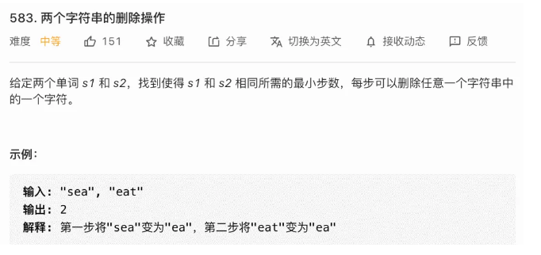

# 积累

## (1)String方法

path是一个List\<String\>,如何把它转成一个String呢，而且每个元素使用" "分隔？

```
String.join(" ",path);
```

使用String工具类提供的join方法，把path中各元素拼到一起，而且以空格分开。

去除字符串中所有空格操作：

```
s=s.replaceAll(" ","");
```


## (2)二分查找

对与[1,2,2,2,3,3,5]这个数组，最小索引为0，最大索引为6，二分查找有如下情况：

* 设lo = 0,hi = 6,此时搜索区间为[0,6]是个闭区间，所以while条件为while(lo<=hi)，比如[2,2]这个搜索区间也是有意义的，里面的元素是2

* 设lo = 0,hi = 7此时搜索区间为[0,7)，左闭右开，所以while条件为while(lo<hi)，[2,3)有意义，里面的元素是2，但是[2,2)没有意义，

* 考虑左右边界，在二分搜索中因为重复元素所以常会考虑左右边界问题，比如搜索2，那么是要返回2的左边界还是2的右边界，查找左右边界的代码也不难，主要是对于target==nums\[mid\]这种情况，当搜索区间为闭区间时：

  * 寻找左边界时，此时mid左边可能还有值，所以将hi= mid - 1;
  * 寻找右边界时，此时mid右边可能还有值，所以将lo= mid + 1;

  为什么要写成hi = mid-1而不是hi = mid?注意这里搜索区间是闭区间,mid已经被搜索过，所以[lo,mid-1]是下一步的搜索区间，如果写成[lo,mid]的话，那么mid这个位置被重复搜索了。

* 考虑左右边界，在二分搜索中因为重复元素所以常会考虑左右边界问题，比如搜索2，那么是要返回2的左边界还是2的右边界，查找左右边界的代码也不难，主要是对于target==nums\[mid\]这种情况，当搜索区间为左闭右开区间时：

  * 寻找左边界时，此时mid左边可能还有值，所以将hi= mid ;
  * 寻找右边界时，此时mid右边可能还有值，但是因为mid已经被搜索过了，所以将lo= mid+1;

  为什么要写成hi = mid而不是hi = mid-1?注意这里搜索区间是左闭右开,mid已经被搜索过了，但是mid-1还没有被搜索过，所以[lo,mid)是下一步的搜索区间，如果写成[lo,mid-1)的话，那么mid-1这个位置没有被搜索到。

  此外，当nums[mid]>target时，right = mid;(左开右闭)；nums[mid]<target时，left = mid+1

* 现在查找数组中存在的数的左右边界，且搜索区间为闭时，假设

  * 查找2的左边界，最后退出时一定有lo>hi,此时lo处在位置1，hi位于位置0,lo是最终的结果；
  * 查找2的右边界，最后退出时一定有lo>hi,此时lo处在位置4，hi位于位置3,hi是最终的结果；

  在搜索区间为闭的情况下，左边界最终返回lo,有右边界最终会返回hi，

* 现在查找数组中存在的数的左右边界，且搜索区间为左闭右开时，假设

  * 查找2的左边界，最后退出时一定有lo=hi,此时lo和hi处在位置1，正好是左边界；
  * 查找2的右边界，最后退出时一定有lo=hi,此时lo和hi处在位置4，正好是右边界的下一个位置；

  在搜索区间为左闭右开的情况下，lo和hi最终是相等的，返回左边界时返回lo和hi都可以；返回右边界时要把返回的lo和hi减去1，

* 左边界和有边界代表啥？2的左边界是1，右边界是3，左边界i表示数组中有**i个小于2的数**，数组长度为n，那么右边界j表示数组中**有(n-1-j)个大于2的数**，如果要查找一个不存在于数组中的数的左边界和有边界，那么也就相当于查找数组中有多少个数小于该数/有多少个数大于该数。

  **比如要查找一个不存在于数组中的数4的左边界和右边界，那么4的左边界应该是6，4的右边界应该是5**

* 闭区间情况下搜索数组中一个根本不存在的数：

  * 假设搜索4的左边界，那么最终搜索区间会收缩到[5,6]，最后lo位于索引6，hi位于索引5，此时lo指向的位置的数是5并不是4；
  * 假设搜索4的右边界，那么最终搜索区间会收缩到[5,6]，最后lo位于索引6，hi位于索引5，此时hi指向的位置的数是3并不是4；
  * 如果搜查8的左边界（大于数组中所有元素的值）,lo最终会指向位置7（有7个数小于8），越界了，
  * 如果搜查8的右边界（大于数组中所有元素的值）,hi最终会指向位置(n-1-j==0,j=6)（有0个数大于8）
  * 如果搜查0的左边界（小于数组中所有元素的值）,lo最终会指向位置0（有0个数小于0）
  * 如果搜查0的右边界（小于数组中所有元素的值）,hi最终会指向位置0（n-1-j==7,j=-1），越界了

  **总结：当使用闭区间查找一个不存在于数组中的数的左边界时，最终应该返回lo,但是有可能此时lo指向的位置的值并不是target，或者lo指向n（数组长度）；当使用闭区间查找一个不存在于数组中的数的右边界时，最终应该返回hi,但是有可能此时hi指向的位置的值并不是target，或者hi指向-1**

* 左闭右开区间情况下搜索数组中一个根本不存在的数：

  因为最后lo = hi,所以返回左边界时可以返回lo/hi，返回右边界时使用lo/hi-1。和搜索区间为闭的情况一样，返回的左边界lo要么nums[lo]!=target，要么lo==n;返回的右边界要么nums[hi]!=target，要么hi == -1

可以用于找红点所在位置(min(max(T1,T2)))，最后搜索区间会落在与红点最近的整数上。


## (3)动态规划专题

### 1.最优子结构

「最优子结构」是某些问题的一种特定性质，并不是动态规划问题专有的。也就是说，很多问题其实都具有最优子结构，只是其中大部分不具有重叠子问题，所以我们不把它们归为动态规划系列问题而已。

已知每个班最高分，求全校最高分，这个问题就**符合最优子结构**：可以从子问题的最优结果推出更大规模问题的最优结果。让你算**每个班**的最优成绩就是子问题，你知道所有子问题的答案后，就可以借此推出**全校**学生的最优成绩这个规模更大的问题的答案。

假设你们学校有 10 个班，你已知每个班的最大分数差（最高分和最低分的差值）。那么现在我让你计算全校学生中的最大分数差，这个问题就**不符合最优子结构**，因为你没办通过每个班的最优值推出全校的最优值，没办法通过子问题的最优值推出规模更大的问题的最优值。

**那么遇到这种最优子结构失效情况，怎么办？策略是：改造问题**。

最大分数差，不就等价于最高分数和最低分数的差么，那不就是要求最高和最低分数么，不就是我们讨论的第一个问题么，不就具有最优子结构了么？

### 2.递归转dp

#### 494目标和

给定一个非负整数数组，a1, a2, ..., an, 和一个目标数，S，给每个数前面加上'+'或'-'，使这些数之和为S，问所有添加符号的方法数。

这题使用回溯很轻松，但是如何转dp?

把这些数分为两个集合，前面加正号的是集合A，负号的是集合B，通过下面公式可以把该问题转化为一个01背包问题。

```
sum(A) - sum(B) = target
sum(A) = target + sum(B)
sum(A) + sum(A) = target + sum(B) + sum(A)
2 * sum(A) = target + sum(nums)
```

### 3.最长递增子序列问题

LIS问题，最容易的解法很容易想出，O(N^2)，但是这道题还可以做成O(NlogN)解法，就是类似扑克牌洗牌这种过程


最后扑克牌的堆数就是最长子序列。

这里强调一下，这种放法是默认数组没有重复子元素的，假设数组中有重复子元素的话，那么方法就是每一张牌可以放在牌数**不小于**它的牌上，比如2,2,2,2,2，它们应该被放在一个堆上而不是5个堆。

为什么堆的个数就是最长增长子序列的长度？因为按照这种放置方式，数组中所有递增的子序列肯定位于不同的堆上，同一个堆从上到下肯定是递减的，所以堆的个数肯定大于等于最长增长子序列的长度；同理，堆的长度也不可能大于最长增长子序列长度，因为最终最长增长子序列中某元素的下一个元素一定位于它的下一个堆上，比如最终子序列中的an位于第i个堆上，那么a(n+1)一定位于第i+1个堆上。因为an,a(n+1)是最长增长子列相邻元素，在原数组的索引为k1,k2,那么nums[k1+1:k2-1]之间就不可能存在位于[an,a(n+1)]这个区间的值，否则不是最优解。an和a(n+1)之间的元素全部大于max(an,a(n+1))，那么a(n+1)会挂在第i+1个堆上；否则a(n+1)会作为第i+1个堆的堆头；因此不可能存在堆的个数大于最长增长子序列个数的情况。

因为堆底元素是单调递增的，所以可以使用二分查找加快放置堆元素的速度，如果新遍历到的元素大于此时堆底所有的元素，就新开一个堆；以上图的堆底元素为例，新遍历的元素如果小于等于2，那就放在第一个堆上；大于2小于等于4就放在第二个堆上，比如找到3，如何使用左边界放法，那么整个数组中只有1个数比它小，它应该放在第一个堆上；如果使用右边界放法，整个数组中有四个数比它大，它应该放在第0个堆上(5-1-j=4=>j=0)，很显然，这里应该使用**左边界放法**；

那么通过模拟扑克牌来计算最长递增子列的长度：

```java
public int LengthOfLIS(int[] nums){
    int piles = 0;
    //heap就是堆
    int[] heap = new int[nums.length];
    for(int i = 0;i<nums.length;i++){
        int pile = nums[i],lo = 0,hi = piles;
        //这里使用左闭右开搜索法
        while(lo<hi){
            int mid = lo + (hi-lo)/2;
            if(heap[mid]<pile){
                lo = mid + 1;
            }else if(heap[mid]>=pile){
                hi = mid;
            }
        }
        //左开右闭返回左边界，返回lo或者hi都可以，这里选择lo
        if(lo == piles){
            //开新堆
            heap[piles++] = pile;
        }else{
            //更新原来堆的堆底元素
            heap[lo] = pile;
        }
        
    }
    return piles;
}
```

信封问题，LIS问题可以解决：


做法：我一开始想到了排序，首先是按照env[0]从小到大排，env[0]相等按照env[1]从小到大排，然后准备一个堆，然后使用dp，计算以每一个信封为终点的最长字节长度；这里可以做一个优化，就是对于某一个信封，如果它前一个信封的env[0]和它相等，那么就可以跳过前面的信封。

也可以选择


### 4.最大子数组和

lc53，dp[i]表示以i结尾的数组的和，dp[i] = Math.max(dp[i-1],dp[i])

### 5.最长公共子序列

#### lc1143 lcs问题

子序列类型的问题， 穷举出所有可能的结果都不容易， ⽽动态规划算法做的就是穷举 +剪枝， 它俩天⽣⼀对⼉。 所以可以说只要涉及⼦序列问题， ⼗有⼋九都需要动态规划来解决， 往这⽅⾯考虑就对了。  

**对于两个字符串求子序列的问题，都是用两个指针`i`和`j`分别在两个字符串上移动，大概率是动态规划思路**。

这个和编辑距离很像，如果text1.charAt(i)==text.charAt(j)，说明公共子序列可以在dp\[i-1]\[j-1]的基础加1了，否则就是dp\[i-1]\[j]和dp\[i]\[j-1]两者的最大值。

```java
class Solution {
    public int longestCommonSubsequence(String text1, String text2) {
        int m = text1.length(),n = text2.length();
        int[][] dp = new int[m+1][n+1];
        for(int i = 1;i<=m;i++){
            for(int j = 1;j<=n;j++){
                if(text1.charAt(i-1)==text2.charAt(j-1)){
                    dp[i][j] = dp[i-1][j-1] + 1;
                }else{
                    dp[i][j] = Math.max(dp[i-1][j],dp[i][j-1]);
                }
            }
        }
        return dp[m][n];

    }
}
```

#### lc583 两个字符串的删除操作



这道题就是求出最长公共子序列长度lcs，然后使用s1.length()-lcs+s2.length()-lcs

#### lc712 两个字符串的最小ASCII删除和

这个乍一看挺难的，我以为得把最长公共子串求出来，然后再使用两个字符串的ASCII码减去两次公共子串的ASCII码，其实没那么麻烦，可以复用1143的代码，就是dp\[i]\[j]的定义是s1前i个字符和s2前j个字符公共字符串的ASCII码之和，然后可以发现，代码逻辑是可以复用上面的。

```java
class Solution {
    public int minimumDeleteSum(String s1, String s2) {
        int sum = getAsc(s1)+getAsc(s2);
        int m = s1.length(),n = s2.length();
        int[][] dp = new int[m+1][n+1];
        for(int i = 1;i<=m;i++){
            for(int j = 1;j<=n;j++){
                if(s1.charAt(i-1)==s2.charAt(j-1)){
                    dp[i][j] = dp[i-1][j-1] + s1.charAt(i-1) + s2.charAt(j-1);
                }else{
                    dp[i][j] = Math.max(dp[i-1][j],dp[i][j-1]);
                }
            }
        }
        return sum - dp[m][n];
    }
    public int getAsc(String s){
        int res = 0;
        for(int i = 0;i<s.length();i++){
            res = res + s.charAt(i);
        }
        return res;
    }
}
```

### 6.子序列问题解题模板

一旦涉及到子序列和最值，那几乎可以肯定，**考察的是动态规划技巧，时间复杂度一般都是 O(n^2)**


**2.第二种思路模板是一个二维dp数组**


小试牛刀：求最长回文子序列的长度


状态转移方程：


```java
int longestPalindromeSubseq(string s) {
    int n = s.size();
    int[][] dp = new int[n][n];
    // base case
    for (int i = 0; i < n; i++)
        dp[i][i] = 1;
    // 反着遍历保证正确的状态转移
    for (int i = n - 1; i >= 0; i--) {
        for (int j = i + 1; j < n; j++) {
            // 状态转移方程
            if (s[i] == s[j])
                dp[i][j] = dp[i + 1][j - 1] + 2;
            else
                dp[i][j] = max(dp[i + 1][j], dp[i][j - 1]);
        }
    }
    // 整个 s 的最长回文子串长度
    return dp[0][n - 1];
}
```

### 7.背包问题

#### 01背包问题

```java
public int knapsack(int W,int N,int[] w,int[] val){
    int[][] dp = new int[N+1][W+1];
    for(int i = 1;i<=N;i++){
        fot(int j = 1;j<=W;j++){
            if(j>=w[i-1]){
                dp[i][j] = Math.max(dp[i-1][j],dp[i-1][j-w[i-1]]+val[i-1]);
            }else{
                dp[i][j] = dp[i-1][j];
            }
        }
    }
    return dp[N][W];
}
```

状态压缩

```java
public int knapsack(int W,int N,int[] w,int[] val){
    int[] dp = new int[W+1];
    for(int i = 0;i<N;i++){
        fot(int j = W;j>=w[i];j--){
            dp[j] = Math.max(dp[j],dp[j-w[i]]+val[i]);
        }
    }
    return [W];
}
```

#### 完全背包问题

有一个背包，最大容量为`amount`，有一系列物品`coins`，每个物品的重量为`coins[i]`，**每个物品的数量无限**。请问有多少种方法，能够把背包恰好装满？

与01背包相比，这个对物品的数量没有限制，


这道题该怎么理解呢？dp\[i]\[j]表示商品个数为i时，容量为j时的放法组合数。遍历到第i个商品时，可以选择不把它放进去(dp\[i-1]\[j]),也可以选择只放进去一个(dp\[i-1]\[j-coins[i-1]]),放进去两个(dp\[i-1]\[j-2\*coins[i-1]])，直到放不进去为止(k\*coins[i-1]>=j)，dp\[i]\[j]就是这几种情况的和.

另外可以发现，dp\[i][j-coins[i-1]] = dp\[i-1][j-coins[i-1]] + ... + dp\[i][j-k\*coins[i-1]]

所以dp\[i][j] = dp\[i][j-coins[i-1]] + dp\[i-1][j]

```java
int change(int amount, int[] coins) {
    int n = coins.length;
    int[] dp = new int[amount + 1];
    dp[0] = 1; // base case
    for (int i = 0; i < n; i++)
        for (int j = 1; j <= amount; j++)
            if (j - coins[i] >= 0)
                dp[j] = dp[j] + dp[j-coins[i]];

    return dp[amount];
}
```

### 8.正则表达

因为是字符串匹配问题，所以使用dp，一共两个字符串，dp\[i]\[j]代表s1前i个字符是否可以和s2前j个字符匹配

```java
if (j == 0) {
    f[i][j] = i == 0;
} else {
    //非空正则分为两种情况 * 和 非*
    if (B.charAt(j - 1) != '*') {
        if (i > 0 && (A.charAt(i - 1) == B.charAt(j - 1) || B.charAt(j - 1) == '.')) {
            f[i][j] = f[i - 1][j - 1];
        }
    } else {
        //碰到 * 了，分为看和不看两种情况
        //不看
        if (j >= 2) {
            f[i][j] |= f[i][j - 2];
        }
        //看
        if (i >= 1 && j >= 2 && (A.charAt(i - 1) == B.charAt(j - 2) || B.charAt(j - 2) == '.')) {
            f[i][j] |= f[i - 1][j];
        }
    }
}
```

|      | 0    | a    | *    |
| ---- | ---- | ---- | ---- |
| 0    | T    |      |      |
| a    | F    |      |      |
| a    | F    |      |      |

dp\[i]\[j]的basecase如上图所示，所以有

```java
if (j == 0) {//第0列只有i==0时为true，其他为false.
    f[i][j] = i == 0;
}
```

### 9.四键键盘


* 要想操作n次后显示更多的'A'，那么第n次操作甚至第n-1次操作都是c_v，或者直接输入一个'A'，第n次操作如果是c_a或者c_c，可能在后面会获得更大的值（毕竟一次性复制了更多元素，以后c_v时以乘法增加，斜率更高）但是只操作n次的情况下，对不起，人家在你c_a，c_c的功夫直接两次c_v超过你，因为dp\[i]记录的是操作i次时获得的最大'A'，人家从dp\[i-3]开始直接复制，而此时你的dp\[i]还一直没变化。
* 多次c_a和c_c操作怎么办？只考虑最后一次的那个c_a,c_c。前面提到，不看长远利益，只想在第n次获得最大值，那么不管之前进行过多少次c_a,c_c，最后一次的c_c后一直到n就必须开始c_v了，那么dp\[i]就是在第j+1个位置c_a，第j+2个位置c_c，随后开始c_v的最大值，1<=j<=i-3

```java
class Solution {
    public int maxA(int n) {
        int[] dp = new int[n+1];
        for(int i = 1;i<=n;i++){
            dp[i] = i;
            for(int j = 1;j<=i-3;j++){
                dp[i] = Math.max(dp[i],dp[j]*(i-j-1));
            }
        }
        return dp[n];
    
    }
}
```

按照递归转dp来求解：

首先要明确状态、选择

状态：n(剩余的操作次数)，anum(屏幕上a的个数)，copy（剪切板上'a'的个数）

选择：选择'A',选择c_a,c_c（两个连选），选择c_v

basecase:n=0

```java
public int dp(int n,int anum,int copy){
    //basecase
    if(n<=0) return anum;
    //选择'a'
    int res1 = dp(n-1,anum+1,copy);
    //选择'c_v'
    int res2 = dp(n-1,anum+copy,copy);
    //选择'c_a','c_c'
    int res3 = dp(n-2,anum,anum);
    return Math.max(res1,Math.max(res2,res3));
    
}
```

### 10.KMP算法

一共两步：

* 构建next数组
* 根据next数组移动模式串

**next数组定义：**

* 对于字符串"ababc",next\[i\]表示第i个字符前的字符串最大公共前缀和后缀的长度（前缀不可以包含最后一个字符，后缀不能包含第一个字符）,那么next\[4]('c'之前是'abab')，它们最大的公共前缀和后缀是'ab'，所以next\[4]==2。
* basecase:对于next\[0]，第一个字符前没有字符串，所以记为-1；next\[1\]，前面只有一个字符，但是前缀不能包含最后一个元素，也就是说'a'不可以作为前缀，所以next\[1]==0。这里注意，某个字符前存在字符串只是不存在公共字符，那么它的next是0；如果前面根本不存在字符串，那么它的next就是-1；只有位置0的next是-1，与后面next为0的情况区分开。

**如何求解next数组？**


现在要求位置i的next：

* 如果位置i-1的字符和位置next\[i-1\]（图上笔误，这里dp指的就是next)的字符相等，那么next\[i] = next\[i-1]+1
* 如果不相，说明位置i前字符没有那么长的公共子串，得减小一下范围，首先 next\[i-1]我们知道了，它前面也有公共前缀后缀（那两个小黑块），而且第一个黑块和第四个黑块是对称的，接下来判断第一个黑块后的字符是否等于位置i-1的字符。
* basecase，不断往前缩减，如果0号位置的字符都和第i-1个字符不相等，那么就说明i前公共前缀后缀长度为0，

我自己写的初稿：

```java
public int[] getNext(char[] patc){
    if(patc.length==1) return new int[]{-1};
    int[] next = new int[patc.length];
    //basecase
    next[0] = -1;
    next[1] = 0;
    int pos = 2;
    while(pos<patc.length){
        if(patc[pos-1] == patc[next[pos-1]]){
            next[pos] = next[pos-1]+1;
            continue;
        }else{
            int k = next[pos-1];       
        	while(k!=-1){
                //重复比较，不太好，但是思路应该对。
                if(patc[pos-1] == patc[k]){
                    next[pos] = k+1;
                    break;
                }
                k = next[k];
            } 
            if(k == -1) next[pos] = 0;
        }
    }
    return next;
}
```

这里不妨把k提取出来，k代表next\[pos-1\]

```java
public int[] getNext(char[] patc){
    if(patc.length==1) return new int[]{-1};
    int[] next = new int[patc.length];
    //basecase
    next[0] = -1;
    next[1] = 0;
    int pos = 2;
    int k = 0;//next[2-1] = 0
    while(pos<patc.length){
        if(patc[pos-1] == patc[k]){
            next[pos++] = ++k;
        }
        else if(k>0){
            k = next[k];
        }else{
            next[pos++] = 0;
        }
    }
    return next;
}
```

* 字符串移动环节，假设pat的第j个字符和txt的第i个字符不匹配，直接让next\[j]和i比，而不是一下子把pat串移动到(i-j+1)的位置重新开始匹配

  ```java
  public int kmp(String txt,String pat){
      char[] txtc = txt.toCharArray();
      char[] patc = pat.toCharArray();
      int ti = 0;
      int pi = 0;
      int[] next = getNext(patc);
      while(ti<txtc.length&&pi<patc.length){
          if(txtc[ti] == patc[pi]){
              ti++;
              pi++;
          //如果没匹配上就先移动到next[pi]
          }else if(pi>0){
              pi = next[pi];
          }else{
              //要是连pat第0位置元素都和位置ti的元素不等，那么ti这个位置是肯定和pat匹配不上了，所以把ti向前移动一位，同时把pi恢复为0
              ti++;
              pi = 0;
          }
      }
      //退出循环，如果最后pat到达最后一位了，说明全部匹配成功了，ti-pi就是第一个匹配成功的值，如果匹配不成功，返回-1.
      return p1<patc.length?:-1:ti-pi;
  }
  ```

* 计算next数组的时候为什么没有next\[n+1]?

  看kmp算法就能明白，如果最后一个元素和ti匹配上了直接就退出了；如果匹配不上就直接往前退，next数组是倒退时用的，所以next\[n+1]意义不大。

* 时间复杂度分析

  kmp的时间复杂度：首先txt肯定不回退，pat向前滑动（不会后退），但是它所滑动的最大距离是n(也就是滑动到头了)，所以匹配过程时间复杂度O(n)

  getNext的时间复杂度：

  每次循环，要么pos增加，要么pos-k增加，要么两者一起增加，pos<m,pos-k<m，所以总的时间复杂度不会超过2m，getNext的时间复杂度是O(m)

### 11.贪心之区间调度问题

贪心算法：dp的特例

使⽤贪⼼算法需要满⾜更多的条件（贪⼼选择性质） ， 但是效率⽐动态规划要⾼。  

什么是贪⼼选择性质呢， 简单说就是： 每⼀步都做出⼀个局部最优的选择，最终的结果就是全局最优。 注意哦， 这是⼀种特殊性质， 其实只有⼀部分问题拥有这个性质。

经典区间问题：

给你很多形如 [start, end] 的闭区间， 请你设计⼀个算法，算出这些区间中最多有⼏个互不相交的区间。   

\1. 从区间集合 intvs 中选择⼀个区间 x， 这个 x 是在当前所有区间中结束
最早的（end 最⼩） 。
\2. 把所有与 x 区间相交的区间从区间集合 intvs 中删除。
\3. 重复步骤 1 和 2， 直到 intvs 为空为⽌。 之前选出的那些 x 就是最⼤不
相交⼦集。

```java
public int intevalSchedual(int[][] intvs){
    if(intvs.length == 0) return 0;
    //按照end排序
    Arrays.sort(intvs,new Comparator<int[]>(){ (a,b)->a[1]-b[1]});
    int cnt = 1;
    int end = intvs[0][1];
    for(int i = 1;i<intvs.length;i++){
        if(intvs[i][0]>end){
            cnt++;
            end = intvs[i][1];
        }
    }
    return cnt;
}
```

**相关例题：** 

#### lc435无重叠区间


```java
return n - intevalSchedual(int[][] intvs);
```

  #### lc452最少的箭射气球


 注：这个感觉跟贪心没啥关系，先按end排好序之后下一个如果与当前区间重合了直接跳过，且不更新end，直到出现一个不和当前end重合的再加1.

```java
class Solution {
    public int findMinArrowShots(int[][] points) {
        if(points.length==0) return 0;
        Arrays.sort(points,new Comparator<int[]>(){
            public int compare(int[] m,int[] n){
                //为啥使用这种方式而不是两个数相减？因为如果数很大的话两个数会溢出。
                return m[1]<n[1]?-1:1;
            }
        });
        int cnt=1,end=points[0][1];
        for(int i=1;i<points.length;i++){
            if(points[i][0]<=end) continue;
            else{end=points[i][1];
            cnt++;}
        }
        return cnt;

    }
}
```


## (4)线段树


**线段树是一种非常灵活的数据结构，它可以用于解决多种范围查询问题，比如在对数时间内从数组中找到最小值、最大值、总和、最大公约数、最小公倍数等。**

线段树示意图：


1. 从给定数组构建线段树的预处理步骤。
2. 修改元素时更新线段树。
3. 使用线段树进行区域和检索。

以这道题为例，构建线段树(它的树不是按照上面的图建的,它是把每两个节点组成一个叶子节点,当节点个数为奇数个时，数组第一个节点将不会有与之配对的节点，而且右子节点为奇数，左子节点编号为偶数，根节点编号为1)

```java
int[] tree;
int n;
public NumArray(int[] nums) {
    if (nums.length > 0) {
        n = nums.length;
        tree = new int[n * 2];
        buildTree(nums);
    }
}
private void buildTree(int[] nums) {
    for (int i = n, j = 0;  i < 2 * n; i++,  j++)
        tree[i] = nums[j];
    for (int i = n - 1; i > 0; --i)
        tree[i] = tree[i * 2] + tree[i * 2 + 1];
}

作者：LeetCode
链接：https://leetcode-cn.com/problems/range-sum-query-mutable/solution/qu-yu-he-jian-suo-shu-zu-ke-xiu-gai-by-leetcode/
来源：力扣（LeetCode）
著作权归作者所有。商业转载请联系作者获得授权，非商业转载请注明出处。
```

update操作：

```java
void update(int pos, int val) {
    pos += n;
    tree[pos] = val;
    while (pos > 0) {
        int left = pos;
        int right = pos;
        if (pos % 2 == 0) {
            right = pos + 1;
        } else {
            left = pos - 1;
        }
        // parent is updated after child is updated
        tree[pos / 2] = tree[left] + tree[right];
        pos /= 2;
    }
}

作者：LeetCode
链接：https://leetcode-cn.com/problems/range-sum-query-mutable/solution/qu-yu-he-jian-suo-shu-zu-ke-xiu-gai-by-leetcode/
来源：力扣（LeetCode）
著作权归作者所有。商业转载请联系作者获得授权，非商业转载请注明出处.

```

区域和检索操作：

```java
public int sumRange(int l, int r) {
    // get leaf with value 'l'
    l += n;
    // get leaf with value 'r'
    r += n;
    int sum = 0;
    while (l <= r) {
        if ((l % 2) == 1) {
            //l是右子节点，所以l之前的值不会被考虑，所以只加上tree[l],不用加上l的父节点。
           sum += tree[l];
           l++;
        }
        if ((r % 2) == 0) {
            //此时r为左叶子节点
           sum += tree[r];
           r--;
        }
        //上升到它们的父节点
        l /= 2;
        r /= 2;
    }
    return sum;
}

作者：LeetCode
链接：https://leetcode-cn.com/problems/range-sum-query-mutable/solution/qu-yu-he-jian-suo-shu-zu-ke-xiu-gai-by-leetcode/
来源：力扣（LeetCode）
著作权归作者所有。商业转载请联系作者获得授权，非商业转载请注明出处。
```

lc53最大子数组和也可以用线段树做：


```java
class Solution {
    public class Status {
        public int lSum, rSum, mSum, iSum;

        public Status(int lSum, int rSum, int mSum, int iSum) {
            this.lSum = lSum;
            this.rSum = rSum;
            this.mSum = mSum;
            this.iSum = iSum;
        }
    }

    public int maxSubArray(int[] nums) {
        return getInfo(nums, 0, nums.length - 1).mSum;
    }

    public Status getInfo(int[] a, int l, int r) {
        if (l == r) {
            return new Status(a[l], a[l], a[l], a[l]);
        }
        int m = (l + r) >> 1;
        Status lSub = getInfo(a, l, m);
        Status rSub = getInfo(a, m + 1, r);
        return pushUp(lSub, rSub);
    }

    public Status pushUp(Status l, Status r) {
        int iSum = l.iSum + r.iSum;
        int lSum = Math.max(l.lSum, l.iSum + r.lSum);
        int rSum = Math.max(r.rSum, r.iSum + l.rSum);
        int mSum = Math.max(Math.max(l.mSum, r.mSum), l.rSum + r.lSum);
        return new Status(lSum, rSum, mSum, iSum);
    }
}

作者：LeetCode-Solution
链接：https://leetcode-cn.com/problems/maximum-subarray/solution/zui-da-zi-xu-he-by-leetcode-solution/
来源：力扣（LeetCode）
著作权归作者所有。商业转载请联系作者获得授权，非商业转载请注明出处。
```


## (5)智力问题

### 1.Nim游戏

游戏规则是这样的：你和你的朋友面前有一堆石子，你们轮流拿，一次至少拿一颗，最多拿三颗，谁拿走最后一颗石子谁获胜。

假设你们都很聪明，由你第一个开始拿，请你写一个算法，输入一个正整数 n，返回你是否能赢（true 或 false）。

比如现在有 4 颗石子，算法应该返回 false。因为无论你拿 1 颗 2 颗还是 3 颗，对方都能一次性拿完，拿走最后一颗石子，所以你一定会输。

首先，这道题肯定可以使用动态规划，因为显然原问题存在子问题，且子问题存在重复。但是因为你们都很聪明，涉及到你和对手的博弈，动态规划会比较复杂。

如果我能赢，那么最后轮到我取石子的时候必须要剩下 1~3 颗石子，这样我才能一把拿完。

如何营造这样的一个局面呢？显然，如果对手拿的时候只剩 4 颗石子，那么无论他怎么拿，总会剩下 1~3 颗石子，我就能赢。

如何逼迫对手面对 4 颗石子呢？要想办法，让我选择的时候还有 5~7 颗石子，这样的话我就有把握让对方不得不面对 4 颗石子。

如何营造 5~7 颗石子的局面呢？让对手面对 8 颗石子，无论他怎么拿，都会给我剩下 5~7 颗，我就能赢。

这样一直循环下去，我们发现只要踩到 4 的倍数，就落入了圈套，永远逃不出 4 的倍数，而且一定会输。所以这道题的解法非常简单：


```java
bool canWinNim(int n) {
    // 如果上来就踩到 4 的倍数，那就认输吧
    // 否则，可以把对方控制在 4 的倍数，必胜
    return n % 4 != 0;
}
```

### 2.石头游戏

你和你的朋友面前有一排石头堆，用一个数组 piles 表示，piles[i] 表示第 i 堆石子有多少个。你们轮流拿石头，一次拿一堆，但是只能拿走最左边或者最右边的石头堆。所有石头被拿完后，谁拥有的石头多，谁获胜。

**假设你们都很聪明**，由你第一个开始拿，请你写一个算法，输入一个数组 piles，返回你是否能赢（true 或 false）。

石头的堆的数量为偶数，所以你们两人拿走的堆数一定是相同的。石头的总数为奇数，也就是你们最后不可能拥有相同多的石头，一定有胜负之分。

这题详见左神书P246

### 3电灯开关

这个问题是这样描述的：有 n 盏电灯，最开始时都是关着的。现在要进行 n 轮操作：

第 1 轮操作是把每一盏电灯的开关按一下（全部打开）。

第 2 轮操作是把每两盏灯的开关按一下（就是按第 2，4，6... 盏灯的开关，它们被关闭）。

第 3 轮操作是把每三盏灯的开关按一下（就是按第 3，6，9... 盏灯的开关，有的被关闭，比如 3，有的被打开，比如 6）...

如此往复，直到第 n 轮，即只按一下第 n 盏灯的开关。

现在给你输入一个正整数 n 代表电灯的个数，问你经过 n 轮操作后，这些电灯有多少盏是亮的？

使用boolean\[n]模拟电灯开关可能会超时，


## 43字符串相乘


先实现加法，然后每得到的字符串错位与上一个字符串相加,cross代表错几位，最开始是0，当res长度为0时就加直接从尾部开始，后来每计算出一个新的tmp就把cross加1，代表从res的倒数第cross+1位开始与tmp相加，后cross位直接保存到最终结果即可。

我自己的做法(10%)

```java
class Solution {
    public String multiply(String num1, String num2) {
        if("0".equals(num1)||"0".equals(num2)) return "0";
        String res = new String();
        int cross = 0;
        for(int i = num2.length()-1;i>=0;i--){
            String tmp = multi(num1,num2.charAt(i));
            res = add(res,tmp,cross++);
        }
        return res;

    }

    public String multi(String s1,char ch){
        String ans = new String();
        int next = 0,index = s1.length()-1,y = ch-'0';
        while(index>=0||next>0){
            int x = index>=0?s1.charAt(index)-'0':0;
            int cur = x * y+next;
            ans = String.valueOf(cur%10) +ans;
            next = cur/10;
            index--;
        }
        return ans;
    }

    public String add(String s1,String s2,int cross){
        if(s1.length()==0) return s2;
        String ans = s1.substring(s1.length()-cross,s1.length());
        int index1 = s1.length()-cross-1,index2 = s2.length()-1,next = 0;
        while(index1>=0||index2>=0||next>0){
            int x = index1>=0?s1.charAt(index1)-'0':0;
            int y = index2>=0?s2.charAt(index2)-'0':0;
            int cur = x + y+next;
            ans = String.valueOf(cur%10)+ans;
            next = cur/10;
            index1--;
            index2--;

        }

        return ans;

}
}
```


## 18四数之和


这道题使用的是labuladong的解法，设计了一个通用的nSum函数，k和n表示要把几个数加到一起，其中k不变，n每次都减一，为啥要设计这个k，后面再说；start表示从数组的第几个元素开始加，nSum的baseCase为n=2的时候，这个时候直接找到所有和为当前target的两个元素，并且返回到n=3。

n=3时把nums[i]加到n=2时的返回结果上即可，并且把它的结果返回到n=4即可。

这里出现一个问题，就是nSum返回的是List<List\<Integer>>类型，所以我们的res的实际类型可以是LinkedList<List\<Integer>>类型，但是不能是List<LinkedList\<Integer>>类型，注意，java中List<T\>和List<S\>两者即使S是T的实现类或子类，两者也是不能直接转换的；

这就导致最里面的那个小数组不能写成LinkedList类型，不然最后返回的时候会抛出异常。

设n=2时返回的结果是ret，它由长度为2的小list组成（如果n=2时有结果的话）。n=3时拿到ret,然后遍历ret中的每个list，把此时的nums[i]加入到list中，因为是从前往后遍历，nums[i]肯定小于list中的每个元素，所以应该把nums[i]加到位置0，后面加元素时应该也把元素加到位置0，能实现这一点的话使用LinkedList的addFirst()正好；但是我暂时想不到怎么样把里面的list变成LinkedList类型而且最后返回时还不报错，所以想个笨招：干脆从大到小加入元素，比如n=2时先加hi后加lo，后面依次把当前元素加到list尾部，当到达第n层的时候，把list逆转；k的作用就体现出来了—它就是保存一共有几个数相加，如果n==k，直接反转；

```java
class Solution {
    public List<List<Integer>> fourSum(int[] nums, int target) {
        Arrays.sort(nums);
        return nSum(nums,4,4,0,target);
    }

    public List<List<Integer>> nSum(int[] nums, int k,int n,int start,int target){
        List<List<Integer>> res = new LinkedList<List<Integer>>();
        if(n==2){
            int lo = start,hi = nums.length-1;
            while(lo<hi){
                int left = nums[lo],right = nums[hi];
                int sum = nums[lo]+nums[hi];
                if(sum<target){
                    while(lo<hi&&left == nums[lo]) lo++;
                }else if(sum>target){
                    while(lo<hi&&right==nums[hi]) hi--;
                }else{
                    LinkedList<Integer> re = new LinkedList<Integer>();
                    re.add(nums[hi]);
                    re.add(nums[lo]);
                    res.add(re);
                    while(lo<hi&&left == nums[lo]) lo++;
                    while(lo<hi&&right==nums[hi]) hi--;
                }
            }
            return res;
        }
        for(int i = start;i<nums.length;i++){
            
            List<List<Integer>> ret = nSum(nums,k,n-1,i+1,target-nums[i]);
            if(ret.size()>0){
                for(List<Integer> list:ret){
                    list.add(nums[i]);
                    if(n==k){
                        //保证顺序是从小到大的
                        Collections.reverse(list);
                    }
                    res.add(list);
                }
            }
            while (i < nums.length - 1 && nums[i] == nums[i + 1]) i++;
        }
        return res;
    }
}
```

## 887扔鸡蛋

这道题注意：


这种形式，T1和T2一个单调上升，一个单调下降，可以通过二分查找找到红点的坐标

## 换钱问题

### 1.换钱的方法数


这是一个完全背包问题

```java
class Solution {
    public int change(int amount, int[] coins) {
        int n = coins.length;
        int[][] dp = new int[n+1][amount+1];
        for(int i = 0;i<=n;i++){
            dp[i][0] = 1;
        }
        for(int i = 1;i<=n;i++){
            for(int j = 1;j<=amount;j++){
                if(j>=coins[i-1]){
                    dp[i][j] = dp[i-1][j]+ dp[i][j-coins[i-1]];
                }else{
                    dp[i][j] = dp[i-1][j];
                }
            }
        }
        return dp[n][amount];

    }
}
```

这种初始化dp矩阵的方式和左神的不一样，它是初始化为n+1行，即什么硬币都不放算一行

假设amount=2,coins=[1,2,5]，表格为：

|      | 0    | 1    | 2    |
| ---- | ---- | ---- | ---- |
| 0    | 1    | 0    | 0    |
| 1    | 1    | 1    | 1    |

首先第一轮全是1（什么硬币都不放也算一种方案），第一行的话除了第一列其他的都是0

dp\[1\]\[1\]=dp\[0\]\[1\]+dp\[1\]\[0\]=1

如果初始化为n行，就是取消调什么硬币都不放这一行：

|      | 0    | 1    | 2    |
| ---- | ---- | ---- | ---- |
| 1    | 1    | 1    | 1    |

那么第一行就要进行初始化，否则后面不会得到正确的结果

两种初始化dp矩阵的方式都可以，个人认为前一种更好理解

## 表达式问题


```java
class Solution {
    // 使用 map 维护一个运算符优先级
    // 这里的优先级划分按照「数学」进行划分即可
    Map<Character, Integer> map = new HashMap<>(){{
        put('-', 1);
        put('+', 1);
        put('*', 2);
        put('/', 2);
        put('%', 2);
        put('^', 3);
    }};
    public int calculate(String s) {
        // 将所有的空格去掉，并将 (- 替换为 (0-，(+ 替换为 (0+
        // 当然这里也可以不预处理，而是放到循环里面去做判断
        s = s.replaceAll(" ", "");
        s = s.replaceAll("\\(-", "(0-");
        s = s.replaceAll("\\(\\+", "(0+");
        char[] cs = s.toCharArray();
        int n = s.length();
        // 存放所有的数字
        Deque<Integer> nums = new ArrayDeque<>();
        // 为了防止第一个数为负数，先往 nums 加个 0
        nums.addLast(0);
        // 存放所有「非数字以外」的操作
        Deque<Character> ops = new ArrayDeque<>();
        for (int i = 0; i < n; i++) {
            char c = cs[i];
            if (c == '(') {
                ops.addLast(c);
            } else if (c == ')') {
                // 计算到最近一个左括号为止
                while (!ops.isEmpty()) {
                    if (ops.peekLast() != '(') {
                        calc(nums, ops);
                    } else {
                        ops.pollLast();
                        break;
                    }
                }
            } else {
                if (isNumber(c)) {
                    int u = 0;
                    int j = i;
                    // 将从 i 位置开始后面的连续数字整体取出，加入 nums
                    while (j < n && isNumber(cs[j])) u = u * 10 + (cs[j++] - '0');
                    nums.addLast(u);
                    i = j - 1;
                } else {
                    // 有一个新操作要入栈时，先把栈内可以算的都算了 
                    // 只有满足「栈内运算符」比「当前运算符」优先级高/同等，才进行运算
                    while (!ops.isEmpty() && ops.peekLast() != '(') {
                        char prev = ops.peekLast();
                        if (map.get(prev) >= map.get(c)) {
                            calc(nums, ops);
                        } else {
                            break;
                        }
                    }
                    ops.addLast(c);
                }
            }
        }
        // 将剩余的计算完
        while (!ops.isEmpty()) calc(nums, ops);
        return nums.peekLast();
    }
    void calc(Deque<Integer> nums, Deque<Character> ops) {
        if (nums.isEmpty() || nums.size() < 2) return;
        if (ops.isEmpty()) return;
        int b = nums.pollLast(), a = nums.pollLast();
        char op = ops.pollLast();
        int ans = 0;
        if (op == '+') ans = a + b;
        else if (op == '-') ans = a - b;
        else if (op == '*') ans = a * b;
        else if (op == '/')  ans = a / b;
        else if (op == '^') ans = (int)Math.pow(a, b);
        else if (op == '%') ans = a % b;
        nums.addLast(ans);
    }
    boolean isNumber(char c) {
        return Character.isDigit(c);
    }
}

作者：AC_OIer
链接：https://leetcode-cn.com/problems/basic-calculator-ii/solution/shi-yong-shuang-zhan-jie-jue-jiu-ji-biao-c65k/
来源：力扣（LeetCode）
著作权归作者所有。商业转载请联系作者获得授权，非商业转载请注明出处。
```

ops除了括号，栈顶操作符的优先级一定大于栈底操作符。

#  lc 高频面试题

## 25 k个一组翻转链表


自己写了50分钟(100%,33%)

```java
/**
 * Definition for singly-linked list.
 * public class ListNode {
 *     int val;
 *     ListNode next;
 *     ListNode() {}
 *     ListNode(int val) { this.val = val; }
 *     ListNode(int val, ListNode next) { this.val = val; this.next = next; }
 * }
 */
class Solution {
    public ListNode reverseKGroup(ListNode head, int k) {
        ListNode tail = head,dumpy = new ListNode(0),pre = dumpy;
        while(head!=null){
            int cnt = 0;
            for(int i = 0;i<k;i++){
                tail = tail.next;
                cnt++;
                if(tail==null) break;
            }
            if(cnt==k){
                pre = reverse(head,pre,tail);
                head = tail;
            }else{
                break;
            }
 
        }
        return dumpy.next;

    }

    public ListNode reverse(ListNode head,ListNode pre,ListNode tail){
        ListNode cur = head,p = null;
        while(cur!=tail){
            ListNode next = cur.next;
            cur.next = p;
            p = cur;
            cur = next;
        }
        head.next = tail;
        pre.next = p;
        return head;
    }
}
```

做法就是：

* 比如k=2时要翻转3，4，那么把3前面的节点记为pre,4后面的节点记为tail，翻转1，2之后，把pre和tail与翻转后的链表连接起来。
* 每次都更新pre和tail，pre直接就是reverse方法返回的值，tail每次向前迭代k个
* 最后如果不到k个的话直接退出即可。
* 使用虚拟节点dumpy作为头节点。

## 140单词拆分II


dp[i]表示i前的子串可以分解为wordDict中的单词。

```java
import java.util.ArrayDeque;
import java.util.ArrayList;
import java.util.Deque;
import java.util.HashSet;
import java.util.List;
import java.util.Set;

public class Solution {

    public List<String> wordBreak(String s, List<String> wordDict) {
        // 为了快速判断一个单词是否在单词集合中，需要将它们加入哈希表
        Set<String> wordSet = new HashSet<>(wordDict);
        int len = s.length();

        // 第 1 步：动态规划计算是否有解
        // dp[i] 表示「长度」为 i 的 s 前缀子串可以拆分成 wordDict 中的单词
        // 长度包括 0 ，因此状态数组的长度为 len + 1
        boolean[] dp = new boolean[len + 1];
        // 0 这个值需要被后面的状态值参考，如果一个单词正好在 wordDict 中，dp[0] 设置成 true 是合理的
        dp[0] = true;

        for (int right = 1; right <= len; right++) {
            // 如果单词集合中的单词长度都不长，从后向前遍历是更快的
            for (int left = right - 1; left >= 0; left--) {
                // substring 不截取 s[right]，dp[left] 的结果不包含 s[left]
                if (wordSet.contains(s.substring(left, right)) && dp[left]) {
                    dp[right] = true;
                    // 这个 break 很重要，一旦得到 dp[right] = True ，不必再计算下去
                    break;
                }
            }
        }

        // 第 2 步：回溯算法搜索所有符合条件的解
        List<String> res = new ArrayList<>();
        if (dp[len]) {
            Deque<String> path = new ArrayDeque<>();
            dfs(s, len, wordSet, dp, path, res);
            return res;
        }
        return res;
    }

    /**
     * s[0:len) 如果可以拆分成 wordSet 中的单词，把递归求解的结果加入 res 中
     *
     * @param s
     * @param len     长度为 len 的 s 的前缀子串
     * @param wordSet 单词集合，已经加入哈希表
     * @param dp      预处理得到的 dp 数组
     * @param path    从叶子结点到根结点的路径
     * @param res     保存所有结果的变量
     */
    private void dfs(String s, int len, Set<String> wordSet, boolean[] dp, Deque<String> path, List<String> res) {
        if (len == 0) {
            res.add(String.join(" ",path));
            return;
        }

        // 可以拆分的左边界从 len - 1 依次枚举到 0
        for (int i = len - 1; i >= 0; i--) {
            String suffix = s.substring(i, len);
            if (wordSet.contains(suffix) && dp[i]) {
                path.addFirst(suffix);
                dfs(s, i, wordSet, dp, path, res);
                path.removeFirst();
            }
        }
    }
}

作者：liweiwei1419
链接：https://leetcode-cn.com/problems/word-break-ii/solution/dong-tai-gui-hua-hui-su-qiu-jie-ju-ti-zhi-python-d/
来源：力扣（LeetCode）
著作权归作者所有。商业转载请联系作者获得授权，非商业转载请注明出处。
```

## 面试题02.01 移除重复节点


```java
/**
 * Definition for singly-linked list.
 * public class ListNode {
 *     int val;
 *     ListNode next;
 *     ListNode(int x) { val = x; }
 * }
 */
class Solution {
    public ListNode removeDuplicateNodes(ListNode head) {
        if(head == null) return head;
        ListNode dummy = new ListNode(-1);
        HashSet<Integer> set = new HashSet<>();
        ListNode cur = dummy;
        while(head!=null){
            ListNode next = head.next;
            head.next = null;
            if(set.add(head.val)){
                cur.next = head;
                cur = cur.next;
            }
            head = next;
        }
        return dummy.next;

    }
}
```

建立一个hashset用来保存当前的遍历到的元素

## 面试题02.04 分割链表


建立两个头节点，一个后面放所有小于x的链表，一个放所有大于等于x的链表，最后合并两个链表。

```java
/**
 * Definition for singly-linked list.
 * public class ListNode {
 *     int val;
 *     ListNode next;
 *     ListNode(int x) { val = x; }
 * }
 */
class Solution {
    public ListNode partition(ListNode head, int x) {
        if(head==null) return head;
        ListNode head1 = new ListNode(-1);
        ListNode head2 = new ListNode(-1);
        ListNode cur1 = head1,cur2 = head2; 
        while(head!=null){
            ListNode next = head.next;
            head.next = null;
            if(head.val<x){
                cur1.next = head;
                cur1 = cur1.next;
            }else{
                cur2.next = head;
                cur2 = cur2.next;
            }
            head = next;
        }
        ListNode next = head2.next;
        head2.next = null;
        cur1.next = next;
        return head1.next;

    }
}
```

## lc61 旋转链表


```java
/**
 * Definition for singly-linked list.
 * public class ListNode {
 *     int val;
 *     ListNode next;
 *     ListNode() {}
 *     ListNode(int val) { this.val = val; }
 *     ListNode(int val, ListNode next) { this.val = val; this.next = next; }
 * }
 */
class Solution {
    public ListNode rotateRight(ListNode head, int k) {
        if(head == null) return head;
        int n = 0;
        ListNode end = null,slow = head,fast = head,cur = head;
        while(head != null){
            end = head;
            head = head.next;
            n++;
        }
        if(k%n == 0) return cur;
        for(int i = 0;i < k%n;i++){
            fast = fast.next;
        }
        while(fast != null){
            fast = fast.next;
            slow = slow.next;
        }
        end.next = cur;
        while(cur.next!=slow){
            cur = cur.next;
        }
        cur.next = null;
        return slow;


    }
}
```

这道题难倒是不难，首先向右移动k次，那么倒数第k%n个节点会成为新的表头，如果k%n==0，就说明新表头就是原来的head，直接return即可。

* n是链表长度，首先计算出链表的长度，计算同时找到链表的最后一个节点end。

* 然后找到链表倒数第k%n个节点(让slow走n-k步，那么fast要先走k步，最后fast为null时一共走了n步)
* 让end的next指向head
* head一直向后走，当head的next是slow(新头)的时候将head.next置空，次此时得到一条以slow开头的链表。


# 常见算法题

## 1洗牌算法

**如何产生一个长度为100的数组，里面填满数字1-100不重复，而且数组内数字排序必须纯随机。**

Fisher–Yates随机置乱算法也被称做高纳德置乱算法，通俗说就是生成一个有限集合的随机排列。
 Fisher-Yates随机置乱算法是无偏的，所以每个排列都是等可能的，当前使用的Fisher-Yates随机置乱算法是相当有效的，需要的时间正比于要随机置乱的数，不需要额为的存储空间开销。

这个怎么理解呢？最后一个数为1-n之间任何一个数的概率肯定是1/n，倒数第二个数为1的概率等于

```
1/(n-1)*(n-1)/n+0*1/n = 1/n
```

等于最后一个数为1时和最后一个数不为1时的概率之和。那么倒数第三个数也可以以此类推。

倒数第三个数为1的概率等于（1不在倒数第一个数和倒数第二个数中）
$$
1/(n-2)*(1-(1/n+(n-1)/n*1/(n-1)))=1/n
$$
倒数第一个数为1的概率时是1/n，倒数第二个数为1的概率等于（倒数第一个数不为1且倒数第二个数为1）

```java
        int[] arr = new int[10];  
        int i;  

        //初始的有序数组  
        for (i = 0; i < 10; i++) 
       {  
            arr[i] = i + 1;  
        }  

        //费雪耶兹置乱算法  
       //每次生成的随机交换位置:
        for (i = arr.length - 1; i > 0; i--)
 {  
            //随机数生成器，范围[0, i]  
            int rand = (new Random()).nextInt(i+1);  

            int temp = arr[i];  
            arr[i] = arr[rand];  
            arr[rand] = temp;  
        }  
```

## 2.rand5实现rand7

```java
int Rand7(){
    Random r = new Random();
    int x = ~(1<<31); // max int
    while(x > 20)
        x = 5 * (r.nextInt(6) - 1) + r.nextInt(6)-1; // Rand25
    return x%7 + 1;
}
```

左神randm实现randn

假设m=3,要实现rand12,那就先取出12-1=11;把11转化成3进制102然后在每个位上调用rand1to3()，如果产生大于该位置的数，而且上一个位置产生的数是相等的（比如第二位产生1，而上一位产生的是1，那么就打回重新调用；当然如果上一位产生的数是0，那么此时这个数肯定小于n-1了，那就继续让它产生就行）


## 3.迷宫左手法则（网易笔试）

## 4.牛客试题


我自己写的（超时，但是通过自测数据）

```java
public class Main {
    //定义Node节点
    static class ListNode {
        int val;
        ListNode next = null;
 
        ListNode(int val) {
            this.val = val;
        }
    }
 
    public static void main(String[] args) {
        //1.获取控制台输入的信息
        Scanner scanner = new Scanner(System.in);
        String string = scanner.nextLine();
        String[] strings = string.split(",");
        //2.将输入的字符串构成带头节点的2个链表
        ListNode head = creatList(strings);
        head = reorderList(head);
        //3.输出
        while(head!=null){
            if(head.next==null){
                System.out.print(head.val);
            }else{
                 System.out.print(head.val+",");
            }
            head=head.next;
        }
 
    }
 
 
 
    /*
     * 将str创建带头结点的单链表
     */
    public static ListNode creatList(String[] strings) {
        ListNode head = new ListNode(0);
        ListNode tail = head;
        for (String str : strings) {
            ListNode newNode = new ListNode(Integer.valueOf(str));
            tail.next = newNode;
            tail = newNode;
        }
        return head.next;
    }
 
 
    /*
     * 思路：链表平均拆分，后半部分链表反转，在将两个链表合并
     */
    public static ListNode reorderList(ListNode head) {
        if(head==null||head.next==null){
            return head;
        }
 
        ListNode slow = head;
        ListNode fast = head;
 
        // 找到链表的一半
        while (fast.next != null && fast.next.next != null) {
            slow = slow.next;
            fast = fast.next.next;
        }
 
        // 将链表分为两段
        ListNode pre = slow;
        slow = head;
        ListNode cur = pre.next;
        pre.next=null;
 
        // 将后半段进行链表的翻转
        while (cur!= null) {
            ListNode next = cur.next;
            cur.next = pre;
            pre = cur;
            cur = next;
        }

 
        // 两条链表进行合并
        ListNode dummy = new ListNode(0),tail = dummy;
        while (slow!=null) {
            if(slow==pre){
                tail.next=slow;
                break;
            }
            tail.next = slow;
            tail = tail.next;
            slow = slow.next;
            tail.next = pre;
            tail = tail.next;
            pre = pre.next;
            
        }
        
        return dummy.next;
 
    }
 
}
```

这个关键点在于对于链表1->2->3->4->5（奇数个）

会反转成1->2->3<-4<-5，从1和5开始遍历，当slow==pre的时候说明遍历到3了，把3加入后直接退出；

但是1->2->3->4这种，会反转成1->2<-3<-4

上面的算法就不对；因为最后是把3放进去，但是3的next不为null，导致最后打印链表的时候出现死循环

链表合并部分改成这样

```java
            next1 = slow.next;
            next2 = pre.next;
            slow.next=null;
            pre.next=null;
            tail.next = slow;
            tail = tail.next;
            tail.next = pre;
            tail = tail.next;
            slow = next1;
            pre = next2;
```

通过next保存下一个节点，然后把要加入dummy的节点的尾部置为null

# bobo老师笔记

## 1)数组

创建我们自己的数组类（默认大小位为10）

```java
public class Array<E> {

    private E[] data;
    private int size;

    // 构造函数，传入数组的容量capacity构造Array
    public Array(int capacity){
        data = (E[])new Object[capacity];
        size = 0;
    }

    // 无参数的构造函数，默认数组的容量capacity=10
    public Array(){
        this(10);
    }

    // 获取数组的容量
    public int getCapacity(){
        return data.length;
    }

    // 获取数组中的元素个数
    public int getSize(){
        return size;
    }

    // 返回数组是否为空
    public boolean isEmpty(){
        return size == 0;
    }

    // 在index索引的位置插入一个新元素e
    public void add(int index, E e){

        if(index < 0 || index > size)
            throw new IllegalArgumentException("Add failed. Require index >= 0 and index <= size.");

        if(size == data.length)
            resize(2 * data.length);

        for(int i = size - 1; i >= index ; i --)
            data[i + 1] = data[i];

        data[index] = e;

        size ++;
    }

    // 向所有元素后添加一个新元素
    public void addLast(E e){
        add(size, e);
    }

    // 在所有元素前添加一个新元素
    public void addFirst(E e){
        add(0, e);
    }

    // 获取index索引位置的元素
    public E get(int index){
        if(index < 0 || index >= size)
            throw new IllegalArgumentException("Get failed. Index is illegal.");
        return data[index];
    }

    // 修改index索引位置的元素为e
    public void set(int index, E e){
        if(index < 0 || index >= size)
            throw new IllegalArgumentException("Set failed. Index is illegal.");
        data[index] = e;
    }

    // 查找数组中是否有元素e
    public boolean contains(E e){
        for(int i = 0 ; i < size ; i ++){
            if(data[i].equals(e))
                return true;
        }
        return false;
    }

    // 查找数组中元素e所在的索引，如果不存在元素e，则返回-1
    public int find(E e){
        for(int i = 0 ; i < size ; i ++){
            if(data[i].equals(e))
                return i;
        }
        return -1;
    }

    // 从数组中删除index位置的元素, 返回删除的元素
    public E remove(int index){
        if(index < 0 || index >= size)
            throw new IllegalArgumentException("Remove failed. Index is illegal.");

        E ret = data[index];
        for(int i = index + 1 ; i < size ; i ++)
            data[i - 1] = data[i];
        size --;
        data[size] = null; // loitering objects != memory leak

        if(size == data.length / 4 && data.length / 2 != 0)
            resize(data.length / 2);
        return ret;
    }

    // 从数组中删除第一个元素, 返回删除的元素
    public E removeFirst(){
        return remove(0);
    }

    // 从数组中删除最后一个元素, 返回删除的元素
    public E removeLast(){
        return remove(size - 1);
    }

    // 从数组中删除元素e
    public void removeElement(E e){
        int index = find(e);
        if(index != -1)
            remove(index);
    }

    @Override
    public String toString(){

        StringBuilder res = new StringBuilder();
        res.append(String.format("Array: size = %d , capacity = %d\n", size, data.length));
        res.append('[');
        for(int i = 0 ; i < size ; i ++){
            res.append(data[i]);
            if(i != size - 1)
                res.append(", ");
        }
        res.append(']');
        return res.toString();
    }

    // 将数组空间的容量变成newCapacity大小
    private void resize(int newCapacity){

        E[] newData = (E[])new Object[newCapacity];
        for(int i = 0 ; i < size ; i ++)
            newData[i] = data[i];
        data = newData;
    }
}
```


