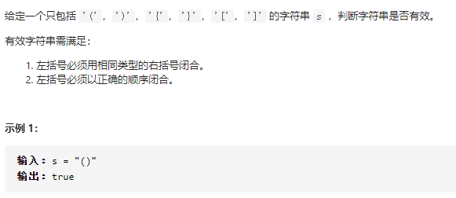
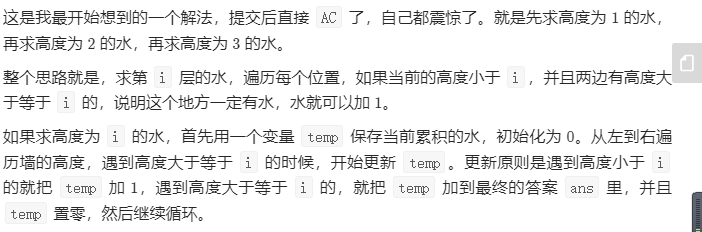
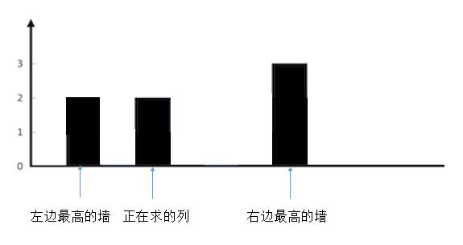
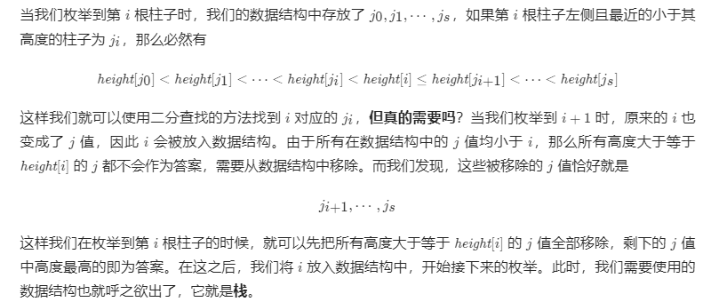
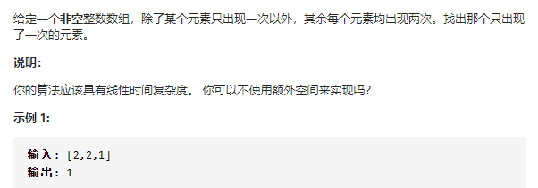
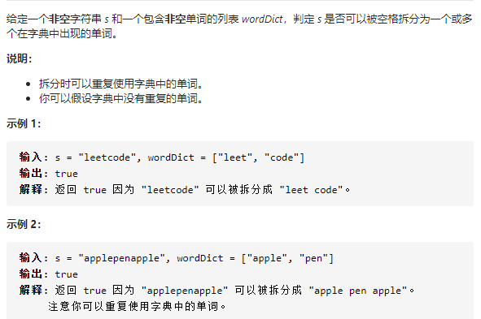
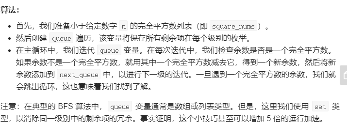
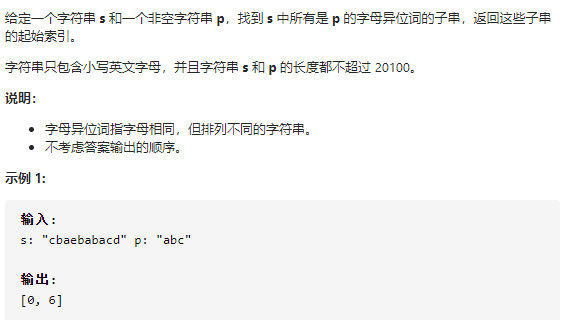

# leetcode_hot100

## 1两数之和(hashmap)


自己提交的结果

```java
class Solution {
    public int[] twoSum(int[] nums, int target) {
        HashMap<Integer,Integer> map = new HashMap<>();
        for(int i = 0;i<nums.length;i++){
                if(map.containsKey(target-nums[i])){
                    return new int[]{map.get(target-nums[i]),i};
                }else{
                map.put(nums[i],i);
                }
        }
        return null;

    }
}
```

lc官方结果

```java
class Solution {
    public int[] twoSum(int[] nums, int target) {
        Map<Integer, Integer> hashtable = new HashMap<Integer, Integer>();
        for (int i = 0; i < nums.length; ++i) {
            if (hashtable.containsKey(target - nums[i])) {
                return new int[]{hashtable.get(target - nums[i]), i};
            }
            hashtable.put(nums[i], i);
        }
        return new int[0];
    }
}

作者：LeetCode-Solution
链接：https://leetcode-cn.com/problems/two-sum/solution/liang-shu-zhi-he-by-leetcode-solution/
来源：力扣（LeetCode）
著作权归作者所有。商业转载请联系作者获得授权，非商业转载请注明出处。
```

## 2两数相加(链表)


我个人的思路是从头遍历两个链表，先拿出两个节点2,5，得到7，构造一个val为7的ListNode;

再拿出4,6得到0以及往上进的位1，构造出val=0的Listnode，并把它放到val为7的ListNode之后；

最后得到整个结果。

官方解：

```java
class Solution {
    public ListNode addTwoNumbers(ListNode l1, ListNode l2) {
        ListNode head = null, tail = null;
        int carry = 0;
        while (l1 != null || l2 != null) {
            int n1 = l1 != null ? l1.val : 0;
            int n2 = l2 != null ? l2.val : 0;
            int sum = n1 + n2 + carry;
            if (head == null) {
                //还能这么写？
                head = tail = new ListNode(sum % 10);
            } else {
                tail.next = new ListNode(sum % 10);
                tail = tail.next;
            }
            carry = sum / 10;
            if (l1 != null) {
                l1 = l1.next;
            }
            if (l2 != null) {
                l2 = l2.next;
            }
        }
        if (carry > 0) {
            tail.next = new ListNode(carry);
        }
        return head;
    }
}

作者：LeetCode-Solution
链接：https://leetcode-cn.com/problems/add-two-numbers/solution/liang-shu-xiang-jia-by-leetcode-solution/
来源：力扣（LeetCode）
著作权归作者所有。商业转载请联系作者获得授权，非商业转载请注明出处。
```

## 3无重复字符串的最长子串(dp,滑动窗口)


我的思路是，利用一个HashMap保存每个字符最新出现的位置，dp[i]是以每个字符结尾时前面出现的最长不重复子串的长度，假设j为上一次某个字符出现的索引，那么：

dp[i] = dp[i-1]  + 1;(dp[i-1]<i-j)

dp[i] = i-j ;(dp[i-1]>=i-j)

这里dp[i]可以被一个常数表示

然后定义一个int res，它是所有dp[i]的最大值，即整个s中的最长子列；

根据这个思路我写的优化过的dp:(85.83%)

```java
class Solution {
    public int lengthOfLongestSubstring(String s) {
        int len = s.length();
        if(len == 0 || len == 1) return len;
        int tmp = 0,j = 0,res = 0;
        HashMap<Character,Integer> map = new HashMap<>();
        for(int i = 0;i<len;i++){
            char ch = s.charAt(i);
            if(map.containsKey(ch)){
                j = map.get(ch);
            }else{
                j = -1;
            }
            tmp = tmp<i-j?tmp+1:i-j;
            res = Math.max(res,tmp);
            map.put(ch,i);
        }
        return res;

    }
}
```

官方题解（滑动窗口）


```java
class Solution {
    public int lengthOfLongestSubstring(String s) {
        // 哈希集合，记录每个字符是否出现过
        Set<Character> occ = new HashSet<Character>();
        int n = s.length();
        // 右指针，初始值为 -1，相当于我们在字符串的左边界的左侧，还没有开始移动
        int rk = -1, ans = 0;
        for (int i = 0; i < n; ++i) {
            if (i != 0) {
                // 左指针向右移动一格，移除一个字符
                occ.remove(s.charAt(i - 1));
            }
            while (rk + 1 < n && !occ.contains(s.charAt(rk + 1))) {
                // 不断地移动右指针
                occ.add(s.charAt(rk + 1));
                ++rk;
            }
            // 第 i 到 rk 个字符是一个极长的无重复字符子串
            ans = Math.max(ans, rk - i + 1);
        }
        return ans;
    }
}

作者：LeetCode-Solution
链接：https://leetcode-cn.com/problems/longest-substring-without-repeating-characters/solution/wu-zhong-fu-zi-fu-de-zui-chang-zi-chuan-by-leetc-2/
来源：力扣（LeetCode）
著作权归作者所有。商业转载请联系作者获得授权，非商业转载请注明出处。
```

## 4寻找两个正序数组的中位数(双指针，二分查找)


最开始的想法，把两个数组都的元素都加入到一个堆里，最后让堆弹出元素；最后根据堆的大小弹出中位数。

还有就是双指针，反正数组是有序的，哪个小让哪个往右移。

我自己写的双指针解法，(82.35%,16%)

```java
class Solution {
    public double findMedianSortedArrays(int[] nums1, int[] nums2) {
        int m = nums1.length,n = nums2.length,mid = (m+n)/2,index = 0;
        int l1 = 0,l2 = 0,res = 0,pre = 0;
        while(index <= mid){
            pre = res;
            if(l1 >= m){
                res = nums2[l2++];
            }
            else if(l2 >= n){
                res = nums1[l1++];
            }else{
                res = nums1[l1]<nums2[l2]?nums1[l1++]:nums2[l2++];
            }
            index++;
        }
        if((m+n)%2==1) return (double)res;
        else{return (double)((res + pre)/2.0);}
        

    }
}
```

res代表返回结果，最开始的时候是俩个数组的最小值，遍历到中间时就代表中位数；

pre是上一轮遍历时res的值，设立res主要是为了方便m+n为偶数时index=(m+n)/2-1的值

假设数组长度和为奇数(m=3,n=4,m+n=7)那就找到俩个数组中第4大的数；

假设数组长度和为偶数(m=3,n=3,m+n=6)，那就找到两个数组中第3和第4大的数；

index表示当前的数是数组中第几小的数，从0开始，不论m+n是奇数还是偶数，最后都要遍历到(m+n)/2这个位置。所以先计算出两个数组第(m+n)/2+1小的值，如果m+n是奇数的话直接返回这个值就行；如果m+n是偶数，拿出当前的res（第(m+n)/2+1小的值）和上一轮（第(m+n)/2小的值）pre，计算它们俩的平均数即可。

官方：二分查找(O(log(m+n)))

用二分查找找出数组第k小的值，这里就是用二分查找找到两个数组第k小的值。


```java
class Solution {
    public double findMedianSortedArrays(int[] nums1, int[] nums2) {
        int length1 = nums1.length, length2 = nums2.length;
        int totalLength = length1 + length2;
        if (totalLength % 2 == 1) {
            int midIndex = totalLength / 2;
            double median = getKthElement(nums1, nums2, midIndex + 1);
            return median;
        } else {
            int midIndex1 = totalLength / 2 - 1, midIndex2 = totalLength / 2;
            double median = (getKthElement(nums1, nums2, midIndex1 + 1) + getKthElement(nums1, nums2, midIndex2 + 1)) / 2.0;
            return median;
        }
    }

    public int getKthElement(int[] nums1, int[] nums2, int k) {
        /* 主要思路：要找到第 k (k>1) 小的元素，那么就取 pivot1 = nums1[k/2-1] 和 pivot2 = nums2[k/2-1] 进行比较
         * 这里的 "/" 表示整除
         * nums1 中小于等于 pivot1 的元素有 nums1[0 .. k/2-2] 共计 k/2-1 个
         * nums2 中小于等于 pivot2 的元素有 nums2[0 .. k/2-2] 共计 k/2-1 个
         * 取 pivot = min(pivot1, pivot2)，两个数组中小于等于 pivot 的元素共计不会超过 (k/2-1) + (k/2-1) <= k-2 个
         * 这样 pivot 本身最大也只能是第 k-1 小的元素
         * 如果 pivot = pivot1，那么 nums1[0 .. k/2-1] 都不可能是第 k 小的元素。把这些元素全部 "删除"，剩下的作为新的 nums1 数组
         * 如果 pivot = pivot2，那么 nums2[0 .. k/2-1] 都不可能是第 k 小的元素。把这些元素全部 "删除"，剩下的作为新的 nums2 数组
         * 由于我们 "删除" 了一些元素（这些元素都比第 k 小的元素要小），因此需要修改 k 的值，减去删除的数的个数
         */

        int length1 = nums1.length, length2 = nums2.length;
        int index1 = 0, index2 = 0;
        int kthElement = 0;

        while (true) {
            // 边界情况
            if (index1 == length1) {
                return nums2[index2 + k - 1];
            }
            if (index2 == length2) {
                return nums1[index1 + k - 1];
            }
            if (k == 1) {
                return Math.min(nums1[index1], nums2[index2]);
            }
            
            // 正常情况
            int half = k / 2;
            int newIndex1 = Math.min(index1 + half, length1) - 1;
            int newIndex2 = Math.min(index2 + half, length2) - 1;
            int pivot1 = nums1[newIndex1], pivot2 = nums2[newIndex2];
            if (pivot1 <= pivot2) {
                k -= (newIndex1 - index1 + 1);
                index1 = newIndex1 + 1;
            } else {
                k -= (newIndex2 - index2 + 1);
                index2 = newIndex2 + 1;
            }
        }
    }
}

作者：LeetCode-Solution
链接：https://leetcode-cn.com/problems/median-of-two-sorted-arrays/solution/xun-zhao-liang-ge-you-xu-shu-zu-de-zhong-wei-s-114/
来源：力扣（LeetCode）
著作权归作者所有。商业转载请联系作者获得授权，非商业转载请注明出处。
```

lc官方给出的复杂度更低的办法O(log(min(m,n)))

```java
class Solution {
    public double findMedianSortedArrays(int[] nums1, int[] nums2) {
        if (nums1.length > nums2.length) {
            return findMedianSortedArrays(nums2, nums1);
        }
        
        //这里m<=n
        int m = nums1.length;
        int n = nums2.length;
        int left = 0, right = m;
        // median1：前一部分的最大值
        // median2：后一部分的最小值
        int median1 = 0, median2 = 0;

        while (left <= right) {
            // 前一部分包含 nums1[0 .. i-1] 和 nums2[0 .. j-1]
            // 后一部分包含 nums1[i .. m-1] 和 nums2[j .. n-1]
            int i = (left + right) / 2;
            int j = (m + n + 1) / 2 - i;

            // nums_im1, nums_i, nums_jm1, nums_j 分别表示 nums1[i-1], nums1[i], nums2[j-1], nums2[j]
            int nums_im1 = (i == 0 ? Integer.MIN_VALUE : nums1[i - 1]);
            int nums_i = (i == m ? Integer.MAX_VALUE : nums1[i]);
            int nums_jm1 = (j == 0 ? Integer.MIN_VALUE : nums2[j - 1]);
            int nums_j = (j == n ? Integer.MAX_VALUE : nums2[j]);

            if (nums_im1 <= nums_j) {
                median1 = Math.max(nums_im1, nums_jm1);
                median2 = Math.min(nums_i, nums_j);
                left = i + 1;
            } else {
                right = i - 1;
            }
        }

        return (m + n) % 2 == 0 ? (median1 + median2) / 2.0 : median1;
    }
}

作者：LeetCode-Solution
链接：https://leetcode-cn.com/problems/median-of-two-sorted-arrays/solution/xun-zhao-liang-ge-you-xu-shu-zu-de-zhong-wei-s-114/
来源：力扣（LeetCode）
著作权归作者所有。商业转载请联系作者获得授权，非商业转载请注明出处。
```

## 5最长回文子串(dp,中心扩展)

感觉还是dp，dp[i]表示以i结尾的最长回文子串，j为s.charAt(i)上一次出现的索引

dp[i] = dp[i-1] (j-i>=dp[i-1])

dp[i] = j-i+1(j-i<dp[i-1])

试着做了一下，好像不行。。

他人提供的分析思路

```
这道题比较烦人的是判断回文子串。因此需要一种能够快速判断原字符串的所有子串是否是回文子串的方法，于是想到了「动态规划」。

「动态规划」的一个关键的步骤是想清楚「状态如何转移」。事实上，「回文」天然具有「状态转移」性质。

一个回文去掉两头以后，剩下的部分依然是回文（这里暂不讨论边界情况）；
依然从回文串的定义展开讨论：

如果一个字符串的头尾两个字符都不相等，那么这个字符串一定不是回文串；
如果一个字符串的头尾两个字符相等，才有必要继续判断下去。
如果里面的子串是回文，整体就是回文串；
如果里面的子串不是回文串，整体就不是回文串。
即：在头尾字符相等的情况下，里面子串的回文性质据定了整个子串的回文性质，这就是状态转移。因此可以把「状态」定义为原字符串的一个子串是否为回文子串。

第 1 步：定义状态
dp[i][j] 表示子串 s[i..j] 是否为回文子串，这里子串 s[i..j] 定义为左闭右闭区间，可以取到 s[i] 和 s[j]。

第 2 步：思考状态转移方程
在这一步分类讨论（根据头尾字符是否相等），根据上面的分析得到：


dp[i][j] = (s[i] == s[j]) and dp[i + 1][j - 1]
说明：

「动态规划」事实上是在填一张二维表格，由于构成子串，因此 i 和 j 的关系是 i <= j ，因此，只需要填这张表格对角线以上的部分。

看到 dp[i + 1][j - 1] 就得考虑边界情况。

边界条件是：表达式 [i + 1, j - 1] 不构成区间，即长度严格小于 2，即 j - 1 - (i + 1) + 1 < 2 ，整理得 j - i < 3。

这个结论很显然：j - i < 3 等价于 j - i + 1 < 4，即当子串 s[i..j] 的长度等于 2 或者等于 3 的时候，其实只需要判断一下头尾两个字符是否相等就可以直接下结论了。

如果子串 s[i + 1..j - 1] 只有 1 个字符，即去掉两头，剩下中间部分只有 1 个字符，显然是回文；
如果子串 s[i + 1..j - 1] 为空串，那么子串 s[i, j] 一定是回文子串。
因此，在 s[i] == s[j] 成立和 j - i < 3 的前提下，直接可以下结论，dp[i][j] = true，否则才执行状态转移。

第 3 步：考虑初始化
初始化的时候，单个字符一定是回文串，因此把对角线先初始化为 true，即 dp[i][i] = true 。

事实上，初始化的部分都可以省去。因为只有一个字符的时候一定是回文，dp[i][i] 根本不会被其它状态值所参考。

第 4 步：考虑输出
只要一得到 dp[i][j] = true，就记录子串的长度和起始位置，没有必要截取，这是因为截取字符串也要消耗性能，记录此时的回文子串的「起始位置」和「回文长度」即可。

第 5 步：考虑优化空间
因为在填表的过程中，只参考了左下方的数值。事实上可以优化，但是增加了代码编写和理解的难度，丢失可读和可解释性。在这里不优化空间。

注意事项：总是先得到小子串的回文判定，然后大子串才能参考小子串的判断结果，即填表顺序很重要。

大家能够可以自己动手，画一下表格，相信会对「动态规划」作为一种「表格法」有一个更好的理解。

作者：liweiwei1419
链接：https://leetcode-cn.com/problems/longest-palindromic-substring/solution/zhong-xin-kuo-san-dong-tai-gui-hua-by-liweiwei1419/
来源：力扣（LeetCode）
著作权归作者所有。商业转载请联系作者获得授权，非商业转载请注明出处。
```

```java
public class Solution {

    public String longestPalindrome(String s) {
        // 特判
        int len = s.length();
        if (len < 2) {
            return s;
        }

        int maxLen = 1;
        int begin = 0;

        // dp[i][j] 表示 s[i, j] 是否是回文串
        boolean[][] dp = new boolean[len][len];
        char[] charArray = s.toCharArray();

        for (int i = 0; i < len; i++) {
            dp[i][i] = true;
        }
        //dp[i][j] = s[i]==s[j]&&dp[i+1][j-1]，所以先遍历j后遍历i
        for (int j = 1; j < len; j++) {
            for (int i = 0; i < j; i++) {
                if (charArray[i] != charArray[j]) {
                    dp[i][j] = false;
                } else {
                    if (j - i < 3) {
                        dp[i][j] = true;
                    } else {
                        dp[i][j] = dp[i + 1][j - 1];
                    }
                }

                // 只要 dp[i][j] == true 成立，就表示子串 s[i..j] 是回文，此时记录回文长度和起始位置
                if (dp[i][j] && j - i + 1 > maxLen) {
                    maxLen = j - i + 1;
                    begin = i;
                }
            }
        }
        return s.substring(begin, begin + maxLen);
    }
}

作者：liweiwei1419
链接：https://leetcode-cn.com/problems/longest-palindromic-substring/solution/zhong-xin-kuo-san-dong-tai-gui-hua-by-liweiwei1419/
来源：力扣（LeetCode）
著作权归作者所有。商业转载请联系作者获得授权，非商业转载请注明出处。
```

另一种填表方式

```java
import java.util.Arrays;

public class Solution {

    public String longestPalindrome(String s) {
        int len = s.length();
        if (len < 2) {
            return s;
        }
        //这步可省略吧
        boolean[][] dp = new boolean[len][len];
        for (int i = 0; i < len; i++) {
            Arrays.fill(dp[i], false);
        }

        // 初始化
        for (int i = 0; i < len; i++) {
            dp[i][i] = true;
        }


        char[] charArray = s.toCharArray();
        int maxLen = 1;
        int start = 0;

        for (int j = 1; j < len; j++) {
            // 只有下面这一行和「参考代码 2」不同，i 正着写、倒过来写都行，因为子串都有参考值
            for (int i = j - 1; i >= 0; i--) {

                if (charArray[i] == charArray[j]) {
                    if (j - i < 3) {
                        dp[i][j] = true;
                    } else {
                        dp[i][j] = dp[i + 1][j - 1];
                    }
                } else {
                    dp[i][j] = false;
                }

                // 只要 dp[i][j] == true 成立，就表示子串 s[i, j] 是回文，此时记录回文长度和起始位置
                if (dp[i][j]) {
                    int curLen = j - i + 1;
                    if (curLen > maxLen) {
                        maxLen = curLen;
                        start = i;
                    }
                }
            }
        }
        return s.substring(start, start + maxLen);
    }
}

作者：liweiwei1419
链接：https://leetcode-cn.com/problems/longest-palindromic-substring/solution/zhong-xin-kuo-san-dong-tai-gui-hua-by-liweiwei1419/
来源：力扣（LeetCode）
著作权归作者所有。商业转载请联系作者获得授权，非商业转载请注明出处。
```

**这里j会依赖上一步j-1的值，所以优先遍历j，而且从前往后遍历j**

除了dp还有中心扩散法：

```
暴力法采用双指针两边夹，验证是否是回文子串。

除了枚举字符串的左右边界以外，比较容易想到的是枚举可能出现的回文子串的“中心位置”，从“中心位置”尝试尽可能扩散出去，得到一个回文串。

因此中心扩散法的思路是：遍历每一个索引，以这个索引为中心，利用“回文串”中心对称的特点，往两边扩散，看最多能扩散多远。

枚举“中心位置”时间复杂度为 O(N)，从“中心位置”扩散得到“回文子串”的时间复杂度为 O(N)，因此时间复杂度可以降到 O(N^2)。

在这里要注意一个细节：回文串在长度为奇数和偶数的时候，“回文中心”的形式是不一样的。

奇数回文串的“中心”是一个具体的字符，例如：回文串 "aba" 的中心是字符 "b"；
偶数回文串的“中心”是位于中间的两个字符的“空隙”，例如：回文串串 "abba" 的中心是两个 "b" 中间的那个“空隙”。


我们看一下一个字符串可能的回文子串的中心在哪里？


我们可以设计一个方法，兼容以上两种情况：

1、如果传入重合的索引编码，进行中心扩散，此时得到的回文子串的长度是奇数；

2、如果传入相邻的索引编码，进行中心扩散，此时得到的回文子串的长度是偶数。

具体编码细节在以下的代码的注释中体现。

作者：liweiwei1419
链接：https://leetcode-cn.com/problems/longest-palindromic-substring/solution/zhong-xin-kuo-san-dong-tai-gui-hua-by-liweiwei1419/
来源：力扣（LeetCode）
著作权归作者所有。商业转载请联系作者获得授权，非商业转载请注明出处。
```

```java
public class Solution {

    public String longestPalindrome(String s) {
        int len = s.length();
        if (len < 2) {
            return s;
        }
        int maxLen = 1;
        String res = s.substring(0, 1);
        // 中心位置枚举到 len - 2 即可
        for (int i = 0; i < len - 1; i++) {
            String oddStr = centerSpread(s, i, i);
            String evenStr = centerSpread(s, i, i + 1);
            String maxLenStr = oddStr.length() > evenStr.length() ? oddStr : evenStr;
            if (maxLenStr.length() > maxLen) {
                maxLen = maxLenStr.length();
                res = maxLenStr;
            }
        }
        return res;
    }

    private String centerSpread(String s, int left, int right) {
        // left = right 的时候，此时回文中心是一个字符，回文串的长度是奇数
        // right = left + 1 的时候，此时回文中心是一个空隙，回文串的长度是偶数
        int len = s.length();
        int i = left;
        int j = right;
        while (i >= 0 && j < len) {
            if (s.charAt(i) == s.charAt(j)) {
                i--;
                j++;
            } else {
                break;
            }
        }
        // 这里要小心，跳出 while 循环时，恰好满足 s.charAt(i) != s.charAt(j)，因此不能取 i，不能取 j
        return s.substring(i + 1, j);
    }
}

作者：liweiwei1419
链接：https://leetcode-cn.com/problems/longest-palindromic-substring/solution/zhong-xin-kuo-san-dong-tai-gui-hua-by-liweiwei1419/
来源：力扣（LeetCode）
著作权归作者所有。商业转载请联系作者获得授权，非商业转载请注明出处。
```

## 10正则表达式匹配(dp)

剑指offer上有这道题

自己写的(80.17%)

```java
class Solution {
    public boolean isMatch(String s, String p) {
        int slen = s.length(),plen = p.length();
        boolean[][] dp = new boolean[slen+1][plen+1];
        dp[0][0] = true;
        for(int i = 0;i <= slen;i++){
            for(int j = 1;j <= plen;j++){
                char ch = p.charAt(j-1);
                if(ch == '*'){
                    if(j>1&&dp[i][j-2]) dp[i][j] = true;
                    else{
                        if(i>0&&j>1&&(p.charAt(j-2)==s.charAt(i-1)||p.charAt(j-2)=='.')){
                            dp[i][j] |= dp[i-1][j];
                        }
                    }
                }else{
                    dp[i][j] = i>0&&(ch==s.charAt(i-1)||ch=='.')&&dp[i-1][j-1];
                }
            }
        }
        return dp[slen][plen];

    }
}
```

其他逻辑都了解了，就是ch == '*'这块逻辑不太熟，凭记忆写的，

我这里j是从1开始遍历的,因为dp[i] [0]除了i=0时为true，其他情境下都是false，我一开始就给dp[0] [0]赋值了。

这里的一个关键点是

```
"a*"和"aaa"匹配，假设现在我们知道*前的字符a和"aaa"的最后一个字符a匹配，那么接下来该匹配什么？
我们这里是每一个i，j从1遍历到末尾，分别看看s.substring(0,i+1)和p.substring(1),...,p.substring(p.length())是否匹配，然后i再加1
我们应该拿"aa"和"a*"匹配，这一步是否匹配都在上一轮的i被计算出来了；而不是拿*前的a和"aa"匹配
```

## 11盛水最多的容器（双指针）


O(N^2)的解很容易想出来

我想到双指针了，但是没想到具体怎么操作；

```
我们先从题目中的示例开始，一步一步地解释双指针算法的过程。稍后再给出算法正确性的证明。

题目中的示例为：


[1, 8, 6, 2, 5, 4, 8, 3, 7]
 ^                       ^
在初始时，左右指针分别指向数组的左右两端，它们可以容纳的水量为 min(1, 7) * 8 = 8。

此时我们需要移动一个指针。移动哪一个呢？直觉告诉我们，应该移动对应数字较小的那个指针（即此时的左指针）。这是因为，由于容纳的水量是由

两个指针指向的数字中较小值 * 指针之间的距离

决定的。如果我们移动数字较大的那个指针，那么前者「两个指针指向的数字中较小值」不会增加，后者「指针之间的距离」会减小，那么这个乘积会减小。因此，我们移动数字较大的那个指针是不合理的。因此，我们移动 数字较小的那个指针。

有读者可能会产生疑问：我们可不可以同时移动两个指针？ 先别急，我们先假设 总是移动数字较小的那个指针 的思路是正确的，在走完流程之后，我们再去进行证明。

所以，我们将左指针向右移动：


[1, 8, 6, 2, 5, 4, 8, 3, 7]
    ^                    ^
此时可以容纳的水量为 min(8, 7) * 7 = 49。由于右指针对应的数字较小，我们移动右指针：


[1, 8, 6, 2, 5, 4, 8, 3, 7]
    ^                 ^
此时可以容纳的水量为 min(8, 3) * 6 = 18。由于右指针对应的数字较小，我们移动右指针：


[1, 8, 6, 2, 5, 4, 8, 3, 7]
    ^              ^
此时可以容纳的水量为 min(8, 8) * 5 = 40。两指针对应的数字相同，我们可以任意移动一个，例如左指针：


[1, 8, 6, 2, 5, 4, 8, 3, 7]
       ^           ^
此时可以容纳的水量为 min(6, 8) * 4 = 24。由于左指针对应的数字较小，我们移动左指针，并且可以发现，在这之后左指针对应的数字总是较小，因此我们会一直移动左指针，直到两个指针重合。在这期间，对应的可以容纳的水量为：min(2, 8) * 3 = 6，min(5, 8) * 2 = 10，min(4, 8) * 1 = 4。

在我们移动指针的过程中，计算到的最多可以容纳的数量为 49，即为最终的答案

作者：LeetCode-Solution
链接：https://leetcode-cn.com/problems/container-with-most-water/solution/sheng-zui-duo-shui-de-rong-qi-by-leetcode-solution/
来源：力扣（LeetCode）
著作权归作者所有。商业转载请联系作者获得授权，非商业转载请注明出处。
```


```java
public class Solution {
    public int maxArea(int[] height) {
        int l = 0, r = height.length - 1;
        int ans = 0;
        while (l < r) {
            int area = Math.min(height[l], height[r]) * (r - l);
            ans = Math.max(ans, area);
            if (height[l] <= height[r]) {
                ++l;
            }
            else {
                --r;
            }
        }
        return ans;
    }
}

作者：LeetCode-Solution
链接：https://leetcode-cn.com/problems/container-with-most-water/solution/sheng-zui-duo-shui-de-rong-qi-by-leetcode-solution/
来源：力扣（LeetCode）
著作权归作者所有。商业转载请联系作者获得授权，非商业转载请注明出处。
```

## 15三数之和(指针优化循环)


想到回溯了，而且这个结果去重跟offer里38字符串排列那个很像。（本质不一样，回溯那个只要排列就行了，这个还要考虑和为0这个限制）

但是这个好像是排序+双指针


本质上是三重循环，只不过第三次循环被一个向前移动的指针代替了O(N^2)

```java
class Solution {
    public List<List<Integer>> threeSum(int[] nums) {
        int n = nums.length;
        Arrays.sort(nums);
        List<List<Integer>> ans = new ArrayList<List<Integer>>();
        // 枚举 a
        for (int first = 0; first < n; ++first) {
            // 需要和上一次枚举的数不相同
            if (first > 0 && nums[first] == nums[first - 1]) {
                continue;
            }
            // c 对应的指针初始指向数组的最右端
            int third = n - 1;
            int target = -nums[first];
            // 枚举 b
            for (int second = first + 1; second < n; ++second) {
                // 需要和上一次枚举的数不相同
                if (second > first + 1 && nums[second] == nums[second - 1]) {
                    continue;
                }
                // 需要保证 b 的指针在 c 的指针的左侧
                while (second < third && nums[second] + nums[third] > target) {
                    --third;
                }
                // 如果指针重合，随着 b 后续的增加
                // 就不会有满足 a+b+c=0 并且 b<c 的 c 了，可以退出循环
                if (second == third) {
                    break;
                }
                if (nums[second] + nums[third] == target) {
                    List<Integer> list = new ArrayList<Integer>();
                    list.add(nums[first]);
                    list.add(nums[second]);
                    list.add(nums[third]);
                    ans.add(list);
                }
            }
        }
        return ans;
    }
}

作者：LeetCode-Solution
链接：https://leetcode-cn.com/problems/3sum/solution/san-shu-zhi-he-by-leetcode-solution/
来源：力扣（LeetCode）
著作权归作者所有。商业转载请联系作者获得授权，非商业转载请注明出处。
```

## 17电话号码的字母组合（回溯）


我提交的答案

```java
class Solution {
    private String[] keys={"","","abc","def","ghi","jkl","mno","pqrs","tuv","wxyz"};
    public List<String> letterCombinations(String digits) {
        List<String> combinations=new ArrayList<>();
        if(digits==null||digits.length()==0) return combinations;
        bs(new StringBuilder(),combinations,digits);
        return combinations;

    }
    private void bs(StringBuilder prefix,List<String> combinations,String digits){
        if(prefix.length()==digits.length()){
            combinations.add(prefix.toString());
            return;
        }
        int curDigits=digits.charAt(prefix.length())-'0';
        String letter=keys[curDigits];
        for(char c:letter.toCharArray()){
            prefix.append(String.valueOf(c));
            bs(prefix,combinations,digits);
            prefix.deleteCharAt(prefix.length()-1);
        }

    }
}
```

官方也是回溯

```java
class Solution {
    public List<String> letterCombinations(String digits) {
        List<String> combinations = new ArrayList<String>();
        if (digits.length() == 0) {
            return combinations;
        }
        Map<Character, String> phoneMap = new HashMap<Character, String>() {{
            put('2', "abc");
            put('3', "def");
            put('4', "ghi");
            put('5', "jkl");
            put('6', "mno");
            put('7', "pqrs");
            put('8', "tuv");
            put('9', "wxyz");
        }};
        backtrack(combinations, phoneMap, digits, 0, new StringBuffer());
        return combinations;
    }

    public void backtrack(List<String> combinations, Map<Character, String> phoneMap, String digits, int index, StringBuffer combination) {
        if (index == digits.length()) {
            combinations.add(combination.toString());
        } else {
            char digit = digits.charAt(index);
            String letters = phoneMap.get(digit);
            int lettersCount = letters.length();
            for (int i = 0; i < lettersCount; i++) {
                combination.append(letters.charAt(i));
                backtrack(combinations, phoneMap, digits, index + 1, combination);
                combination.deleteCharAt(index);
            }
        }
    }
}

作者：LeetCode-Solution
链接：https://leetcode-cn.com/problems/letter-combinations-of-a-phone-number/solution/dian-hua-hao-ma-de-zi-mu-zu-he-by-leetcode-solutio/
来源：力扣（LeetCode）
著作权归作者所有。商业转载请联系作者获得授权，非商业转载请注明出处。
```

## 19删除链表倒数第n个节点(双指针，栈)


先找到链表倒数第n+1个节点，然后删除第n个节点

我的提交(100%，18%)

我想说一下使用双指针先找到倒数第n+1个节点时可能会存在的问题：

如果按照之前的代码那样，把slow和fast都赋为head，先让fast走n+1步，然后再让fast和slow一起走，如果fast走到null的时候，此时slow所在的位置就是倒数第n+1个节点；

* 如果链表长度小于n，也就是说fast没走完n+1步就碰到null了，直接返回head，因为链表长度根本不到n，所以倒数第n个节点不存在（不需要删）
* 如果链表长度等于n，fast先走完n步到达null，这个时候由于fast==null，fast不再前进，此时倒数第n+1个节点找不到；
* 链表长度大于n的话，比如(n+1)，fast刚好走到null，fast和slow一起走时因为fast已经是null了，所以slow就呆在第一个节点，第一个节点就是倒数第n+1个节点。
* 所以现在关键就是长度为n时如何处理。可以在fast走n+1步时加一个判断，如果fast==null&&i==n，i表示fast先走的步数，如果fast是走了第n步才到null的，说明链表长度为n，要删除的节点就是第一个节点。

```java
/**
 * Definition for singly-linked list.
 * public class ListNode {
 *     int val;
 *     ListNode next;
 *     ListNode(int x) { val = x; }
 * }
 */
class Solution {
    public ListNode removeNthFromEnd(ListNode head, int n) {
        ListNode former = head, latter = head;
        for(int i = 0; i < n + 1; i++){
            if(former == null && i < n) return head;//链表长度没到N
            else if(former == null && i == n){//链表长度刚好是n
                ListNode next = head.next;
                head.next = null;
                return next;
            }
            former = former.next;

        }
        while(former != null) {
            former = former.next;
            latter = latter.next;
        }
        latter.next = latter.next.next;
        return head;

    }
}

```

lc官方：栈方法

```java
class Solution {
    public ListNode removeNthFromEnd(ListNode head, int n) {
        ListNode dummy = new ListNode(0, head);
        Deque<ListNode> stack = new LinkedList<ListNode>();
        ListNode cur = dummy;
        while (cur != null) {
            stack.push(cur);
            cur = cur.next;
        }
        for (int i = 0; i < n; ++i) {
            stack.pop();
        }
        ListNode prev = stack.peek();
        prev.next = prev.next.next;
        ListNode ans = dummy.next;
        return ans;
    }
}

作者：LeetCode-Solution
链接：https://leetcode-cn.com/problems/remove-nth-node-from-end-of-list/solution/shan-chu-lian-biao-de-dao-shu-di-nge-jie-dian-b-61/
来源：力扣（LeetCode）
著作权归作者所有。商业转载请联系作者获得授权，非商业转载请注明出处。
```

lc双指针，它在前面加一个dummy的情况更有效的处理了要删除的节点就是第一个节点的情况。

```java
class Solution {
    public ListNode removeNthFromEnd(ListNode head, int n) {
        ListNode dummy = new ListNode(0, head);
        ListNode first = head;
        ListNode second = dummy;
        for (int i = 0; i < n; ++i) {
            first = first.next;
        }
        while (first != null) {
            first = first.next;
            second = second.next;
        }
        second.next = second.next.next;
        ListNode ans = dummy.next;
        return ans;
    }
}

作者：LeetCode-Solution
链接：https://leetcode-cn.com/problems/remove-nth-node-from-end-of-list/solution/shan-chu-lian-biao-de-dao-shu-di-nge-jie-dian-b-61/
来源：力扣（LeetCode）
著作权归作者所有。商业转载请联系作者获得授权，非商业转载请注明出处。
```

## 20有效的括号（栈）



```java
class Solution {
    public boolean isValid(String s) {
        if(s==null||s.length()%2==1) return false;
        Stack<String> stack = new Stack<>();
        for(int i = 0;i<s.length();i++){
            String sub = s.substring(i,i+1);
            if(sub.equals(")")){
                if(!stack.isEmpty()&&stack.peek().equals("(")) stack.pop();
                else return false;
            }
            else if(sub.equals("]")){
                if(!stack.isEmpty()&&stack.peek().equals("[")) stack.pop();
                else return false;
            }
            else if(sub.equals("}")){
                if(!stack.isEmpty()&&stack.peek().equals("{")) stack.pop();
                else return false;
            }else{
                stack.push(sub);
            }
        }
        return stack.isEmpty();

    }
}
```

这个没必要看官方题解

## 21合并两个有序链表(归并排序，递归)


我的提交

```java
/**
 * Definition for singly-linked list.
 * public class ListNode {
 *     int val;
 *     ListNode next;
 *     ListNode() {}
 *     ListNode(int val) { this.val = val; }
 *     ListNode(int val, ListNode next) { this.val = val; this.next = next; }
 * }
 */
class Solution {
    public ListNode mergeTwoLists(ListNode l1, ListNode l2) {
        ListNode pre = new ListNode(-1);
        ListNode head = pre;
        while(l1!=null||l2!=null){
        if(l1==null){
            pre.next=l2;
            return head.next;
        }
        if(l2==null){
            pre.next=l1;
            return head.next;
        }
        if(l1.val<l2.val){
            pre.next=l1;
            l1=l1.next;
        }else{
            pre.next=l2;
            l2=l2.next;
        }
        pre=pre.next;

        } 
        return head.next; 
    }
}
```

官方的递归

```java
class Solution {
    public ListNode mergeTwoLists(ListNode l1, ListNode l2) {
        if (l1 == null) {
            return l2;
        } else if (l2 == null) {
            return l1;
        } else if (l1.val < l2.val) {
            l1.next = mergeTwoLists(l1.next, l2);
            return l1;
        } else {
            l2.next = mergeTwoLists(l1, l2.next);
            return l2;
        }

    }
}

作者：LeetCode-Solution
链接：https://leetcode-cn.com/problems/merge-two-sorted-lists/solution/he-bing-liang-ge-you-xu-lian-biao-by-leetcode-solu/
来源：力扣（LeetCode）
著作权归作者所有。商业转载请联系作者获得授权，非商业转载请注明出处。
```

官方迭代

```java
class Solution {
    public ListNode mergeTwoLists(ListNode l1, ListNode l2) {
        ListNode prehead = new ListNode(-1);

        ListNode prev = prehead;
        while (l1 != null && l2 != null) {
            if (l1.val <= l2.val) {
                prev.next = l1;
                l1 = l1.next;
            } else {
                prev.next = l2;
                l2 = l2.next;
            }
            prev = prev.next;
        }

        // 合并后 l1 和 l2 最多只有一个还未被合并完，我们直接将链表末尾指向未合并完的链表即可
        prev.next = l1 == null ? l2 : l1;

        return prehead.next;
    }
}

作者：LeetCode-Solution
链接：https://leetcode-cn.com/problems/merge-two-sorted-lists/solution/he-bing-liang-ge-you-xu-lian-biao-by-leetcode-solu/
来源：力扣（LeetCode）
著作权归作者所有。商业转载请联系作者获得授权，非商业转载请注明出处。
```

## 22括号生成(回溯，递归，dp)


想到回溯了，但是不知道具体怎么做

解法1：lc官方的回溯

```java
class Solution {
    public List<String> generateParenthesis(int n) {
        List<String> ans = new ArrayList<String>();
        backtrack(ans, new StringBuilder(), 0, 0, n);
        return ans;
    }

    public void backtrack(List<String> ans, StringBuilder cur, int open, int close, int max) {
        if (cur.length() == max * 2) {
            ans.add(cur.toString());
            return;
        }
        //左括号小于n那就加左括号
        if (open < max) {
            cur.append('(');
            backtrack(ans, cur, open + 1, close, max);
            cur.deleteCharAt(cur.length() - 1);
        }
        //右括号小于左括号就加右括号
        if (close < open) {
            cur.append(')');
            backtrack(ans, cur, open, close + 1, max);
            cur.deleteCharAt(cur.length() - 1);
        }
    }
}

作者：LeetCode-Solution
链接：https://leetcode-cn.com/problems/generate-parentheses/solution/gua-hao-sheng-cheng-by-leetcode-solution/
来源：力扣（LeetCode）
著作权归作者所有。商业转载请联系作者获得授权，非商业转载请注明出处。
```

该怎么理解呢？假设不要求括号是有效的，那么")("这种也是可以的，那么就相当于求"("和")"的一个全排列，这个我可以写出来。

```java
        if (cur.length() == max * 2) {
            ans.add(cur.toString());
            return;
        }
        //先给当前cur加上'('
        cur.append('(');
        //回溯
        backtrack(ans, cur, max);
        //擦屁股，删掉'('
        cur.deleteCharAt(cur.length() - 1);
        //先给当前cur加上')'
        cur.append(')');
        //回溯
        backtrack(ans, cur, open, close + 1, max);
        //擦屁股，删掉')'
        cur.deleteCharAt(cur.length() - 1);
```

现在对括号有了限制条件，

* 当你选择加一个"("时，此时临时字符串中的"("不能超过n；
* 当你选择加一个")"时，此时临时字符串中的")"不能超过n；

知道这两个条件后就很容易理解上面的代码了；

解法2：按括号序列的长度递归


这里的重点是引入了缓存，避免重复计算。

```java
class Solution {
    //原题n最大是8，所以这里取9就行了
    ArrayList[] cache = new ArrayList[100];

    public List<String> generate(int n) {
        if (cache[n] != null) {
            return cache[n];
        }
        ArrayList<String> ans = new ArrayList<String>();
        if (n == 0) {
            ans.add("");
        } else {
            for (int c = 0; c < n; ++c) {
                for (String left: generate(c)) {
                    for (String right: generate(n - 1 - c)) {
                        ans.add("(" + left + ")" + right);
                    }
                }
            }
        }
        cache[n] = ans;
        return ans;
    }

    public List<String> generateParenthesis(int n) {
        return generate(n);
    }
}

作者：LeetCode-Solution
链接：https://leetcode-cn.com/problems/generate-parentheses/solution/gua-hao-sheng-cheng-by-leetcode-solution/
来源：力扣（LeetCode）
著作权归作者所有。商业转载请联系作者获得授权，非商业转载请注明出处。
```

解法3：动态规划（上面递归思路的拓展）


这里result.get(i)保存n=i时的所有括号组合

```java
public List<String> generateParenthesis(int n) {
		LinkedList<LinkedList<String>> result = new LinkedList<LinkedList<String>>();
		if (n == 0)
			return result.get(0);
		LinkedList<String> list0 = new LinkedList<String>();
		list0.add("");
		result.add(list0);
		LinkedList<String> list1 = new LinkedList<String>();
		list1.add("()");
		result.add(list1);
		for (int i = 2; i <= n; i++) {
			LinkedList<String> temp = new LinkedList<String>();
			for (int j = 0; j < i; j++) {
				List<String> str1 = result.get(j);
				List<String> str2 = result.get(i - 1 - j);
				for (String s1 : str1) {
					for (String s2 : str2) {
						String el = "(" + s1 + ")" + s2;
						temp.add(el);
					}
				}

			}
			result.add(temp);
		}
		return result.get(n);
	}
```

解法4：bfs

一般用bfs干dfs的活需要编写节点类保存状态。

```java
import java.util.ArrayDeque;
import java.util.ArrayList;
import java.util.Deque;
import java.util.LinkedList;
import java.util.List;
import java.util.Queue;

public class Solution {

    class Node {
        /**
         * 当前得到的字符串
         */
        private String res;
        /**
         * 剩余左括号数量
         */
        private int left;
        /**
         * 剩余右括号数量
         */
        private int right;

        public Node(String str, int left, int right) {
            this.res = str;
            this.left = left;
            this.right = right;
        }
    }

    public List<String> generateParenthesis(int n) {
        List<String> res = new ArrayList<>();
        if (n == 0) {
            return res;
        }
        Queue<Node> queue = new LinkedList<>();
        queue.offer(new Node("", n, n));

        while (!queue.isEmpty()) {

            Node curNode = queue.poll();
            if (curNode.left == 0 && curNode.right == 0) {
                res.add(curNode.res);
            }
            if (curNode.left > 0) {
                queue.offer(new Node(curNode.res + "(", curNode.left - 1, curNode.right));
            }
            if (curNode.right > 0 && curNode.left < curNode.right) {
                queue.offer(new Node(curNode.res + ")", curNode.left, curNode.right - 1));
            }
        }
        return res;
    }
}

作者：liweiwei1419
链接：https://leetcode-cn.com/problems/generate-parentheses/solution/hui-su-suan-fa-by-liweiwei1419/
来源：力扣（LeetCode）
著作权归作者所有。商业转载请联系作者获得授权，非商业转载请注明出处。
```

## 23合并k个升序链表（分治合并，小根堆）


思路一：顺序合并（就是链表两两合并）假设最长链表长度是n，链表个数是k，时间复杂度是O(n*k^2)，空间复杂度O(1)

```java
class Solution {
    public ListNode mergeKLists(ListNode[] lists) {
        ListNode ans = null;
        for (int i = 0; i < lists.length; ++i) {
            ans = mergeTwoLists(ans, lists[i]);
        }
        return ans;
    }

    public ListNode mergeTwoLists(ListNode a, ListNode b) {
        if (a == null || b == null) {
            return a != null ? a : b;
        }
        ListNode head = new ListNode(0);
        ListNode tail = head, aPtr = a, bPtr = b;
        while (aPtr != null && bPtr != null) {
            if (aPtr.val < bPtr.val) {
                tail.next = aPtr;
                aPtr = aPtr.next;
            } else {
                tail.next = bPtr;
                bPtr = bPtr.next;
            }
            tail = tail.next;
        }
        tail.next = (aPtr != null ? aPtr : bPtr);
        return head.next;
    }
}

作者：LeetCode-Solution
链接：https://leetcode-cn.com/problems/merge-k-sorted-lists/solution/he-bing-kge-pai-xu-lian-biao-by-leetcode-solutio-2/
来源：力扣（LeetCode）
著作权归作者所有。商业转载请联系作者获得授权，非商业转载请注明出处。
```

思路2：分治合并


```java
class Solution {
    public ListNode mergeKLists(ListNode[] lists) {
        return merge(lists, 0, lists.length - 1);
    }

    public ListNode merge(ListNode[] lists, int l, int r) {
        if (l == r) {
            return lists[l];
        }
        if (l > r) {
            return null;
        }
        int mid = (l + r) >> 1;
        return mergeTwoLists(merge(lists, l, mid), merge(lists, mid + 1, r));
    }

    public ListNode mergeTwoLists(ListNode a, ListNode b) {
        if (a == null || b == null) {
            return a != null ? a : b;
        }
        ListNode head = new ListNode(0);
        ListNode tail = head, aPtr = a, bPtr = b;
        while (aPtr != null && bPtr != null) {
            if (aPtr.val < bPtr.val) {
                tail.next = aPtr;
                aPtr = aPtr.next;
            } else {
                tail.next = bPtr;
                bPtr = bPtr.next;
            }
            tail = tail.next;
        }
        tail.next = (aPtr != null ? aPtr : bPtr);
        return head.next;
    }
}

作者：LeetCode-Solution
链接：https://leetcode-cn.com/problems/merge-k-sorted-lists/solution/he-bing-kge-pai-xu-lian-biao-by-leetcode-solutio-2/
来源：力扣（LeetCode）
著作权归作者所有。商业转载请联系作者获得授权，非商业转载请注明出处。
```


思路3：使用优先队列合并


我自己写的(66%,19.4%)

```java
class Solution {
    public ListNode mergeKLists(ListNode[] lists) {
        //使用优先队列
        PriorityQueue<ListNode> q = new PriorityQueue<>((x,y)->x.val-y.val);
        for(ListNode node:lists){
            if(node != null) q.offer(node);
        }
        ListNode head = new ListNode(0);
        ListNode tail = head;
        while(!q.isEmpty()){
            ListNode node = q.poll();
            tail.next = node;
            tail = tail.next;
            if(node.next == null) continue;
            q.offer(node.next);
        }
        return head.next;

    }
}
```

如果是合并k个有序数组怎办？

## 31下一个排列（字典序定义）


完全没思路：

两遍扫描


假设一个序列是这样的:[a5,....a4,a3,a2,a1]最后四位是a4,a3,a2,a1，找到的第一个逆序对是(a4,a3)，这说明a1,a2,a3是递增的，如果a2>a4的话，此时四个数的大小关系为：a3>a2>a4>a1

那么它们下一个字典序就是:[a5,....a2,a1,a4,a3]即把后面第一个大于a4的放到a4的位置上，后面从小到大排列。

自己写的(98.26%,97%)

```java
class Solution {
    public void nextPermutation(int[] nums) {
        int len = nums.length,index = len - 1;
        while(index>0){
            if(index>=1&&(nums[index]>nums[index-1])) break;
            index--;
        }
        if(index == 0){
            reverse(nums,0,len-1);
            return;
        }
        for(int j = len - 1;j >= index;j--){
            if(nums[j]>nums[index-1]){
                swap(nums,index-1,j);
                break;
            }
        }
        reverse(nums,index,len-1);
    }

    private void swap(int[] nums,int i,int j){
        int tmp = nums[i];
        nums[i] = nums[j];
        nums[j] = tmp;
    }

    private void reverse(int[] nums,int i,int j){
        while(i<j){
            swap(nums,i,j);
            i++;
            j--;
        }
    }
}
```

## 32最长的有效括号(dp,栈)


我一开始用栈做的，遇到一个'('就入栈，遇到一个')'就弹出一个'('，然后返回值加2，但这要求的是**连续**的括号

解法1：动态规划


```java
public class Solution {
    public int longestValidParentheses(String s) {
        int maxans = 0;
        int[] dp = new int[s.length()];
        for (int i = 1; i < s.length(); i++) {
            if (s.charAt(i) == ')') {
                if (s.charAt(i - 1) == '(') {
                    dp[i] = (i >= 2 ? dp[i - 2] : 0) + 2;
                } else if (i - dp[i - 1] > 0 && s.charAt(i - dp[i - 1] - 1) == '(') {
                    dp[i] = dp[i - 1] + ((i - dp[i - 1]) >= 2 ? dp[i - dp[i - 1] - 2] : 0) + 2;
                }
                maxans = Math.max(maxans, dp[i]);
            }
        }
        return maxans;
    }
}

作者：LeetCode-Solution
链接：https://leetcode-cn.com/problems/longest-valid-parentheses/solution/zui-chang-you-xiao-gua-hao-by-leetcode-solution/
来源：力扣（LeetCode）
著作权归作者所有。商业转载请联系作者获得授权，非商业转载请注明出处。
```

解法2：栈


简单理解一下栈的做法吧：

一个括号字符串是由有效子串和无法匹配的括号字符组合而成的：

**")()((())"**就拿这个字符串来说，第0个和第3个字符串是不匹配的括号字符，中间部分是有效的字符串，长度分别为2和4，我们还是可以利用栈，遇到左括号就放进去，右括号就弹出来，对于有效括号来说，放进去的都会被弹出来；对于无法匹配的括号，则会留在栈中。往栈中存入下标，最后可以计算出每个有效括号子字符串的长度，那么整个字符串中最长的有效括号就是这些的有效子字符串长度的最大值。

**说白了就是利用栈计算出每个区间的有效子串的长度，最后返回它们的最大值。**

假设一个有效字符串刚刚被整体弹出去，继续遍历s：

* 如果遇到一个'('，直接入栈，开启新一轮的统计工作，结束上一个有效子字符串的统计工作；
* 如果遇到一个')'，此时它面对的一定是一个')'，（如果是'('那么这个')'也能算入有效字符串了），而且不会是空栈，因为之前往栈中保存了一个-1，此时栈底的')'是上一轮剩下的')'，把上一轮的弹出去，让新的')'入栈。

```java
public class Solution {
    public int longestValidParentheses(String s) {
        int maxans = 0;
        Deque<Integer> stack = new LinkedList<Integer>();
        stack.push(-1);
        for (int i = 0; i < s.length(); i++) {
            if (s.charAt(i) == '(') {
                stack.push(i);
            } else {
                stack.pop();
                if (stack.empty()) {
                    stack.push(i);
                } else {
                    maxans = Math.max(maxans, i - stack.peek());
                }
            }
        }
        return maxans;
    }
}

作者：LeetCode-Solution
链接：https://leetcode-cn.com/problems/longest-valid-parentheses/solution/zui-chang-you-xiao-gua-hao-by-leetcode-solution/
来源：力扣（LeetCode）
著作权归作者所有。商业转载请联系作者获得授权，非商业转载请注明出处。
```

解法3：贪心


```java
public class Solution {
    public int longestValidParentheses(String s) {
        int left = 0, right = 0, maxlength = 0;
        for (int i = 0; i < s.length(); i++) {
            if (s.charAt(i) == '(') {
                left++;
            } else {
                right++;
            }
            if (left == right) {
                maxlength = Math.max(maxlength, 2 * right);
            } else if (right > left) {
                left = right = 0;
            }
        }
        left = right = 0;
        for (int i = s.length() - 1; i >= 0; i--) {
            if (s.charAt(i) == '(') {
                left++;
            } else {
                right++;
            }
            if (left == right) {
                maxlength = Math.max(maxlength, 2 * left);
            } else if (left > right) {
                left = right = 0;
            }
        }
        return maxlength;
    }
}

作者：LeetCode-Solution
链接：https://leetcode-cn.com/problems/longest-valid-parentheses/solution/zui-chang-you-xiao-gua-hao-by-leetcode-solution/
来源：力扣（LeetCode）
著作权归作者所有。商业转载请联系作者获得授权，非商业转载请注明出处。
```

## 33搜索旋转排序数组（二分查找）


二分查找：计算出nums[mid]，

如果nums[mid]>nums[l],说明(l,mid)升序，如果nums[mid]<nums[l]，说明说明(mid,r)升序

感觉不好实现，先看看答案吧


```java
class Solution {
    public int search(int[] nums, int target) {
        int n = nums.length;
        if (n == 0) {
            return -1;
        }
        if (n == 1) {
            return nums[0] == target ? 0 : -1;
        }
        int l = 0, r = n - 1;
        while (l <= r) {
            int mid = (l + r) / 2;
            if (nums[mid] == target) {
                return mid;
            }
            if (nums[0] <= nums[mid]) {
                if (nums[0] <= target && target < nums[mid]) {
                    r = mid - 1;
                } else {
                    l = mid + 1;
                }
            } else {
                if (nums[mid] < target && target <= nums[n - 1]) {
                    l = mid + 1;
                } else {
                    r = mid - 1;
                }
            }
        }
        return -1;
    }
}

作者：LeetCode-Solution
链接：https://leetcode-cn.com/problems/search-in-rotated-sorted-array/solution/sou-suo-xuan-zhuan-pai-xu-shu-zu-by-leetcode-solut/
来源：力扣（LeetCode）
著作权归作者所有。商业转载请联系作者获得授权，非商业转载请注明出处。
```

简单说一下这道题吧，这是少见的二分查找题里左界l和右界r不参与计算的题，l和r的作用就是缩小查找范围，使得二者确定的nums[mid]越来越接近target。

**二分查找，l和r都不是重点，重点是范围的缩小和mid的逼近！**

确定一个mid之后，首先判断mid的位置：

* 如果nums[mid]>=nums[0]，说明这里的mid位于左边的上升序列，这个时候判断target是否位于左边的单调上升序列里，如果在的话那就r=mid-1;否则target就在mid右边，l=mid+1;
* 如果nums[mid]<nums[0]，说明此时mid位于右边的上升序列，这个时候判断target是否位于右边的单调上升序列里，如果在的话那就l=mid+1;否则target就在mid左边，r=mid-1;


上面的代码其实可以改成下面这样

```java
class Solution {
    public int search(int[] nums, int target) {
        int n = nums.length;
        if(n == 1) return nums[0]==target?0:-1;
        int l = 0,r = n-1;
        while(l<=r){
            int mid = l + (r-l)/2;
            if(nums[mid] == target) return mid;
            if(nums[0]<=nums[mid]){
                //这里用nums[l]代替nums[0]
                if(nums[mid]>target && nums[l]<=target){
                    r = mid - 1;
                }else{
                    l = mid + 1;
                }
            }else{
                //这里用nums[r]代替nums[n-1]
                if(nums[mid]<target&&nums[r]>=target){
                    l = mid + 1;
                }else{
                    r = mid - 1;
                }
            }
        }
        return -1;

    }
}
```

## 34在排序数组里查找元素第一个和最后一个元素的位置(二分查找)

O(N)的解法很容易做出，题目要求O(logn)，那就得二分查找

我想起来了，找target和target+1第一次出现的位置，最后target+1的位置减去1就是target最后一次出现的位置

自己废了半天劲写出来的(100%,64%)
解释一下我自己写的代码：这部分代码的目的就是找到target**应该**第一次出现的索引

如果left最后超过nums.length了或者没超过但是left（target如果存在的话应该处在的位置）上的元素不是target，都说明target不存在，那就直接返回[-1,-1]，如果存在的话,[left,right-1]就是target在nums上的位置。

```java
class Solution {
    public int[] searchRange(int[] nums, int target) {
        if(nums.length == 0) return new int[]{-1,-1};
        int left = bisearch(nums,target);
        int right = bisearch(nums,target+1);
        if(left >= nums.length || nums[left] != target) return new int[]{-1,-1};
        return new int[]{left,right-1};
    }
    //如果查找的target存在于数组中，那么它会返回target第一次出现的位置;如果不存在，它会返回target应该出现的位置，对于[2,4,5]，target<2的话会返回0；target>5的话会返回4；
    private int bisearch(int[] nums, int target){
        int l = 0,r = nums.length - 1;
        while(l<=r){
            int mid = l + (r-l)/2;
            if(nums[mid]<target) l = mid + 1;
            else { r = mid - 1;}
        }
        return l;
    }
}
```


官方答案

```java
class Solution {
    public int[] searchRange(int[] nums, int target) {
        int leftIdx = binarySearch(nums, target, true);
        int rightIdx = binarySearch(nums, target, false) - 1;
        if (leftIdx <= rightIdx && rightIdx < nums.length && nums[leftIdx] == target && nums[rightIdx] == target) {
            return new int[]{leftIdx, rightIdx};
        } 
        return new int[]{-1, -1};
    }

    public int binarySearch(int[] nums, int target, boolean lower) {
        int left = 0, right = nums.length - 1, ans = nums.length;
        while (left <= right) {
            int mid = (left + right) / 2;
            if (nums[mid] > target || (lower && nums[mid] >= target)) {
                right = mid - 1;
                ans = mid;
            } else {
                left = mid + 1;
            }
        }
        return ans;
    }
}

作者：LeetCode-Solution
链接：https://leetcode-cn.com/problems/find-first-and-last-position-of-element-in-sorted-array/solution/zai-pai-xu-shu-zu-zhong-cha-zhao-yuan-su-de-di-3-4/
来源：力扣（LeetCode）
著作权归作者所有。商业转载请联系作者获得授权，非商业转载请注明出处。
```

## 39组合总和(回溯)


回溯

我自己提交的代码

```java
class Solution {
    public List<List<Integer>> combinationSum(int[] candidates, int target) {
        List<List<Integer>> ans = new ArrayList<List<Integer>>();
        List<Integer> combine = new ArrayList<Integer>();
        dfs(candidates, target, ans, combine, 0);
        return ans;
    }

    private void dfs(int[] candidates,int target,List<List<Integer>> ans,List<Integer> combine,int start){
        if(target==0){
            //为啥不直接ans.add(combine)，因为combie只有一份，对于第i层，把所有第i+1层节点遍历完之后，combine是空的
            ans.add(new ArrayList<>(combine));
            return;
        }
        for(int i=start;i<candidates.length;i++){
            if(candidates[i]<=target){
                combine.add(candidates[i]);
                dfs(candidates,target-candidates[i],ans,combine,i);
                //加了的都会被删除
                combine.remove(combine.size()-1);
            }
        }
    }


}
```

这里最重要的就是剪枝；如果我们从头开始遍历的话是这样的，以[2,3,6,7],target=7为例；


比如第二个元素3，他可能在它前面的以2开头的那一枝中被用于构建target了，结果以它为头时，前面被遍历过的元素2重新被他遍历到了，造成重复结果。

规定每一层的遍历只能以当前根节点的索引开始，比如根节点是3时，下一层从3开始遍历，不能从2开始。

## 42接雨水(dp，栈)


想到了优先队列，队列中保存一个int[]数组，比如[2,1]。2代表索引位置，1代表2位置之前的高度是1，总之就是遇到下降的就保存。

解法1：暴力按行求



```java
public int trap(int[] height) {
    int sum = 0;
    int max = getMax(height);//找到最大的高度，以便遍历。
    for (int i = 1; i <= max; i++) {
        boolean isStart = false; //标记是否开始更新 temp
        int temp_sum = 0;
        //遍历到某一列j，如果列的高度大于等于i，说明这一列可以作为高度为i的水的左壁了,把isStart设为true，并且把刚才积累的水加到总量上，然后积累的水清空；如果小于i，那么说明当前列是一个积累水的列，temp+1。
        for (int j = 0; j < height.length; j++) {
            if (isStart && height[j] < i) {
                temp_sum++;
            }
            if (height[j] >= i) {
                sum = sum + temp_sum;
                temp_sum = 0;
                isStart = true;
            }
        }
    }
    return sum;
}
private int getMax(int[] height) {
		int max = 0;
		for (int i = 0; i < height.length; i++) {
			if (height[i] > max) {
				max = height[i];
			}
		}
		return max;
}

作者：windliang
链接：https://leetcode-cn.com/problems/trapping-rain-water/solution/xiang-xi-tong-su-de-si-lu-fen-xi-duo-jie-fa-by-w-8/
来源：力扣（LeetCode）
著作权归作者所有。商业转载请联系作者获得授权，非商业转载请注明出处。
```

解法2：按列求

求每一列的水，我们只需要关注当前列，以及左边最高的墙，右边最高的墙就够了。

装水的多少，当然根据木桶效应，我们只需要看左边最高的墙和右边最高的墙中较矮的一个就够了。

所以，根据较矮的那个墙和当前列的墙的高度可以分为三种情况。

* 较矮的墙的高度大于当前列的墙的高度

  


把正在求的列左边最高的墙和右边最高的墙确定后，然后为了方便理解，我们把无关的墙去掉。


这样就很清楚了，现在想象一下，往两边最高的墙之间注水。正在求的列会有多少水？

很明显，较矮的一边，也就是左边的墙的高度，减去当前列的高度就可以了，也就是 2 - 1 = 1，可以存一个单位的水。

* 较矮的墙的高度小于当前列的墙的高度

  


同样的，我们把其他无关的列去掉。


想象下，往两边最高的墙之间注水。正在求的列会有多少水？

正在求的列不会有水，因为它大于了两边较矮的墙。

* 较矮的墙的高度等于当前列的墙的高度。

和上一种情况是一样的，不会有水。



```java
public int trap(int[] height) {
    int sum = 0;
    //最两端的列不用考虑，因为一定不会有水。所以下标从 1 到 length - 2
    for (int i = 1; i < height.length - 1; i++) {
        int max_left = 0;
        //找出左边最高
        for (int j = i - 1; j >= 0; j--) {
            if (height[j] > max_left) {
                max_left = height[j];
            }
        }
        int max_right = 0;
        //找出右边最高
        for (int j = i + 1; j < height.length; j++) {
            if (height[j] > max_right) {
                max_right = height[j];
            }
        }
        //找出两端较小的
        int min = Math.min(max_left, max_right);
        //只有较小的一段大于当前列的高度才会有水，其他情况不会有水
        if (min > height[i]) {
            sum = sum + (min - height[i]);
        }
    }
    return sum;
}

作者：windliang
链接：https://leetcode-cn.com/problems/trapping-rain-water/solution/xiang-xi-tong-su-de-si-lu-fen-xi-duo-jie-fa-by-w-8/
来源：力扣（LeetCode）
著作权归作者所有。商业转载请联系作者获得授权，非商业转载请注明出处。
```

解法3：dp（对解法2的优化）


```java
public int trap(int[] height) {
    int sum = 0;
    int[] max_left = new int[height.length];
    int[] max_right = new int[height.length];
    
    for (int i = 1; i < height.length - 1; i++) {
        max_left[i] = Math.max(max_left[i - 1], height[i - 1]);
    }
    for (int i = height.length - 2; i >= 0; i--) {
        max_right[i] = Math.max(max_right[i + 1], height[i + 1]);
    }
    for (int i = 1; i < height.length - 1; i++) {
        int min = Math.min(max_left[i], max_right[i]);
        if (min > height[i]) {
            sum = sum + (min - height[i]);
        }
    }
    return sum;
}

作者：windliang
链接：https://leetcode-cn.com/problems/trapping-rain-water/solution/xiang-xi-tong-su-de-si-lu-fen-xi-duo-jie-fa-by-w-8/
来源：力扣（LeetCode）
著作权归作者所有。商业转载请联系作者获得授权，非商业转载请注明出处。
```

解法4：双指针（对dp的优化）

可以使用一个指针来代替dp数组


```java
public int trap(int[] height) {
    int sum = 0;
    int max_left = 0;
    int max_right = 0;
    int left = 1;
    int right = height.length - 2; // 加右指针进去
    for (int i = 1; i < height.length - 1; i++) {
        //从左到右更
        if (height[left - 1] < height[right + 1]) {
            max_left = Math.max(max_left, height[left - 1]);
            int min = max_left;
            if (min > height[left]) {
                sum = sum + (min - height[left]);
            }
            left++;
        //从右到左更
        } else {
            max_right = Math.max(max_right, height[right + 1]);
            int min = max_right;
            if (min > height[right]) {
                sum = sum + (min - height[right]);
            }
            right--;
        }
    }
    return sum;
}

作者：windliang
链接：https://leetcode-cn.com/problems/trapping-rain-water/solution/xiang-xi-tong-su-de-si-lu-fen-xi-duo-jie-fa-by-w-8/
来源：力扣（LeetCode）
著作权归作者所有。商业转载请联系作者获得授权，非商业转载请注明出处。
```


怎样理解？假设left指向height[0],right指向height[height.length - 1],它们俩分别为左墙和右墙的初始高度，墙的高度后续是增加的。假设height[0]<height[height.length - 1]，那么此时数组中哪个位置的左墙和右墙的最大高度可以确定了呢？是位置1。对于位置1，它左墙高度就是height[0]，但是它实际的右墙高度一定大于等于目前的height[height.length - 1]，如果height[0]<height[height.length - 1]，那就说明位置1两边墙的高度的最小值就是height[0]，这样就知道位置1的装水上限，计算出位置1能装的水后，将left++，现在left指向1，right指向还是指向height.length - 1，重复刚才的步骤，看位置2和位置height.length - 2哪个有可能下一个被更新。

解法5：栈


```java
public int trap6(int[] height) {
    int sum = 0;
    Stack<Integer> stack = new Stack<>();
    int current = 0;
    while (current < height.length) {
        //如果栈不空并且当前指向的高度大于栈顶高度就一直循环
        while (!stack.empty() && height[current] > height[stack.peek()]) {
            int h = height[stack.peek()]; //取出要出栈的元素
            stack.pop(); //出栈
            if (stack.empty()) { // 栈空就出去
                break; 
            }
            int distance = current - stack.peek() - 1; //两堵墙之前的距离。
            int min = Math.min(height[stack.peek()], height[current]);
            sum = sum + distance * (min - h);
        }
        stack.push(current); //当前指向的墙入栈
        current++; //指针后移
    }
    return sum;
}

作者：windliang
链接：https://leetcode-cn.com/problems/trapping-rain-water/solution/xiang-xi-tong-su-de-si-lu-fen-xi-duo-jie-fa-by-w-8/
来源：力扣（LeetCode）
著作权归作者所有。商业转载请联系作者获得授权，非商业转载请注明出处。
```


## 46全排列（回溯）


我的提交记录

```java
class Solution {
    public List<List<Integer>> permute(int[] nums) {
        List<List<Integer>> res=new ArrayList<>();
        boolean[] visit=new boolean[nums.length];
        bs(res,new ArrayList<Integer>(),nums,visit,0);
        return res;

    }
    private void bs(List<List<Integer>> res,List<Integer> tmp,int[] nums,boolean[] visit,int index){
        int n=visit.length;
        if(index==n){
            res.add(new ArrayList<>(tmp));
            return;
        }
        for(int i=0;i<n;i++){
            if(visit[i]) continue;
            visit[i]=true;
            tmp.add(nums[i]);
            bs(res,tmp,nums,visit,index+1);
            visit[i]=false;
            tmp.remove(tmp.size()-1);
        }
    }
}
```

这部分内容在前面回溯里已经总结过了，不再多说。

## 48旋转图像（分治）


左神书上有这部分，我自己写的(100%,60%)

这里要注意是matrix[up] [l+i]，而不是matrix[up] [i]，后面的也一样，千万别丢了。

```java
class Solution {
    public void rotate(int[][] matrix) {
        if(matrix.length == 1) return;
        int n = matrix.length,l = 0,r = n-1,up = 0,d = n-1;
        while(n > 1){
            for(int i = 0;i < n-1;i++){
                int tmp = matrix[up][l+i];
                matrix[up][l+i] = matrix[d-i][l];
                matrix[d-i][l] = matrix[d][r-i];
                matrix[d][r-i] = matrix[up+i][r];
                matrix[up+i][r] = tmp;
            }
            l++;
            up++;
            d--;
            r--;
            n-=2;
        }
        return;

    }
}
```

## 49字母异位词分组（hash表)


想到hashmap了

官方：使用字符串作为hash表的key

1.排序

由于互为字母异位词的两个字符串包含的字母相同，因此对两个字符串分别进行排序之后得到的字符串一定是相同的，故可以将排序之后的字符串作为哈希表的键。

```java
class Solution {
    public List<List<String>> groupAnagrams(String[] strs) {
        Map<String, List<String>> map = new HashMap<String, List<String>>();
        for (String str : strs) {
            char[] array = str.toCharArray();
            Arrays.sort(array);
            String key = new String(array);
            List<String> list = map.getOrDefault(key, new ArrayList<String>());
            list.add(str);
            map.put(key, list);
        }
        return new ArrayList<List<String>>(map.values());
    }
}

作者：LeetCode-Solution
链接：https://leetcode-cn.com/problems/group-anagrams/solution/zi-mu-yi-wei-ci-fen-zu-by-leetcode-solut-gyoc/
来源：力扣（LeetCode）
著作权归作者所有。商业转载请联系作者获得授权，非商业转载请注明出处。
```

2.计数

由于互为字母异位词的两个字符串包含的字母相同，因此两个字符串中的相同字母出现的次数一定是相同的，故可以将每个字母出现的次数使用字符串表示，作为哈希表的键。

由于字符串只包含小写字母，因此对于每个字符串，可以使用长度为 26 的数组记录每个字母出现的次数。需要注意的是，在使用数组作为哈希表的键时，不同语言的支持程度不同，因此不同语言的实现方式也不同。

```java
class Solution {
    public List<List<String>> groupAnagrams(String[] strs) {
        Map<String, List<String>> map = new HashMap<String, List<String>>();
        for (String str : strs) {
            int[] counts = new int[26];
            int length = str.length();
            for (int i = 0; i < length; i++) {
                counts[str.charAt(i) - 'a']++;
            }
            // 将每个出现次数大于 0 的字母和出现次数按顺序拼接成字符串，作为哈希表的键
            StringBuffer sb = new StringBuffer();
            for (int i = 0; i < 26; i++) {
                if (counts[i] != 0) {
                    sb.append((char) ('a' + i));
                    sb.append(counts[i]);
                }
            }
            String key = sb.toString();
            List<String> list = map.getOrDefault(key, new ArrayList<String>());
            list.add(str);
            map.put(key, list);
        }
        return new ArrayList<List<String>>(map.values());
    }
}

作者：LeetCode-Solution
链接：https://leetcode-cn.com/problems/group-anagrams/solution/zi-mu-yi-wei-ci-fen-zu-by-leetcode-solut-gyoc/
来源：力扣（LeetCode）
著作权归作者所有。商业转载请联系作者获得授权，非商业转载请注明出处。
```

 **在内容相同情况下，String会hash得到相同的key，由于char[]特殊机制，相同内容的在hash后值不会相同。 因此Map中必须使用String作为key**

所以这里一定要使用string作为key

## 53最大子序和(dp)


剑指offer中题目，使用dp做

用dp[i]表示以i结尾的最大和(94.8%)

```java
class Solution {
    public int maxSubArray(int[] nums) {
        if(nums.length == 1) return nums[0];
        int max = Integer.MIN_VALUE,tmp = 0;
        for(int i = 0;i<nums.length;i++){
            tmp = tmp>0?nums[i] + tmp:nums[i];
            max = Math.max(tmp,max); 
        }
        return max;

    }
}
```

## 55跳跃游戏（贪心,bfs）


自己写出来了(82%,85%)

一开始用的for(int i = 0;i<n-1;i++)这种写法是有问题的，默认每次都会往前跳，实际上，对于[0,2,3]就会报错，因为它在第一步就无法跳出去。

maxr表示在第index位置所能跳到的最远距离，只有index小于maxr才可以继续向前移动，每到一个位置更新当前所能跳到的最远位置，如果maxr>=n-1说明能跳到末尾，直接返回true；如果都到n-2的点了,maxr还没到n-1,那就返回false。

```java
class Solution {
    public boolean canJump(int[] nums) {
        int n = nums.length;
        if(n == 1) return true;
        int maxr = nums[0],index = 0;
        while(index<maxr){
            index++;
            maxr = Math.max(maxr,index + nums[index]);
            if(maxr >= n-1) return true;
        }
        return false;

    }
}
```

这个类似一个隐式的bfs，以[2,3,1,1,4]为例，节点大概可以划为这种情况

索引0对应索引1，2,索引1又对应索引2，3，4，最终搜索到了位置4（最后一个位置），只不过没使用队列。

## 56合并区间(排序)


我想到了小根堆

自己写的(18.9%,82.65%)

```java
class Solution {
    public int[][] merge(int[][] intervals) {
        List<int[]> res = new ArrayList<>();
        PriorityQueue<int[]> pq = new PriorityQueue<>((x,y)->x[0]-y[0]);
        for(int[] interval:intervals){
            pq.offer(interval);
        }
        while(!pq.isEmpty()){
            int[] cur = pq.poll();
            if(res.size()>0){
                int[] prev = res.get(res.size()-1);
                if(prev[1]>=cur[0]){
                    int[] tmp = new int[]{prev[0],Math.max(prev[1],cur[1])};
                    res.remove(res.size()-1);
                    res.add(tmp);
                }else{
                    res.add(cur);
                }
            }else{
                res.add(cur);
            }
        }
        int[][] ans = (int[][])res.toArray(new int[res.size()][]);
        return ans;


    }
}
```

整体思路不难，就是把所有数组放到堆里，按照左边界从小到大排序。弹出一个int[]，发现它的左边界小于等于当前res中最后一个int[]的右界，就把res最后一个int[]取出来，跟当前的int[]合并后再放回去；如果发现左边界大于res最后一个的右边界的话，直接放进去就行。

官方答案

```java
class Solution {
    public int[][] merge(int[][] intervals) {
        if (intervals.length == 0) {
            return new int[0][2];
        }
        Arrays.sort(intervals, new Comparator<int[]>() {
            public int compare(int[] interval1, int[] interval2) {
                return interval1[0] - interval2[0];
            }
        });
        List<int[]> merged = new ArrayList<int[]>();
        for (int i = 0; i < intervals.length; ++i) {
            int L = intervals[i][0], R = intervals[i][1];
            if (merged.size() == 0 || merged.get(merged.size() - 1)[1] < L) {
                merged.add(new int[]{L, R});
            } else {
                merged.get(merged.size() - 1)[1] = Math.max(merged.get(merged.size() - 1)[1], R);
            }
        }
        return merged.toArray(new int[merged.size()][]);
    }
}

作者：LeetCode-Solution
链接：https://leetcode-cn.com/problems/merge-intervals/solution/he-bing-qu-jian-by-leetcode-solution/
来源：力扣（LeetCode）
著作权归作者所有。商业转载请联系作者获得授权，非商业转载请注明出处。
```

高赞答案

```java
   public int[][] merge(int[][] intervals) {
        List<int[]> inter = Arrays.asList(intervals);
        List<int[]> newInter = new ArrayList<>(inter);
        newInter.sort((o1, o2) -> o1[0] - o2[0]);
        
        List<int[]> res = new ArrayList<>();
        for(int i = 0; i < newInter.size(); )
        {
            int t = newInter.get(i)[1];
            int j = i + 1;
            while(j < newInter.size() && newInter.get(j)[0] <= t)
            {
                t = Math.max(t, newInter.get(j)[1]);
                j++;
            }
            res.add(new int[]{newInter.get(i)[0], t});
            i = j;
        }

        int[][] ans = new int[res.size()][2];
        for(int i = 0; i < res.size(); i++)
        {
            ans[i][0] = res.get(i)[0];
            ans[i][1] = res.get(i)[1];
        }
        return ans;
    }
```

## 62不同路径(dp)


挺简单的dp，dp[i] [j]=dp[i-1] [j] + dp[i] [j-1];

我自己提交的（还优化过了，可以）

```java
class Solution {
    public int uniquePaths(int m, int n) {
        int[] dp=new int[n];
        for(int i=0;i<m;i++){
            for(int j=0;j<n;j++){
                if(i==0){
                    dp[j]=1;
                }
                else if(j==0){
                    dp[j]=1;
                }else{
                    dp[j]=dp[j-1]+dp[j];
                }
            }
        }
        return dp[n-1];

    }
}
```

## 64最小路径和(dp)


这个也不是很难的dp

我自己提交的代码

```java
class Solution {
    public int minPathSum(int[][] grid) {
        if(grid.length==0||grid[0].length==0) return 0;
        int m=grid.length,n=grid[0].length;
        int[] dp=new int[n];
        for(int i=0;i<m;i++){
            for(int j=0;j<n;j++){
                if(i==0&&j==0) dp[j]=grid[i][j];
                else if(i==0&&j!=0){
                    dp[j]=grid[i][j]+dp[j-1];
                }
                else if(j==0&&i!=0){
                    dp[j]=dp[j]+grid[i][j];
                }else{
                dp[j]=Math.min(dp[j],dp[j-1])+grid[i][j];
                }
            }
        }
        return dp[n-1];

    }
}
```

## 70爬楼梯(dp)


超简单

```java
class Solution {
    public int climbStairs(int n) {
        if(n==1||n==2) return n;
        int[] dp=new int[n];
        dp[n-1]=1;
        dp[n-2]=2;
        for(int i=n-3;i>=0;i--){
            dp[i]=dp[i+1]+dp[i+2];
        }
        return dp[0];

    }
}
```

## 72编辑距离(dp)


想到动态规划了。

以前提交的：

```java
class Solution {
    public int minDistance(String word1, String word2) {
        if(word1==null||word2==null) return 0;
        int m=word1.length(),n=word2.length();
        int[][] dp=new int[m+1][n+1];
        for(int i=0;i<=m;i++){
            for(int j=0;j<=n;j++){
                if(i==0||j==0) dp[i][j]=i+j;
                else if(word1.charAt(i-1)==word2.charAt(j-1)){
                    dp[i][j]=dp[i-1][j-1];
                }else{
                    dp[i][j]=Math.min(dp[i-1][j-1],Math.min(dp[i-1][j],dp[i][j-1]))+1;
                }
            }
        }
        return dp[m][n];

    }
}
```

官方的dp

题目给定了两个单词，设为 A 和 B，这样我们就能够六种操作方法。

但我们可以发现，如果我们有单词 A 和单词 B：

对单词 A 删除一个字符和对单词 B 插入一个字符是等价的。例如当单词 A 为 doge，单词 B 为 dog 时，我们既可以删除单词 A 的最后一个字符 e，得到相同的 dog，也可以在单词 B 末尾添加一个字符 e，得到相同的 doge；

同理，对单词 B 删除一个字符和对单词 A 插入一个字符也是等价的；

对单词 A 替换一个字符和对单词 B 替换一个字符是等价的。例如当单词 A 为 bat，单词 B 为 cat 时，我们修改单词 A 的第一个字母 b -> c，和修改单词 B 的第一个字母 c -> b 是等价的。

这样以来，本质不同的操作实际上只有三种：

在单词 A 中插入一个字符；

在单词 B 中插入一个字符；

修改单词 A 的一个字符。

这样以来，我们就可以把原问题转化为规模较小的子问题。我们用 A = horse，B = ros 作为例子，来看一看是如何把这个问题转化为规模较小的若干子问题的。

在单词 A 中插入一个字符：如果我们知道 horse 到 ro 的编辑距离为 a，那么显然 horse 到 ros 的编辑距离不会超过 a + 1。这是因为我们可以在 a 次操作后将 horse 和 ro 变为相同的字符串，只需要额外的 1 次操作，在单词 A 的末尾添加字符 s，就能在 a + 1 次操作后将 horse 和 ro 变为相同的字符串；

在单词 B 中插入一个字符：如果我们知道 hors 到 ros 的编辑距离为 b，那么显然 horse 到 ros 的编辑距离不会超过 b + 1，原因同上；

修改单词 A 的一个字符：如果我们知道 hors 到 ro 的编辑距离为 c，那么显然 horse 到 ros 的编辑距离不会超过 c + 1，原因同上。

那么从 horse 变成 ros 的编辑距离应该为 min(a + 1, b + 1, c + 1)。

注意：为什么我们总是在单词 A 和 B 的末尾插入或者修改字符，能不能在其它的地方进行操作呢？答案是可以的，但是我们知道，操作的顺序是不影响最终的结果的。例如对于单词 cat，我们希望在 c 和 a 之间添加字符 d 并且将字符 t 修改为字符 b，那么这两个操作无论为什么顺序，都会得到最终的结果 cdab。

你可能觉得 horse 到 ro 这个问题也很难解决。但是没关系，我们可以继续用上面的方法拆分这个问题，对于这个问题拆分出来的所有子问题，我们也可以继续拆分，直到：

字符串 A 为空，如从 转换到 ro，显然编辑距离为字符串 B 的长度，这里是 2；

字符串 B 为空，如从 horse 转换到 ，显然编辑距离为字符串 A 的长度，这里是 5。

因此，我们就可以使用动态规划来解决这个问题了。我们用 D[i] [j] 表示 A 的前 i 个字母和 B 的前 j 个字母之间的编辑距离。

如上所述，当我们获得 D[i] [j-1]，D[i-1] [j] 和 D[i-1] [j-1] 的值之后就可以计算出 D[i] [j]。

D[i] [j-1] 为 A 的前 i 个字符和 B 的前 j - 1 个字符编辑距离的子问题。即对于 B 的第 j 个字符，我们在 A 的末尾添加了一个相同的字符，那么 D[i] [j] 最小可以为 D[i] [j-1] + 1；

D[i-1] [j] 为 A 的前 i - 1 个字符和 B 的前 j 个字符编辑距离的子问题。即对于 A 的第 i 个字符，我们在 B 的末尾添加了一个相同的字符，那么 D[i] [j] 最小可以为 D[i-1] [j] + 1；

D[i-1] [j-1] 为 A 前 i - 1 个字符和 B 的前 j - 1 个字符编辑距离的子问题。即对于 B 的第 j 个字符，我们修改 A 的第 i 个字符使它们相同，那么 D[i] [j] 最小可以为 D[i-1] [j-1] + 1。特别地，如果 A 的第 i 个字符和 B 的第 j 个字符原本就相同，那么我们实际上不需要进行修改操作。在这种情况下，D[i] [j] 最小可以为 D[i-1] [j-1]。


```java
class Solution {
    public int minDistance(String word1, String word2) {
        int n = word1.length();
        int m = word2.length();

        // 有一个字符串为空串
        if (n * m == 0) {
            return n + m;
        }

        // DP 数组
        int[][] D = new int[n + 1][m + 1];

        // 边界状态初始化
        for (int i = 0; i < n + 1; i++) {
            D[i][0] = i;
        }
        for (int j = 0; j < m + 1; j++) {
            D[0][j] = j;
        }

        // 计算所有 DP 值
        for (int i = 1; i < n + 1; i++) {
            for (int j = 1; j < m + 1; j++) {
                int left = D[i - 1][j] + 1;
                int down = D[i][j - 1] + 1;
                int left_down = D[i - 1][j - 1];
                if (word1.charAt(i - 1) != word2.charAt(j - 1)) {
                    left_down += 1;
                }
                D[i][j] = Math.min(left, Math.min(down, left_down));
            }
        }
        return D[n][m];
    }
}

作者：LeetCode-Solution
链接：https://leetcode-cn.com/problems/edit-distance/solution/bian-ji-ju-chi-by-leetcode-solution/
来源：力扣（LeetCode）
著作权归作者所有。商业转载请联系作者获得授权，非商业转载请注明出处。
```

## 75颜色分类(快排)


想到三分快排了

自己写的(100%,21%)

```java
class Solution {
    public void sortColors(int[] nums) {
        int n = nums.length,l = -1,r = n,move = 0;
        while(move<r){
            if(nums[move] == 0) swap(nums,++l,move++);
            else if(nums[move] == 2) swap(nums,--r,move);
            else{move++;}
        }

    }
    private void swap(int[] nums,int i,int j){
        int tmp = nums[i];
        nums[i] = nums[j];
        nums[j] = tmp;
    }
}
```

## 76最小覆盖子串（滑动窗口）


自己完全想不到思路

```java
class Solution {
    Map<Character, Integer> ori = new HashMap<Character, Integer>();
    Map<Character, Integer> cnt = new HashMap<Character, Integer>();

    public String minWindow(String s, String t) {
        int tLen = t.length();
        for (int i = 0; i < tLen; i++) {
            char c = t.charAt(i);
            ori.put(c, ori.getOrDefault(c, 0) + 1);
        }
        int l = 0, r = -1;
        int len = Integer.MAX_VALUE, ansL = -1, ansR = -1;
        int sLen = s.length();
        while (r < sLen) {
            ++r;
            if (r < sLen && ori.containsKey(s.charAt(r))) {
                cnt.put(s.charAt(r), cnt.getOrDefault(s.charAt(r), 0) + 1);
            }
            while (check() && l <= r) {
                if (r - l + 1 < len) {
                    len = r - l + 1;
                    ansL = l;
                    ansR = l + len;
                }
                if (ori.containsKey(s.charAt(l))) {
                    cnt.put(s.charAt(l), cnt.getOrDefault(s.charAt(l), 0) - 1);
                }
                ++l;
            }
        }
        return ansL == -1 ? "" : s.substring(ansL, ansR);
    }

    public boolean check() {
        Iterator iter = ori.entrySet().iterator(); 
        while (iter.hasNext()) { 
            Map.Entry entry = (Map.Entry) iter.next(); 
            Character key = (Character) entry.getKey(); 
            Integer val = (Integer) entry.getValue(); 
            if (cnt.getOrDefault(key, 0) < val) {
                return false;
            }
        } 
        return true;
    }
}

作者：LeetCode-Solution
链接：https://leetcode-cn.com/problems/minimum-window-substring/solution/zui-xiao-fu-gai-zi-chuan-by-leetcode-solution/
来源：力扣（LeetCode）
著作权归作者所有。商业转载请联系作者获得授权，非商业转载请注明出处。
```

自己仿照视频写的(100%,81.9%)

滑动窗口部分很好理解，关键在于如何统计窗口内每个元素的值？

我之前的想法：因为tCount是始终不变的，right移动时如果遇到sCount[right]<tCount[right],就把sCount[right]加1,dis减一，否则什么也不做；等到dis==0的时候，说明此时窗口已经包括t中所有字符了，right停住，开始移动left。移动left的时候，如果遇到sCount[left]!=0&&sCount[left]==tCount[left]的时候，说明遇到t中元素了，直接dis++，sCount[left]减去1.

**这种思路是错的！**

假设t="abc",s = "akbbcdeafbscabc";当right移动到d时，此时滑动窗口已经包含了t中所有元素，但是此时sCount['a']=sCount['b']=sCount['c']=1,也就是说窗口中明明有两个b但是数组中却显示只有1个b，因为按照上面的思路，sCount['b']一旦加到和tCount['b']次数一致时就不加了。

现在left开始移动到'k'，导致right移动到'f'。

left再移动，到了索引2处的'b'，正好遇到t中元素，结果sCount['b']减去1变成0了，这个时候right是**不需要移动的**，因为即使left碰到'b'了，但是窗口中有两个'b'，即使left跳过第一个'b',新的窗口还是包含t中全部字符，结果现在right又开始移动，最后停到"bcdeafbs"。

然后left开始移动，窗口内元素变成"cdeafbs",right移动，窗口变成"cdeafbscabc"。

left移动，变成"deafbscabc"，最后right再次移动发现已经到队尾了，退出循环。

所以最短字符串明明是"abc"，最后答案却是一开始的"akbbc"

所以一定要准确统计出窗口内所有字符出现的次数，即使sCount['b']已经等于1了，如果在遇到一个'b'也要继续加1，只有这样，在移动left时如果tCount[left] > 0 && sCount[left] == tCount[left]，才说明此时窗口内left对应的字符个数已经和t中对应字符个数一致了，这个时候让sCount[left]减一，窗口就不再包含t中所有字符，所以必须让right移动。

```java
class Solution {
    public String minWindow(String s, String t) {
        char[] chs = s.toCharArray();
        char[] cht = t.toCharArray();
        int[] sCount = new int[128];
        int[] tCount = new int[128];
        int sLen = chs.length,tLen = cht.length,minLen = sLen+1;
        int left = 0,right = 0,dis = tLen,begin = 0,end = 0;
        for(char ch:cht){
            tCount[ch]++;
        }
        while(right<sLen){
            char ch = chs[right];
            if(sCount[ch] < tCount[ch]){
                dis--;
            }
            sCount[ch]++;
            right++;
            while(dis == 0){
                if(right - left < minLen){
                    minLen = right - left;
                    begin = left;
                    end = right;
                }
                char c = chs[left];
                if(tCount[c] > 0 && sCount[c] == tCount[c]){
                    dis++;
                }
                sCount[c]--;
                left++;
            }
        }
        if(minLen==sLen + 1) return "";
        return s.substring(begin,end);

   }
}
```

当然，这里也可以选择把sCount[]去掉，通过对tCount进行操作

```java
class Solution {
    public String minWindow(String s, String t) {
        char[] chs = s.toCharArray();
        char[] cht = t.toCharArray();
        int[] tCount = new int[128];
        int sLen = chs.length,tLen = cht.length,minLen = sLen+1;
        int left = 0,right = 0,dis = tLen,begin = 0,end = 0;
        for(char ch:cht){
            tCount[ch]++;
        }
        while(right<sLen){
            char ch = chs[right];
            if(tCount[ch]>0){
                dis--;
            }
            tCount[ch]--;
            right++;
            while(dis == 0){
                if(right - left < minLen){
                    minLen = right - left;
                    begin = left;
                    end = right;
                }
                char c = chs[left];
                if(tCount[c] == 0){
                    dis++;
                }
                tCount[c]++;
                left++;
            }
        }
        if(minLen==sLen + 1) return "";
        return s.substring(begin,end);

   }
}
```

## 78子集（回溯）


回溯，剪枝策略如下：


它这个是从start开始遍历而不是从头开始遍历，而且每遍历到一个节点就把它加入到结果之中

我自己的提交

```java
class Solution {
    public List<List<Integer>> subsets(int[] nums) {
        List<List<Integer>> res=new ArrayList<>();
        bs(res,new ArrayList<Integer>(),nums,0);
        return res;
    }
    private void bs(List<List<Integer>> res,List<Integer> tmp,int[] nums,int start){
        res.add(new ArrayList<>(tmp));
        for(int i=start;i<nums.length;i++){
            tmp.add(nums[i]);
            bs(res,tmp,nums,i+1);
            tmp.remove(tmp.size()-1);        }
    }
}
```

## 79单词搜索(dfs)


dfs，看看自己提交的代码

```java
class Solution {
    int m,n;
    int[][] direction={{1,0},{-1,0},{0,1},{0,-1}};
    public boolean exist(char[][] board, String word) {
        m=board.length;n=board[0].length;
        boolean[][] visit=new boolean[m][n];
        for(int i=0;i<m;i++){
            for(int j=0;j<n;j++){
                if(bs(board,word,visit,0,i,j)) return true;
            }
        }
        return false;

    }
    private boolean bs(char[][] board,String word,boolean[][] visit,int start,int r,int c){
        if(start==word.length()) return true;
        if(r<0||r>=m||c<0||c>=n||visit[r][c]||board[r][c]!=word.charAt(start)){
            return false;
        }
        visit[r][c]=true;
        for(int[] d:direction){
            if(bs(board,word,visit,start+1,r+d[0],c+d[1])){
                return true;
            }
        }
        visit[r][c]=false;
        return false;

    }
}
```

官方代码

```java
class Solution {
    public boolean exist(char[][] board, String word) {
        int h = board.length, w = board[0].length;
        boolean[][] visited = new boolean[h][w];
        for (int i = 0; i < h; i++) {
            for (int j = 0; j < w; j++) {
                boolean flag = check(board, visited, i, j, word, 0);
                if (flag) {
                    return true;
                }
            }
        }
        return false;
    }

    public boolean check(char[][] board, boolean[][] visited, int i, int j, String s, int k) {
        if (board[i][j] != s.charAt(k)) {
            return false;
        } else if (k == s.length() - 1) {
            return true;
        }
        visited[i][j] = true;
        int[][] directions = {{0, 1}, {0, -1}, {1, 0}, {-1, 0}};
        boolean result = false;
        for (int[] dir : directions) {
            int newi = i + dir[0], newj = j + dir[1];
            if (newi >= 0 && newi < board.length && newj >= 0 && newj < board[0].length) {
                if (!visited[newi][newj]) {
                    boolean flag = check(board, visited, newi, newj, s, k + 1);
                    if (flag) {
                        result = true;
                        break;
                    }
                }
            }
        }
        visited[i][j] = false;
        return result;
    }
}

作者：LeetCode-Solution
链接：https://leetcode-cn.com/problems/word-search/solution/dan-ci-sou-suo-by-leetcode-solution/
来源：力扣（LeetCode）
著作权归作者所有。商业转载请联系作者获得授权，非商业转载请注明出处。
```

## 84柱状图中最大矩形(dp，单调栈)


跟接雨水那个好像：

哈哈哈，自己做出来了，哈哈哈哈(91%,56%)

```java
class Solution {
    public int largestRectangleArea(int[] heights) {
        if(heights == null || heights.length == 0) return 0;
        if(heights.length == 1) return heights[0];
        int n = heights.length,max = 0;
        int[] dpl = new int[n],dpr = new int[n];
        dpl[0] = -1;dpr[n-1] = n;
        for(int i = 1;i < n;i++){
            int pre = i-1;
            if(heights[pre] < heights[i]) dpl[i] = pre;
            else{
                while(pre>=0&&heights[pre] >= heights[i]){
                    pre = dpl[pre];
                }
                dpl[i] = pre;
            }
        }
        for(int i = n-2 ;i >= 0;i--){
            int post = i+1;
            if(heights[post] < heights[i]) dpr[i] = post;
            else{
                while(post < n&&heights[post] >= heights[i]){
                    post = dpr[post];
                }
                dpr[i] = post;
            }
        }
        for(int i = 0;i < n;i++){
            max = Math.max(max,heights[i]*(dpr[i]-dpl[i]-1));
        }
        return max;

    }
}
```

简单说一下吧，dpl[i]保存的是数组元素i左边第一个高度小于它的柱子的索引，如果左边柱子都比他高就是-1；dpr[i]保存的是数组元素i右边第一个高度小于它的柱子的索引，如果右边柱子都比他高就是n；

当heights[pre] >= heights[i]时，说明dpl[pre]+1一直到i-1这一块区域的柱子高度都大于等于heights[i]，但是dpl[pre]以及以前的柱子是否还大于等于heights[i]就不好说了，如果heights[dpl[pre]]>= heights[i]，就需要继续向前追溯，否则到此为止,dpl[i] = dpl[pre]。dpr也是同理。

最后遍历每个柱子计算以它的高度为最高值所能形成的最大矩形。

看看官方题解（单调栈）





```java
class Solution {
    public int largestRectangleArea(int[] heights) {
        int n = heights.length;
        int[] left = new int[n];
        int[] right = new int[n];
        
        Stack<Integer> mono_stack = new Stack<Integer>();
        for (int i = 0; i < n; ++i) {
            while (!mono_stack.isEmpty() && heights[mono_stack.peek()] >= heights[i]) {
                mono_stack.pop();
            }
            left[i] = (mono_stack.isEmpty() ? -1 : mono_stack.peek());
            mono_stack.push(i);
        }

        mono_stack.clear();
        for (int i = n - 1; i >= 0; --i) {
            while (!mono_stack.isEmpty() && heights[mono_stack.peek()] >= heights[i]) {
                mono_stack.pop();
            }
            right[i] = (mono_stack.isEmpty() ? n : mono_stack.peek());
            mono_stack.push(i);
        }
        
        int ans = 0;
        for (int i = 0; i < n; ++i) {
            ans = Math.max(ans, (right[i] - left[i] - 1) * heights[i]);
        }
        return ans;
    }
}

作者：LeetCode-Solution
链接：https://leetcode-cn.com/problems/largest-rectangle-in-histogram/solution/zhu-zhuang-tu-zhong-zui-da-de-ju-xing-by-leetcode-/
来源：力扣（LeetCode）
著作权归作者所有。商业转载请联系作者获得授权，非商业转载请注明出处。
```

我之前的dp方法中也把最左边的记为-1，最右边的记为n，这叫做哨兵。

## 85最大矩形(单调栈)


想到了岛问题，不过不轻松，直接看题解吧

解法1：暴力方法

其实只要知道left是干啥的这道题基本就明白了。

```java
class Solution {
    public int maximalRectangle(char[][] matrix) {
        int m = matrix.length;
        if (m == 0) {
            return 0;
        }
        int n = matrix[0].length;
        //left[i][j] 为矩阵第 i 行第 j 列元素的左边连续 1 的数量。
        int[][] left = new int[m][n];

        for (int i = 0; i < m; i++) {
            for (int j = 0; j < n; j++) {
                if (matrix[i][j] == '1') {
                    left[i][j] = (j == 0 ? 0 : left[i][j - 1]) + 1;
                }
            }
        }

        int ret = 0;
        for (int i = 0; i < m; i++) {
            for (int j = 0; j < n; j++) {
                if (matrix[i][j] == '0') {
                    continue;
                }
                int width = left[i][j];
                int area = width;
                for (int k = i - 1; k >= 0; k--) {
                    width = Math.min(width, left[k][j]);
                    area = Math.max(area, (i - k + 1) * width);
                }
                ret = Math.max(ret, area);
            }
        }
        return ret;
    }
}

作者：LeetCode-Solution
链接：https://leetcode-cn.com/problems/maximal-rectangle/solution/zui-da-ju-xing-by-leetcode-solution-bjlu/
来源：力扣（LeetCode）
著作权归作者所有。商业转载请联系作者获得授权，非商业转载请注明出处。
```

解法2：单调栈
这个解法借用了84的解法，把每一列当作x轴，此时left[i] [j]就相当于第j列上的柱状图，up[i]代表第i行(0,i-1)上面第一个left[up[i]] [j]小于left[i] [j]的行号；down[i] 代表第i行(i+1,m-1）下面第一个left[down[i]] [j]小于left[i] [j]的行号；

```java
class Solution {
    public int maximalRectangle(char[][] matrix) {
        int m = matrix.length;
        if (m == 0) {
            return 0;
        }
        int n = matrix[0].length;
        int[][] left = new int[m][n];

        for (int i = 0; i < m; i++) {
            for (int j = 0; j < n; j++) {
                if (matrix[i][j] == '1') {
                    left[i][j] = (j == 0 ? 0 : left[i][j - 1]) + 1;
                }
            }
        }

        int ret = 0;
        for (int j = 0; j < n; j++) { // 对于每一列，使用基于柱状图的方法
            int[] up = new int[m];
            int[] down = new int[m];
            Deque<Integer> stack = new LinkedList<Integer>();
            //up中保持单调递增
            for (int i = 0; i < m; i++) {
                while (!stack.isEmpty() && left[stack.peek()][j] >= left[i][j]) {
                    stack.pop();
                }
                up[i] = stack.isEmpty() ? -1 : stack.peek();
                stack.push(i);
            }
            stack.clear();
            //down中保持单调递增
            for (int i = m - 1; i >= 0; i--) {
                while (!stack.isEmpty() && left[stack.peek()][j] >= left[i][j]) {
                    stack.pop();
                }
                down[i] = stack.isEmpty() ? m : stack.peek();
                stack.push(i);
            }

            for (int i = 0; i < m; i++) {
                int height = down[i] - up[i] - 1;
                int area = height * left[i][j];
                ret = Math.max(ret, area);
            }
        }
        return ret;
    }
}

作者：LeetCode-Solution
链接：https://leetcode-cn.com/problems/maximal-rectangle/solution/zui-da-ju-xing-by-leetcode-solution-bjlu/
来源：力扣（LeetCode）
著作权归作者所有。商业转载请联系作者获得授权，非商业转载请注明出处。
```

**单调栈使用背景：找到左边/右边第一个大于它/小于它的元素。常和哨兵一起配合**

## 94二叉树中序遍历


我自己的提交结果，我这里是使用栈进行二叉树的中序遍历了

```java
/**
 * Definition for a binary tree node.
 * public class TreeNode {
 *     int val;
 *     TreeNode left;
 *     TreeNode right;
 *     TreeNode() {}
 *     TreeNode(int val) { this.val = val; }
 *     TreeNode(int val, TreeNode left, TreeNode right) {
 *         this.val = val;
 *         this.left = left;
 *         this.right = right;
 *     }
 * }
 */
class Solution {
    public List<Integer> inorderTraversal(TreeNode root) {
        List<Integer> ret=new ArrayList<>();
        Stack<TreeNode> stack=new Stack<>();
        while(!stack.isEmpty()||root!=null){
           if(root!=null){
                stack.push(root);
                root=root.left;
            }else{
                root=stack.pop();
                ret.add(root.val);
                root=root.right;
            }
            
            
        }
        return ret;
        
    }
}
```

二叉树遍历的方式（递归，非递归，前中后层）这些都要掌握。

来个递归版

```java
class Solution {
    public List<Integer> inorderTraversal(TreeNode root) {
        List<Integer> res = new ArrayList<Integer>();
        inorder(root, res);
        return res;
    }

    public void inorder(TreeNode root, List<Integer> res) {
        if (root == null) {
            return;
        }
        inorder(root.left, res);
        res.add(root.val);
        inorder(root.right, res);
    }
}

作者：LeetCode-Solution
链接：https://leetcode-cn.com/problems/binary-tree-inorder-traversal/solution/er-cha-shu-de-zhong-xu-bian-li-by-leetcode-solutio/
来源：力扣（LeetCode）
著作权归作者所有。商业转载请联系作者获得授权，非商业转载请注明出处。
```

## 96不同的二叉搜索树(dp)


自己做出来了，可喜可贺（100%，8%）

```java
class Solution {
    public int numTrees(int n) {
        if(n == 0) return 0;
        int[] dp = new int[n+1];
        //空子树算做1
        dp[0] = 1;
        for(int i = 1;i<=n;i++){
            for(int k = 0;k < i;k++){
                dp[i] += dp[k]*dp[i-1-k];
            }
        }
        return dp[n];

    }
}
```

其实关键**在于dp[i]表示i个有序节点所能形成的二叉搜索树种类**（只是有序，不一定非得连号像1，2，3这样，1，3，5也行），1，2，3这3个节点形成的搜索二叉树个数和4,5,6形成的搜索二叉树个数是一样的，这样就轻松了，

假设n=3，那么这3个有序节点所能形成的二叉树个数等于左子节点个数为0，右子节点个数为2所能形成的二叉搜索树个数+左右子树节点个数为1所形成的二叉搜索树个数+左子节点个数为2，右子节点个数为0所能形成的二叉树个数之和。因为是二叉搜索树，左右子树本身也是由一群有序节点组成的树。

## 98验证二叉搜索树


树形dp

```
class Solution {
    public boolean isValidBST(TreeNode root) {
        if(root == null) return true;
        boolean b1 = root.left == null||root.val>root.left.val;
        boolean b2 = root.right == null||root.val<root.right.val;
        return isValidBST(root.left)&&isValidBST(root.right)&&b1&&b2;
    }
}
```

这是我之前写的代码，报错了，因为搜索二叉树的父节点不但要小于它的右子节点，还要小于它右子树的最小值。

改用中序遍历，如果是搜索二叉树那么遍历到的应该是一个单升序列(100%,68%)

```java
class Solution {
    private int pre = Integer.MIN_VALUE;
    private int cnt = 0;
    boolean res = true;
    public boolean isValidBST(TreeNode root) {
        inorder(root);
        return res;
    }
    private void inorder(TreeNode root){
        if(root == null) return;
        inorder(root.left);
        if(cnt > 0&&root.val <= pre){
            res = false;
            return;
        }
        pre = root.val;
        cnt++;
        inorder(root.right);
    }
}
```

这里说一下cnt的作用，我们知道prev的作用是保存上一个root的值的，初始值为Integer.MIN_VALUE，假设没有cnt，如果第一个左子节点的值就是Integer.MIN_VALUE，那么会直接return false。设立cnt的目的就是标记它是当前遍历到的第几个节点，如果是第一个节点，而且如果你的值等于Integer.MIN_VALUE，OK，没问题，可以放你一马，让你接着往下运行；但是你要是第二个节点的值就必须严格小于prev（这么一看prev的初始值反而不重要了，反正第一个节点也不用和它做对比）

官方递归：自顶而下的递归

```java
class Solution {
    public boolean isValidBST(TreeNode root) {
        return isValidBST(root, Long.MIN_VALUE, Long.MAX_VALUE);
    }

    public boolean isValidBST(TreeNode node, long lower, long upper) {
        if (node == null) {
            return true;
        }
        if (node.val <= lower || node.val >= upper) {
            return false;
        }
        return isValidBST(node.left, lower, node.val) && isValidBST(node.right, node.val, upper);
    }
}

作者：LeetCode-Solution
链接：https://leetcode-cn.com/problems/validate-binary-search-tree/solution/yan-zheng-er-cha-sou-suo-shu-by-leetcode-solution/
来源：力扣（LeetCode）
著作权归作者所有。商业转载请联系作者获得授权，非商业转载请注明出处。
```

官方中序（它作弊。。直接把inorder(相当于我的那个prev)初始化为一个比Integer.MIN_VALUE还小的值）

```java
class Solution {
    public boolean isValidBST(TreeNode root) {
        Deque<TreeNode> stack = new LinkedList<TreeNode>();
        double inorder = -Double.MAX_VALUE;

        while (!stack.isEmpty() || root != null) {
            while (root != null) {
                stack.push(root);
                root = root.left;
            }
            root = stack.pop();
              // 如果中序遍历得到的节点的值小于等于前一个 inorder，说明不是二叉搜索树
            if (root.val <= inorder) {
                return false;
            }
            inorder = root.val;
            root = root.right;
        }
        return true;
    }
}

作者：LeetCode-Solution
链接：https://leetcode-cn.com/problems/validate-binary-search-tree/solution/yan-zheng-er-cha-sou-suo-shu-by-leetcode-solution/
来源：力扣（LeetCode）
著作权归作者所有。商业转载请联系作者获得授权，非商业转载请注明出处。
```

**它使用栈来实现中序遍历而不是通过递归i，这是因为使用栈的话一旦遇到false可以直接return，而使用递归方法的话没办法return，只能等他执行完。**

## 101对称二叉树


以前提交的代码

```java
/**
 * Definition for a binary tree node.
 * public class TreeNode {
 *     int val;
 *     TreeNode left;
 *     TreeNode right;
 *     TreeNode(int x) { val = x; }
 * }
 */
class Solution {
    public boolean isSymmetric(TreeNode root) {
        if(root==null) return true;
        return isSym(root.left,root.right);


    }
    private boolean isSym(TreeNode s,TreeNode t){
        if(s==null&&t==null) return true;
        if(s==null||t==null) return false;
        if(s.val!=t.val) return false;
        
            return isSym(s.left,t.right)&&isSym(s.right,t.left);
    }
}
```

## 102二叉树层序遍历(bfs)

```java
class Solution {
    public List<List<Integer>> levelOrder(TreeNode root) {
        List<List<Integer>> ret = new ArrayList<List<Integer>>();
        if (root == null) {
            return ret;
        }

        Queue<TreeNode> queue = new LinkedList<TreeNode>();
        queue.offer(root);
        while (!queue.isEmpty()) {
            List<Integer> level = new ArrayList<Integer>();
            int currentLevelSize = queue.size();
            for (int i = 1; i <= currentLevelSize; ++i) {
                TreeNode node = queue.poll();
                level.add(node.val);
                if (node.left != null) {
                    queue.offer(node.left);
                }
                if (node.right != null) {
                    queue.offer(node.right);
                }
            }
            ret.add(level);
        }
        
        return ret;
    }
}

作者：LeetCode-Solution
链接：https://leetcode-cn.com/problems/binary-tree-level-order-traversal/solution/er-cha-shu-de-ceng-xu-bian-li-by-leetcode-solution/
来源：力扣（LeetCode）
著作权归作者所有。商业转载请联系作者获得授权，非商业转载请注明出处。
```

## 104二叉树最大深度

```java
/**
 * Definition for a binary tree node.
 * public class TreeNode {
 *     int val;
 *     TreeNode left;
 *     TreeNode right;
 *     TreeNode(int x) { val = x; }
 * }
 */
class Solution {
    public int maxDepth(TreeNode root) {
        if(root==null){
            return 0;
        }
        return Math.max(maxDepth(root.left),maxDepth(root.right))+1;

    }
}
```

## 105从前序和中序遍历二叉树（递归）


凭借记忆写出来的，鼓掌(49%,70%)

```java
class Solution {
    public TreeNode buildTree(int[] preorder, int[] inorder) {
        if(preorder == null||inorder == null||preorder.length == 0||inorder.length==0){
            return null;
        }
        return build(preorder,inorder,0,preorder.length-1,0,inorder.length-1);
    }
    public TreeNode build(int[] preorder, int[] inorder,int pl,int pr,int il,int ir){
        if(pl>pr) return null;
        TreeNode root = new TreeNode(preorder[pl]);
        int index = il;
        while(index <= ir){
            if(inorder[index] == preorder[pl]) break;
            index++;
        }
        //获取左子树长度
        int leftlen = index - il;
        root.left = build(preorder,inorder,pl+1,pl+leftlen,il,index-1);
        root.right = build(preorder,inorder,pl+leftlen+1,pr,index+1,ir);
        return root;
    }
}
```

## 114二叉树展开为链表（先序遍历）


用栈实现先序遍历：（9%，43%）

```java
class Solution {
    public void flatten(TreeNode root) {
        if(root == null) return;
        Stack<TreeNode> stack = new Stack<>();
        stack.push(root);
        while(!stack.isEmpty()){
            TreeNode node = stack.pop();
            if(node.right != null) stack.push(node.right);
            if(node.left != null) stack.push(node.left);
            node.left = null;
            node.right = stack.isEmpty()?null:stack.peek();
        }

    }
}
```

简单解释下：利用栈实现先序遍历，先放右再放左，这里的话就是利用栈实现先序遍历，只不过每弹出一个节点，就把它的left设为null，right指向栈顶。

官方先序遍历（我感觉我的方法比官方的好）

```java
class Solution {
    public void flatten(TreeNode root) {
        if (root == null) {
            return;
        }
        Deque<TreeNode> stack = new LinkedList<TreeNode>();
        stack.push(root);
        TreeNode prev = null;
        while (!stack.isEmpty()) {
            TreeNode curr = stack.pop();
            if (prev != null) {
                prev.left = null;
                prev.right = curr;
            }
            TreeNode left = curr.left, right = curr.right;
            if (right != null) {
                stack.push(right);
            }
            if (left != null) {
                stack.push(left);
            }
            prev = curr;
        }
    }
}

作者：LeetCode-Solution
链接：https://leetcode-cn.com/problems/flatten-binary-tree-to-linked-list/solution/er-cha-shu-zhan-kai-wei-lian-biao-by-leetcode-solu/
来源：力扣（LeetCode）
著作权归作者所有。商业转载请联系作者获得授权，非商业转载请注明出处。
```

官方空间复杂度O(1)的先序遍历


```java
class Solution {
    public void flatten(TreeNode root) {
        TreeNode curr = root;
        while (curr != null) {
            if (curr.left != null) {
                TreeNode next = curr.left;
                TreeNode predecessor = next;
                //找到左子树的最右子节点，把它的right赋值为当前节点的右子节点
                while (predecessor.right != null) {
                    predecessor = predecessor.right;
                }
                predecessor.right = curr.right;
                //搭好cur的左子树到右子树的桥后再处理cur
                curr.left = null;
                curr.right = next;
            }
            //来到next
            curr = curr.right;
        }
    }
}

作者：LeetCode-Solution
链接：https://leetcode-cn.com/problems/flatten-binary-tree-to-linked-list/solution/er-cha-shu-zhan-kai-wei-lian-biao-by-leetcode-solu/
来源：力扣（LeetCode）
著作权归作者所有。商业转载请联系作者获得授权，非商业转载请注明出处。
```

## 121买股票的最佳时机(dp)


剑指offer63，想到了dp，

官方题解

```java
public class Solution {
    public int maxProfit(int prices[]) {
        int minprice = Integer.MAX_VALUE;
        int maxprofit = 0;
        for (int i = 0; i < prices.length; i++) {
            if (prices[i] < minprice) {
                minprice = prices[i];
            } else if (prices[i] - minprice > maxprofit) {
                maxprofit = prices[i] - minprice;
            }
        }
        return maxprofit;
    }
}

作者：LeetCode-Solution
链接：https://leetcode-cn.com/problems/best-time-to-buy-and-sell-stock/solution/121-mai-mai-gu-piao-de-zui-jia-shi-ji-by-leetcode-/
来源：力扣（LeetCode）
著作权归作者所有。商业转载请联系作者获得授权，非商业转载请注明出处。
```

## 124二叉树最大路径和(树形dp)


想到了树形dp

自己写的代码有问题，看看官方的

```java
class Solution {
    int maxSum = Integer.MIN_VALUE;

    public int maxPathSum(TreeNode root) {
        maxGain(root);
        return maxSum;
    }

    public int maxGain(TreeNode node) {
        if (node == null) {
            return 0;
        }
        
        // 递归计算左右子节点的最大贡献值
        // 只有在最大贡献值大于 0 时，才会选取对应子节点
        int leftGain = Math.max(maxGain(node.left), 0);
        int rightGain = Math.max(maxGain(node.right), 0);

        // 节点的最大路径和取决于该节点的值与该节点的左右子节点的最大贡献值
        int priceNewpath = node.val + leftGain + rightGain;

        // 更新答案
        maxSum = Math.max(maxSum, priceNewpath);

        // 返回节点的最大贡献值
        return node.val + Math.max(leftGain, rightGain);
    }
}

作者：LeetCode-Solution
链接：https://leetcode-cn.com/problems/binary-tree-maximum-path-sum/solution/er-cha-shu-zhong-de-zui-da-lu-jing-he-by-leetcode-/
来源：力扣（LeetCode）
著作权归作者所有。商业转载请联系作者获得授权，非商业转载请注明出处。
```

跟我写的差不多啊，，

我改了一下，通过了

```java
class Solution {
    private int maxRes = Integer.MIN_VALUE;
    public int maxPathSum(TreeNode root) {
        if(root == null) return 0;
        getLen(root);
        return maxRes;
    }
    public int getLen(TreeNode root){
        if(root == null) return 0;
        int leftLen = getLen(root.left);
        int rightLen = getLen(root.right);
        leftLen = Math.max(leftLen,0);
        rightLen = Math.max(rightLen,0);
        maxRes = Math.max(maxRes,root.val+leftLen+rightLen);
        return root.val+Math.max(leftLen,rightLen);
    }
}
```

简单说一下，这里把最大路径设为类中一个成员变量，它会不断被更新；getLen方法返回以root开头的**深度**，就是说它要么是root往左子树方向延申形成的最大路径，要么是root往右子树方向延伸的最大路径。为什么要返回一个这样的东西？为了方便root做判断，root拿到root.left的最大深度，拿到root.right的的最大深度，此时以root为根节点的树内的最大路径就是：root.val+max(leftLen,0)+max(rightLen,0)中的最大值。如果这两个返回结果小于0，那还不如不加呢。我们知道最大路径总会包括某个根节点，之前在 getLen(root.left)和getLen(root.right);已经对根节点为root.left和root.right的情况下更新了maxRes，所以这里只需要对根节点为root的情况下更新最大路径即可。

## 128最长连续序列


O(nlogn)的方法很容易实现，O(n)的方法？

我想到了Hash表，遍历每个元素，把它们作为key存入hash表中,如hash表中已经有这个元素了，就跳过这个元素；放进num之后，看表中有没有num+1这个key，有的话把num的val设为1+map.get(num+1)，没有的话设为1，放进去一个num，首先往后找num+1，把num+1以后的连续元素个数加上1作为自己的val；然后向前更新，让num-1的val设为map.get(num)+1，对于num-2等也做同样的操作，保证每个num保存的是以它为起使时后面所有元素的值。直到往前推不了之后更新数组中最大连续序列个数。

自己又写了一遍，(28%,16%)

```java
class Solution {
    public int longestConsecutive(int[] nums) {
        int res = 0;
        HashMap<Integer,Integer> map = new HashMap<>();
        for(int num:nums){
            if(map.containsKey(num)) continue;
            if(map.containsKey(num+1)){
                map.put(num,1+map.get(num+1));
            }else{
                map.put(num,1);
            } 
            int tmp = num - 1;
            while(map.containsKey(tmp)){
                map.put(tmp,map.get(tmp+1)+1);
                tmp--;
            }
            res = Math.max(res,map.get(tmp+1));
        }
        return res;

    }
}
```

官方（我这个是从后往前更新，它是从前往后更新），使用一个currentNum

```java
class Solution {
    public int longestConsecutive(int[] nums) {
        Set<Integer> num_set = new HashSet<Integer>();
        for (int num : nums) {
            num_set.add(num);
        }

        int longestStreak = 0;

        for (int num : num_set) {
            //他这个比我的快，它是找到连续序列的第一个位置，然后向下面累加
            if (!num_set.contains(num - 1)) {
                int currentNum = num;
                int currentStreak = 1;

                while (num_set.contains(currentNum + 1)) {
                    currentNum += 1;
                    currentStreak += 1;
                }

                longestStreak = Math.max(longestStreak, currentStreak);
            }
        }

        return longestStreak;
    }
}

作者：LeetCode-Solution
链接：https://leetcode-cn.com/problems/longest-consecutive-sequence/solution/zui-chang-lian-xu-xu-lie-by-leetcode-solution/
来源：力扣（LeetCode）
著作权归作者所有。商业转载请联系作者获得授权，非商业转载请注明出处。
```

## 136只出现一次的数字




不能排序了，用hash表保持每个元素的出现次，最后找到只出现一次的。但是不使用额外空间

我以前的提交（我太SB，刚刚没想到位运算）

```java
class Solution {
    public int singleNumber(int[] nums) {
        int res=0;
        for(int num:nums){
            res=res^num;
        }
        return res;

    }
}
```

## 139单词拆分(dp)




想到递归了，先遍历字符串，找到第一个在wordList中存在的单词，记下它的索引i，判断(i+1,s.length()-1)这个字符串是否在字典中存在，两者时间复杂度都是O(n*k)。k为wordDict长度，但是dp更省空间。

但是我以前提交的是dp,dp本来就是对递归的优化

```java
class Solution {
    public boolean wordBreak(String s, List<String> wordDict) {
        int n=s.length();
        boolean[] dp=new boolean[n+1];
        dp[0]=true;
        for(int i=1;i<=n;i++){
            for(String word:wordDict){
                int len=word.length();
                if(i>=len&&s.substring(i-len,i).equals(word)){
                    dp[i]=dp[i]||dp[i-len];
                }
            }
        }
        return dp[n];

    }
}
```

上一个别人的答案

dfs:


```java
    // BFS
    public boolean wordBreak(String s, List<String> wordDict) {
        Queue<Integer> queue = new LinkedList<>();
        queue.add(0);

        int slength = s.length();
        boolean[] visited = new boolean[slength + 1];

        while (!queue.isEmpty()) {
            int size = queue.size();
            for (int i = 0; i < size; i++) {
                int start = queue.poll().intValue();
                for (String word : wordDict) {
                    int nextStart = start + word.length();
                    if (nextStart > slength || visited[nextStart]) {
                        continue;
                    }

                    if (s.indexOf(word, start) == start) {
                        if (nextStart == slength) {
                            return true;
                        }

                        queue.add(nextStart);
                        visited[nextStart] = true;
                    }
                }
            }
        }

        return false;
    }

    // DFS
    public boolean wordBreak(String s, List<String> wordDict) {
        boolean[] visited = new boolean[s.length() + 1];
        return dfs(s, 0, wordDict, visited);
    }
    private boolean dfs(String s, int start, List<String> wordDict, boolean[] visited) {
        for (String word : wordDict) {
            int nextStart = start + word.length();
            if (nextStart > s.length() || visited[nextStart]) {
                continue;
            }

            if (s.indexOf(word, start) == start) {
                if (nextStart == s.length() || dfs(s, nextStart, wordDict, visited)) {
                    return true;
                }
                visited[nextStart] = true;
            }
        }
        return false;
    }

    // DP
    public boolean wordBreak(String s, List<String> wordDict) {
        int maxWordLength = 0;
        Set<String> wordSet = new HashSet<>(wordDict.size());
        for (String word : wordDict) {
            wordSet.add(word);

            if (word.length() > maxWordLength) {
                maxWordLength = word.length();
            }
        }

        boolean[] dp = new boolean[s.length() + 1];
        dp[0] = true;
        for (int i = 1; i < dp.length; i++) {
            for (int j = (i - maxWordLength < 0 ? 0 : i - maxWordLength); j < i; j++) {
                if (dp[j] && wordSet.contains(s.substring(j, i))) {
                    dp[i] = true;
                    break;
                }
            }
        }
        return dp[dp.length - 1];
    }
```

## 141环形链表（快慢指针）


老题了，

```java
/**
 * Definition for singly-linked list.
 * class ListNode {
 *     int val;
 *     ListNode next;
 *     ListNode(int x) {
 *         val = x;
 *         next = null;
 *     }
 * }
 */
public class Solution {
    public boolean hasCycle(ListNode head) {
        ListNode slow=head;
        ListNode fast=head;
        while(fast!=null&&fast.next!=null){
            fast=fast.next.next;
            slow=slow.next;
            if(fast==slow) return true;
        }
        return false;
        
    }
}
```

## 142环形链表2(快慢指针)


可以知道，slow指针进入环以后转不到一圈就能被快指针追上


知道这个公式就好弄了，现在相遇的位置距离环入口的距离是b，再走c步或者c+k*(b+c)步回到环入口，k为整数，假设让一个指针从起始位置出发，另一个指针从相遇位置出发，那么它们一定会在环入口为止相遇。

```java
public class Solution {
    public ListNode detectCycle(ListNode head) {
        if (head == null) {
            return null;
        }
        ListNode slow = head, fast = head;
        while (fast != null) {
            slow = slow.next;
            if (fast.next != null) {
                fast = fast.next.next;
            } else {
                return null;
            }
            if (fast == slow) {
                ListNode ptr = head;
                while (ptr != slow) {
                    ptr = ptr.next;
                    slow = slow.next;
                }
                return ptr;
            }
        }
        return null;
    }
}

作者：LeetCode-Solution
链接：https://leetcode-cn.com/problems/linked-list-cycle-ii/solution/huan-xing-lian-biao-ii-by-leetcode-solution/
来源：力扣（LeetCode）
著作权归作者所有。商业转载请联系作者获得授权，非商业转载请注明出处。
```

## 146 LRU(双端队列+hashtable)


这个左神书上有，一定要记住。


```java
public class LRUCache {
    HashMap<Integer, Node> map;
    DoubleLinkedList cache;
    int cap;
    public LRUCache(int capacity){
        map   = new HashMap<>();
        cache = new DoubleLinkedList();
        cap   = capacity;
    }
    
    public void put(int key, int val){
        Node newNode = new Node(key, val);
        
        if(map.containsKey(key)){
            cache.delete(map.get(key));
            cache.addFirst(newNode);
            map.put(key, newNode);
        }else{
            if(map.size() == cap){
                int k = cache.deleteLast();
                map.remove(k);
            }
            cache.addFirst(newNode);
            map.put(key, newNode);
            
        }
    }
    
    public int get(int key){
        if(!map.containsKey(key))   return -1;
        
        int val = map.get(key).val;
        put(key, val);
        
        return val;
    }
}

/**
 *  head: recently used
 *  tail: LRU
 */
class DoubleLinkedList{
    Node head;
    Node tail;

    public DoubleLinkedList(){
        head = new Node(0,0);
        tail = new Node(0,0);

        head.next = tail;
        tail.prev = head;
    }

    public void addFirst(Node node){

        node.next   = head.next;
        node.prev   = head;

        head.next.prev = node;
        head.next      = node;
    }

    public int delete(Node n){
        int key = n.key;
        n.next.prev = n.prev;
        n.prev.next = n.next;
        
        return key;
    }

    public int deleteLast(){
        if(head.next == tail)   return -1;

        return delete(tail.prev);
    }
}

class Node{
    public int key;
    public int val;
    public Node prev;
    public Node next;

    public Node(int key, int val){
        this.key = key;
        this.val = val;
    }
}


/**
 * Your LRUCache object will be instantiated and called as such:
 * LRUCache obj = new LRUCache(capacity);
 * int param_1 = obj.get(key);
 * obj.put(key,value);
 */

作者：venturekwok
链接：https://leetcode-cn.com/problems/lru-cache/solution/zui-jin-mian-zi-jie-yi-mian-peng-dao-lia-1t15/
来源：力扣（LeetCode）
著作权归作者所有。商业转载请联系作者获得授权，非商业转载请注明出处。
```

## 148排序链表（归并排序）


wo想到设立一个虚拟头节点，遍历旧链表把值加到虚拟头节点上，时间复杂度O(n2)


```java
class Solution {
    public ListNode sortList(ListNode head) {
        return sortList(head, null);
    }

    public ListNode sortList(ListNode head, ListNode tail) {
        if (head == null) {
            return head;
        }
        //这步啥意思？对于有两个节点的链表，mid是第一个节点，如果没有这步会陷入死循环，对于两个节点的链表直接返回head并把head.next置空，反正tail会在另一个链表里
        if (head.next == tail) {
            head.next = null;
            return head;
        }
        ListNode slow = head, fast = head;
        while (fast != tail) {
            slow = slow.next;
            fast = fast.next;
            if (fast != tail) {
                fast = fast.next;
            }
        }
        ListNode mid = slow;
        ListNode list1 = sortList(head, mid);
        ListNode list2 = sortList(mid, tail);
        ListNode sorted = merge(list1, list2);
        return sorted;
    }

    public ListNode merge(ListNode head1, ListNode head2) {
        ListNode dummyHead = new ListNode(0);
        ListNode temp = dummyHead, temp1 = head1, temp2 = head2;
        while (temp1 != null && temp2 != null) {
            if (temp1.val <= temp2.val) {
                temp.next = temp1;
                temp1 = temp1.next;
            } else {
                temp.next = temp2;
                temp2 = temp2.next;
            }
            temp = temp.next;
        }
        if (temp1 != null) {
            temp.next = temp1;
        } else if (temp2 != null) {
            temp.next = temp2;
        }
        return dummyHead.next;
    }
}

作者：LeetCode-Solution
链接：https://leetcode-cn.com/problems/sort-list/solution/pai-xu-lian-biao-by-leetcode-solution/
来源：力扣（LeetCode）
著作权归作者所有。商业转载请联系作者获得授权，非商业转载请注明出处。
```


```java
class Solution {
    public ListNode sortList(ListNode head) {
        if (head == null) {
            return head;
        }
        int length = 0;
        ListNode node = head;
        while (node != null) {
            length++;
            node = node.next;
        }
        ListNode dummyHead = new ListNode(0, head);
        for (int subLength = 1; subLength < length; subLength <<= 1) {
            ListNode prev = dummyHead, curr = dummyHead.next;
            while (curr != null) {
                ListNode head1 = curr;
                for (int i = 1; i < subLength && curr.next != null; i++) {
                    curr = curr.next;
                }
                ListNode head2 = curr.next;
                curr.next = null;
                curr = head2;
                for (int i = 1; i < subLength && curr != null && curr.next != null; i++) {
                    curr = curr.next;
                }
                ListNode next = null;
                if (curr != null) {
                    next = curr.next;
                    curr.next = null;
                }
                ListNode merged = merge(head1, head2);
                prev.next = merged;
                while (prev.next != null) {
                    prev = prev.next;
                }
                curr = next;
            }
        }
        return dummyHead.next;
    }

    public ListNode merge(ListNode head1, ListNode head2) {
        ListNode dummyHead = new ListNode(0);
        ListNode temp = dummyHead, temp1 = head1, temp2 = head2;
        while (temp1 != null && temp2 != null) {
            if (temp1.val <= temp2.val) {
                temp.next = temp1;
                temp1 = temp1.next;
            } else {
                temp.next = temp2;
                temp2 = temp2.next;
            }
            temp = temp.next;
        }
        if (temp1 != null) {
            temp.next = temp1;
        } else if (temp2 != null) {
            temp.next = temp2;
        }
        return dummyHead.next;
    }
}

作者：LeetCode-Solution
链接：https://leetcode-cn.com/problems/sort-list/solution/pai-xu-lian-biao-by-leetcode-solution/
来源：力扣（LeetCode）
著作权归作者所有。商业转载请联系作者获得授权，非商业转载请注明出处。
```

## 152乘积最大子数组(两个dp数组)


想到dp了，但是考虑的不细致，应该设两个dp数组，分别维护以nums[i]为结尾且nums[i]也参与计算的最大乘积和最小乘积，当nums[i]为正数时，以nums[i]结尾的最大连续乘积是max(nums[i],nums[i]\*dp1[i-1]);当nums[i]为负数时，以nums[i]结尾的最大连续乘积是max(nums[i],nums[i]\*dp2[i-1])

```java
class Solution {
    public int maxProduct(int[] nums) {
        if(nums == null || nums.length == 0) return 0;
        int n = nums.length;
        int[] dp1 = new int[n],dp2 = new int[n];
        int max = nums[0];
        dp1[0] = nums[0];
        dp2[0] = nums[0];
        for(int i = 1;i<n;i++){
            //dp1记录到i的最大乘积
            dp1[i] = Math.max(nums[i]*dp1[i-1],Math.max(nums[i],nums[i]*dp2[i-1]));
            //dp2记录到i的最小乘积
            dp2[i] = Math.min(nums[i]*dp2[i-1],Math.min(nums[i],nums[i]*dp1[i-1]));
            max = Math.max(max,dp1[i]);
        }
        return max;

    }
}
```

最大值就是nums[i],nums[i]\*dp1[i-1],nums[i]\*dp2[i-1]这三种情况。

## 155最小栈


我的提交

```java
class MinStack {
    private Stack<Integer> s,minS;

    /** initialize your data structure here. */
    public MinStack() {
        this.s = new Stack<>();
        this.minS = new Stack<>();

    }
    
    public void push(int x) {
        s.push(x);
        if(minS.isEmpty()) minS.push(x);
        else{
            int obj = minS.peek();
            if(obj<x) minS.push(obj);
            else{minS.push(x);}
        }

    }
    
    public void pop() {
        s.pop();
        minS.pop();

    }
    
    public int top() {
        return s.peek();

    }
    
    public int getMin() {
        return minS.peek();

    }
}

```

## 156相交链表


```java
public class Solution {
    public ListNode getIntersectionNode(ListNode headA, ListNode headB) {
        ListNode A = headA,B = headB;
        while(A!=B){
            A = A==null?headB:A.next;
            B = B==null?headA:B.next;
        }
        return A;
        
    }
}
```

## 169多数元素


时间复杂度O(nlogn)的解法：(67%)

```java
class Solution {
    public int majorityElement(int[] nums) {
        Arrays.sort(nums);
        return(nums[nums.length/2]);
    }
}
```

- 尝试设计时间复杂度为 O(n)、空间复杂度为 O(1) 的算法解决此问题。

那就不能使用Hash表了，我想到这个多数元素肯定超过数组元素一半，那么不妨假设第一个元素就是“多数元素”，维护一个count记录第一个元素出现的个数，以后遇到第一个元素就count+1，遇到的元素不是第一个元素就count-1，当count变成0时，说明第一个元素暂时不可能成为多数元素了，就把“多数元素”的头衔交给当前元素，最后count不等于0的那个元素就是实际上的多数元素。

按照这种思路写的代码就是：(99.99%)

```java
class Solution {
    public int majorityElement(int[] nums) {
        int n = nums.length;
        if(n == 1) return nums[0];
        //title就是多数元素，被初始化为num[0],cnt是这个多数元素出现的个数
        int title = nums[0],cnt = 1;
        for(int i = 1;i<n;i++){
            if(cnt == 0){
                //title易主
                title = nums[i];
                cnt = 1;
            }else{
                if(nums[i] == title) cnt++;
                else{ cnt--;}
            }
        }
        return title; 
    }
}
```

## 198打家劫舍(两个dp数组)


一开始想到dp了，dp1[i]表示偷nums[i]所能产生的最大值，它肯定是在不偷nums[i-1]所能产生的最大值的基础上加上nums[i]；关键是dp2[i]，它如何更新？我一开始写的是dp2[i] = dp1[i-1]，这种写法是不对的，对于[2,1,1,2]就不成立，dp2[i]是不偷第i个元素的情况下产生的最大值，不偷i不代表一定就要偷i-1，实际上dp2[i]等于偷i-1和不偷i-1两种情况的最大值：

100%

```java
class Solution {
    public int rob(int[] nums) {
        if(nums.length == 0) return 0;
        int n = nums.length;
        int[] dp1 = new int[n],dp2 = new int[n];
        dp1[0] = nums[0];dp2[0] = 0;
        for(int i = 1;i<n;i++){
            dp1[i] = dp2[i-1]+nums[i];
            dp2[i] = Math.max(dp1[i-1],dp2[i-1]);
        }
        return Math.max(dp1[n-1],dp2[n-1]);

    }
}
```

## 200岛屿数量(dfs)


左神讲过的岛问题。

遇到一个'1'就向四周遍历，把所有1都改成2，

我以前的提交(94%)

```java
class Solution {
    public int numIslands(char[][] grid) {
        if(grid.length==0) return 0;
        int m=grid.length,n=grid[0].length,cnt=0;
        for(int i=0;i<m;i++){
            for(int j=0;j<n;j++){
                if(grid[i][j]=='1'){
                    cnt++;
                    dfs(grid,i,j);
                }
            }
        }
        return cnt;
    }
    private void dfs(char[][] grid,int i,int j){
        if(i<0||i>=grid.length||j<0||j>=grid[0].length||grid[i][j]!='1') return;
        grid[i][j]='2';
        dfs(grid,i+1,j);
        dfs(grid,i-1,j);
        dfs(grid,i,j+1);
        dfs(grid,i,j-1);      
    }

}

    
```

来个官方的bfs代码

为了求出岛屿的数量，我们可以扫描整个二维网格。如果一个位置为 1，则将其加入队列，开始进行广度优先搜索。在广度优先搜索的过程中，每个搜索到的 1 都会被重新标记为 0。直到队列为空，搜索结束。

最终岛屿的数量就是我们进行广度优先搜索的次数。

```java
class Solution {
    public int numIslands(char[][] grid) {
        if (grid == null || grid.length == 0) {
            return 0;
        }

        int nr = grid.length;
        int nc = grid[0].length;
        int num_islands = 0;

        for (int r = 0; r < nr; ++r) {
            for (int c = 0; c < nc; ++c) {
                if (grid[r][c] == '1') {
                    ++num_islands;
                    grid[r][c] = '0';
                    Queue<Integer> neighbors = new LinkedList<>();
                    neighbors.add(r * nc + c);
                    while (!neighbors.isEmpty()) {
                        int id = neighbors.remove();
                        int row = id / nc;
                        int col = id % nc;
                        if (row - 1 >= 0 && grid[row-1][col] == '1') {
                            neighbors.add((row-1) * nc + col);
                            grid[row-1][col] = '0';
                        }
                        if (row + 1 < nr && grid[row+1][col] == '1') {
                            neighbors.add((row+1) * nc + col);
                            grid[row+1][col] = '0';
                        }
                        if (col - 1 >= 0 && grid[row][col-1] == '1') {
                            neighbors.add(row * nc + col-1);
                            grid[row][col-1] = '0';
                        }
                        if (col + 1 < nc && grid[row][col+1] == '1') {
                            neighbors.add(row * nc + col+1);
                            grid[row][col+1] = '0';
                        }
                    }
                }
            }
        }

        return num_islands;
    }
}

作者：LeetCode
链接：https://leetcode-cn.com/problems/number-of-islands/solution/dao-yu-shu-liang-by-leetcode/
来源：力扣（LeetCode）
著作权归作者所有。商业转载请联系作者获得授权，非商业转载请注明出处。
```

## 207课程表（拓扑排序）


我之前写的方法：（通过48/49个实例，最后超时了）

```java
class Solution {
    public boolean canFinish(int numCourses, int[][] prerequisites) {
        if(numCourses == 1&&prerequisites.length == 0) return true;
        //arr[i]代表第i门课的前修课程集合
        ArrayList<Integer>[] arr = new ArrayList[numCourses];
        for(int[] order:prerequisites){
            int a = order[0];
            int b = order[1];
            //存在[5,5]这种测试用例
            if(a==b) return false;
            if(search(arr,b,a)){
                if(arr[a]==null){
                    arr[a] = new ArrayList<>();
                }
                arr[a].add(b);
            }else{
                return false;
            }

        }
        return true;
    }
    
    /*search的功能很简单，当遍历到[a,b]时，说明a的前置课程为b，那只要判断b是否是a的前置课程即可，如果arr[b]为null(说明b没有前置课程)，返回true，如果b的先修课程中有a，就返回false；如果b存在先修课程，但是这里面没有a，那就判断a是否是这些课程的先修课程。
    */
    public boolean search(ArrayList<Integer>[] arr,int b,int a){
        if(arr[b] == null) return true;
        ArrayList<Integer> tmp = arr[b];
        boolean res = true;
        for(Integer i:tmp){
            if(i == a) return false;
            //递归
            res = res && search(arr,i,a);
        }
        return res;
    }
}
```

其实大部分测试用例都通过了，就是有一个时间太长了。

上官方代码：

dfs（它使用的不是数组，而是集合上的集合），visited0代表没被访问过，visited1代表正在被访问，visit2代表已经被访问过了，


```java
class Solution {
    List<List<Integer>> edges;
    int[] visited;
    boolean valid = true;

    public boolean canFinish(int numCourses, int[][] prerequisites) {
        edges = new ArrayList<List<Integer>>();
        for (int i = 0; i < numCourses; ++i) {
            edges.add(new ArrayList<Integer>());
        }
        visited = new int[numCourses];
        for (int[] info : prerequisites) {
            edges.get(info[1]).add(info[0]);
        }
        for (int i = 0; i < numCourses && valid; ++i) {
            if (visited[i] == 0) {
                dfs(i);
            }
        }
        return valid;
    }
    
    //它这个引入了visited，标记元素被访问的状态。
    public void dfs(int u) {
        visited[u] = 1;
        for (int v: edges.get(u)) {
            if (visited[v] == 0) {
                dfs(v);
                if (!valid) {
                    return;
                }
                //不能写成else，因为有可能出现visited[v]==2的情况
            } else if (visited[v] == 1) {
                valid = false;
                return;
            }
        }
        visited[u] = 2;
    }
}

作者：LeetCode-Solution
链接：https://leetcode-cn.com/problems/course-schedule/solution/ke-cheng-biao-by-leetcode-solution/
来源：力扣（LeetCode）
著作权归作者所有。商业转载请联系作者获得授权，非商业转载请注明出处。
```

广度优先搜索

我们考虑拓扑排序中最前面的节点，该节点一定不会有任何入边，也就是它没有任何的先修课程要求。当我们将一个节点加入答案中后，我们就可以移除它的所有出边，代表着它的相邻节点少了一门先修课程的要求。如果某个相邻节点变成了「没有任何入边的节点」，那么就代表着这门课可以开始学习了。按照这样的流程，我们不断地将没有入边的节点加入答案，直到答案中包含所有的节点（得到了一种拓扑排序）或者不存在没有入边的节点（图中包含环）。

上面的想法类似于广度优先搜索，因此我们可以将广度优先搜索的流程与拓扑排序的求解联系起来。

算法

我们使用一个队列来进行广度优先搜索。初始时，所有入度为 0 的节点都被放入队列中，它们就是可以作为拓扑排序最前面的节点，并且它们之间的相对顺序是无关紧要的。

* 在广度优先搜索的每一步中，我们取出队首的节点 u：

* 我们将 u 放入答案中；

* 我们移除 u 的所有出边，也就是将 u 的所有相邻节点的入度减少 1。如果某个相邻节点 v 的入度变为 0，那么我们就将 v 放入队列中。

```java
class Solution {
    List<List<Integer>> edges;
    int[] indeg;

    public boolean canFinish(int numCourses, int[][] prerequisites) {
        edges = new ArrayList<List<Integer>>();
        for (int i = 0; i < numCourses; ++i) {
            edges.add(new ArrayList<Integer>());
        }
        indeg = new int[numCourses];
        for (int[] info : prerequisites) {
            edges.get(info[1]).add(info[0]);
            //indeg记录每个节点的入读
            ++indeg[info[0]];
        }

        Queue<Integer> queue = new LinkedList<Integer>();
        for (int i = 0; i < numCourses; ++i) {
            if (indeg[i] == 0) {
                queue.offer(i);
            }
        }

        int visited = 0;
        while (!queue.isEmpty()) {
            ++visited;
            int u = queue.poll();
            for (int v: edges.get(u)) {
                --indeg[v];
                if (indeg[v] == 0) {
                    queue.offer(v);
                }
            }
        }

        return visited == numCourses;
    }
}

作者：LeetCode-Solution
链接：https://leetcode-cn.com/problems/course-schedule/solution/ke-cheng-biao-by-leetcode-solution/
来源：力扣（LeetCode）
著作权归作者所有。商业转载请联系作者获得授权，非商业转载请注明出处。
```

## 210课程表II（补充，拓扑排序）


我理解的bfs解法（64.3%，99%）

题意不难，找到所有入度为0的节点（没有先修课程的节点），把它们加入队列中，edges.get(i)保存的以课程i为先修课程的课程集合。indeg保存每个课程的先修课程个数。每弹出一个节点u，就找到他所有的后续节点，剪掉它们的前置课程u，当有一个课程没有前置课程的时候，说明它可以进入队列了。

时间复杂度O(m+n)，n为课程数，m为 prerequisites长度，空间复杂度也是O(m+n)

```java
class Solution {
    public int[] findOrder(int numCourses, int[][] prerequisites) {
        List<List<Integer>> edges = new ArrayList<>();
        Queue<Integer> queue = new LinkedList<>();
        int[] res = new int[numCourses];
        int[] indeg = new int[numCourses];
        for(int i = 0;i<numCourses;i++){
            edges.add(new ArrayList<Integer>());
        }
        for(int[] pre:prerequisites){
            edges.get(pre[1]).add(pre[0]);
            indeg[pre[0]]++;           
        }
        for(int i = 0;i<numCourses;i++){
            if(indeg[i] == 0) queue.offer(i);
        }
        int index = 0;
        while(!queue.isEmpty()){
            int u = queue.poll();
            List<Integer> list = edges.get(u);
            for(int v:list){
                indeg[v]--;
                if(indeg[v] == 0) queue.offer(v);
            }
            res[index++] = u;
        }
        if(index != numCourses) return new int[0];
        return res;

    }
}
```

dfs解法：直接上官方的

```java
class Solution {
    // 存储有向图
    List<List<Integer>> edges;
    // 标记每个节点的状态：0=未搜索，1=搜索中，2=已完成
    int[] visited;
    // 用数组来模拟栈，下标 n-1 为栈底，0 为栈顶
    int[] result;
    // 判断有向图中是否有环
    boolean valid = true;
    // 栈下标
    int index;

    public int[] findOrder(int numCourses, int[][] prerequisites) {
        edges = new ArrayList<List<Integer>>();
        for (int i = 0; i < numCourses; ++i) {
            edges.add(new ArrayList<Integer>());
        }
        visited = new int[numCourses];
        result = new int[numCourses];
        index = numCourses - 1;
        for (int[] info : prerequisites) {
            edges.get(info[1]).add(info[0]);
        }
        // 每次挑选一个「未搜索」的节点，开始进行深度优先搜索
        for (int i = 0; i < numCourses && valid; ++i) {
            if (visited[i] == 0) {
                dfs(i);
            }
        }
        if (!valid) {
            return new int[0];
        }
        // 如果没有环，那么就有拓扑排序
        return result;
    }

    public void dfs(int u) {
        // 将节点标记为「搜索中」
        visited[u] = 1;
        // 搜索其相邻节点
        // 只要发现有环，立刻停止搜索
        for (int v: edges.get(u)) {
            // 如果「未搜索」那么搜索相邻节点
            if (visited[v] == 0) {
                dfs(v);
                if (!valid) {
                    return;
                }
            }
            // 如果「搜索中」说明找到了环
            else if (visited[v] == 1) {
                valid = false;
                return;
            }
        }
        // 将节点标记为「已完成」
        visited[u] = 2;
        // 将节点入栈
        result[index--] = u;
    }
}

作者：LeetCode-Solution
链接：https://leetcode-cn.com/problems/course-schedule-ii/solution/ke-cheng-biao-ii-by-leetcode-solution/
来源：力扣（LeetCode）
著作权归作者所有。商业转载请联系作者获得授权，非商业转载请注明出处。
```

## 208前缀树

前缀树左神讲过，关键在于：

* Node类的设计

* 插入一个单词后，在最后一个节点的cnt加1，表示以这个节点结尾的单词的个数。

  

  插入"abc","ab","abd"，可以通过cnt判断是否Trie中是否有这3个单词，因为单词末尾节点的cnt=1，说明存在这些单词，像"a"就不存在，因为"a"后面的节点cnt=1;


我的提交

```java
class Trie {
    private class Node{
        Node[] next=new Node[26];
        int cnt;
    }
    private Node root;

    /** Initialize your data structure here. */
    public Trie() {
        root =new Node();

    }
    
    /** Inserts a word into the trie. */
    public void insert(String word) {
        char[] chs=word.toCharArray();
        Node cur=root;
        for(int i=0;i<chs.length;i++){
            if(cur.next[chs[i]-'a']==null){
                Node node=new Node();
                cur.next[chs[i]-'a']=node;
                cur=node;
            }else{
                cur=cur.next[chs[i]-'a'];
            }

        }
        cur.cnt++;

    }
    
    /** Returns if the word is in the trie. */
    public boolean search(String word) {
        char[] chs=word.toCharArray();
        Node cur=root;
        for(int i=0;i<chs.length;i++){
            cur=cur.next[chs[i]-'a'];
            if(cur==null){return false;}
        }
        if(cur.cnt==0){return false;}
        return true;

    }
    
    /** Returns if there is any word in the trie that starts with the given prefix. */
    public boolean startsWith(String prefix) {
        char[] chs=prefix.toCharArray();
        Node cur=root;
        for(int i=0;i<chs.length;i++){
            cur=cur.next[chs[i]-'a'];
            if(cur==null){return false;}
        }
        return true;

    }
}

/**
 * Your Trie object will be instantiated and called as such:
 * Trie obj = new Trie();
 * obj.insert(word);
 * boolean param_2 = obj.search(word);
 * boolean param_3 = obj.startsWith(prefix);
 */
```

## 215数组中第k个最大元素（快排，堆）


topk问题，立刻想到partition和堆

官方快排，时间复杂度为O(n)，怎么算的？


空间复杂度也不难算，从上图可以看到一共进行O(logN)次递归，所以因为递归产生的额外空间复杂度是O(logN)

```java
class Solution {
    Random random = new Random();

    public int findKthLargest(int[] nums, int k) {
        return quickSelect(nums, 0, nums.length - 1, nums.length - k);
    }

    public int quickSelect(int[] a, int l, int r, int index) {
        int q = randomPartition(a, l, r);
        if (q == index) {
            return a[q];
        } else {
            return q < index ? quickSelect(a, q + 1, r, index) : quickSelect(a, l, q - 1, index);
        }
    }

    public int randomPartition(int[] a, int l, int r) {
        int i = random.nextInt(r - l + 1) + l;
        swap(a, i, r);
        return partition(a, l, r);
    }

    public int partition(int[] a, int l, int r) {
        int x = a[r], i = l - 1;
        for (int j = l; j < r; ++j) {
            if (a[j] <= x) {
                swap(a, ++i, j);
            }
        }
        swap(a, i + 1, r);
        return i + 1;
    }

    public void swap(int[] a, int i, int j) {
        int temp = a[i];
        a[i] = a[j];
        a[j] = temp;
    }
}

作者：LeetCode-Solution
链接：https://leetcode-cn.com/problems/kth-largest-element-in-an-array/solution/shu-zu-zhong-de-di-kge-zui-da-yuan-su-by-leetcode-/
来源：力扣（LeetCode）
著作权归作者所有。商业转载请联系作者获得授权，非商业转载请注明出处。
```

基于堆的方法（它这是自己建了个堆，没有使用Queue)，他这个其实基于堆排序，堆排序每次都会把最大值送到末尾，要想求出第k大的值，那就先把第1-k-1大的值送到数组尾部，最后再进行一次heapify操作后，nums[0]就是第k大的值。

```java
class Solution {
    public int findKthLargest(int[] nums, int k) {
        int heapSize = nums.length;
        buildMaxHeap(nums, heapSize);
        //可以改成for (int i = 0; i<k-1; i++)
        for (int i = nums.length - 1; i >= nums.length - k + 1; --i) {
            //改成swap(nums,0,--heapSize)
            swap(nums, 0, i);
            --heapSize;
            //maxHeapify之后最大值会位于堆顶nums[0]
            maxHeapify(nums, 0, heapSize);
        }
        return nums[0];
    }

    public void buildMaxHeap(int[] a, int heapSize) {
        for (int i = heapSize / 2; i >= 0; --i) {
            maxHeapify(a, i, heapSize);
        } 
    }

    public void maxHeapify(int[] a, int i, int heapSize) {
        int l = i * 2 + 1, r = i * 2 + 2, largest = i;
        if (l < heapSize && a[l] > a[largest]) {
            largest = l;
        } 
        if (r < heapSize && a[r] > a[largest]) {
            largest = r;
        }
        if (largest != i) {
            swap(a, i, largest);
            maxHeapify(a, largest, heapSize);
        }
    }

    public void swap(int[] a, int i, int j) {
        int temp = a[i];
        a[i] = a[j];
        a[j] = temp;
    }
}

作者：LeetCode-Solution
链接：https://leetcode-cn.com/problems/kth-largest-element-in-an-array/solution/shu-zu-zhong-de-di-kge-zui-da-yuan-su-by-leetcode-/
来源：力扣（LeetCode）
著作权归作者所有。商业转载请联系作者获得授权，非商业转载请注明出处。
```

别人使用堆

```java
import java.util.PriorityQueue;

public class Solution {

    public int findKthLargest(int[] nums, int k) {
        int len = nums.length;
        // 使用一个含有 len 个元素的最小堆，默认是最小堆，可以不写 lambda 表达式：(a, b) -> a - b
        PriorityQueue<Integer> minHeap = new PriorityQueue<>(len, (a, b) -> a - b);
        for (int i = 0; i < len; i++) {
            minHeap.add(nums[i]);
        }
        //弹出len-k个值，堆顶就是第k大的值。
        for (int i = 0; i < len - k; i++) {
            minHeap.poll();
        }
        return minHeap.peek();
    }
}

作者：liweiwei1419
链接：https://leetcode-cn.com/problems/kth-largest-element-in-an-array/solution/partitionfen-er-zhi-zhi-you-xian-dui-lie-java-dai-/
来源：力扣（LeetCode）
著作权归作者所有。商业转载请联系作者获得授权，非商业转载请注明出处。
```

## 221最大正方形(dp)


暴力法：


```java
class Solution {
    public int maximalSquare(char[][] matrix) {
        int maxSide = 0;
        if (matrix == null || matrix.length == 0 || matrix[0].length == 0) {
            return maxSide;
        }
        int rows = matrix.length, columns = matrix[0].length;
        for (int i = 0; i < rows; i++) {
            for (int j = 0; j < columns; j++) {
                if (matrix[i][j] == '1') {
                    // 遇到一个 1 作为正方形的左上角
                    maxSide = Math.max(maxSide, 1);
                    // 计算可能的最大正方形边长
                    int currentMaxSide = Math.min(rows - i, columns - j);
                    for (int k = 1; k < currentMaxSide; k++) {
                        // 判断新增的一行一列是否均为 1
                        boolean flag = true;
                        if (matrix[i + k][j + k] == '0') {
                            break;
                        }
                        for (int m = 0; m < k; m++) {
                            if (matrix[i + k][j + m] == '0' || matrix[i + m][j + k] == '0') {
                                flag = false;
                                break;
                            }
                        }
                        if (flag) {
                            maxSide = Math.max(maxSide, k + 1);
                        } else {
                            break;
                        }
                    }
                }
            }
        }
        int maxSquare = maxSide * maxSide;
        return maxSquare;
    }
}

作者：LeetCode-Solution
链接：https://leetcode-cn.com/problems/maximal-square/solution/zui-da-zheng-fang-xing-by-leetcode-solution/
来源：力扣（LeetCode）
著作权归作者所有。商业转载请联系作者获得授权，非商业转载请注明出处。
```


动态规划也不难理解：假设dp(i-1,j)所形成的最大正方形的左上角坐标为(i1,j1)，假设dp(i,j-1)所形成的最大正方形的左上角坐标为(i2,j2)，那么可以确认[min(i1,i2),i]和[max(j1,j2),j]这段区间全是1，但是这段区间不一定是正方形，可能是一个矩形，所以取公共部分，即最大正方形边长为min(i-min(i1,i2)+1,j-max(j1,j2)+1);也有可能这部分最后就是(i,j)，这个时候要考虑dp(i-1,j-1)

```java
class Solution {
    public int maximalSquare(char[][] matrix) {
        int maxSide = 0;
        if (matrix == null || matrix.length == 0 || matrix[0].length == 0) {
            return maxSide;
        }
        int rows = matrix.length, columns = matrix[0].length;
        int[][] dp = new int[rows][columns];
        for (int i = 0; i < rows; i++) {
            for (int j = 0; j < columns; j++) {
                if (matrix[i][j] == '1') {
                    if (i == 0 || j == 0) {
                        dp[i][j] = 1;
                    } else {
                        dp[i][j] = Math.min(Math.min(dp[i - 1][j], dp[i][j - 1]), dp[i - 1][j - 1]) + 1;
                    }
                    maxSide = Math.max(maxSide, dp[i][j]);
                }
            }
        }
        int maxSquare = maxSide * maxSide;
        return maxSquare;
    }
}

作者：LeetCode-Solution
链接：https://leetcode-cn.com/problems/maximal-square/solution/zui-da-zheng-fang-xing-by-leetcode-solution/
来源：力扣（LeetCode）
著作权归作者所有。商业转载请联系作者获得授权，非商业转载请注明出处。
```

自己做的版本：(17%,56%)

```java
class Solution {
    public int maximalSquare(char[][] matrix) {
        int m = matrix.length,n = matrix[0].length,maxlen = 0;
        int[][] dp = new int[m][n];
        for(int i = 0;i<m;i++){
            for(int j = 0;j<n;j++){
                if(matrix[i][j] == '0') dp[i][j] = 0;
                else{
                    dp[i][j] = j==0?1:dp[i][j-1]+1;
                }
            }
        }
        for(int i = 0;i<m;i++){
            for(int j = 0;j<n;j++){
                if(dp[i][j] == 0) continue;
                else{
                    int minlen = Integer.MAX_VALUE;
                    for(int k = i;k>=0;k--){
                        if(dp[k][j] == 0) break;
                        minlen = Math.min(dp[k][j],minlen);
                        maxlen = Math.max(maxlen,Math.min(minlen,i-k+1));
                    }
                }

            }
        }
        return maxlen*maxlen;

    }
}
```

思路是这样的，dp\[i\]\[j\]表示以第i行第j列元素为右端点的连续1的个数；maxlen代表矩阵中最大正方形的边长；

以(i,j)为右下角的最大正方形长度为：

* 只考虑i行和它的上一行时，min(min(dp[i]\[j],dp[i-1]\[j]),2)，min(dp[i]\[j],dp[i-1]\[j])表示这两行所能形成的最大的宽。2表示第i-1行和第i行所能形成正方形最大的高
* 考虑第i,i-1,i-2行时，min(minlen,3)，其中minlen是dp[i]\[j],dp[i-1]\[j],dp[i-2]\[j]之间的最小值（所能形成的正方形最大的宽，3为这3行所能形成的最大的高）
* 一直推到第0行，如果往上推时遇见dp[k]\[j]=0的情况，可以直接退出上推了，因为第k行此时已经不会再参与正方形的构建

## 226 翻转二叉树


自己写的代码

```java
/**
 * Definition for a binary tree node.
 * public class TreeNode {
 *     int val;
 *     TreeNode left;
 *     TreeNode right;
 *     TreeNode(int x) { val = x; }
 * }
 */
class Solution {
    public TreeNode invertTree(TreeNode root) {
        if(root==null){return root;}
        TreeNode left=invertTree(root.left);
        TreeNode right=invertTree(root.right);
        root.left=right;
        root.right=left;
        return root;

    }
}
```

## 234回文链表


你能否用 O(n) 时间复杂度和 O(1) 空间复杂度解决此题？

思路：利用栈，把每个链表节点加入栈中，然后再遍历一次链表，每遍历一个节点就从栈中弹出一个元素，然后判断是否一一对应（O(n),O(n))

如果要求空间复杂度O(1)，那就先找到链表中间节点，然后翻转后面链表。

我的提交

```java
/**
 * Definition for singly-linked list.
 * public class ListNode {
 *     int val;
 *     ListNode next;
 *     ListNode(int x) { val = x; }
 * }
 */
class Solution {
    public boolean isPalindrome(ListNode head) {
        if(head==null||head.next==null){
            return true;
        }
        ListNode slow=head;
        ListNode fast=head;
        while(fast.next!=null &&fast.next.next!=null){
            fast=fast.next.next;
            slow=slow.next;
        }
        fast=reverseList(slow.next);
        slow=head;
        while(fast!=null&&slow!=null){
            if(fast.val!=slow.val){
                return false;
            }
            fast=fast.next;
            slow=slow.next;
        }
        return true;


    }
    public ListNode reverseList(ListNode head){
        ListNode pre = null;
        while(head!=null){
            ListNode next = head.next;
            head.next=pre;
            pre=head;
            head=next;
        }
        return pre;
    }
}
```

## 236二叉树的最近公共祖先


这个我在offer做过，使用树形dp

**我以前做的，我这么写如果p,q有一个不位于二叉树中时其实是错的，不应该遇到p,q就返回root，因为假设p存在于树中，而q不存在于树中，p和q的LCA应该是null，但是按照下面这种写法会返回p，因为遇到p就直接返回了，根本没有考虑q是否是p的子节点。**

```java
/**
 * Definition for a binary tree node.
 * public class TreeNode {
 *     int val;
 *     TreeNode left;
 *     TreeNode right;
 *     TreeNode(int x) { val = x; }
 * }
 */
class Solution {
    public TreeNode lowestCommonAncestor(TreeNode root, TreeNode p, TreeNode q) {
        if(root==null||root==p||root==q){return root;}
        TreeNode left=lowestCommonAncestor(root.left, p, q);
        TreeNode right=lowestCommonAncestor(root.right, p, q);
        if(left==null&&right==null){return null;}
        if(left!=null&&right!=null){return root;}
        return left==null?right:left;
        
    }
}
```

官方递归，

```java
class Solution {

    private TreeNode ans;

    public Solution() {
        this.ans = null;
    }

    private boolean dfs(TreeNode root, TreeNode p, TreeNode q) {
        if (root == null) return false;
        boolean lson = dfs(root.left, p, q);
        boolean rson = dfs(root.right, p, q);
        if ((lson && rson) || ((root.val == p.val || root.val == q.val) && (lson || rson))) {
            ans = root;
        } 
        return lson || rson || (root.val == p.val || root.val == q.val);
    }

    public TreeNode lowestCommonAncestor(TreeNode root, TreeNode p, TreeNode q) {
        this.dfs(root, p, q);
        return this.ans;
    }
}

作者：LeetCode-Solution
链接：https://leetcode-cn.com/problems/lowest-common-ancestor-of-a-binary-tree/solution/er-cha-shu-de-zui-jin-gong-gong-zu-xian-by-leetc-2/
来源：力扣（LeetCode）
著作权归作者所有。商业转载请联系作者获得授权，非商业转载请注明出处。
```

如果p,q有一个可能不存在于树中该怎么做？可以先遍历一遍树，看看是否有p,q两个点，如果没有或者缺少一个直接返回null；两个都有再按上面那么做；

## 238除自身以外数组的乘积


offer上有这道题

用两个辅助数组保存前缀积和后缀积

我自己做的(67%,5%)

```java
class Solution {
    public int[] productExceptSelf(int[] nums) {
        int n = nums.length;
        int[] a = new int[n],b = new int[n],res = new int[n];
        a[0] = 1;
        b[n-1] = 1;
        for(int i = 1;i<n;i++){
            a[i] = a[i-1]*nums[i-1];
            b[n-i-1] = b[n-i]*nums[n-i];
        }
        for(int i = 0;i<n;i++){
            res[i] = a[i]*b[i];
        }
        return res;
    }
}
```

空间复杂度O(1)的做法

```java
class Solution {
    public int[] productExceptSelf(int[] nums) {
        int length = nums.length;
        int[] answer = new int[length];

        // answer[i] 表示索引 i 左侧所有元素的乘积
        // 因为索引为 '0' 的元素左侧没有元素， 所以 answer[0] = 1
        answer[0] = 1;
        for (int i = 1; i < length; i++) {
            answer[i] = nums[i - 1] * answer[i - 1];
        }

        // R 为右侧所有元素的乘积
        // 刚开始右边没有元素，所以 R = 1
        int R = 1;
        for (int i = length - 1; i >= 0; i--) {
            // 对于索引 i，左边的乘积为 answer[i]，右边的乘积为 R
            answer[i] = answer[i] * R;
            // R 需要包含右边所有的乘积，所以计算下一个结果时需要将当前值乘到 R 上
            R *= nums[i];
        }
        return answer;
    }
}

作者：LeetCode-Solution
链接：https://leetcode-cn.com/problems/product-of-array-except-self/solution/chu-zi-shen-yi-wai-shu-zu-de-cheng-ji-by-leetcode-/
来源：力扣（LeetCode）
著作权归作者所有。商业转载请联系作者获得授权，非商业转载请注明出处。
```

## 239滑动窗口最大值（双端队列）


（左程云18页），使用一个双端队列queue，维护窗口内的最大值的下标，假设窗口内最大值下标为j，此时遍历到了i，i会从队列尾部开始把每一个小于它的数都弹出，知道遇到第一个大于它的数就停下来；否则把i放到队列后（因为j弹出了之后i就有可能成为最大值）每遍历一个i之后都检查当前j是否在窗口之外。

```java
class Solution {
    public int[] maxSlidingWindow(int[] nums, int k) {
        int[] res = new int[nums.length-k+1];
        int index = 0;
        //也可以使用pollLast,pollFirst,peekFirst,peekLast等
        LinkedList<Integer> queue = new LinkedList<>();
        for(int i = 0;i<nums.length;i++){
            while(!queue.isEmpty()&&nums[i]>=nums[queue.getLast()]){
                queue.removeLast();
            }
            queue.addLast(i);
            if(queue.getFirst()<=i-k){
                queue.removeFirst();
            }
            if(i>=k-1) res[index++] = nums[queue.getFirst()];
        }
        return res;
    }
}
```

因为LinkedList继承了多个接口(List,Queue)，这里直接将queue声明为LInkedList了，免得到时候调用方法时搞不清方法来自哪个接口出现问题

## 240搜索二维矩阵II


老题了，左下角或者右上角

我的提交

```java
class Solution {
    public boolean searchMatrix(int[][] matrix, int target) {
        int m = matrix.length,n = matrix[0].length,i = m-1,j = 0;
        while(matrix[i][j]<target||matrix[i][j]>target){
            if(matrix[i][j]<target) j++;
            else{i--;}
            if(i<0||i>=m||j<0||j>=n) return false;
        }
        return true;
        
    }
}
```

最优解我知道，上一个普通解吧

1.对角线上迭代，依次搜索行和列

```java
class Solution {
    private boolean binarySearch(int[][] matrix, int target, int start, boolean vertical) {
        int lo = start;
        int hi = vertical ? matrix[0].length-1 : matrix.length-1;

        while (hi >= lo) {
            int mid = (lo + hi)/2;
            if (vertical) { // searching a column
                if (matrix[start][mid] < target) {
                    lo = mid + 1;
                } else if (matrix[start][mid] > target) {
                    hi = mid - 1;
                } else {
                    return true;
                }
            } else { // searching a row
                if (matrix[mid][start] < target) {
                    lo = mid + 1;
                } else if (matrix[mid][start] > target) {
                    hi = mid - 1;
                } else {
                    return true;
                }
            }
        }

        return false;
    }

    public boolean searchMatrix(int[][] matrix, int target) {
        // an empty matrix obviously does not contain `target`
        if (matrix == null || matrix.length == 0) {
            return false;
        }

        // iterate over matrix diagonals
        int shorterDim = Math.min(matrix.length, matrix[0].length);
        for (int i = 0; i < shorterDim; i++) {
            boolean verticalFound = binarySearch(matrix, target, i, true);
            boolean horizontalFound = binarySearch(matrix, target, i, false);
            if (verticalFound || horizontalFound) {
                return true;
            }
        }
        
        return false; 
    }
}

作者：LeetCode
链接：https://leetcode-cn.com/problems/search-a-2d-matrix-ii/solution/sou-suo-er-wei-ju-zhen-ii-by-leetcode-2/
来源：力扣（LeetCode）
著作权归作者所有。商业转载请联系作者获得授权，非商业转载请注明出处。
```

先搜索第1行和第1列，然后来到以(1,1)为左上角的新矩阵，继续搜索第一行和第一列

2.把矩阵分块


```java
class Solution {
    private int[][] matrix;
    private int target;

    private boolean searchRec(int left, int up, int right, int down) {
        // this submatrix has no height or no width.
        if (left > right || up > down) {
            return false;
        // `target` is already larger than the largest element or smaller
        // than the smallest element in this submatrix.
            //这里做了一个优化，如果target不在这个矩阵范围内直接返回false
        } else if (target < matrix[up][left] || target > matrix[down][right]) {
            return false;
        }

        int mid = left + (right-left)/2;

        // Locate `row` such that matrix[row-1][mid] < target < matrix[row][mid]
        int row = up;
        while (row <= down && matrix[row][mid] <= target) {
            if (matrix[row][mid] == target) {
                return true;
            }
            row++;
        }

        return searchRec(left, row, mid-1, down) || searchRec(mid+1, up, right, row-1);
    }

    public boolean searchMatrix(int[][] mat, int targ) {
        // cache input values in object to avoid passing them unnecessarily
        // to `searchRec`
        matrix = mat;
        target = targ;

        // an empty matrix obviously does not contain `target`
        if (matrix == null || matrix.length == 0) {
            return false;
        }

        return searchRec(0, 0, matrix[0].length-1, matrix.length-1);
    }
}

作者：LeetCode
链接：https://leetcode-cn.com/problems/search-a-2d-matrix-ii/solution/sou-suo-er-wei-ju-zhen-ii-by-leetcode-2/
来源：力扣（LeetCode）
著作权归作者所有。商业转载请联系作者获得授权，非商业转载请注明出处。
```

这个怎么理解呢？


比如要查找10，先找到中间列（mid=2），然后从第一行遍历到最后一行。找到第一个大于10的下标row（这里14是第一个大于10的，所以row = 3，那么，10有可能在左上角为(row,0)，右下角为(4,mid-1)这个矩阵中，

也有可能在左上角为(0,mid+1),右下角为(row-1,4)的矩阵中

## 253会议室II（贪心）


自己写的，利用优先队列+哈希表(10%,47%)时间复杂度(O(N^2))(有可能一个会议就安排一个会议室)

```java
class Solution {
    public int minMeetingRooms(int[][] intervals) {
        PriorityQueue<int[]> queue = new PriorityQueue<>((a1,a2)->a1[1]-a2[1]);
        HashMap<Integer,Integer> map = new HashMap<>();
        int cnt = 0;
        for(int[] interval:intervals){
            queue.offer(interval);
        }
        while(!queue.isEmpty()){
            int[] interval = queue.poll();
            if(map.size()==0) map.put(++cnt,interval[1]);
            else{
                boolean flag = false;
                int mindiff = Integer.MAX_VALUE;
                int mark = 1;
                for(int key:map.keySet()){
                    //flag表示这个会议是否被安排到以前的会议室中
                    if(interval[0]>=map.get(key)){
                        flag = true;
                        int diff = interval[0]-map.get(key);
                        //mark代表结束时间距离interval[0]最小的会议室编号
                        if(diff<mindiff){
                            mark = key;
                            mindiff = diff;
                        }
                    }
                }
                //如果会议可以放进以前的会议室中，那就放到mark里
                if(flag){
                    map.put(mark,interval[1]);
                //否则新开一个会议室    
                }else{
                    map.put(++cnt,interval[1]);
                }
            }
        }
        return cnt;

    }
}
```

大致思路：优先队列保存的还是把先结束的课程放前面，哈希表里保存的是会议室个数，key为会议室编号，value为这间会议室里最新一次会议的结束时间；每弹出一个会议，就看哪间会议室可以放进去这个会议，**如果有多个会议室都能放进去这个会议，那么把这个会议安排到结束时间距离这个会议开始时间最短的会议室中。**

如果没有会议室能放进去这个会议，那就只能新开一个会议室了。

把会议安排到结束时间距离这个会议开始时间最短的会议室中这一步是必要的，我之前的写法是一旦多个会议室都能放进这个会议，就把它放到第一个会议室，结果遇到这个测试用例：

**[[2,15],[36,45],[9,29],[16,23],[4,9]]**

如果把它放到第一个会议室，最后可能会出现

1号会议室：[4,9],[16,23],[36,45]

2号会议室：[2,15]

3号会议室:[9,29]

这明显是不对的，实际解应该是

1号会议室：[4,9],[9,29],[36,45]

2号会议室：[2,15],[16,23]

[16,23]可以放进1号和2号，但是2号会议室的结束时间15明显比1号会议室的结束时间9离他更近，所以应该放进2号会议室。

官方答案1：（比我写的高明多了，时间复杂度O(nlogn)）


对于[[0,30],[5,10],[15,20]]，先按开始时间排序，先把[0,30]放进堆中，对于[5,10]它的开始时间晚于堆顶元素的结束时间，所以它也入堆，此时堆顶元素变成10；最后[15,20]入堆后，发现15>堆顶的10，抛弃堆顶元素，入堆，最后会议室个数就是堆的个数

**堆顶元素实际上就是此时目前会议室所有会议的最快结束时间。**

```java
class Solution {
    public int minMeetingRooms(int[][] intervals) {

    // Check for the base case. If there are no intervals, return 0
    if (intervals.length == 0) {
      return 0;
    }

    // Min heap，堆中保存的是结束时间
    PriorityQueue<Integer> allocator =
        new PriorityQueue<Integer>(
            intervals.length,
            new Comparator<Integer>() {
              public int compare(Integer a, Integer b) {
                return a - b;
              }
            });

    // Sort the intervals by start time
    Arrays.sort(
        intervals,
        new Comparator<int[]>() {
          public int compare(final int[] a, final int[] b) {
            return a[0] - b[0];
          }
        });

    // Add the first meeting
    allocator.add(intervals[0][1]);

    // Iterate over remaining intervals
    for (int i = 1; i < intervals.length; i++) {

      // If the room due to free up the earliest is free, assign that room to this meeting.
      if (intervals[i][0] >= allocator.peek()) {
        allocator.poll();
      }

      // If a new room is to be assigned, then also we add to the heap,
      // If an old room is allocated, then also we have to add to the heap with updated end time.
      allocator.add(intervals[i][1]);
    }

    // The size of the heap tells us the minimum rooms required for all the meetings.
    return allocator.size();
  }
}

作者：LeetCode
链接：https://leetcode-cn.com/problems/meeting-rooms-ii/solution/hui-yi-shi-ii-by-leetcode/
来源：力扣（LeetCode）
著作权归作者所有。商业转载请联系作者获得授权，非商业转载请注明出处。
```

官方答案2：


```java
class Solution {
    public int minMeetingRooms(int[][] intervals) {

    // Check for the base case. If there are no intervals, return 0
    if (intervals.length == 0) {
      return 0;
    }

    Integer[] start = new Integer[intervals.length];
    Integer[] end = new Integer[intervals.length];

    for (int i = 0; i < intervals.length; i++) {
      start[i] = intervals[i][0];
      end[i] = intervals[i][1];
    }

    // Sort the intervals by end time
    Arrays.sort(
        end,
        new Comparator<Integer>() {
          public int compare(Integer a, Integer b) {
            return a - b;
          }
        });

    // Sort the intervals by start time
    Arrays.sort(
        start,
        new Comparator<Integer>() {
          public int compare(Integer a, Integer b) {
            return a - b;
          }
        });

    // The two pointers in the algorithm: e_ptr and s_ptr.
    int startPointer = 0, endPointer = 0;

    // Variables to keep track of maximum number of rooms used.
    int usedRooms = 0;

    // Iterate over intervals.
    while (startPointer < intervals.length) {

      // If there is a meeting that has ended by the time the meeting at `start_pointer` starts
      if (start[startPointer] >= end[endPointer]) {
        usedRooms -= 1;
        endPointer += 1;
      }

      // We do this irrespective of whether a room frees up or not.
      // If a room got free, then this used_rooms += 1 wouldn't have any effect. used_rooms would
      // remain the same in that case. If no room was free, then this would increase used_rooms
      // 它这里是对每一个startPointer都加1，只不过当start[startPointer] < end[endPointer]时再减回去。 
      usedRooms += 1;
      startPointer += 1;

    }

    return usedRooms;
  }
}
/*写成下面的更合理
      if (start[startPointer] < end[endPointer]) {
        usedRooms += 1;
        startPointer += 1;
      }else{
          endPointer += 1;
      } 
    }
*/

作者：LeetCode
链接：https://leetcode-cn.com/problems/meeting-rooms-ii/solution/hui-yi-shi-ii-by-leetcode/
来源：力扣（LeetCode）
著作权归作者所有。商业转载请联系作者获得授权，非商业转载请注明出处。
```

## 279完全平方数(dp,bfs)


这题我第一思路是使用递归，找到小于n最大的完全平方数a，然后找到n-a的最大完全平方数，最后一直到0.

但是这种思路是不对的，比如12

我第二次写法超时了

```java
class Solution {

    public List<Integer> list;

    public int numSquares(int n) {
        if(n==0) return 0;
        //亮点，只计算一次完全平方数序列，后面对n-i*i求最少完全平方数时只要复用这个序列即可，因为后面的数只会越来越小，这个序列的完全平方数绝对够用
        if(list == null){
            list = find(n);
        }
        int cnt = 0,mincnt = Integer.MAX_VALUE;
        for(int i:list){
            if(i*i>n) break;
            cnt = 1+numSquares(n-i*i);
            mincnt = Math.min(cnt,mincnt);
        }
        return mincnt;

    }

    public ArrayList<Integer> find(int n){
        ArrayList<Integer> res = new ArrayList<>();
        long i = 1;
        while(i*i <= n){
            res.add((int) i);
            i++;
        }
        return res;
        
    }
}
```

就是使用递归，比如查找n的最小完全平方数个数，那么就先调用find(n)找到n的完全平方序列赋给类的成员变量list，当n=4时它的完全数序列就是[1,2]。以后递归调用numSquares()时，只要成员变量不为null就可以复用这个成员变量，不用再重新计算新的n对应的完全平方序列。

官方dp:时间复杂度O(n^(3/2))外循环n次，里面循环n^(1/2)次。

**这里有一个很重要的技巧就是，判断i\*i是否会超过n，不能使用**

**while(i\*i<=n){i++;}这种方式，因为当n很大时，最后一次i\*i可能会溢出**

**把n开平方，之后再从i开始遍历是更好的方式。**

```java
class Solution {

  public int numSquares(int n) {
    int dp[] = new int[n + 1];
    Arrays.fill(dp, Integer.MAX_VALUE);
    // bottom case
    dp[0] = 0;

    // pre-calculate the square numbers.
    int max_square_index = (int) Math.sqrt(n) + 1;
    int square_nums[] = new int[max_square_index];
    for (int i = 1; i < max_square_index; ++i) {
      square_nums[i] = i * i;
    }

    for (int i = 1; i <= n; ++i) {
      for (int s = 1; s < max_square_index; ++s) {
        if (i < square_nums[s])
          break;
        dp[i] = Math.min(dp[i], dp[i - square_nums[s]] + 1);
      }
    }
    return dp[n];
  }
}

作者：LeetCode
链接：https://leetcode-cn.com/problems/perfect-squares/solution/wan-quan-ping-fang-shu-by-leetcode/
来源：力扣（LeetCode）
著作权归作者所有。商业转载请联系作者获得授权，非商业转载请注明出处。
```

dp其实就是对递归的优化。dp[i]保存的是i所能分成的完全平方数的个数。

**这里使用dp数组保存中间结果，是对递归的优化**

我以前的提交：(cyc2018给的答案，bfs)




**可以理解为找出一条12到0的最短路径：**

答案是12->8->4->0，可以把12，8，4，0都理解为节点

```java
class Solution {
    public int numSquares(int n) {
        List<Integer> square=generateSquare(n);
        Queue<Integer> queue=new LinkedList<>();
        boolean[] marked=new boolean[n+1];
        queue.add(n);
        marked[n]=true;
        int cnt=0;
        while(!queue.isEmpty()){
            int size=queue.size();
            cnt++;
            while(size-->0){
                int cur=queue.poll();
                for(Integer s:square){
                    int next=cur-s;
                    if(next<0) break;
                    if(next==0){
                        return cnt;
                    }
                    if(marked[next]){
                        continue;
                    }else{
                        queue.add(next);
                        marked[next]=true;
                    }
                }
            }
            
        }
        return n;
    }
    public List<Integer> generateSquare(int n){
        List<Integer> res=new ArrayList<>();
        int s=1,diff=3;
        while(s<=n){
            res.add(s);
            s+=diff;
            diff+=2;
        }
        return res;
    }
}
```

为什么使用bfs?因为如果使用dfs（递归）的话，可能存在递归栈太深，导致时间超时；bfs的好处是一层层遍历，会找到将12减成0的level。

为什么使用marked？

假设在第n层第一次遇到节点3，3到0的层数是可以确定的(3)，如果在第n层又剪出一个3，因为第2个3和第一个3同属第n层，所以最终的最短路径经过第一个3和第二个3时高度是一致的，所以这时候可以跳过第一个3；如果在第n+1层甚至更后面的层遇到3也完全可以跳过这个3，因为第n层已经遇到过一次3了，通过第n层的那个3肯定比第n+1层遇到的3计算出的路径长度要小。所以第一次遇到某个数时，将它记为marked[true]，**后面遇到这个数时完全可以跳过，因为后面通过这个数算出的路径长度肯定大于等于第一次遇到这个数时算出的路径长度。**

注意：这个不要写成dfs那种格式的树：


这种就是dfs格式的树，12得到第一层的11，8，3，如果是bfs会选择让11，8，3分别减去(1,4,9)；而dfs的话会像上图那样，先到底，先不断减1到底，最后回退，再减去4；而且为了防止重复还做了剪枝处理，比如在节点7处就不会减1，而是从4开始减；我第一次写的超时的那个就是dfs，而且还没有剪枝（每一个节点都从1开始减，实际上有的节点比如7完全可以从4开始减）。

动态规划也相当于dfs，只不过把中间值都保留了。

那剪枝的dfs格式的代码该怎么写呢?

```java
//假设seq为完全平方数序列，一个剪枝的dfs应该这么写：
public int numSquare(int n,ArrayList<Integer> seq,int index){
    if(n == 0) return 0;
    int cnt = 0,mincnt = Integer.MAX_VALUE;
    for(int i = index;i<seq.length;i++){
        if(seq.get(i)>n) break;
        //引入了index，下次从index开始遍历
        cnt = 1 + numSquare(n-seq.get(i),seq,i);
        mincnt = Math.min(mincnt,cnt);
    }
    return mincnt;
}


//然后在主函数中调用
numSquare(n,seq,0);

```

这样的函数效果就跟上面图里剪枝效果一样。

## 283移动0


遍历数组，遇到一个不是0的数就把它放到数组前面，最后数组末尾肯定全是0

自己做的(100%)

```java
class Solution {
    public void moveZeroes(int[] nums) {
        int index = 0;
        for(int i = 0;i<nums.length;i++){
            if(nums[i]!=0){
                nums[index++] = nums[i];
            }
        }
        while(index<nums.length){
            nums[index++] = 0;
        }

    }
}
```

## 287寻找重复数（二分，脑筋）


进阶：

如何证明 nums 中至少存在一个重复的数字?
你可以在不修改数组 nums 的情况下解决这个问题吗？
你可以只用常量级 O(1) 的额外空间解决这个问题吗？
你可以设计一个时间复杂度小于 O(n2) 的解决方案吗？

一开始想到位运算了，但是那个是只有一个不重复的数，而这个是只有一个重复的数。

我的思路：既然数字取值在1-n,而数组长度有n+1，遍历数组，假设遍历到的数是num，那就把num放到num-1的位置，如果num是重复的数，肯定会发现num-1这个位置上的数就是num

按照这个思路的解法：(73%,98%)时间复杂度O(n)，整个数组最多发生n次swap操作，加上外面遍历index，时间复杂度为O(2*n)=O(n)

```java
class Solution {
    public int findDuplicate(int[] nums) {
        int index = 0;
        while(index < nums.length){
            //当index位置上的数并不是index+1的时候
            while(index!=nums[index]-1){
                if(nums[nums[index]-1]==nums[index]){
                    return nums[index];
                }
                swap(nums,index,nums[index]-1);
            }
            index++;
        }
        return -1;

    }
    public void swap(int[] nums,int i,int j){
        int tmp = nums[i];
        nums[i] = nums[j];
        nums[j] = tmp;
    }
}
```

官方二分查找O(nlogn)


```java
class Solution {
    public int findDuplicate(int[] nums) {
        int n = nums.length;
        int l = 1, r = n - 1, ans = -1;
        while (l <= r) {
            int mid = (l + r) >> 1;
            int cnt = 0;
            for (int i = 0; i < n; ++i) {
                if (nums[i] <= mid) {
                    cnt++;
                }
            }
            if (cnt <= mid) {
                l = mid + 1;
            } else {
                r = mid - 1;
                ans = mid;
            }
        }
        return ans;
    }
}

作者：LeetCode-Solution
链接：https://leetcode-cn.com/problems/find-the-duplicate-number/solution/xun-zhao-zhong-fu-shu-by-leetcode-solution/
来源：力扣（LeetCode）
著作权归作者所有。商业转载请联系作者获得授权，非商业转载请注明出处。
```

## 297 二叉树的序列化和反序列化


dfs解：

```java
public class Codec {
    public String rserialize(TreeNode root, String str) {
        if (root == null) {
            str += "None,";
        } else {
            str += str.valueOf(root.val) + ",";
            str = rserialize(root.left, str);
            str = rserialize(root.right, str);
        }
        return str;
    }
    //序列化
    public String serialize(TreeNode root) {
        return rserialize(root, "");
    }
  
    public TreeNode rdeserialize(List<String> l) {
        if (l.get(0).equals("None")) {
            l.remove(0);
            return null;
        }
  
        TreeNode root = new TreeNode(Integer.valueOf(l.get(0)));
        l.remove(0);
        root.left = rdeserialize(l);
        root.right = rdeserialize(l);
    
        return root;
    }
    //反序列化
    public TreeNode deserialize(String data) {
        String[] data_array = data.split(",");
        List<String> data_list = new LinkedList<String>(Arrays.asList(data_array));
        return rdeserialize(data_list);
    }
}

作者：LeetCode-Solution
链接：https://leetcode-cn.com/problems/serialize-and-deserialize-binary-tree/solution/er-cha-shu-de-xu-lie-hua-yu-fan-xu-lie-hua-by-le-2/
来源：力扣（LeetCode）
著作权归作者所有。商业转载请联系作者获得授权，非商业转载请注明出处。
```

## 300最长递增子序列(dp,二分查找)


- 你可以设计时间复杂度为 `O(n2)` 的解决方案吗？
- 你能将算法的时间复杂度降低到 `O(n log(n))` 吗?

动态规划（47%，98%)时间复杂度O(n^2)

思路很简单，dp[i]是以第i个元素结尾的最长子序列长度，那么计算dp[i]时就要遍历0到i-1，比较它们和nums[i]的大小，如果nums[i]>nums[k]\(k=0,...,i-1)那么dp[i] = dp[k]+1，计算出所有k中最大的dp[i]

最后返回dp[0],..,dp[nums.length-1]的最大值

```java
class Solution {
    public int lengthOfLIS(int[] nums) {
        int[] dp = new int[nums.length];
        dp[0] = 1;
        int max = 1;
        for(int i = 1;i<nums.length;i++){
            dp[i] = 1;
            for(int j = 0;j<i;j++){
                if(nums[i]>nums[j]){
                    dp[i] = Math.max(dp[j]+1,dp[i]);
                }
            }
            max = Math.max(dp[i],max);
        }
        return max;

    }
}
```

时间复杂度O(nlogn)的解法（贪心+二分查找)


```java
class Solution {
    public int lengthOfLIS(int[] nums) {
        int len = 1, n = nums.length;
        if (n == 0) {
            return 0;
        }
        int[] d = new int[n + 1];
        d[len] = nums[0];
        for (int i = 1; i < n; ++i) {
            if (nums[i] > d[len]) {
                d[++len] = nums[i];
            } else {
                int l = 1, r = len, pos = 0; // 如果找不到说明所有的数都比 nums[i] 大，此时要更新 d[1]，所以这里将 pos 设为 0
                while (l <= r) {
                    int mid = (l + r) >> 1;
                    if (d[mid] < nums[i]) {
                        pos = mid;
                        l = mid + 1;
                    } else {
                        r = mid - 1;
                    }
                }
                d[pos + 1] = nums[i];
            }
        }
        return len;
    }
}

作者：LeetCode-Solution
链接：https://leetcode-cn.com/problems/longest-increasing-subsequence/solution/zui-chang-shang-sheng-zi-xu-lie-by-leetcode-soluti/
来源：力扣（LeetCode）
著作权归作者所有。商业转载请联系作者获得授权，非商业转载请注明出处。
```


## 312戳气球


这题使用dfs做，超时了，得使用dp


```java
class Solution {

    public int maxCoins(int[] nums) {
        int n = nums.length;
        int[] val = new int[n+2];
        int[][] dp = new int[n+2][n+2];
        val[0] = 1;
        val[n+1] = 1;
        for(int i =1;i<=n;i++){
            val[i] = nums[i-1];
        }
        for(int j =1;j<=n+1;j++){
            for(int i = j-2;i>=0;i--){
                for(int k = i+1;k<j;k++){
                    int sum = val[i] * val[k] * val[j];
                    sum += dp[i][k] + dp[k][j];
                    dp[i][j] = Math.max(dp[i][j], sum);
                }
            }
        }
        return dp[0][n+1];

    }

}
```

这里dp的顺序和官方题解不一样，j（结束位置从前往后遍历）；起始位置从后往前遍历。

## 379字符串解码

自己做了一下午没做出来：


本题中可能出现括号嵌套的情况，比如 2[a2[bc]]，这种情况下我们可以先转化成 2[abcbc]，在转化成 abcbcabcbc。我们可以把字母、数字和括号看成是独立的 TOKEN，并用栈来维护这些 TOKEN。具体的做法是，遍历这个栈：

如果当前的字符为数位，解析出一个数字（连续的多个数位）并进栈
如果当前的字符为字母或者左括号，直接进栈
如果当前的字符为右括号，开始出栈，一直到左括号出栈，出栈序列反转后拼接成一个字符串，此时取出栈顶的数字（此时栈顶一定是数字，想想为什么？），就是这个字符串应该出现的次数，我们根据这个次数和字符串构造出新的字符串并进栈
重复如上操作，最终将栈中的元素按照从栈底到栈顶的顺序拼接起来，就得到了答案。注意：这里可以用不定长数组来模拟栈操作，方便从栈底向栈顶遍历。


```java
class Solution {
    int ptr;

    public String decodeString(String s) {
        LinkedList<String> stk = new LinkedList<String>();
        ptr = 0;

        while (ptr < s.length()) {
            char cur = s.charAt(ptr);
            if (Character.isDigit(cur)) {
                // 获取一个数字并进栈
                String digits = getDigits(s);
                stk.addLast(digits);
            } else if (Character.isLetter(cur) || cur == '[') {
                // 获取一个字母并进栈
                stk.addLast(String.valueOf(s.charAt(ptr++))); 
            } else {
                ++ptr;
                LinkedList<String> sub = new LinkedList<String>();
                while (!"[".equals(stk.peekLast())) {
                    sub.addLast(stk.removeLast());
                }
                Collections.reverse(sub);
                // 左括号出栈
                stk.removeLast();
                // 此时栈顶为当前 sub 对应的字符串应该出现的次数
                int repTime = Integer.parseInt(stk.removeLast());
                StringBuffer t = new StringBuffer();
                String o = getString(sub);
                // 构造字符串
                while (repTime-- > 0) {
                    t.append(o);
                }
                // 将构造好的字符串入栈
                stk.addLast(t.toString());
            }
        }

        return getString(stk);
    }

    public String getDigits(String s) {
        StringBuffer ret = new StringBuffer();
        while (Character.isDigit(s.charAt(ptr))) {
            ret.append(s.charAt(ptr++));
        }
        return ret.toString();
    }

    public String getString(LinkedList<String> v) {
        StringBuffer ret = new StringBuffer();
        for (String s : v) {
            ret.append(s);
        }
        return ret.toString();
    }
}

作者：LeetCode-Solution
链接：https://leetcode-cn.com/problems/decode-string/solution/zi-fu-chuan-jie-ma-by-leetcode-solution/
来源：力扣（LeetCode）
著作权归作者所有。商业转载请联系作者获得授权，非商业转载请注明出处。
```

## 399除法求值


利用并查集，思路就是每个集合的代表节点是这个集合的**最小节点**，比如"a"/"b"和"b"/"c"，那么"a","b"

, "c"就都处于一个集合中，而且每个节点维护一个val数组，代表该节点除以代表节点的值。

**union的时候一定是拿代表节点去union;**

**union的时候一定是拿代表节点去union;**

**union的时候一定是拿代表节点去union;**

遍历queries的时候，如果两个字符串不在一个集合里，那它们之间的商肯定是-1.0；否则

自己做出来了(93%,85%)

```java
class Solution {
    public double[] calcEquation(List<List<String>> equations, double[] values, List<List<String>> queries) {
        HashMap<String,Integer> map = new HashMap<>();
        double[] res = new double[queries.size()];
        UF uf = new UF(equations.size()*2);
        int index = 0;
        for(int i = 0;i<equations.size();i++){
            String s1 = equations.get(i).get(0);
            String s2 = equations.get(i).get(1);
            if(!map.containsKey(s1)){
                map.put(s1,index++);
            }
            if(!map.containsKey(s2)){
                map.put(s2,index++);
            }
            uf.union(map.get(s1),map.get(s2),values[i]);
        }
        for(int i = 0;i<queries.size();i++){
            String s1 = queries.get(i).get(0);
            String s2 = queries.get(i).get(1);
            if(!map.containsKey(s1)||!map.containsKey(s2)){
                res[i] = -1.0;
                continue;
            }
            int a = map.get(s1);
            int b = map.get(s2);
            if(uf.isC(a,b)){
                res[i] = uf.val[a]/uf.val[b];
            }else{
                res[i] = -1.0;
            }
        }
        return res;

    }
    class UF{
        public int[] p;
        public double[] val;
         
        public UF(int n){
            p = new int[n];
            val = new double[n];
            for(int i = 0;i<n;i++){
                p[i] = i;
                val[i] = 1.0;
            }
            
        }

        public void union(int a,int b,double value){
            int x = find(a);
            int y = find(b);
            if(x==y) return;
            p[x] = y;
            val[x] = val[b]*value/val[a];
        }

        public int find(int root){
            if(p[root]==root) return root;
            Stack<Integer> stack = new Stack<>();
            while(p[root]!=root){
                stack.push(root);
                root=p[root];
            }
            double base = 1.0;
            while(!stack.isEmpty()){
                int ele = stack.pop();
                p[ele] = root;
                val[ele] = base*val[ele];
                base = val[ele];
            }
            return root;
        }

        public boolean isC(int a,int b){
            return find(a)==find(b);
        }
    }
}
```


## 438找所有字母异位词



自己做出来了，做法很简单，就是维护一个数组num，遇到p中一个元素就把对应位置（比如遇到"a"了，就把位置0加1，遇到"b"了，就把位置1加1）

然后开始遍历s，维护一个长度大小为p.length()的窗口，左指针为l，右指针为r。r-l=p.length()-1。窗口每次向前滑动一格，就把s.charAt(r)对应的num索引减去1，把s.charAt(l)对应的num索引加上1，当某一个窗口内对应的num刚好所有元素都为0时，说明此时窗口字符串和p是包含相同的元素，负责说明元素个数不一致。

（65%，25%）

```java
class Solution {
    public List<Integer> findAnagrams(String s, String p) {
        
        List<Integer> res = new ArrayList<>();
        if(p.length()>s.length()) return res;
        int[] num = new int[26];
        for(int i = 0;i<p.length();i++){
            char ch = p.charAt(i);
            num[ch-'a']++;
        }
        int l =0,r = 0;
        while(r<p.length()-1){
            char ch = s.charAt(r);
            num[ch-'a']--;
            r++;
        }
        while(r<s.length()){
            char c2= s.charAt(r);
            num[c2-'a']--;
            if(isZero(num)) res.add(l);
            char c1 = s.charAt(l);
            num[c1-'a']++;
            l++;
            r++;
        }
        return res;
    }

    public boolean isZero(int[] num){
        for(int i = 0;i<num.length;i++){
            if(num[i]!=0) return false;
        }
        return true;
    }
}
```


## 448找到数组中所有消失的数字


思路并不复杂，原地置换法，把每个元素放到它该出现的位置，以3为例，如果位置3上已经有3了，那么就停止置换。最后那个位置上的数字不是该索引加1，哪个位置就是消失的数字。

自己做出来了（41.43%，12.3%）

```java
class Solution {
    public List<Integer> findDisappearedNumbers(int[] nums) {
        List<Integer> res = new ArrayList<>();
        int index = 0;
        while(index<nums.length){
            while(nums[index]!=index+1){
                swap(nums,index,nums[index]-1);
                if(nums[index]==nums[nums[index]-1]) break;
            }
            index++;
        }
        for(int i = 0;i<nums.length;i++){
            if(nums[i]!=i+1) res.add(i+1);
        }
        return res;
    }
    public void swap(int[] nums,int i,int j){
        if(nums[i]==nums[j]) return;
        int tmp = nums[i];
        nums[i] =nums[j];
        nums[j]  =tmp;

    }
}
```


## 560和为k的子数组


自己写出来的，时间复杂度O(n2)，就是对暴力方法的一个简单优化

先计算出一个辅助数组保存累加和，然后计算索引i到j时的数组和时只需要用sum[i]-sum[j-1]即可。(5%)

```java
class Solution {
    public int subarraySum(int[] nums, int k) {
        int[] sum = new int[nums.length];
        sum[0] = nums[0];
        int cnt = 0;
        for(int i = 1;i<nums.length;i++){
            sum[i] = sum[i-1]+nums[i];
        }
        for(int i = 0;i<nums.length;i++){
            for(int j=0;j<=i;j++){
                if(j==0){
                    if(sum[i]==k) cnt++;
                }
                else if(sum[i]-sum[j-1]==k) cnt++;
            }
        }
        return cnt;
    }
}
```

O(n)的解法

我们可以基于方法一利用数据结构进行进一步的优化，我们知道方法一的瓶颈在于对每个 i，我们需要枚举所有的 j 来判断是否符合条件，这一步是否可以优化呢？答案是可以的。


```java
public class Solution {
    public int subarraySum(int[] nums, int k) {
        int count = 0, pre = 0;
        HashMap < Integer, Integer > mp = new HashMap < > ();
        mp.put(0, 1);
        for (int i = 0; i < nums.length; i++) {
            pre += nums[i];
            if (mp.containsKey(pre - k)) {
                count += mp.get(pre - k);
            }
            mp.put(pre, mp.getOrDefault(pre, 0) + 1);
        }
        return count;
    }
}

作者：LeetCode-Solution
链接：https://leetcode-cn.com/problems/subarray-sum-equals-k/solution/he-wei-kde-zi-shu-zu-by-leetcode-solution/
来源：力扣（LeetCode）
著作权归作者所有。商业转载请联系作者获得授权，非商业转载请注明出处。
```


## 581最短无序连续子数组


需要被升序的子数组，它的最小值是应该出现在该数组最小的索引上，最大值应该出现在最大的索引上。

让一个栈维护一个单调上升的栈，每次遇见一个大于栈顶元素的就直接让它入栈，小于栈顶元素的就先弹出栈顶元素直到栈顶元素小于当前值再让其入栈。每次弹出的元素都有可能是最终子数组的左界。

子数组的右界同样以这种方式得到（维护一个单减的栈）

```java
class Solution {
    public int findUnsortedSubarray(int[] nums) {
        Stack < Integer > stack = new Stack < Integer > ();
        int l = nums.length, r = 0;
        for (int i = 0; i < nums.length; i++) {
            while (!stack.isEmpty() && nums[stack.peek()] > nums[i])
                l = Math.min(l, stack.pop());
            stack.push(i);
        }
        stack.clear();
        for (int i = nums.length - 1; i >= 0; i--) {
            while (!stack.isEmpty() && nums[stack.peek()] < nums[i])
                r = Math.max(r, stack.pop());
            stack.push(i);
        }
        return r - l > 0 ? r - l + 1 : 0;
    }

    
}
```


## 621任务调度器


没有思路，但是一开始想到利用出现次数最多的字符了，就是填表。

对于一个字符串"AAAABBBCC"

假设出现次数最多的是A，出现4次，n=1，那么就是一个4*2的表，然后把B填到第二列。这样的行第四行只有一个A，这个时候再把C加到第三列，两个相邻的C之间肯定会隔开1，执行时间就是1+4-1)\*2+2=9;如果n很大等于4，那么即使把BC都添加到列中依然会出现n没被填满的情况，所以执行时间就是1+5\*(4-1)=16

```java
class Solution {
    public int leastInterval(char[] tasks, int n) {
        int[] cnt = new int[26];
        for(int i = 0;i<tasks.length;i++){
            cnt[tasks[i]-'A']++;
        }
        Arrays.sort(cnt);
        int maxCnt = 1;
        for(int i = 25;i>0;i--){
            if(cnt[i]==cnt[i-1]){
                maxCnt++;
            }else break;
        }
        return Math.max(tasks.length,(cnt[25]-1)*(n+1)+maxCnt);

    }
}
```

​                                                        