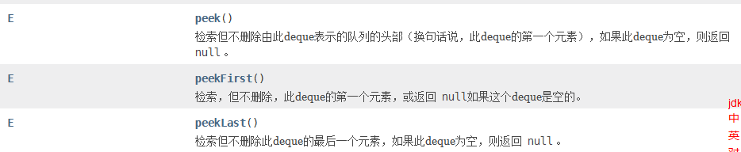

# 算法知识

### (1)动态规划


1、思考状态（重点）

状态的定义，先尝试「题目问什么，就把什么设置为状态」；
然后思考「状态如何转移」，如果「状态转移方程」不容易得到，尝试修改定义，目的依然是为了方便得到「状态转移方程」。
「状态转移方程」是原始问题的不同规模的子问题的联系。即大问题的最优解如何由小问题的最优解得到。

2、思考状态转移方程（核心、难点）

状态转移方程是非常重要的，是动态规划的核心，也是难点；

常见的推导技巧是：分类讨论。即：对状态空间进行分类；

归纳「状态转移方程」是一个很灵活的事情，通常是具体问题具体分析；

除了掌握经典的动态规划问题以外，还需要多做题；

如果是针对面试，请自行把握难度。掌握常见问题的动态规划解法，理解动态规划解决问题，是从一个小规模问题出发，逐步得到大问题的解，并记录中间过程；

「动态规划」方法依然是「空间换时间」思想的体现，常见的解决问题的过程很像在「填表」。

3、思考初始化

初始化是非常重要的，一步错，步步错。初始化状态一定要设置对，才可能得到正确的结果。

角度 1：直接从状态的语义出发；

角度 2：如果状态的语义不好思考，就考虑「状态转移方程」的边界需要什么样初始化的条件；

角度 3：从「状态转移方程」方程的下标看是否需要多设置一行、一列表示「哨兵」（sentinel），这样可以避免一些特殊情况的讨论。

4、思考输出

有些时候是最后一个状态，有些时候可能会综合之前所有计算过的状态。

5、思考优化空间（也可以叫做表格复用）

「优化空间」会使得代码难于理解，且是的「状态」丢失原来的语义，初学的时候可以不一步到位。先把代码写正确是更重要；
「优化空间」在有一种情况下是很有必要的，那就是状态空间非常庞大的时候（处理海量数据），此时空间不够用，就必须「优化空间」；
非常经典的「优化空间」的典型问题是「0-1 背包」问题和「完全背包」问题。

作者：liweiwei1419
链接：https://leetcode-cn.com/problems/longest-palindromic-substring/solution/zhong-xin-kuo-san-dong-tai-gui-hua-by-liweiwei1419/
来源：力扣（LeetCode）
著作权归作者所有。商业转载请联系作者获得授权，非商业转载请注明出处。

**适合使用dp的场景：**

最优子结构
• 如果一个问题的最优解包含其子问题的最优解，我们就称此问题具有最优子结构
• 一个问题具有最优子结构，可能使用动态规划方法，也可能使用贪心方法。所以最优子结构只是一个线索，不是看到有最优子结构就一定是用动态规划求解

重叠子问题
• 子问题空间必须足够“小”，即在不断的递归过程中，是在反复求解大量相同的子问题，而不是每次递归时都产生新的子问题。
• 一般的，不同子问题的总数是输入规模的多项式函数为好
• 如果递归算法反复求解相同的子问题，我们就称最优化问题具有重叠子问题性质

对于前面的分治解法，我们的计算过程分为两个阶段：
1、递归的不断的分解问题，直到问题不可继续分解。
2、当问题不可继续分解，也就是分解到最小子问题后，由最小子问题的解逐步向上回归，逐层求出上层问题的解。

作者：niu-you-rou
链接：https://leetcode-cn.com/problems/burst-balloons/solution/chao-xiang-xi-hui-su-dao-fen-zhi-dao-dp-by-niu-you/
来源：力扣（LeetCode）
著作权归作者所有。商业转载请联系作者获得授权，非商业转载请注明出处。

### (2)stringbuilder

sb是一个stringbuilder对象，它可以追加字符和字符串

sb.append(c)/sb.append(str)

删除某个位置的字符

sb.deleteCharAt(index)

sb.length()：返回当前sb的长度

### (3)HashMap

1.Map的初始化方式（取自17题）

```
        Map<Character, String> phoneMap = new HashMap<Character, String>() {{
            put('2', "abc");
        }};
```

可以在new 一个Map里在里面直接put进去key和val

常用方法：


### (4)回溯

https://leetcode-cn.com/problems/permutations/solution/hui-su-suan-fa-python-dai-ma-java-dai-ma-by-liweiw/

「回溯算法」与「深度优先遍历」都有「不撞南墙不回头」的意思。我个人的理解是：「回溯算法」强调了「深度优先遍历」思想的用途，用一个 不断变化 的变量，在尝试各种可能的过程中，搜索需要的结果。强调了 回退 操作对于搜索的合理性。而「深度优先遍历」强调一种遍历的思想，与之对应的遍历思想是「广度优先遍历」。至于广度优先遍历为什么没有成为强大的搜索算法，我们在题解后面会提。

在「力扣」第 51 题的题解《回溯算法（第 46 题 + 剪枝）》 中，展示了如何使用回溯算法搜索 44 皇后问题的一个解，相信对大家直观地理解「回溯算法」是有帮助。

搜索与遍历
我们每天使用的搜索引擎帮助我们在庞大的互联网上搜索信息。搜索引擎的「搜索」和「回溯搜索」算法里「搜索」的意思是一样的。

搜索问题的解，可以通过 遍历 实现。所以很多教程把「回溯算法」称为爆搜（暴力解法）。因此回溯算法用于 搜索一个问题的所有的解 ，通过深度优先遍历的思想实现。

与动态规划的区别
共同点:
用于求解多阶段决策问题。多阶段决策问题即：

求解一个问题分为很多步骤（阶段）；
每一个步骤（阶段）可以有多种选择。
不同点:
动态规划只需要求我们评估最优解是多少，最优解对应的具体解是什么并不要求。因此很适合应用于评估一个方案的效果；
回溯算法可以搜索得到所有的方案（当然包括最优解），但是本质上它是一种遍历算法，时间复杂度很高。
从全排列问题开始理解回溯算法
我们尝试在纸上写 3个数字、4个数字、5个数字的全排列，相信不难找到这样的方法。以数组 [1, 2, 3] 的全排列为例。

先写以 1 开头的全排列，它们是：[1, 2, 3], [1, 3, 2]，即 1 + [2, 3] 的全排列（注意：递归结构体现在这里）；
再写以 2开头的全排列，它们是：[2, 1, 3], [2, 3, 1]，即 2 + [1, 3] 的全排列；
最后写以 3开头的全排列，它们是：[3, 1, 2], [3, 2, 1]，即 3 + [1, 2] 的全排列。
总结搜索的方法：按顺序枚举每一位可能出现的情况，已经选择的数字在当前要选择的数字中不能出现。按照这种策略搜索就能够做到不重不漏。这样的思路，可以用一个树形结构表示。

看到这里的朋友，建议先尝试自己画出「全排列」问题的树形结构。


说明：

每一个结点表示了求解全排列问题的不同的阶段，这些阶段通过变量的「不同的值」体现，这些变量的不同的值，称之为「状态」；
使用深度优先遍历有「回头」的过程，在「回头」以后， 状态变量需要设置成为和先前一样 ，因此在回到上一层结点的过程中，需要撤销上一次的选择，这个操作称之为「状态重置」；
深度优先遍历，借助系统栈空间，保存所需要的状态变量，在编码中只需要注意遍历到相应的结点的时候，状态变量的值是正确的，具体的做法是：往下走一层的时候，path 变量在尾部追加，而往回走的时候，需要撤销上一次的选择，也是在尾部操作，因此 path 变量是一个栈；
深度优先遍历通过「回溯」操作，实现了全局使用一份状态变量的效果。
使用编程的方法得到全排列，就是在这样的一个树形结构中完成 遍历，从树的根结点到叶子结点形成的路径就是其中一个全排列。

设计状态变量
首先这棵树除了根结点和叶子结点以外，每一个结点做的事情其实是一样的，即：在已经选择了一些数的前提下，在剩下的还没有选择的数中，依次选择一个数，这显然是一个 递归 结构；
递归的终止条件是： 一个排列中的数字已经选够了 ，因此我们需要一个变量来表示当前程序递归到第几层，我们把这个变量叫做 depth，或者命名为 index ，表示当前要确定的是某个全排列中下标为 index 的那个数是多少；
布尔数组 used，初始化的时候都为 false 表示这些数还没有被选择，当我们选定一个数的时候，就将这个数组的相应位置设置为 true ，这样在考虑下一个位置的时候，就能够以 O(1)的时间复杂度判断这个数是否被选择过，这是一种「以空间换时间」的思想。
这些变量称为「状态变量」，它们表示了在求解一个问题的时候所处的阶段。需要根据问题的场景设计合适的状态变量。

错误代码一

```java
import java.util.ArrayList;
import java.util.List;


public class Solution {

    public List<List<Integer>> permute(int[] nums) {
        int len = nums.length;
        // 使用一个动态数组保存所有可能的全排列
        List<List<Integer>> res = new ArrayList<>();
        if (len == 0) {
            return res;
        }

        boolean[] used = new boolean[len];
        List<Integer> path = new ArrayList<>();

        dfs(nums, len, 0, path, used, res);
        return res;
    }

    private void dfs(int[] nums, int len, int depth,
                     List<Integer> path, boolean[] used,
                     List<List<Integer>> res) {
        if (depth == len) {
            res.add(path);
            return;
        }

        // 在非叶子结点处，产生不同的分支，这一操作的语义是：在还未选择的数中依次选择一个元素作为下一个位置的元素，这显然得通过一个循环实现。
        for (int i = 0; i < len; i++) {
            if (!used[i]) {
                path.add(nums[i]);
                used[i] = true;

                dfs(nums, len, depth + 1, path, used, res);
                // 注意：下面这两行代码发生 「回溯」，回溯发生在从 深层结点 回到 浅层结点 的过程，代码在形式上和递归之前是对称的
                used[i] = false;
                path.remove(path.size() - 1);
            }
        }
    }

    public static void main(String[] args) {
        int[] nums = {1, 2, 3};
        Solution solution = new Solution();
        List<List<Integer>> lists = solution.permute(nums);
        System.out.println(lists);
    }
}
```


关于时空复杂度：

先统计非叶子节点个数，第一层N个节点，第二层与它的一层的父节点相比，后面又多了几个节点，一个父节点对应N-1个子节点，所以第二层节点总数是N(N-1)，第二层的父节点对应N-2个第三层的子节点，所以第三层节点N(N-1)(N-2)，最后一层节点总数是N！，整个数节点总数N+N(N-1)+N(N-1)(N-2)+,,,+N!<2N!

每个非叶子节点要遍历N个节点，所以非叶子节点时间复杂度是N!*N

叶子节点总数N!个，每个非叶子节点复制时一共操作N次数组，所以总时间复杂度是N*N!

空间复杂度写的好像有点问题，我觉得递归树深度是N，


回溯有时候会选择一个boolean数组，有时候会选择下一层从一个start开始遍历，两者怎么使用？


### (5)ArrayList

**1.ArrayList的构造方法**

可以传入一个Map所有值的集合，这里map是Map<String, List\<String>>，也就是说map的值和ArrayList的泛型相同

```java
new ArrayList<List<String>>(map.values());
```

可以传入一个ArrayList

```
new ArrayList<>(tmp)
```

**2.Array和List的互相转换**

可以传入一个Map所有值的集合，这里map是Map<String, List\<String>>，也就是说map的值和ArrayList的泛型相同

```java
new ArrayList<List<String>>(map.values());
```

可以传入一个ArrayList

```
new ArrayList<>(tmp)
```

**2.Array和List的互相转换**

```
List 转成 Array

List提供public <T> T[] toArray(T[] a)方法返回一个按照正确的顺序包含此列表中所有元素的数组；返回数组的运行时类型就是指定数组的运行时类型。如果列表能放入指定的数组，则返回放入此列表元素的数组。否则，将根据指定数组的运行时类型和此列表的大小分配一个新的数组。 

String[] array = (String[])list.toArray(new String[size]); 

 

Array 转成 List 

public static <T> List<T> asList(T... a)

例如    List<String> list=Arrays.asList(array);  

这个方法比较坑就是获得的List 不能add和remove 是一个定长的List

Arrays.asList()返回的ArrayList继承自AbstractList，它仅支持那些不会改变数组大小的操作，所以任何对底层数据结构的尺寸进行修改的方法都会出现异常，Arrays.asList()返回固定尺寸的List。

解决方法new 一个新的ArrayList   List<T> list=new ArrayList<T>(Arrays.asList(array));  

```

**3.List的crud**

list.remove(index)移除某个索引的元素

list.add()追加元素。

### (6)PriorityQueue

*PriorityQueue*的`peek()`和`element`操作是常数时间，`add()`, `offer()`, 无参数的`remove()`以及`poll()`方法的时间复杂度都是*log(N)*。

### (7)stack

stack.clear()，清空栈中所有元素

### (8)链表


链表快慢指针求中点（双重判断）

```java
        while (fast != null) {
            slow = slow.next;
            fast = fast.next;
            if (fast != null) {
                fast = fast.next;
            }
        }
```

### (9)集合数组

选自207题，创建一个集合数组写成这样即可。

```
ArrayList<Integer>[] arr = new ArrayList[numCourses];
```

后面不要带尖括号

```java
ArrayList<Integer>[] arr = new ArrayList<>[numCourses];//报错
```

一次性给一个集合数组初始化

```java
List<Integer>[] tree = new List[N+1];
Arrays.setAll(tree, e -> new ArrayList<>());
```

使用Arrays.setAll()

### (10)LinkedList用法总结

常用于实现队列，双端队列


LinkedList继承了多个接口，每个接口提供了不同的方法

**queue的方法**：默认先进先出，所以offer是插到队列尾部，poll/remove是移除队列头部


**deque的方法：**两端都可以插入和移除

插入方法：add与offer（前者出异常，后者不会）


移除方法：poll(deque为Null则返回null)和remove


检索方法：peek和get




### (11)Arrays

arr是一个String类型的数组，Arrays.asList(arr)—>List\<String\>,


sort方法：


### (12)String

根据字符数组创建String对象

```java
String newStr = new String(array, 0, size);
```

array是char[]，创建字符串时可以把指定array的某一部分创建字符串。

 ### (13)背包问题

先循环物品，在循环体积，最后循环决策。

### (14)java生成随机数

```java
//方法1：使用Random（生成0-99的随机数)
Random r = new Random();
r = nextInt(100);

//方法2：(数据类型)(最小值+Math.random()*(最大值-最小值+1))
Math.random();//生成[0,1)的double
```

### (15)输出保留两位小数

```
System.out.print(String.format("%.2f", res));
System.out.printf("%.2d",res);
```

### (16)nextInt()与nextLine()

Scanner会把所有数据扫描到缓冲区，扫描时遇到空格/换行时停止，但是nextInt()扫描时不会把空白符带走，它会留下空白符从下一个位置开始扫描；而nextLine()遇到空白符时会把空白符也带走，所以nextInt()后执行nextLine()，nextLine()此时扫描到的是上一次nextInt()留下的空白符而不是新的数据

**所以，执行nextInt()和nextLine()之间，再执行一次nextLine()**

### (17)Character

```
Character.isDigit(ch);//ch是否是数字
Character.isLetter(ch);//ch是否是字母
```

### (19)手写LFU

1. 需要`freq`到`key`的映射，用来找到最小`freq`对应的`key`
2. 如果要满足上一条，快速找到最小`freq`是多少，可以通过一个变量`minFreq`来记录当前最小`freq`，避免遍历
3. 可能会有多个`key`拥有相同的`freq`，所以`freq`和`key`是一对多的关系，那么就需要维护一个`freq`到key对应的映射关系
4. 为了保证快速查找并删除最旧的`key`，就需要保证`freq`对应的`key`的映射列表应该是有**顺序**的
5. 需要能够**快速删除`key`列表中的任何一个key**。如果频次为`freq`的`key`被访问了，它的频次应该变成`freq+1`，此时应该从freq对应的`key`列表中删除，并把`key`加入到`freq+1`对应的key列表中 => 就是需要提高它的频次

```java
class LFUCache {
    // key 到 val 的映射，我们后文称为 KV 表
    HashMap<Integer, Integer> keyToVal;
    // key 到 freq 的映射，我们后文称为 KF 表
    HashMap<Integer, Integer> keyToFreq;
    // freq 到 key 列表的映射，我们后文称为 FK 表
    HashMap<Integer, LinkedHashSet<Integer>> freqToKeys;
    // 记录最小的频次
    int minFreq;
    // 记录 LFU 缓存的最大容量
    int cap;

    public LFUCache(int capacity) {
        keyToVal = new HashMap<>();
        keyToFreq = new HashMap<>();
        freqToKeys = new HashMap<>();
        this.cap = capacity;
        this.minFreq = 0;
    }

    public int get(int key) {
        if (!keyToVal.containsKey(key))
            return -1;
				// 增加key对应的频次
        increaseFreq(key); 
        return keyToVal.get(key);
    }

    public void put(int key, int val) {
        // 避免初始化的时候capacity参数异常
        if (this.cap <= 0)
            return;

        // 如果 KV 表已经存在这个key
        // 修改对应的val，频次+1
        if (keyToVal.containsKey(key)) {
            keyToVal.put(key, val);
            increaseFreq(key);
            return;
        }

        // 如果 KV 表不存在这个key
        // 并且当前容量已满，就需要删除最小频次的key
        if (keyToVal.size() >= this.cap) {
            removeMinFreqKey();
        }

        // 当前容量未满，插入key和val，并且key对应的freq置为1
        keyToVal.put(key, val);
        keyToFreq.put(key, 1);
        // putIfAbsent 如果有这个key的话就不进行任何操作，此处相当于对1这个key进行初始化
        freqToKeys.putIfAbsent(1, new LinkedHashSet<>());
        freqToKeys.get(1).add(key);
        // 插入最新的key之后，最小的freq肯定是1
        this.minFreq = 1;
    }
  
  	private void increaseFreq(int key) {
        // 首先，能进入到这个函数的时候，keyToFreq 和 freqToKeys 一定保存过这个key了

        // 更新 KF 表中key对应的频次+1
        int freq = keyToFreq.get(key);
        keyToFreq.put(key, freq + 1);

        // Fk 表中删除freq对应的列表中的key
        freqToKeys.get(freq).remove(key);
        freqToKeys.putIfAbsent(freq + 1, new LinkedHashSet<>());
        freqToKeys.get(freq + 1).add(key);

        // 如果 freq 对应的列表空了，就移除这个freq
        if (freqToKeys.get(freq).size() == 0) {
            freqToKeys.remove(freq);
            // 如果这个 freq 又恰好是 minFreq，更新 minFreq
          	// 这个地方容易忘记更新
            if (freq == this.minFreq) {
                this.minFreq++;
            }
        }
    }

    private void removeMinFreqKey() {
        // FK 表中最小freq对应的列表中 最先被插入的那个 key 就是该被淘汰的 key
        LinkedHashSet<Integer> keyList = freqToKeys.get(this.minFreq);
        int deleteKey = keyList.iterator().next();
        keyList.remove(deleteKey);

        // 如果 freq 对应的列表空了，就移除这个freq
        if(keyList.size() == 0){
            freqToKeys.remove(this.minFreq);
            // 这里不需要更新 minFreq，因为后面会紧跟一个put操作，minFreq 会被置为1
        }

        // 更新 KV 表
        keyToVal.remove(deleteKey);
        // 更新 KF 表
        keyToFreq.remove(deleteKey);
    }
}
```

### (20)手写优先队列


```java
/**
 * 最大优先队列数组实现
 *
 * @author 毛毛
 */
public class MaxPriorityQueue<T extends Comparable<T>> {
    //用来存储元素的数组
    private T[] items;
    //记录元素个数
    private int N;

    //创建容量为capacity的MaxPriorityQueue对象
    public MaxPriorityQueue(int capacity) {
        this.N = 0;
        this.items = (T[]) new Comparable[capacity + 1];
    }

    //判断堆中索引i处的元素是否小于索引j处的元素
    private boolean less(int i, int j) {
        return items[i].compareTo(items[j]) < 0;
    }

    //交换堆中i索引和j索引处的值
    private void exchange(int i, int j) {
        T temp = items[i];
        items[i] = items[j];
        items[j] = temp;
    }

    //获取队列中元素的个数
    public int size() {
        return N;
    }

    //判断队列是否为空
    public boolean isEmpty() {
        return N == 0;
    }

    //：往队列中插入一个元素
    public void insert(T t) {
        items[++N] = t;
        swim(N);
    }

    //使用上浮算法，使索引k处的元素能在堆中处于一个正确的位置
    private void swim(int k) {
        //如果已经到了根结点，就不需要循环
        while (k > 1) {
            if (less(k / 2, k)) {
                exchange(k / 2, k);
            }
            k = k / 2;
        }
    }

    //删除堆中最大的元素,并返回这个最大元素
    public T delMax() {
        T max = items[1];
        //交换索引1处和索引N处的值
        exchange(1, N);
        items[N] = null;
        N--;
        sink(1);
        return max;
    }

    //使用下沉算法，使索引k处的元素能在堆中处于一个正确的位置
    private void sink(int k) {
        //如果当前已经是最底层了，就不需要循环了
        while (2 * k <= N) {
            int max = 2 * k;
            if (max + 1 <= N) {//表示有右子节点
                if (less(max, max + 1)) {
                    max = max + 1;
                }
            }
            //比较当前结点和子结点中的较大者，如果当前结点不小，则结束循环
            if (!less(k,max)){
                break;
            }
            //当前结点小，则交换，
            exchange(k,max);
            k = max;
        }
    }
}

```

这就是大根堆