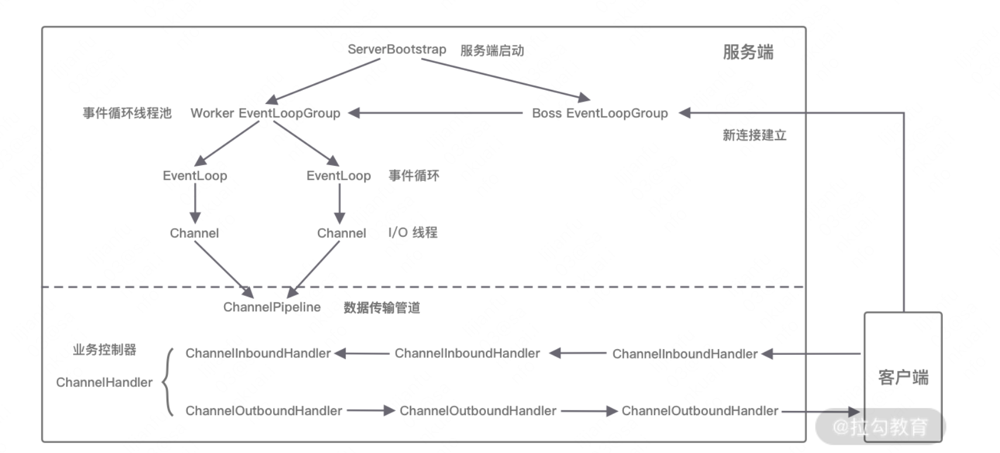
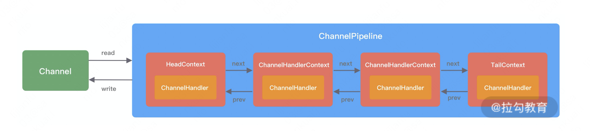
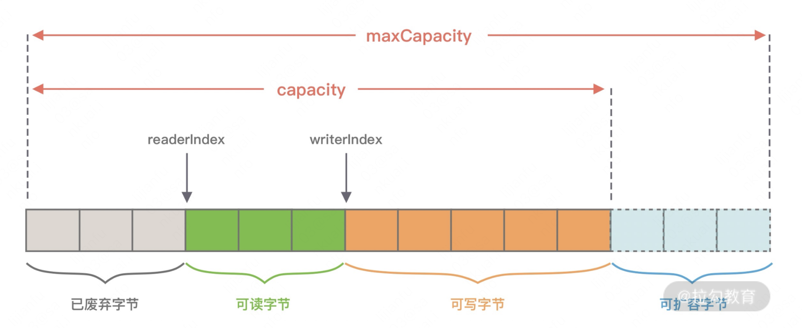
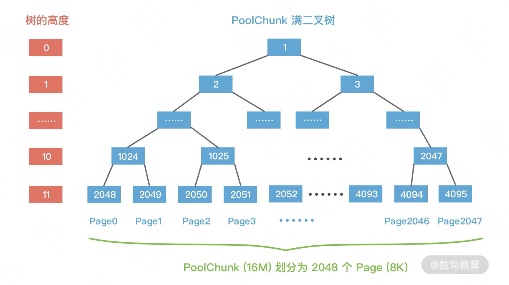

# 网络编程

## 1 io模型

https://segmentfault.com/a/1190000003063859

https://developer.51cto.com/article/702199.html

https://www.zhihu.com/question/59975081 【推荐】

缓存 I/O 又被称作标准 I/O，大多数文件系统的默认 I/O 操作都是缓存 I/O。在 Linux 的缓存 I/O 机制中，操作系统会将 I/O 的数据缓存在文件系统的页缓存（ page cache ）中，也就是说，数据会先被拷贝到操作系统内核的缓冲区中，然后才会从操作系统内核的缓冲区拷贝到应用程序的地址空间。

两步：数据——》内核空间——〉用户空间

数据在传输过程中需要在应用程序地址空间和内核进行多次数据拷贝操作，这些数据拷贝操作所带来的 CPU 以及内存开销是非常大的。

**linux5种io模型：**

* 同步阻塞io：进程执行io相关的系统调用比如read，然后阻塞到数据从内核拷贝到应用程序
* 同步非阻塞io：进程执行io相关的系统调用比如read，发现数据没到内核后立刻返回，然后定期执行read询问内核数据准备好了没有
* IO multiplexing：包括select、poll、epoll，也叫事件驱动io，它的优势**是一个进程可以处理多个文件描述符**，select\epoll这些操作会阻塞用户进程，遍历用户放到内核的文件描述符列表，返回就绪【数据到达内核】的文件符个数；用户自己再次遍历文件描述符集合，对就绪的文件描述符执行io操作
* 信号驱动io：半异步的 I/O 模型。在使用信号驱动 I/O 时，当数据准备就绪后，**内核**通过发送一个 SIGIO 信号通知应用进程，应用进程就可以**开始**读取数据了，此时数据刚到内核空间还没到用户空间，用户还要再执行一次系统调用去把数据读到用户空间。
* 异步io：进程执行系统调用后不阻塞，当**内核**把数据读取到用户空间**完毕**之后，会发信号通知用户。

分类：

* 同步io：同步阻塞io、同步非阻塞、IO multiplexing

* 半异步io：信号驱动io【应该也算同步io】
* 异步io【进程什么也不用干，只需等着收数据就行】

同步or异步：同步的定义 A synchronous I/O operation causes the requesting process to be blocked until that I/O operation completes;。对于同步io，进程将数据从内核复制到用户空间时被阻塞。而异步io不会被读取数据的io操作阻塞，数据直接到达用户空间后内核会发信号通知进程，此时进程直接引用数据就行拉。

Blocking &nonblocking：这个和同步异步的关系是什么？non-blocking的关注点在**read时发现数据还没到内核时的处理方式：**调用blocking IO的read操作会一直block住对应的进程直到操作完成，而non-blocking IO的read操作在数据没到内核的情况下会立刻返回。

整体来说：同步关注的是发生调用行为时是否要等到结果后再返回（是：同步、否：异步）阻塞关注的是等待结果时调用者的状态（挂起到结果出来：阻塞、不挂起而是可以做别的事：非阻塞）

同步异步&阻塞非阻塞的区别：https://www.zhihu.com/question/19732473/answer/117012135

io多路复用与非阻塞：select是用户的一个系统调用，它会阻塞用户进程，然而

* 用户是被select阻塞的却不是被io操作阻塞的
* io也不会阻塞select操作，select遍历描述符的时后不会执行io操作，一旦某个描述符没就绪它会直接遍历下一个

当select返回的时候【不考虑timeout返回的情况】，此时已经有一些描述符就绪了，对这些描述符将数据从内核拷贝到用户空间本身也不会阻塞进程本身。

**select&&poll&&epoll**

```c
int select (int n, fd_set *readfds, fd_set *writefds, fd_set *exceptfds, struct timeval *timeout);
```

使用案例：假设一个进程要从fd1~fd10读取数据，那就把它们放到readfds中，然后执行select。

readfds会被放入内核空间，select会遍历这些描述符，直到有描述符就绪后select会返回，如果没有描述符准备好，select会阻塞【死等或只等timeout】。

**什么是就绪：在读操作中，数据从网卡到达内核后，对应文件描述符被设置为就绪状态**

此时一旦有一个被监控的socket来数据了，会唤醒select【唤醒机制是,每个socket对象都有一个睡眠队列，里面装的是等他来数据而阻塞的一些应用。当一个socket进数据的时候，会遍历执行这些entry的callback方法，可以让这些因为它没来数据而被阻塞的应用执行一些操作。而select会插入一个entry，等到来数据后会唤醒select方法】。

但是select不知道是哪个socket唤醒它的。

最后select返回，用户自己遍历这些描述符。

select有所能监控的最大文件数限制，为1024，尽管可以修改这个限制但是太大的话性能会下降。

```c
int poll (struct pollfd *fds, unsigned int nfds, int timeout);
```

使用案例：poll和select的区别在于：改变了保存文件描述符的数据结构，pollfd结构和select中的fd_set不一致，fds是一个指向pollfd数组的指针，把要监听的文件描述符写入到fds中。改了fds结构后就没有最大文件数的限制了。

select和poll的缺点：

* 每次调用时都要把所监听的socket复制到内核空间
* 不知到哪个socket来数据了

```c
int epoll_create(int size)；//创建一个epoll的句柄，size用来告诉内核这个监听的数目一共有多大
int epoll_ctl(int epfd, int op, int fd, struct epoll_event *event)；
int epoll_wait(int epfd, struct epoll_event * events, int maxevents, int timeout);
```

epoll_ctl：对epoll_create返回的句柄epfd管理的fd执行op[添加、删除和修改对fd的监听事件]，epoll_event表示要监听什么事。这样在内核里面就维护了此 epoll 管理的 socket 集合，这样就不用像select一样，每次调用的时候都得把所有管理的 fds 拷贝到内核了。

epoll_wait：等待epfd上的io事件，最多返回maxevents个事件，接下来就是遍历这些事件做对应的io操作，一般流程为：

```c
    for( ; ; )
    {
        nfds = epoll_wait(epfd,events,20,500);
        for(i=0;i<nfds;++i)
        {
            if(events[i].data.fd==listenfd) //有新的连接
            {
                connfd = accept(listenfd,(sockaddr *)&clientaddr, &clilen); //accept这个连接
                ev.data.fd=connfd;
                ev.events=EPOLLIN|EPOLLET;
                epoll_ctl(epfd,EPOLL_CTL_ADD,connfd,&ev); //将新的fd添加到epoll的监听队列中
            }
            else if( events[i].events&EPOLLIN ) //接收到数据，读socket
            {
                n = read(sockfd, line, MAXLINE)) < 0    //读
                ev.data.ptr = md;     //md为自定义类型，添加数据
                ev.events=EPOLLOUT|EPOLLET;
                epoll_ctl(epfd,EPOLL_CTL_MOD,sockfd,&ev);//修改标识符，等待下一个循环时发送数据，异步处理的精髓
            }
            else if(events[i].events&EPOLLOUT) //有数据待发送，写socket
            {
                struct myepoll_data* md = (myepoll_data*)events[i].data.ptr;    //取数据
                sockfd = md->fd;
                send( sockfd, md->ptr, strlen((char*)md->ptr), 0 );        //发送数据
                ev.data.fd=sockfd;
                ev.events=EPOLLIN|EPOLLET;
                epoll_ctl(epfd,EPOLL_CTL_MOD,sockfd,&ev); //修改标识符，等待下一个循环时接收数据
            }
            else
            {
                //其他的处理
            }
        }
    }
```

epoll会对返回的事件集合设置一个描述符，比如EPOLLIN表示描述符可读，EPOLLOUT表示文件描述符可写。

epoll_wait一般循环调用，返回准备好的事件

第二点优化：epoll新加一个ready_list机制，即来数据的socket调用epoll插入的callback时，会把这个socket插入到ready_list中，被唤醒的 epoll 只需要遍历 ready_list 即可，同时收集到的可读的 fd 按理是要拷贝到用户空间的，这里又做了个优化，利用了 mmp，让用户空间和内核空间映射到同一块内存中，这样就避免了拷贝。

epoll对文件描述符的操作有两种模式：

* 边沿触发et，文件描述符已经就绪，并且不会再为那个文件描述符发送更多的就绪通知，直到你做了某些操作导致那个文件描述符不再为就绪状态了(比如，你在发送，接收或者接收请求，或者发送接收的数据少于一定量时导致了一个EWOULDBLOCK 错误）
* 水平触发lt，内核告诉你一个文件描述符是否就绪了，然后你可以对这个就绪的fd进行IO操作。如果你不作任何操作，内核还是会继续通知你的。

## 2 netty

https://learn.lianglianglee.com/%E4%B8%93%E6%A0%8F/Netty%20%E6%A0%B8%E5%BF%83%E5%8E%9F%E7%90%86%E5%89%96%E6%9E%90%E4%B8%8E%20RPC%20%E5%AE%9E%E8%B7%B5-%E5%AE%8C/01%20%20%E5%88%9D%E8%AF%86%20Netty%EF%BC%9A%E4%B8%BA%E4%BB%80%E4%B9%88%20Netty%20%E8%BF%99%E4%B9%88%E6%B5%81%E8%A1%8C%EF%BC%9F.md

### 2.1 总述

Netty 是一款用于高效开发网络应用的 NIO 网络框架，它大大简化了网络应用的开发过程。

netty使用的io模型为io多路复用，基于非阻塞 I/O 实现的，底层依赖的是 JDK NIO 框架的多路复用器 Selector。一个多路复用器 Selector 可以同时轮询多个 Channel，采用 epoll 模式后，只需要一个线程负责 Selector 的轮询，就可以接入成千上万的客户端。

========================================================================

注1:Java nio链接：https://jenkov.com/tutorials/java-nio/index.html

注2:reactor模型即 I/O多路复用统一监听事件，收到事件后再分发(Dispatch)给相应的处理线程。reactor使用select方法监听事件，对于连接事件发给acceptor处理，对于请求交给handler处理。这里可以选择将reactor的监听和handler的处理使用一个线程执行【单线程模型】，也可以选择单独给reactor单独设置一个线程，其他handler使用一个工作线程池的线程来护理逻辑【多线程模型】https://juejin.cn/post/6844903682509635598

netty架构：




1. 引导器启动服务；

2. eventloopgroup是一个线程池，主要负责接收 I/O 请求，并分配线程执行处理请求，分为boss和worker

3. channel封装socket，会和一个eventloop绑定，两者是多对一的

4.  ChannelPipeline:处理数据逻辑链

5. ChannelHandler、ChannelHandlerContext:一个ChannelHandler封装具体的处理逻辑，ChannelHandlerContext保存它的上下文信息，两者一对一；ChannelPipeline里有多个ChannelHandler

    

### 2.2 eventloop

eventloop是Netty Reactor 线程模型的核心处理引擎。Reactor 模式是io多路复用模型的一种模式，分为单线程、多线程和多reactor多线程模型【MainReactor 仅负责处理客户端连接的 Accept 事件，连接建立成功后将新创建的连接对象注册至 SubReactor。再由 SubReactor 分配线程池中的 I/O 线程与其连接绑定，它将负责连接生命周期内所有的 I/O 事件。】三种，netty实现了这三种线程模型，并且推荐第三种。

EventLoop 的运行模式：每当事件发生时，应用程序都会将产生的事件放入事件队列当中，然后 EventLoop 会轮询从队列中取出事件执行或者将事件分发给相应的事件监听者执行。事件执行的方式通常分为**立即执行、延后执行、定期执行**几种。

NioEventLoop是netty中EventLoop得实现类之一，它的事件处理机制采用的是**无锁串行化的设计思路**。

- **BossEventLoopGroup** 和 **WorkerEventLoopGroup** 包含一个或者多个 NioEventLoop。BossEventLoopGroup 负责监听客户端的 Accept 事件，当事件触发时，将事件注册至 WorkerEventLoopGroup 中的一个 NioEventLoop 上。每新建一个 Channel， 只选择一个 NioEventLoop 与其绑定。所以说 Channel 生命周期的所有事件处理都是**线程独立**的，不同的 NioEventLoop 线程之间不会发生任何交集。
- NioEventLoop 完成数据读取后，会调用绑定的 ChannelPipeline 进行事件传播，ChannelPipeline 也是**线程安全**的，数据会被传递到 ChannelPipeline 的第一个 ChannelHandler 中。数据处理完成后，将加工完成的数据再传递给下一个 ChannelHandler，整个过程是**串行化**执行，不会发生线程上下文切换的问题。

netty的线程模型规避了空轮旬问题：

问题：

https://blog.csdn.net/qq_40741855/article/details/115869721

https://cloud.tencent.com/developer/article/1543810

简单来说，这个bug来自java的nio实现，我们一般基于nio写服务器代码的逻辑是：

```java
Selector selector = Selector.open();
while(true) {
  int keys = selector.select();
  Set<SelectKeys> keys = selector.selectKeys();//拿到返回的事件集合
  Iterator<SelectKeys> it = keys.iterator();
  while(it.hasnext()){
    //遍历key返回数据
  }
}
```

正常情况下select应该阻塞到有事件发生再返回，而nio的实现有个bug，就是当事件集合发生变化时就返回。比如epoll对于突然中断连接的socket，会对返回的eventSet事件集合置为EPOLLHUP或者EPOLLERR，**eventSet事件集合发生了变化**，这就导致Selector会被唤醒，返回的keys=0.由于不会进入到下面的事件处理逻辑，它就会不断执行while(true)最终打满cpu。

netty的解决方法：

```java
private void select(boolean oldWakenUp) throws IOException {
    Selector selector = this.selector;
    try {
        // selectCnt记录轮询次数, 空轮询次数超过SELECTOR_AUTO_REBUILD_THRESHOLD(默认512)之后，
        // 则重建selector
        int selectCnt = 0;
        // 记录当前事件
        long currentTimeNanos = System.nanoTime();
        // selectDeadLineNanos = 当前时间 + 距离最早的定时任务开始执行的时间
        // 计算出select操作必须在哪个时间点之前被wakeUp （不然一直被阻塞的话，定时任务就没发被执行）
        long selectDeadLineNanos = currentTimeNanos + delayNanos(currentTimeNanos);

        long normalizedDeadlineNanos = selectDeadLineNanos - initialNanoTime();
        if (nextWakeupTime != normalizedDeadlineNanos) {
            nextWakeupTime = normalizedDeadlineNanos;
        }

        for (;;) {
            // 计算出当前select操作能阻塞的最久时间
            long timeoutMillis = (selectDeadLineNanos - currentTimeNanos + 500000L) / 1000000L;
            // 超过最长等待时间：有定时task需要执行
            if (timeoutMillis <= 0) {
                if (selectCnt == 0) {
                    //非阻塞，没有数据返回0
                    selector.selectNow();
                    selectCnt = 1;
                }
                break;
            }

            // 进行select操作, 下面select阻塞中，别人唤醒也可以可以的
            int selectedKeys = selector.select(timeoutMillis);
            selectCnt ++;

            if (selectedKeys != 0 || oldWakenUp || wakenUp.get() || hasTasks() || hasScheduledTasks()) {
                // - Selected something,
                // - waken up by user, or
                // - the task queue has a pending task.
                // - a scheduled task is ready for processing
                break;
            }

            // 如果select没有触发超时返回，并且确实是监听到了新事件而不是空轮询，那么就一定会在上面的if中返回了
            // 所以往下走的话，有2个情况:
            //      1. select超时
            //      2. 发生了空轮询

            if (Thread.interrupted()) {
                // Thread was interrupted so reset selected keys and break so we not run into a busy loop.
                // As this is most likely a bug in the handler of the user or it's client library we will
                // also log it.
                //
                // See https://github.com/netty/netty/issues/2426
                if (logger.isDebugEnabled()) {
                    logger.debug("Selector.select() returned prematurely because " +
                            "Thread.currentThread().interrupt() was called. Use " +
                            "NioEventLoop.shutdownGracefully() to shutdown the NioEventLoop.");
                }
                selectCnt = 1;
                break;
            }


            long time = System.nanoTime();
            // select超时的情况（因为实际经过的时间确实是 >= 应该最大阻塞时间 ）
            if (time - TimeUnit.MILLISECONDS.toNanos(timeoutMillis) >= currentTimeNanos) {
                // timeoutMillis elapsed without anything selected.
                selectCnt = 1;
            } else if (SELECTOR_AUTO_REBUILD_THRESHOLD > 0 &&
                    selectCnt >= SELECTOR_AUTO_REBUILD_THRESHOLD) {
                // 空轮询次数超过了 SELECTOR_AUTO_REBUILD_THRESHOLD（默认512）
                // The code exists in an extra method to ensure the method is not too big to inline as this
                // branch is not very likely to get hit very frequently.

                // 重建selector
                selector = selectRebuildSelector(selectCnt);
                selectCnt = 1;
                break;
            }

            currentTimeNanos = time;
        }
    } catch (CancelledKeyException e) {
        if (logger.isDebugEnabled()) {
            logger.debug(CancelledKeyException.class.getSimpleName() + " raised by a Selector {} - JDK bug?",
                    selector, e);
        }
       }
}
```

* 记录每次select的时间，如果时间短的话表明有可能出现空沦陷（很快就执行完了有可能根本就没在遍历事件）
* 维护一个selectCnt，每次执行完select操作都会自增，但是在正常情况下会重置为1（比如超时情况）；但是如果不是超时且达到512（SELECTOR_AUTO_REBUILD_THRESHOLD）的时候，表明已经执行了512次没有正常break且没有超时的select，那么此时就是空轮询了，重新建一个selector。

NioEventLoop的任务调度机制：遵循 FIFO 规则，可以保证任务执行的公平性。把普通任务放到普通任务队列taskQueue【 多生产者单消费者MpscChunkedArrayQueue】，定时任务放到定时任务队列 scheduledTaskQueue 【 PriorityQueue】，从queeu上拉取任务执行。

注1:*Scalable I/O in Java* 一文中阐述了服务端开发中 I/O 模型的演进过程

### 2.3 事件编排

下图写的较为明确，问题在于ChannelHandlerContext有什么用？

ChannelHandlerContext 用于保存 ChannelHandler 上下文；ChannelHandlerContext 则包含了 ChannelHandler 生命周期的所有事件，如 connect、bind、read、flush、write、close 等。可以试想一下，如果没有 ChannelHandlerContext 的这层封装，那么我们在做 ChannelHandler 之间传递的时候，前置后置的通用逻辑就要在每个 ChannelHandler 里都实现一份。这样虽然能解决问题，但是代码结构的耦合，会非常不优雅。



根据网络数据的流向，ChannelPipeline 分为入站 ChannelInboundHandler 和出站 ChannelOutboundHandler 两种处理器。在客户端与服务端通信的过程中，数据从客户端发向服务端的过程叫出站，反之称为入站。

ChannelPipeline 双向链表的构造，ChannelPipeline 的双向链表分别维护了 HeadContext 和 TailContext 的头尾节点。我们自定义的 ChannelHandler 会插入到 Head 和 Tail 之间；

HeadContext 既是 Inbound 处理器，也是 Outbound 处理器。网络数据写入操作的入口就是由 HeadContext 节点完成的，作为 Pipeline 的头结点负责读取数据并开始传递 InBound 事件，当数据处理完成后，数据会反方向经过 Outbound 处理器，最终传递到 HeadContext，所以 HeadContext 又是处理 Outbound 事件的最后一站。

TailContext 只实现了 ChannelInboundHandler 接口。它会在 ChannelInboundHandler 调用链路的最后一步执行，主要用于终止 Inbound 事件传播。

ChannelPipeline 事件传播的实现采用了经典的责任链模式，调用链路环环相扣。

### 2.4 编解码

拆包：受MTU、MSS限制，当一个网络包过大时需要拆分为若干数据包发送

粘包：为减轻小网络包对网络的压力，nagle算法把多个数据存入缓冲区后一起发送。

拆包粘包的核心问题：如何定义包的边界？

是解决拆包/粘包的唯一方法：**定义应用层的通信协议**。

* 使用特定分隔符（避免和消息体撞车）
* 消息头中存放消息的总长度，例如使用 4 字节的 int 值记录消息的长度，消息体实际的二进制的字节数据。


### 2.5 内存管理

heap vs offheap：

1. 堆内内存由 JVM GC 自动回收内存，降低了 Java 用户的使用心智，但是 GC 是需要时间开销成本的，堆外内存由于不受 JVM 管理，所以在一定程度上可以降低 GC 对应用运行时带来的影响。
2. 堆外内存需要手动释放，这一点跟 C/C++ 很像，稍有不慎就会造成应用程序内存泄漏，当出现内存泄漏问题时排查起来会相对困难。
3. 当进行网络 I/O 操作、文件读写时，堆内内存都需要转换为堆外内存，然后再与底层设备进行交互，这一点在介绍 writeAndFlush 的工作原理中也有提到，所以直接使用堆外内存可以减少一次内存拷贝。
4. 堆外内存可以实现进程之间、JVM 多实例之间的数据共享。

Java 中堆外内存的分配方式有两种：

* DirectByteBuffer#allocateDirect
* Unsafe#allocateMemory

allocateDirect底层调用Unsafe#allocateMemory，但是使用ByteBuffer分配的堆外内存是可以被回收的，直接调用Unsafe分配的内存就得手动释放。

DirectByteBuffer回收堆外内存原理：

DirectByteBuffer引用一个虚引用类型的对象cleaner，当DirectByteBuffer被回收的时候，cleaner没有强引用了，在下一次gc时就会被回收，而cleaner在被回收时会执行clean() 方法调用Unsafe#freeMemory释放这个DirectByteBuffer的堆内存。

netty自己实现了bytebuf：



与nio提供的bytebuffer比，性能上有了优化：

* 独立的读指针和写指针（bytebuffer就一个指针）
* 可以自动扩容（ByteBuffer 分配的长度是固定的，无法动态扩缩容）

Jemalloc：是一种内存分配器，目标旨在1.高效的内存分配和回收，提升单线程或者多线程场景下的性能。2.减少内存碎片，包括内部碎片和外部碎片，提高内存的有效利用率。

内存分配算法：

* 首次适应
* 伙伴算法（按照2的幂划分内存块）
* Slab（对小内存的场景专门做了优化，采用了内存池的方案，不会对内存块进行合并，解决内部碎片问题。它把一块内存划分为slab，每个slab包括若干连续的page，一个slab可以保存多个对象。释放一个对象的内存时，slab算法不会真正释放对象而是缓存对象，下次再为对象分配内存时可以直接从缓存中取出）

slab算法看的不是很明白，后面再补吧

jemalloc架构：https://learn.lianglianglee.com/%E4%B8%93%E6%A0%8F/Netty%20%E6%A0%B8%E5%BF%83%E5%8E%9F%E7%90%86%E5%89%96%E6%9E%90%E4%B8%8E%20RPC%20%E5%AE%9E%E8%B7%B5-%E5%AE%8C/12%20%20%E4%BB%96%E5%B1%B1%E4%B9%8B%E7%9F%B3%EF%BC%9A%E9%AB%98%E6%80%A7%E8%83%BD%E5%86%85%E5%AD%98%E5%88%86%E9%85%8D%E5%99%A8%20jemalloc%20%E5%9F%BA%E6%9C%AC%E5%8E%9F%E7%90%86.md

对**Samll**、**Large** 和 **Huge** 三种场景做出不同的分配和释放逻辑：

对与small和large，优先分配在线程缓存里，分配不下再分配内存里；

对应huge，使用mmap和munmap作为申请和释放内存的逻辑。

netty的内存借鉴了jemalloc：

内存规格：Tiny 代表 0 ~ 512B 之间的内存块，Samll 代表 512B ~ 8K 之间的内存块，Normal 代表 8K ~ 16M 的内存块，Huge 代表大于 16M 的内存块。对应不同的内存块，分配单位不同。

使用内存池（java版的jemalloc）


PoolArena:一个用户线程申请内存会被分配到不同的Arena上，而且这个线程始终和Arena绑定，这样做是为了减少资源竞争，一个PoolArena可以处理多个线程分配内存的请求。

PoolArena 的数据结构包含两个 PoolSubpage 数组和六个 PoolChunkList，两个 PoolSubpage 数组分别存放 Tiny 和 Small 类型的内存块，六个 PoolChunkList 分别存储不同利用率的 Chunk，q000表示利用率在1%到50%的chunk，q025表示内存使用率为 25% ~ 75% 的 Chunk。构成一个双向循环链表。一旦Chunk利用了发生变化就会移动到对应list，不同的LISt利用率有交集就是避免频繁移动。

PoolChunk：真正存储数据的地方，默认大小为 16M。使用满二叉树组织它所管理得page(PoolSubpage)默认8k，共2048个，二叉树一共11层。一个chunk可以换分为不同大小的PoolSubpage， PoolSubpage 数组一个元素保存的是一个 PoolSubpage链表头节点。



PoolThreadCache & MemoryRegionCache：当内存释放时，与 jemalloc 一样，Netty 并没有将缓存归还给 PoolChunk，而是使用 PoolThreadCache 缓存起来，当下次有同样规格的内存分配时，直接从 PoolThreadCache 取出使用即可。MemoryRegionCache 是PoolThreadCache的成员实际就是一个队列，当内存释放时，将内存块加入队列当中，下次再分配同样规格的内存时，直接从队列中取出空闲的内存块。不同的MemoryRegionCache对应不同规格的内存，比如一个对应32b,一个对应1k。

**内存分配策略**：

https://learn.lianglianglee.com/%E4%B8%93%E6%A0%8F/Netty%20%E6%A0%B8%E5%BF%83%E5%8E%9F%E7%90%86%E5%89%96%E6%9E%90%E4%B8%8E%20RPC%20%E5%AE%9E%E8%B7%B5-%E5%AE%8C/14%20%20%E4%B8%BE%E4%B8%80%E5%8F%8D%E4%B8%89%EF%BC%9ANetty%20%E9%AB%98%E6%80%A7%E8%83%BD%E5%86%85%E5%AD%98%E7%AE%A1%E7%90%86%E8%AE%BE%E8%AE%A1%EF%BC%88%E4%B8%8B%EF%BC%89.md

PoolArena 中管理的内存单位为 PoolChunk，每个 PoolChunk 会被划分为 2048 个 8K 的 Page。在申请的内存大于 8K 时，PoolChunk 会以 Page 为单位进行内存分配。当申请的内存大小小于 8K 时，会由 PoolSubpage 管理更小粒度的内存分配。

PoolArena 分配的内存被释放后，不会立即会还给 PoolChunk，而且会缓存在本地私有缓存 PoolThreadCache 中，在下一次进行内存分配时，会优先从 PoolThreadCache 中查找匹配的内存块。

由此可见，Netty 中不同的内存规格采用的分配策略是不同的，我们主要分为以下三个场景逐一进行分析。

- 分配内存大于 8K 时，PoolChunk 中采用的 Page 级别的内存分配策略。
- 分配内存小于 8K 时，由 PoolSubpage 负责管理的内存分配策略。
- 分配内存小于 8K 时，为了提高内存分配效率，由 PoolThreadCache 本地线程缓存提供的内存分配。

分配一个16k大小的内存，那么到chunk第10层找到一个空闲的二叉树节点，把它的2个叶子节点分配出去；分配一个32k大小的内存，那么到chunk第9层找到一个空闲的二叉树节点，把它的4个叶子节点分配出去

分配20B大小内存：

1. 因为 20B 小于 512B，属于 Tiny 场景，按照内存规格的分类 20B 需要向上取整到 32B。
2. 根据内存规格的大小找到 PoolArena 中 tinySubpagePools 数组对应的头结点，32B 对应的 tinySubpagePools[1]。
3. 在满二叉树中寻找可用的节点用于内存分配，因为我们分配的内存小于 8K，所以直接从二叉树的最底层开始查找。假如 2049 节点是可用的，那么返回的 id = 2049。
4. 找到可用节点后，因为 pageIdx 是从叶子节点 2048 开始记录索引，而 subpageIdx 需要从 0 开始的，所以需要将 pageIdx 转化为 subpageIdx，例如 2048 对应的 subpageIdx = 0，2049 对应的 subpageIdx = 1，以此类推。
5. 如果 PoolChunk 中 subpages 数组的 subpageIdx 下标对应的 PoolSubpage 不存在，那么将创建一个新的 PoolSubpage，并将 PoolSubpage 切分为相同大小的子内存块，示例对应的子内存块大小为 32B，最后将新创建的 PoolSubpage 节点与 tinySubpagePools[1] 对应的 head 节点连接成双向链表。
6. 最后 PoolSubpage 执行内存分配并返回内存地址。

在分配 Tiny、Small 和 Normal 类型的内存时，都会尝试先从 PoolThreadCache 中进行分配，如果 PoolThreadCache 分配失败，才会走 PoolArena 的分配流程。

**内存回收策略**：

* 每执行8192次allocate操作，检查PoolThreadCache 的每个 MemoryRegionCache距离上一次内存整理已经发生了多少次 allocate 调用，当调用次数小于一个阈值 时，表示 MemoryRegionCache 中缓存的内存块并不常用，从队列中取出内存块依次释放。
* PoolThreadCache 重载了 finalize() 方法，在销毁前执行缓存回收的逻辑，回收这个线程所分配的内存。
