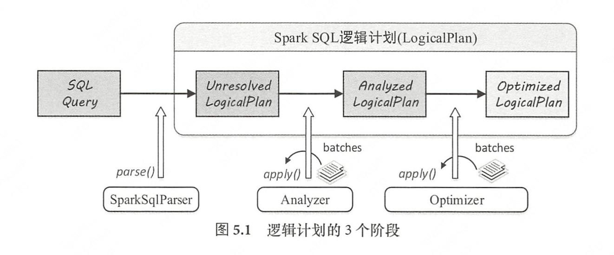

# Spark sql

## 基础语法

https://www.gairuo.com/p/spark-sql-tutorial

https://spark.apache.org/docs/latest/sql-ref.html

### 1 ansi

spark支持ansi sql标准，只要把spark.sql.ansi.enabled设为true。当把这个参数设为true的时候会发生很多事请，比如：

* 会检查数值操作是否溢出

  ```
  SELECT 2147483647 + 1;
  java.lang.ArithmeticException: integer overflow

* 非法cast会抛出运行时异常，比如把一个字符串转成int
* spark.sql.storeAssignmentPolicy：默认就是ansi，插入数据时对数据类型进行检查，吧string插到int下肯定不行，把2147483648L插入到int里也不行
* 关键字的变化：指定spark.sql.ansi.enabled` and `spark.sql.ansi.enforceReservedKeywords为true，spark会使用ANSI mode parser，一些在spark sql中不是默认关键字的字段此时变成关键字，比如any。

### 2 数据类型

https://spark.apache.org/docs/latest/sql-ref-datatypes.html

### 3 函数

#### 3.1 built in函数

https://spark.apache.org/docs/3.0.0/sql-ref-functions-builtin.html#array-functions

**聚合函数**：给出一组值的统计或计算结果

```sql
#any至少一个col为true就返回真
SELECT any(col) FROM VALUES (false), (false), (NULL) AS tab(col);#null被当成fasle
#bool_or或运算
SELECT bool_or(col) FROM VALUES (true), (false), (false) AS tab(col);
```

**开窗函数**

**array函数**

操作数组array类型的函数：

```
SELECT array_intersect(array(1, 2, 3), array(1, 3, 5));#取数组交集
```

**日期函数**

```
SELECT hour('2009-07-30 12:58:59')#12
```

**json函数**

from_json(jsonStr, schema[, options])：把jsonStr中的数据转变为schema中的格式

```
SELECT from_json('{"a":1, "b":0.8}', 'a INT, b DOUBLE');
+---------------------------+
|from_json({"a":1, "b":0.8})|
+---------------------------+
|                   [1, 0.8]|
+---------------------------+
```

### 3.2 标量用户自定义函数

* 在udf中注册定义函数
* register到SparkSession的udf中

```
val plusOne = udf((x: Int) => x + 1)
spark.udf.register("plusOne", plusOne)
spark.sql("SELECT plusOne(5)").show()
// +------+
// |UDF(5)|
// +------+
// |     6|
// +------+
```

### 3.3 用户自定义聚合函数

继承Aggregator[-IN, BUF, OUT]类

### 4 标识符

https://spark.apache.org/docs/3.0.0/sql-ref-identifier.html

分为regular identifier和Delimited identifiers【必须用双引号扩起来】

https://www.ibm.com/support/pages/delimited-identifiers-what-they-are-and-how-use-them

A regular identifier must follow these rules:

- It may not be enclosed in either single (') or double (") quotation marks.
- It may start with a letter or an underscore
- It can contain only letters, digits, underscores, and, on IBM® Informix® Dynamic Server (IDS) only, the dollar sign ($).

A delimited identifier has only the following limitations:

- It must be enclosed in double quotation marks.
- It must contain only characters that are part of the codeset for the current locale.

不过spark sql常用``充当Delimited identifiers，它将一些可能和sql关键字冲突的标识符扩起来后,就不会和sql的关键字发生冲突了

```moonscript
select `from` from `table`
```

### 5 常量

https://spark.apache.org/docs/3.0.0/sql-ref-literals.html

### 6 语法

https://spark.apache.org/docs/3.0.0/sql-ref-syntax.html

select语句结构：

```
[ WITH with_query [ , ... ] ]
select_statement [ { UNION | INTERSECT | EXCEPT } [ ALL | DISTINCT ] select_statement, ... ]
    [ ORDER BY { expression [ ASC | DESC ] [ NULLS { FIRST | LAST } ] [ , ...] } ]
    [ SORT BY { expression [ ASC | DESC ] [ NULLS { FIRST | LAST } ] [ , ...] } ]
    [ CLUSTER BY { expression [ , ...] } ]
    [ DISTRIBUTE BY { expression [, ...] } ]
    [ WINDOW { named_window [ , WINDOW named_window, ... ] } ]
    [ LIMIT { ALL | expression } ]
```

select_statement结构：

```
SELECT [ hints , ... ] [ ALL | DISTINCT ] { named_expression [ , ... ] }
    FROM { from_item [ , ...] }
    [ WHERE boolean_expression ]
    [ GROUP BY expression [ , ...] ]
    [ HAVING boolean_expression ]
```

* WITH with_query：主查询块之前指定公共表表达式（CTE）。这些表表达式允许稍后在 FROM 子句中引用。这有助于从 FROM 子句中提取重复的子查询块，并提高查询的可读性。with A as (select * from class):先执行select * from class 得到一个结果，将这个结果记录为A,后面的select就可以直接使用A进行查询了

* CLUSTER BY：首先根据输入表达式重新划分数据，然后对每个分区中的数据进行排序。这在语义上相当于执行 DISTRIBUTE BY 后跟 SORT BY。此子句只确保结果行在每个分区内排序，不保证输出的总顺序。

  ```
  SET spark.sql.shuffle.partitions = 2;#指定分区为2
  -- 生成按年龄聚集的行。同龄的人聚集在一起。
  -- 在下面的查询中，18岁和25岁的人在第一个分区中，
  -- 16岁的人在第二个分区中。
  -- 这些行根据每个分区内的年龄进行排序。
  SELECT age, name FROM person CLUSTER BY age;
  +---+-------+
  |age|   name|
  +---+-------+
  | 18| John A|
  | 18| Anil B|
  | 25|Zen Hui|
  | 25| Mike A|
  | 16|Shone S|
  | 16| Jack N|
  +---+-------+
  ```

* DISTRIBUTE BY 子句用于根据输入表达式重新划分数据。与 CLUSTER BY 子句不同，这不会对每个分区内的数据进行排序。

  ```
  SET spark.sql.shuffle.partitions = 2;
  -- 生成按年龄聚类的行。 年龄相同的人聚集在一起。
  -- 与`CLUSTER BY` 子句不同，行不在分区内排序。
  SELECT age, name FROM person DISTRIBUTE BY age;
  +---+-------+
  |age|   name|
  +---+-------+
  | 25|Zen Hui|
  | 25| Mike A|
  | 18| John A|
  | 18| Anil B|
  | 16|Shone S|
  | 16| Jack N|
  +---+-------+
  ```

* CASE 子句使用规则根据指定的条件返回特定的结果，类似于其他编程语言中的 if/else 语句。

  case子句本身代表一个新字段，一般放在select子句后面

  ```
  CASE [ expression ] { WHEN boolean_expression THEN then_expression } [ ... ]
      [ ELSE else_expression ]
  END
  ===========================================
  #id是表中一个字段，CASE代表根据id得到的新字段
  SELECT id, CASE WHEN id > 200 THEN 'bigger' ELSE 'small' END FROM person;
  +------+--------------------------------------------------+
  |  id  | CASE WHEN (id > 200) THEN bigger ELSE small END  |
  +------+--------------------------------------------------+
  | 100  | small                                            |
  | 200  | small                                            |
  | 300  | bigger                                           |
  | 400  | bigger                                           |
  +------+--------------------------------------------------+
  ===================================================
  #也可以吧id放在case子句后面，when后面接这个字段所有可能的取值
  SELECT id, CASE id WHEN 100 then 'bigger' WHEN  id > 300 THEN '300' ELSE 'small' END FROM person;
  +------+-----------------------------------------------------------------------------------------------+
  |  id  | CASE WHEN (id = 100) THEN bigger WHEN (id = CAST((id > 300) AS INT)) THEN 300 ELSE small END  |
  +------+-----------------------------------------------------------------------------------------------+
  | 100  | bigger                                                                                        |
  | 200  | small                                                                                         |
  | 300  | small                                                                                         |
  | 400  | small                                                                                         |
  +------+-----------------------------------------------------------------------------------------------+
  =======================================================
  #还可以和sum联合使用，计算id小于200的记录的和
  SELECT sum(CASE WHEN id < 200 then 1 ELSE 0 END) FROM person;
  ```

* PIVOT子句：用于数据透视。我们可以根据特定的列值获得聚合值，这些值将转换为 SELECT 子句中使用的多个列。PIVOT 子句可以在**表名或子查询之后指定**。

  大意是对于表中的某一个字段/几个字段的取值，计算这个字段在给定一种取值之后其他列的聚合信息，**而且要把不同课程的聚合信息展示在列上**，就是行转列。这种乍一看可以用group by实现，但是group by可以计算出聚合信息，但是会把这些聚合信息展示在一列中。而现在的需求是要把不同字段的聚合信息作为不同的列。

  ```
  PIVOT ( { aggregate_expression [ AS aggregate_expression_alias ] } [ , ... ]
      FOR column_list IN ( expression_list ) )
      
  aggregate_expression：指定聚合表达式 (SUM(a), COUNT(DISTINCT b) 等)
  aggregate_expression_alias：指定聚合表达式的别名
  column_list：包含 FROM 子句中的列，该子句指定要用新列替换的列。我们可以使用括号来包围，例如（c1，c2）
  expression_list：指定用于匹配 column_list 中的值的新列作为聚合条件。我们还可以为它们添加别名
  
  =========================
  姓名         课程         分数
  ---------- ---------- -----------
  张三         语文         74
  张三         数学         83
  张三         物理         93
  李四         语文         74
  李四         数学         84
  李四         物理         94
  ————————————————
  计算每个课程的平均分，并且把不同课程的平均分信息展示在列上，想想group by，它只会把所有科目的平均分放在一列：
  select * from tb pivot(avg(分数) for 课程 in (语文,数学,物理))；
  姓名         语文          数学          物理
  ---------- ----------- ----------- -----------
  李四         74          84          94
  张三         74          83          93
  ========================================================
  #还支持给新列起别名，新列的名字为：[expression_list取值别名_aggregate_expression_alias],如john_a
  SELECT * FROM person
      PIVOT (
          SUM(age) AS a, AVG(class) AS c
          FOR name IN ('John' AS john, 'Mike' AS mike)
      );
  +------+-----------+---------+---------+---------+---------+
  |  id  |  address  | john_a  | john_c  | mike_a  | mike_c  |
  +------+-----------+---------+---------+---------+---------+
  | 200  | Street 2  | NULL    | NULL    | NULL    | NULL    |
  | 100  | Street 1  | 30      | 1.0     | NULL    | NULL    |
  | 300  | Street 3  | NULL    | NULL    | 80      | 3.0     |
  | 400  | Street 4  | NULL    | NULL    | NULL    | NULL    |
  ===============================================================
  #还支持多个字段，如果没有('Mike', 40)这种取值组合，那么最后('Mike', 40)所形成的列取值都是null
  SELECT * FROM person
      PIVOT (
          SUM(age) AS a, AVG(class) AS c
          FOR (name, age) IN (('John', 30) AS c1, ('Mike', 40) AS c2)
      );
  +------+-----------+-------+-------+-------+-------+
  |  id  |  address  | c1_a  | c1_c  | c2_a  | c2_c  |
  +------+-----------+-------+-------+-------+-------+
  | 200  | Street 2  | NULL  | NULL  | NULL  | NULL  |
  | 100  | Street 1  | 30    | 1.0   | NULL  | NULL  |
  | 300  | Street 3  | NULL  | NULL  | NULL  | NULL  |
  | 400  | Street 4  | NULL  | NULL  | NULL  | NULL  |
  ```

*  LATERAL VIEW ：与用户定义的表生成函数（如 EXPLODE）结合使用，后者将生成包含一行或多行的虚拟表。LATERAL VIEW 将行应用于每个原始输出行。

  考虑这样的需求：在一个表的id字段后面加上一个字段age，取值为30：

  Select id, 30 from tab;

  这样可以满足需求；

  但是如果取值为30和60，且一个id需要对应一个30的记录，还有一个60的记录，即

  id age

  0  30

  0  60

  1  30

  1  60

  那么上面这个就很难实现了,由此引入了LATERAL VIEW

  https://liam.page/2020/03/09/LATERAL-VIEW-in-Hive-SQL/

  - OUTER：如果指定了 OUTER，则如果输入数组/映射为空或 null，则返回 null
  - generator_function：指定生成器函数（EXPLODE, INLINE, 等）
  - table_alias：generator_function 的别名，可选
  - column_alias：列出 generator_function 的列别名，可在输出行中使用。如果 generator_function 有多个输出列，则可能有多个别名on have multiple output columns.

  ```
  LATERAL VIEW [ OUTER ] generator_function ( expression [ , ... ] ) [ table_alias ] AS column_alias [ , ... ]
  ==============================
  把ARRAY(30, 60)，ARRAY(40, 80)展开加到原始select语句的每一个输出行
  SELECT * FROM person
      LATERAL VIEW EXPLODE(ARRAY(30, 60)) tableName AS c_age
      LATERAL VIEW EXPLODE(ARRAY(40, 80)) AS d_age;
      
      +------+-------+-------+--------+-----------+--------+--------+
  |  id  | name  |  age  | class  |  address  | c_age  | d_age  |
  +------+-------+-------+--------+-----------+--------+--------+
  | 100  | John  | 30    | 1      | Street 1  | 30     | 40     |
  | 100  | John  | 30    | 1      | Street 1  | 30     | 80     |
  | 100  | John  | 30    | 1      | Street 1  | 60     | 40     |
  | 100  | John  | 30    | 1      | Street 1  | 60     | 80     |
  | 200  | Mary  | NULL  | 1      | Street 2  | 30     | 40     |
  | 200  | Mary  | NULL  | 1      | Street 2  | 30     | 80     |
  | 200  | Mary  | NULL  | 1      | Street 2  | 60     | 40     |
  | 200  | Mary  | NULL  | 1      | Street 2  | 60     | 80     |
  | 300  | Mike  | 80    | 3      | Street 3  | 30     | 40     |
  | 300  | Mike  | 80    | 3      | Street 3  | 30     | 80     |
  | 300  | Mike  | 80    | 3      | Street 3  | 60     | 40     |
  | 300  | Mike  | 80    | 3      | Street 3  | 60     | 80     |
  | 400  | Dan   | 50    | 4      | Street 4  | 30     | 40     |
  | 400  | Dan   | 50    | 4      | Street 4  | 30     | 80     |
  | 400  | Dan   | 50    | 4      | Street 4  | 60     | 40     |
  | 400  | Dan   | 50    | 4      | Street 4  | 60     | 80     |
  
  这里注意，UDTF 有一个限制，它出现在 SELECT 子句中的时候，不能与其它列共同出现：
  SELECT EXPLODE(ARRAY(30, 60)) FROM person          (right)
  SELECT id, EXPLODE(ARRAY(30, 60)) FROM person      (wrong)
  想在id列后面加一些生成的虚拟行，上面做法是行不通的，只能使用LATERAL VIEW，把udtf加到表的后面
  
  ```

* 内联表

  使用values子句创建的临时表，在values中给定一些值，把他们作为values中的记录

  ```
  VALUES ( expression [ , ... ] ) [ table_alias ]
  
  SELECT * FROM VALUES ("one", 1), ("two", 2), ("three", null) AS data(a, b);
  +-----+----+
  |    a|   b|
  +-----+----+
  |  one|   1|
  |  two|   2|
  |three|null|
  +-----+----+
  ```

* mysql可以从其他类型的文件中查询数据，格式为SELECT * FROM 文件类型.文件名，如读取orc文件

  ```
  SELECT * FROM orc.`examples/src/main/resources/users.orc`
  ```

* 集合运算（一般作用在两个查询之间）

  EXCEPT 和 EXCEPT ALL 返回在一个关系中找到但在另一个关系中找不到的行，EXCEPT（或者，EXCEPT DISTINCT）只接受不同的行，而 EXCEPT ALL 不会从结果行中删除重复项。

  INTERSECT 和 INTERSECT ALL 返回在两个关系中找到的行。（交集）

  UNION and UNION ALL 返回在任一关系中找到的行。（并集）

  ```
  SELECT c FROM number1 EXCEPT SELECT c FROM number2;#返回number1中有而number2没有的记录
  (SELECT c FROM number1) INTERSECT (SELECT c FROM number2);
  (SELECT c FROM number1) UNION (SELECT c FROM number2);
  ```

* 对表采样：

  https://www.gairuo.com/p/spark-sql-sampling

* 表连接

  说几个不常见的：

  * Semi Join：当`join`条件成立时，返回左表中的数据。如果左表中满足指定条件的某行数据在右表中出现过，则此行保留在结果集中。

  * Anti Join：当`join`条件不成立时，返回左表中的数据。如果左表中满足指定条件的某行数据没有在右表中出现过，则此行保留在结果集中。

  * Cross Join：返回两个关系的笛卡尔乘积。

  * semi join和inner join的区别：https://stackoverflow.com/questions/21738784/difference-between-inner-join-and-left-semi-join  inner join后的结果既包括左表字段也包括右表字段;而semi join只会左表字段，结果集中是没有右表的字段的，对semi join后的结果select 右表字段是什么也查不到的。所以叫他半连接，只返回一张表的数据。

    下面这例子展示了，select * 之后只返回了sale_detail中的五个字段，不包括右表sale_detail_sj的五个字段

    https://www.alibabacloud.com/help/zh/maxcompute/latest/semi-join

    ```sql
    SELECT name
    FROM table_1 a
        LEFT SEMI JOIN table_2 b ON (a.name=b.name)    
    等价于 
    SELECT name
    FROM table_1 a
    WHERE EXISTS(
        SELECT * FROM table_2 b WHERE (a.name=b.name))
    ```

  * semi join和left outer join的区别：left outer join会返回1右表的数据，2会保留左表所有记录并把右表不匹配的设为null。


## 问题

Spark session和spark context区别：

从 2.0版本开始， SparkSession逐步取代 SparkContext成为 Spark 应用程序的入口 。


## 1全过程概述

sql语句——>ParserDriver 中通过调用语法分析器中的 singleStatement()方法构建整棵语法树——>通过 AstBuilder 访问者类对语法树进行访问 ——>逻辑算子树——>物理算子树——>RDD代码，整个转换过程都在 Spark集群的 Driver端进行。

Catalyst中的数据结构：

* InternalRow：就是用来表示一行行数据的类，表征关系表中的一行。

* TreeNode：树结构基类，表征逻辑/物理算子树的节点,有两大类子类：

  * QueryPlan：包含逻辑算子树( LogicalPlan)和物理执行 算子树( SparkPlan)两个重要 的子类
  * Expression：表达式一般指的是不需要触发执行引擎而能够直接进行计算的单元，例如加减乘除四则运算、逻辑操作、转换操作、过滤操作等。在 Expression类中，主要定义了 5个方面的操作，包括基本属性、核心操作、输入输出、字符串表示和等价性判断。算子执行前通常都会进行“绑定”操作，将表达式与输入的属性对应起来，同时算子也能够调用各种表达式处理相应的逻辑

  

Spark sql数据类型：全部继承自Abstract­DataType 类型

## 2 spark sql parser

sql可以看作是dsl，dsl与java这种通用语言相比是图灵不完备的。构建dsl:1.设计语法和语义，定义 DSL 中具体的元素 。2.实现词法分析器( Lexer)和语法分析器( Parser)，完成对 DSL 的解析，最终转换为底层 逻辑来执行 。

ANTLR (Another Tool for Language Recognition)是目前非常活跃的语法生成工具,可以用来 产生词法分析器、语法分析器和树状分析器( Tree Parser)等各个模块,Hive、 Presto和 SparkSQL等大 数据引擎的 SQL 编译模块也都是基于 ANTLR 构建的 。

ANTLR构建方法：

* 词法和语法可以放在同一个文件中，后缀为g4
* 在命令行下或 MAVEN 中调用 ANTLR4 生成相应的 代码
* 开发人员在生成的代码中实现语法树遍历过程中的核心逻辑即可

访问者模式：一种遍历语法树的方式，将算法与对象结构分离的软件设计模式 。例子，假设要游客visitor访问城市，这里游客的访问逻辑是visit(算法)，城市是对象结构，在visit中定义具体的访问行为，在对象结构中实现accept方法，接受访问者对象visitor，调用visit：

```java
//Visitor实现具体的算法
public interface Visitor {
  public void visit(City city);
}
//对象接受封装算法的结构visitor
public interface City {
  public void accept(Visitor v);
}

public class Beijing implements city {
  public void accept(Visitor v){
    v.visit(this);//执行算法
  }
}
```

这样的好处是将算法和对象解耦。

AstBuilder:Catalyst 中提供了直接面向用户的 Parselnterface 接口，该接口中包含了对 SQL语句、 Expression表达式和 TableIdentifier数据表标识符的解析方法,Parselnterface有多个实现类，它们内部有一个AstBuilder类型的成员，它继承了 ANTLR4 生成的默认 SqlBaseBaseVisitor，用于生成 SQL对应的抽象语法树 AST (Unresolved LogicalPlan);

开发新的sql语法支持时：

* 改动的是 ANTLR4 文件(在 Sq1Base.g4 中添加文法)， 重新生成词法分析器( SqlBaseLexer)、语法分析器( SqlBaseParser)和访问者类( SqlBaseVisitor 接口与 SqlBaseBaseVisitor类)

* 在 AstBuilder等类中添加相应的访问逻辑(相当于visitor)：

  ```java
  public class AstBuilder{
    public LogicalPlan visitSingleStatement{SqlBaseParser.SingleStatementContext ctx ) {//封装visit逻辑，访问语法树节点
  		System.out.println(“visitSingleStatement”); 
      return visitChildren(ctx);//访问子节点，而 AstBuilder 中的操作则遵循后序遍历方式
    }
  }
  ```

  

* 最后再driverparser中定义执行逻辑，执行上面的访问：

  ```java
  public class ParserDriver {
  	public static void main(String[) args) {
  	String query = “select name from studeng where age>l8” //sql语句
  	SqlBaselexer lexer = new SqlBaselexer(new ANTLRinputStream(query.toUpperCase()));
    SqlBaseParser parser = new SqlBaseParser(new CommonTokenStream(lexer));
  	AstBuilder ast = new AstBuilder(); 
    ast.visitSingleStatement(parser.singleStatement ());//执行定义的访问逻辑
    }
  }
  ```

  

在 Catalyst中， SQL 语句经过解析，生成的抽象语法树节点都以 Context结尾来命名，上面的SingleStatementContext就是语法树中一个节点。

AstBuilder后续遍历的方式访问语法树中的一个节点xxxContext，最后AstBuilder的访问逻辑生成一个logic plan

Tidb的sql优化流程：

https://docs.pingcap.com/zh/tidb/stable/sql-optimization-concepts

## 3逻辑计划




* 由 SparkSq!Parser 中的 AstBuilder执行节点访问，将语法树的各利I Context节点转换成对应的 LogicalPlan 节点，从而成为 一棵未解析的逻辑算子树(Unresolved LogicalPlan
* 由 Analyzer将一系列的规则作用在 Unresolved LogicalPlan 上，对树上的节点绑定各种数据信息，生成解析后的逻辑算子树( Analyzed LogicalPlan)
* 由 SparkSQL中的优化器(Optimizer)将一系列优化规则作用到上一步生成的逻辑子树中，在确保结果正确的前提下改写其中的低效结构，生成优化后的逻辑算子树( OptimizedLogica!Plan)

### 3.1 logicplan

logicplan继承了queryplan，queryplan又继承了treenode，每个logicplan也有子节点这一概念.实际logicplan可分为叶子结点类型、单子节点、双子节点类型。

下面是一个sql语句和它对应的抽象语法树，singlestatementContext为根节点，fromClausecontext是from子句生成的抽象节点树，Queq句 ecificationContext 节点， 一 般将数据表和具体的查询表达式整合在一起，QueryOrganizationContext 为根节点所代表的子树中包含了各种对数据组织的操作，例如 Sort、 Limit和 Window算子等


生成logicplan：访问context的过程中返回Logicplan,，访问ctx过程中根据where子句生成withFilter这个logicplan，后面又创造了withDistinct、withWindow等logicplan。逐步向下递归调用，直到访问某个子 节点时能够构造 LogicalPlan，然后传递给父节点，因此返回的结果可以转换为 LogicalPlan类型。

context除了可以被转化为LogicPlan外也可以被转化为expression，参见AstBuilder#expression。

```scala
  private def withSelectQuerySpecification(
      ctx: ParserRuleContext,
      selectClause: SelectClauseContext,
      lateralView: java.util.List[LateralViewContext],
      whereClause: WhereClauseContext,
      aggregationClause: AggregationClauseContext,
      havingClause: HavingClauseContext,
      windowClause: WindowClauseContext,
      relation: LogicalPlan): LogicalPlan = withOrigin(ctx) {
    // Add lateral views.
    val withLateralView = lateralView.asScala.foldLeft(relation)(withGenerate)

    // Add where.
    val withFilter = withLateralView.optionalMap(whereClause)(withWhereClause)

    val expressions = visitNamedExpressionSeq(selectClause.namedExpressionSeq)
    // Add aggregation or a project.
    val namedExpressions = expressions.map {
      case e: NamedExpression => e
      case e: Expression => UnresolvedAlias(e)
    }

    def createProject() = if (namedExpressions.nonEmpty) {//头节点
      Project(namedExpressions, withFilter)
    } else {
      withFilter
    }

    val withProject = if (aggregationClause == null && havingClause != null) {
      // Treat HAVING without GROUP BY as WHERE. Try to fix in SPARK-25708
      withHavingClause(havingClause, createProject())
    } else if (aggregationClause != null) {
      val aggregate = withAggregationClause(aggregationClause, namedExpressions, withFilter)
      aggregate.optionalMap(havingClause)(withHavingClause)
    } else {
      // When hitting this branch, `having` must be null.
      createProject()
    }

    // Distinct
    val withDistinct = if (
      selectClause.setQuantifier() != null &&
        selectClause.setQuantifier().DISTINCT() != null) {
      Distinct(withProject)
    } else {
      withProject
    }

    // Window，optionalMap方法是把一个logicplan映射为另一个logicplan。
    val withWindow = withDistinct.optionalMap(windowClause)(withWindowClause)

    // Hint
    selectClause.hints.asScala.foldRight(withWindow)(withHints)
  }
```

最后会形成一个logicplan的树：

对于这样一个sql语句，最后会形成一个以上面代码Project 这个logicplan为头节点的unresolved tree。

从上图可以见到where age > 18子句对应的logic plan ：withFilter,它是Filter类型

```
case class Filter(condition: Expression, child: LogicalPlan)
  extends UnaryNode with PredicateHelper 
```

内部持有Expression类型的表达式condition。对应上图中的ComparisonContext。在生成condition时，当执行 visitColumnReference 时，会根据 ColumnReferenceContext 节点信息 生成 UnresolvedAttribute 表达式， 其中的常数18就是会统一封装为 Literal 表达式。在 visitPredicated 中会检查该谓词逻辑中是否包含 predicate语句(按照文法文件中的定义， predicate主要表示 BETWEEN-AND、 IN和 LIKE/RLIKE等语句)，这里的 SQL不包含 predicate，因此直接返回访问其子节点(visitComparison)得到的结果。 最终生成逻辑算子树 Filter节点的 condition构造参数 为 GreaterThan 表达式，其树型结构如下图 5.10 所示 。


中间的project->Filter->UreolvedRelation对应的就是这个sql语句的unresolved tree

### 3.2 AnalyzedLogicalPlan生成

UnresolvedLogicalPlan中有 UnresolvedRelation和 UnresolvedAttribute两种对象，UnresolvedRelation是一种logicplan；UnresolvedAttribute是一种expression。Analyzer所起到的主要作用就是将这两种节点或表达式解析成有类型的(Typed)对象，在此过程中，需要用到Catalog的相关信息。

* Catalog是一个宽泛的概念，通常可以理解为一个容器或数据库对象命名空间中的一个层次，主要用来解决命名冲突等问题。在 SparkSQL系统中， Catalog主要用于各种函数资源信息和元数据信息(数据库、数据表、数据视图、数据分区与函数等)的统一管理；一个 SparkSession对应一个 SessionCatalog。 本质上， SessionCatalog 起到了一个代理的作用，对底层的元数据信息、临时表信息、视图信息和函数信息进行了封装 。
* 在 Unresolved LogicalPlan 逻辑算子树的操作(如绑定、解析、优化 等 )中，主要方法都是 基于规则( Rule)的，Rule是一个抽象类，子类需要复写 apply(plan: TreeType)方法来制定特定的处理逻辑
* 有了各种具体规则后，还需要驱动程序来 调用这些规则，在 Catalyst 中这个功能由 RuleExecutor提供 。RuleExecutor 内部提供了 一个 Seq[Batch]，里面定义的是该 RuleExecutor 的处理步骤 。每个 Batch代表一套规则，配备一个策略，该策略说明了迭代次数( 一次还是多次)。 RuleExecutor 的 apply(plan: TreeType): TreeType 方法会按照 batches顺序和 batch 内的 Rules顺序，对传入的 plan 里的节点进行迭代处理，处理逻辑由具体 Rule 子类实现 。
* Analyzer继承RuleExecutor，它的解析过程为调用execute方法，内部大致逻辑是拿到这个logicplan，然后遍历batch，遍历每个batch内的rule【有固定的次数】,将rule作用在logicplan。为什么要多次遍历batch内的所有rule?因为有时候解析节点时有的节点所依赖的节点还没有被解析出来。

```scala
//Rule
abstract class Rule[TreeType <: TreeNode[_]] extends Logging {
  val ruleName: String = {
    val className = getClass.getName
    if (className endsWith "$") className.dropRight(1) else className
  }
  def apply(plan: TreeType): TreeType
}
//RuleExecutor
abstract class RuleExecutor[TreeType <: TreeNode[_]] extends Logging {

  /**
   * An execution strategy for rules that indicates the maximum number of executions. If the
   * execution reaches fix point (i.e. converge) before maxIterations, it will stop.
   */
  abstract class Strategy { def maxIterations: Int }

  /** A strategy that only runs once. */
  case object Once extends Strategy { val maxIterations = 1 }

  /** A strategy that runs until fix point or maxIterations times, whichever comes first. */
  case class FixedPoint(maxIterations: Int) extends Strategy

  /** A batch of rules. */  //后面跟的是可变函数，一个batch可以有多个Rules
  protected case class Batch(name: String, strategy: Strategy, rules: Rule[TreeType]*)

  /** Defines a sequence of rule batches, to be overridden by the implementation. */
  protected def batches: Seq[Batch]//Batch的序列


  /**
   * Executes the batches of rules defined by the subclass. The batches are executed serially
   * using the defined execution strategy. Within each batch, rules are also executed serially.
   */
  def execute(plan: TreeType): TreeType = {
    //遍历batches并执行
    var curPlan = plan

    batches.foreach { batch =>
      val batchStartPlan = curPlan
      var iteration = 1
      var lastPlan = curPlan
      var continue = true

      // Run until fix point (or the max number of iterations as specified in the strategy.
      while (continue) {
        curPlan = batch.rules.foldLeft(curPlan) {
          case (plan, rule) =>
            val startTime = System.nanoTime()
            val result = rule(plan)
            val runTime = System.nanoTime() - startTime
            RuleExecutor.timeMap.addAndGet(rule.ruleName, runTime)
            result
        }
        iteration += 1
        if (iteration > batch.strategy.maxIterations) {//每个batch最多执行batch.strategy.maxIteration次。
          // Only log if this is a rule that is supposed to run more than once.
          if (iteration != 2) {
            val message = s"Max iterations (${iteration - 1}) reached for batch ${batch.name}"
            if (Utils.isTesting) {
              throw new TreeNodeException(curPlan, message, null)
            } else {
              logWarning(message)
            }
          }
          continue = false
        }

        if (curPlan.fastEquals(lastPlan)) {//两次logicplan没有区别，说明logicplan已经收敛
          logTrace(
            s"Fixed point reached for batch ${batch.name} after ${iteration - 1} iterations.")
          continue = false
        }
        lastPlan = curPlan
      }

    curPlan
  }
}
```

### 3.3 Optimizer

Optimizer 同样继承自 RuleExecutor 类，本身没有重载 RuleExecutor 中的 execute 方法，因此其执行过程仍然是调用其父类 RuleExecutor 中实现的 execute方法。传入AnalyzedLogica!Plan执行execute方 法，启动优化过程 。

Spark内置了多个batch，如Batch Operator Optimizations，它负责 Operator解析规则和优化，常见的优化方式有以下3种：

算子下推( Operator Push Down)、算子组合( Operator Combine)、常量折叠与长度削减 (Constant Folding and Strength Reduction) 。

* **算子下推**：算子下推所执行的优化操作主要是将逻辑算子树中上层的算子节点尽 量下推 ，使其靠近叶子节点，这样能够在不同程度上减少后续处理的数据量甚至简化后续的 处理逻辑 。

  例1:

  select count(1) from A Join B on A.id = B.id where A.a > 10 and B.b < 100;

  在处理Join操作之前需要首先对A和B执行TableScan操作，然后再进行Join，再执行过滤，最后计算聚合函数返回，但是如果把过滤条件A.a > 10和B.b < 100分别移到A表的TableScan和B表的TableScan的时候执行，可以大大降低Join操作的输入数据。优化后的语句如下：

  select count(1) from (select * from A where a>10)A1 Join (select * from B where b<100)B1 on A1.id = B1.id;
  https://blog.51cto.com/u_15100527/2617359

  例2:

  列裁剪的基本思想在于：对于算子中实际用不上的列，优化器在优化的过程中没有必要保留它们。对这些列的删除会减少 I/O 资源占用，并为后续的优化带来便利。

  select a from t where b > 5 t表中只有ab两列会用到，读数据的时候不会读a b以外的列。

* 算子组合 :算子组合类型的优化规则将逻辑算子树中能够进行组合的算子尽量整合在一起， 避免多次计算，以提高性能。

* 常量折叠与长度削减:对于逻辑算子树中涉及某些常量的节点，可以在实际执行之前就完 成静态处理。 


