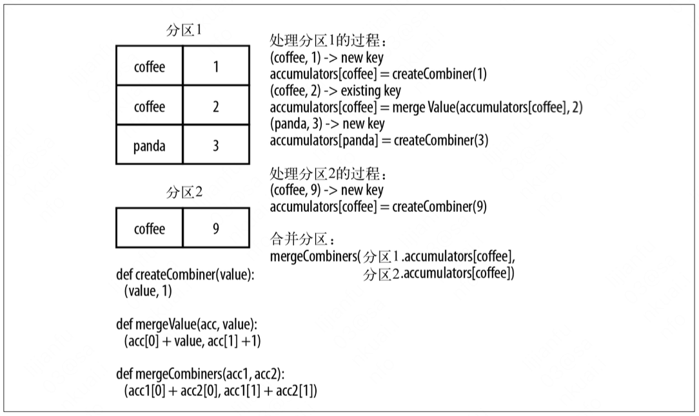
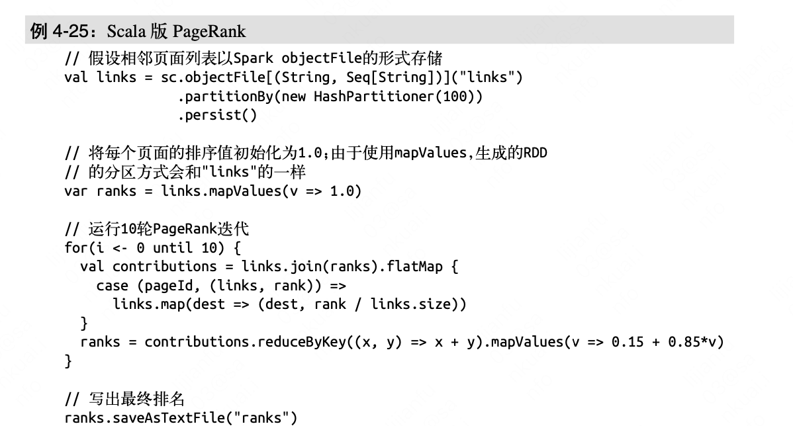
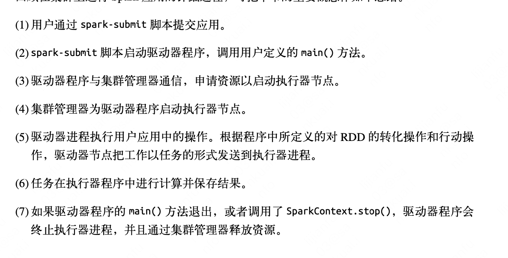
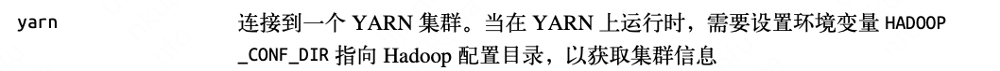
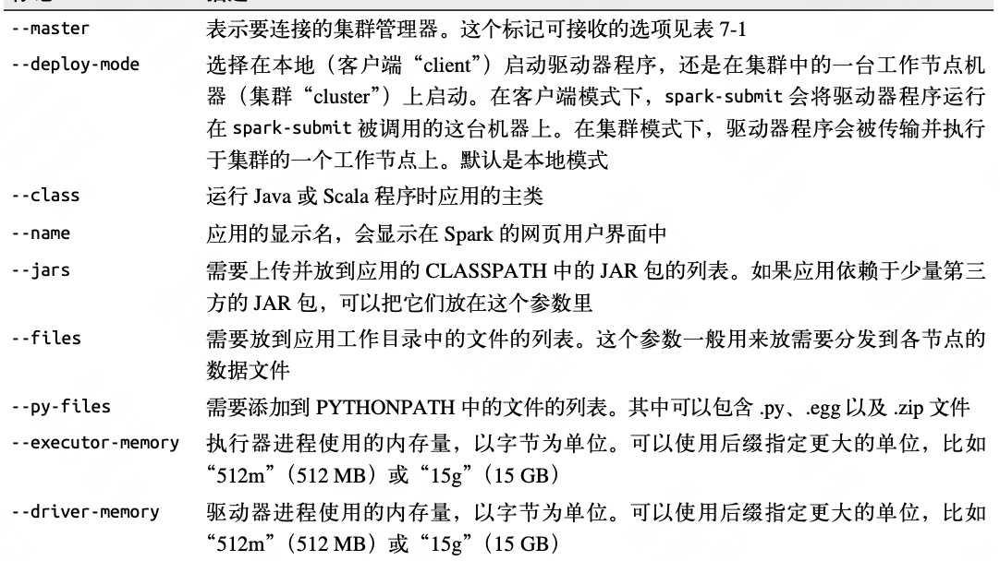
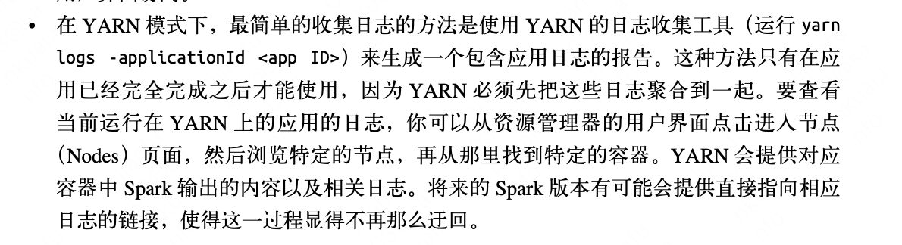

# 知识索引

## 1 普通rdd及其操作

### 1.1 传递函数

向rdd中传递函数时：

* 这个函数及其引用的数据应该是可序列化的,NotSerializableException表示传递的对象不可序列化

* 传递一个对象的方法和引用时会传递整个对象的引用

  ```scala
  Class A(val query: String) {
    def f():Unit = {}
    def test(rdd:RDD[String]):RDD[String] {
      rdd.map(f)//传递的是this.f，这样整个this都会被传进去
      val f_ = f
      rdd.map(f_)//传递的是一个局部变量
      rdd.map(x=>x.split(query))//传递的是this.query，这样整个this都会被传进去
      val q = query
      rdd.map(x=>x.split(q)//传递的是一个局部变量   
    }
  }
  ```

### 1.2 rdd缓存

https://chowdera.com/2022/04/202204111437378487.html

Spark中的RDD是懒加载的，只有当遇到行动算子时才会从头计算所有RDD，而且当同一个RDD被多次使用时，每次都需要重新计算一遍，这样会严重增加消耗。为了避免重复计算同一个RDD，可以将RDD进行持久化。

一个rdd的依赖关系：rdd1->rdd2->rdd3

如果计算rdd3的话，而且前面的rdd还没缓存，那就从rdd1开始算起；缓存了rdd2，那就会从缓存中取出rdd2的数据，从rdd2开始算起。

可以使用persist方法把rdd保存到jvm堆上，并指定不同的隔离级别，如果缓存太多内存放不下，spark使用lru把rdd移除


## 2 pairrdd及其操作

pairrdd的数据包含kv对，它和普通rdd可以相互转换

### 2.1 几个经典api

* FoldBykey:fold就是带初始值的reduce:https://blog.csdn.net/qq_22027637/article/details/78825299 根据key对v做聚合，可以指定初始值

* Combinebykey：https://www.jianshu.com/p/d7552ea4f882高阶kv函数的底层实现，目的是实现rdd[k,v]到rdd[k,c]的转化，把之前值的类型v变成c，它的三个主要参数：

  *  createCombiner: V => C 一个把类型v转成类型c的函数

  *  mergeValue: (C, V) => C：将原RDD中Pair的Value合并为操作后的C类型数据。

  * mergeCombiners: (C, C) => C：根据每个Key对应的多个C，进行归并

  * 用例:科目对成绩求平均值

  * ```scala
    val scores = sc.parallelize(List(("chinese", 88.0) , ("chinese", 90.5) , ("math", 60.0), ("math", 87.0)))
    //K=string V=float C=(float,int)
    
      def combineByKey[C](
          createCombiner: V => C,
          mergeValue: (C, V) => C,
          mergeCombiners: (C, C) => C,
          partitioner: Partitioner,
          mapSideCombine: Boolean = true,
          serializer: Serializer = null): RDD[(K, C)] = {
        //实现略
      }
    
    
    val avg = scores.combineByKey(
        (v) => (v, 1),//每分区都有一个Combiner，提供了一个初始值1
        (acc: (Float, Int), v) => (acc._1 + v, acc._2 + 1),//把v和combiner组合起来的逻辑
        (acc1:(Float, Int), acc2:(Float, Int)) => (acc1._1 + acc2._1, acc1._2 + acc2._2)
    ).map{ case (key, value) => (key, value._1 / value._2.toFloat) }//对key相同的c类型执行这个函数
    
    
    //逻辑是：1.首先这些kv对会分成不同的分区，一个分区中可能有不同的key，因为这里还没有reduce；
    //2.一个分区遇到一个没见过的key就会创建一个Combiner，提供一个这个分区内这个key的初始值；比如遇到第一个chinese的数据("chinese", 88.0)，就会执行createCombiner创建("chinese", 88.0，1)
    //3.后面遇到的数据就直接和前面创造的Combiner按照mergeValue聚合 mergeValue(("chinese", 88.0，1),("chinese", 90.5))
    //4.最后合并分区，相同key的数据执行mergeCombiners方法组合在一起
    //5.上面combinebykey之后再执行一个map操作得到最终结果
    ```

    下面这个是书上给出的流程图：在map端有可能

    

    

### 2.2 分区

rdd.partitionby(new partitioner()):得到一个分区的rdd，分区方式参考partitioner，一条记录总会按照rdd按照分区器进入确定的分区。

rdd分区的好处：对那些需要跨节点的操作，比如join等，好处是减少了网络开销：比如a.join(b)，a按照key进行hash分区，相同的key都在一个分区里，那么在join的时候，a这边一个节点上的一个分区数据是相同的，那么就不需要再进行额外的把a这边相同key的数据再归并放到一台机器上了，节省了网络开销。



pagerank算法底层就用了join操作，所以使用分区的话也会使他受益。注意links.map中的map是scala中的map函数,links是join后的seq。

## 3  累加器/广播变量

### 3.1累加器

创建累加器：

Accumulator[T]=SparkContext.accumulator(initialValue)

可以把累加器作为rdd的闭包中的一个变量，使用+=增加它的值

executer中无法访问累加器的值，而driver可以

spark推测执行机制，导致有的task可能多次执行，导致累加器的数值可能和实际的结果出现误差。spark确保action中使用的累加器一个task只会修改一次，重新执行的task不会再修改(执行到action了一个job都执行完了)；而放到transfromation中的累加器就没这种保证。


### 3.2 广播变量

一个exextor上的多个task可能共享任务，有些变量是各任务共享的，如果一个task发一个太占资源，所以把这种变量设置为广播变量可以保证一个节点只会收到一个这样的变量，可供多个task读取。

 Broadcast[T] b=sc.broadcast(x x x)

通过b.value访问值

### 3.3 分区操作

map和mapPartitions的区别：

* 前者签名为：map\[U: ClassTag](f: T => U): RDD[U]. 对rdd🀄️的每一个记录都执行一次函数f

* 后者签名为： mapPartitions\[U: ClassTag](f: Iterator[T] => Iterator[U]),返回一个迭代器，一次接收所有的partition数据。只要执行一次f就可以了，如果f中对所有的记录有一些公共性的操作的话，使用mapPartitions更好，不用对每个记录都执行一次公共操作，但是因为一次接收数据太多容易oom

## 4 集群上运行spark




Spark submit参数：

* 只有jar包，那么会在本地执行

* --master，指定要连接的集群的url

  

  

executor/driver-memory指的是堆内内存，堆外内存参数是spark.executor(driver).memoryOverhead

依赖冲突：当用户使用的依赖和spark相同但是版本不同时会爆出 NoSuchMethodError、ClassNotFoundException等，要么用户修改版本，要么用户使用shade重定向。

集群管理器：

一个集群可以供多个用户提交作业，作业会申请集群内执行器节点等资源，不同作业的资源申请资源需要被【调度器】调度，spark内提供了公平调度器。

spark可以使用独立集群管理器：

* 架构：自己把编译好的spark放到不同机器上，一个是主，几个是从。

* 提交：spark-submit --master spark://{主机名}:7077 yourapp  把作业提交到主节点
* 部署模式：
  * 客户端模式：driver进程运行在执行spark-submit的机器上，即主机
  * 集群模式：driver运行在工作节点上，向主节点申请工作节点，可以在程序运行时关掉主节点

yarn集群管理器：

* 设置hadoop的conf目录为机器环境变量
* 向--master yarn提交作业

## 5 spark调优




性能提升几个关注点：

* 重新设置分区数（core较多时可以增加分区数利用计算资源，而分区数太多会增加开销）
  * repartition(partitionNums):重新设置rdd的分区（会导致shuffle）
  * coalesce() ：返回一个CoalescedRDD，减少分区


## 6 spark sql

使用spark sql,maven引入spark sql依赖：

这种spark sql加入hive支持，可以读写hive表，支持hivesql

```
<groupId>org.apache.spark</groupId>
<artifactId>spark-hive_2.11</artifactId>
```

如果项目不能引进hive的话，就引入下面这个依赖

```
<groupId>org.apache.spark</groupId>
<artifactId>spark-sql_2.11</artifactId>
```


SchemaRDD/dataframe[新名字]:存放row对象的rdd。它有点像传统数据库中的表，

row对象表示一个记录对象，本质是变长数组，通过get(列序号)返回具体的记录。

val topTweetText = topTweets.map(row => row.getString(0))

UDF：

自定义sparksqludf：
hivectx.registerFunction("strLenScala", (_: String).length)

Hiveudf已经自动包含在sparksql中，但是要确保该udf所在jar包已经包含在应用中。