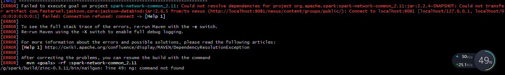
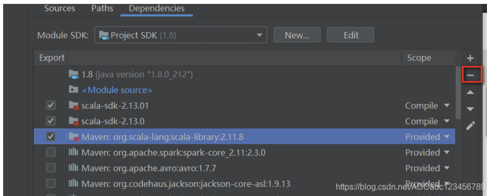
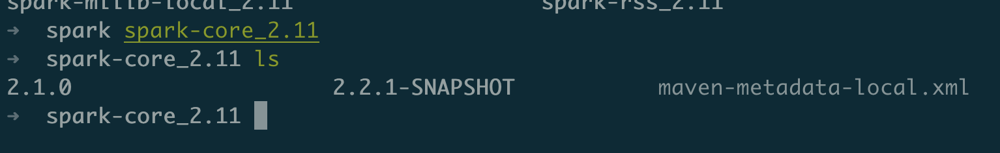
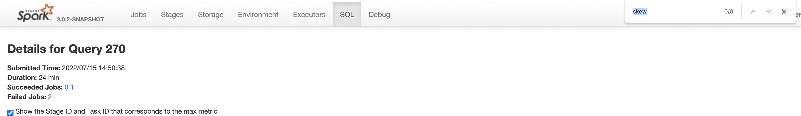

# spark 实战与调优

## 本地编译spark

下载spark后

安装spark：

1.直接编译spark发现maven版本问题：

2.编译某个模块出现问题



```
[ERROR] Failed to execute goal on project spark-network-common_2.11: Could not resolve dependencies for project org.apache.spark:spark-network-common_2.11:jar:2.2.4-SNAPSHOT: Could not transfer artifact com.fasterxml.jackson.core:jackson-databind:jar:2.6.5 from/to nexus (http://localhost:8081/nexus/content/groups/public/): Connect to localhost:8081 [localhost/127.0.0.1, localhost/0:0:0:0:0:0:0:1] failed: Connection refused: connect -> [Help 1]
[ERROR]
[ERROR] To see the full stack trace of the errors, re-run Maven with the -e switch.
[ERROR] Re-run Maven using the -X switch to enable full debug logging.
[ERROR]
[ERROR] For more information about the errors and possible solutions, please read the following articles:
[ERROR] [Help 1] http://cwiki.apache.org/confluence/display/MAVEN/DependencyResolutionException
[ERROR]
[ERROR] After correcting the problems, you can resume the build with the command
[ERROR]   mvn <goals> -rf :spark-network-common_2.11
/g/spark/build/zinc-0.3.11/bin/nailgun: line 49: ng: command not found

```

重新试了一下就好了，应该是网络问题。

我编译的是spark2.2

参考文档：

https://blog.csdn.net/make__It/article/details/84258916

在windows上编译完成了，使用的maven是本地路径的maven，调大maven内存的操作没什么用；

编译spark时遇到Spark-Parent包test_classpath飘红，解决方案见：https://www.cnblogs.com/limaosheng/p/15807925.html

然后maven-checkstyle-plugin标签的verbose和failonwarning不可使用，首先看了一下dev/checkstyle.xml，发现dtd文件没倒入，于是按小灯泡使其fetch外部资源，但是还是爆红

## wordcount

首先利用maven创建工程，然后发现没有scala的框架支持，解决方法如下：

https://blog.csdn.net/ChrisLu777/article/details/113739910?spm=1001.2101.3001.6661.1&utm_medium=distribute.pc_relevant_t0.none-task-blog-2%7Edefault%7ECTRLIST%7Edefault-1-113739910-blog-103887060.pc_relevant_scanpaymentv1&depth_1-utm_source=distribute.pc_relevant_t0.none-task-blog-2%7Edefault%7ECTRLIST%7Edefault-1-113739910-blog-103887060.pc_relevant_scanpaymentv1&utm_relevant_index=1

最后externel library有scala的sdk就可。



配置pom.xml,我自己install了2.2.1版本的spark,但是我在wc程序中使用的是2.1.0



然后使用idea将项目打成jar包放到spark命令行下执行。

## 数据倾斜问题

http://arganzheng.life/spark-data-skew.html

http://www.jasongj.com/spark/skew/

**数据倾斜定位：**

数据倾斜只会发生在 shuffle 过程中

1.可以到spark ui 的sql界面搜索skew关键字查看是否出现数据倾斜



2.到某一个stage界面看task处理的数据量分布情况也可以。

3.如果不是sql代码的话，也可以自己验证key出现的次数。

```
df.select("key").sample(false, 0.1)           // 数据采样 
    .(k => (k, 1)).reduceBykey(_ + _)         // 统计 key 出现的次数
    .map(k => (k._2, k._1)).sortByKey(false)  // 根据 key 出现次数进行排序
    .take(10)                                 // 取前 10 个。
```

**引起数据倾斜的原因**

读取源数据时引发：

* 读取Kafka，kafka的一个topic可分为多个partition，kafka的一个partition对应spark一个task，如果kafka一个topic消息在不同分区的分布不均匀的话，那么就会导致数据倾斜。

* 读hdfs文件，对于不可切分的文件，文件自己就对应一个分区；对于可切分的文件，每个split对于一个task大小，如果数据块不均的话也会导致数据倾斜：

  ```java
  protected long computeSplitSize(long goalSize, long minSize, long blockSize) {
      return Math.max(minSize, Math.min(goalSize, blockSize));
  }
  goalSize：文件总大小/minPartitions【这个参数也是由cpu核数和spark.default.parallelism决定】
  minSize:hdfs中的一个阈值
  blockSize:hadoop块大小   
  ```

  

  

**缓解数据倾斜的方法：**

* 过滤异常数据，比如某个引起倾斜的key本身是异常的，使用filter算子过滤掉它即可

* 提高shuffle并行度

  * 对于sql：设置spark.sql.shuffle.partitions=[num_tasks]，不过有时候设置了这个参数未必就能提升具体stage的并行度
  * 对于普通spark作业：直接在算子上调整并发度活设置spark.default.parallelism

* 自定义partitioner

  ```
  考虑key = 0，1，2，3，4，5路由到3个分区
  普通hash分区方式：key%hash
  但是如果2的数据远超其他key的话，可以重新定义分区器，让key=2的数据放到分区3，其他key路由到前两个分区：
  .groupByKey(new Partitioner() {
    @Override
    public int numPartitions() {
      return 3;
    }
  
    @Override
    public int getPartition(Object key) {
      int id = Integer.parseInt(key.toString());
      if(id == 2) {
        return 3;
      } else {
        return id % 2;
      }
    }
  })
  ```

  

* 


