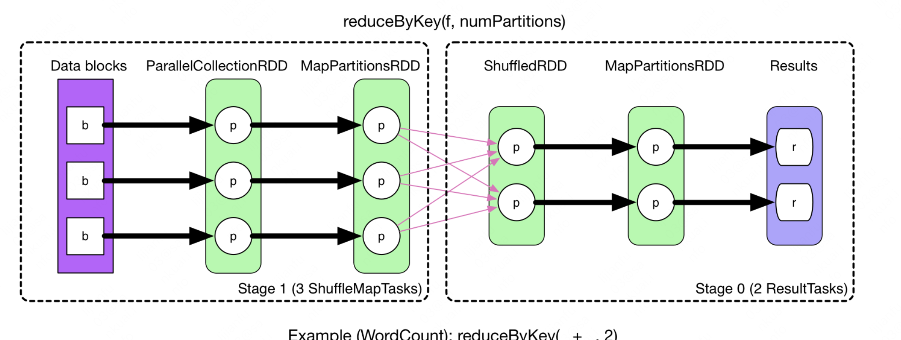

# Spark知识点

## Spark task调度

https://zhuanlan.zhihu.com/p/28893155

https://cloud.tencent.com/developer/article/1194503

https://books.japila.pl/apache-spark-internals/scheduler/DriverEndpoint/

提交作业时，TaskSchedulerImpl#submitTasks最后调用backend.reviveOffers()提交task，backend有多种实现，一种是CoarseGrainedSchedulerBackend，他内部定义了一个类：DriverEndpoint【https://books.japila.pl/apache-spark-internals/scheduler/DriverEndpoint/】。它就是一个消息处理器，负责后端之间的通信。backend.reviveOffers()底层调用driverEndpoint.send(ReviveOffers)；driverEndpoint是RpcEndpointRef类型。而DriverEndpoint中的receive方法会接受driverEndpoint发来的信息。

通过driverEndpoint（对rpc端点的饮用）发送的消息，最后是谁来接受呢？DriverEndpoint，它实际是RpcEndpoint类型。

接受消息后触发DriverEndpoint的makeOffers方法

RpcEndpointRef和DriverEndpoint的关系：

https://www.cnblogs.com/yourarebest/p/5297157.html


1.根据RpcEndpoint返回RpcEndpointRef，具体实现在RpcEndpoint.self方法中，如果RpcEndpointRef不存在，将返回null；

2.RpcEndpoint需要注册到RpcEnv，RpcEnv处理从RpcEndpointRef或远程节点发送过来的消息，然后把响应消息给RpcEndpoint。

Schedulerbackend和DriverEndpoint的关系：SchedulerBackend是TaskScheduler的调度后端接口。TaskScheduler给Task分配资源实际是通过SchedulerBackend来完成的，SchedulerBackend给Task分配完资源后将与分配给Task的Executor通信，并要求后者运行Task。

Schedulerbackend有多个实现类，yarn cluster模式使用的就是CoarseGrainedSchedulerBackend的一个子类。

CoarseGrainedSchedulerBackend内部持有一个RPC端点DriverEndpoint；在CoarseGrainedSchedulerBackend中由 `driverEndpoint`字段持有该RPC端点的RpcEndpointRef引用，而且对driverEndPoint初始化的时候，就会创建一个RpcEndpoint并且和driverEndPoint关联。

CoarseGrainedSchedulerBackend的receiveOffers方法底层就是调用 `driverEndpoint`的send方法发送信息，信息是ReceiveOffers。通过追源码可以知道它底层是调用nettyEnv传递数据。

现在知道driverEndpoint发送信息后，RpcEnv会处理这个信息，把消息响应给这个driverEndpoint对应的RpcEndpoint，即CoarseGrainedSchedulerBackend内部持有的RPC端点DriverEndpoint，然后DriverEndpoint的receive方法会开始处理这个信息，在提交作业时发送的信息是ReceiveOffers，然后receive方法接受这个方法调用makeOffers。


```scala
//CoarseGrainedSchedulerBackend的driverEndpoint成员变量
val driverEndpoint = rpcEnv.setupEndpoint(ENDPOINT_NAME, createDriverEndpoint())//创建DriverEndpoint、setupEndpoint返回这个DriverEndpoint对应的RpcEndpointRef
================================================
//RpcEndpoint和RpcEndpointRef的关系：
//在NettyRpcEnv中实现了setupEndpoint方法
  override def setupEndpoint(name: String, endpoint: RpcEndpoint): RpcEndpointRef = {
    dispatcher.registerRpcEndpoint(name, endpoint)
  }
//registerRpcEndpoint注册RpcEndpoint返回RpcEndpointRef
  def registerRpcEndpoint(name: String, endpoint: RpcEndpoint): NettyRpcEndpointRef = {
    val addr = RpcEndpointAddress(nettyEnv.address, name)
    val endpointRef = new NettyRpcEndpointRef(nettyEnv.conf, addr, nettyEnv)//创建RpcEndpointRef
    synchronized {
      if (stopped) {
        throw new IllegalStateException("RpcEnv has been stopped")
      }
      if (endpoints.containsKey(name)) {
        throw new IllegalArgumentException(s"There is already an RpcEndpoint called $name")
      }

      // This must be done before assigning RpcEndpoint to MessageLoop, as MessageLoop sets Inbox be
      // active when registering, and endpointRef must be put into endpointRefs before onStart is
      // called.
      endpointRefs.put(endpoint, endpointRef)//把这种映射关系保存到一个map，可以通过这个map获取到对应的endpointRef。

      var messageLoop: MessageLoop = null
      try {
        messageLoop = endpoint match {
          case e: IsolatedRpcEndpoint =>
            new DedicatedMessageLoop(name, e, this)
          case _ =>
            sharedLoop.register(name, endpoint)
            sharedLoop
        }
        endpoints.put(name, messageLoop)
      } catch {
        case NonFatal(e) =>
          endpointRefs.remove(endpoint)
          throw e
      }
    }
    endpointRef
  }
```

**总结：提交任务时最终TaskSchedulerImpl会调用Schedulerbackend的receiveOffer方法，他底层通过Schedulerbackend持有的一个RpcEndpointRef类型成员driverEndpoint发送ReceiveOffers信息，这样与这个RpcEndpointRef相绑定的RpcEndpoint的receive方法会收到这个消息，调用makeOffers方法申请资源。**

makeOffers方法：https://cloud.tencent.com/developer/article/1194503

这个说的更详细：https://blog.csdn.net/qq_26222859/article/details/93144376，

makeOffers会申请资源，然后发起一个LaunchTask的rpc请求：CoarseGrainedExecutorBackend端的

CoarseGrainedSchedulerBackend的receive方法，方法用于给Task分配资源并运行Task，它通过执行 `driverEndpoint#send`向DriverEndpoint发送ReviveOffers消息，最终会由TaskScheduler的 `resourceOffers(...)`方法负责分配资源，由DriverEndpoint的 `launchTasks(...)`方法负责运行Task。

https://blog.coderap.com/article/311

## Spark eventloop

spark中经常能看到eventloop这个概念，例如

```scala
private[spark] abstract class DelayEventLoop[E](name: String) extends Logging {

  private val eventQueue: DelayQueue[DelayEvent] = new DelayQueue[DelayEvent]()

  private val stopped = new AtomicBoolean(false)

  private val eventThread = new Thread(name) {
    setDaemon(true)

    override def run(): Unit = {
      try {
        while (!stopped.get) {
          val event = eventQueue.take().e
          try {
            onReceive(event)
          } catch {
            case NonFatal(e) =>
              try {
                onError(e)
              } catch {
                case NonFatal(e) => logError("Unexpected error in " + name, e)
              }
          }
        }
      } catch {
        case ie: InterruptedException => // exit even if eventQueue is not empty
        case NonFatal(e) => logError("Unexpected error in " + name, e)
      }
    }
  }

  def start(): Unit = {
    if (stopped.get) {
      throw new IllegalStateException(name + " has already been stopped")
    }
    // Call onStart before starting the event thread to make sure it happens before onReceive
    onStart()
    eventThread.start()
  }

  def stop(): Unit = {
    if (stopped.compareAndSet(false, true)) {
      eventThread.interrupt()
      var onStopCalled = false
      try {
        eventThread.join()
        // Call onStop after the event thread exits to make sure onReceive happens before onStop
        onStopCalled = true
        onStop()
      } catch {
        case ie: InterruptedException =>
          Thread.currentThread().interrupt()
          if (!onStopCalled) {
            // ie is thrown from `eventThread.join()`. Otherwise, we should not call `onStop` since
            // it's already called.
            onStop()
          }
      }
    } else {
      // Keep quiet to allow calling `stop` multiple times.
    }
  }

  /**
   * Put the event into the event queue. The event thread will process it later.
   */
  def post(event: E, delayMs: Long): Unit = {
    eventQueue.put(new DelayEvent(event, delayMs))
  }

  /**
   * Return if the event thread has already been started but not yet stopped.
   */
  def isActive: Boolean = eventThread.isAlive

  /**
   * Invoked when `start()` is called but before the event thread starts.
   */
  protected def onStart(): Unit = {}

  /**
   * Invoked when `stop()` is called and the event thread exits.
   */
  protected def onStop(): Unit = {}

  /**
   * Invoked in the event thread when polling events from the event queue.
   *
   * Note: Should avoid calling blocking actions in `onReceive`, or the event thread will be blocked
   * and cannot process events in time. If you want to call some blocking actions, run them in
   * another thread.
   */
  protected def onReceive(event: E): Unit

  /**
   * Invoked if `onReceive` throws any non fatal error. Any non fatal error thrown from `onError`
   * will be ignored.
   */
  protected def onError(e: Throwable): Unit

  private class DelayEvent(val e: E, delayMs: Long) extends Delayed {
    private val time = System.currentTimeMillis() + delayMs

    override def getDelay(unit: TimeUnit): Long = {
      time - System.currentTimeMillis()
    }

    override def compareTo(o: Delayed): Int = {
      val otherTime = o.asInstanceOf[DelayEvent].time
      if (time < otherTime) {
        -1
      } else if (time > otherTime) {
        1
      } else {
        0
      }
    }
  }

}
```

基本模型：

* 内部持有一个延迟队列eventQueue
* 一个thread类型的成员eventThread，它是守护线程，主线程结束时它也结束
* stopped,AtomicBoolean类型，调用stop方法后会通过cas把它设为true
* start方法，执行onstart方法，start eventThread
* stop方法：通过cas设置stopped，打断eventThread，等到eventThread结束之后，调用onStop方法，这样是确保在eventThread结束之后onStop调用
* eventThread循环，先检查是否被stop了，没有的话就从eventQueue中取出一个时间，执行onreceive方法处理事件，等到被stop里的interrupt打断之后就退出

* Onstart[eventThread开始前调用]、OnStop[eventThread结束后调用]、Onreceive[处理事件]


## spark on yarn

组织关系

* datanode（节点)
* Namenode(节点)
  * Container(容器，等价于executer)
    * Task


## spark rdd存储级别

https://chowdera.com/2022/04/202204111437378487.html

Spark中的RDD是懒加载的，只有当遇到行动算子时才会从头计算所有RDD，而且当同一个RDD被多次使用时，每次都需要重新计算一遍，这样会严重增加消耗。为了避免重复计算同一个RDD，可以将RDD进行持久化。

一个rdd的依赖关系：rdd1->rdd2->rdd3

如果计算rdd3的话，而且前面的rdd还没缓存，那就从rdd1开始算起；缓存了rdd2，那就会从缓存中取出rdd2的数据，从rdd2开始算起。

## spark性能优化

https://tech.meituan.com/2016/04/29/spark-tuning-basic.html


## Spark shuffle分区

近日在读代码时，DAGScheduler#createShuffleMapStage中有一个向mapOutputTracker注册shuffle元数据的逻辑：

```
mapOutputTracker.registerShuffle(shuffleDep.shuffleId, rdd.partitions.length,
  Some(shuffleDep.partitioner.numPartitions))
```

注册shuffle时，需要提供shuffled、然后还有两个分区信息，分别为map端的分区大小和reduce端的分区大小

```scala
def registerShuffle(shuffleId: Int, numMaps: Int, numReduces: Option[Int] = None) {
  if (shuffleStatuses.put(shuffleId,
    new ShuffleStatus(numMaps, numReduces, useRemoteShuffle, trackNumRows)).isDefined) {
    throw new IllegalArgumentException("Shuffle ID " + shuffleId + " registered twice")
  }
}
```

map端分区大小可以看出是从ShuffleMapStage的finalrdd取出的分区大小,而后面的分区是通过shuffleDep的分区器确定的大小



从图中可以看到，在注册shuffle时numMaps为3，numReduces为2.

Partitioner是在shuffle阶段起作用:

https://ihainan.gitbooks.io/spark-source-code/content/section1/partitioner.html

**分区器（Partitioner）**的三个作用，而这三个影响在本质上其实是相互关联的。

1. 决定 Shuffle 过程中 Reducer 的个数（实际上是子 RDD 的分区个数）以及 Map 端的一条数据记录应该分配给哪一个 Reducer。这个应该是最主要的作用。
2. 决定 RDD 的分区数量。例如执行操作 `groupByKey(new HashPartitioner(2))` 所生成的 `ShuffledRDD` 中，分区的数目等于 2。
3. 决定 `CoGroupedRDD` 与父 RDD 之间的依赖关系。这个在依赖小节说过。

由于分区器能够间接决定 RDD 中分区的数量和分区内部数据记录的个数，因此选择合适的分区器能够有效提高并行计算的性能（回忆下分区小节我们提及过的 `spark.default.parallelism` 配置参数）。Apache Spark 内置了两种分区器，分别是**哈希分区器（Hash Partitioner）**和**范围分区器（Range Partitioner）**。

开发者还可以根据实际需求，编写自己的分区器。分区器对应的源码实现是 `Partitioner` 抽象类，`Partitioner` 的子类（包括自定义分区器）需要实现自己的 `getPartition` 函数，用于确定对于某一特定键值的键值对记录，会被分配到子RDD中的哪一个分区。

哈希分区器实现：

```scala
class HashPartitioner(partitions: Int) extends Partitioner {
  def numPartitions: Int = partitions//新的reducer分区个数

  def getPartition(key: Any): Int = key match {
    case null => 0
    case _ => Utils.nonNegativeMod(key.hashCode, numPartitions)
  }

  override def equals(other: Any): Boolean = other match {
    case h: HashPartitioner =>
      h.numPartitions == numPartitions
    case _ =>
      false
  }
  override def hashCode: Int = numPartitions
}
```

就是拿到key，计算hash值，返回一个（0，numPartitions-1）的值。

## spark内存管理

https://blog.coderap.com/article/301

Spark中数据的存储按照位置来分，可以分为磁盘和内存，存储体系也分别根据这两种存储位置做出了不同的实现；同时，存储层还有一项非常重要的工作，就是对这两种存储进行管理。

磁盘存储：

* DiskBlockManager：主要负责建立逻辑上的数据块与该数据块在磁盘上的写入位置之间的映射关系
* DiskStore：负责数据块在磁盘上的进行存储的具体实现方式，比如实现了在磁盘上保存block的逻辑。

内存存储：

* MemoryPool：用于实现对操作系统分配给Spark的物理内存的逻辑规划，协助Spark管理可调节的内存区域

  * `_poolSize`字段用于表示内存池的总大小（以字节为单位），线程安全

  * ExecutionMemoryPool：MemoryPool的实现类，执行内存池，执行各种存储操作。执行内存池的分配和管理，它用于保证Task合理地进行内存使用，避免由于某些Task过度使用内存导致其它的Task频繁将数据溢写到磁盘。会根据Task的数量来动态控制每个Task所能申请的用于执行操作的内存大小范围。跟踪所有激活的Task的数量以便动态更新总内存的1 / 2N ~ 1 / N范围值【N为task个数】。
    * MemoryMode类型的参数`memoryMode`，MemoryMode是枚举类ON_HEAP和OFF_HEAP两种内存模式，分别表示堆内存模式和堆外内存模式。MemoryMode主要决定在JVM堆上还是JVM的堆外内存（操作系统内存）中。
    * HashMap[Long, Long]类型的字典`memoryForTask`记录每个TaskAttempt的ID与其所使用的执行内存的大小之间的映射关系
    * 申请内存方法【为一个task(taskAttemptId)申请numBytes字节的内存】：private[memory] def acquireMemory(numBytes: Long, taskAttemptId: Long,maybeGrowPool: Long => Unit = (additionalSpaceNeeded: Long) => Unit，computeMaxPoolSize: () => Long = () => poolSize)
    * 释放内存方法【为一个task(taskAttemptId)释放numBytes字节的内存】。   releaseMemory(numBytes**:** **Long**, taskAttemptId**:** **Long**)**:** **Unit**
  * StorageMemoryPool：MemoryPool的实现类，用于存储
    * 同样有个MemoryMode类型的参数`memoryMode`
    * 它提供了`_memoryUsed`字段用于表示已经使用的内存大小
    * MemoryStore类型的字段`_memoryStore`及其Getter和Setter方法，用于实现数据块在内存中的存储
    * 申请释放内存的方法

  * 目前看，两者侧重点不同，ExecutionMemoryPool负责记录每个Task及其内存使用信息；StorageMemoryPool记录BlockId(和一个文件关联)及其内存信息；前者为计算过程提供内存，后者为计算提供内存。

* MemoryManager：内存管理器。负责协调内存存储各类组件的相互协作，有静态内存管理器和统一内存管理器两种实现，对应于StaticMemoryManager和UnifiedMemoryManager两个实现类；前者对执行内存和存储内存的比例控制是固定的，后者则实现了动态比例划分。

  MemoryManager在申请内存时会按照申请的是执行/存储内存以及是否在堆上委托不同的内存池申请内存

  * 内部持有堆内/堆外的ExecutionMemoryPool/StorageMemoryPool四个成员

  * Tungsten存储：是Spark中致力于提升Spark程序对内存和CPU的利用率，优化硬件性能的项目。MemoryManager的`tungstenMemoryMode`字段指定了Tungsten的存储模式：如果enable了堆外内存并且spark.memory.offHeap.size大于0的话，tungstenMemoryMode就是MemoryMode.OFF_HEAP,否则就是MemoryMode.ON_HEAP

  * 两个工具类：MemoryLocation(获取对象在java堆中/堆外内存中的位置offset)；MemoryBlock在MemoryLocation上加上length字段，作为Tungsten对数据进行存储的载体

  * Tungsten定义了堆内内存和堆外内存的分配器HeapMemoryAllocator及UnsafeMemoryAllocator

    * HeapMemoryAllocator的allocate方法在堆上分配size大小内存的对象，其中使用了“池化链”字典来优化，先在“池化链”字典找到合适的MemoryBlock，找不到再new一个，尽可能避免频繁创建MemoryBlock带来的性能损坏。返回一个MemoryBlock。

      ```java
        public MemoryBlock allocate(long size) throws OutOfMemoryError {
          if (shouldPool(size)) {
            synchronized (this) {
              final LinkedList<WeakReference<MemoryBlock>> pool = bufferPoolsBySize.get(size);//池化链
              if (pool != null) {
                while (!pool.isEmpty()) {
                  final WeakReference<MemoryBlock> blockReference = pool.pop();
                  final MemoryBlock memory = blockReference.get();
                  if (memory != null) {
                    assert (memory.size() == size);
                    return memory;
                  }
                }
                bufferPoolsBySize.remove(size);
              }
            }
          }
          long[] array = new long[(int) ((size + 7) / 8)];//new了一个数组，作为MemoryBlock的obj
          MemoryBlock memory = new MemoryBlock(array, Platform.LONG_ARRAY_OFFSET, size);//
          if (MemoryAllocator.MEMORY_DEBUG_FILL_ENABLED) {
            memory.fill(MemoryAllocator.MEMORY_DEBUG_FILL_CLEAN_VALUE);
          }
          return memory;
        }
      ```

      

    * UnsafeMemoryAllocator的分配内存方法委托了Platform类，Platform的allocateMemory()方法实际代理了sun.misc. Unsafe 的allocateMemory()方法，sun.misc.Unsafe的allocateMemory()方法将返回分配的内存地址。

      ```java
        public MemoryBlock allocate(long size) throws OutOfMemoryError {
          long address = Platform.allocateMemory(size);//通过unsafe申请堆外内存
          MemoryBlock memory = new MemoryBlock(null, address, size);//
          if (MemoryAllocator.MEMORY_DEBUG_FILL_ENABLED) {
            memory.fill(MemoryAllocator.MEMORY_DEBUG_FILL_CLEAN_VALUE);
          }
          return memory;
        }
      ```

      

  * StaticMemoryManager：StaticMemoryManager是不支持将**堆外内存用于存储**，但是支持将堆外内存用于执行

    ```
    //可以看出，StaticMemoryManager直接把堆外内存池设成0了
    offHeapExecutionMemoryPool.incrementPoolSize(offHeapStorageMemoryPool.poolSize)
    offHeapStorageMemoryPool.decrementPoolSize(offHeapStorageMemoryPool.poolSize)
    ```

    

    

    

    可以使用StaticMemoryManager申请存储内存、展开存储内存【存储内存的一部分，堆内存池里存储内存安全区域用于Unroll操作的最大内存比例】和执行内存：

    * 伴生对象会读取配置计算出最大可用执行内存【getMaxExecutionMemory】和最大可用存储内存【getMaxStorageMemory】作为StaticMemoryManager的成员
    * 申请存储内存时需要先检查MemoryMode，如果申请堆外存储内存直接报错，然后保证申请的内存不要超过最大可用存储内存。
    * 申请执行内存时按照堆内/堆外委托不同的内存池申请

  * UnifiedMemoryManager：将执行内存和存储内存之间的边界修改为“软”边界，即任何一方可以向另一方借用空闲的内存。

    ```scala
      //初始化UnifiedMemoryManager:调用伴随对象的apply
    def apply(conf: SparkConf, numCores: Int): UnifiedMemoryManager = {
        val maxMemory = getMaxMemory(conf)
        new UnifiedMemoryManager(
          conf,
          maxHeapMemory = maxMemory,
          onHeapStorageRegionSize =
            (maxMemory * conf.getDouble("spark.memory.storageFraction", 0.5)).toLong,
          numCores = numCores)
      }
    //getMaxMemory方法
      private def getMaxMemory(conf: SparkConf): Long = {
        val systemMemory = conf.getLong("spark.testing.memory", Runtime.getRuntime.maxMemory)
        //Runtime.getRuntime.maxMemory是jvm可尝试使用的最大堆内存，即xmx减去一个suvivor的大小
        val reservedMemory = conf.getLong("spark.testing.reservedMemory",
          if (conf.contains("spark.testing")) 0 else RESERVED_SYSTEM_MEMORY_BYTES)
          //取决于spark.testing.reservedMemory、spark.testing和300mb
        val minSystemMemory = (reservedMemory * 1.5).ceil.toLong
        if (systemMemory < minSystemMemory) {
          throw new IllegalArgumentException(s"System memory $systemMemory must " +
            s"be at least $minSystemMemory. Please increase heap size using the --driver-memory " +
            s"option or spark.driver.memory in Spark configuration.")
        }
        // SPARK-12759 Check executor memory to fail fast if memory is insufficient
        if (conf.contains("spark.executor.memory")) {
          val executorMemory = conf.getSizeAsBytes("spark.executor.memory")
          if (executorMemory < minSystemMemory) {
            throw new IllegalArgumentException(s"Executor memory $executorMemory must be at least " +
              s"$minSystemMemory. Please increase executor memory using the " +
              s"--executor-memory option or spark.executor.memory in Spark configuration.")
          }
        }
        val usableMemory = systemMemory - reservedMemory//系统内存
        val memoryFraction = conf.getDouble("spark.memory.fraction", 0.6)
        (usableMemory * memoryFraction).toLong
      }
    //初始化UnifiedMemoryManager对象
    private[spark] class UnifiedMemoryManager private[memory] (
        conf: SparkConf,
        val maxHeapMemory: Long,//最大内存
        onHeapStorageRegionSize: Long,//用于存储区域的内存
        numCores: Int)
      extends MemoryManager(
        conf,
        numCores,
        onHeapStorageRegionSize,
        maxHeapMemory - onHeapStorageRegionSize) 
    ```
    
    **【猜想】这里虽然系统内存是由Runtime.getRuntime.maxMemory决定的，但是实际这个函数的返回结果很有可能就是spark.executor.memory**
    
    spark.executor.memoryOverhead：executor上每个进程分配的额外内存，https://spark.apache.org/docs/latest/configuration.html，它在堆外。spark3之后，The maximum memory size of container to running executor is determined by the sum of `spark.executor.memoryOverhead`, `spark.executor.memory`, `spark.memory.offHeap.size` and `spark.executor.pyspark.memory`.
    
    spark.memory.offHeap.size和spark.executor.memoryOverhead有什么区别？
    
    https://stackoverflow.com/questions/58666517/difference-between-spark-yarn-executor-memoryoverhead-and-spark-memory-offhea
    
    前者是被spark内核使用的，yarn的rm不知道这部分资源；后者是被rm知道的
    
    Spark2.4.5之前：spark.memory.offHeap.size这部分内存需要手动加到yarn的memoryOverhead里让yarn分配：
    
    这个在YarnAllocator.scala中表明了，yarn分配的资源只包括executorMemory【spark.executor.memory】和memoryOverhead 【spark.executor.memoryOverhead】两部分指定的数据。
    
    ```scala
      private[yarn] val resource = if (gpuResource.size > 0) {
        logInfo(s"Resource with gpuResource map: $gpuResource")
        Resource.newInstance(executorMemory + memoryOverhead, executorCores,
          gpuResource.asJava)
      } else {
        Resource.newInstance(executorMemory + memoryOverhead, executorCores,
          executorGCores)
      }
    ```
    
    spark3以后：
    
    ```scala
    private[yarn] val resource: Resource = {
        val resource = Resource.newInstance(
          executorMemory + executorOffHeapMemory + memoryOverhead + pysparkWorkerMemory, executorCores)
        ResourceRequestHelper.setResourceRequests(executorResourceRequests, resource)
        logDebug(s"Created resource capability: $resource")
        resource
      }
    ```
    
    https://github.com/apache/spark/pull/25309
    
    此时ym可以使用executorOffHeapMemory指定【spark.memory.offHeap.size】的数据，
    
    最终获取到的MemoryManager的内存结构为：
    
    * 系统内存
      * usableMemory（系统内存-保留内存）
        * spark.memory.fraction（用于执行+存储的堆内存）
          * 存储占比(spark.memory.storageFraction)
          * 执行占比
        * 其他堆内存
      * 保留内存
    
    用实际并而堆外内存走的是spark.memory.offHeap.size，并且按照spark.memory.storageFraction分配存储与计算
    
    最后在new MemoryManager时,它的目的有：
    
    1. 初始化四个内存池并指定大小
    2. 这些内存池大小的计算，堆内存取决于具体MemoryManager实现类是怎么分配的，堆外统一在MemoryManager分配
    
    ```scala
    private[spark] abstract class MemoryManager(
        conf: SparkConf,
        numCores: Int,
        onHeapStorageMemory: Long
        onHeapExecutionMemory: Long) extends Logging {
    
      // -- Methods related to memory allocation policies and bookkeeping ------------------------------
    
      @GuardedBy("this")
      protected val onHeapStorageMemoryPool = new StorageMemoryPool(this, MemoryMode.ON_HEAP)
      @GuardedBy("this")
      protected val offHeapStorageMemoryPool = new StorageMemoryPool(this, MemoryMode.OFF_HEAP)
      @GuardedBy("this")
      protected val onHeapExecutionMemoryPool = new ExecutionMemoryPool(this, MemoryMode.ON_HEAP)
      @GuardedBy("this")
      protected val offHeapExecutionMemoryPool = new ExecutionMemoryPool(this, MemoryMode.OFF_HEAP)
    
      onHeapStorageMemoryPool.incrementPoolSize(onHeapStorageMemory)
      onHeapExecutionMemoryPool.incrementPoolSize(onHeapExecutionMemory)
    
      protected[this] val maxOffHeapMemory = conf.getSizeAsBytes("spark.memory.offHeap.size", 0)
      protected[this] val offHeapStorageMemory =
        (maxOffHeapMemory * conf.getDouble("spark.memory.storageFraction", 0.5)).toLong
    
      offHeapExecutionMemoryPool.incrementPoolSize(maxOffHeapMemory - offHeapStorageMemory)
      offHeapStorageMemoryPool.incrementPoolSize(offHeapStorageMemory)
    ```
    
    
    
    
    
    
    
    
    
    UnifiedMemoryManager所管理的执行和存储两个内存区域的比例在初始时是确定的，即各占50%，但它们在作业运行期间是动态变化的，当申请执行内存时，发现执行内存不够用，则可以向存储内存区域借用一部分内存，同样的，当存储内存不够用时，如果执行内存有空闲，则可以向执行内存区域借用一部分内存；两个内存区域空间都不足时，则需要存储到磁盘。
    
    1. 执行内存区域被存储内存借用后，可让其将存储在占用部分的数据转储到硬盘，以归还借用的空间。
    2. 存储内存区域被执行内存借用后，无法让对方归还空间，这是为了保证计算操作不会因为内存不足而OOM。
    
    ```scala
     //	执行内存空间不足时从存储内存借或者要求其归还内存   
    	def maybeGrowExecutionPool(extraMemoryNeeded: Long): Unit = {
          if (extraMemoryNeeded > 0) {
            // There is not enough free memory in the execution pool, so try to reclaim memory from
            // storage. We can reclaim any free memory from the storage pool. If the storage pool
            // has grown to become larger than `storageRegionSize`, we can evict blocks and reclaim
            // the memory that storage has borrowed from execution.
            val memoryReclaimableFromStorage = math.max(
              storagePool.memoryFree,//storage空闲的内存
              storagePool.poolSize - storageRegionSize)//storagePool当前大小减去标准大小，表示storagePool借的
            if (memoryReclaimableFromStorage > 0) {
              // Only reclaim as much space as is necessary and available:
              val spaceToReclaim = storagePool.freeSpaceToShrinkPool(//让storagePool将一部分数据转储
                math.min(extraMemoryNeeded, memoryReclaimableFromStorage))
              storagePool.decrementPoolSize(spaceToReclaim)
              executionPool.incrementPoolSize(spaceToReclaim)
            }
          }
        }
    //这个代码的神奇之处在于当storagePool刚好占50%时，executionPool拿不到内存
    ```
    
    

* MemoryEntry：数据块的内存抽象。数据块存储在内存中的具体表现形式。

* MemoryStore：内存存储的具体执行类。它是执行各类内存存储操作的主要实现类。

https://www.cnblogs.com/johnny666888/p/11277947.html

TaskmemoryManager：供不同消费者申请内存的组件

```java
private final MemoryBlock[] pageTable = new MemoryBlock[PAGE_TABLE_SIZE];//PAGE_TABLE_SIZE=2^13
private final HashSet<MemoryConsumer> consumers;//维护所有向他申请内存的消费者记录
private final MemoryManager memoryManager;//这个TaskmemoryManager所委托的MemoryManager
private final BitSet allocatedPages = new BitSet(PAGE_TABLE_SIZE);//维护分配的页的信息
```

```java
public class MemoryLocation {

  @Nullable
  Object obj;//onheap不为null，offheap为null

  long offset;//这个block在堆内存/堆外内存的起始地址

 }
=======================  
public class MemoryBlock extends MemoryLocation {

  private final long length;//这个block的大小

  /**
   * Optional page number; used when this MemoryBlock represents a page allocated by a
   * TaskMemoryManager. This field is public so that it can be modified by the TaskMemoryManager,
   * which lives in a different package.
   */
  public int pageNumber = -1;//页号

  /**
   * Returns the size of the memory block.
   */
  public long size() {
    return length;
  }
}
```

申请内存：MemoryAllocator相关类，申请堆内存、堆外内存。

MemoryBlock：封装内存地址信息的一个类，内存地址的特征：起始位置+范围。

* 对于堆外内存，直接申请一块直接内存，然后把这块内存地址赋给offset即可
* 堆内内存会发生gc，我们入股按照堆外的做法，申请一块堆内存，把起始地址赋给offset，那发生gc后这段地址就不准确了，所以干脆申请一个数组作为MemoryBlock.obj，然后

在申请大小为size的堆内存的时候：

* MemoryBlock.obj是一个long类型的数组
* MemoryBlock.offset是Platform.LONG_ARRAY_OFFSET【long类型数组第一个位置相对于数组的偏移，一个数组类型的对象前面是对象头，在过了Platform.LONG_ARRAY_OFFSET个字节后才是真正放数据的地方。Platform.LONG_ARRAY_OFFSET为16
* MemoryBlock.length是size

在申请大小为size的堆外内存的时候：

* MemoryBlock.obj是null
* MemoryBlock.offset是堆外内存地址
* MemoryBlock.length是size

TaskmemoryManager申请内存的方法：

1.检查内存消费者的模式以及申请内存大小size

2.委托memorymanager申请执行内存，一旦不够会对消费者进行spill，得到acquired，acquired<=size

3.以acquired为大小分配page

```java
  public MemoryBlock allocatePage(long size, MemoryConsumer consumer) {
    assert(consumer != null);
    assert(consumer.getMode() == tungstenMemoryMode);
    if (size > MAXIMUM_PAGE_SIZE_BYTES) {
      throw new IllegalArgumentException(
        "Cannot allocate a page with more than " + MAXIMUM_PAGE_SIZE_BYTES + " bytes");
    }

    long acquired = acquireExecutionMemory(size, consumer);//申请执行内存
    if (acquired <= 0) {
      return null;
    }

    final int pageNumber;
    synchronized (this) {
      pageNumber = allocatedPages.nextClearBit(0);//返回一个未被页号
      if (pageNumber >= PAGE_TABLE_SIZE) {
        releaseExecutionMemory(acquired, consumer);
        throw new IllegalStateException(
          "Have already allocated a maximum of " + PAGE_TABLE_SIZE + " pages");
      }
      allocatedPages.set(pageNumber);
    }
    MemoryBlock page = null;
    try {
      page = memoryManager.tungstenMemoryAllocator().allocate(acquired);//tungstenMemoryAllocator根据memorymode返回堆内内存或堆外内存的分配器，然后分配内存
    } catch (OutOfMemoryError e) {
      logger.warn("Failed to allocate a page ({} bytes), try again.", acquired);
      // there is no enough memory actually, it means the actual free memory is smaller than
      // MemoryManager thought, we should keep the acquired memory.
      synchronized (this) {
        acquiredButNotUsed += acquired;
        allocatedPages.clear(pageNumber);
      }
      // this could trigger spilling to free some pages.
      return allocatePage(size, consumer);
    }
    page.pageNumber = pageNumber;
    pageTable[pageNumber] = page;
    if (logger.isTraceEnabled()) {
      logger.trace("Allocate page number {} ({} bytes)", pageNumber, acquired);
    }
    return page;
  }
```

申请执行内存，先委托内存池申请required个大小的内存，但是返回的值got可能小于required，然后对consumer进行spill，然后继续申请，直到满足要求或者最后申请的内存数got依旧小于required。

```java
  public long acquireExecutionMemory(long required, MemoryConsumer consumer) {
    assert(required >= 0);
    assert(consumer != null);
    MemoryMode mode = consumer.getMode();
    // If we are allocating Tungsten pages off-heap and receive a request to allocate on-heap
    // memory here, then it may not make sense to spill since that would only end up freeing
    // off-heap memory. This is subject to change, though, so it may be risky to make this
    // optimization now in case we forget to undo it late when making changes.
    synchronized (this) {
      //这里是委托内存池申请required大小的内存
      long got = memoryManager.acquireExecutionMemory(required, taskAttemptId, mode);

      // Try to release memory from other consumers first, then we can reduce the frequency of
      // spilling, avoid to have too many spilled files.
      if (got < required) {
        // Call spill() on other consumers to release memory
        // Sort the consumers according their memory usage. So we avoid spilling the same consumer
        // which is just spilled in last few times and re-spilling on it will produce many small
        // spill files.
        TreeMap<Long, List<MemoryConsumer>> sortedConsumers = new TreeMap<>();
        for (MemoryConsumer c: consumers) {
          if (c != consumer && c.getUsed() > 0 && c.getMode() == mode) {
            long key = c.getUsed();
            List<MemoryConsumer> list =
                sortedConsumers.computeIfAbsent(key, k -> new ArrayList<>(1));
            list.add(c);
          }
        }
        while (!sortedConsumers.isEmpty()) {
          // Get the consumer using the least memory more than the remaining required memory.
          Map.Entry<Long, List<MemoryConsumer>> currentEntry =
            sortedConsumers.ceilingEntry(required - got);
          // No consumer has used memory more than the remaining required memory.
          // Get the consumer of largest used memory.
          if (currentEntry == null) {
            currentEntry = sortedConsumers.lastEntry();
          }
          List<MemoryConsumer> cList = currentEntry.getValue();
          MemoryConsumer c = cList.remove(cList.size() - 1);
          if (cList.isEmpty()) {
            sortedConsumers.remove(currentEntry.getKey());
          }
          try {
            long released = c.spill(required - got, consumer);
            if (released > 0) {
              logger.debug("Task {} released {} from {} for {}", taskAttemptId,
                Utils.bytesToString(released), c, consumer);
              got += memoryManager.acquireExecutionMemory(required - got, taskAttemptId, mode);
              if (got >= required) {
                break;
              }
            }
          } catch (ClosedByInterruptException e) {
            // This called by user to kill a task (e.g: speculative task).
            logger.error("error while calling spill() on " + c, e);
            throw new RuntimeException(e.getMessage());
          } catch (IOException e) {
            logger.error("error while calling spill() on " + c, e);
            throw new OutOfMemoryError("error while calling spill() on " + c + " : "
              + e.getMessage());
          }
        }
      }

      // call spill() on itself
      if (got < required) {
        try {
          long released = consumer.spill(required - got, consumer);
          if (released > 0) {
            logger.debug("Task {} released {} from itself ({})", taskAttemptId,
              Utils.bytesToString(released), consumer);
            got += memoryManager.acquireExecutionMemory(required - got, taskAttemptId, mode);
          }
        } catch (ClosedByInterruptException e) {
          // This called by user to kill a task (e.g: speculative task).
          logger.error("error while calling spill() on " + consumer, e);
          throw new RuntimeException(e.getMessage());
        } catch (IOException e) {
          logger.error("error while calling spill() on " + consumer, e);
          throw new OutOfMemoryError("error while calling spill() on " + consumer + " : "
            + e.getMessage());
        }
      }

      consumers.add(consumer);
      logger.debug("Task {} acquired {} for {}", taskAttemptId, Utils.bytesToString(got), consumer);
      return got;
    }
  }
```

**总之，申请一个大小为size的页，需要申请大小为size的执行内存（实际申请到可能会小于size)；然后按照实际伸到的执行内存数与申请一个页page。**

对于内存消费者，一旦委托tmm申请到的页大小小于requied，就会释放这个页，抛出oom异常。

根据这个代码可以判断；

**执行内存位于堆上还是堆外取决于consumer自身的mode；**

**申请的memoryblock位于堆上还是堆外取决于memoryManager的tungstenMemoryMode**

* acquireExecutionMemory：通过MemoryManager申请执行内存，优先让其他消费者释放内存，如果释放之后还满足不了条件那就让这个消费者spill到磁盘上一些数据。
* 分配页号
* 根据memorymode返回堆内内存或堆外内存的分配器，然后分配内存，分配一个MemoryBlock
* 记录页号，保存page信息

内存申请示意图


