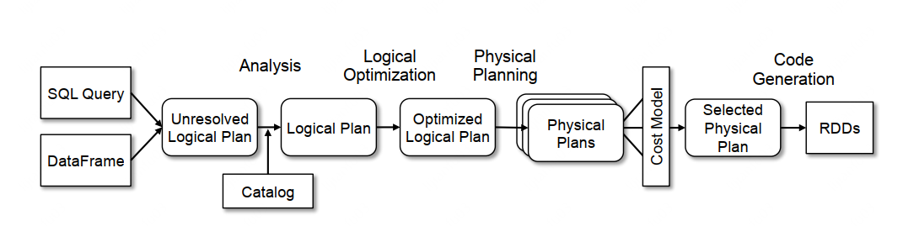
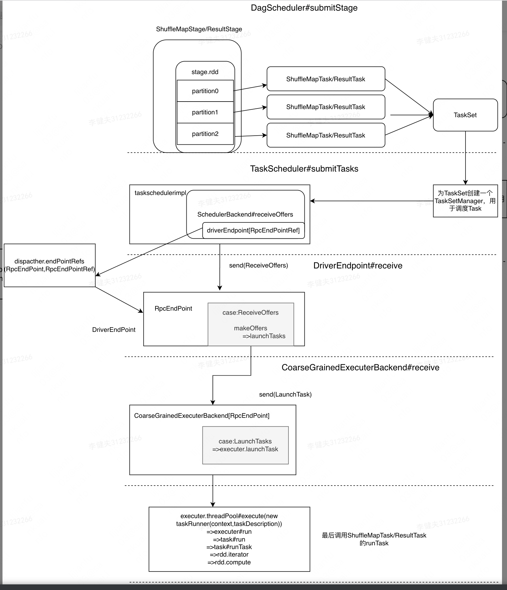

# spark论文学习

## 论文学习

### Spark: Cluster Computing with Working Sets

 MR等数据密集应用使用无环数据流，对其它应用没什么用。

Spark通过可复用并行算子完成对工作集数据流的复用，同时取得其他性能优势，取得这些进展的原因就是引入弹性分布式数据集RDD。RDD是可以分布在各机器上的只读对象集合，而且一个分区上的数据丢失了也可以重建。

MR的劣势：尽管采用无环数据流的形式，让数据通过一系列算子进行计算，实现了扩展性和容错，但并没有覆盖所有的case，比如：

* 迭代性job：比如机器学习算法的一次正向传播过程就可以作为MR作业，但MR必须从磁盘加载作业，性能严重下降
* 迭代性分析：理想情况下hadoop应该把数据加载到内存供多次查询，但MR会从磁盘加载数据，带来延迟

Spark的RDD算子可以被用户缓存在内存中，供用户复用数据。RDD一个分区丢失，其他分区有足够的分区恢复它。RDD算子不保留在物理存储上，一个RDD的句柄保存了足够信息，可以从保存在可靠存储空间上的数据计算出RDD。

创建RDD的四种方式：

* 从共享文件系统的一个文件上
* 在driver上并行化一个scala集合
* 现存RDD转换
* 更改一个RDD的持久化程度，RDD默认懒惰(用时再实现)和瞬态(ephemeral，用完就丢)，可以通过cache这个RDD和save这个RDD到磁盘上来创建一个性质不同的新的RDD。

RDD上可以执行的并行操作：

* reduce：组合数据集元素在driver端产生结果
* collect：把所有dataset元素发往driver
* foreach ：把每个用户元素都经过UDF处理

共享变量：

* 广播变量：编程者向spark传递闭包来调用map、filter等算子；一个worker上有多个闭包，而每个闭包中的数据都被复制到对应的worker上；对某些在闭包中共享的变量，这个变量只会被复制到worker上一次而不是复制到每个闭包上。
* 累加器：被加到相关算子上，实现counters

实现：

Spark的核心在于RDD的实现，给出一个统计hdfs中某文件含字符串"ERRORS"的行数的需求：

```
val file = spark.textFile("hdfs://...")
val errs = file.filter(_.contains("ERROR"))
val cachedErrs = errs.cache()
val ones = cachedErrs.map(_ => 1)
val count = ones.reduce(_+_)
```

RDD算子都是Lazy的，当最后的reduce被执行的时候才会真正被实现。

每一行都创建了一个RDD数据集，这些数据集会被组织成对象链的形式表征彼此关系：


子RDD对象会维护一个指向父RDD对象的指针，RDD对象需要实现下面三个接口：

* getPartitions, which returns a list of partition IDs.
* getIterator(partition), which iterates over a partition.遍历这个分区的迭代器
* getPreferredLocations(partition), which is used for task scheduling to achieve data locality. (preferred locations 是啥意思？数据区？)

当一个数据集上执行并行操作后，Spark会创建Task来执行并行后的每个分区，然后把Task送到worker node。

不同类型的RDD对上面三个接口的实现策略不同，比如对于hdftext，partion是hdfs中的blockid，preferred locations是block的位置， getIterator方法产生一个流，负责读取这个块。

把task ship到worker上：把定义数据集和操作数据集的闭包以java序列化形式传递(scala闭包是java对象)

共享变量的实现：

解释器集成：如何把spark集成到scala解释器？

* scala解释执行的特点

  ```scala
  var x = 6
  println(x)
  ```

  scala会把每一行都编译为一个class，每个class包括一个单例对象(里面封装该行的数据或函数)和一个构造器(可以执行该行代码)，比如上面第一行会被编译成一个类，假设名字为Line1，里面是包含x的单例对象；第二行对应的类是Line2，里面的单例对象里面有个println方法，它的构造器就是在执行println(Line1.getInstance().x)  。这些类会被加载到JVM中并执行
* Spark的优化：让每行的单例可以直接引用前面行的单例，比如第二行编译为println(Line1_x)，Line1_x是第二行的单例中的一个域，是对Line1中x的引用，这样的话第二行捕捉前面信息就无需getInstance方法了，速度更快，什么时候被发到worker都可以

### Resilient Distributed Datasets: A Fault-Tolerant Abstraction forIn-Memory Cluster Computing

RDD的两大特点：

* 内存计算：in-memory computations
* 容错：提供了严格形式的共享内存，基于粗粒度的转换(map、filter)而不是细粒度的对数据的更新更新，这样通过日志记录每个算子而不是数据的状态。一个分区数据丢失，其他分区有信息可恢复它

与传统指标的对比：其他计算框架只提供了集群模式的计算，却没利用集群分布式内存，没法实现数据复用类的任务，它们实现数据复用的方式把数据记录在外部磁盘中(增加了许多开销)

RDD描述：在RDD上有许多op，RDD只能通过某些特定的op被创建，这些op与其他op不同，被叫做transformations (包括map,filter,join)。每个RDD有它是如何从其他RDD派生出的足够信息，用户可以改变RDD的持久化程度(把它保存到磁盘上)和并行度。

用户通过transformations 定义RDD，通过一些action来使用RDD，比如save，collect,count。

一个应用：要查询hdfs中的日志排查错误，通过spark算子来做到这一点，那么就可以定义下面三个RDD实现这一任务，最后RDD errors被保存在内存中供多次查询使用：

```
lines = spark.textFile("hdfs://...")
errors = lines.filter(_.startsWith("ERROR"))
errors.persist()//让errors在内存中持久化
//使用errors
errors.filter(_.contains("HDFS"))
.map(_.split(’\t’)(3))
.collect()//向持久error的机器上把后面的transformations 组成流水线发送到持有errors分区的机器上执行
```

RDD的优点：与DSM相比，粒度更粗，没法想DSM那样可以读写任意位置，但是这反而有助于容错，因为对内存的读写粒度更细，某个位置出问题就越不好做容错，如果通过checkpoint做容错有可能导致checkpoint overhead;而粒度粗的RDD结构简单通过其他或lineage  即可恢复。

使用RDD：编写driver程序，与worker(永久进程)连接，在driver定义RDD，在RDD上执行action，driver会track RDD的lineage  。注意常见的transformation和actions，定义RDD的transformation是lazy的，而action会开启计算。

RDD可以用带有5种信息的接口来表征：


RDD中的依赖关系：

* narrow dependencies  :一个父RDD的一个分区最多被一个子RDD分区依赖
* wide dependencies  ：一个父RDD的一个分区可以被一个子RDD分区依赖

从故障后恢复的角度来说，前者开销更小，一个节点失败了，只有被丢失的父分区需要被重新计算；而后者[原因看不懂]

**RDD的实现**：Spark can read data from any Hadoop input source(e.g., HDFS or HBase) using Hadoop’s existing input plugin APIs, and runs on an unmodified version of Scala

* 作业调度：scheduler 会尽可能把有narrow dependencies 关系的RDD pipline成stage；在不同stage之间进行shuffule。随后scheduler会开始执行任务直到构建好目标RDD.scheduler  如何决定把哪个task发到哪个机器上？两种策略。1是延迟调度，即如果task需要执行某个节点内存上的一个分区，那就把任务发到那个节点；2是把task发到RDD的preferred locations 。如果如果出现错误，重新提交task
* 编译器集成：上一篇文章讲过
* 内存管理：Spark提供3种持久化存储的RDD：in-memory storage as deserialized Java objects(jvm支持，效率最高);in-memory storage as serialized data(内存受限时使用);on-disk storage使用LRU策略管理内存，将最久未使用的RDD换出到磁盘上以存放新的RDD，同时用户本身也可以改变RDD的持久度。
* 支持checkpoint：Although lineage can always be used to recover RDDs after a failure, such recovery may be time-consuming for RDDs with **long lineage chains.**   谱系太长时通过checkpoint恢复

### Spark SQL: Relational Data Processing in Spark

Catalyst  :Spark Sql的扩展查询优化器

Spark Sql的优势：**关系型查询(relational)和程序化算法(procedural  )的结合**，首先提供了DataFrame(简称DF)这一数据类型(结构化记录集合)，可以对外部数据和spark内置集合做关系计算；然后是提供了Catalyst 可以自定义数据源和优化规则。

Spark Sql是Spark的上层的一个library，同时对用户暴露接口供用户使用。


**DataFrame**：类似关系型数据库中的一个表，DataFrames keep track of their schema and support various relational operations that lead to more optimized execution. DataFrames  可以由外部数据创建也可以通过现存RDD创建。可以对它执行procedural  操作比如map也可以执行类似数据库的关系型操作如group by、where。dataframe是lazy的，他用logic plan表示，直到执行一个输出操作后，spark sql会建立物理plan并输出结果。

**数据模型**： 使用一种基于Hive的表和dataframe的嵌套数据模型，支持所有主要的sql数据类型(interger、timestamp)和复杂数据类型(map、union)

**操作**：DataFrames 支持所有常见的关系型操作(including projection (select), filter (where), join, and
aggregations (groupBy)  ),在DataFrames 上的一系列op最终会被组织成AST发给Catalyst优化。

**与原生语言的交互**：为和spark代码互相操作，spark sql允许从spark原生语言的RDD直接构造DF对象。Spark可以通过反射、java和scala的class、以及利用python的动态类型系统推断出这些native对象的schema ，还创造了logical data scan operator  直接指向原生对象，可以通过其直接访问原生对象的域。

**内存中的缓存**：Spark SQL可以对dataframe做柱状缓存(columnar)，与spark原生缓存相比(把数据保存为jvm对象)更省空间

**对UDF的支持**：其他数据库系统定义UDF时比较麻烦，需要进行复杂的打包和注册过程。而Spark sql支持对UDF的内联定义，可以自定义一个函数然后register，然后这个UDF就可以通过JDBC等工具使用了。

**Catalyst Optimizer**

设计目的：一个可扩展的优化器，方便后期增加优化功能

* Catalyst tree ：Catalyst中的主要数据结构，由节点类组成，一个表达式[例如x+(1+2)]可以用树的形式表示
* 规则：functions from a tree to another tree  。使用方式为tree.transform{case 节点=>新结果}，在transform里面定义不同的case，这些case会在树上所有节点做匹配，然后把匹配到的节点转化为新结果，形成了一个新的树。
* 使用Catalyst：Catalyst 可以在下面的四个步骤发挥作用

  

  * 分析阶段：对于一个sql语句例如SELECT col FROM sales，Spark不知道col的意思和类型，它首先会把语句组成"unresolved logical plan  "tree，然后解析每个节点，将其转化为"logical plan  "tree
  * 逻辑优化：对SQL语句进行优化
  * 物理planning：将logical plan用spark引擎提供的算子生成物理plan
  * 代码生成：将物理plan转换成java字节码和Scala AST。
* Catalyst还可以支持其他扩展功能，比如自定义数据源、自定义用户数据类型。

### spark internals

https://spark-internals.books.yourtion.com/

**总体介绍：**

部署图(主从)

* master node
  * driver(用户main)
* worker node
  * ExecutorBackend进程
    * Executor对象
      * Task(每个线程执行一个Task)
  * worker进程
    * Executer Runner对象：控制ExecutorBackend

**逻辑执行图**

典型逻辑执行图流程：数据源创建RDD——》一系列Transformation操作，变更RDD[T]的T——〉对最终RDD执行action，在每个分区上计算结果——》将结果返回driver端

RDD的几个关注点：

* 如何接受数据
  * 子RDD的分区与上级RDD的分区的依赖关系
    * narrow dependency(又可以划分为OneToOneDependency，N:1 NarrowDependency，N:N NarrowDependency多对(这是奇葩情况))和wide dependency(Shuffule Dependency),RDD之间出现了shuffle.
    * 区分多对多和Shuffule Dependency：前者parent partition可以和被多个子partion依赖，且这个parent partition的数据会完整的流向各个子partion；后者parent partition一部分数据流向一个子partion，另一部分数据流向一个另一个子partion
    * 每个rdd持有rdds保存它所依赖的所有父rdd，Dependecy数组记录和每个父亲rdd的依赖关系，如果子rdd的partitioner 类别及 partition 个数与父RDD i相同，那么会形成OneToOneDependency1对1依赖:Dependecy[i] = new OneToOneDependency(rdd[i])，否则形成ShuffleDependency：Dependecy[i] =new ShuffleDependency(rdd)
* 怎样执行计算
  * compute方法：负责接收来自上一个 RDD 或者数据源的 input records，在数据上执行transformation
  * 常见transformation的计算逻辑
    * 一次transormation可能产生多个RDD，如groupByKey(numPartitions)过程就会产生ShuffledRDD和mapPartitionsRDD
    * 计算数据时iter.f()和f(iter)的区别,前者是对单独的记录执行函数(如map、filter\)；后者是对一个分区内所有整体执行函数(如mappatitions)
* RDD本身属性：**只有Key-Value类型的RDD才有分区的，非Key-Value类型的RDD分区的值是None的。**
  * partition的个数确定（用户指定 or 所有父rdd中最大的partition）
  * partitioner确定：partitioner是rdd中的一个属性，决定这个rdd有几个分区、以及哪些数据对应到哪个分区的逻辑
    * HashPartitioner：默认的partitioner，按照数据key的hashcode%分区个数决定这个key的分区id，会导致数据倾斜
    * RangePartitioner：将Key切分成一段段范围(rangeBounds)，每段范围对应一个Partition。简单的说就是将一定范围内的Key映射到某一个分区内
    * https://blog.csdn.net/zc19921215/article/details/88673568


**物理执行图**

对于一个逻辑执行图，如何将其转换成物理执行图？

pipline思想(**数据用的时候再算，而且数据是流到要计算的位置的**)：将NarrowDependency的rdd chain到一起形成stage,在不同的stage间执行shuffle，管道思想的好处在于不需要存储中间结果。比如有一个计算流程是x->f(x)->g(f(x))那么这三个算子独立运行的话，需要保存x，送给f所在的进程，保存f(x)再送给g，如果这三个算子在不同的机器上还会造成性能上的影响。可以把这三个算子chain到一个task上，这样从一台机器上取出x后直接计算g(f(x))即可，免去保存中间结果。

什么样的Dependency可以组成一个stage？NarrowDependency可以，不论是1对1还是多对1，从父rdd的一个分区流出来的数据都会完整的送到子rdd的一个分区，都可以pipeline起来；而如果存在shuffle过程，每个父rdd的一个分区的数据只有一部分流向子rdd的一个分区，【为什么不能进行pipeline原因待补充，个人猜测shuffle过程导致子rdd的分区无法完整接受完整的一个分区的数据，导致需要缓存一个分区的全部数据中的哪部分要发送给哪些子rdd的分区】，总之组成stage的思路就是从resultrdd往前推，遇到Shuffule Dependency就断开。每个stage内的task个数由该resultrdd的分区数决定，resultrdd的每个分区分别由不同的task计算得到。

**整个 computing chain 根据数据依赖关系自后向前建立，遇到 ShuffleDependency 后形成 stage。在每个 stage 中，每个 RDD 中的 compute() 调用 parentRDD.iter() 来将 parent RDDs 中的 records 一个个 fetch 过来。**

生成Job：每个driver程序的一次action(如 `foreach()`)就会产生一个作业，driver 有多少个 action()，就会生成多少个 job。每一个 job 包含 n 个 stage，最后一个 stage 产生 result。n个job会产生n个结果

**shuffle过程**

## RDD分享

## 1.Spark与MR的对比

mapreduce：每个mr作业彼此独立，如果mr作业b的输入是mr作业a的输出结果，mr会将a的输出数据实体化到文件系统上，b从文件系统中读入数据。这方面存在的问题有：

- b需要等a中的所有任务执行完成才能启动，一旦a中有任务delay也会延迟b的启动时间
- 对于迭代式任务，需要多次从文件系统中读取中间结果，增加网络io和磁盘io开销
- 中间结果被保存到分布式文件系统的多个节点，浪费空间。

spark提出RDD这种结构，可以将中间结果保存在内存或磁盘上（与保存到分布式文件系统上减少了开销）；同时RDD之间的依赖关系（dependency)可以决定将作业pipeline，可以被pipeline起来的作业可以分为不同task并行执行。


## 2.RDD

### 2.1 概念

RDD（Resilient Distributed Dataset，弹性分布式数据集）本质上是一种只读、分片的记录集合。通过由用户构建 RDD 间组成的产生关系图，每个 RDD 都能记录到自己是如何由还位于持久化存储中的源数据计算得出的，即其血统（Lineage）。

RDD的特点：

- RDD只能由支持的所数据源或是由其他 RDD 经过一定的转换（Transformation）来产生，每个RDD都会记录它是如何由其他RDD生成的，即血缘关系（lineage）。
- RDD可以划分为不同的partition，分布在集群的不同节点上，支持并行计算


RDD抽象类示意图：

```scala
abstract class RDD[T: ClassTag](
    @transient private var _sc: SparkContext,
    @transient private var deps: Seq[Dependency[_]]
  ) extends Serializable with Logging {
  // =======================================================================
  // Methods that should be implemented by subclasses of RDD
  // =======================================================================
  @DeveloperApi
  def compute(split: Partition, context: TaskContext): Iterator[T]
  protected def getPartitions: Array[Partition]
  protected def getDependencies: Seq[Dependency[_]] = deps
  protected def getPreferredLocations(split: Partition): Seq[String] = Nil
  @transient val partitioner: Option[Partitioner] = None
  // =======================================================================
  // Transformation API
  // =======================================================================
  
  // =======================================================================
  // Action API
  // =======================================================================
  
  // =======================================================================
  // Other Methods
  // =======================================================================

```

### 2.2 RDD接口

#### 2.2.1 构造方法

rdd被创建的场景：

- 共享文件系统上的文件，textFile("/data.txt")
- Scala集合，parallelize(Array(1,2,3))和makeRDD()
- 由作用在现有 RDD 的 transformation 算子产生
- 改变现有RDD的持久化策略
  - cache：当有足够内存时，首次计算后的结果会保存在内存中
  - save：保存至文件系统

```scala
abstract class RDD[T: ClassTag](
    @transient private var _sc: SparkContext, //告诉spark怎样到达集群,可以用一个包含集群信息的sparkconf初始化sparkcontext。如果选择使用spark shell与spark交互，那么SparkContext就已经创建好了，叫sc。
    @transient private var deps: Seq[Dependency[_]]//Dependency类型的序列
  ) 
```

#### 2.2.2 Partition

```scala
	@volatile @transient private var partitions_ : Array[Partition] = _  //每个RDD持有Array[Partition]类型的partitions_
  
  protected def getPartitions: Array[Partition]//让各种子类RDD具体实现切分数据逻辑

  final def partitions: Array[Partition] = {
    checkpointRDD.map(_.partitions).getOrElse {//先到与这个RDD关联的CheckpointRDD中寻找partition信息。
      if (partitions_ == null) {
        stateLock.synchronized {
          if (partitions_ == null) {
            partitions_ = getPartitions
            partitions_.zipWithIndex.foreach { case (partition, index) => //partition在数组中的顺序给它们分配一个index
              require(partition.index == index,
                s"partitions($index).partition == ${partition.index}, but it should equal $index")
            }
          }
        }
      }
      partitions_
    }
  }
```

关于checkpointRDD方法：


```scala
RDD.scala # private def checkpointRDD: Option[CheckpointRDD[T]] = checkpointData.flatMap(_.checkpointRDD) //checkpointData是RDD中Option[RDDCheckpointData[T]]类型的属性
```

对RDD主动调用checkpoint方法会创建保存RDD checkpoint信息的RDDCheckpointData对象，RDDCheckpointData对象执行checkpointRDD返回一个保存RDD所有checkpoint信息的Option[CheckpointRDD[T]]。

```scala
trait Partition extends Serializable {
  /**
   * Get the partition's index within its parent RDD
   */
  def index: Int

  // A better default implementation of HashCode
  override def hashCode(): Int = index

  override def equals(other: Any): Boolean = super.equals(other)
}
```


一个RDD的getPartitions方法实现：

```scala
val data = Array(1, 2, 3, 4, 5)
val distData = sc.parallelize(data，2)

//============================
SparkContext#parallelize
	=>new ParallelCollectionRDD[T]
  	=>getPartitions的实现：
    override def getPartitions: Array[Partition] = {
    val slices = ParallelCollectionRDD.slice(data, numSlices).toArray //对data分成两个分区
    slices.indices.map(i => new ParallelCollectionPartition(id, i, slices(i))).toArray
  }
```


#### 2.2.3 Dependencies

在论文中定义了两种类型的依赖关系：

- Narrow Dependencies  :一个父RDD的一个分区最多被一个子RDD分区依赖

- Wide Dependencies  ：一个父RDD的一个分区可以被多个子RDD分区依赖

这种分类方式体现了是否需要shuffle：

如果是Narrow Dependencies，子RDD的分区的计算无需等到父RDD的多个分区计算完毕，而是父RDD的一个分区计算完了，就直接可以开展子RDD的分区计算，将父RDD的分区计算和子RDD的分区计算pipeline起来，无需持久化中间结果，而且可以实现并行操作；

对于Wide Dependencies，计算每个子RDD的分区需要依赖多个父RDD的分区，这里需要重复计算父RDD的分区或保存父RDD的数据。


```scala
@volatile private var dependencies_ : Seq[Dependency[_]] = _
protected def getDependencies: Seq[Dependency[_]] = deps//构造方法中参数

  final def dependencies: Seq[Dependency[_]] = {
    checkpointRDD.map(r => List(new OneToOneDependency(r))).getOrElse {
      if (dependencies_ == null) {
        stateLock.synchronized {
          if (dependencies_ == null) {
            dependencies_ = getDependencies
          }
        }
      }
      dependencies_
    }
  }
```

Dependeny类之间的继承关系：

```
abstract class Dependency[T] extends Serializable {
  def rdd: RDD[T]
}

Dependency	<----NarrowDependency
					|						|<----OneToOneDependency
					|						|<----RangeDependency
					|
					| <----ShuffleDependency
```

Spark在实现时考虑了完全依赖和部分依赖的区别：

- Narrow Dependencies  :一个父RDD的一个分区完全被一个或多个子RDD分区依赖
  - OneToOneDependency：父RDD中的分区和子RDD中的分区构成双射
  - N:1 NarrowDependency：子RDD的一个分区可以完全依赖多个父RDD的分区
  - N:N NarrowDependency：子RDD的一个分区可以完全依赖多个父RDD的分区，父RDD的一个分区可以被多个子RDD的分区完全依赖（）

- Shuffle Dependencies  ：一个父RDD的一个分区的部分数据可以被子RDD分区依赖，另一部分数据被子RDD其他分区依赖


**Narrow Dependencies：**

维护了子rdd中每个partition和父rdd中partition的依赖关系。

```scala
abstract class NarrowDependency[T](_rdd: RDD[T]) extends Dependency[T] {
  def getParents(partitionId: Int): Seq[Int]//子RDD的partitionId,返回这个artition所依赖的父partitionId序列
  override def rdd: RDD[T] = _rdd//所依赖的父RDD
}
```


例1.笛卡尔积Scala```rdda.cartesian(rddb) //rdda的分区编号为0，1，2；rddb的分区编号为0，1`


```scala
  override def getDependencies: Seq[Dependency[_]] = List(
    new NarrowDependency(rdd1) {
      def getParents(id: Int): Seq[Int] = List(id / numPartitionsInRdd2)
    },
    new NarrowDependency(rdd2) {
      def getParents(id: Int): Seq[Int] = List(id % numPartitionsInRdd2)
    }
  )//返回一个列表，第一个元素表示对rdda的依赖关系，第二个元素表示对rddb的依赖关系，依赖类型都是NarrowDependency
```

cartesianRDD的分区类型是CartesianPartition，长度为rdda.partitions.length * rddb.partitions.length(这里是6),那么给定cartesianRDD的一个partitionId，可以返回它所依赖的父rdd中partitionId的信息。

例如id=3，那么它所依赖的rdda中的partitionId是3/2=1，所依赖的rddb中的partitionId是3%2=1

**Shuffle Dependencies:**

```scala
class ShuffleDependency[K: ClassTag, V: ClassTag, C: ClassTag](
    @transient private val _rdd: RDD[_ <: Product2[K, V]],
    val partitioner: Partitioner,//分区器
    val serializer: Serializer = SparkEnv.get.serializer,
    val keyOrdering: Option[Ordering[K]] = None,
    val aggregator: Option[Aggregator[K, V, C]] = None,
    val mapSideCombine: Boolean = false,
    val shuffleWriterProcessor: ShuffleWriteProcessor = new ShuffleWriteProcessor)
  extends Dependency[Product2[K, V]] {

  override def rdd: RDD[Product2[K, V]] = _rdd.asInstanceOf[RDD[Product2[K, V]]]//子RDD所依赖的父RDD

  private[spark] val combinerClassName: Option[String] =
    Option(reflect.classTag[C]).map(_.runtimeClass.getName)

  val shuffleId: Int = _rdd.context.newShuffleId()//Shuffle 的 ID 编号，底层调用父RDD._sc属性的nextShuffleId.getAndIncrement()

  val shuffleHandle: ShuffleHandle = _rdd.context.env.shuffleManager.registerShuffle(
    shuffleId, this)//在父RDD的_sc._env中注册shuffleId和这个依赖
}
```

部分Transformation操作会生成ShuffleDependency类型的依赖：


例2.reduceByKey

```
val p = sc.parallelize(List("a", "b", "a", "b", "b", "b"),2) //ParallelCollectionRDD[T]
val m = p.map((_, 1)) //MapPartitionsRDD[U, T]
val r = m.reduceByKey(_+_,2) //ShuffledRDD[K, V, C]
```

调用逻辑为：

PairRDDFunctions#reduceByKey(func: (V, V) => V,numPartitions: Int) //在这一步new了一个HashPartitioner(numPartitions)

​	=》PairRDDFunctions#reduceByKey(partitioner: Partitioner, func: (V, V) => V)  

​		=》PairRDDFunctions#combineByKeyWithClassTag\[V\]((v: V\) => v, func, func, partitioner\)\)


MapPartitionsRDD.Scala

```scala
  def combineByKeyWithClassTag[C](
      createCombiner: V => C,
      mergeValue: (C, V) => C,
      mergeCombiners: (C, C) => C,
      partitioner: Partitioner,
      mapSideCombine: Boolean = true,
      serializer: Serializer = null)(implicit ct: ClassTag[C]): RDD[(K, C)] = self.withScope {
    require(mergeCombiners != null, "mergeCombiners must be defined") // required as of Spark 0.9.0
    if (keyClass.isArray) {//判断key是否是数组类型
      if (mapSideCombine) {
        throw new SparkException("Cannot use map-side combining with array keys.")
      }
      if (partitioner.isInstanceOf[HashPartitioner]) {
        throw new SparkException("HashPartitioner cannot partition array keys.")
      }
    }
    val aggregator = new Aggregator[K, V, C](
      self.context.clean(createCombiner),
      self.context.clean(mergeValue),
      self.context.clean(mergeCombiners))
    if (self.partitioner == Some(partitioner)) {//判断MapPartitionsRDD.partitioner和参数中的partitioner是否是同一个
      self.mapPartitions(iter => {
        val context = TaskContext.get()
        new InterruptibleIterator(context, aggregator.combineValuesByKey(iter, context))
      }, preservesPartitioning = true)
    } else {//创建ShuffledRDD
      new ShuffledRDD[K, V, C](self, partitioner)
        .setSerializer(serializer)
        .setAggregator(aggregator)
        .setMapSideCombine(mapSideCombine)
    }
  }
```

对于ShuffleRDD，它的getDependencies方法：

```scala
  override def getDependencies: Seq[Dependency[_]] = {
    val serializer = userSpecifiedSerializer.getOrElse {
      val serializerManager = SparkEnv.get.serializerManager
      if (mapSideCombine) {
        serializerManager.getSerializer(implicitly[ClassTag[K]], implicitly[ClassTag[C]])
      } else {
        serializerManager.getSerializer(implicitly[ClassTag[K]], implicitly[ClassTag[V]])
      }
    }
    List(new ShuffleDependency(prev, part, serializer, keyOrdering, aggregator, mapSideCombine))//prev表示MapPartitionsRDD类型的rdd m
  }
```

NarrowDependency和ShuffleDependency在构建stage时起到作用，从后向前构建Stage，遇到与当前rdd形成NarrowDependency的rdd就将其加入到stage中；遇到ShuffleDependency就断开。


上图中黑线表示NarrowDependency，红线表示ShuffleDependency.

对于存在NarrowDependency的RDD,Spark将其pipeline为一个Stage,可以Stage内resultRDD的分区数构建并行执行的Task，各个Task可以独立执行;Stage之间进行shuffle操作。

#### 2.2.4 compute

代码块Scala```def compute(split: Partition, context: TaskContext): Iterator[T]`

在MapPartitionsRDD中的实现：

```scala
  override def compute(split: Partition, context: TaskContext): Iterator[U] =
    f(context, split.index, firstParent[T].iterator(split, context))//f是MapPartitionsRDD中的(_, _, iter) => iter.map(cleanF)型成员
```

firstParent返回这个RDD所依赖的第一个父RDD。

对一个rdd执行map时创建MapPartitionsRDD：

```scala
  def map[U: ClassTag](f: T => U): RDD[U] = withScope {
    val cleanF = sc.clean(f)//清理传递进来的闭包使其可以序列化
    new MapPartitionsRDD[U, T](this, (_, _, iter) => iter.map(cleanF))//返回一个新迭代器，且该迭代器的next() = f(self.next())
  }
```

rdd的iterator方法：

```scala
  final def iterator(split: Partition, context: TaskContext): Iterator[T] = {
    if (storageLevel != StorageLevel.NONE) {
      getOrCompute(split, context)//该rdd已经被缓存,从缓存中取出数据，取不到就计算数据
    } else {
      if (isCheckpointedAndMaterialized) {//就检查这个rdd是否被Checkpointed和materialized了
        firstParent[T].iterator(split, context)//对父rdd的firstParent进行iterator操作
      } else {
        compute(split, context)//执行compute方法
      }
  }
```


### 2.3 RDD作业执行

以例2为例，执行r.saveAsText(path),选择把r保存为一个文本文件，此时执行了一个action操作，出发了执行job的流程

 

```scala
handleJobSubmitted 
		=>finalStage = createResultStage(finalRDD, func, partitions, jobId, callSite);//这里的finalRDD就是最后的rdd r
				=>val parents = getOrCreateParentStages(rdd, jobId)//返回一个当前RDD的父stage
						=>getShuffleDependencies(rdd)//使用BFS获取到离当前rdd最近的ShuffleDependency，记为shuffleDep
								=> .map{shuffleDep => getOrCreateShuffleMapStage(shuffleDep, firstJobId)}//到DAGScheduler.shuffleIdToMapStage中查找是否有这个shuffleDep对应的shuffleId
											=>Some(stage)://直接返回stage
											=>None
													=>getMissingAncestorShuffleDependencies(shuffleDep.rdd)//根据一个ShuffleDependency中的RDD->找到离这个RDD最近的ShuffleDependency->将ShuffleDependency加入结果列表
															=>.foreach{dep => createShuffleMapStage(dep, firstJobId)}//对返回的ShuffleDependency列表的每个dep构造ShuffleMapStage，并且在DAGScheduler中注册(shuffleId,ShuffleMapStage)
													=>createShuffleMapStage(shuffleDep, firstJobId)//对当前的ShuffleDependency创造Stage[ShuffleMapStage类型]
				=>val stage = new ResultStage(id, rdd, func, partitions, parents, jobId, callSite)//最后的Stage是ResultStage类型
  	=>submitStage(finalStage)
```

```scala
  private def submitStage(stage: Stage): Unit = {
    val jobId = activeJobForStage(stage)
    if (jobId.isDefined) {
      if (!waitingStages(stage) && !runningStages(stage) && !failedStages(stage)) {
        val missing = getMissingParentStages(stage).sortBy(_.id) //找到直接与stage形成ShuffleDependency关系的stage：stage的rdd=》dependency=》ShuffleDependency的id=》DAGScheduler中注册的ShuffleMapStage
        if (missing.isEmpty) {//这个stage已经没有父stage了，直接提交
          submitMissingTasks(stage, jobId.get)
        } else {
          for (parent <- missing) {
            submitStage(parent)//递归调用，先提交这个stage的父stage
          }
          waitingStages += stage//当前stage加入waitingStages
        }
      }
    } else {
      abortStage(stage, "No active job for stage " + stage.id, None)
    }
  }

=================================
submitMissingTasks(stage: Stage, jobId: Int)
		=>//完成对当前stage的提交
		=>submitWaitingChildStages(stage)//在waitingStages中找到childstage满足childstage.parents.contains(stage),然后submitStage(childstage)
```

提交作业：

 

compute函数执行时需要的参数partition是什么？

对于ShuffleMapTask，DagScheduler在提交stage时，通过stage.rdd获取了这个stage最后一个rdd的partition信息，创建ShuffleMapTask过程中传入这个partition作为它的成员，最终作为rdd.iterator的参数。

以例2中的stage0为例，它是ShuffleMapStage类型，它在创建时的成员rdd是通过shuffledependency得到的mappartitionsrdd，它的partition信息为：

```
override def getPartitions: Array[Partition] = firstParent[T].partitions
```

对于mappartition来说，它的分区信息就是它父rdd ParallelCollectionRDD的分区信息。

- - 那么执行mappartitionrdd.iterator方法之后，会发生这些事情：

    - 如果mappartitionrdd没有被标记为检查点，那就直接计算mappartitionrdd.compute(partition,context)
      - 执行compute过程中执行父rdd的iteraror方法
        - 父rdd的iterator方法执行compute方法计算数据，返回一个Iterator类型
      - f(父rdd返回的iterator)

    

    

参考资料：

https://masterwangzx.com/categories/

https://www.cnblogs.com/johnny666888/p/11259944.html

https://www.cnblogs.com/duanxz/category/557466.html?page=2

