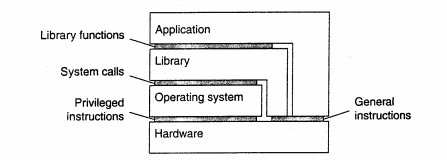

# Distributed sytem for fun and profit

分布式程序在处理分布式带来的两种后果：

* 信息传递
* 单点故障

preventing divergence 是强一致性(阻止分歧)、accepting divergence是弱一致性(接受分歧)

## 1 basic

资源有限导致我们必须选择分布式系统而不是实现一台完美的机器，使用高端的硬件会通过内存访问取代网络访问等手段使计算效率变高，但是随着节点数增加带来的交流增加，高端硬件比低端硬件带来的优势会很快被磨平

分布式系统要实现的目标：

* 扩展性scalability
* 性能(低延迟low latency、高吞吐high throughput、对计算资源的较低的占用率)，这三个条件可能是互斥的。延迟是用户"看到"其请求被响应的时间，由于物理限制，无论怎么优化总会存在延迟
* 可用性(availability )和错误容忍(根据会遇到的错误来设计系统使其容忍这个错误，不能容忍没考虑过的错误)与单个节点相比，多个节点可以形成一个更加稳定的系统，避免单机出现错误时宕机，可用性可以根据系统的在运行时间uptime和宕机时间downtime决定：Availability = uptime / (uptime + downtime)  

分布式系统的限制：节点数量、节点距离

分布式系统的SLA(service level agreement  )： Both performance and availability are defined by the external guarantees the system makes。SLA本质上就是系统性能的一种保证。

分布式系统的重要技术：

* partition ：划分多个节点实现并行。把数据集划分为更小的独立数据集
* replicate：在不同节点上复制或缓存数据实现(更快的访问速度、更好的错误忍受)，但是也产生了一致性问题(consistency)

# 分布式系统原理与泛型

## 1) 体系结构

## 2) 进程

### 2.1 进程、线程和轻量级进程区别

https://cloud.tencent.com/developer/article/1339562

进程的特点：在内核态切换、开销大

线程的特点：内核线程可理解为内核进程；用户线程可以看作是用户进程、属于一个用户进程并与其共享资源（Linux的线程本质上是与其他进程共享资源的一组进程），用户线程之间的切换可在用户空间进行，但是一旦某个线程执行了引起阻塞的系统调用，线程所属进程也会被阻塞。用户通过线程包来建立、销毁、操作线程。

轻量级进程(LWP)：内核级线程和用户级线程的混合。一个用户进程中可以有多个LWP，每个LWP彼此互斥不会出现并发问题。用户通过线程包创建线程时，每个LWP会执行线程包提供的调度线程的工具：调度例程找到一个被建立的线程并执行。当某个线程被阻塞后，执行这个线程的LWP会被阻塞，而OS会转而执行另一个LWP。这样即保证了线程的切换是在用户空间进行的，又使得线程执行阻塞调用时不会阻塞进程。

### 2.2 服务器

服务器的实现方式：

* 单线程服务器：只有一个工作线程，执行阻塞调用被阻塞后无法处理新请求
* 多线程服务器：分发者线程+多个工作者线程，工作者线程执行阻塞调用被阻塞后，分发者线程可调度其他线程执行，并行性高
* 有限状态机：前两者的结合，还是单个线程，但是它不会执行阻塞的方法（比如读取磁盘数据时执行非阻塞版本的read），可以处理新请求，记录请求的状态并且根据状态做出相应处理。这种方式本质上在模拟线程及其堆栈，比较复杂。

### 2.3 虚拟化

计算机系统层次如上图所示，由Library的库函数提供了应用程序编程接口供上层的Application调用，其他层同理。而虚拟化的意思就算模拟这些界面。

虚拟化的两种方式：

* 模拟一个runtime system提供一个指令集供app层使用，这些指令可被翻译执行，比如jvm中的字节码被翻译为机器指令
* 提供一个完全屏蔽硬件、吧硬件和软件隔离开的界面，提供一套指令集来操作硬件，比如VMware。在这一界面上可运行不同的操作系统

### 2.4 服务器设计需要考虑的问题

* 迭代（自己处理请求）还是并发（将请求交给其他进程、线程处理）
* 如何与客户建立联系？（端口固定or自由分配）
* 状态有关还是状态无关？（状态无关服务器不保存客户信息，也不将自身状态变化告知客户），还有软状态，即只在和客户的会话中保存状态，到一定时期就删除状态

服务器集群分层：交换机（接受发往服务器集群的请求）——应用/计算服务器——文件/数据库系统。这只是一种分法，第三层常放在高速磁盘上解决io瓶颈，也可和第二层合并。

分布式服务器：提供多个访问点使得对集群的访问是稳定的。

## 3) 通信

## 4) 命名系统

## 5) 同步

## 6)一致

## 7) 容错