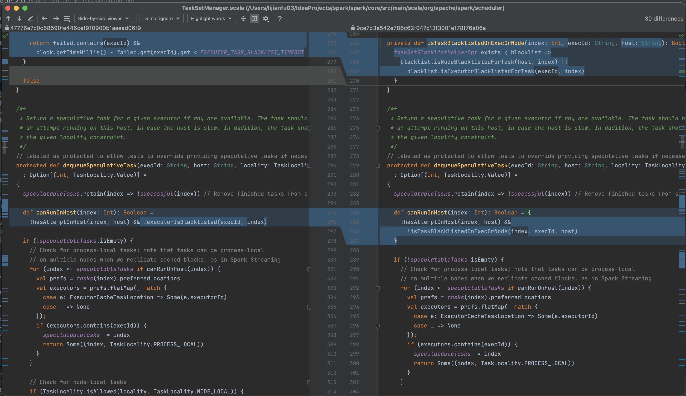
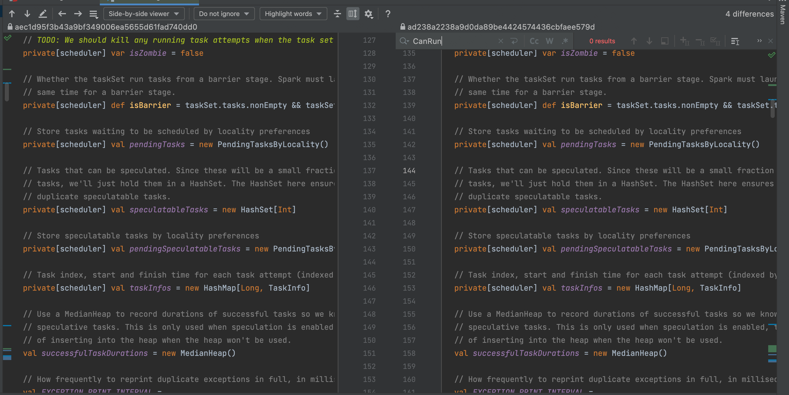
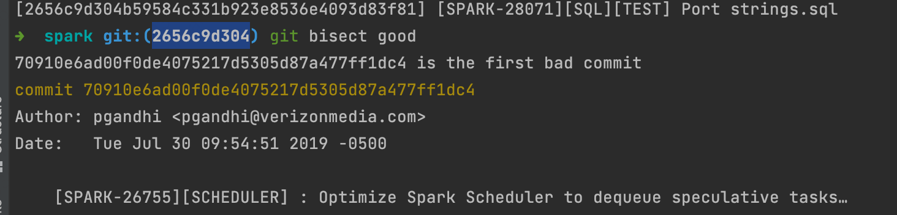
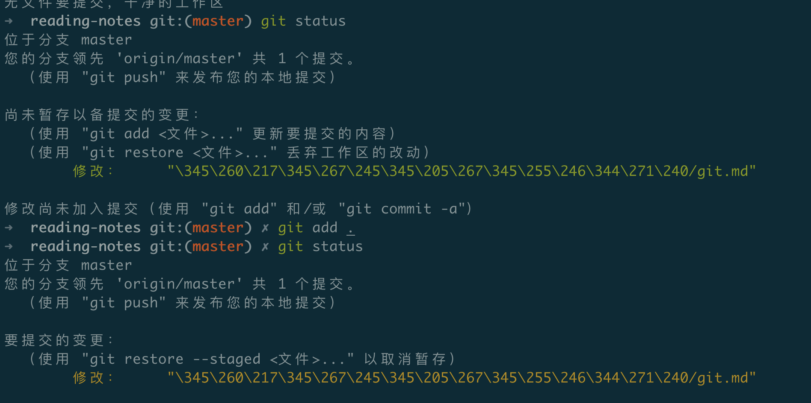

# git学习

case1：master文件有a.txt，里面内容为a b c；在master上创建rm_b和rm_c分支分别删除b和c，最后合并rm_b、rm_c看是否会产生冲突。

实现：clone一个空仓库，在里面创建a.txt文件然后commit，这样git branch才会看到master分支的信息，因为git的分支指向第一次commit，只有commit之后才会创建本地的master分支。然后陆续创建rm_b和rm_c分支并修改a.txt（**注意修改之后一定要commit**）

切换到rm_c分支然后开始合并rm_b,，报错，此时a.txt变成：


必须修改这个冲突，才能merge成功，而且你不修改也无法切换到其他分支

最后修改为a b的形式,**然后再commit一下（否则还会提醒你冲突未修改）**

最后commit后可以切回到master分支了，此时工作图为：


每次提交产生一个节点，这时候把最新的rm_c 合并到master中：

git checkout master

git merge rm_c
得到a.txt中变成a b

**git删除远程分支**：

git push origin --delete [分支名]

**git diff**:

在某个工作区做了一些修改，然后执行git diff，比较的是什么？

此时这个文件还没有git add，git diff比较的是工作区文件和上一次git add后文件的差异,把工作区add进去之后，再次git diff，发现就没有差异了。

git diff commitid1 commitid2：查到两个提交的diff

**git bisect**

http://www.ruanyifeng.com/blog/2018/12/git-bisect.html

Git bisect实战：

而spark2.2调度推测执行任务的代码为：

```scala
  protected def dequeueSpeculativeTask(execId: String, host: String, locality: TaskLocality.Value)
    : Option[(Int, TaskLocality.Value)] =
  {
    speculatableTasks.retain(index => !successful(index)) // Remove finished tasks from set

    def canRunOnHost(index: Int): Boolean = {
      !hasAttemptOnHost(index, host) &&
        !isTaskBlacklistedOnExecOrNode(index, execId, host)
    }

    if (!speculatableTasks.isEmpty) {
      // Check for process-local tasks; note that tasks can be process-local
      // on multiple nodes when we replicate cached blocks, as in Spark Streaming
      for (index <- speculatableTasks if canRunOnHost(index)) {
        val prefs = tasks(index).preferredLocations
        val executors = prefs.flatMap(_ match {
          case e: ExecutorCacheTaskLocation => Some(e.executorId)
          case _ => None
        });
        if (executors.contains(execId)) {
          speculatableTasks -= index
          return Some((index, TaskLocality.PROCESS_LOCAL))
        }
      }

      // Check for node-local tasks
      if (TaskLocality.isAllowed(locality, TaskLocality.NODE_LOCAL)) {
        for (index <- speculatableTasks if canRunOnHost(index)) {
          val locations = tasks(index).preferredLocations.map(_.host)
          if (locations.contains(host)) {
            speculatableTasks -= index
            return Some((index, TaskLocality.NODE_LOCAL))
          }
        }
      }

      // Check for no-preference tasks
      if (TaskLocality.isAllowed(locality, TaskLocality.NO_PREF)) {
        for (index <- speculatableTasks if canRunOnHost(index)) {
          val locations = tasks(index).preferredLocations
          if (locations.size == 0) {
            speculatableTasks -= index
            return Some((index, TaskLocality.PROCESS_LOCAL))
          }
        }
      }

      // Check for rack-local tasks
      if (TaskLocality.isAllowed(locality, TaskLocality.RACK_LOCAL)) {
        for (rack <- sched.getRackForHost(host)) {
          for (index <- speculatableTasks if canRunOnHost(index)) {
            val racks = tasks(index).preferredLocations.map(_.host).flatMap(sched.getRackForHost)
            if (racks.contains(rack)) {
              speculatableTasks -= index
              return Some((index, TaskLocality.RACK_LOCAL))
            }
          }
        }
      }

      // Check for non-local tasks
      if (TaskLocality.isAllowed(locality, TaskLocality.ANY)) {
        for (index <- speculatableTasks if canRunOnHost(index)) {
          speculatableTasks -= index
          return Some((index, TaskLocality.ANY))
        }
      }
    }
    None
  }
```

这部分代码是有bug的，因为推测执行不会申请新的executor，一般推测执行都是在现有的机器上分配，如果这个机器被标记为慢节点，那么不会在这个机器上再次分配task，导致调度任务卡住。

spark3上没有这部分代码。

现在检查是哪次提交把这部分代码移除了。

目前通过idea上的git anntations信息可以发现canRunOnHost目前的状态来自SPARK-17675 9ce7d3这个提交：



而spark3的ad238a这次提交上就已经没有canRunOnHost这个方法了：



因此9ce7d3和ad238a分别是起点和终点,注意gitbisect的目的是找出第一次bad，默认起点是good，终点是bad，那么这里就把有canrunonhost这个方法的提交设置为good。

执行 git bisect start ad238a 9ce7d3 

发现中点9341c951e8这个提交依然有canrunonhost方法，标记其为git bisect good；

在迭代的时候可能会看到还剩0步的提示，不用管这个，继续判定它是good还是false，直到：



这里709是第一个bad提交，也就是在这个提交中去掉了canrunonhost方法。

然后执行git bisect reset方法退出二分查找。

最后可以git checkout 7091这个commit中，发现这个commit把canrunonhost这个代码删除了。


git文件生命周期：

* 未跟踪——》git add——〉已跟踪未修改——》一些修改操作——〉已修改未提交——》commit——〉已提交，工作区干净
* 已修改——》gitadd——〉已修改未提交——》commit——〉已提交，工作区干净



在这个git.md文件上做修改后，提示尚未暂存；执行git add后，提示要提交

git add：可以用它开始跟踪新文件，或者把已跟踪的文件放到暂存区，还能用于合并时把有冲突的文件标记为已解决状态等。 将这个命令理解为“添加内容到下一次提交中”而不是“将一个文件添加到项目中”要更加合适。

**Git cherrypick:**

本地开发分支dev 目前head在d1，从d1切出一个feature分支，并产生一个提交f。开发完之后发现远程dev分支更新了有了新提交d2，该如何把本地的f安全合并到dev呢？

- 首先在dev分支上git pull保证和远程同步，得到d2
- 其次在dev分支上一条git cherry-pick [f的commitid]，把f摘取到dev上，dev分支获得一个新的提交

**git reset:**

对一个分支形成的各种提交c1->c2->c3，当前要把c2从这个分支上剔除出去，有两种办法：

* 第一种就是再c1上checkout一个新分支c3'，然后在c3'分支上cherrypick c3，这样c3'分支上是没有c2的
* 第二张使用git reset，当前这个分支的head在c3，可以使用git reset c1让head指向c1，此时c2、c3全部退回工作区变成未提交状态，直接在工作区自己手动删除c2代码，加上c3代码，然后重新提交即可保证没有c2对应的修改。git reset --hard c1，–hard参数指的是将HEAD指向c1，但c2，c3信息彻底丢失

**git merge**

可以被merge的两个分支必须有共同的base：

```
c1    <-    c2    <   -c3(master)
	<-d1            <-d2(dev)
	============git merge dev后=============
	c1<- d1    <-    c2 <-d2   <   -c3(master)
```

被merge的分支提交和原分支的提交按照时间顺序排列在被合并后的分支上

**Git rebase**

一个分支的base：从它被切出的原分支所在的commit，如git merge例子中，dev的base就是c1。

rebase操作就是改变一个分支的base，在dev分支下执行：

* 直接跟分支名 git rebase master:将dev的base设为master的最新提交c3，此时得到c1<c2 <-c3<-d1‘<-d2'，此时的d1‘d2'是不同于d1 d2的新提交
* 直接跟提交id :git rebase c2：吧c2作为新的base

git rebase -i ：交互式命令，可以在rebase过程中对被rebase的分支(dev)进行一些对commit的合并和删除操作，执行这个命令时会进入一个交互式脚本(i equals interactive)

* 在这个脚本里写drop d2，那么rebase后的结果就不会有d2这个commit
* 合并d1,d2：在这个脚本里写squash d2，那么d2的内容会被合并到它的前一个提交d1，然后可以重新编辑d1的log。

在实际开发中，我经常会面对这么一种情景：基于dev分支创建一个需求分支，搞定后，提交pr，同事review pr时会陆陆续续指出一些问题，针对同事的问题后续又在这个分支上提交若干个pr，终于被认可；是时候合并到dev分支了，但是在此过程中，dev分支发生了一些改变（新增了若干个commit），导致merge冲突，有些冲突无法手动merge（譬如Xcode的工程文件.pbxconfig，该文件记录了大量信息，根本无法手动merged）。

针对这种问题，比较常见的做法是，更新本地dev分支，然后将需求分支rebase到最新的dev分支上，此处的rebase过程往往会需要处理一些冲突。

rebase原理：上面把dev rebase到c3上时，大概发生的事：

* 在c3上建一个临时的d1',d2'
* 把d1放到d1'的位置上检查是否有冲突，有冲突的话反馈给用户，用户可以选择abort【放弃该rebase】；也可以选择skip【跳过d1】则意味着忽略掉冲突的内容，没有冲突的内容仍然保留在暂存区，但不会创建commit，接着处理下一个commit，直到结束；如果用户在过程中选择continue，则意味着用户不愿放弃冲突的commit用户得自己手动将，conflict给干掉。
* 对d2也是如上处理

git命令思维导图

https://www.processon.com/view/link/5c6e2755e4b03334b523ffc3#map
