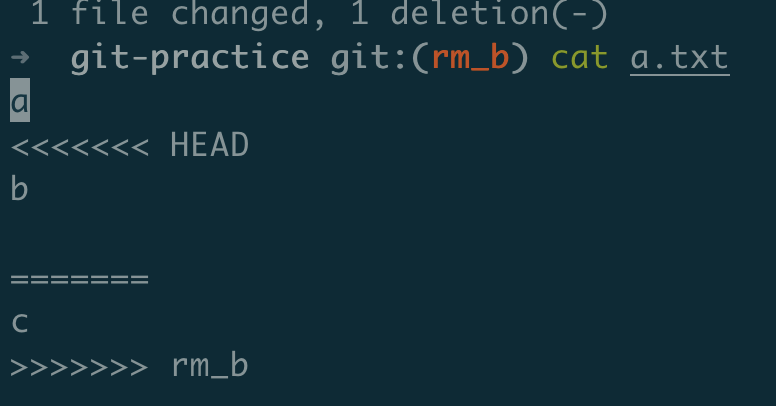
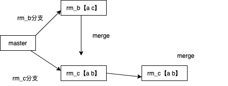

# git学习

case1：master文件有a.txt，里面内容为a b c；在master上创建rm_b和rm_c分支分别删除b和c，最后合并rm_b、rm_c看是否会产生冲突。

实现：clone一个空仓库，在里面创建a.txt文件然后commit，这样git branch才会看到master分支的信息，因为git的分支指向第一次commit，只有commit之后才会创建本地的master分支。然后陆续创建rm_b和rm_c分支并修改a.txt（**注意修改之后一定要commit**）

切换到rm_c分支然后开始合并rm_b,，报错，此时a.txt变成：

必须修改这个冲突，才能merge成功，而且你不修改也无法切换到其他分支

最后修改为a b的形式,**然后再commit一下（否则还会提醒你冲突未修改）**

最后commit后可以切回到master分支了，此时工作图为：

每次提交产生一个节点，这时候把最新的rm_c 合并到master中：

git checkout master

git merge rm_c
得到a.txt中变成a b

**git删除远程分支**：

git push origin --delete [分支名]

**git diff**:

在某个工作区做了一些修改，然后执行git diff，比较的是什么？

此时这个文件还没有git add，git diff比较的是工作区文件和上一次git add后文件的差异,把工作区add进去之后，再次git diff，发现就没有差异了。

git diff commitid1 commitid2：查到两个提交的diff

**git bisect**

http://www.ruanyifeng.com/blog/2018/12/git-bisect.html
