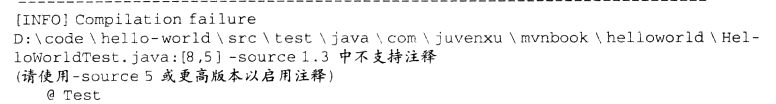
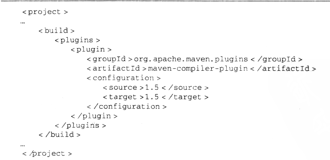
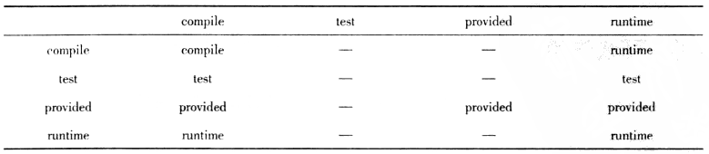
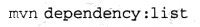
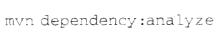
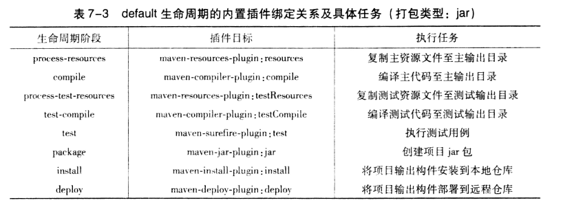

# 代码管理工具

## Ant

学习ant的原因：6.830

网上博客之安装ant

https://blog.csdn.net/AAzpf/article/details/79912367

运行ant：将项目中的build.xml添加到右边的ant build中

## Maven

**来自Maven实战**

### chapter 3-4

坐标的定义、pom.xml个数、maven对src和测试代码的结构约定、什么样的代码最终会被打包到jar包中(src而不是test)、在pom.xml中添加依赖(的例子以junit为例)、依赖范围scope：(在junit中把scope设置为test，那么只有测试代码中会import这个包，主代码中import junit产生错误，这个包只会被加入到测试代码的classpath中)

进行单元测试的步骤：导入junit.test，编写测试代码，使用junit中的assert，加上@test注解

maven执行单测:mvn clean test 这期间会把生命周期从clean到编译再到测试都走一遍。

maven的一个坑——不同插件默认支持的jdk版本不同：

出现这种类型的错误：

这表明在生命周期中的编译一个测试类时失败，原因在于complier不支持注解@Test。这里source1.3表明编译器插件支持到1.3，但是不支持1.5，所以需要在pom.xml中更改编译器插件的支持级别到jdk5，通过configration标签实现：

打包:将src打包为一个Jar包，输出到target中

Install：如何让其他项目引用这个jar包？mvn install将这个Jar包安装到本地仓库中

maven流程：编译、测试、打包、运行

迅速构建项目骨架。

### chapter 5 坐标和依赖

maven坐标：项目坐标和依赖坐标

maven坐标四大标签中的packaging：打包方式默认为jar(最后打为jar包)和war(最后打为war包)，打包方式会影响生命周期，不同的打包方式会使用不同的命令。

解读一个pom.xml

依赖范围与3种classpath的关系：

* 编译主代码时使用编译classpath
* 编译和运行测试代码时使用测试classpath
* 运行时使用运行classpath

通过更改一个依赖的scope，把这个依赖会被导入到不同的classpath组合中

依赖传递：直接依赖、第一直接依赖、第二直接依赖、间接依赖

当第一直接依赖和第二直接依赖的范围不同时，(纵轴为第一直接依赖，横轴为第二直接依赖)间接依赖的范围：

依赖调解：有时两个间接依赖出现冲突，如何解决？

* 路径最近者优先
* 路径相同时在pom中先被声明的优先

可选依赖：optional标签，目的是阻断依赖传递。假如项目B使用依赖X实现了一个功能，项目B使用依赖Y实现了令一个功能，但是使用B的项目中只能使用这两个功能中的一个，那么在B的pom.xml中可以把X和Y定义为可选的，这样引用B的项目就不会间接地依赖X和Y，它需要在自己的pom.xml中选择依赖X或Y。

依赖排除:A依赖B，B依赖C，但是A不想传入B中的C，且C也没用被定义为可选的，这个时候可以使用exception标签排除B中所依赖的C

归类依赖：一个项目可能引入许多来自同一项目的不同模块，而且版本都是一样的，比如都是2.5.6版本的springframework.bean、springframework.context，可以在pom.xml的统一指定springframework的版本为2.5.6，具体的依赖引用这个版本即可。

依赖分析工具：maven通过工作使每个依赖都有唯一确定的一个版本有效，这些依赖是已解析依赖。

* 查看已解析依赖的命令：

* 依赖是分层的，顶层的是直接声明的依赖，可以查看这些依赖的层次关系：

* 对项目依赖的分析：

  可以看到已经使用但未声明的依赖的已经声明但未使用的依赖，最好使前者为空集

### chapter 7 插件与生命周期

项目的生命周期：

maven的生命周期类似一个代码模版，里面定义了生命周期不同阶段该做什么事；每个阶段的具体实现交给插件来完成，如maven-complier-plugin就是编译时使用的插件。

maven有三大独立的生命周期，按时间顺序是clean、deploy、site。分别对应命令mvn clean、mvn deploy和mvn site。执行mvn 阶段A不会触发阶段B(A!=B)，也可以执行两个阶段，比如mvn clean deploy会执行clean和deploy两个阶段。

**插件目标**：一个插件会集成多个功能，每个功能就是一个插件目标

**插件绑定**：将生命周期的某个阶段和插件目标绑定，如default生命周期的compile阶段和maven-complier-plugin的compile插件目标相绑定，就能通过这个插件的功能实现这个目标。

maven自己提供了一些内置绑定：

有些因素会影响到生命周期中每个阶段的功能，比如打包类型，打包为jar或打包为war，会影响具体的构建过程，影响每个生命周期具体与哪个插件的哪个目标绑定，上面给出的就是打包为jar的情况下绑定关系。

也可以自定义这种绑定关系：具体操作方式见代码清单713

自定义绑定时：多个插件目标被绑定到同一个阶段，这些插件目标的生命顺序就是在这个阶段内这些目标的执行顺序

**配置插件**，设置插件的一些参数调整功能

* 一次性配置：在执行命令行时加一些参数，这些参数会影响插件的功能，方式为-Dkey = value，如

  

  表示在Install时跳过测试执行测试

* 长期性配置：在Pom.xml中配置插件，例子为修改compile插件级别、自定义生命周期绑定

**调用插件**：命令行可以调用生命周期，也可以直接调用插件目标，因为有些插件目标不适合绑定在生命周期上。比如展示依赖树这一与生命周期无关的操作就可通过调用插件完成：

这里的dependency不是生命周期，而是插件maven-dependency-plugin的前缀，要注意区分这种情况，mvn后面不总是生命周期。

**解析插件**：

插件到哪找？maven仓库里。

maven对解析插件提供了一些简化：如maven官方提供的插件在pom.xml里可以不用指明groupid、用户没有提供插件版本时maven会到库里解析插件版本等。

