# 操作系统导论

## 1 CPU虚拟化

执行陷入指令时操作系统、硬件、程序互相配合。

内核栈：位于进程内存空间的内核区，作用是在执行陷入指令后，**硬件**把寄存器保存在内核栈上；**硬件**从陷阱返回时，从内核栈恢复寄存器。先执行寄存器的保存(恢复)操作，后进入内核(用户)模式。

陷阱表：内核在启动时(boot time)会设置陷阱表，同时操作系统会高速硬件陷阱表的位置，这样硬件会知道在各种事件发生时应该执行或跳转到什么代码；

系统调用号：每个系统调用都有一个明确的系统调用号。用户代码负责将其保存到寄存器或栈等位置，操作系统在执行陷入程序时检查系统调用号是否有效。

操作系统获取CPU控制权的方式：

* 被动等待进程让出控制权：进程执行系统调用或出现异常
* 时钟中断：处理中断程序时获得控制权

时钟中断引起的进程切换：

* 发生时钟中断
* 硬件隐式将进程A的寄存器保存到其内核栈上
* 处理时钟中断陷入程序，进入内核态
* 调用switch例程执行进程切换：OS显式保存当前寄存器的值到进程A的context；从进程B的context恢复寄存器的值
* 硬件隐式从内核栈(此时内核栈已经是进程B的内核栈了)恢复进程B的寄存器
* 进入用户态，开始执行B

这里会发生两次保存寄存器、恢复寄存器的操作，一次是硬件隐式操作的，一次是操作系统显式操作的。

switch例程图示：

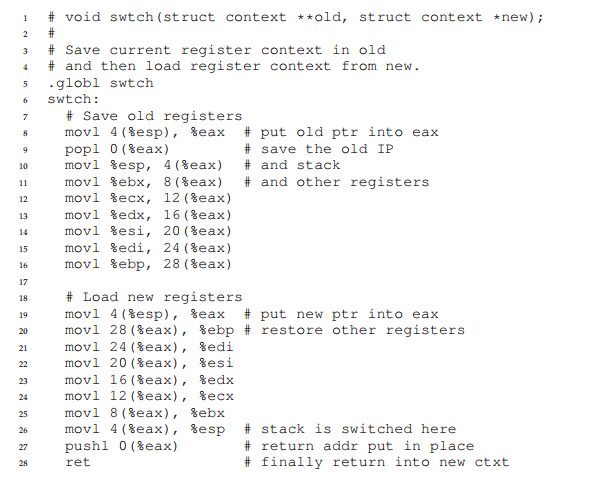

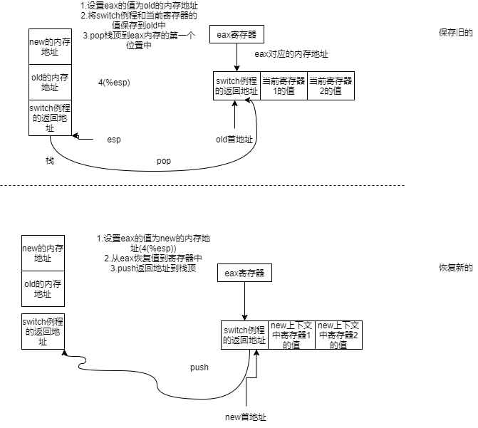


进程调度：

* 先来先服务

* 优化周转时间导向：最短作业优先（抢占+非抢占），对响应时间不利

* 优化响应时间导向：时间片轮转，对周转时间不利

* 确保各进程都能获得一定比例CPU时间导向：采用随机方法，让进程的执行时间占比等于其所占资源占比

* 多级反馈队列

  

多CPU进程调度：

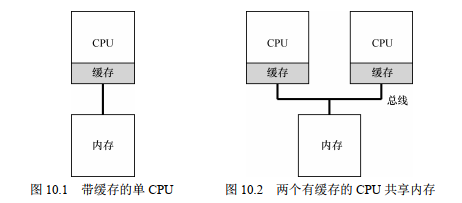

多CPU涉及到的问题：

* 缓存一致性：缓存会通过**总线窥探**的方式监听连接缓存和内存的总线，一旦发现它所缓存的内存数据更新，会1.作废当前缓存，让程序直接去访问内存2.立刻修改为新值
* 操作共享数据时加锁
* 缓存亲和度：为了利用缓存加快速度，尽量使进程在获取cpu后运行在它上次所运行的cpu上

## 2 内存虚拟化

虚拟地址：用户能看到的地址（包括打印在控制台上的）都是虚拟地址。

虚拟地址-->物理地址：

进程中使用的地址都是虚拟地址（寄存器中保存的也是虚拟地址）。操作系统将进程加载到物理内存中时会设置基址寄存器的值为进程所分配物理内存的首地址base和界限寄存器的值。此后执行程序段中每一条操作地址vir_mem的指令时，硬件会到base+vir_mem这个物理地址取到实际数据，并且检查所访问物理地址是否超过界限寄存器所规定的范围。

在进程切换时，两个寄存器的值会保存到旧进程结构中，操作系统会将寄存器设置为保存在新进程中的值。

地址转换由**硬件**完成，操作系统只需正确地设置好基址寄存器和界限寄存器即可，但是一旦程序访问了非法地址，那么此时会出现加载越界的异常，操作系统会介入执行处理这个异常的程序，停止进程的运行。

**将虚拟空间灵活映射到物理空间的设计：**

一、分段：

不必把虚拟内存完整映射到物理内存中，而是分成若干段(代码段、堆、栈)，将其灵活映射到物理内存的不同位置。

此时可以为每个段设置多个段寄存器，比如段基址寄存器保存这个段的基址。

为了判断某个虚拟地址属于哪个段，可以把地址前几位设为段标识(00表代码段、01表示堆)、后面作为这个地址在这个段中的偏移量，如下图就是14位地址时对地址的划分：

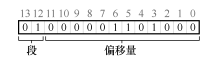

每个段最大占有2^12位的空间，如0-2^12-1表示代码段的空间，确定好段首所在物理地址后加上偏移量即可确定具体虚拟地址对应的物理地址。

段寄存器除基址和变址外还可以包括保存反向增长标志位的寄存器(栈的地址空间反向增长的，偏移量是负的，用基址加上负的偏移量得到实际地址)、保存保护位的寄存器(用于标记共享段的读写执行权限)

二、空闲内存块的管理：

* 使用链表组织空闲块
* 底层设计：在某个空闲块上加入header字段保存必要信息，用于分割、合并等
* 分配策略

三、分页

把虚拟内存分为页，使用页表实现虚拟页号到物理页号的转换：

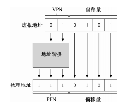

页表保存在进程所在的内存空间中，可以使用页表基址寄存器保存页表位置，使用PTE大小和VPN获取这个VPN对应的PTE(假设只有一级页表)。每一个虚拟页号VPN对应一个页表项PTE，PTE保存这个页是否在磁盘上，访问权限，物理页号PFN等信息：

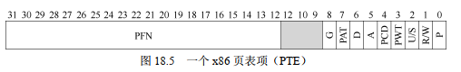

对分页的加速：地址转换旁路缓冲存储器  (TLB)

它是一个硬件，访问速度比内存快，保存映射(VPN,PTE)，获取VPN时先检查TLB中是否有对应的缓存。

TLB未命中时，硬件抛出异常，进入内核态，跳转到trap handler，此时**操作系统**会处理这个异常，更新TLB。

上下文切换时的TLB：

* 清空TLB（把TLB的有效位置为0表示当前TLB的缓存无效）：增大了开销和未命中率。
* 在TLB中加入进程标识字段，使TLB可以缓存不同进程的PTE，不同进程的同一个VPN都可以缓存在TLB上。

**超越物理内存的限制：**

交换空间：位于磁盘上、和物理内存交换页面的空间。当缺失某个页时，会从交换空间上将需要的页换到物理内存中。物理内存紧张时，将一些页换到交换空间中。物理内存并非是快满了才决定换出某些页，而是有高水位线和低水位线，可用空闲内存占用低于低水位线就会换出页面知道达到高水位线。

页错误：访问不在物理内存中的页。在PTE中设置存在位标识该页是否位于物理内存。

操作系统如何知道该从磁盘上的哪个位置把需要的页换入？

利用PTE。在PTE中设置几位来保存该页的磁盘地址，当这个页在磁盘中，这些位保存的就是磁盘地址；当这个页别换入物理内存中，这几位保存的就是内存页号PFN，如上图的13-31位。出现页错误后，操作系统会检索页表根据VPN找到PTE，读出磁盘位置，然后把这个页的磁盘位置发给磁盘，从磁盘读取这个页到内存。这个页被换入到内存后，PTE中这些位会被修改内存页号；换出到磁盘时，这些位会被修改为磁盘地址。

TLB是内存的缓存，第一次TLB不命中后，处理程序从PTE中获取物理页号PFN，将映射关系置入TLB，处理程序结束时控制权会回到刚刚引发TLB不命中的指令重新获取页面，此时TLB会命中；

内存是磁盘的缓存，一旦出现页错误，处理程序从PTE中读取磁盘位置，将其换入内存中。

## 3 并发

进程切换 vs 线程切换：

前者在切换时将进程的信息保存到进程控制块PCB，后者将线程的信息保存到线程控制块TCB。各个线程共享进程的地址空间，所以在切换时无需改变页表。每个线程有自己独立的程序计数器和栈，多线程情境下一个进程的地址空间可以有多个线程栈：

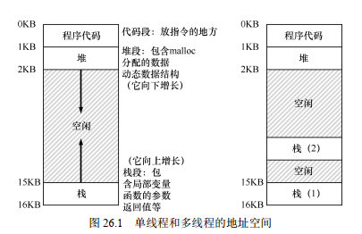

### 3.1 基于线程的并发

### 3.2 基于事件的并发

除了线程，可以使用事件来实现并发，构造一个并发服务器。

```
//思路：通过无限循环获取事件并处理
while (1) {
    events = getEvents();
    for (e in events)
    	processEvent(e);
}
```

select&poll：检查IO描述符是否准备好被读写了，返回时， select()用给定请求操作准备好的描述符组成的子集替换给定的描述符集合。 select()返回所有集合中就绪描述符的总数。  

**基于事件的并发不允许发出阻塞系统调用：**

基于线程的并发可以发出阻塞的系统调用，一个线程被阻塞时可以将引发阻塞的线程挂起选择执行另一个线程（按照分布式系统那本书上的说法线程引起的IO阻塞是会阻塞整个进程的，这里指的可能是轻量级进程）；然后基于事件的并发会导致循环体内等待IO事件结束，浪费时间。

基于事件的并发可以使用异步IO(aio)：这些接口使应用程序能够发出 I/O 请求，并在 I/O 完成之前立即将控制权返回给调用者，另外的接口让应用程序能够确定各种 I/O 是否已完成。例子为macos上的aio_read ，它的参数是一个aio控制块。把要读取的文件等信息封装到aio控制块中，然后调用aio_read完成读取。 

如何知道异步IO什么时候完成呢？

* 可以使用aio_error系统调用，当IO事件完成时，它会返回0。程序定期调用aio_error检查IO是否完成
* 上面的方法太耗费，也可以让IO事件完成后发一个信号


## 4 持久性

### 4.1 IO设备

系统架构图：

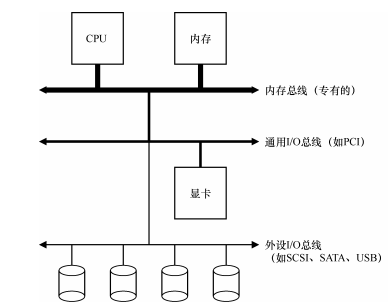

分层设计：高性能的通用IO总线造价更高、更短，连接的是显卡等高性能IO设备；外设总线连接价格低、更长，连接低性能的IO设备(键盘等)

一个硬件标准设备的组成：接口（暴露给系统中其他硬件供其调用，包括各种寄存器）+内部结构（对接口的实现）

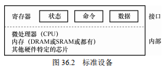

**OS和设备的交互协议**：OS通过操作设备接口中的寄存器实现与设备的交互

* 读取设备的状态寄存器，得知设备现在是否就绪
* 向设备的数据寄存器发送数据，把数据传递给设备
* 向设备的命令寄存器存入指令，设备执行这个指令

有几点值得注意的地方：

* 操作系统如何知道设备什么时候准备好呢？(轮询VS中断，两者各有适用场景)
* 数据传输的两种模式：PIO(传输数据时需要CPU参与，在传输期间CPU不能干别的事)VSDMA（直接内存传递)。DMA是一个引擎，操作系统只需高速DMA数据在内存的位置和要传输的磁盘后，由DMA完成数据传输，CPU可以做别的事
* 操作系统如何与设备通信？操作系统发出特权指令VS内存映射IO(硬件把它的寄存器当作内存地址来提供)

设备的接口是固定的，但是我们希望它可以接入不同的操作系统，由此产生了设备驱动程序作为操作系统源码的一部分，对于一个设备，linux和windows上有不同的驱动程序用于操作这个设备。设备驱动程序是设备和系统间的封装

### 4.2 文件系统

文件：与一个inode号关联

目录：也有一个inode号，保存它子文件(目录)名字和inode号的映射

文件描述符：进程私有，进程可以通过这个描述符对文件进行读写

**小工具**：strace [unix命令] 可以查看这个命令所执行的系统调用

* 文件读写

  对于进程打开的每一个文件，OS都会为其维护一个“当前偏移量"，决定在文件中读取或写入时，下一次读取或写入开始的位置。当文件被读取了N个字节时，当前偏移量也前进了N个字节。可以使用lseek函数重新设置文件的当前偏移量。  

  在进程的结构体proc中有一个指向**该进程**所有打开文件数组的指针ofile，open操作返回了一个新的文件描述符fd，通过ofile[fd]可以找到这个文件的file信息(文件描述符相当于是指向file类型文件的索引)：

  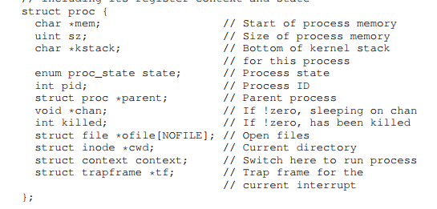

  其中file的结构如下：

  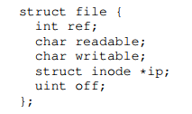

  这里面的off就是当前偏移量，ref是引用计数，readable和writeable为是否可读写。

  操作系统内核维护一个打开文件表(opened file table)，结构如下：

  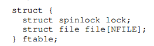

  数组file中保存的是系统中各进程打开的所有文件，一个进程打开两次同一个文件，这两个新的文件会成为file中两个不同的元素，也会有不同的文件描述符。

  下图是打开单个文件时当前偏移量的变化，每次读100个字节后都会加上100

  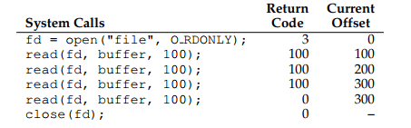

  打开两次文件，这两个文件分别成为打开文件表OFT中的第10项和第11项，它们的当前偏移量互不影响。

  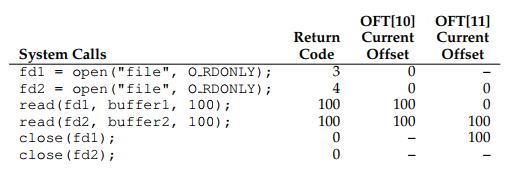

  lseek可以重置偏移量：

  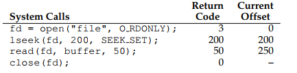

* 共享文件

  一个进程p和它打开的一个文件file和OFT中的表项一般是一一映射关系，(p,file)<->(OFT[x])，x为OFT中的索引号，就算进程p2也Open了这个file：(p2,file)，它在OFT中依然对应一个新的表项OFT[y] (x!=y)。

  两种情况可以让OFT中一项对应两个不同的(进程、文件)对：

  * fork子进程，子进程全面继承父进程的文件描述表，(parent，fd)和(son，fd)对应的是OFT中同一项，如下图所示,打开文件表的引用计数refcnt此时是2，表明其对应两个(p,file)映射：

    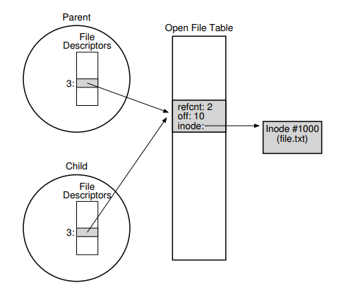

    子进程对文件的当前偏移量的修改操作对父进程可见。

  * dup：对一个文件file的fd，dup(fd)返回一个新的文件描述符fd1，此时(p,fd)和(p,fd1)对应OFT中同一项

* 一些文件操作API及其原理：

  * fsync：强制写入，write只是保证在未来的某个时期会写

  * 命令行命令之文件改名：mv（使用rename系统调用，创建一个临时文件copy原文件并将临时文件命名为旧名字、删除原文件)

  * 查看文件元数据stat

    

* 目录

  DIR *dp = opendir(".");  //打开当前目录，返回一个目录指针

  struct dirent *  d = readdir(dp);  //对目录指针的一次readdir操作返回一个目录条目类型dirent，readdir相当于一个迭代器

  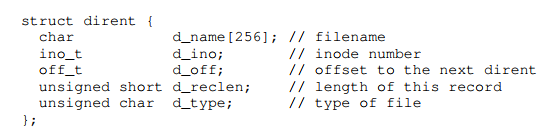

* 链接
  * 硬链接： link oldFileName newFileName ，此时两个文件名是对同一个文件的引用，指向相同的Inode。在inode中保存链接计数(link cnt，**注意和OFT中的refcnt区分**)。删除文件本质上是unlink操作，link cnt减1，当link cnt减到0时这个文件的inode和相关数据块会真正被释放。
  * 符号链接 有-s标志：ln -s file file2  ，符号链接是一种区别于文件、目录的独特的数据类型(硬链接的类型就是它所链接的类型)，通过符号链接也可以访问到文件，本质上是将链接指向文件的路径名作为链接文件的数据 而不是指向文件本身，删除一个文件后，符号链接成为悬空引用

* 文件访问许可

  操作系统提供多种机制保证处于竞争中的进程以安全的方式共享物理资源，文件系统也提供了使不同用户和进程安全地共享物理资源的方式：

  * 许可位：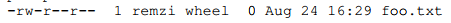

    文件的owner可以通过chmod修改文件权限

  * 分布式文件系统AFS提供更加精细的Access Control List来记录哪些用户对哪些文件有权限

* 挂载

  以现有目录作为目标挂载点（mount point），本质上是将新的文件系统粘贴到目录树的这个点上 ，mount程序：观察当前系统挂载哪些内容

### 4.3 实现文件系统

**文件在磁盘上的组织：以VSFS为例。**

假设一个磁盘块大小为4kb，共有64个磁盘块，那么文件在磁盘上的组织模型为：

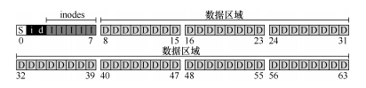

* 磁盘块8-63保存的就是用户数据

* 如何知道一个文件的数据保存在哪些磁盘块上呢？使用结构inode。它保存一个文件的所有元数据，内部包含15个磁盘指针指向保存这个文件数据的磁盘块，一个指针大小4字节，一个inode块大小这里设为256字节，那么以磁盘块保存16个inode，上图共有80个inode，可以保存80个文件的元数据

  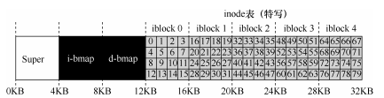

* 如何记录哪些磁盘块和inode条目是空闲的呢？一种方式是维护一个空闲列表，更高效的方式是位图，空闲记为0，已分配记为1，一个字节的位图可以判断8个块是否空闲，上面磁盘块1和2保存的都是位图，分别指示哪些inode记录/哪些磁盘块(d)是空闲的，上图一个磁盘块的位图可以指示4kb \* 8 = 32kb个对象是否分配

* 超级块S，记录文件系统类型，inode表开始位置、inode个数、数据库个数

多级索引：如果一个文件存放的磁盘块数超过inode的磁盘指针数会怎么办？使用间接指针。在数据块中找到一个磁盘块作为间接块，里面都是直接的磁盘指针(上图的设定中间接块有4kb/4 = 1024个磁盘指针)，然后从15个磁盘指针中选出一个指针作为间接指针，指向间接块，选出12个指针作为直接指针，这样这13个指针此时可以表示的最大文件大小为(12 + 1024) * 4kb。还可以让一个指针作为双重间接指针，指向双重间接块(里面是指向间接块的磁盘指针)，这14个指针的最大文件大小为(12 + 1024 + 1024^2) \* 4kb，还可以有1个3重间接指针。

为什么要设置12个直接指针，3个间接指针？因为测试表明小文件很多，2Kb是常见大小，多个直接指针可以直接访问到文件，增加效率。

目录：目录有自己的inode号，它的数据存放在保存数据的磁盘块中，目录的数据是什么样的？

是一个保存目录中元素及其inode号，文件名称等信息的列表，下图inum为inode号,strlen是Name的长度，reclen是名字的长度加上一些预留空间。删除目录中的一些文件，比如删除foo，会让下面的列表中间出现空白，后面在目录中新创建的文件会把复用这个空白。在reclen中留出一些预留空间的目的就是使即使新记录名字大于原来名字时也能插入到旧的空白里

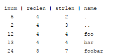

**文件系统读取和写入磁盘数据**

为让系统可以读取磁盘数据，要将磁盘挂载到系统上，磁盘的超级块会在保存在内存中

1. open("/foo/bar", O_RDONLY)调用  发生了什么事？

   文件系统递归解析路径名，根目录的inode号是众所周知的(大多数情况下为2)，在根目录的记录中找到foo的inode号——>找到foo的目录数据——>找到bar的inode号，最后把bar的inode号交到内存，进行权限检查，然后就可以为这个inode号对应的文件分配文件描述符了。这也解释了目录里为什么要设置.和..的条目，目的是应对相对路径。

为了解析这个路径，文件系统读取了5次磁盘，路径越长，磁盘IO就越多

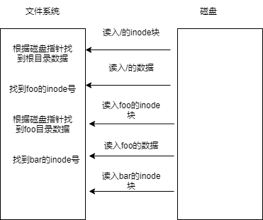


2. read系统调用发生了什么事？

   文件系统对磁盘发生了读写，先读取bar的inode块(第一次读)，找到磁盘指针；再根据磁盘指针读入文件数据(第二次读)；最后更新磁盘中bar的inode的最后访问时间字段(对磁盘的写)

3. write系统调用发生了什么事？

   IO次数更多，特别是新创建bar文件再写入数据。书上这个图从上往下时间是增加的：

   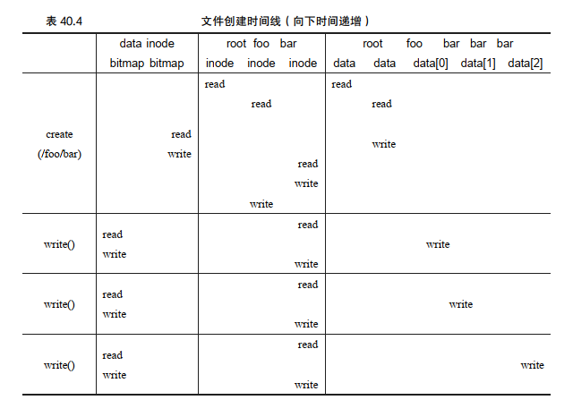

   创建阶段：首先是四次读取磁盘找到foo的数据，然后再读取inode的位图，查找哪些空闲位置可以分配给bar，最后在foo的数据中写入(新inode号，bar）这个映射，将其更新到磁盘上(一次write操作)；再更新位图，最后依此更新bar的inode和foo的inode号

   write阶段：这里涉及到新磁盘块的分配，所以还有对data位图的读取和更新。

**缓存(cache)和缓冲(buffer)**

许多现代操作系统将虚拟内存页面和文件系统页面集成到统一页面缓存中（ unified page cache），灵活决定是将虚拟内存划入缓存还是把某个文件换入缓存。

写缓冲：延迟写入，把几次对磁盘的IO操作合并到一次；懒惰写入、避免最终不会更新到磁盘上的写入(写入到a.txt然后又删除a.txt，这种情况下不会把对a.txt的写入更新到磁盘上)  


