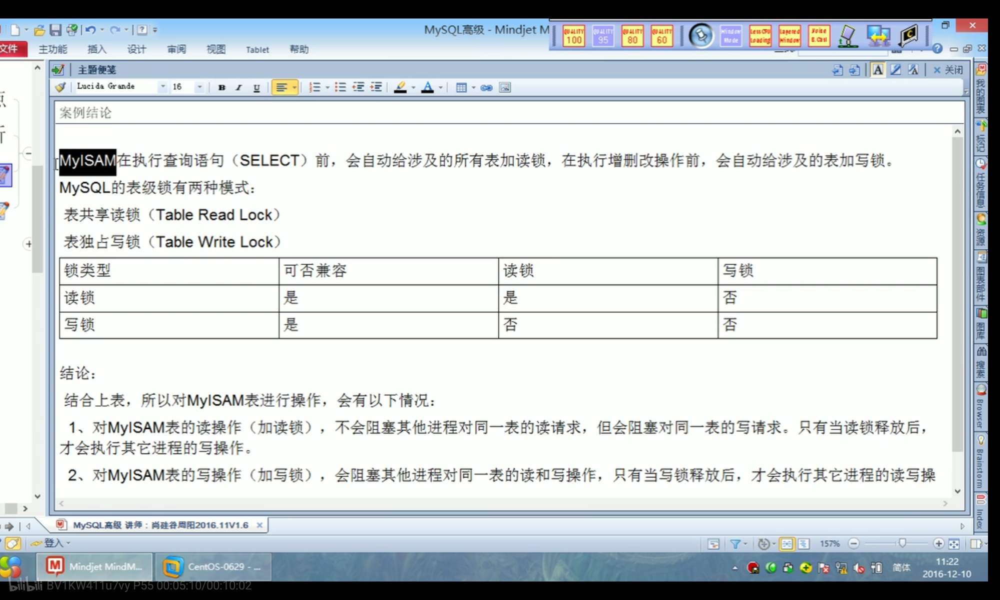
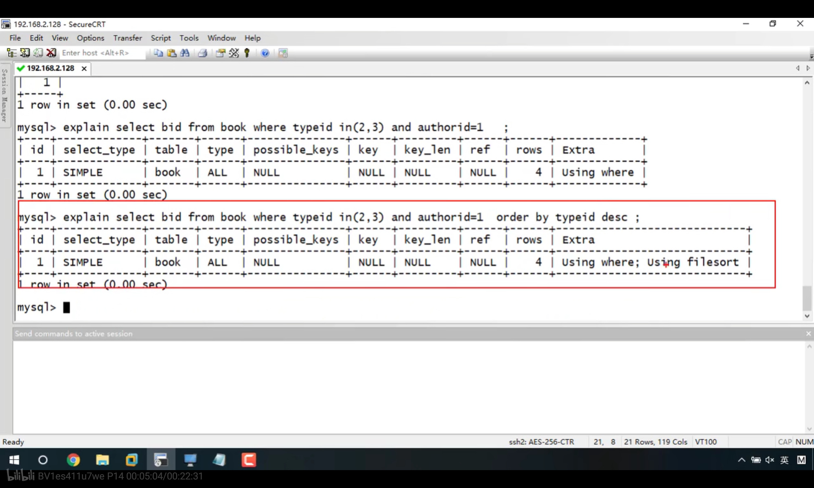
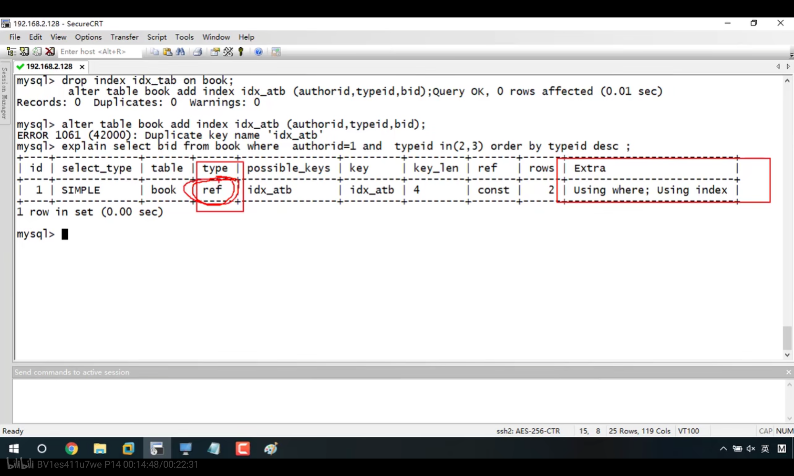

# 数据库

## 关系型数据库与非关系型数据库

**关系型数据库最典型的数据结构是表，由二维表及其之间的联系所组成的一个数据组织（基于ACID模型）。**

SQL数据库提供关系型的表来存储数据。

**优点：**
1、支持复杂查询（join查询）

2、支持事务(Innodb)

**缺点：**
1、读写性能比较差，尤其是海量数据的高效率读写；
2、固定的表结构，灵活度稍欠；
3、高并发读写需求，传统关系型数据库来说，硬盘I/O是一个很大的瓶颈。

**非关系型数据库严格上不是一种数据库，应该是一种数据结构化存储方法的集合，可以是文档或者键值对等。**

NoSQL数据库采用类JOSN的键值对来存储文档

**优点：**
1、格式灵活：存储数据的格式可以是key,value形式、文档形式、图片形式等等，文档形式、图片形式等等，使用灵活，应用场景广泛，而关系型数据库则只支持基础类型。
2、速度快：nosql可以使用硬盘或者随机存储器作为载体，可以把数据放在内存中。而关系型数据库只能使用硬盘；
3、高扩展性；
4、成本低：nosql数据库部署简单，基本都是开源软件。

**缺点：**
1、不提供sql支持，学习和使用成本较高；
2、无事务处理；(redis要求对数据库的更新操作是原子性的，通过lua脚本)
3、数据结构相对复杂，复杂查询方面稍欠。

# mysql

## 1)事务

### 1.事务特点

事务的定义：事务指的是满足 ACID 特性的一组操作，可以通过 Commit 提交一个事务，也可以使用 Rollback 进行回滚。  

**事务特点**

特点（ACID）
A 原子性：一个事务是不可再分割的整体，要么都执行要么都不执行
C 一致性：一个事务可以使数据从一个一致状态切换到另外一个一致的状态
I 隔离性：一个事务不受其他事务的干扰，多个事务互相隔离的
D 持久性：一个事务一旦提交了，则永久的持久化到本地

### 2.Mysql中使用事务

Mysql使用的Innodb引擎支持事务。

**隐式事务和显式事务：**

隐式（自动）事务：没有明显的开启和结束，本身就是一条事务可以自动提交，比如insert、update、delete
显式事务：具有明显的开启和结束

mysql中使用显式事务：

mysql必须禁用自动提交功能，因为Mysql一条语句就是一个事务，默认提交功能是自动开启的。

* 事务开启：

  set autocommit=0;（关闭自动提交功能）
  start transaction;#可以省略

* savepoint 回滚点名;

* 结束事务（提交或者回滚是结束事务的标记）

  提交：commit;
  回滚：rollback;
  回滚到指定的地方：rollback to 回滚点名;


### 3.并发事务

**事务的并发问题是如何发生的？**
多个事务 同时 操作 同一个数据库的相同数据时

并发问题有哪些？

脏读：一个事务读取了其他事务还没有提交的数据，读到的是其他事务“更新”的数据
不可重复读：一个事务多次读取，结果不一样（T1读取一个字段，T2更新该字段，T1再度时值就不同了）
幻读：一个事务读取了其他事务还没有提交的数据，只是读到的是 其他事务“插入”的数据（T1读取某个范围(select)的数据，T2在这个范围插入了一些新数据，T1再读(select)时发现多了几行）

通过设置隔离级别可以解决并发问题

### 4.事务的隔离级别

					        脏读  不可重复读   幻读
read uncommitted:读未提交     ×                ×              ×        
read committed：读已提交       √                ×              ×
repeatable read：可重复读       √                √              ×
serializable：串行化                    √                √              √

read uncommitted：事务中的修改，即使没有提交，对其它事务也是可见的  

read committed  ：一个事务只能读取已经提交的事务所做的修改。换句话说，一个事务所做的修改在提交之前对其它事务是不可见的。  

repeatable read：保证在**同一个事务中**多次读取同样数据的结果是一样的。  

serializable：强制事务串行执行。 实现 串行化需要加锁，其他隔离级别不需要

* Oracle 支持的 2 种事务隔离级别： READ COMMITED,SERIALIZABLE。 Oracle 默认的事务隔离级别为: READ
  COMMITED
* Mysql 支持 4 种事务隔离级别. Mysql 默认的事务隔离级别为: REPEATABLE READ  

mysql设置隔离级别：

每启动一个 mysql 程序, 就会获得一个单独的数据库连接. 每个数据库连接都有一个全局变量 @@tx_isolation, 表示当前的事务隔离级别.

* 查看当前的隔离级别: SELECT @@tx_isolation;
* 设置当前 mySQL 连接的隔离级别:
  set transaction isolation level read committed;
* 设置数据库系统的全局的隔离级别:
  set global transaction isolation level read committed;  

## 2)关系数据库设计理论


码，主码，候选码：

主码是候选码的子集，候选码是码的子集。

ps：元组理解为一张表的某一行，属性理解为一张表的某一列，属性名就是列的名字（字段）。

1（码）：码是可以确定一个元组的所有信息的属性名或属性名组。

例如在 { a, b, c, d } 中，

假设知道 a 的值就能确定  a, b, c, d  的值，

假设知道 c, d 的值就可以确定  a, b, c, d  的值，

那么 { a } 就是码，{ c, d } 就是码。

并且 { a, b }, { a, c }, { a, b, c }, { a, b, c, d } 等也都是码，因为它们也可以确定一个元组的所有值，即使很多余。

2（候选码）：候选码的真子集中不存在码，候选码可以有多个（候选码是最小的码）。

就上面的例子而言，{ a } 是候选码，{ c, d } 是候选码，因为它们的真子集中不存在码。

而诸如 { a, b } 并不是候选码，因为它的真子集中含有 { a }， 且 { a } 是码。

3（主码）：主码就是主键的意思，主码是任意一个候选码。

还是上面的例子，主码是候选码 { a }， { c, d } 中的其中一个。

既可以是 { a }， 也可以是 { c, d }。
上图中的主属性指得应该是主码（就是所有码中的一个候选码），也叫键码，第二范式是所有非主码属性必须完全依赖于主属性。

为什么要使用设计范式？可以解决异常。

#### 1. 信息重复（冗余）

上表中“客房类型”“客房状态”和“床位数”列中有许多重复的信息，如“标准间”“入住”等。信息重复会造成存储空间的浪费及一些其他的问题。比如，不小心输入了“标准间”和“标间”或“总统套房”和“总统套”，那么它们在数据库中将表示四种不同的客房类型。

#### 2. 更新异常

冗余信息不仅浪费存储空间，还会增加更新的难度。如果需要将“客房类型”修改为“标间”而不是“标准间”，则需要修改所有包含该值的行。如果由于某种原因，没有更新所有行，那么数据库中会出现两种客房类型，一个是“标准间”，另一个是“标间”，这种情况被称为更新异常。

#### 3. 插入异常(无法表示某些信息)

从表 1 中我们会发现 2002 和 2003 客房的居住价格分别是 168 元和 158 元。尽管这两间客房都是标准间类型，但它们的“价格”出现了不同，这样就造成了同一个酒店相同类型的客房价格不同，这种问题被称为插入异常。

#### 4. 删除异常（丢失有用的信息）

在某些情况下，当删除一行时，可能会丢失有用的信息。例如，如果删除客房类型为“1001”的行，就会丢失客房类型为“单人间”的账户的信息，该表只剩下两种客房类型，即“标准间”和“总统套房”。当查询有哪些客房类型时，将会误以为只有“标准间”和“总统套房”两种客房类型，这种情况被称为删除异常。

## 3)mysql逻辑架构

mysql可以在多种场景下发挥作用，主要体现在存储引擎的架构上

mysql使用插件式的存储引擎架构，可将查询处理，数据的存储提取和其他任务相分离，使得可以根据业务需要选择合适的存储引擎。


sql interface:接收sql语句判断它是读还是写

Parser:将sql语句处理成mysql可以理解的语言

优化器：mysql自认为最好的优化方式

存储层：硬盘

**所有跨存储引擎的功能都在服务层被实现：存储过程、触发器、视图**

**引擎层：实现了事务/根据主键提取一行记录这种操作，存储引擎不会去解析sql，不同存储引擎之间也不会相互通信，只是简单响应上层服务器要求。**

**索引是在引擎层而不是服务器层实现的，所以并没有统一的标准**

## 4)mysql锁机制

### (1)读写锁

处理并发读写问题时，可以实现一个由两种类型的锁组成的锁系统：读锁（共享锁）和写锁（排它锁）

1.启动两个mysql会话，session1给某个表tab加了读锁，此时：

* session2可以可以读取tab（对tab做select操作）
* session1不能修改tab（某个进程给一个表上了读锁期间，该进程不能对表做写操作），修改会**报错**
* session1不能读取其他表，只有给tab解锁后才允许读取其他表，如果读其他表会**报错**


2.启动两个mysql会话，session1给某个表tab加了写锁，此时：

* session1可以读和修改tab，但是不能读其他表
* session2读取tab时会被**阻塞**（不是报错，就是卡在那没有执行结果），当session1解锁之后session2才能看到执行结果。

### (2)锁粒度

每种mysql引擎都可以实现自己的锁粒度和锁策略，锁管理是存储引擎设计的重要决定。

锁策略：锁的开销和数据安全之间取得平衡

mysql的两种锁策略：

* 表锁

  锁定整张表

  

  表锁操作

  ```mysql
  lock table 表名1 read(write),表名2 read(write)#可以上读锁，写锁
  show open tables#查看表上加过的锁
  unlock tables#解锁
  ```

  存储引擎可以管理表锁，但mysql服务层面也会使用表锁。mysql会为alter table这样的操作使用表锁，忽略存储引擎的锁机制

  MyISAM引擎在查询前给涉及到的表加读锁，CRUD前给涉及到的表加写锁

  

  **上面的总结起来就是：读不会阻塞读，只会阻塞写；写阻塞读和写。**

  表锁分析：

  

* 行锁

  锁定某一行，

  

  行锁只在存储引擎实现，服务器层没有实现，服务器不了解存储引擎中的锁实现。只有Innodb和XtraDB实现了行锁，其他引擎比如MyISAM没有行锁。Innodb默认锁的类型是行锁。

### (3)死锁

```mysql
#事务1
start transaction;
update price set close = 45.00 where stock_id = 3;
update price set close = 32.00 where stock_id = 4;
commit;
#事务2
start transaction;
update price set high = 88.00 where stock_id = 4;
update price set high = 71.00 where stock_id = 3;
commit;
```

两个事务执行完第一句之后都会锁住第一句所对应的行，但当它们执行第二句的时候发现这行被其他事务锁住了，出现死锁。

Innodb解决死锁方式：

* 死锁检测
* 查询的时间达到锁等待超时的设定后主动放弃锁请求（不太好）
* 将持有最少行级排他锁的事务进行回滚

死锁与什么有关？

锁的行为与顺序与存储引擎有关，同样顺序的执行语句有的存储引擎会产生死锁，有些不会。

死锁的产生原因：1.数据冲突 2.存储引擎的实现方式

### (4)意向锁

意向读锁和意向写锁，都是表锁。一个事务要对表中某一行加读锁时，必须先获取该表的意向读锁或更强的锁；一个事务要对表中某一行加写锁时，必须先获取该表的写意向锁。这样一来某个事务要给表加锁时，只要检验这个表有没有被加上意向锁即可，不用一行一行的查看改行有没有加锁了，节省时间。

意向读锁和意向写锁是兼容的（一个表可以被不同事务同时加上读意向锁和写意向锁），二者只是意向，不是真正的加锁。

### (5)隐式锁定显式锁定

innodb采用两阶段锁定协议，事务执行时随时可以执行锁定，锁只有在commit和rollback时才会释放，所有的锁在同一时间被释放。（随时加锁，一块放锁）

两段锁协议：


隐式锁定：innodb会根据隔离级别在需要的时候自动加锁

显式锁定：innodb也支持通过特定语句进行显式锁定

SELECT ... LOCK IN SHARE MODE

SELECT ... FOR UPDATE

select for update 是为了在查询时,对这条数据进行加锁,避免其他用户以该表进行插入,修改或删除等操作,造成表的不一致性.通常情况下，select语句是不会对数据加锁，妨碍影响其他的DML和DDL操作。同时，在多版本一致读机制的支持下，select语句也不会被其他类型语句所阻碍。

借助for update子句，我们可以在应用程序的层面手工实现数据加锁保护操作

start transaction ;

select * from table_name where id =1 for update ;

update table_name set count = count - 1 where id= 1;

此时如果另一个事务也想执行类似的操作：

start transaction ;

select * from table_name where id =1 for update ;

//下面的这行sql会等待,直到上面的事务回滚或者commit才得到执行。

update table_name set count = count - 1 where id= 1;

*注：当选中某一个行的时候,如果是通过主键id选中的。那么这个时候是行级锁。

其他的行还是可以直接insert 或者update的。如果是通过其他的方式选中行,或者选中的条件不明确包含主键。这个时候会锁表。其他的事务对该表的任意一行记录都无法进行插入或者更新操作。只能读取。

mysql也支持lock tables和unlock tables，这是在服务器上被实现的，和存储引擎无关。（它们并不能替代事务处理，所以如果需要使用事务还是要使用事务型存储引擎。

所以尽量不要显式使用lock tables，它会影响性能，还有可能和引擎提供的事务冲突，Innodb的行级锁完全可以代替它

除了在事务中禁用Autocommit的情况下可以使用lock tables，不然什么存储引擎都别使用lock tables

### (6)next-key locks(没明白)

间隙锁


深入了解next-key lock

https://blog.csdn.net/qq_20597727/article/details/87308709

Next-Key Locks是行锁和gap锁的组合,innodb默认的锁就是Next-Key locks。

next-lock key主要防止在在`可重复读`的事务级别下，出现幻读问题。


### (7)RR级别下是如何解决幻读的

InnoDB 存储引擎在 **REPEATABLE-READ**（可重读）事务隔离级别下使用的是Next-Key Lock 锁算法

 ### (8)快照读与当前读

在MVCC并发控制中，读操作可以分成两类：快照读 (snapshot read)与当前读 (current read)。快照读，读取的是记录的可见版本 (有可能是历史版本)，不用加锁。当前读，读取的是记录的最新版本，并且，当前读返回的记录，都会加上锁，保证其他事务不会再并发修改这条记录。

在一个支持MVCC并发控制的系统中，哪些读操作是快照读？哪些操作又是当前读呢？以MySQL InnoDB为例：
快照读：简单的select操作，属于快照读，不加锁。(当然，也有例外，下面会分析)**快照读**是基于 MVCC 和 undo log 来实现的，适用于简单 select 语句。
select * from table where ?;
当前读：特殊的读操作，插入/更新/删除操作，属于当前读，需要加锁。**当前读**是基于 临键锁（行锁 + 间歇锁）来实现的，适用于 insert，update，delete， select ... for update， select ... lock in share mode 语句，以及加锁了的 select 语句。
select * from table where ? lock in share mode;
select * from table where ? for update;
insert into table values (…);
update table set ? where ?;
delete from table where ?;
所有以上的语句，都属于当前读，读取记录的最新版本。并且，读取之后，还需要保证其他并发事务不能修改当前记录，对读取记录加锁。其中，除了第一条语句，对读取记录加S锁 (共享锁)外，其他的操作，都加的是X锁 (排它锁)。
**为什么只依靠mvcc无法解决幻读问题？**

但是在**可重复读隔离级别**下，还是会出现问题，那就是幻读，当事务在执行期间读数据会分为两种情况，一种是**快照读，**在这种情况下，读到的数据就是快照数据，看不到其他的数据更改，另一种是**当前读，**这种情况下会读到更新的数据，这时会对表加上行锁，对于数据(1 2 4 5),当查询小于4的数时候，会读到(1 2),这时候会对1 2加锁，保证数据不会被修改，但是如果其他事务插入了一个3，当事务再更新读的时候就会读到(1 2 3)，因为3这个数之前没有出现过也就没法锁住，这时候就出现了幻读，在一个事务的两次**当前读**的时候出现数据不一致的情况就是**幻读**。因为没法锁住不存在的行。

如果mysql只有select语句的话，使用mvcc是不会出现幻读问题的，它只是读取当前**快照**，假设后面的事务增加了一些数据使用select是读不到新增的数据的，问题是mysql不仅有select这一种方式，还有select ...for update，它要求永远读到最新的数据。

假设一个表中数据是1，2，4，5

select  id<4 for update数据库会给1，2上锁，但是有可能插入一个3，for update没法给3上锁，导致出现幻读。

为此解决方案是间隙锁。

为了解决这个问题，innodb使用**next-key锁**实现，**next-key锁=行锁+间隙锁**，而**间隙锁**就是用来锁住这些不存在的数据，锁住(2,3)这个间隙，保证不会被插入新的数据。所以就解决了**幻读**的问题。

## 5)多版本并发控制

为了提高并发度，大多数事务性存储引擎都实现类多版本并发控制(MVCC)，但是实现机制各不相同。

MVCC是行级锁的一个变种，很多情况下避免了加锁操作，开销更低。大部分MVCC实现了非阻塞的读，以及只锁定某一行的写。

MVCC的实现：保存数据在某个时间点的快照。具体实现方式：乐观并发控制，悲观并发控制

Innodb实现mvcc：在每行记录后面保存两个隐藏列，一个保存行的创建时间，一个保存行的过期时间，它们存储的不是时间值而是系统版本号。


具体操作见下例


## 6)存储引擎

**Innodb和myisam都有索引。**

InnoDB:（支持事务，引入行锁，支持外键）

是 MySQL 默认的事务型存储引擎，只有在需要它不支持的特性时，才考虑使用其它存储引擎。被设计成用于处理大量短期事务（短期事务大部分情况下可以正常提交，很少回滚）。自动崩溃恢复特性，使其在非事务性存储的需求中也很流行。

将数据存放在表空间中（一个黑盒子，由一系列数据文件组成），可以将数据和索引单独存放。

innodb使用mvcc实现高并发，实现了四个标准的隔离级别，默认级别是可重复读（REPEATABLE READ）。在可重复读隔离级别下，通过多版本并发控制（MVCC）+ 间隙锁（Next-Key Locking）防止幻影读  

innodb表基于聚簇索引建立，聚簇索引对查询主键有很高性能，但是要求主键列尽可能小，因为它的二级索引（非主键索引）必须包含主键列。

内部做了很多优化，包括从磁盘读取数据时采用的**可预测性读**、能够自动在内存中创建hash索引以加速读操作的**自适应哈希索引**、能够加速插入操作的**插入缓冲区**等  

MySIAM:（只有表锁，不支持事务，不支持外键）

mysql5.1前的默认索引，不支持崩溃后的安全恢复

将表存储在数据文件和索引文件中

有一些特性：

1.加锁和并发（表锁）2.可以手工或自动执行表的检查与修复（与崩溃恢复是两回事），执行表的修复可能导致数据缺失，而且修复过程很慢3.DELAY_KEY_WRITE   ，延迟更新索引键机制（不会立刻将修改完的索引写入磁盘，而是写到缓冲区中，清理键缓冲区或者关闭表的时候才会将对应的索引块写入磁盘  ，但是主机崩了就得修复表。

4.数据紧密格式存储。

如果在事务中使用了混合引擎（有的表是innodb，有的表是mysiam），正常提交时没有问题，但是一旦要回滚的话非事务的表无法变更，造成数据不一致。

非事务型表执行事务操作时,mysql通常不会提醒，也不报错，有时候可能回滚一个非事务表会给出警告，大多数时候不会有什么提示。

## 7)dql

### (1)基础查询

一、语法
select 查询列表
from 表名;
二、特点
1、查询列表可以是字段、常量、表达式、函数，也可以是多个
2、查询结果是一个虚拟表

三、示例
1、查询单个字段
select 字段名 from 表名;
2、查询多个字段
select 字段名，字段名 from 表名;
3、查询所有字段
select * from 表名
4、查询常量
select 常量值;

**注意：select 100*98会显示**

| 100*98 |
| ------ |
| 9800   |

**select john会显示**

| john |
| ---- |
| john |

也就是说，检索一个常量，mysql会把常量当成一个字段，然后底下只有一条记录是这个常量值。

**select 100 from tab**

如果从一个表中查询一个常量，那么mysql会默认给结果集加上一列，列名为100，值为100

注意：字符型和日期型的常量值必须用单引号引起来，数值型不需要
5、查询函数
select 函数名(实参列表);
6、查询表达式
select 100/1234;
7、起别名

对于计算字段，常用AS来取别名

①as

②空格
8、去重
select distinct 字段名 from 表名;

9、+
作用：做加法运算
select 数值+数值; 直接运算
select 字符+数值;先试图将字符转换成数值，如果转换成功，则继续运算；否则把字符转换成0，再做运算

select 'A' + 'B'是不会查出'AB'的，也不变成0

select null+值;结果都为null

10、【补充】concat函数
功能：拼接字符
select concat(字符1，字符2，字符3,...);

11、【补充】ifnull函数
功能：判断某字段或表达式是否为null，如果为null 返回指定的值，否则返回原本的值
select ifnull(commission_pct,0) from employees;

12、【补充】isnull函数
功能：判断某字段或表达式是否为null，如果是，则返回1，否则返回0

### (2)条件查询

**一、语法**
select 查询列表
from 表名
where 筛选条件

**二、筛选条件的分类**
1、简单条件运算符

< = <> != >= <=  (<=>安全等于)

安全等于：null只能用is null判断是否为null 不能使用=null，而<=>可以接null( a <=> null)

2、逻辑运算符
&& and
|| or
!  not

3、模糊查询
like:一般搭配通配符使用，可以判断字符型或数值型
通配符：%任意多个字符，_任意单个字符

Like一般用于查字符型，也可以用于查数值型，

查询int中以1开头的三位数 :like '1_ _'

如果查询的字符中带'_'，就要使用转义：

查询名字中第二个字符为'_'的名字

```
select name from tab where name like '_\_%'
```

第一个_匹配第一个字符，\表示转义

两个问题：

* IN 查询的字段里可以使用通配符吗？(job IN ('IT_%','SALE'))

  ```
  不可以，job IN ('IT_%','SALE')等价于job = 'IT_%' or job = 'SALE'，等于号不可以使用通配符，只有like才可以
  ```

*  select * from A和select * from A where firstname like '%%' and lastname like '%%'是否一样？

  不一样，如果firstname或者lastname有null值，前者可以查出字段为null的记录，后者查不出，因为模糊查询firstname like '%%'不会查出该firstname为null的记录

  假设表中只有firstname和lastname两列，

  select * from A和select * from A where firstname like '%%' or lastname like '%%'是否一样？

  一样，因为只有这两列的话，不可能存在firstname和lastname同时为null的记录，也就是说firstname like '%%' or lastname like '%%'总会命中一项记录

  **总结：col like '%%'是不会把col为Null的字段算做查询结果的**

between and
in
is null /is not null：用于判断null值

is null PK <=>
			普通类型的数值	null值		可读性
is null		×			              √		        √
<=>		    √			               √		        ×

### (3)排序查询

一、语法
select 查询列表
from 表
where 筛选条件
order by 排序列表 【asc/desc】

二、特点
1、asc ：升序，如果不写默认升序
   desc：降序

2、排序列表 支持 单个字段、多个字段、函数、表达式、别名

3、order by的位置一般放在查询语句的最后（除limit语句之外）

注意：order by某个字段时，如果是升序的话，该字段为null的记录会排在非null前面，详情见第9节

### (4)常见函数

**一、概述**
功能：类似于java中的方法
好处：提高重用性和隐藏实现细节
调用：select 函数名(实参列表);
**二、单行函数**
1、字符函数
concat:连接
substr:截取子串
upper:变大写
lower：变小写
replace：替换
length：获取字节长度
trim:去前后空格

select trim('aa' from 'aaaaAaaBaaa')//'AaaBa'

lpad：左填充
rpad：右填充
instr:获取子串第一次出现的索引
2、数学函数
ceil:向上取整
round：四舍五入
mod:取模
floor：向下取整
truncate:截断
rand:获取随机数，返回0-1之间的小数

3、日期函数

now：返回当前日期+时间
year:返回年
month：返回月
day:返回日
date_format:将日期转换成字符
curdate:返回当前日期
str_to_date:将字符转换成日期
curtime：返回当前时间
hour:小时
minute:分钟
second：秒
datediff:返回两个日期相差的天数
monthname:以英文形式返回月

4、其他函数
version 当前数据库服务器的版本
database 当前打开的数据库
user当前用户
password('字符')：返回该字符的密码形式
md5('字符'):返回该字符的md5加密形式

```sql
#一、字符函数

#1.length 获取参数值的字节个数
SELECT LENGTH('john');
SELECT LENGTH('张三丰hahaha');

SHOW VARIABLES LIKE '%char%'

#2.concat 拼接字符串

SELECT CONCAT(last_name,'_',first_name) 姓名 FROM employees;

#3.upper、lower
SELECT UPPER('john');
SELECT LOWER('joHn');
#示例：将姓变大写，名变小写，然后拼接
SELECT CONCAT(UPPER(last_name),LOWER(first_name))  姓名 FROM employees;

#4.substr、substring
注意：索引从1开始
#截取从指定索引处后面所有字符
SELECT SUBSTR('李莫愁爱上了陆展元',7)  out_put;

#截取从指定索引处指定字符长度的字符
SELECT SUBSTR('李莫愁爱上了陆展元',1,3) out_put;


#案例：姓名中首字符大写，其他字符小写然后用_拼接，显示出来

SELECT CONCAT(UPPER(SUBSTR(last_name,1,1)),'_',LOWER(SUBSTR(last_name,2)))  out_put
FROM employees;

#5.instr 返回子串第一次出现的索引，如果找不到返回0

SELECT INSTR('杨不殷六侠悔爱上了殷六侠','殷八侠') AS out_put;

#6.trim

SELECT LENGTH(TRIM('    张翠山    ')) AS out_put;

SELECT TRIM('aa' FROM 'aaaaaaaaa张aaaaaaaaaaaa翠山aaaaaaaaaaaaaaaaaaaaaaaaaaaaaaaaaaaaa')  AS out_put;

#7.lpad 用指定的字符实现左填充指定长度

SELECT LPAD('殷素素',2,'*') AS out_put;

#8.rpad 用指定的字符实现右填充指定长度

SELECT RPAD('殷素素',12,'ab') AS out_put;


#9.replace 替换

SELECT REPLACE('周芷若周芷若周芷若周芷若张无忌爱上了周芷若','周芷若','赵敏') AS out_put;


#二、数学函数

#round 四舍五入
SELECT ROUND(-1.55);
SELECT ROUND(1.567,2);


#ceil 向上取整,返回>=该参数的最小整数

SELECT CEIL(-1.02);

#floor 向下取整，返回<=该参数的最大整数
SELECT FLOOR(-9.99);

#truncate 截断,truncate(x,y)保留x后y位小数

SELECT TRUNCATE(1.69999,1);

#mod取余
/*
mod(a,b) ：  a-a/b*b

mod(-10,-3):-10- (-10)/(-3)*（-3）=-1
*/
SELECT MOD(10,-3);
SELECT 10%3;


#三、日期函数

#now 返回当前系统日期+时间
SELECT NOW();

#curdate 返回当前系统日期，不包含时间
SELECT CURDATE();

#curtime 返回当前时间，不包含日期
SELECT CURTIME();


#可以获取指定的部分，年、月、日、小时、分钟、秒
SELECT YEAR(NOW()) 年;
SELECT YEAR('1998-1-1') 年;

SELECT  YEAR(hiredate) 年 FROM employees;

SELECT MONTH(NOW()) 月;
SELECT MONTHNAME(NOW()) 月;


#str_to_date 将字符通过指定的格式转换成日期

SELECT STR_TO_DATE('1998-3-2','%Y-%c-%d') AS out_put;

#查询入职日期为1992--4-3的员工信息
SELECT * FROM employees WHERE hiredate = '1992-4-3';

SELECT * FROM employees WHERE hiredate = STR_TO_DATE('4-3 1992','%c-%d %Y');


#date_format 将日期转换成字符

SELECT DATE_FORMAT(NOW(),'%y年%m月%d日') AS out_put;

#查询有奖金的员工名和入职日期(xx月/xx日 xx年)
SELECT last_name,DATE_FORMAT(hiredate,'%m月/%d日 %y年') 入职日期
FROM employees
WHERE commission_pct IS NOT NULL;


#四、其他函数

SELECT VERSION();
SELECT DATABASE();
SELECT USER();

```

5、流程控制函数

①if(条件表达式，表达式1，表达式2)：如果条件表达式成立，返回表达式1，否则返回表达式2
②case情况1(这种情况类似switch)
case 变量或表达式或字段
when 常量1 then 值1或语句1
when 常量2 then 值2或语句2
...
else 值n或语句n
end

③case情况2
case(这种情况类似多重If)
when 条件1 then 值1或语句1
when 条件2 then 值2或语句2
...
else 值n或语句n
end

case结构可以接在select后面，作为select的查询结果。如果要把它放在select后面的话，那么整个case结构就相当于一个表达式，此时then中只能放值，不能放语句；如果case结构单独使用的话then中才可以放语句。

下面的case结构then中全是值而不是语句


**三、分组函数**
1、分类
max 最大值
min 最小值
sum 和
avg 平均值
count 计算个数

**分组函数什么时候使用？一般在通过group by对查询结果分好组后就可以使用了，按照执行顺序，having ,select,order by这三个语句执行都在group by之后，所以这三个函数后面的字段都可以与分组函数搭配使用。**

2、特点

①语法
select max(字段) from 表名;

②支持的类型
sum和avg一般用于处理数值型
max、min、count可以处理任何数据类型

③**以上分组函数都忽略null**
④都可以搭配distinct使用，实现去重的统计
select sum(distinct 字段) from 表;
⑤count函数
count(字段)：统计该字段**非空值**的个数
count(*):统计结果集的行数（包括空值）
案例：查询每个部门的员工个数
1 xx    10
2 dd    20
3 mm    20
4 aa    40
5 hh    40

count(1):统计结果集的行数 count(1) from tab1;

为什么count(1),count(2),count('A')这种也能统计结果集行数？还记得select 100 from tab是给结果集加上一个全是常数的列吗？count(1)也差不多，相当于给结果集加上一个全是1的列，列名为1，那么count(1)返回的自然就是这个列名为1的列的长度，也就是结果集长度。

效率上：

```
MyISAM存储引擎，count(*)最高
InnoDB存储引擎，count(*)和count(1)效率>count(字段)
```

⑥ 和分组函数一同查询的字段，要求是group by后出现的字段

### (5)分组查询

**分组查询要求查询列表要么是group by后面出现过的字段要么是聚合函数**

五大分组函数会作用于**每一个分组**，比如avg(salary)计算的是每一个分组的平均工资。

当然如果不分组，也可以把分组函数直接作用在原表上，比如上面的count * from tab1;

**一、语法**
select 分组函数，分组后的字段
from 表
【where 筛选条件】
group by 分组的字段
【having 分组后的筛选】
【order by 排序列表】

**二、特点**

			使用关键字		筛选的表	位置
分组前筛选	where			原始表		group by的前面
分组后筛选	having		分组后的结果	group by 的后面

group by后面可以跟多个字段，这里的select后面接的就是聚合函数还有group by后面的字段department_id，job_id。


也可以跟字段的函数形式

group by LENGTH(name)//按名字长度分组

分组查询案例

```mysql

SELECT COUNT(*) FROM employees WHERE department_id=90;
#1.简单的分组

#案例1：查询每个工种的员工平均工资
SELECT AVG(salary),job_id
FROM employees
GROUP BY job_id;

#案例2：查询每个位置的部门个数

SELECT COUNT(*),location_id
FROM departments
GROUP BY location_id;


#2、可以实现分组前的筛选

#案例1：查询邮箱中包含a字符的 每个部门的最高工资

SELECT MAX(salary),department_id
FROM employees
WHERE email LIKE '%a%'
GROUP BY department_id;


#案例2：查询有奖金的每个领导手下员工的平均工资

SELECT AVG(salary),manager_id
FROM employees
WHERE commission_pct IS NOT NULL
GROUP BY manager_id;


#3、分组后筛选

#案例：查询哪个部门的员工个数>5

#①查询每个部门的员工个数
SELECT COUNT(*),department_id
FROM employees
GROUP BY department_id;

#② 筛选刚才①结果

SELECT COUNT(*),department_id
FROM employees

GROUP BY department_id

HAVING COUNT(*)>5;


#案例2：每个工种有奖金的员工的最高工资>12000的工种编号和最高工资

SELECT job_id,MAX(salary)
FROM employees
WHERE commission_pct IS NOT NULL
GROUP BY job_id
HAVING MAX(salary)>12000;


#案例3：领导编号>102的每个领导手下的最低工资大于5000的领导编号和最低工资

manager_id>102

SELECT manager_id,MIN(salary)
FROM employees
GROUP BY manager_id
HAVING MIN(salary)>5000;


#4.添加排序

#案例：每个工种有奖金的员工的最高工资>6000的工种编号和最高工资,按最高工资升序

SELECT job_id,MAX(salary) m
FROM employees
WHERE commission_pct IS NOT NULL
GROUP BY job_id
HAVING m>6000
ORDER BY m ;


#5.按多个字段分组

#案例：查询每个工种每个部门的最低工资,并按最低工资降序

SELECT MIN(salary),job_id,department_id
FROM employees
GROUP BY department_id,job_id
ORDER BY MIN(salary) DESC;
```


### (6)连接查询

**一、含义**
当查询中涉及到了多个表的字段，需要使用多表连接
select 字段1，字段2
from 表1，表2,...;

笛卡尔乘积：当查询多个表时，没有添加有效的连接条件，导致多个表所有行实现完全连接
如何解决：添加有效的连接条件


**二、分类**

按年代分类：

* sql92：
  * 等值
  * 非等值
  * 自连接

也支持一部分外连接（用于oracle、sqlserver，mysql不支持）

* sql99【推荐使用】

  * 内连接
    * 等值
    * 非等值
    * 自连接

  * 外连接
    * 左外
    * 右外
    * 全外（mysql不支持）
    * 交叉连接


**三、SQL92语法**（只支持内连接）
1、等值连接
语法：
	select 查询列表
	from 表1 别名,表2 别名
	where 表1.key=表2.key
	【and 筛选条件】
	【group by 分组字段】
	【having 分组后的筛选】
	【order by 排序字段】

特点：
	① 一般为表起别名
	②多表的顺序可以调换
	③n表连接至少需要n-1个连接条件
	④等值连接的结果是多表的交集部分


2、非等值连接
语法：
	select 查询列表
	from 表1 别名,表2 别名
	where 非等值的连接条件
	【and 筛选条件】
	【group by 分组字段】
	【having 分组后的筛选】
	【order by 排序字段】
3、自连接

语法：
	select 查询列表
	from 表 别名1,表 别名2
	where 等值的连接条件
	【and 筛选条件】
	【group by 分组字段】
	【having 分组后的筛选】
	【order by 排序字段】

**四、SQL99语法**
1、内连接
语法：
select 查询列表
from 表1 别名
【inner】 join 表2 别名 on 连接条件
where 筛选条件
group by 分组列表
having 分组后的筛选
order by 排序列表
limit 子句;

特点：
①表的顺序可以调换
②内连接的结果=多表的交集
③n表连接至少需要n-1个连接条件

多表内连接：

select * from tab1 inner join tab2 on 连接条件1 inner join tab3 on 连接条件2

这里还是有点顺序要求的，tab3需要跟tab1和tab2的连接结果有连接条件

分类：
等值连接
非等值连接
自连接


2、外连接
语法：
select 查询列表
from 表1 别名
left|right|full【outer】 join 表2 别名 on 连接条件
where 筛选条件
group by 分组列表
having 分组后的筛选
order by 排序列表
limit 子句;
特点：
①查询的结果=主表中所有的行，如果从表和它匹配的将显示匹配行，如果从表没有匹配的则显示null
②left join 左边的就是主表，right join 右边的就是主表
  full join 两边都是主表
③一般用于查询除了交集部分的剩余的不匹配的行

select g.id,g.name b.boyName from beauty g left join on boys b on g.boyfriend_id = b.id

会显示所有主表的记录，从表中如果没有对应记录就置为Null


3、交叉连接

语法：
select 查询列表
from 表1 别名
cross join 表2 别名;

特点：
类似于笛卡尔乘积

sql joins：


sql92连接查询练习题：

```mysql
#1.显示所有员工的姓名，部门号和部门名称。
USE myemployees;

SELECT last_name,d.department_id,department_name
FROM employees e,departments d
WHERE e.`department_id` = d.`department_id`;


#2.查询90号部门员工的job_id和90号部门的location_id

SELECT job_id,location_id
FROM employees e,departments d
WHERE e.`department_id`=d.`department_id`
AND e.`department_id`=90;


#3.	选择所有有奖金的员工的
last_name , department_name , location_id , city


SELECT last_name , department_name , l.location_id , city
FROM employees e,departments d,locations l
WHERE e.department_id = d.department_id
AND d.location_id=l.location_id
AND e.commission_pct IS NOT NULL;


#4.选择city在Toronto工作的员工的
last_name , job_id , department_id , department_name 

SELECT last_name , job_id , d.department_id , department_name 
FROM employees e,departments d ,locations l
WHERE e.department_id = d.department_id
AND d.location_id=l.location_id
AND city = 'Toronto';


#5.查询每个工种、每个部门的部门名、工种名和最低工资


SELECT department_name,job_title,MIN(salary) 最低工资
FROM employees e,departments d,jobs j
WHERE e.`department_id`=d.`department_id`
AND e.`job_id`=j.`job_id`
GROUP BY department_name,job_title;


#6.查询每个国家下的部门个数大于2的国家编号

SELECT country_id,COUNT(*) 部门个数
FROM departments d,locations l
WHERE d.`location_id`=l.`location_id`
GROUP BY country_id
HAVING 部门个数>2;


#7、选择指定员工的姓名，员工号，以及他的管理者的姓名和员工号，结果类似于下面的格式
employees	Emp#	manager	Mgr#
kochhar		101	king	100


SELECT e.last_name employees,e.employee_id "Emp#",m.last_name manager,m.employee_id "Mgr#"
FROM employees e,employees m
WHERE e.manager_id = m.employee_id
AND e.last_name='kochhar';
```

sql99连接查询练习题

```mysql

#一、查询编号>3的女神的男朋友信息，如果有则列出详细，如果没有，用null填充


SELECT b.id,b.name,bo.*
FROM beauty b
LEFT OUTER JOIN boys bo
ON b.`boyfriend_id` = bo.`id`
WHERE b.`id`>3;
#二、查询哪个城市没有部门

SELECT city
FROM departments d
RIGHT OUTER JOIN locations l 
ON d.`location_id`=l.`location_id`
WHERE  d.`department_id` IS NULL;

#三、查询部门名为SAL或IT的员工信息

SELECT e.*,d.department_name,d.`department_id`
FROM departments  d
LEFT JOIN employees e
ON d.`department_id` = e.`department_id`
WHERE d.`department_name` IN('SAL','IT');


SELECT * FROM departments
WHERE `department_name` IN('SAL','IT');
```


### (7)子查询

**一、含义**

出现在exists后面的查询被称为相关子查询

嵌套在其他语句内部的select语句称为子查询或内查询，
外面的语句可以是insert、update、delete、select等，一般select作为外面语句较多
外面如果为select语句，则此语句称为外查询或主查询

**二、分类**
1、按出现位置
select后面：
		仅仅支持标量子查询（相当于select常量）
from后面：
		表子查询（from后面只跟一个表）
where或having后面：
		标量子查询
		列子查询
		行子查询
exists后面：
		标量子查询
		列子查询
		行子查询
		表子查询

2、按子查询结果集的行列
标量子查询（单行子查询）：结果集为一行一列
列子查询（多行子查询）：结果集为多行一列
行子查询：结果集为一行多列
表子查询：结果集为多行多列

**三、放在where或having后面**

要注意以下三点：

* 子查询要包含在括号内。
* 将子查询放在比较条件的右侧。
* 单行操作符对应单行子查询，多行操作符对应
  多行子查询  

where或having后面

* 1、标量子查询
  案例：查询最低工资的员工姓名和工资
  ①最低工资
  select min(salary) from employees（查出来是一个标量）

  ②查询员工的姓名和工资，要求工资=①
  select last_name,salary
  from employees
  where salary=(
  	select min(salary) from employees
  );

* 2、列子查询
  案例：查询所有是领导的员工姓名
  ①查询所有员工的 manager_id
  select manager_id
  from employees（查出来是一个列）

  ②查询姓名，employee_id属于①列表的一个
  select last_name
  from employees
  where employee_id in(
  	select manager_id
  	from employees
  );

* 3、行子查询

  案例：查询员工编号最小且工资最高的员工信息（不是指编号最小的员工中工资最高的）

  ①查询最小的员工编号

  select min(employee_id) from employees

  ②查询最高工资

  select max(salary) from employees

  3.select * from where (employee_id ,salary) = (select min(employee_id) from employees,select max(salary) from employees)

  要是编号最小的员工中工资最高的怎么查呢？

  select * from (select * from employees where employee_id = select min(employee_id) from employees) group by employee_id having salary = max(salary)

  嵌套两个子查询，首先查出所有工资为最低工资的员工信息（相当于一个表），在这个表中找到工资最高的记录，这里先按照employee_id对表分组，因为employee_id都是一样的所以分组之后还是原来的表了，但是分完组之后就可以使用分组函数了（where里不可以使用分组函数），最后salary=max(salary)的就是最终结果。

**四、放在select后面**

只能使用标量子查询

select后面接select子查询的作用，就是给某一张表后面加一列。

比如一张departments表，需要查询整个d表，并且在每个部门后面加上这个部门的员工人数（新加一列），这个需要和employees表建立连接，像下面这种写法是不对的，select查询到的是整个e表的长度，它会被加到d表的每一行的后面，最后d表最后一列都是员工的总人数。

```mysql
SELECT d.*,(

	SELECT COUNT(*)
	FROM employees e
 ) 个数
 FROM departments d;
```


按照下面这种写法，子查询查出来是一个常量，它在被加到d表每一行期间每一行的department_id都是不同的，并且会被传入到子查询里作为连接条件，这样查出来的就是每个部门对应的员工人数了。


```mysql
#案例1：查询每个部门的员工个数
SELECT d.*,(

	SELECT COUNT(*)
	FROM employees e
	WHERE e.department_id = d.`department_id`
 ) 个数
 FROM departments d;
 
 
 #案例2：查询员工号=102的部门名
 
SELECT (
	SELECT department_name,e.department_id
	FROM departments d
	INNER JOIN employees e
	ON d.department_id=e.department_id
	WHERE e.employee_id=102
	
) 部门名;
```

案例2最外面那个查询的目的就是给查询结果起个别名，实际上仅靠里面的子查询就能得到结果

**总结：select后面接一个常量时，会遍历from后面的表的每一行，然后把这个常量加到结果集结尾。如果select后面的子查询而且这个子查询传入了查询条件，比如每一行的department_id，它会遍历每一行，拿到该行对应的department_id，传入子查询中得到一个查询结果然后加到结果集末尾。**


**五、放在from后面**

```mysql
/*
将子查询结果充当一张表，要求必须起别名
*/

#案例：查询每个部门的平均工资的工资等级
#①查询每个部门的平均工资
SELECT AVG(salary),department_id
FROM employees
GROUP BY department_id


SELECT * FROM job_grades;


#②连接①的结果集和job_grades表，筛选条件平均工资 between lowest_sal and highest_sal

SELECT  ag_dep.*,g.`grade_level`
FROM (
	SELECT AVG(salary) ag,department_id
	FROM employees
	GROUP BY department_id
) ag_dep
INNER JOIN job_grades g
ON ag_dep.ag BETWEEN lowest_sal AND highest_sal;

```

为什么起别名呢?如果不给这个表起别名的话使用这张表时可能查不到这张表。

**六、放在exists后面**

当子查询结果不为空时返回1，负责返回0

exists是先执行外查询，然后执行exists后的子查询，根据exists的结果过滤。而前面3种都是先执行子查询，后执行外查询。

exists可以放在where后面，而且前面可以接not (not exists(子查询))

exists子查询一般可以用IN代替

```mysql
/*
语法：
exists(完整的查询语句)
结果：
1或0


*/

SELECT EXISTS(SELECT employee_id FROM employees WHERE salary=300000);

#案例1：查询有员工的部门名

#in
SELECT department_name
FROM departments d
WHERE d.`department_id` IN(
	SELECT department_id
	FROM employees

)

#exists
#使用exists的分析：先查出所有部门名，过滤掉没有员工的部门（根据这个部门查出的员工为null就过滤到这个部门）
SELECT department_name
FROM departments d
WHERE EXISTS(
	SELECT *
	FROM employees e
	WHERE d.`department_id`=e.`department_id`


);


#案例2：查询没有女朋友的男神信息

#in

SELECT bo.*
FROM boys bo
WHERE bo.id NOT IN(
	SELECT boyfriend_id
	FROM beauty
)

#exists
#查询出所有男神，然后根据这个男神查出的女朋友为null就过滤他
SELECT bo.*
FROM boys bo
WHERE NOT EXISTS(
	SELECT boyfriend_id
	FROM beauty b
	WHERE bo.`id`=b.`boyfriend_id`

);
```

过滤的是什么？过滤的是**记录**，外查询会查出记录，比如SELECT department_name FROM departments d，这个外查询会查出departments中的记录，最后只显示记录中的department_name字段。如果在exists中根据**这条记录的某个字段**查出的某个信息为null，那么最后就会过滤掉这条记录。比如departments表中的一条记录有department_name和department_id。虽然最后只显示department_name，但是如果根据这条记录的department_id在exists中查到的结果为null，那么这条记录就不会作为最后的结果集，自然该记录对应的department_name也不会显示。

### (8)分页查询

一、应用场景
当要查询的条目数太多，一页显示不全
二、语法

select 查询列表
from 表
limit 【offset，】size;
注意：
offset代表的是起始的条目索引，默认从0开始
size代表的是显示的条目数

公式：
假如要显示的页数为page，每一页条目数为size
select 查询列表
from 表
limit (page-1)*size,size;

```mysql
#案例1：查询前五条员工信息


SELECT * FROM  employees LIMIT 0,5;
SELECT * FROM  employees LIMIT 5;


#案例2：查询第11条——第25条
SELECT * FROM  employees LIMIT 10,15;


#案例3：有奖金的员工信息，并且工资较高的前10名显示出来
SELECT 
    * 
FROM
    employees 
WHERE commission_pct IS NOT NULL 
ORDER BY salary DESC 
LIMIT 10 ;
```

### (9)经典例题

```mysql
# 2. 查询平均工资最低的部门信息

#方式一：
#①各部门的平均工资
SELECT AVG(salary),department_id
FROM employees
GROUP BY department_id
#②查询①结果上的最低平均工资
SELECT MIN(ag)
FROM (
	SELECT AVG(salary) ag,department_id
	FROM employees
	GROUP BY department_id
) ag_dep

#③查询哪个部门的平均工资=②

SELECT AVG(salary),department_id
FROM employees
GROUP BY department_id
HAVING AVG(salary)=(
	SELECT MIN(ag)
	FROM (
		SELECT AVG(salary) ag,department_id
		FROM employees
		GROUP BY department_id
	) ag_dep

);

#④查询部门信息

SELECT d.*
FROM departments d
WHERE d.`department_id`=(
	SELECT department_id
	FROM employees
	GROUP BY department_id
	HAVING AVG(salary)=(
		SELECT MIN(ag)
		FROM (
			SELECT AVG(salary) ag,department_id
			FROM employees
			GROUP BY department_id
		) ag_dep

	)

);

#方式二：
#①各部门的平均工资
SELECT AVG(salary),department_id
FROM employees
GROUP BY department_id

#②求出最低平均工资的部门编号
SELECT department_id
FROM employees
GROUP BY department_id
ORDER BY AVG(salary) 
LIMIT 1;

#③查询部门信息
SELECT *
FROM departments
WHERE department_id=(
	SELECT department_id
	FROM employees
	GROUP BY department_id
	ORDER BY AVG(salary) 
	LIMIT 1
);
```

还有解法三：

使用select子查询做，select后面可以接一个常量，相当于在一张表后加一个新列，可以在每个部门后面加上这个部门的平均工资，按照工资从低到高排序，最后使用LIMIT选取第一个即可

一开始想到的写法：

```mysql
select d.*,(select avg(salary) from employees e where e.department_id=d.department_id) av_sal from departments d order by av_sal limit 0;
```

先查出每个部门的平均工资，命名为av_sal，最后按照av_sal排序，选取第一个即可。

但是这样会引发一个问题：av_sal会存在为null的情况,为null的av_sal会排在前面，对结果集取limit 0会返回错误的部门（这是因为d表有的id并没有出现在e表中，给d表每一行添加av_sal时，e.department_id = d.department_id极有可能d.department_id 等于的是个根本不存在的值。

这个时候可以在外面再嵌套一个select查询，找到第一个av_sal不为Null的记录并返回他。

把什么的查询结果命名为tmp，在tmp上再做一次查询，筛选掉所有av_sal为Null的列

```mysql
select * from (select d.*,(select avg(salary) from employees e where e.department_id=d.department_id) av_sal from departments d ) tmp where tmp.av_sal != null order by tmp.av_sal limit 0;
```

这相当于使用了select后子查询，from后子查询。

注意多表连接时null值的问题，null值会排在非null值前面。

### (10)联合查询

一、含义
union：合并、联合，将多次查询结果合并成一个结果
二、语法
查询语句1
union 【all】
查询语句2
union 【all】
...

三、意义
1、将一条比较复杂的查询语句拆分成多条语句
2、适用于查询多个表的时候，查询的列基本是一致

四、特点
1、要求多条查询语句的查询列数必须一致
2、要求多条查询语句的查询的各列类型、顺序最好一致
3、union 去重，union all包含重复项

```mysql

#引入的案例：查询部门编号>90或邮箱包含a的员工信息

SELECT * FROM employees WHERE email LIKE '%a%' OR department_id>90;

SELECT * FROM employees  WHERE email LIKE '%a%'
UNION
SELECT * FROM employees  WHERE department_id>90;


#案例：查询中国用户中男性的信息以及外国用户中年男性的用户信息

SELECT id,cname FROM t_ca WHERE csex='男'
UNION ALL
SELECT t_id,tname FROM t_ua WHERE tGender='male';
```

### (11)select的书写过程和解析过程（重点）

语法：
select 查询列表    ⑦
from 表1 别名       ①
连接类型 join 表2   ②
on 连接条件         ③
where 筛选          ④
group by 分组列表   ⑤
having 筛选         ⑥
order by排序列表    ⑧
limit 起始条目索引，条目数;  ⑨

后面的圆圈是解析顺序，

## 8)dml(数据操纵语言)

### (1)插入（两种方式）

一、方式一
语法：
insert into 表名(字段名,...) values(值,...);
特点：
1、要求值的类型和字段的类型要一致或兼容（怎么理解兼容？一个字符类型’123‘
2、字段的个数和顺序不一定与原始表中的字段个数和顺序一致
但必须保证值和字段一一对应
3、假如表中有可以为null的字段，注意可以通过以下两种方式插入null值
①字段和值都省略
②字段写上，值使用null
4、字段和值的个数必须一致
5、字段名可以省略，默认所有列

二、方式二
语法：
insert into 表名 set 字段=值,字段=值,...;

两种方式 的区别：
1.方式一支持一次插入多行，语法如下：
insert into 表名【(字段名,..)】 values(值，..),(值，...),...;
2.方式一支持子查询，语法如下：
insert into 表名
查询语句;

```mysql
#一、插入语句
#方式一：经典的插入
/*
语法：
insert into 表名(列名,...) values(值1,...);

*/
SELECT * FROM beauty;
#1.插入的值的类型要与列的类型一致或兼容
INSERT INTO beauty(id,NAME,sex,borndate,phone,photo,boyfriend_id)
VALUES(13,'唐艺昕','女','1990-4-23','1898888888',NULL,2);

#2.不可以为null的列必须插入值。可以为null的列如何插入值？
#方式一：
INSERT INTO beauty(id,NAME,sex,borndate,phone,photo,boyfriend_id)
VALUES(13,'唐艺昕','女','1990-4-23','1898888888',NULL,2);

#方式二：

INSERT INTO beauty(id,NAME,sex,phone)
VALUES(15,'娜扎','女','1388888888');


#3.列的顺序是否可以调换
INSERT INTO beauty(NAME,sex,id,phone)
VALUES('蒋欣','女',16,'110');


#4.列数和值的个数必须一致

INSERT INTO beauty(NAME,sex,id,phone)
VALUES('关晓彤','女',17,'110');

#5.可以省略列名，默认所有列，而且列的顺序和表中列的顺序一致

INSERT INTO beauty
VALUES(18,'张飞','男',NULL,'119',NULL,NULL);

#方式二：
/*

语法：
insert into 表名
set 列名=值,列名=值,...
*/


INSERT INTO beauty
SET id=19,NAME='刘涛',phone='999';


#两种方式大pk ★


#1、方式一支持插入多行,方式二不支持

INSERT INTO beauty
VALUES(23,'唐艺昕1','女','1990-4-23','1898888888',NULL,2)
,(24,'唐艺昕2','女','1990-4-23','1898888888',NULL,2)
,(25,'唐艺昕3','女','1990-4-23','1898888888',NULL,2);

#2、方式一支持子查询，方式二不支持

INSERT INTO beauty(id,NAME,phone)
SELECT 26,'宋茜','11809866';

INSERT INTO beauty(id,NAME,phone)
SELECT id,boyname,'1234567'
FROM boys WHERE id<3;
```

### (2)修改（单表多表）

```mysql
#二、修改语句

/*

1.修改单表的记录★

语法：
update 表名
set 列=新值,列=新值,...
where 筛选条件;

2.修改多表的记录【补充】

语法：
sql92语法：
update 表1 别名,表2 别名
set 列=值,...
where 连接条件
and 筛选条件;

sql99语法：
update 表1 别名
inner|left|right join 表2 别名
on 连接条件
set 列=值,...
where 筛选条件;


*/


#1.修改单表的记录（修改多表的记录就是修改多表连接后的笛卡尔积表）
#案例1：修改beauty表中姓唐的女神的电话为13899888899

UPDATE beauty SET phone = '13899888899'
WHERE NAME LIKE '唐%';

#案例2：修改boys表中id号为2的名称为张飞，魅力值 10
UPDATE boys SET boyname='张飞',usercp=10
WHERE id=2;


#2.修改多表的记录

#案例 1：修改张无忌的女朋友的手机号为114

UPDATE boys bo
INNER JOIN beauty b ON bo.`id`=b.`boyfriend_id`
SET b.`phone`='114',bo.`userCP`=1000
WHERE bo.`boyName`='张无忌';


#案例2：修改没有男朋友的女神的男朋友编号都为2号

UPDATE boys bo
RIGHT JOIN beauty b ON bo.`id`=b.`boyfriend_id`
SET b.`boyfriend_id`=2
WHERE bo.`id` IS NULL;

SELECT * FROM boys;

```

### (3)删除(delete/truncate)

```mysql
#三、删除语句
/*

方式一：delete
语法：

1、单表的删除【★】
delete from 表名 where 筛选条件

2、多表的删除【补充】

sql92语法：
delete 表1的别名,表2的别名
from 表1 别名,表2 别名
where 连接条件
and 筛选条件;

sql99语法：

delete 表1的别名,表2的别名
from 表1 别名
inner|left|right join 表2 别名 on 连接条件
where 筛选条件;


方式二：truncate 不能选择性删除数据，只能删除表中所有数据
语法：truncate table 表名;

*/

#方式一：delete
#1.单表的删除
#案例：删除手机号以9结尾的女神信息

DELETE FROM beauty WHERE phone LIKE '%9';
SELECT * FROM beauty;

#delete后面可以跟Limit
delete from tab limit 1;#删除tab表第一条记录


#2.多表的删除

#案例：删除张无忌的女朋友的信息

DELETE b
FROM beauty b
INNER JOIN boys bo ON b.`boyfriend_id` = bo.`id`
WHERE bo.`boyName`='张无忌';


#案例：删除黄晓明的信息以及他女朋友的信息
DELETE b,bo
FROM beauty b
INNER JOIN boys bo ON b.`boyfriend_id`=bo.`id`
WHERE bo.`boyName`='黄晓明';


#方式二：truncate语句

#案例：将魅力值>100的男神信息删除
TRUNCATE TABLE boys ;


#delete pk truncate【面试题★】

/*

1.delete 可以加where 条件，truncate不能加

2.truncate删除，效率高一丢丢
3.假如要删除的表中有自增长列，
如果用delete删除后，再插入数据，自增长列的值从断点开始，
而truncate删除后，再插入数据，自增长列的值从1开始。
4.truncate删除没有返回值，delete删除有返回值(delete的返回值是删除的行数，显示共n行受影响)

5.truncate删除不能回滚，delete删除可以回滚.

一句话，truncate删除更加彻底（不回滚，不从断点增长，没返回值），也更加高效
*/

SELECT * FROM boys;

DELETE FROM boys;
TRUNCATE TABLE boys;
INSERT INTO boys (boyname,usercp)
VALUES('张飞',100),('刘备',100),('关云长',100);
```

## 9)ddl(数据定义语言)

### (1)库的管理

```mysql
#一、库的管理
#1、库的创建
/*
语法：
create database  [if not exists]库名;
*/


#案例：创建库Books

CREATE DATABASE IF NOT EXISTS books ;


#2、库的修改

RENAME DATABASE books TO 新库名;

#更改库的字符集

ALTER DATABASE books CHARACTER SET gbk;


#3、库的删除

DROP DATABASE IF EXISTS books;
```

### (2)表的管理

```mysql
#1.表的创建 ★

/*
语法：
create table 表名(
	列名 列的类型【(长度) 约束】,
	列名 列的类型【(长度) 约束】,
	列名 列的类型【(长度) 约束】,
	...
	列名 列的类型【(长度) 约束】


)


*/
#案例：创建表Book

CREATE TABLE book(
	id INT,#编号
	bName VARCHAR(20),#图书名
	price DOUBLE,#价格
	authorId  INT,#作者编号
	publishDate DATETIME#出版日期
);


#案例：创建表author
CREATE TABLE IF NOT EXISTS author(
	id INT,
	au_name VARCHAR(20),
	nation VARCHAR(10)

)

#2.表的修改

/*
语法
alter table 表名 add|drop|modify|change column 列名 【列类型 约束】;

*/

#①修改列名

ALTER TABLE book CHANGE COLUMN publishdate pubDate DATETIME;


#②修改列的类型或约束
ALTER TABLE book MODIFY COLUMN pubdate TIMESTAMP;

#③添加新列
ALTER TABLE author ADD COLUMN annual DOUBLE; 

#④删除列

ALTER TABLE book_author DROP COLUMN  annual;
#⑤修改表名

ALTER TABLE author RENAME TO book_author;


#3.表的删除

DROP TABLE IF EXISTS book_author;

SHOW TABLES;


#通用的写法：

DROP DATABASE IF EXISTS 旧库名;
CREATE DATABASE 新库名;


DROP TABLE IF EXISTS 旧表名;
CREATE TABLE  表名();


#4.表的复制（复制结构用like，复制数据用select）

INSERT INTO author VALUES
(1,'村上春树','日本'),
(2,'莫言','中国'),
(3,'冯唐','中国'),
(4,'金庸','中国');

#1.仅仅复制表的结构

CREATE TABLE copy LIKE author;

#2.复制表的结构+数据
CREATE TABLE copy2 
SELECT * FROM author;

#只复制部分数据
CREATE TABLE copy3
SELECT id,au_name
FROM author 
WHERE nation='中国';


#仅仅复制某些字段

CREATE TABLE copy4 
SELECT id,au_name
FROM author
WHERE 0;#where这个条件恒不成立，所以这里没有一个数据符合条件的，只会把结构复制进去
```

#### 补充：sql的恒成立条件与恒不成立条件

sql where后面的判断表达式如果非0的数表示True，0表示false

where 1或where 1=1都是恒成立条件

where 0或where 1=2是恒不成立条件

### (3)常见数据类型

```mysql
#常见的数据类型
/*
数值型：
	整型
	小数：
		定点数
		浮点数
字符型：
	较短的文本：char、varchar
	较长的文本：text、blob（较长的二进制数据）

日期型：
	


*/

#一、整型
/*
分类：
tinyint、smallint、mediumint、int/integer、bigint
1	        2		  3	         4		    8

特点：
① 如果不设置无符号还是有符号，默认是有符号，如果想设置无符号，需要添加unsigned关键字
② 如果插入的数值超出了整型的范围,会报out of range异常，并且插入临界值
③ 如果不设置长度，会有默认的长度
长度代表了显示的最大宽度，如果不够会用0在左边填充，但必须搭配zerofill使用！
整形有默认长度，int的默认长度是11，整形的长度代表显示数据的最大宽度
比如int(7)规定Int类型的长度是7，但是如果插入123的话，显示的还是123；插入12345678，还是显示12345678（超过长度的就正常显示，要想让查询结果显示0000123，那就得写成INT(7) ZEROFILL

而且int的长度和范围没有关系，int能存储数据的范围就是4B(32位)，int最大值2147483647(10位)，所以规定Int默认长度11位。
*/

#1.如何设置无符号和有符号

DROP TABLE IF EXISTS tab_int;
CREATE TABLE tab_int(
	t1 INT(7) ZEROFILL,
	t2 INT(7) ZEROFILL,
    t3 INT(7) unsigned

);

DESC tab_int;


INSERT INTO tab_int VALUES(-123456);
INSERT INTO tab_int VALUES(-123456,-123456);
INSERT INTO tab_int VALUES(2147483648,4294967296);

INSERT INTO tab_int VALUES(123,123);


SELECT * FROM tab_int;


#二、小数
/*
分类：
1.浮点型
float(M,D)(4字节)
double(M,D)(8字节)
2.定点型
dec(M，D)
decimal(M,D)

特点：

①
M：整数部位+小数部位长度之和
D：小数部位长度
如果超过范围，则插入临界值

②
M和D都可以省略
如果是decimal，则M默认为10，D默认为0
如果是float和double，则会根据插入的数值的精度来决定精度

③定点型的精确度较高，如果要求插入数值的精度较高如货币运算等则考虑使用


*/
#测试M和D

DROP TABLE tab_float;
CREATE TABLE tab_float(
	f1 FLOAT,
	f2 DOUBLE,
	f3 DECIMAL
);
SELECT * FROM tab_float;
DESC tab_float;

INSERT INTO tab_float VALUES(123.4523,123.4523,123.4523);
INSERT INTO tab_float VALUES(123.456,123.456,123.456);
INSERT INTO tab_float VALUES(123.4,123.4,123.4);
INSERT INTO tab_float VALUES(1523.4,1523.4,1523.4);


#原则：
/*
所选择的类型越简单越好，能保存数值的类型越小越好

*/

#三、字符型
/*
较短的文本：

char
varchar

其他：

binary和varbinary用于保存较短的二进制
enum用于保存枚举
set用于保存集合


较长的文本：
text
blob(较大的二进制)

特点：
比如要存储‘中国’，char(10)会开10个字符的空间，而varchar(10)只会开两个字符的内存空间，即使规定了M。


	      写法		M的意思					   特点			空间的耗费	 效率
char	char(M)		最大的字符数，可以省略，默认为1  固定长度的字符		比较耗费	 高

varchar varchar(M)	最大的字符数，不可以省略		可变长度的字符		  比较节省	   低
*/


CREATE TABLE tab_char(
	c1 ENUM('a','b','c')


);


INSERT INTO tab_char VALUES('a');
INSERT INTO tab_char VALUES('b');
INSERT INTO tab_char VALUES('c');
INSERT INTO tab_char VALUES('m');
INSERT INTO tab_char VALUES('A');

SELECT * FROM tab_set;


CREATE TABLE tab_set(

	s1 SET('a','b','c','d')


);
INSERT INTO tab_set VALUES('a');
INSERT INTO tab_set VALUES('A,B');
INSERT INTO tab_set VALUES('a,c,d');


#四、日期型

/*

分类：
date只保存日期
time 只保存时间
year只保存年

datetime保存日期+时间
timestamp保存日期+时间


特点：

		     字节		范围		               时区等的影响
datetime	  8		1000——9999	                  不受
timestamp	  4	    1970-2038	                  受

*/


CREATE TABLE tab_date(
	t1 DATETIME,
	t2 TIMESTAMP

);


INSERT INTO tab_date VALUES(NOW(),NOW());

SELECT * FROM tab_date;


SHOW VARIABLES LIKE 'time_zone';

SET time_zone='+9:00';
```


### (4)约束

```mysql
#常见约束

/*


含义：一种限制，用于限制表中的数据，为了保证表中的数据的准确和可靠性


分类：六大约束
	NOT NULL：非空，用于保证该字段的值不能为空
	比如姓名、学号等
	DEFAULT:默认，用于保证该字段有默认值
	比如性别
	PRIMARY KEY:主键，用于保证该字段的值具有唯一性，并且非空
	比如学号、员工编号等
	UNIQUE:唯一，用于保证该字段的值具有唯一性，可以为空
	比如座位号
	CHECK:检查约束【mysql中不支持】
	比如年龄、性别
	FOREIGN KEY:外键，用于限制两个表的关系，用于保证该字段的值必须来自于主表的关联列的值
		在从表添加外键约束，用于引用主表中某列的值
	比如学生表的专业编号，员工表的部门编号，员工表的工种编号
	从表的外键是主表的主键或者唯一键（添加外键约束的表是从表，被引用的表是主表）

添加约束的时机：
	1.创建表时
	2.修改表时
	

约束的添加分类：
	列级约束：
		六大约束语法上都支持，但外键约束没有效果
		
	表级约束：
		
		除了非空、默认，其他的都支持
		
		
主键和唯一的大对比：

		保证唯一性  是否允许为空    一个表中可以有多少个   是否允许组合
	主键	√		    ×		      至多有1个           √，但不推荐
	唯一	√		    √		      可以有多个          √，但不推荐
这里注意：唯一键允许null，但是只能有一个值为null，唯一键不能有两个及以上的记录为null
外键：
	1、要求在从表设置外键关系
	2、从表的外键列的类型和主表的关联列的类型要求一致或兼容，名称无要求
	3、主表的关联列必须是一个key（一般是主键或唯一）
	4、插入数据时，先插入主表，再插入从表
	删除数据时，先删除从表，再删除主表


*/

CREATE TABLE 表名(
	字段名 字段类型 列级约束,
	字段名 字段类型,
	表级约束

)
CREATE DATABASE students;
#一、创建表时添加约束

#1.添加列级约束
/*
语法：

直接在字段名和类型后面追加 约束类型即可。

只支持：默认、非空、主键、唯一


*/

USE students;
DROP TABLE stuinfo;
CREATE TABLE stuinfo(
	id INT PRIMARY KEY,#主键
	stuName VARCHAR(20) NOT NULL UNIQUE,#非空
	gender CHAR(1) CHECK(gender='男' OR gender ='女'),#检查，加上了也没什么用
	seat INT UNIQUE,#唯一
	age INT DEFAULT  18,#默认约束
	majorId INT REFERENCES major(id)#外键，引用major表的id键

);


CREATE TABLE major(
	id INT PRIMARY KEY,
	majorName VARCHAR(20)
);

#查看stuinfo中的所有索引，包括主键、外键、唯一
SHOW INDEX FROM stuinfo;


#2.添加表级约束
/*

语法：在各个字段的最下面
 【constraint 约束名】 约束类型(字段名) 
*/

DROP TABLE IF EXISTS stuinfo;
CREATE TABLE stuinfo(
	id INT,
	stuname VARCHAR(20),
	gender CHAR(1),
	seat INT,
	age INT,
	majorid INT,
	
	CONSTRAINT pk PRIMARY KEY(id),#主键
	CONSTRAINT uq UNIQUE(seat),#唯一键
	CONSTRAINT ck CHECK(gender ='男' OR gender  = '女'),#检查
	CONSTRAINT fk_stuinfo_major FOREIGN KEY(majorid) REFERENCES major(id)#外键
	
);


SHOW INDEX FROM stuinfo;


#通用的写法：★主键，非空，默认，唯一四个约束定义为列级约束，外键约束定义为行约束

CREATE TABLE IF NOT EXISTS stuinfo(
	id INT PRIMARY KEY,
	stuname VARCHAR(20),
	sex CHAR(1),
	age INT DEFAULT 18,
	seat INT UNIQUE,
	majorid INT,
	CONSTRAINT fk_stuinfo_major FOREIGN KEY(majorid) REFERENCES major(id)

);


#二、修改表时添加约束

/*
1、添加列级约束
alter table 表名 modify column 字段名 字段类型 新约束;

2、添加表级约束
alter table 表名 add 【constraint 约束名】 约束类型(字段名) 【外键的引用】;


*/
DROP TABLE IF EXISTS stuinfo;
CREATE TABLE stuinfo(
	id INT,
	stuname VARCHAR(20),
	gender CHAR(1),
	seat INT,
	age INT,
	majorid INT
)
DESC stuinfo;
#1.添加非空约束
ALTER TABLE stuinfo MODIFY COLUMN stuname VARCHAR(20)  NOT NULL;
#2.添加默认约束
ALTER TABLE stuinfo MODIFY COLUMN age INT DEFAULT 18;
#3.添加主键
#①列级约束
ALTER TABLE stuinfo MODIFY COLUMN id INT PRIMARY KEY;
#②表级约束
ALTER TABLE stuinfo ADD PRIMARY KEY(id);

#4.添加唯一

#①列级约束
ALTER TABLE stuinfo MODIFY COLUMN seat INT UNIQUE;
#②表级约束
ALTER TABLE stuinfo ADD UNIQUE(seat);


#5.添加外键
ALTER TABLE stuinfo ADD CONSTRAINT fk_stuinfo_major FOREIGN KEY(majorid) REFERENCES major(id); 

#三、修改表时删除约束

#1.删除非空约束
ALTER TABLE stuinfo MODIFY COLUMN stuname VARCHAR(20) NULL;

#2.删除默认约束
ALTER TABLE stuinfo MODIFY COLUMN age INT ;

#3.删除主键
ALTER TABLE stuinfo DROP PRIMARY KEY;

#4.删除唯一
ALTER TABLE stuinfo DROP INDEX seat;

#5.删除外键
ALTER TABLE stuinfo DROP FOREIGN KEY fk_stuinfo_major;

SHOW INDEX FROM stuinfo;
```


## 10)其他特性

### (1)视图

```mysql
#视图
/*
含义：虚拟表，和普通表一样使用
mysql5.1版本出现的新特性，是通过表动态生成的数据

比如：舞蹈班和普通班级的对比
	创建语法的关键字	是否实际占用物理空间	使用

视图	create view		只是保存了sql逻辑	增删改查，只是一般不能增删改

表	create table		保存了数据		增删改查


*/

#案例：查询姓张的学生名和专业名
SELECT stuname,majorname
FROM stuinfo s
INNER JOIN major m ON s.`majorid`= m.`id`
WHERE s.`stuname` LIKE '张%';

CREATE VIEW v1
AS
SELECT stuname,majorname
FROM stuinfo s
INNER JOIN major m ON s.`majorid`= m.`id`;

SELECT * FROM v1 WHERE stuname LIKE '张%';


#一、创建视图
/*
语法：
create view 视图名
as
查询语句;

*/
USE myemployees;

#1.查询姓名中包含a字符的员工名、部门名和工种信息
#①创建
CREATE VIEW myv1
AS

SELECT last_name,department_name,job_title
FROM employees e
JOIN departments d ON e.department_id  = d.department_id
JOIN jobs j ON j.job_id  = e.job_id;


#②使用
SELECT * FROM myv1 WHERE last_name LIKE '%a%';


#2.查询各部门的平均工资级别

#①创建视图查看每个部门的平均工资
CREATE VIEW myv2
AS
SELECT AVG(salary) ag,department_id
FROM employees
GROUP BY department_id;

#②使用
SELECT myv2.`ag`,g.grade_level
FROM myv2
JOIN job_grades g
ON myv2.`ag` BETWEEN g.`lowest_sal` AND g.`highest_sal`;


#3.查询平均工资最低的部门信息

SELECT * FROM myv2 ORDER BY ag LIMIT 1;

#4.查询平均工资最低的部门名和工资

CREATE VIEW myv3
AS
SELECT * FROM myv2 ORDER BY ag LIMIT 1;


SELECT d.*,m.ag
FROM myv3 m
JOIN departments d
ON m.`department_id`=d.`department_id`;


#二、视图的修改

#方式一：
/*
create or replace view  视图名
as
查询语句;

*/
SELECT * FROM myv3 

CREATE OR REPLACE VIEW myv3
AS
SELECT AVG(salary),job_id
FROM employees
GROUP BY job_id;

#方式二：
/*
语法：
alter view 视图名
as 
查询语句;

*/
ALTER VIEW myv3
AS
SELECT * FROM employees;

#三、删除视图

/*

语法：drop view 视图名,视图名,...;
*/

DROP VIEW emp_v1,emp_v2,myv3;


#四、查看视图

DESC myv3;

SHOW CREATE VIEW myv3;


#五、视图的更新

CREATE OR REPLACE VIEW myv1
AS
SELECT last_name,email,salary*12*(1+IFNULL(commission_pct,0)) "annual salary"
FROM employees;

CREATE OR REPLACE VIEW myv1
AS
SELECT last_name,email
FROM employees;


SELECT * FROM myv1;
SELECT * FROM employees;
#1.插入

INSERT INTO myv1 VALUES('张飞','zf@qq.com');

#2.修改
UPDATE myv1 SET last_name = '张无忌' WHERE last_name='张飞';

#3.删除
DELETE FROM myv1 WHERE last_name = '张无忌';

#具备以下特点的视图不允许更新


#①包含以下关键字的sql语句：分组函数、distinct、group  by、having、union或者union all

CREATE OR REPLACE VIEW myv1
AS
SELECT MAX(salary) m,department_id
FROM employees
GROUP BY department_id;

SELECT * FROM myv1;

#更新
UPDATE myv1 SET m=9000 WHERE department_id=10;

#②常量视图
CREATE OR REPLACE VIEW myv2
AS

SELECT 'john' NAME;

SELECT * FROM myv2;

#更新
UPDATE myv2 SET NAME='lucy';


#③Select中包含子查询

CREATE OR REPLACE VIEW myv3
AS

SELECT department_id,(SELECT MAX(salary) FROM employees) 最高工资
FROM departments;

#更新
SELECT * FROM myv3;
UPDATE myv3 SET 最高工资=100000;


#④join
CREATE OR REPLACE VIEW myv4
AS

SELECT last_name,department_name
FROM employees e
JOIN departments d
ON e.department_id  = d.department_id;

#更新

SELECT * FROM myv4;
UPDATE myv4 SET last_name  = '张飞' WHERE last_name='Whalen';
INSERT INTO myv4 VALUES('陈真','xxxx');


#⑤from一个不能更新的视图
CREATE OR REPLACE VIEW myv5
AS

SELECT * FROM myv3;

#更新

SELECT * FROM myv5;

UPDATE myv5 SET 最高工资=10000 WHERE department_id=60;


#⑥where子句的子查询引用了from子句中的表

CREATE OR REPLACE VIEW myv6
AS

SELECT last_name,email,salary
FROM employees
WHERE employee_id IN(
	SELECT  manager_id
	FROM employees
	WHERE manager_id IS NOT NULL
);

#更新
SELECT * FROM myv6;
UPDATE myv6 SET salary=10000 WHERE last_name = 'k_ing';
```


### (2)变量

```mysql
#变量
/*
系统变量：
	全局变量
	会话变量

自定义变量：
	用户变量
	局部变量

*/
#一、系统变量
/*
说明：变量由系统定义，不是用户定义，属于服务器层面
注意：全局变量需要添加global关键字，会话变量需要添加session关键字，如果不写，默认会话级别
使用步骤：
1、查看所有系统变量
show global|【session】variables;
2、查看满足条件的部分系统变量
show global|【session】 variables like '%char%';
3、查看指定的系统变量的值
select @@global|【session】系统变量名;
4、为某个系统变量赋值
方式一：
set global|【session】系统变量名=值;
方式二：
set @@global|【session】系统变量名=值;

*/
#1》全局变量
/*
作用域：针对于所有会话（连接）有效，但不能跨重启
*/
#①查看所有全局变量
SHOW GLOBAL VARIABLES;
#②查看满足条件的部分系统变量
SHOW GLOBAL VARIABLES LIKE '%char%';
#③查看指定的系统变量的值
SELECT @@global.autocommit;
#④为某个系统变量赋值
SET @@global.autocommit=0;
SET GLOBAL autocommit=0;

#2》会话变量
/*
作用域：针对于当前会话（连接）有效
*/
#①查看所有会话变量
SHOW SESSION VARIABLES;
#②查看满足条件的部分会话变量
SHOW SESSION VARIABLES LIKE '%char%';
#③查看指定的会话变量的值
SELECT @@autocommit;
SELECT @@session.tx_isolation;
#④为某个会话变量赋值
SET @@session.tx_isolation='read-uncommitted';
SET SESSION tx_isolation='read-committed';

#二、自定义变量
/*
说明：变量由用户自定义，而不是系统提供的
使用步骤：
1、声明
2、赋值
3、使用（查看、比较、运算等）
*/

#1》用户变量
/*
作用域：针对于当前会话（连接）有效，作用域同于会话变量
*/

#赋值操作符：=或:=
#①声明并初始化
SET @变量名=值;
SET @变量名:=值;
SELECT @变量名:=值;

#②赋值（更新变量的值）
#方式一：
	SET @变量名=值;
	SET @变量名:=值;
	SELECT @变量名:=值;
#方式二：
	SELECT 字段 INTO @变量名
	FROM 表;
#③使用（查看变量的值）
SELECT @变量名;


#2》局部变量
/*
作用域：仅仅在定义它的begin end块中有效
应用在 begin end中的第一句话
*/

#①声明
DECLARE 变量名 类型;
DECLARE 变量名 类型 【DEFAULT 值】;


#②赋值（更新变量的值）

#方式一：
	SET 局部变量名=值;
	SET 局部变量名:=值;
	SELECT 局部变量名:=值;
#方式二：
	SELECT 字段 INTO 具备变量名
	FROM 表;
#③使用（查看变量的值）
SELECT 局部变量名;


#案例：声明两个变量，求和并打印

#用户变量
SET @m=1;
SET @n=1;
SET @sum=@m+@n;
SELECT @sum;

#局部变量
DECLARE m INT DEFAULT 1;
DECLARE n INT DEFAULT 1;
DECLARE SUM INT;
SET SUM=m+n;
SELECT SUM;


#用户变量和局部变量的对比

		作用域			定义位置		语法
用户变量	当前会话		会话的任何地方		加@符号，不用指定类型
局部变量	定义它的BEGIN END中 	BEGIN END的第一句话	一般不用加@,需要指定类型
```


### (3)存储过程

```mysql
#存储过程和函数
/*
存储过程和函数：类似于java中的方法
好处：
1、提高代码的重用性
2、简化操作


*/
#存储过程
/*
含义：一组预先编译好的SQL语句的集合，理解成批处理语句
1、提高代码的重用性
2、简化操作
3、减少了编译次数并且减少了和数据库服务器的连接次数，提高了效率


*/

#一、创建语法

CREATE PROCEDURE 存储过程名(参数列表)
BEGIN

	存储过程体（一组合法的SQL语句）
END

#注意：
/*
1、参数列表包含三部分
参数模式  参数名  参数类型
举例：
in stuname varchar(20)

参数模式：
in：该参数可以作为输入，也就是该参数需要调用方传入值
out：该参数可以作为输出，也就是该参数可以作为返回值
inout：该参数既可以作为输入又可以作为输出，也就是该参数既需要传入值，又可以返回值

2、如果存储过程体仅仅只有一句话，begin end可以省略
存储过程体中的每条sql语句的结尾要求必须加分号。
存储过程的结尾可以使用 delimiter 重新设置
语法：
delimiter 结束标记
案例：
delimiter $
*/


#二、调用语法

CALL 存储过程名(实参列表);

#--------------------------------案例演示-----------------------------------
#1.空参列表
#案例：插入到admin表中五条记录

SELECT * FROM admin;

DELIMITER $
CREATE PROCEDURE myp1()
BEGIN
	INSERT INTO admin(username,`password`) 
	VALUES('john1','0000'),('lily','0000'),('rose','0000'),('jack','0000'),('tom','0000');
END $


#调用
CALL myp1()$

#2.创建带in模式参数的存储过程

#案例1：创建存储过程实现 根据女神名，查询对应的男神信息

CREATE PROCEDURE myp2(IN beautyName VARCHAR(20))
BEGIN
	SELECT bo.*
	FROM boys bo
	RIGHT JOIN beauty b ON bo.id = b.boyfriend_id
	WHERE b.name=beautyName;
	

END $

#调用
CALL myp2('柳岩')$

#案例2 ：创建存储过程实现，用户是否登录成功

CREATE PROCEDURE myp4(IN username VARCHAR(20),IN PASSWORD VARCHAR(20))
BEGIN
	DECLARE result INT DEFAULT 0;#声明并初始化
	
	SELECT COUNT(*) INTO result#赋值
	FROM admin
	WHERE admin.username = username
	AND admin.password = PASSWORD;
	
	SELECT IF(result>0,'成功','失败');#使用
END $

#调用
CALL myp3('张飞','8888')$


#3.创建out 模式参数的存储过程
#案例1：根据输入的女神名，返回对应的男神名

CREATE PROCEDURE myp6(IN beautyName VARCHAR(20),OUT boyName VARCHAR(20))
BEGIN
	SELECT bo.boyname INTO boyname
	FROM boys bo
	RIGHT JOIN
	beauty b ON b.boyfriend_id = bo.id
	WHERE b.name=beautyName ;
	
END $


#案例2：根据输入的女神名，返回对应的男神名和魅力值

CREATE PROCEDURE myp7(IN beautyName VARCHAR(20),OUT boyName VARCHAR(20),OUT usercp INT) 
BEGIN
	SELECT boys.boyname ,boys.usercp INTO boyname,usercp
	FROM boys 
	RIGHT JOIN
	beauty b ON b.boyfriend_id = boys.id
	WHERE b.name=beautyName ;
	
END $


#调用
CALL myp7('小昭',@name,@cp)$
SELECT @name,@cp$


#4.创建带inout模式参数的存储过程
#案例1：传入a和b两个值，最终a和b都翻倍并返回

CREATE PROCEDURE myp8(INOUT a INT ,INOUT b INT)
BEGIN
	SET a=a*2;
	SET b=b*2;
END $

#调用
SET @m=10$
SET @n=20$
CALL myp8(@m,@n)$
SELECT @m,@n$


#三、删除存储过程
#语法：drop procedure 存储过程名
DROP PROCEDURE p1;
DROP PROCEDURE p2,p3;#×

#四、查看存储过程的信息
DESC myp2;×
SHOW CREATE PROCEDURE  myp2;
```

### (4)函数

```mysql
#函数
/*
含义：一组预先编译好的SQL语句的集合，理解成批处理语句
1、提高代码的重用性
2、简化操作
3、减少了编译次数并且减少了和数据库服务器的连接次数，提高了效率

区别：

存储过程：可以有0个返回，也可以有多个返回，适合做批量插入、批量更新
函数：有且仅有1 个返回，适合做处理数据后返回一个结果

*/

#一、创建语法
CREATE FUNCTION 函数名(参数列表) RETURNS 返回类型
BEGIN
	函数体
END
/*

注意：
1.参数列表 包含两部分：
参数名 参数类型

2.函数体：肯定会有return语句，如果没有会报错
如果return语句没有放在函数体的最后也不报错，但不建议

return 值;
3.函数体中仅有一句话，则可以省略begin end
4.使用 delimiter语句设置结束标记

*/

#二、调用语法
SELECT 函数名(参数列表)


#------------------------------案例演示----------------------------
#1.无参有返回
#案例：返回公司的员工个数
CREATE FUNCTION myf1() RETURNS INT
BEGIN

	DECLARE c INT DEFAULT 0;#定义局部变量
	SELECT COUNT(*) INTO c#赋值
	FROM employees;
	RETURN c;
	
END $

SELECT myf1()$


#2.有参有返回
#案例1：根据员工名，返回它的工资

CREATE FUNCTION myf2(empName VARCHAR(20)) RETURNS DOUBLE
BEGIN
	SET @sal=0;#定义用户变量 
	SELECT salary INTO @sal   #赋值
	FROM employees
	WHERE last_name = empName;
	
	RETURN @sal;
END $

SELECT myf2('k_ing') $

#案例2：根据部门名，返回该部门的平均工资

CREATE FUNCTION myf3(deptName VARCHAR(20)) RETURNS DOUBLE
BEGIN
	DECLARE sal DOUBLE ;
	SELECT AVG(salary) INTO sal
	FROM employees e
	JOIN departments d ON e.department_id = d.department_id
	WHERE d.department_name=deptName;
	RETURN sal;
END $

SELECT myf3('IT')$

#三、查看函数

SHOW CREATE FUNCTION myf3;

#四、删除函数
DROP FUNCTION myf3;

#案例
#一、创建函数，实现传入两个float，返回二者之和

CREATE FUNCTION test_fun1(num1 FLOAT,num2 FLOAT) RETURNS FLOAT
BEGIN
	DECLARE SUM FLOAT DEFAULT 0;
	SET SUM=num1+num2;
	RETURN SUM;
END $

SELECT test_fun1(1,2)$
```

### (5) 开窗函数

https://www.begtut.com/mysql/mysql-tutorial.html

**mysql窗口函数**：mysql8.0后支持，类似聚合函数，但是不会减少返回的行数(不会做进一步的统计分析)，

语法：

```
window_function_name(expression) 
    OVER (
        [partition_defintion]#分区
        [order_definition]#分区内排序
        [frame_definition]#分区的一个子集，
    ) 
```

**rank函数**：`RANK()`函数为结果集的分区中的每一行分配一个排名。行的等级由一加上前面的等级数指定。

一个简单的应用：已知学生的id和成绩，产生一个表显示(id，排名)；这种需求使用order by实现复杂，使用rank可以按照学生分数进行排序重新形成一列，列的元素是成绩对应的排名:{99->1,99->1,98->3}98在rank后的结果是3

denserank情况下98对应的是2

```sql
RANK() OVER (
    PARTITION BY <expression>[{,<expression>...}] #先对数据分区
    ORDER BY <expression> [ASC|DESC], [{,<expression>...}]#对每个分区内的结果进行排序
) 
```

**row number函数**：

类似rank，为应用分区的每一行分配一个递增序号(唯一的数字)

```
ROW_NUMBER() OVER (<partition_definition> <order_definition>) 
```


## 11)索引

### (1)SQL优化
​	原因：性能低、执行时间太长、等待时间太长、SQL语句欠佳（连接查询）、索引失效、服务器参数设置不合理（缓冲、线程数）

	a.SQL ：
		编写过程：
			select dinstinct  ..from  ..join ..on ..where ..group by ...having ..order by ..limit ..
	
		解析过程：			
			from .. on.. join ..where ..group by ....having ...select dinstinct ..order by limit ...


	b.SQL优化， 主要就是 在优化索引
		索引： 相当于书的目录
		索引： index是帮助MYSQL高效获取数据的数据结构。索引是数据结构（树：B+树(默认)、Hash树...）
	
		索引的弊端：
			1.索引本身很大， 可以存放在内存/硬盘（通常为 硬盘）
			2.索引不是所有情况均适用： a.少量数据  b.频繁更新的字段 （如果age列频繁改动那么age列不适合作为索引）  c.很少使用的字段
			3.索引会降低增删改的效率（会提高查的效率）
	
		优势：1提高查询效率（降低IO使用率）
		      2.降低CPU使用率 （...order by age desc,因为 B+树索引 本身就是一个 好排序的结构，因此在排序时  可以直接使用）

详情见这个文章，https://www.cnblogs.com/annsshadow/p/5037667.html

加索引和不加索引的区别：

看下图（下图只是一个搜索二叉树，还不是B+树，但是检索速度比一条一条查块）


如果现在以age为索引列（索引中记录的是age），每个索引指向数据库中记录的硬件地址（实际存放位置）。

### (2)B树与索引


B+树只有叶子节点存放数据，所以查询任何数据都是n次。

B+树详见：https://www.cnblogs.com/leefreeman/p/8315844.html

**mysql为什么使用B+树而不是B树：因为B树不管叶子节点还是非叶子节点，都会保存数据，这样导致在非叶子节点中能保存的指针数量变少（有些资料也称为扇出），指针少的情况下要保存大量数据，只能增加树的高度，导致IO操作变多，查询性能变低；**

1、InnoDB存储引擎的最小存储单元是页，页可以用于存放数据也可以用于存放键值+指针，在B+树中叶子节点存放数据，非叶子节点存放键值+指针。

2、索引组织表通过非叶子节点的二分查找法以及指针确定数据在哪个页中，进而在去数据页中查找到需要的数据；

在计算机中磁盘存储数据最小单元是扇区，一个扇区的大小是512字节，而文件系统（例如XFS/EXT4）他的最小单元是块，一个块的大小是4k，而对于我们的InnoDB存储引擎也有自己的最小储存单元——页（Page），一个页的大小是16K。

这里我们先假设B+树高为2，即存在一个根节点和若干个叶子节点，那么这棵B+树的存放总记录数为：根节点指针数*单个叶子节点记录行数。

上文我们已经说明单个叶子节点（页）中的记录数=16K/1K=16。（这里假设一行记录的数据大小为1k，实际上现在很多互联网业务数据记录大小通常就是1K左右）。

那么现在我们需要计算出非叶子节点能存放多少指针，其实这也很好算，我们假设主键ID为bigint类型，长度为8字节，而指针大小在InnoDB源码中设置为6字节，这样一共14字节，我们一个页中能存放多少这样的单元，其实就代表有多少指针，即16384/14=1170。那么可以算出一棵高度为2的B+树，能存放1170*16=18720条这样的数据记录。

根据同样的原理我们可以算出一个高度为3的B+树可以存放：1170\*1170*16=21902400条这样的记录。所以在InnoDB中B+树高度一般为1-3层，它就能满足千万级的数据存储。在查找数据时一次页的查找代表一次IO，所以通过主键索引查询通常只需要1-3次IO操作即可查找到数据。


```
	分类：
		主键索引：  不能重复。id    不能是null
		唯一索引  ：不能重复。id    可以是null（像age这种可能存在重复字段的就不能当唯一索引）
		单值索引  ： 单列， age ;一个表可以多个单值索引,name。
		复合索引  ：多个列构成的索引 （相当于 二级目录 ：  z: zhao）  (name,age)   (a,b,c,d,...,n)
		怎么理解复合索引？查找16岁的张三，先找所有name等于张三的，（只有一个张三就直接找到了，如果有重复的再找age=16的张三，所以复合索引不一定都得用上）
	创建索引：
		方式一：
		create 索引类型  索引名  on 表(字段)
		单值：
		create index   dept_index on  tb(dept);
		唯一：
		create unique index  name_index on tb(name) ;
		复合索引
		create index dept_name_index on tb(dept,name);

		方式二：alter table 表名 索引类型  索引名（字段）
		
		单值：
		alter table tb add index dept_index(dept) ;
		唯一：
		alter table tb add unique index name_index(name);
		复合索引
		alter table tb add index dept_name_index(dept,name);

		注意：如果一个字段是primary key，则该字段默认就是 主键索引	，不用再明显给它建索引
	

		删除索引：
		drop index 索引名 on 表名 ;
		drop index name_index on tb ;

		查询索引：
		show index from 表名 ;
		show index from 表名 \G
	 (mysql结束符可以是;也可以是\g)
```

show index from 表名 ;的执行结果


### (3)sql性能分析

如何分析一条sql语句的性能？

	a.分析SQL的执行计划  : explain   ，可以模拟SQL优化器执行SQL语句，从而让开发人员 知道自己编写的SQL状况
	b.MySQL查询优化其会干扰我们的优化
	
	优化方法，官网：https://dev.mysql.com/doc/refman/5.5/en/optimization.html


​	关键字explain可以看到sql语句的执行计划
​	查询执行计划：  explain +SQL语句
​			explain  select  * from tb ;
执行结果


这些参数干啥的？

 id : 编号				
 select_type ：查询类型
 table ：表
 type   ：类型
 possible_keys ：预测用到的索引 
 key  ：实际使用的索引
 key_len ：实际使用索引的长度     
 ref  :表之间的引用关系
 rows ：通过索引查询到的数据量 
 Extra     :额外的信息

现在给出一张表：


查询课程编号为2  或 教师证编号为3  的老师信息

```mysql
select t.* from teacher t,course c,teacherCard tc where t.tid = c.tid and t.tid = tc.tcid and (c.cid = 2 or tc.tcid = 3);
```

这句话的执行结果


一共有多少个查询条件（包括连接条件），就有多少行。开始分析这个explain结果

#### 1.id

1.id值相同，从上往下 顺序执行   表的执行顺序为t(3条数据)-tc(3条数据)-c(4条数据)

如果往t表中插入3条数据，现在t表有6条数据了，此时这条sql语句的执行顺序：

 tc(3条数据)--c(4条数据)-t(6条数据)


```
表的执行顺序  因数量的个数改变而改变的原因： 笛卡儿积

		a 	 b   c
		4	3	 2   =  			2*3=6 * 4   =24
								3*4=12* 2   =24
数据小的表 优先查询；
```

对于数据量分别为2，3，4的三张表，先拿c和b做连接，最终笛卡尔积是6；而先拿ab做连接，产生的笛卡尔积是12，虽然三张表关联最后笛卡尔积都是24，但是先拿较小的两张表做连接操作产生的中间表更小。

现在看这3张表

**A表**

| id   | val  |
| ---- | ---- |
| 1    | a1   |
| 2    | a2   |

**B表**

| id   | aid  | cid  |
| ---- | ---- | ---- |
| 1    | 1    | 1    |
| 2    | 1    | 2    |
| 3    | 2    | 3    |

**C表**

| id   | val  |
| ---- | ---- |
| 1    | c1   |
| 2    | c2   |
| 3    | c3   |
| 4    | c4   |

考虑这样的查询

```sql
select b.* from A a,B b,C c where b.aid = a.id and b.cid = c.id
```

三表联立，对这句话做explain会有3行，查询顺序是什么那？

按照笛卡尔积最小理论，会先执行对a表的查询，然后b表，最后c表

首先对a,b做笛卡尔积(结果为)

| id(a) | val(a) | id(b) | aid  | cid  |
| ----- | ------ | ----- | ---- | ---- |
| 1     | a1     | 1     | 1    | 1    |
| 1     | a1     | 2     | 1    | 2    |
| 1     | a1     | 3     | 2    | 3    |
| 2     | a2     | 1     | 1    | 1    |
| 2     | a2     | 2     | 1    | 2    |
| 2     | a2     | 3     | 2    | 3    |

如何对表进行查询？先查询a表，再查询b表，b.id=[1,2]，即查询a.id=1,a.id=2时表中的记录

最后得到

| id(a) | val(a) | id(b) | aid  | cid  |
| ----- | ------ | ----- | ---- | ---- |
| 1     | a1     | 1     | 1    | 1    |
| 1     | a1     | 2     | 1    | 2    |
| 2     | a2     | 3     | 2    | 3    |

然后把b,c做笛卡尔积，找到所有满足b.cid = c.id的记录（共遍历12次）

2.id值不同：id值越大越优先查询 (本质：在嵌套子查询时，先查内层 再查外层)

```mysql
# 查询教授SQL课程的老师的描述（desc）
explain select tc.tcdesc from teacherCard tc,course c,teacher t where c.tid = t.tid
and t.tcid = tc.tcid and c.cname = 'sql' ;
```

执行结果：


现在id都是1，现在转为子查询

```mysql
explain select tc.tcdesc from teacherCard tc where tc.tcid = 
(select t.tcid from teacher t where  t.tid =  
	(select c.tid from course c where c.cname = 'sql')
);
```


为啥子查询优先？因为外层查询要用到子查询结果。

如果使用子查询与多表相结合呢？

```mysql
explain select t.tname ,tc.tcdesc from teacher t,teacherCard tc where t.tcid= tc.tcid
and t.tid = (select c.tid from course c where cname = 'sql') ;
```


id值有相同，又有不同： id值越大越优先；id值相同，从上往下 顺序执行

id部分完，上一个尚硅谷笔记


#### 2.select_type(查询类型)

```
explain select t.tname ,tc.tcdesc from teacher t,teacherCard tc where t.tcid= tc.tcid
and t.tid = (select c.tid from course c where cname = 'sql') ;
```

还是这句话，看到id部分的执行结果

PRIMARY:包含子查询SQL中的 主查询 （最外层）
SUBQUERY：包含子查询SQL中的 子查询 （非最外层）
simple:简单查询（不包含子查询、union），一个sql只要不包含子查询和union那它的select_type都是simple
derived:衍生查询(使用到了临时表)

触发衍生查询的两种情况：

	a.在from子查询中只有一张表，那么from后面的这个子查询就是衍生查询
	explain select  cr.cname 	from ( select * from course where tid in (1,2) ) cr ;


子查询从course表查，它的查询类型是derived；主查询是从一个衍生表<derived2>查，2表示的是id，就是从哪个子查询生成的衍生表，它的查询类型是primary

```mysql
b.在from子查询中， 如果有table1 union table2 ，则table1 就是derived,table2就是union
explain select  cr.cname 	from ( select * from course where tid = 1  union select * from course where tid = 2 ) cr ;
```


union右边的表的执行顺序早于union左边的表，右边的表是union，左边是derived

最后一行的union result什么意思 :告知开发人员，那些表之间存在union查询

#### 3.table

查询的是哪张表

#### 4.type(索引类型)

type种类
system > const > eq_ref > ref > fulltext > ref_or_null > index_merge > unique_subquery > index_subquery > range > index > ALL

常见type:

​	system>const>eq_ref>ref>range>index>all   ，要对type进行优化的前提：有索引（索引建的好，可以到ref和range；要是连索引都没有，肯定是all)

其中：system,const只是理想情况；实际能达到 ref>range

越往左边性能越高

接下来可靠这些type类型都是什么意思：

* system（忽略）: 只有一条数据的系统表（不是我们自己创建的表） ；或 衍生表只有一条数据的主查询

  ```mysql
  create table test01
  (
  	tid int(3),
  	tname varchar(20)
  );
  
  # 只加入一条数据
  insert into test01 values(1,'a') ;
  commit;
  # 增加索引
  alter table test01 add constraint tid_pk primary key(tid) ;
  #下面这句话的Type就是system
  explain select * from (select * from test01 ) t where tid =1 ;
  ```

  

  里面的子查询是all，但是外面的主查询因为使用了where tid(主键索引)，而且衍生表就一条数据，所以system。

* const:仅仅能查到一条数据的SQL ,用于Primary key 或unique索引  （类型 与索引类型有关,就是即使你的sql仅仅查到一条数据，但是没有使用Primary key 或unique索引，type也达不到const）

  ```mysql
  explain select tid from test01 where tid =1 ;
  alter table test01 drop primary key ;
  create index test01_index on test01(tid) ;
  ```

  当tid还是主键时：

  

  上面代码就把tid的主键属性给删了(tid就不是主键索引了)，把它变成一个单值索引，现在再来看看explain的分析结果

  

  现在级别达到了ref，虽然就一条数据但是因为没用到那两个索引现在级别也没到const

* eq_ref唯一性索引：对于每个索引键的查询，返回匹配唯一行数据（有且只有1个，**不能多 、不能0**）

  比如说这种sql：select ... from ..where name = ... .

  以name为索引，假设查出20条数据，要保证每一条数据的name都是唯一的（不能有两个数据的name相同），还要保证查询条件name = xxx这个条件确实能查出结果（不然的话拿着name=xxx到b+树中白走了一圈最后什么都没查到）

  所以一般唯一索引 和主键索引可以达到eq_ref级别

  ```mysql
  #给tc表的tcid加上主键约束
  alter table teacherCard add constraint pk_tcid primary key(tcid);
  #给t表的tcid加上唯一约束，并设为唯一索引（奇怪的写法）
  alter table teacher add constraint uk_tcid unique index(tcid) ;
  #现在t.tcid，tc.tcid分别是唯一和主键索引
  explain select t.tcid from teacher t,teacherCard tc where t.tcid = tc.tcid ;
  ```

  下面这个例子联立t.tcid和tc.tcid，当t.tcid可以取[1,2,3,4,5,6]，tc.tcid可以取[1,2,3]的时候，即使它们两个都是主键/唯一约束，type也达不到ref_eq。这里因为t表是6条记录多于tc表的3条记录，所以两张表做笛卡尔积时会先遍历tc.tcid，在每个具体的tc.tcid遍历t.tcid。对于t.tcid取1，2，3时，两个表联立的笛卡尔积表中存在t.tcid = tc.tcid这个记录，而且只有一条；但是当t.tcid取4，5，6时，会拿着tc.tcid=4,tc.tcid=5到表中查询记录，结果什么也没查到,查出来的结果个数是0，所以达不到eq_ref，会出现下面这种情况

  

  当t.tcid也取[1,2,3]的时候才会出现eq_ref，因为t和tc记数录相同且sql语句是t.tcid = tc.tcid ;所以先执行t.tcid的查询。

  

  所以eq_ref实际上也很难达到，因为很难保证两个表数据完全对等，一旦两个表数据量不对等，以数据量较小的表的查询条件做索引时就有可能查到空结果。

  以上SQL，用到的索引是 t.tcid,即teacher表中的tcid字段；
  如果teacher表的数据个数 和 连接查询的数据个数一致（都是3条数据），则有可能满足eq_ref级别；否则无法满足。

**system,const,eq_ref基本不可能达到**

* ref：非唯一性索引，对于每个索引键的查询，返回匹配的所有行（0，多）

* range:检索指定范围的行 ,where后面是一个范围查询(between   ,> < >=,     特殊:in有时候会失效 ，从而转为 无索引all)

  

  即使使用范围查询，type也有可能是all

* index:查询全部索引中数据（把所有索引数据都查了一遍）

  

  tid是t表的索引，这里把全部索引都查了一遍

* all:查询全部表中的数据（把表中所有数据都查了一遍）

  

  cid不是course的索引，所以这里直接是all，这里把全表数据都查了一遍

5种type的画图理解：


system/const: 结果只有一条数据
eq_ref:结果多条；但是每条数据是唯一的 ；
ref：结果多条；但是每条数据是是0或多条 ；

#### 5.possible keys

可能用到的索引，是一种预测，不准。

#### 6.key

实际使用到的索引


#### 7.key_len(索引长度)

就是索引字段所占的字节数，复合索引的话实际用到几个索引就是几个索引字段所占字节数之和

作用：用于判断复合索引是否被完全使用  （a,b,c），单位是字节。

```mysql
create table test_kl
(
	name char(20) not null default ''
);
alter table test_kl add index index_name(name) ;
explain select * from test_kl where name ='' ;   -- key_len :60
#在utf8：1个字符站3个字节  
```

3*20=60

一个索引字段长度为20，占3个字节

```sql
alter table test_kl add column name1 char(20) ;  --name1可以为null

alter table test_kl add index index_name1(name1) ;
explain select * from test_kl where name1 ='' ; -- key_len :61
--如果索引字段可以为Null,则会使用1个字节用于标识，所以这里是3*20+1
```

```sql
增加一个复合索引 
alter table test_kl add index name_name1_index (name,name1) ; 

explain select * from test_kl where name1 = '' ; --121(复合索引，用到name1就用到name了，所以是60+61)
explain select * from test_kl where name = '' ; --60
```

对于可变长度的情况varchar,比char多两个字节用于可变长度

```sql
varchar(20)
alter table test_kl add column name2 varchar(20) ; --可以为Null 
alter table test_kl add index name2_index (name2) ;

explain select * from test_kl where name2 = '' ;  --63
20*3=60 +  1(null)  +2(用2个字节 标识可变长度)  =63

utf8:1个字符3个字节
gbk:1个字符2个字节
latin:1个字符1个字节
```

#### 8.ref

作用： 指明当前表所 参照的 字段。
		select ....where a.c = b.x ;(其中b.x可以是常量，const)，a.c参照了b.x

```sql
alter table course  add index tid_index (tid) ;-- 给course的tid字段加上索引
explain select * from course c,teacher t where c.tid = t.tid  and t.tname ='tw' ;
```


t.tname 引用了 'tw','tw'是个常量，所以这里t.tname的ref是const

c.tid参照的字段是t.tid，是数据块t表中一个字段，所以ref是myDB.t.tid

#### 9.rows

被索引优化查询的 数据个数 (实际通过索引而查询到的 数据个数)

#### 10.Extra

**(i).using filesort ： 性能消耗大；需要“额外”的一次排序（查询）  。常见于 order by 语句中。**

**一、单索引情况**

```sql
10个人 根据年龄排序。

create table test02
(
	a1 char(3),
	a2 char(3),
	a3 char(3),
	index idx_a1(a1),
	index idx_a2(a2),
	index idx_a3(a3)
);
```

a1:姓名  a2：年龄

执行这两句话

```sql
-- 按照索引a1查找的数据，最后直接根据a1排序
explain select * from test02 where a1 ='' order by a1 ;
-- 按照索引a1查找的数据，最后根据a2排序，但是这里又不知道a2，所以又额外查了一次a2并且对a2排序
explain select * from test02 where a1 ='' order by a2 ; --using filesort
```


这里的额外一次排序就是指先把所有值查询出来然后再对这些值排序，比如对a,b,c排序，要先把a,b,c找出来。

**小结：对于单索引， 如果排序和查找是同一个字段，则不会出现using filesort；如果排序和查找不是同一个字段，则会出现using filesort；避免： where哪些字段，就order by那些字段2**

**二、复合索引：不能跨列（最佳左前缀**）

```sql
-- 把之前的单索引都去掉
drop index idx_a1 on test02;
drop index idx_a2 on test02;
drop index idx_a3 on test02;
--把a1,a2,a3组成复合索引
alter table test02 add index idx_a1_a2_a3 (a1,a2,a3) ;
explain select *from test02 where a1='' order by a3 ;  --using filesort
explain select *from test02 where a2='' order by a3 ; --using filesort
explain select *from test02 where a1='' order by a2 ;
explain select *from test02 where a2='' order by a1 ; --using filesort
```

小结： where和order by 按照复合索引的顺序使用，不要跨列或无序使用，一定要保证前面的索引在where子句，后面的索引在order by子句中才不会出现using filesort。where内顺序任意，order by的顺序与索引顺序一致。

按多个字段order by ，如果order by后字段顺序和索引顺序不一致，会出现using filesort。除非某个字段在where中已经出现了而且是常量。

周阳复合索引笔记（见下面面试题分析）

**复合索引：索引两大功能（排序，查找）**

**查找：tid = xxx(精确查找，不会造成下一级索引失效）和tid >xx（范围查找，虽然tid可以出现在key_len中，但是tid后面的索引会失效(不会出现在key_len中)**

**排序：name,age是一复合索引，当name相同时比较age，这个时候age在name给定的时候或者order by name的时候是有顺序的，从小到大，这个顺序由索引建立，只要使用到了这个顺序就不会出现using filesort，否则会出现，比如where name =aa order by age;这里给出了name，age的顺序从小到大索引已经确定好了，直接使用即可，所以不会出现using filesort;order by name,age(先对name排序，name相同则对age排序，也相当于确定name的情况下使用到了age的顺序,不会出现using filesort；而where name =aa order by age desc就会出现using filesort（因为age的顺序不是索引提供的从小到大的顺序，而是降序，所以Mysql又额外进行了一次排序。**

对一个表中4个字段c1,c2,c3,c4建立复合索引idx_tab_c1234

* where c1 = xx and c2 = xx and c3=xx and c4=xx（where同时用到这几个字段，那么整个复合索引都会被用到）

* 范围以后全失效：where c1 = xx and c2 = xx and c3 > 1 and c4=xx,这里c3是个范围而不是精确值，所以索引c4失效，c3可以出现在key_len中（虽然没有精确查找但查找的是一个范围，range)，c4不可以（失效了）

* where c1 = xx and c2 = xx and c4=xx order by c3:只有c1,c2会出现在key_len里，c3不会，因为c3没有出现在where子句中，只有出现在where子句中且没有失效的索引才会出现在key_len中，c3没有用于查找，但是使用了c3本身提供的顺序（使用了c3的排序功能），c3没有精确查找，所以c4失效了。

* where c1 = xx and c2 = xx order by c4：和情况3差不多，c3没有被用于查找（索引没用上），导致c4索引失效，只有上一级索引被用上了（用于查找而不是排序），下一级索引才能用上

* where c1 = xx and c2 = xx and c5=xx order by c3,c2:c5是干扰项，c2已经是常量了

* 小补充：第二句是where c1 = a1 and c2 like 'kk%' and c3=a3，这一句c3是没失效的，c2虽然表示一个范围，但是like后是以字符开头而不是%开头，这种还可以使用，如果改成c2 like '%kk'，那么c3失效

  


总结：


这里每个索引是char(10)，一个索引占31字节，62代表使用了两个索引


这里c3是范围查找，用到了c3但是c3之后全都失效了。key_len中记录的索引是c1,c2,c3


**(ii). using temporary:性能损耗大 ，用到了临时表。一般出现在group by 语句中。**

```sql
explain select a1 from test02 where a1 in ('1','2','3') group by a1 ;
explain select a1 from test02 where a1 in ('1','2','3') group by a2 ; --using temporary
```

第一句先查出a1，然后直接对a1分组即可；但是第二句已经查出a1了，却对a2分组，这就需要一张临时表，表中是根据a2分组后的表。
	总结：查询那些列，就根据那些列 group by .

**group by基本上都要排序**，因为只有先排序才能分组，第一句group by c2,c3，使用到了c2,c3由索引确定的顺序，所以没有出现using filesort；group by c3,c2，在只给定c1的情况下要对c3排序，Mysql无法通过索引知道c3的顺序(c1给定时只能通过索引知道c2的)所以出现using filesort


**(iii). using index :性能提升; 索引覆盖（覆盖索引）。**

好事，原因：不读取原文件，只从索引文件中获取数据 （不需要回表查询）

回表查询：就是到原来的数据表而不是索引文件中去查询


查询的是age，age是索引，那么它在索引中就能查到所有的age，不需要到原表中去查询age

```sql
	例如：test02表中有一个复合索引(a1,a2,a3)
		explain select a1,a2 from test02 where a1='' or a2= '' ; --using index   
		-- 删除掉复合索引a1,a2,a3
		drop index idx_a1_a2_a3 on test02;
        -- 现在只有a1,a2是复合索引
		alter table test02 add index idx_a1_a2(a1,a2) ;
		explain select a1,a3 from test02 where a1='' or a3= '' ;

		
		如果用到了索引覆盖(using index时)，会对 possible_keys和key造成影响：
		a.如果没有where，则索引只出现在key中；
		b.如果有where，则索引 出现在key和possible_keys中。

		explain select a1,a2 from test02 where a1='' or a2= '' ;
		explain select a1,a2 from test02  ;
```

ps:using index感觉没啥意义，谁会直接select查询条件啊


**(iv).using where （需要回表查询）**

假设age是索引列
但查询语句select age,name from ...where age =...,此语句中必须回原表查Name，因此会显示using where.

**(v). impossible where ： where子句永远为false**

```
explain select * from test02 where a1='x' and a1='y'  ;
```

a1 不可能又是x又是y

### (4)优化案例

#### 1.单表优化

先创建一张表，此时只有主键索引

```sql
create table book
(
	bid int(4) primary key,
	name varchar(20) not null,
	authorid int(4) not null,
	publicid int(4) not null,
	typeid int(4) not null 
);

insert into book values(1,'tjava',1,1,2) ;
insert into book values(2,'tc',2,1,2) ;
insert into book values(3,'wx',3,2,1) ;
insert into book values(4,'math',4,2,3) ;	
commit;	
```

需求：查询authorid=1且 typeid为2或3的bid

```sql
explain select bid from book where typeid in(2,3) and authorid=1  order by typeid desc ;
```



优化：加索引

一共3个字段，加个复合索引

```
alter table book add index idx_bta (bid,typeid,authorid);
```

效果：(using filesort依然存在)


复合索引的顺序对不对呢？先解析where，后解析select，所以应该把where后的索引定义在前面：

```
根据SQL实际解析的顺序，调整索引的顺序：
	alter table book add index idx_tab (typeid,authorid,bid); --虽然可以回表查询bid，但是将bid放到索引中 可以提升使用using index ;
```

此时效果(using filesort依然存在)


注意：索引一旦进行 升级优化，需要将之前废弃的索引删掉，防止干扰。

之前typeid,authorid的顺序，因为typeid做了order by操作，导致authorid失效，所以相当于每一个typeid的索引都被查询了一次，所以type为index

再次优化（之前是index级别）：思路。因为范围查询in有时会使索引失效，因此交换 索引的顺序，将typeid in(2,3) 放到最后。(范围后面全失效)

```sql
drop index idx_tab on book;
	alter table book add index idx_atb (authorid,typeid,bid);
	explain select bid from book where  authorid=1 and  typeid in(2,3) order by typeid desc ;
```



此时索引为ref

--小结：	a.最佳做前缀，保持索引的定义和使用的顺序一致性  b.索引需要逐步优化  c.将含In的范围查询 放到where条件的最后，防止失效。

本例中同时出现了Using where（需要回原表）; Using index（不需要回原表）：原因，where  authorid=1 and  typeid in(2,3)中authorid在索引(authorid,typeid,bid)中，因此不需要回原表（直接在索引表中能查到）；而typeid虽然也在索引(authorid,typeid,bid)中，但是含in的范围查询已经使该typeid索引失效，因此相当于没有typeid这个索引，所以需要回原表（using where）；
	例如以下没有了In，则不会出现using where
	explain select bid from book where  authorid=1 and  typeid =3 order by typeid desc ;

不是说范围之后全失效吗？为什么这里bid没有失效?因为这里第二个索引  typeid =3是个常量，（用于精确查找了），所以 typeid没有失效，那么bid也没失效（前一个索引用于精确查找了，后面的索引就不会失效）


还可以通过key_len证明In可以使索引失效，上图用到的索引只有authorid(4),下面的authorid和typeid都用上了。

再看这张表


分析下面语句性能(后面是using index)

语句1：


语句2：where子句内调换顺序（不受影响）


优化器调整了顺序

以上两个sql使用了全部复合索引

语句3：再加入order by（使用了using where)


a1，a2没失效，它们俩是using index，a4的索引失效了，因为a3没有实现精确查找，所以使用a4数据时是从原表中拿的，不是从Index中拿的，所以出现using where（key_len=8也说明只使用了a1,a2两个索引)

语句4：出现using filesort


原因：跨列。a2的索引失效了，所以a3索引失效，对a3 order by出现using filesort

语句5：没有出现using filesort,a1可以和a2,a3拼起来


#### 2.两表优化

```
create table teacher2
(
	tid int(4) primary key,
	cid int(4) not null
);

insert into teacher2 values(1,2);
insert into teacher2 values(2,1);
insert into teacher2 values(3,3);

create table course2
(
	cid int(4) ,
	cname varchar(20)
);

insert into course2 values(1,'java');
insert into course2 values(2,'python');
insert into course2 values(3,'kotlin');
commit;
```


现在写一个左连接：

```mysql
explain select *from teacher2 t left outer join course2 c on t.cid=c.cid where c.cname='java';
```

索引往哪张表加？有两个规则

* 小表驱动大表 

  	小表：10
    	大表：300
    	where   小表.x= 大表.y ;  --循环了几次？10
    	for(int i=0;i<小表.len;i++){
    	    for(int j = 0;j<大表.len;j++){
    	
    	    }
    	}
    		
    	where 大表.y 300=小表.x 10	--循环了300次
    	for(int i=0;i<大表.len;i++){
    	    for(int j = 0;j<小表.len;j++){
    	
    	    }
    	}
  以上2个FOR循环，最终都会循环3000次；但是 对于双层循环来说：一般建议 将数据小的循环 放外层；数据大的循环放内存。（外层越小，内层越大，性能越高，这是程序设计的一个原则）

  当编写 ..on t.cid=c.cid 时，将数据量小的表 放左边（假设此时t表数据量小）

* 索引建立经常使用的字段上 （本题 t.cid=c.cid可知，t.cid字段使用频繁，因此给该字段加索引） [一般情况对于左外连接，给左表加索引；右外连接，给右表加索引]，因为左外连接左表字段全部都要匹配（不管右表是null还是非Null)。

  ```sql
  	alter table teacher2 add index index_teacher2_cid(cid) ;
  	alter table course2 add index index_course2_cname(cname);
  ```

#### 3.三表优化

a.小表驱动大表  b.索引建立在经常查询的字段上

### (5)避免索引失效原则

#### 1.复合索引

a.复合索引，不要跨列或无序使用（最佳左前缀）
	复合索引，使用索引时必须从最左列开始，而且中间不能跳列，中间某列失效则后面的列均失效了，但是顺序不重要
b.复合索引，尽量使用全索引匹配
	复合索引(a,b,c)，尽量a,b,c全用上  


最佳左前缀：

* 如果不是按照索引最左列开始查找，则无法使用索引；
* 不能跳过索引
* 如果有某个列使用范围查询，那么该列后面的索引全部失效。

#### 2.不要在索引上进行任何操作

不要在索引上进行任何操作（计算、函数、类型转换），否则索引失效

```sql
select ..where A.x = .. ;  --假设A.x是索引
不要：select ..where A.x*3 = .. ;
explain select * from book where authorid = 1 and typeid = 2 ;--用到了at2个索引
explain select * from book where authorid = 1 and typeid*2 = 2 ;--用到了a1个索引
explain select * from book where authorid*2 = 1 and typeid*2 = 2 ;----用到了0个索引
explain select * from book where authorid*2 = 1 and typeid = 2 ;----用到了0个索引,原因：对于复合索引，如果左边失效，右侧全部失效。(a,b,c)，例如如果 b失效，则b c同时失效。

drop index idx_atb on book ; --去掉复合索引
alter table book add index idx_authroid (authorid) ;
alter table book add index idx_typeid (typeid) ;
--给authorid和typeid建立了单值索引
explain select * from book where authorid*2 = 1 and typeid = 2 ;--看这句的执行情况
```


使用单值索引时，发现authorid失效了，但是typeid没失效，它们俩不是复合索引

#### 3.复合索引（和周冲突）

周讲的是范围之后全失效，c3>50,c3还是可以记录在key_len中

复合索引不能使用不等于（!=  <>）或is null (is not null)，否则自身以及右侧所有全部失效。
复合索引中如果有>，则自身和右侧索引全部失效。

对于2中的两个单值索引：

```
explain select * from book where authorid = 1 and typeid =2 ;
```


possible keys和key不一样。

这是因为：SQL优化，是一种概率层面的优化。至于是否实际使用了我们的优化，需要通过explain进行推测。

体验概率情况(< > =)：原因是服务层中有SQL优化器，可能会影响我们的优化。

现在去掉authorid,typeid各自的单值索引，使用复合索引

```sql
drop index idx_typeid on book;
drop index idx_authroid on book;
alter table book add index idx_book_at (authorid,typeid);
explain select * from book where authorid = 1 and typeid =2 ;--复合索引at全部使用
explain select * from book where authorid > 1 and typeid =2 ; --复合索引中如果有>，则自身和右侧索引全部失效。
explain select * from book where authorid = 1 and typeid >2 ;--复合索引at全部使用
----明显的概率问题---
explain select * from book where authorid < 1 and typeid =2 ;--复合索引at只用到了1个索引
explain select * from book where authorid < 4 and typeid =2 ;--复合索引全部失效
```

看看前三句的执行结果：

按照**范围之后全失效**，第二句应该使用了authorid这个索引，只不过Type是range，但是这里显示没有用到索引，第一句和第三句的结果符合周的理论。

按照顾群理论：第三局应该只有authorid被使用了，typeid失效，第一句和第二句的结果符合顾的理论。


**到底是范围之后全失效，当前索引为range；还是当前索引就已经失效了呢？两种可能都是对的，因为sql底层的优化器会对sql语句做出什么样的优化是一个随机事件，当前索引使用了范围查找，它有可能失效，也有可能不失效，但是它后面的索引一定失效。**

再看看后面两句的执行结果：


发现authorid第4句没失效，第5句失效了，这是一个概率事件。

--我们学习的索引优化 ，是一个大部分情况适用的结论，但由于SQL优化器等原因  该结论不是100%正确。
--一般而言， 范围查询（> <  in），之后的索引失效。

也未必所有情况都会出现概率事件，也有100%的，比如：

尽量使用索引覆盖（using index）
	（a,b,c）是一个复合索引
	select a,b,c from xx..where a=  .. and b =.. ;

这种情况100%会出现using index

#### 4.like

 like尽量以“常量”开头，不要以'%'开头，否则索引失效

```sql
	select * from xx where name like '%x%' ; --name索引失效
	
	explain select * from teacher  where tname like '%x%'; --tname索引失效

	explain select * from teacher  where tname like 'x%';--不失效
 
	explain select tname from teacher  where tname like '%x%'; --如果必须使用like '%x%'进行模糊查询，可以使用索引覆盖 挽救一部分。
```


就是对于某个字段(tname)，如果非得like '%x%'，那么尽量使用select tname代替select *，这样即使tname没有用于精确查找，但是所查询的字段都是索引字段，可以直接在索引中查到tname，避免了全表查询，type为index查询结果

#### 5.不要使用类型转换

tname是char类型，还是索引，使用tname = 123，发生类型转换

```sql
explain select * from teacher where tname = 'abc' ;
explain select * from teacher where tname = 123 ;//程序底层将 123 -> '123'，即进行了类型转换，因此索引失效
```

#### 6.不要使用or

```sql
explain select * from teacher where tname ='' or tcid >1 ; --将or左侧的tname 失效。
```

tname和tcid都是索引，tname是varchar(20)(20*3+1+2=63),tcid是int(3)


使用or之前，tname能用上；使用or之后，tname都用不上了

这可能是因为mysql无法确定or两边都是什么情况，所以不使用索引

### (6)常见优化方法

#### 1.exist和in

exist和in
	select ..from table where exist (子查询) ;
	select ..from table where 字段 in  (子查询) ;

如果主查询的数据集大，则使用In   ,效率高。
如果子查询的数据集大，则使用exist,效率高。

原理：小表驱动大表，先执行对小表的查询操作，主查询数据大，先执行子查询(使用in);如果子查询数据量大，先执行主查询(exists)	

exist语法： 将主查询的结果，放到子查需结果中进行条件校验（看子查询是否有数据，如果有数据 则校验成功）  ，
	    如果 复合校验，则保留数据；

```sql
select tname from teacher where exists (select * from teacher) ; 
--等价于select tname from teacher
select tname from teacher where exists (select * from teacher where tid =9999) ;--如果没有tid=9999的tname就会过滤掉这个tname	
```

```sql
in:
select ..from table where tid in  (1,3,5) ;
```
#### 2.order by

using filesort 有两种算法：双路排序、单路排序 （根据IO的次数）
	MySQL4.1之前 默认使用 双路排序；双路：扫描2次磁盘（1：从磁盘读取排序字段 ,读取到Mysql自带的buffer中，然后对排序字段进行排序（在buffer中进行的排序）   2：扫描其他字段 ）
	双路排序IO较消耗性能
	MySQL4.1之后 默认使用 单路排序  ： 只读取一次（全部字段），在mysql自带的buffer中进行排序。但种单路排序 会有一定的隐患 （不一定真的是“单路|1次IO”，有可能多次IO）。原因：如果数据量特别大，则无法 将所有字段的数据 一次性读取完毕，因此 会进行“分片读取、多次读取”。

	注意：单路排序 比双路排序 会占用更多的buffer。
	单路排序在使用时，如果数据大，可以考虑调大buffer的容量大小：  set max_length_for_sort_data = 1024  单位byte

如果max_length_for_sort_data值太低，则mysql会自动从 单路->双路   （太低：需要排序的列的总大小超过了max_length_for_sort_data定义的字节数），这个时候只读取两次磁盘的双路性能已经好于多次读取磁盘的双路了。

提高order by查询的策略：
a.选择使用单路、双路 ；调整buffer的容量大小；
b.避免select \* ，假设一个表只有a,b,c三个列，写select a,b,c都比select \*快，因为还得计算\*共有多少列,而且select \*很难被索引覆盖(using index)
c.复合索引 不要跨列使用 ，避免using filesort
d.保证全部的排序字段 排序的一致性（都是升序 或 降序）

#### 3.哈希索引

基于哈希表实现，只有精确匹配索引所有列的查询才有效。对于每一行数据，存储引擎会对所有的**索引列**计算一个哈希码。哈希索引将所有哈希码存储在索引中，同时哈希表中保存指向数据的指针。

Memory引擎支持哈希索引（它默认就是哈希索引）

**哈希索引优点：结构紧凑，查找快**

**哈希索引缺点：索引不是按照顺序存储，无法用于排序；复合索引(A,B)无法使用其中的部分索引，因为哈希值是基于A,B计算出来的，只想使用A索引的话是没有用的；不支持范围查询；哈希冲突**

Innodb中有自适应哈希索引：某些索引值使用的特别频繁时，就会基于B-Tree上再建立一个Hash索引。

自定义哈希索引：新加一列，比如想给url列加索引，但是url列的字段都特别长，比如某一行url是"www.baidu.com"那么就定义一个hash函数，把hash(www.baidu.com)的结果作为索引列。哈希索引的目的就是加快查找速度。


#### 4.单列索引一定就好吗？

假设一个表中有a_id和b_id两列，给每个列单独建立一个索引而不是复合索引，那么下面这种查询会导致使用两个列进行扫描，最后将结果进行合并，extra里会出现(use union)

```sql
select a_id,b_id from tab where a_id=1 and b_id=2
```

出现use union说明索引建的很糟糕。

#### 5.复合索引的顺序

一般来说把选择性高的放在前面。（就是该索引列对应的值种类越丰富的放在前面）

比如一个表中a_id=2的为100条纪录，b_id=3的有10000条记录，（假设数据库中共有20000条记录，那么a_id取值的种类似乎比b_id取值的种类要多）那么a_id和b_id建立索引时，应该把a_id放在前面，这样便于快速锁定到目标数据

#### 6.聚簇索引(P162)

聚簇：数据行和相邻的键值紧凑的存储在一起；键指的是聚簇键，一个表中只能有一个聚簇键（一般是主键，如果没有主键那么就是唯一的非空索引,如果没有唯一非空索引那么Innnodb会隐式定义一个主键）

只是一种数据存储方式。

叶子页包含全部行的数据（直接包含数据了，而不是指向数据的指针），节点页只放索引列

聚簇索引本质上更像一种表，innodb在同一个结构中同时保存了B-Tree索引和数据行**,innodb使用聚簇索引保存数据。**


Innodb通过主键索引数据，这就是innodb的聚簇索引，看起来就是把表中数据按照主键大小排序保存到叶子索引里了。

对于innodb二级索引，它的叶子节点放的不是索引以及指向数据行的指针（行号可以看做是指向数据表的指针），每一个叶子放的是二级索引和**它对应的主键索引**。


myisam的叶子节点，不论是主键索引还是二级索引，存放的都是【索引值+指向数据表的指针（行号）】

当往一个innodb的表中插入数据时，一般一页插到(15/16)的时候，就会往下一页插入数据，如果主键是顺序递增的，那么最后的表也是顺序的；如果插入的数据的主键是随机的，那么innodb会频繁移动数据位置，性能上有损耗；所以插入数据时尽量按照主键递增顺序插入。

#### 7.索引覆盖

一个索引包含（覆盖）要查询的字段的值，那就没必要回表查询了，这就是索引覆盖。

### (7)慢查询日志

MySQL提供的一种日志记录，用于记录MySQL种响应时间超过阀值的SQL语句 （long_query_time，默认10秒）
慢查询日志默认是关闭的；建议：开发调优是 打开，而 最终部署时关闭。

1.检查是否开启了 慢查询日志

```
show variables like '%slow_query_log%' ;
```

默认是OFF

2.临时开启（退出mysql就关了）

```
set global slow_query_log = 1 ;  --在内存种开启
exit
service mysql restart
```

3.永久开启my.cnf是mysql配置文件，slow_query_log_file指明慢查询位置

```
/etc/my.cnf 中追加配置：
vi /etc/my.cnf 
[mysqld]
slow_query_log=1
slow_query_log_file=/var/lib/mysql/localhost-slow.log
```

```
4.慢查询阀值：
		show variables like '%long_query_time%' ;

5.临时设置阀值：
		set global long_query_time = 5 ; --设置完毕后，重新登陆后起效 （不需要重启服务）

6.永久设置阀值：
			
		/etc/my.cnf 中追加配置：
		vi /etc/my.cnf 
		[mysqld]
		long_query_time=3

```

测试：此时设置了long_query_time=3秒

```
	select sleep(4);
	select sleep(5);
	select sleep(3);
	select sleep(3);
	--查询超过阀值的SQL：  show global status like '%slow_queries%' ;
```


这里显示超过3s的sql有一个（就是select sleep(4))

```
(1)慢查询的sql被记录在了日志中，因此可以通过日志 查看具体的慢SQL。
	cat /var/lib/mysql/localhost-slow.log

(2)通过mysqldumpslow工具查看慢SQL,可以通过一些过滤条件 快速查找出需要定位的慢SQL
	mysqldumpslow --help
	s：排序方式
	r:逆序
	l:锁定时间
	g:正则匹配模式		


	--获取返回记录最多的3个SQL
		mysqldumpslow -s r -t 3  /var/lib/mysql/localhost-slow.log

	--获取访问次数最多的3个SQL
		mysqldumpslow -s c -t 3 /var/lib/mysql/localhost-slow.log

	--按照时间排序，前10条包含left join查询语句的SQL
		mysqldumpslow -s t -t 10 -g "left join" /var/lib/mysql/localhost-slow.log
	
	语法：
		mysqldumpslow 各种参数  慢查询日志的文件

```

### (8)分析海量数据(3种方法)

当数据库有海量数据时，如果分析查询性能？

```sql
   
	a.模拟海量数据  存储过程（无return）/存储函数（有return）
	create database testdata ;
	use testdata
create table dept
(
dno int(5) primary key default 0,
dname varchar(20) not null default '',
loc varchar(30) default ''
)engine=innodb default charset=utf8;

create table emp
(
eid int(5) primary key,
ename varchar(20) not null default '',
job varchar(20) not null default '',
deptno int(5) not null default 0
)engine=innodb default charset=utf8;
	通过存储函数 插入海量数据：
	创建存储函数：
		randstring(6)  ->aXiayx  用于模拟员工名称


	delimiter $ 
	create function randstring(n int)   returns varchar(255) 
	begin
		declare  all_str varchar(100) default 'abcdefghijklmnopqrstuvwxyzABCDEFGHIJKLMNOPQRSTUVWXYZ' ;
		declare return_str varchar(255) default '' ;
		declare i int default 0 ; 
		while i<n		 
		do									
			set return_str = concat(  return_str,      substring(all_str,   FLOOR(1+rand()*52)   ,1)       );
			set i=i+1 ;
		end while ;
		return return_str;
		
	end $ 
	

--如果报错：You have an error in your SQL syntax，说明SQL语句语法有错，需要修改SQL语句；

 如果报错This function has none of DETERMINISTIC, NO SQL, or READS SQL DATA in its declaration and binary logging is enabled (you *might* want to use the less safe log_bin_trust_function_creators variable)
	是因为 存储过程/存储函数在创建时 与之前的 开启慢查询日志冲突了 
	解决冲突：
	临时解决( 开启log_bin_trust_function_creators )
		show variables like '%log_bin_trust_function_creators%';
		set global log_bin_trust_function_creators = 1;
	永久解决：
	/etc/my.cnf 
	[mysqld]
	log_bin_trust_function_creators = 1


	--产生随机整数
	create function ran_num() returns int(5)
	begin
		declare i int default 0;
		set i =floor( rand()*100 ) ;
		return i ;

	end $
	


	--通过存储过程插入海量数据：emp表中  ，  10000,   100000
	create procedure insert_emp( in eid_start int(10),in data_times int(10))
	begin 
		declare i int default 0;
		set autocommit = 0 ;
		
		repeat
			
			insert into emp values(eid_start + i, randstring(5) ,'other' ,ran_num()) ;
			set i=i+1 ;
			until i=data_times
		end repeat ;
		commit ;
	end $


	--通过存储过程插入海量数据：dept表中  
		create procedure insert_dept(in dno_start int(10) ,in data_times int(10))
		begin
			declare i int default 0;
			set autocommit = 0 ;
			repeat
			
				insert into dept values(dno_start+i ,randstring(6),randstring(8)) ;
				set i=i+1 ;
				until i=data_times
			end repeat ;
		commit ;
			

		end$


	--插入数据
		delimiter ; 
		call insert_emp(1000,800000) ;
		call insert_dept(10,30) ;

	
	
```

分析海量数据方法：

```sql
	（1）profiles
	show profiles ; --默认关闭
	show variables like '%profiling%';
	set profiling = on ; 
	show profiles  ：会记录所有profiling打开之后的  全部SQL查询语句所花费的时间。缺点：不够精确，只能看到 总共消费的时间，不能看到各个硬件消费的时间（cpu  io ）
```


```
   (2)--精确分析:sql诊断
	 show profile all for query 上一步查询的的Query_Id
	 show profile cpu,block io for query 上一步查询的的Query_Id
```

全局查询日志：

开启全局查询日志后，所有sql都会记录在mysql.general_log中，这张表在Mysql自带数据库mysql(mysql下一个系统子数据库)中，也可以选择把sql记录报存到一个文件在

```
(3)全局查询日志 ：记录开启之后的 全部SQL语句。 （这次全局的记录操作 仅仅在调优、开发过程中打开即可，在最终的部署实施时 一定关闭）
		show variables like '%general_log%';
		
		--执行的所有SQL记录在表中
		set global general_log = 1 ;--开启全局日志
		set global log_output='table' ; --设置 将全部的SQL 记录在表中

		--执行的所有SQL记录在文件general.log中
		set global log_output='file' ;
		set global general_log = on ;
		set global general_log_file='/tmp/general.log' ;
		

		开启后，会记录所有SQL ： 会被记录 mysql.general_log表中。（这张表是Mysql自带的)
			select * from  mysql.general_log ;

```

### (9)锁

#### 1.表锁

```sql
(1)表锁 ：  --自增操作 MYSQL/SQLSERVER 支持；oracle需要借助于序列来实现自增
create table tablelock
(
id int primary key auto_increment , 
name varchar(20)
)engine myisam;
--指定引擎为myisam

insert into tablelock(name) values('a1');
insert into tablelock(name) values('a2');
insert into tablelock(name) values('a3');
insert into tablelock(name) values('a4');
insert into tablelock(name) values('a5');
commit;

	增加锁：
	locak table 表1  read/write  ,表2  read/write   ,...

	查看加锁的表：
	show open tables ;

	会话：session :每一个访问数据的dos命令行、数据库客户端工具  都是一个会话

	===加读锁：
		会话0：
			lock table  tablelock read ;
			select * from tablelock; --读（查），可以
			delete from tablelock where id =1 ; --写（增删改），不可以

			select * from emp ; --读，不可以
			delete from emp where eid = 1; --写，不可以
			结论1：
			--如果某一个会话 对A表加了read锁，则 该会话 可以对A表进行读操作、不能进行写操作； 且 该会话不能对其他表进行读、写操作。
			--即如果给A表加了读锁，则当前会话只能对A表进行读操作。

		会话1（其他会话）：
			select * from tablelock;   --读（查），可以
			delete from tablelock where id =1 ; --写，会“等待”会话0将锁释放


		会话1（其他会话）：
			select * from emp ;  --读（查），可以
			delete from emp where eno = 1; --写，可以
			结论2：
			--总结：
				会话0给A表加了锁；其他会话的操作：a.可以对其他表（A表以外的表）进行读、写操作
								b.对A表：读-可以；  写-需要等待释放锁。
		释放锁: unlock tables ;


	===加写锁：
		会话0：
			lock table tablelock write ;
	
			当前会话（会话0） 可以对加了写锁的表  进行任何操作（增删改查）；但是不能 操作（增删改查）其他表
		其他会话：
			对会话0中加写锁的表 可以进行增删改查的前提是：等待会话0释放写锁

MySQL表级锁的锁模式
MyISAM在执行查询语句（SELECT）前，会自动给涉及的所有表加读锁，
在执行更新操作（DML）前，会自动给涉及的表加写锁。
所以对MyISAM表进行操作，会有以下情况：
a、对MyISAM表的读操作（加读锁），不会阻塞其他进程（会话）对同一表的读请求，
但会阻塞对同一表的写请求。只有当读锁释放后，才会执行其它进程的写操作。
b、对MyISAM表的写操作（加写锁），会阻塞其他进程（会话）对同一表的读和写操作，
只有当写锁释放后，才会执行其它进程的读写操作。


分析表锁定：
	查看哪些表加了锁：   show open tables ;  1代表被加了锁
	分析表锁定的严重程度： show status like 'table%' ;
			Table_locks_immediate :即可能获取到的锁数
			Table_locks_waited：需要等待的表锁数(如果该值越大，说明存在越大的锁竞争)
	一般建议：
		Table_locks_immediate/Table_locks_waited > 5000， 建议采用InnoDB引擎，否则MyISAM引擎

```


# redis

## (1)redis5种数据结构及底层实现

String:底层使用简单动态字符串实现

list:底层使用压缩列表（当list保存的所有字符串元素长度小于64字节或元素数量小于512个）或双向链表实现

hash：底层使用压缩列表（当hash保存的所有字符串元素长度的键和值小于64字节或键值对数量小于512个）或字典实现。

set：底层使用intset（集合对象保存的所有元素都是整数值或者保存的元素数量不超过512个）或者字典

zset:使用压缩列表(当zset保存的所有字符串元素长度小于64字节或元素数量小于128个)或跳表实现。

压缩列表：连续内存块，顺序型，特点：每一个列表元素都存在一个属性previous_entry_length保存前一个节点的长度，可以实现从尾到头遍历；

压缩列表好处：更加节省内存。

redis哈希表结构：里面是一个哈希表节点dictEntry数组，每个dictEntry里面保存一个k-v对和一个next指针（指向下一个hash节点，解决hash冲突）。

redis中实现hash和set的数据结构是字典，（不是hash表），hash表是字典的实现结构。

字典底层是用hash表实现的，然后字典再去实现其他数据结构、

一个字典里有两个hash表，h0和h1，字典的好处就是扩容方便。扩容（或者缩减）时，首先给h1分配空间，然后把h0的键值对迁移到h1的新位置上(rehash)，最后去除h0，把h1标记位h0

## (2)redis会不会出现并发问题？

不会，redis是单线程的

## (3)redis实现事务

**redis通过命令MULTI和EXEC实现事务。**

MULTI:表示事务开始，此时客户端由非事务状态进入事务状态。

然后可以写一大堆redis操作，在非事务状态下redis命令会立刻执行；事务状态下会把命令放到一个队列里面；

发送EXEC命令，遍历事务队列中所有命令依次执行。

事务队列：就是一个数组。以先进先出模式保存队列。

WATCH命令：乐观锁，监视数据库键，客户端A执行WATCH方法监视name键：

WATCH "name"

然后A开启事务；在A执行事务期间，B修改了name键，最后客户端A执行EXEC时会失败。


