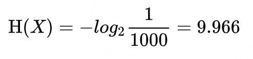
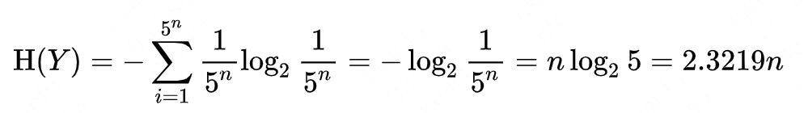

# leetcode题目

## 458 可怜的小猪

1000桶水，其中一桶有毒，猪喝毒水后会在15分钟内死去，想用一个小时找到这桶毒水，至少需要几头猪？

https://www.zhihu.com/question/60227816

**状态量确定：**

首先从信息论角度考虑这个问题：

1000桶水，有一桶水有毒，那么对应1000种情况，存储这些情况需要log2(1000)个bit；

1头猪每过15分钟就喝水，在1小时内有5种状态：(15分钟死亡，30分钟死亡，45分钟死亡，60分钟死亡，60分钟死亡)，4头猪就有5^4=625种状态，存储这些状态需要log2(625)个bit，这些bit无法完整存储1000个状态，所以4头猪不能检测出1000桶水，要5头猪才可以。

对应的信息墒公式分别为：





**编码：**

**一个状态对应水的编号**

5头猪，每头猪5种状态，上面5种状态用0-4表示，这5头猪的状态可以用s=(s0,s1,s2,s3,s4)来表示，其中每个sx取值为0-4；

不妨用这种状态来给水编号，可以知道毒水的编号等于猪的最终状态。

最终状态(0,0,0,0,0)代表所有猪都在第0分钟喝到了毒水，那么只有在毒水在第0分钟喂给所有猪才会出现这种状态，毒水在不同时刻喂给不同的猪会影响最终状，毒水就是0号水。

接下来要对状态进行搜索以确定最终状态

水的编号t:(t0,t1,t2,t3,t4)  含义：第ti时刻喂给第i头猪

最终状态编号：(s0,s1,s2,s3,s4) 含义：第i头猪在什么时间段内死亡

毒水对应的编号t = s。不考虑其他水，一桶水在s时喂给不同的猪后猪全部死亡，那么就是毒水。

**搜索**

搜索逻辑为【一桶一桶喂】：

```
for t in 1000:
	feed(t,pigs)//把这桶水喂给猪
	if (pigs.isAllDead){
		posion = t
	}
```

实际中可以把这些水按照时间批量的喂，记录猪的最终状态，那么60分钟后最终状态对应的水就是毒水，当然这种场景下猪就不是同时死的了而是异步死的。

**总结**：

* 首先计算出5。因为5是根据状态数量（猪的最终状态）和要检索的条件（水编号）计算出来的，一个最终状态对应一个水编号的一种选择。
* 用状态给水编号，因为毒水编号=最终状态，由此确定了水编号的含义【什么时候给什么猪喂这桶水】
* 搜索：对每个编号的水，按照其含义喂给猪，其中在喂毒水的时候猪会死亡确定这头猪的最终状态


