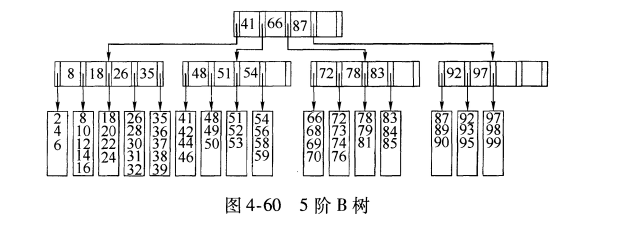

# 数据结构与算法java

## 1 引论

几个数学概念：

* 1^k + 2^k +……+ N^k近似于 N^(k+1) / |k + 1|  k!=-1，比如k=2时，左式等于N(N+1)(2N+1)/6 = N^3/6，当k = -1时，左边近似等于lnN。

* 模运算 A%N = B，表示为A=B(mod N)，A + C = B + C(mod N)，AD=BD(mod N)

使用接口表示泛型：

比如一个Person类型实现了Comparable接口，重写了compareTo方法，那么可以用Compareble来引用Person类型的对象。

**数组VS泛型**

java中数组是可协变的，泛型集合是不可协变的；像下面method2中传入类型为A[]时编译时无错，运行时有错；泛型集合对数组这一特点做的改良是编译时就会报错，集合是不可协变的。

```java
class A extends Person;
class B extends Person;
// A IS_A Person,B IS_A Person,所以method1方法可以接受类型为A和B的参数
public void method1(Person p);
//参数为数组，但是java规定A[] IS_A Person[],B[] IS_A Person[]，所以实际传入A[]和B[]都是可以的，可以通过编译，但是传入A[]时会在运行时抛出ArrayStoreException
public void method1(Person[] p){
    p[0] = new B();//代码体里可能是这种语句
}
xxx.method1(new A[]);//可以通过编译，运行时抛出ArrayStoreException
public void method1(List<Person> p){
}
xxx.method1(new List<B> b);//编译就不能通过
```

但是如果这样的话就会失去灵活性，所以可以使用通配符增强灵活性：

```java
public void method1(List<？ extends Person> p){
}
xxx.method1(new List<B> b);//编译通过
```

参数p可以被传递所有继承了Person的对象的集合。

List\<Person> IS A List<Person\>但是List\<A> IS NOT A List<Person\>

此时List\<Person> IS A List<？ extends Person>,而且List\<A> IS A List<？ extends Person>

**类型限界**：在尖括号内指定的，要求类型参数必须满足某种性质。实际上就是 \<? extends P\>那么P就是类型限界，发生类型擦除时类型参数不会被擦除为Object而是被擦除为P。

关于泛型的注意事项：

* 不能声明类型与类的参数类型一致的静态域;或参数类型与泛型类型一致的静态方法;或返回类型与泛型类型一致的静态方法。提示信息为Person.this cannot be referenced from a static context

  ```java
  public class Person <T> {
      T a;//ok
      static T b;//wrong
      private static T f1(int x) {//wrong
      }
      private static void f2(T x) {//wrong
      }
      private void f3() {
          T obj = new T();//Type parameter 'T' cannot be instantiated directly
          HashSet<String> [] s = new HashSet<String>[10];//Generic array creation
      }
  }
  ```

  因为类型擦除，Person\<String>和Person\<Integer\>中的static T id;最后都是Object类型，并且在不同的类中共享。

* 参数类型放声明侧可以，但是不能被实例化，见f3。因为T在类型擦除后会由其限界代替，所以可能只是new了一个object，这没有任何意义，它可以用于声明，但是不可以直接实例化。

* 也不能创建泛型数组，因为类型擦除后可能就是一个Object[]，它无法转换为T[]，因为Object IS NOT T。如果真要new数组，使用这种方式：

  ```
  T[] arr = (T[]) new Object[10];
  ```

  

* 不能创建泛型数组，因为类型擦除后它只是创建了一个HashSet []，此时这个数组可以放HashSet<Integer\>，也可以放HashSet<Person\>，会产生异常，所以直接编译时就报错。

## 2 算法分析

相对增长率。注意T(N)=O(f(N)),存在c，n0,当N>n0有T(N)<=cf(N)。N^2 = O(N^3)，f(N)是T(N)的上界。类似，还要下界的定义。

计算f(N)和g(N)的相对增长率，根据结果为0，c或无穷判断f和g之间的增长率关系。

估算程序运行时间的要求：

* 抛弃低阶项
* return fib(n-1) + fib(n-2)这种递归调用时，设执行fib(n)的时间为T(N)，可得T(N) = T(N-1) +T(N-2)，得到T(N)是指数级的数
* 二分查找O(logN)，一种算法将原来为O(N)的问题削减为原来的一半，时间复杂度类似有N个元素的二叉树的高，为lgN
* 辗转相除法的时间复杂度为O(logN)，因为M%N<M/2，所以每次计算出的余数都要小于M的一半，把问题压缩了。
* 计算一个数的N次幂，一般做法是O(N)，但是可以使用递归得方式pow(x,n)=>pow(x*x,n/2)，这里还要讨论奇数和偶数情况。时间复杂为O(logN)

## 3 表、栈、队列

Collection接口实现了Iterable接口，要求实现iterator方法，该方法返回Iterator对象。实现了Iterable接口的集合可以用增强for遍历，编译器看到一个集合使用增强for遍历时，它会将其编译为使用这个集合的迭代器遍历集合。

Collection和Iterator对象内都实现了remove方法，后者删除最近一次调用next返回的项，只有调用next后才可以调用remove，不能连续调用两次remove。

直接使用Iterator时，如果修改了正在被迭代的集合的结构（比如调用add,remove等方法），那么迭代器就不再合法，此时出现并发修改异常。如果使用迭代器遍历集合时使用Collection的remove方法修改了集合是会出现并发修改异常的，而使用Iterator自身的remove后迭代器仍然合法。

在表头添加元素的耗费：LinkedList:O(1),ArrayList:O(N)(涉及到移动数据)

搜索的耗费：LinkedList:O(N),ArrayList:O(1)

ArrayList的实现：

* 数组、size、capacity
* clear方法：清空所有元素，实现方法选择重新new一个大小为默认大小的数组。

* 扩容函数ensureSize，自定义的扩容方式可以选择乘以2
* add、remove、set、get
* 迭代器，用于实现增强for，在内部实现一个继承Iterator的内部类，调用iterator方法时返回它。

这里注意内部类可以访问外部类的域和方法。书上称static内部类为嵌套类、非static内部类为内部类，这里使用内部类而不是嵌套类的原因是对于内部类，编译器会自动加上一个外部类对象的隐式引用，这也是内部类可以访问外部类成员的关键。而使用static的嵌套类，只能使用版本3的形式明确地让嵌套类引用一个内部类对象，否则其中是没有一个具体的外部类对象的的隐式引用的。代码更麻烦。

而且static的内部类无法访问外部类的非static成员。

LinkedList的实现：

* size、头节点和尾节点（空LIst内只有头节点和尾节点，这样设计可以简化代码）,modcnt(对链表的改变次数)
* clear方法：清空所有元素，实现方法选择重新建立头节点，尾节点
* add、remove、set、get
* 一些辅助性方法：getNode 根据id查找一个元素；addBefore 找到第i个元素之后在它前面加上新元素，它用于辅助实现add(id,x)

modcnt有什么用？如果我们要加入并发修改异常这一逻辑，那么就需要在迭代器内保存一个初始的modcnt，当迭代时先检查迭代器内保存的modcnt和表中的modcnt是否一致，如果不一致就说明在迭代期间修改了表，那就抛出异常，没有问题后才可以进行下一步的迭代。

迭代过程中如何防止连续执行remove？设置一个ok2remove域，执行next时把它设为true，执行remove时把它设为false，执行remove前检查ok2remove为true了才可以进行删除。

书上没有在ArrayList的实现中选择没有加入错误检测逻辑，但是在LinkedList的实现中选择加入了。

栈可以用ArrayList或LinkedList实现。

栈的应用：

* 后缀表达式（逆波兰表达式）：1 * 2 + 3 * 4以后缀表达式的写法为1 2 * 3 4 * +，把两个数的运算符写在后面，然后把遍历表达式，遇到一个数就入栈，遇到运算符就把两个数弹出栈计算并将计算结果入栈。
* 普通表达式转后缀表达式：数字输出，运算符入栈，当遇到一个优先级低的运算符时，弹出运算符并输出，左括号优先级最高，遇到右括号时弹出。

队列实现：循环数组，back-font = -1表示队列为空 back == font表示队列满

## 4 树

树的应用：Unix文件系统

关注点：对树的三种遍历方式

**二叉树例子：表达式树**


对表达式树的不同遍历方式会得到不同的表达式：

中序遍历：普通表达式； 后序遍历：逆波兰表达式

后缀表达式——>表达式树：利用栈，遍历后缀表达式，操作数直接入栈，遇操作符从栈中弹出两个元素形成一棵子树后再压入栈。（给出一个后续遍历的二叉树节点序列结果如何还原出树结构）

树的变体

* 二叉查找树(BinarySearchTree)：左子节点小于右子节点；二叉查找树的API设计，关注Insert和remove(左子树最右子节点或右子树最左子节点取代被删节点，然后删掉那个子节点)；定义树的内部路径长为所有节点的深度之和（root节点为0）D(N)，得到D(N)=O(Nlog(N))

* AVL树：带有平衡条件的BST。关注旋转：左(右)子节点的左(右)子树插入节点时单旋转，左(右)子节点的右(左)子树插入节点时双旋转。

  单旋：如图让右节点成为新的根节点，使得原右子树的长度减去1，原左子树的长度加上1实现平衡

  

  但是对于插到左子节点的右子树或右子节点的左子树这种情况单旋就没有用了，如下图，满足关系式：

  * 旧左-旧右>=2
  * 新右=旧左
  * 新左<=(旧右+1)-1   (X高度至多比Z高度多1，新左=X的高度减去1位)

  最终得到新右-新左>=旧左-旧右>=2，单旋依然是不平衡的。

  

  双旋：先作一次单旋使左子节点的左子树长度大于右子树，左子节点左子树深度加1=旧左>=旧右+2，左子节点右子树长度减1，此时就是第一种情况，再作一次单旋使其平衡

  

  AVL树的插入操作：递归实现，通过compare找到节点应该插入的位置，找到后在返回时作balance操作，自底而上做平衡。书上height表示节点到其叶子节点的最大深度。

* 伸展树：对普通BST上插入子节点的时间复杂度为O(logN)，但极端情况下时间复杂度为O(N)：

  

  如图，这样的树如果连续N次访问节点1，那么总的时间复杂度为O(N\*N)，

  伸展树基于这样的思想：随机单次访问复杂度为O(N)是可以接受的，保证每次访问的上界都在O(logN)是不可能的，伸展树要保证M次操作的最坏运行时间为O(MlogN)，摊还下来每次操作的时间为O(logN)，在上面的情况中即使连续N次访问节点1，最坏时间复杂度为O(NlogN)而不是O(N^2)，这就要求改变树的结构，在访问（包括插入、删除）一个节点后通过旋转把它推到根节点位置。

  * 思路1：完全单旋

    访问节点X时，把它和它的父节点P作单旋直到X到达根节点。

    

    上图访问k1时，对k1和其父节点不断进行单旋，最后树结构为：

    

    这种方式的问题在于下次访问k1的时间是短了，但是访问其他节点的时间会变长，比如插入1，2，...，N这N个节点得到以N为根节点的没有右子节点的树(插入的时候就开始单旋)，再按序访问2到N，，最后这N次操作的时间复杂度为O(N^2)，没达到伸展树要求。

  * 思路2：对X、P(X父节点)、G(P父节点)成Z字形的使用双旋，其他情形单旋

    

    这种形式可以满足伸展树要求

* B树：多路查找树，与二叉树相比在节点数相同的情况下高度更低，目的是减小磁盘访问次数，一个B树有M路分支记它的阶为M。

  阶数为M的B树的通用特点：

  * 数据保存在叶子上，非叶节点保存M-1个关键字，一个非叶子节点上第i(i从1计数)个关键字的值为第i+1个子树的最小值
  * 根节点可以是叶子节点(只有1层)或有2到M个子树
  * 其他非叶节点有ceil(M/2)到M个子树
  * 叶子节点有ceil(L/2)到L个数据项，L自定义，这样保证每个节点是半满的，不会退化为二叉树

  

  B树的一些计算：假设一个磁盘块大小为S字节，关键字大小为32字节，数据记录为256字节，一个分支大小为4字节，那么满足32(M-1)+4M<=S；256M<=S。

  B树插入数据记录的逻辑：

  * 叶子节点有空间的，直接插入叶子节点
  * 叶子节点满了(已经有L个节点)，但是其父节点还有空间可以保存新的关键字的，将该节点L个记录和1个新纪录均分形成两个新的叶子节点，并更新父节点中的索引
  * 父节点也满了，此时再插入时需要对父节点进行分裂（更新新的父节点的关键字），并更新父节点的父节点的关键字
  * 当一直分裂到根节点时且根节点的关键字到到M-1了，那就分裂根节点在上面增加一个新的根节点(新根节点子节点个数此时为2，这是为什么允许根节点有两个子树的原因)，此时B树高度增加。


java中树的api实现：

TreeMap和TreeSet：使用红黑树实现（本质上是二叉平衡的）。它实现了SortedSet(Map)接口，使得集合中的元素是有序的。这就涉及到迭代器的实现问题：如何高效推进到下一个元素。

一个做法是使用**线索树**

* 对于叶子节点，它的Left和right都浪费了，可以使其left连接到它中序遍历的前继元，使right连接到它中序遍历的后继元，新多出的两条线就是线索，这种树叫做线索树。
* 左(右)叶子节点的后(前)继就是它的父节点；
* 右(左)叶子节点的后(前)继就是以它为左(右)子树最右(左)子节点的祖先节点，也就是它的父节点之前的后(前)继。
* 使用布尔变量来表示某一条链是普通的链还是线索

一个实现：注意在插入时新节点会插在旧叶子节点上

```java
class ThreadedTreeNode {
    ThreadedTreeNode left;
    ThreadedTreeNode right;
    int val;
    Boolean isRightThreaded;//右链是否为线索
    Boolean isleftThreaded;//左链是否为线索
    //构造函数省略
}

class ThreadedTree {
    //防止只有一个子节点的节点被判断为leaf
    public boolean isLeaf(node) {return isRightThreaded && isleftThreaded;}
    
    public ThreadedTreeNode insert(int x, ThreadedTreeNode node) {
        if(node == null) {//base case1:树中没元素
            return new ThreadedTreeNode(x, null, null, True, True);
        }
        
        if (isLeaf(node)) {//base case2：插入到根节点上
            newNode = new ThreadedTreeNode(x, null, null, True, True);
            if (x > node.val) {//新节点是其父的右子
                //设置新叶子节点的线索
                newNode.right = node.right;
                newNode.left = node;
                //更新旧叶子节点的链
                node.right = newNode;
                node.isRightThreaded = False;
            }
            else if(x < node.val) {//新节点是其父的左子
                //设置新叶子节点的线索
                newNode.left = node.left;
                newNode.right = node;
                //更新旧叶子节点的链
                node.left = newNode;
                node.isLeftThreaded = False;
            }
            else {
                //相等时donothing
            }
        }
        else if(x > node.val){    
            node.right = insert(x, node.right);           
        }
        else if (x < node.val) {
            node.left = insert(x, node.left);
        }
        else {
            //相等时donothing
        }
        return node;
    }
}
```

最后一部分的目标是构造一个给出一个单词表List，构造Map，key为单词，value为key变换一个字母就能得到的单词列表(wine->bine)，如何构造这个列表？

定义辅助函数diff判断两个单词是否可以通过一次字母变换得到：

* 最普通思路，直接遍历单词表挨个diff，然后更新列表（太慢，许多长度不同的单词都被比较了）
* 优化1：新定义一个映射(长度->单词列表)，只对长度相同的单词做diff
* 优化2：在优化1的基础上定义新映射(ine:{wine,bine})，连diff都不用做了，直接把每个新映射中的元素保存到Map中。


## 10 算法

### 10.2 分治

分：递归解决小问题 治：使用小问题的构建原问题

只有一个递归历程的不能叫分治。

**最近点对问题**

核心思想：O(N2)的算法很好想，但是O(NlogN)的算法就只能按照分治实现,把节点以x轴做分割，计算分割线左边最小值dl,右边最小值dr，两边中间最小值dc，且证明，当两个点x,y的距离小于min(dl,dr)=delta时，这两个点一定位于[分割线x坐标-delta，分割线x坐标+delta]内，且位于这个区间里的点大小为常数个：


可以看出，左边区域内最多有4个点，分别在四个角的位置，再放第5个点时它肯定会和其中一个点的距离小于delta，不满足条件；右边区域也是一样的。

https://www.jianshu.com/p/8bc681afbaff

```java
分治法求解最近点对距离
———————————————————————————————————————————————
输入:点集合points，且x递增points[i][0] = xi,points[i][0]=yi
———————————————————————————————————————————————
输出:最近点对距离distance，最近点对point1,point2
———————————————————————————————————————————————
public Tuple2[] Closest_pair(Tuple2[] points)//单个区间的计算
    length=points.length // 获取数组长度
  	quicksortByX(points)//把points按照x排序
    return ClosestPair(Point points[],0, length-1) // 求最近点对及最近点对距离

public Tuple2[] ClosestPair(Point points[], int start, int end)
  	int length = end - start + 1;
    if length< 2
        return Integer.MAXVALUE // 如果数组长度小于2 返回无穷大
    
    else if length = 2
        return distance(points[0],points[1] // 如果数组长度等于2 返回该两点的距离
 
    else // 数组长度大于3
        int mid = start + (end - start)/2；// 获取中线索引	
        d1 = ClosestPair(points, start, mid);             //分治求解左半部分子集的最近点  
        d2 = ClosestPair(points, mid + 1, end);    //分治求解右半部分子集的最近点 
        d = min(d1,d2)
        
        // merge 合并子集解，从mid向左右遍历常数个点就可以
        List<Tuple2> llist = new ArrayList<>();
        List<Tuple2> rlist = new ArrayList<>();
        for(int i = mid; i >= start; i--) {//常数操作
          if (Math.abs(points[i][0] - points[mid][0]) > d) break;
          list.add(points[i])
        }
        for(int j = mid + 1; j <= end; j++) {
          if (Math.abs(points[j][0] - points[mid][0]) > d) break;
          rlist.add(points[i])
        }
        for(Tuple2 leftpoint : llist) {
          for(Tuple2 reftpoint : rlist) 
            if(Math.abs(leftpoint[1] - reftpoint[1]) > d) continue;//y轴大于d不考虑
            d = Math.min(d,dist(leftpoint,reftpoint))
          }
        }

        return d;                

```

整个merge过程只操作常数个节点，所以时间复杂度是O(1)

T(n)=2T(n/2)+O(1),得到ClosestPair的时间复杂度是O(N)

加上之前对x的排序过程，所以总的时间复杂度是O(nlogn)

如果x本身是有序的，那么时间复杂度就是O(N)

### 10.3 动态规划


