# 算法

## 1 二分查找

背景：查找[1,2,2,2,3,3,5]中3的左边界和有边界的索引。

左边界和有边界代表啥？2的左边界是1，右边界是3，左边界i表示数组中有**i个小于2的数**，数组长度为n，那么右边界j表示数组中**有(n-1-j)个大于2的数**，如果要查找一个不存在于数组中的数的左边界和有边界，那么也就相当于查找数组中有多少个数小于该数/有多少个数大于该数。

**比如要查找一个不存在于数组中的数4的左边界和右边界，那么4的左边界应该是6，4的右边界应该是5**

二分模版：

**寻找左边界**：

按照左边界的定义，它可能出现在0到n（此时数组中所有数都小于它）这n=1个位置，因此把搜索范围定义在0和a.length，目的是希望最终搜索到的边界**始终**在我们选择的区间中不会出现溢出。最后当搜索空间只剩一个数的时候它就是我们要的左边界。所以退出搜索的条件时l==m，计算出m后，如果是a[m]==target这种情况，此时m可能也是目标值，所以取r=m。

为什么不能是while(l <= r)，首先知道这个循环条件后要观察循环体中无论什么分支是否总会有改变l和r位置的情况，前两个分支**肯定**会更新r和l的值这里当(a[m] < target的时候，r是有可能不发生变化的（比如l==r==0的情况）,所以一旦在while中指定了(l<=r)就有可能出现持续落入第三个分支导致l和r都没有更新从而无法退出当前条件。

如果按照lalabuladong那种闭区间模式(把r设为a.length-1)那就表示允许最终结果不在搜索区间里，需要做进一步检查。


**寻找右边界：**

n-j-1的值可能是0到n个，右边界j的可能取值范围为-1（数组中全部元素都大于这个数）到n-1（数组中没有数大于它），当a[m]==target时，m本身可能是右边界，所以让l=m，最后l=m的时候就是结果。

下面第一个版本会出现死循环所以干脆允许最终结果溢出奥搜索空间之外，即在搜索空间在l=r的时候，无法直接断定它是最终结果而是继续进行搜索，循环条件变成while(l<=r)。最后为避免死循环让相等时取l=m+1，最后退出搜索时r一定在l的左边，返回r就是右边界

```java
//左边界
public int bisearch(int[] a, int target) {
  int l = 0, r = a.length;
  while(l < r) {
      int m = l + (r - l) /2;
    	if(a[m] > target) { r = m - 1;}
  		else if(a[m] < target) {l = m + 1;}
      else {r = m;} 
  }
  return l;
}
//右边界按照上面的逻辑应该这么写，但是最后会出问题，区别在于，r=m时保证r会减小的，而l=m缺不能保证l会增大，因为l=0,r=1时，l=m时就l永远等于0
public int bisearch(int[] a, int target) {//死循环版本
  int l = -1, r = a.length - 1;
  while(l < r) {
      int m = l + (r - l) /2;
    	if(a[m] > target) { r = m - 1;}
  		else if(a[m] < target) {l = m + 1;}
      else {l = m;} 
  }
  return l;
}
//修改版本，当a[m]==target让l=m+1保证l会移动，但是这样m可能就不在最终的区间中了，所以也没必要把l设成-1了，最后可以把搜索空集一直搜索到一个
public int bisearch(int[] a, int target) {
  int l = 0, r = a.length - 1;
  while(l <= r) {
      int m = l + (r - l) /2;
    	if(a[m] > target) { r = m - 1;}
  		else if(a[m] < target) {l = m + 1;}
      else {l = m + 1;} //这样最终的m可能不在搜索区间里，位于搜索区间的左边
  }
  return r;
}

```

**总结**：二分查找的关键就是**是否允许搜索结果不存在于搜索空间中**，如果要求结果必须存在于空间🀄️，那么当搜索空间只剩一个元素时它肯定就是我们要找的结果，所以l == r时就必要再进行搜索里了，直接返回l或r吧。

这样的想法直接决定了在a[m] == target直接把m纳入下一个搜索区间。但是这种思想在寻找左边界时可用，寻找右边界时就造成死循环，因为l=0,r=1时，l始终不会更新。

labladong给出的寻找右边界的一个思路是要求最终搜索结果**一定不在**搜索区间中，他选择寻找数组中**第一个大于target的数的左边界**，那么它减去1就是target的右边界，而搜索区间一定会包含数组中第一个大于target的数的左边界。

```java
int right_bound(int[] nums, int target) {
    if (nums.length == 0) return -1;
    int left = 0, right = nums.length;
    while (left < right) {
        int mid = (left + right) / 2;
        if (nums[mid] == target) {
						left = mid + 1; // 注意,这种情况要找的左边界肯定在mid右边
				} else if (nums[mid] < target) {
            left = mid + 1;
        } else if (nums[mid] > target) {
							right = mid;//此时mid可能也是右边界 }
			}
	  return left - 1; // 注意 }
```


还有一种情况就是允许搜索结果不在搜索区间中，那么l==r的时候就必须继续搜索，来验证它到底是不是我们想要的结果。最后退出的时候r = l-1，而且为了避免死循环每次必须让l和r都移动，即使nums[mid] == target不能把mid纳入下一轮搜索区间中，此时寻找左边界的搜索逻辑为：

```java
public int bisearch(int[] a, int target) {
  int l = 0, r = a.length - 1;
  while(l <= r) {
      int m = l + (r - l) /2;
    	if(a[m] > target) { r = m - 1;}
  		else if(a[m] < target) {l = m + 1;}
      else {r = m - 1;} //可能造成最终搜索结果溢出，位于新搜索区间的右边
  }
  return l;//最终
}
```


## 2 排序模版

### 2.1 快速排序

**分治**

l:永远指向小于pivot的数的指针的右边界；r永远指向大于pivot的数的指针的左边界，一开始的话放在l-1和r+1最合适,cursor是移动的指针

```java
public void quicksort(int[] a, int left, int right) {
  
  if(left >= right) return;
  int pivot = a[left];//也可以取a[left + (right - left)/2]
  int l = left - 1;
  int r = right + 1;
  int cursor = left;
  while(cursor < r) {//当cursor移动到r了就
    if (a[cursor] < pivot) {swap(a, ++l, cursor++);}
    else if (a[cursor] > pivot) {swap(a, --r, cursor);}//这里不能是cursor++，因为换过来的数还得做jiaoyan
    else {cursor++;}//等于cursor就直接移动
  }
  //对不等于x的前后两部分分别进行排序
  quicksort(a, left, l);
  quicksort(a, r, right);
}
```

关于返回条件：对于left = l这种情况，就没必要再排了可以直接退出，如果没有等于这个条件，当left = right = 0的时候，pivot永远等于a[left],那么l和r永远不会移动，最终进入死循环。


### 2.2 归并排序

**分治+双指针**

```java
public void mergesort(int[] a, int left, int right) {
  if(left >= right) return;
  int mid = left + (right - left)/2;
  mergesort(a, left, mid);
  mergesort(a, mid + 1, right);
  merge(a, left, mid, right);
}
//merge就是双指针模版
public void merge(int[] a, int left, int mid, int right) {//new一个辅助数组
  int[] help = new int[right - left + 1];
  int l = left, r = mid + 1, h = 0;
  while(l <= mid && r <= right) {
    if(l > mid) {help[h++] = a[r++];}
    else if(r > right) {help[h++] = a[l++];}
    else if(a[l] <= a[r]) {help[h++] = a[l++];}
    else {help[h++] = a[r++];}
  }
  for(int i = 0; i<=h;i++) {
    a[left + i] = help[i];
  }
}
```

* 考虑到只有一个元素的数组就该知道，退出条件必须包含=，否则会进入死循环。
* 归并排序为什么稳定？a[l] <= a[r]这种实现就足以保证值相等的元素，位置靠前的永远会放到help中靠前的位置


## 2 动态规划专题

### 1.最优子结构

「最优子结构」是某些问题的一种特定性质，并不是动态规划问题专有的。也就是说，很多问题其实都具有最优子结构，只是其中大部分不具有重叠子问题，所以我们不把它们归为动态规划系列问题而已。

已知每个班最高分，求全校最高分，这个问题就**符合最优子结构**：可以从子问题的最优结果推出更大规模问题的最优结果。让你算**每个班**的最优成绩就是子问题，你知道所有子问题的答案后，就可以借此推出**全校**学生的最优成绩这个规模更大的问题的答案。

假设你们学校有 10 个班，你已知每个班的最大分数差（最高分和最低分的差值）。那么现在我让你计算全校学生中的最大分数差，这个问题就**不符合最优子结构**，因为你没办通过每个班的最优值推出全校的最优值，没办法通过子问题的最优值推出规模更大的问题的最优值。

**那么遇到这种最优子结构失效情况，怎么办？策略是：改造问题**。

最大分数差，不就等价于最高分数和最低分数的差么，那不就是要求最高和最低分数么，不就是我们讨论的第一个问题么，不就具有最优子结构了么？

### 2.递归转dp

#### 494目标和

给定一个非负整数数组，a1, a2, ..., an, 和一个目标数，S，给每个数前面加上'+'或'-'，使这些数之和为S，问所有添加符号的方法数。

这题使用回溯很轻松，但是如何转dp?

把这些数分为两个集合，前面加正号的是集合A，负号的是集合B，通过下面公式可以把该问题转化为一个01背包问题。

```
sum(A) - sum(B) = target
sum(A) = target + sum(B)
sum(A) + sum(A) = target + sum(B) + sum(A)
2 * sum(A) = target + sum(nums)
```

### 3.最长递增子序列问题

LIS问题，最容易的解法很容易想出，O(N^2)，但是这道题还可以做成O(NlogN)解法，就是类似扑克牌洗牌这种过程

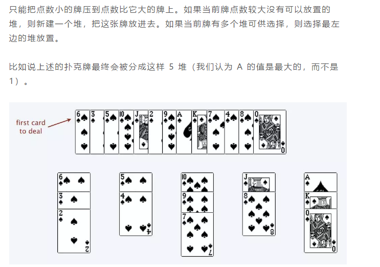

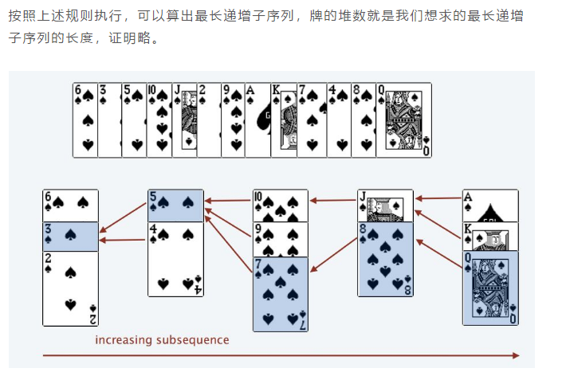

最后扑克牌的堆数就是最长子序列。

这里强调一下，这种放法是默认数组没有重复子元素的，假设数组中有重复子元素的话，那么方法就是每一张牌可以放在牌数**不小于**它的牌上，比如2,2,2,2,2，它们应该被放在一个堆上而不是5个堆。

为什么堆的个数就是最长增长子序列的长度？因为按照这种放置方式，数组中所有递增的子序列肯定位于不同的堆上，同一个堆从上到下肯定是递减的，所以堆的个数肯定大于等于最长增长子序列的长度；同理，堆的长度也不可能大于最长增长子序列长度，因为最终最长增长子序列中某元素的下一个元素一定位于它的下一个堆上，比如最终子序列中的an位于第i个堆上，那么a(n+1)一定位于第i+1个堆上。因为an,a(n+1)是最长增长子列相邻元素，在原数组的索引为k1,k2,那么nums[k1+1:k2-1]之间就不可能存在位于[an,a(n+1)]这个区间的值，否则不是最优解。an和a(n+1)之间的元素全部大于max(an,a(n+1))，那么a(n+1)会挂在第i+1个堆上；否则a(n+1)会作为第i+1个堆的堆头；因此不可能存在堆的个数大于最长增长子序列个数的情况。

因为堆底元素是单调递增的，所以可以使用二分查找加快放置堆元素的速度，如果新遍历到的元素大于此时堆底所有的元素，就新开一个堆；以上图的堆底元素为例，新遍历的元素如果小于等于2，那就放在第一个堆上；大于2小于等于4就放在第二个堆上，比如找到3，如何使用左边界放法，那么整个数组中只有1个数比它小，它应该放在第一个堆上；如果使用右边界放法，整个数组中有四个数比它大，它应该放在第0个堆上(5-1-j=4=>j=0)，很显然，这里应该使用**左边界放法**；

那么通过模拟扑克牌来计算最长递增子列的长度：

```java
public int LengthOfLIS(int[] nums){
    int piles = 0;
    //heap就是堆
    int[] heap = new int[nums.length];
    for(int i = 0;i<nums.length;i++){
        int pile = nums[i],lo = 0,hi = piles;
        //这里使用左闭右开搜索法
        while(lo<hi){
            int mid = lo + (hi-lo)/2;
            if(heap[mid]<pile){
                lo = mid + 1;
            }else if(heap[mid]>=pile){
                hi = mid;
            }
        }
        //左开右闭返回左边界，返回lo或者hi都可以，这里选择lo
        if(lo == piles){
            //开新堆
            heap[piles++] = pile;
        }else{
            //更新原来堆的堆底元素
            heap[lo] = pile;
        }
        
    }
    return piles;
}
```

信封问题，LIS问题可以解决：

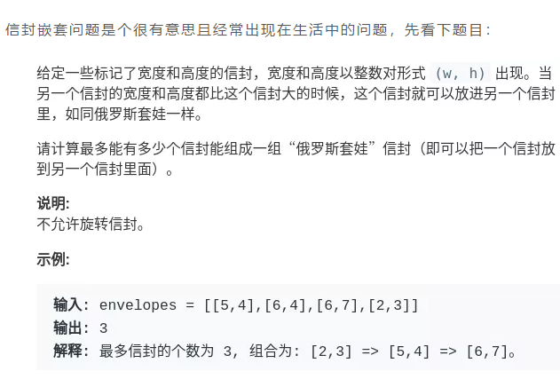

做法：我一开始想到了排序，首先是按照env[0]从小到大排，env[0]相等按照env[1]从小到大排，然后准备一个堆，然后使用dp，计算以每一个信封为终点的最长字节长度；这里可以做一个优化，就是对于某一个信封，如果它前一个信封的env[0]和它相等，那么就可以跳过前面的信封。

也可以选择


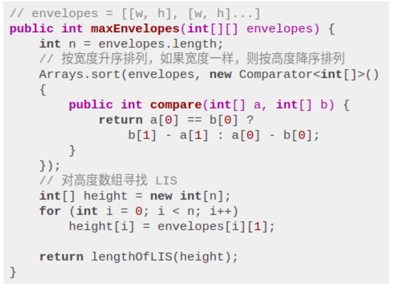

### 4.最大子数组和

lc53，dp[i]表示以i结尾的数组的和，dp[i] = Math.max(dp[i-1],dp[i])

### 5.最长公共子序列

#### lc1143 lcs问题

子序列类型的问题， 穷举出所有可能的结果都不容易， ⽽动态规划算法做的就是穷举 +剪枝， 它俩天⽣⼀对⼉。 所以可以说只要涉及⼦序列问题， ⼗有⼋九都需要动态规划来解决， 往这⽅⾯考虑就对了。  

**对于两个字符串求子序列的问题，都是用两个指针`i`和`j`分别在两个字符串上移动，大概率是动态规划思路**。

这个和编辑距离很像，如果text1.charAt(i)==text.charAt(j)，说明公共子序列可以在dp\[i-1]\[j-1]的基础加1了，否则就是dp\[i-1]\[j]和dp\[i]\[j-1]两者的最大值。

```java
class Solution {
    public int longestCommonSubsequence(String text1, String text2) {
        int m = text1.length(),n = text2.length();
        int[][] dp = new int[m+1][n+1];
        for(int i = 1;i<=m;i++){
            for(int j = 1;j<=n;j++){
                if(text1.charAt(i-1)==text2.charAt(j-1)){
                    dp[i][j] = dp[i-1][j-1] + 1;
                }else{
                    dp[i][j] = Math.max(dp[i-1][j],dp[i][j-1]);
                }
            }
        }
        return dp[m][n];

    }
}
```

#### lc583 两个字符串的删除操作

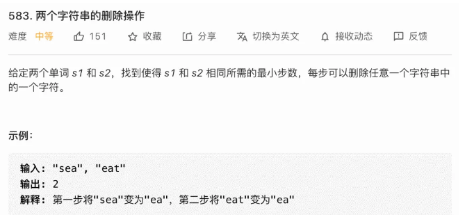

这道题就是求出最长公共子序列长度lcs，然后使用s1.length()-lcs+s2.length()-lcs

#### lc712 两个字符串的最小ASCII删除和

这个乍一看挺难的，我以为得把最长公共子串求出来，然后再使用两个字符串的ASCII码减去两次公共子串的ASCII码，其实没那么麻烦，可以复用1143的代码，就是dp\[i]\[j]的定义是s1前i个字符和s2前j个字符公共字符串的ASCII码之和，然后可以发现，代码逻辑是可以复用上面的。

```java
class Solution {
    public int minimumDeleteSum(String s1, String s2) {
        int sum = getAsc(s1)+getAsc(s2);
        int m = s1.length(),n = s2.length();
        int[][] dp = new int[m+1][n+1];
        for(int i = 1;i<=m;i++){
            for(int j = 1;j<=n;j++){
                if(s1.charAt(i-1)==s2.charAt(j-1)){
                    dp[i][j] = dp[i-1][j-1] + s1.charAt(i-1) + s2.charAt(j-1);
                }else{
                    dp[i][j] = Math.max(dp[i-1][j],dp[i][j-1]);
                }
            }
        }
        return sum - dp[m][n];
    }
    public int getAsc(String s){
        int res = 0;
        for(int i = 0;i<s.length();i++){
            res = res + s.charAt(i);
        }
        return res;
    }
}
```

### 6.子序列问题解题模板

一旦涉及到子序列和最值，那几乎可以肯定，**考察的是动态规划技巧，时间复杂度一般都是 O(n^2)**

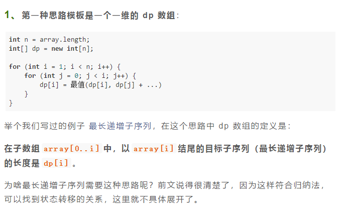

**2.第二种思路模板是一个二维dp数组**

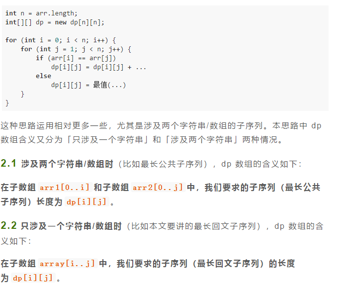

小试牛刀：求最长回文子序列的长度

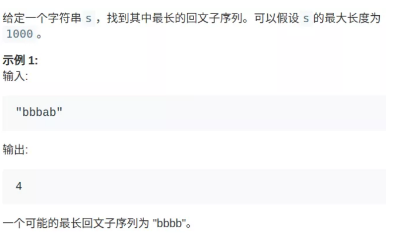

状态转移方程：

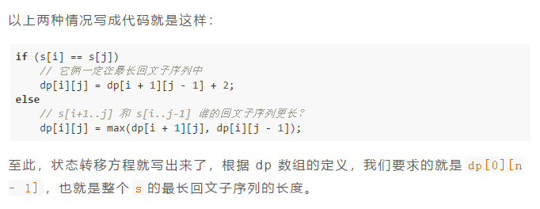

```java
int longestPalindromeSubseq(string s) {
    int n = s.size();
    int[][] dp = new int[n][n];
    // base case
    for (int i = 0; i < n; i++)
        dp[i][i] = 1;
    // 反着遍历保证正确的状态转移
    for (int i = n - 1; i >= 0; i--) {
        for (int j = i + 1; j < n; j++) {
            // 状态转移方程
            if (s[i] == s[j])
                dp[i][j] = dp[i + 1][j - 1] + 2;
            else
                dp[i][j] = max(dp[i + 1][j], dp[i][j - 1]);
        }
    }
    // 整个 s 的最长回文子串长度
    return dp[0][n - 1];
}
```

### 7.背包问题

#### 01背包问题

```java
public int knapsack(int W,int N,int[] w,int[] val){
    int[][] dp = new int[N+1][W+1];
    for(int i = 1;i<=N;i++){
        fot(int j = 1;j<=W;j++){
            if(j>=w[i-1]){
                dp[i][j] = Math.max(dp[i-1][j],dp[i-1][j-w[i-1]]+val[i-1]);
            }else{
                dp[i][j] = dp[i-1][j];
            }
        }
    }
    return dp[N][W];
}
```

状态压缩

```java
public int knapsack(int W,int N,int[] w,int[] val){
    int[] dp = new int[W+1];
    for(int i = 0;i<N;i++){
        fot(int j = W;j>=w[i];j--){
            dp[j] = Math.max(dp[j],dp[j-w[i]]+val[i]);
        }
    }
    return [W];
}
```

#### 完全背包问题

有一个背包，最大容量为`amount`，有一系列物品`coins`，每个物品的重量为`coins[i]`，**每个物品的数量无限**。请问有多少种方法，能够把背包恰好装满？

与01背包相比，这个对物品的数量没有限制，

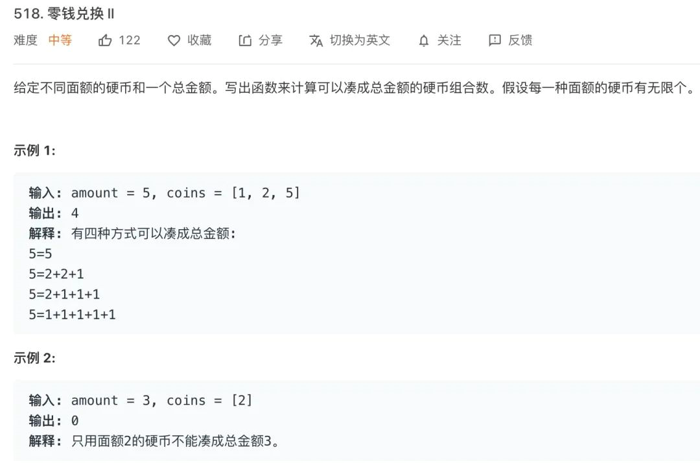

这道题该怎么理解呢？dp\[i]\[j]表示商品个数为i时，容量为j时的放法组合数。遍历到第i个商品时，可以选择不把它放进去(dp\[i-1]\[j]),也可以选择只放进去一个(dp\[i-1]\[j-coins[i-1]]),放进去两个(dp\[i-1]\[j-2\*coins[i-1]])，直到放不进去为止(k\*coins[i-1]>=j)，dp\[i]\[j]就是这几种情况的和.

另外可以发现，dp\[i][j-coins[i-1]] = dp\[i-1][j-coins[i-1]] + ... + dp\[i][j-k\*coins[i-1]]

所以dp\[i][j] = dp\[i][j-coins[i-1]] + dp\[i-1][j]

```java
int change(int amount, int[] coins) {
    int n = coins.length;
    int[] dp = new int[amount + 1];
    dp[0] = 1; // base case
    for (int i = 0; i < n; i++)
        for (int j = 1; j <= amount; j++)
            if (j - coins[i] >= 0)
                dp[j] = dp[j] + dp[j-coins[i]];

    return dp[amount];
}
```

### 8.正则表达

因为是字符串匹配问题，所以使用dp，一共两个字符串，dp\[i]\[j]代表s1前i个字符是否可以和s2前j个字符匹配

因为是字符串匹配问题，所以使用dp，一共两个字符串，dp\[i]\[j]代表s1前i个字符是否可以和s2前j个字符匹配

```java
if (j == 0) {
    f[i][j] = i == 0;
} else {
    //非空正则分为两种情况 * 和 非*
    if (B.charAt(j - 1) != '*') {
        if (i > 0 && (A.charAt(i - 1) == B.charAt(j - 1) || B.charAt(j - 1) == '.')) {
            f[i][j] = f[i - 1][j - 1];
        }
    } else {
        //碰到 * 了，分为看和不看两种情况
        //不看
        if (j >= 2) {
            f[i][j] |= f[i][j - 2];
        }
        //看
        if (i >= 1 && j >= 2 && (A.charAt(i - 1) == B.charAt(j - 2) || B.charAt(j - 2) == '.')) {
            f[i][j] |= f[i - 1][j];
        }
    }
}
```

|      | 0    | a    | *    |
| ---- | ---- | ---- | ---- |
| 0    | T    |      |      |
| a    | F    |      |      |
| a    | F    |      |      |

dp\[i]\[j]的basecase如上图所示，所以有

```java
if (j == 0) {//第0列只有i==0时为true，其他为false.
    f[i][j] = i == 0;
}
```


### 9.四键键盘

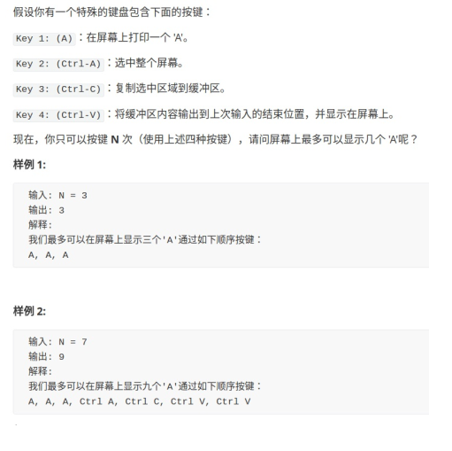

* 要想操作n次后显示更多的'A'，那么第n次操作甚至第n-1次操作都是c_v，或者直接输入一个'A'，第n次操作如果是c_a或者c_c，可能在后面会获得更大的值（毕竟一次性复制了更多元素，以后c_v时以乘法增加，斜率更高）但是只操作n次的情况下，对不起，人家在你c_a，c_c的功夫直接两次c_v超过你，因为dp\[i]记录的是操作i次时获得的最大'A'，人家从dp\[i-3]开始直接复制，而此时你的dp\[i]还一直没变化。
* 多次c_a和c_c操作怎么办？只考虑最后一次的那个c_a,c_c。前面提到，不看长远利益，只想在第n次获得最大值，那么不管之前进行过多少次c_a,c_c，最后一次的c_c后一直到n就必须开始c_v了，那么dp\[i]就是在第j+1个位置c_a，第j+2个位置c_c，随后开始c_v的最大值，1<=j<=i-3

```java
class Solution {
    public int maxA(int n) {
        int[] dp = new int[n+1];
        for(int i = 1;i<=n;i++){
            dp[i] = i;
            for(int j = 1;j<=i-3;j++){
                dp[i] = Math.max(dp[i],dp[j]*(i-j-1));
            }
        }
        return dp[n];
    
    }
}
```

按照递归转dp来求解：

首先要明确状态、选择

状态：n(剩余的操作次数)，anum(屏幕上a的个数)，copy（剪切板上'a'的个数）

选择：选择'A',选择c_a,c_c（两个连选），选择c_v

basecase:n=0

```java
public int dp(int n,int anum,int copy){
    //basecase
    if(n<=0) return anum;
    //选择'a'
    int res1 = dp(n-1,anum+1,copy);
    //选择'c_v'
    int res2 = dp(n-1,anum+copy,copy);
    //选择'c_a','c_c'
    int res3 = dp(n-2,anum,anum);
    return Math.max(res1,Math.max(res2,res3));
    
}
```

### 10.KMP算法

一共两步：

* 构建next数组
* 根据next数组移动模式串

**next数组定义：**

* 对于字符串"ababc",next\[i\]表示第i个字符前的字符串最大公共前缀和后缀的长度（前缀不可以包含最后一个字符，后缀不能包含第一个字符）,那么next\[4]('c'之前是'abab')，它们最大的公共前缀和后缀是'ab'，所以next\[4]==2。
* basecase:对于next\[0]，第一个字符前没有字符串，所以记为-1；next\[1\]，前面只有一个字符，但是前缀不能包含最后一个元素，也就是说'a'不可以作为前缀，所以next\[1]==0。这里注意，某个字符前存在字符串只是不存在公共字符，那么它的next是0；如果前面根本不存在字符串，那么它的next就是-1；只有位置0的next是-1，与后面next为0的情况区分开。

**如何求解next数组？**

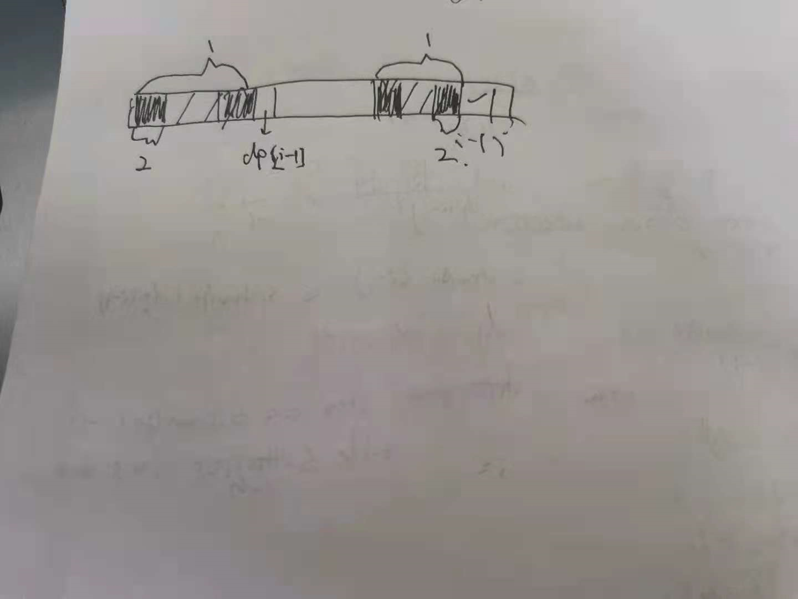

现在要求位置i的next：

* 如果位置i-1的字符和位置next\[i-1\]（图上笔误，这里dp指的就是next)的字符相等，那么next\[i] = next\[i-1]+1
* 如果不相，说明位置i前字符没有那么长的公共子串，得减小一下范围，首先 next\[i-1]我们知道了，它前面也有公共前缀后缀（那两个小黑块），而且第一个黑块和第四个黑块是对称的，接下来判断第一个黑块后的字符是否等于位置i-1的字符。
* basecase，不断往前缩减，如果0号位置的字符都和第i-1个字符不相等，那么就说明i前公共前缀后缀长度为0，

我自己写的初稿：

```java
public int[] getNext(char[] patc){
    if(patc.length==1) return new int[]{-1};
    int[] next = new int[patc.length];
    //basecase
    next[0] = -1;
    next[1] = 0;
    int pos = 2;
    while(pos<patc.length){
        if(patc[pos-1] == patc[next[pos-1]]){
            next[pos] = next[pos-1]+1;
            continue;
        }else{
            int k = next[pos-1];       
        	while(k!=-1){
                //重复比较，不太好，但是思路应该对。
                if(patc[pos-1] == patc[k]){
                    next[pos] = k+1;
                    break;
                }
                k = next[k];
            } 
            if(k == -1) next[pos] = 0;
        }
    }
    return next;
}
```

这里不妨把k提取出来，k代表next\[pos-1\]

```java
public int[] getNext(char[] patc){
    if(patc.length==1) return new int[]{-1};
    int[] next = new int[patc.length];
    //basecase
    next[0] = -1;
    next[1] = 0;
    int pos = 2;
    int k = 0;//next[2-1] = 0
    while(pos<patc.length){
        if(patc[pos-1] == patc[k]){
            next[pos++] = ++k;
        }
        else if(k>0){
            k = next[k];
        }else{
            next[pos++] = 0;
        }
    }
    return next;
}
```

* 字符串移动环节，假设pat的第j个字符和txt的第i个字符不匹配，直接让next\[j]和i比，而不是一下子把pat串移动到(i-j+1)的位置重新开始匹配

  ```java
  public int kmp(String txt,String pat){
      char[] txtc = txt.toCharArray();
      char[] patc = pat.toCharArray();
      int ti = 0;
      int pi = 0;
      int[] next = getNext(patc);
      while(ti<txtc.length&&pi<patc.length){
          if(txtc[ti] == patc[pi]){
              ti++;
              pi++;
          //如果没匹配上就先移动到next[pi]
          }else if(pi>0){
              pi = next[pi];
          }else{
              //要是连pat第0位置元素都和位置ti的元素不等，那么ti这个位置是肯定和pat匹配不上了，所以把ti向前移动一位，同时把pi恢复为0
              ti++;
              pi = 0;
          }
      }
      //退出循环，如果最后pat到达最后一位了，说明全部匹配成功了，ti-pi就是第一个匹配成功的值，如果匹配不成功，返回-1.
      return p1<patc.length?:-1:ti-pi;
  }
  ```

* 计算next数组的时候为什么没有next\[n+1]?

  看kmp算法就能明白，如果最后一个元素和ti匹配上了直接就退出了；如果匹配不上就直接往前退，next数组是倒退时用的，所以next\[n+1]意义不大。

* 时间复杂度分析

  kmp的时间复杂度：首先txt肯定不回退，pat向前滑动（不会后退），但是它所滑动的最大距离是n(也就是滑动到头了)，所以匹配过程时间复杂度O(n)

  getNext的时间复杂度：

  每次循环，要么pos增加，要么pos-k增加，要么两者一起增加，pos<m,pos-k<m，所以总的时间复杂度不会超过2m，getNext的时间复杂度是O(m)

### 11.贪心之区间调度问题

贪心算法：dp的特例

使⽤贪⼼算法需要满⾜更多的条件（贪⼼选择性质） ， 但是效率⽐动态规划要⾼。  

什么是贪⼼选择性质呢， 简单说就是： 每⼀步都做出⼀个局部最优的选择，最终的结果就是全局最优。 注意哦， 这是⼀种特殊性质， 其实只有⼀部分问题拥有这个性质。

经典区间问题：

给你很多形如 [start, end] 的闭区间， 请你设计⼀个算法，算出这些区间中最多有⼏个互不相交的区间。   

\1. 从区间集合 intvs 中选择⼀个区间 x， 这个 x 是在当前所有区间中结束
最早的（end 最⼩） 。
\2. 把所有与 x 区间相交的区间从区间集合 intvs 中删除。
\3. 重复步骤 1 和 2， 直到 intvs 为空为⽌。 之前选出的那些 x 就是最⼤不
相交⼦集。

```java
public int intevalSchedual(int[][] intvs){
    if(intvs.length == 0) return 0;
    //按照end排序
    Arrays.sort(intvs,new Comparator<int[]>(){ (a,b)->a[1]-b[1]});
    int cnt = 1;
    int end = intvs[0][1];
    for(int i = 1;i<intvs.length;i++){
        if(intvs[i][0]>end){
            cnt++;
            end = intvs[i][1];
        }
    }
    return cnt;
}
```

**相关例题：** 

#### lc435无重叠区间

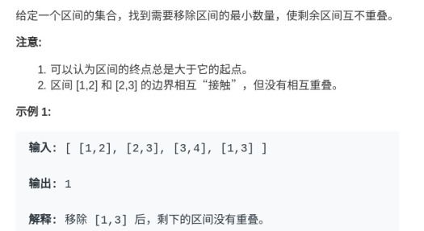

```java
return n - intevalSchedual(int[][] intvs);
```

  #### lc452最少的箭射气球

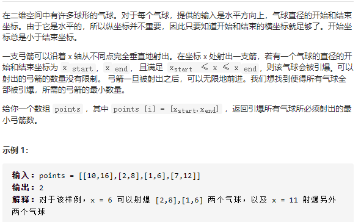

 注：这个感觉跟贪心没啥关系，先按end排好序之后下一个如果与当前区间重合了直接跳过，且不更新end，直到出现一个不和当前end重合的再加1.

```java
class Solution {
    public int findMinArrowShots(int[][] points) {
        if(points.length==0) return 0;
        Arrays.sort(points,new Comparator<int[]>(){
            public int compare(int[] m,int[] n){
                //为啥使用这种方式而不是两个数相减？因为如果数很大的话两个数会溢出。
                return m[1]<n[1]?-1:1;
            }
        });
        int cnt=1,end=points[0][1];
        for(int i=1;i<points.length;i++){
            if(points[i][0]<=end) continue;
            else{end=points[i][1];
            cnt++;}
        }
        return cnt;

    }
}
```

