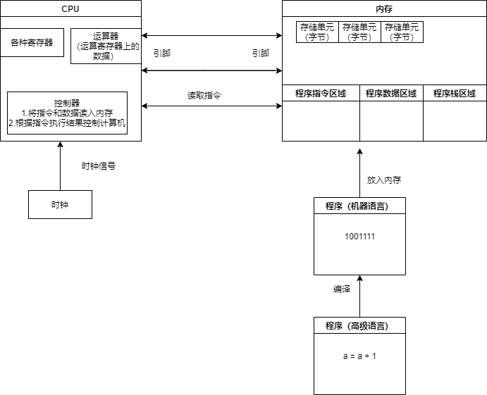
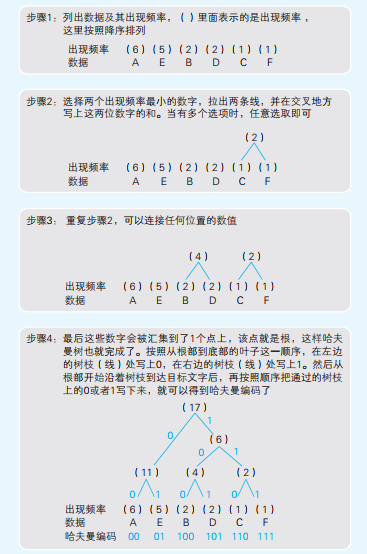
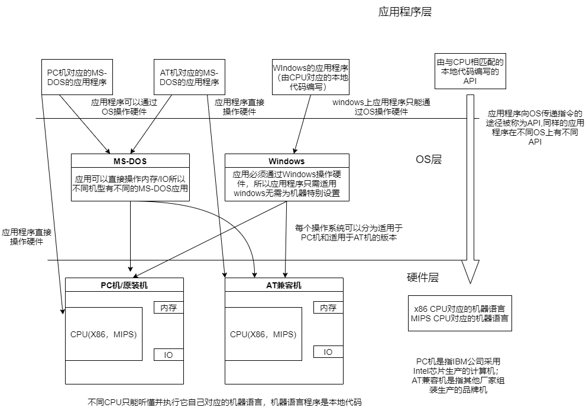
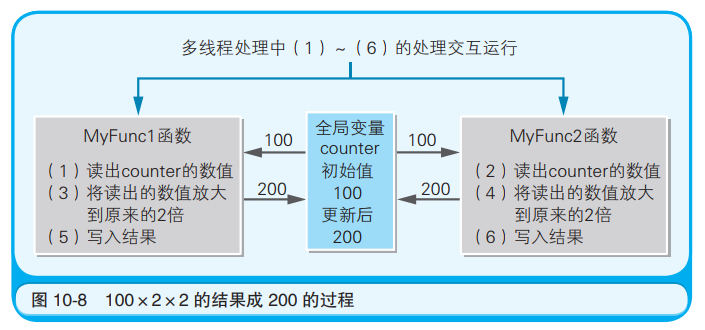

# 程序是怎样跑起来的

## 1)CPU与二进制

### 1.1 CPU

CPU、内存、程序的关系如下图所示：



上面的流程可概括为：将程序编译后放到内存里，CPU从内存中读取程序的指令和数据执行。

CPU中最重要的元件就是寄存器，汇编语言很多就是在对寄存器进行操作，CPU被看作是各个寄存器的集合，这些寄存器按照存放的类型分类为8种：

* 啥都能存的（通用寄存器）
* 存放数据相关的：累加寄存器（存储运算的数据）
* 存放指令相关的：指令寄存器（程序员不能对指令寄存器进行读写）
* 存放状态相关的：标志寄存器（运算后CPU的状态）
* 存放地址相关的：基址寄存器、变址寄存器、程序计数器（下一条指令所在内存的地址）、栈寄存器（栈区域起始地址）

这些寄存器与程序执行的关系：

* 顺序执行：程序计数器在一个指令执行时更新为下一条指令的地址
* 条件执行：在执行到条件分支时会进行比较操作，比较操作实际上就是在作减法运算，将比较结果保存到标志寄存器中（32位CPU的寄存器长度为32位，标志寄存器最后一位为1表示运算结果为正、倒数第二位为1表示运算结果为0、倒数第3位为1表示运算结果为负），CPU在做完比较后会参考标志寄存器的结果执行**跳转指令**(jump)，跳转指令不会像顺序执行那样将程序计数器指定为下一条指令的地址，而是直接将程序计数器的值更新为要跳转的地址。
* 循环执行：也是依靠跳转指令

* 函数调用：这里不再依靠跳转指令，而是依靠return和call：某条指令要调用一个函数，那么call指令就是把这个指令的下一条指令放到栈中；函数的出口（比如return xxx;)对应的机器指令是return指令，把保存到栈中的地址设置到程序计数器中。这样这个函数对应的指令执行完了之后会接着执行下一条指令

上面的寄存器涉及到很多指令，这里归纳一下：

* 数据输送指令：寄存器-内存之间传递数据的
* 运算指令：用累加寄存器执行算术运算、逻辑运算、比较运算、移位运算
* 跳转指令（条件或循环时使用）
* call/return指令：函数调用

基址寄存器和变址寄存器：

基址寄存器保存首地址（10000000），变址寄存器保存偏移（0000FFFF）。

10000000+0000FFFF=1000FFFF

### 1.2 二进制

**为什么使用二进制数表示计算机信息？**

因为IC的引脚只能表示0V、5V两个状态,这样的话一个引脚的信息就只能用一个bit表示(0/1)，那么32位引脚可以表示一个4字节数据的信息，

**二进制数为什么用补码表示负数？**

计算机做减法运算时实际上是在做加法运算，用一位8位数来表示1：00000001，那么1+（-1）=0，首先将1的各个数位按位取反，有11111110，将这两个数加到一起，有11111111，即每一位都是1，这个时候只要再加一个1那么就一切归0了，所以负数的表示方式就是它对应整数按位取反后加上1，-1记为11111111.

**short类型的表示范围：**

short一共占两个字节，第1位是符号位（正数和零时为0、负数为1），后面15位是数值位；那么short所能表示的最大值为2^15-1=32767，那么最小值呢？首先正数最大值加上1后是10...(15个)..0，符号位直接变成1了，而小于32767的任何一个正数加上1都不会使符号位变成1，这个值记为-32768，即符号为0的有32768个(0-32767)，符号为1的数也有32768个(-32768--1)

**左移和右移：**

逻辑右移：最高位补0

算术右移：最高位补符号位，相当于乘以0.5，对正数和负数都是这样的

左移：不管是逻辑左移还是算术左移都是补0

**符号扩充**：

一个8位的数，如何在不改变值得情况下将其转变成16位、32位？

* 对于00000001，直接在前面补0就好，0..(31个)..01
* 对于11111111，直接在前面补1就好,1..(31个)..1

**小数表示法**：

1011.0011=2^3+2^1+2^0+2^(-3)+2^(-4)=11.1875

小数点后的位数表示2的负数次幂

所以不要指望计算机在进行小数运算时给你提供一个精确的结果，就先0.1，表示为0.00011001100(1100循环)，把10个0.1在计算机里加成1是不可能的，好比3个0.33..3也加不成1

**浮点数表示**：

IEEE754规定了单精度浮点数(32位)和双精度浮点数(64位)：

* 单精度存储格式：符号位（1位）+指数位（8位）+尾数位(23位)
* 双精度存储格式：符号位（1位）+指数位（11位）+尾数位(52位)

符号位就是区分正负的，负数为0，正数为1；

指数位和尾数位比较有意思，看一下11.1875这个数，它的二进制表示为1011.0011，接下来要计算它的指数和尾数：

1. 将小数点移动到最高位的1后，有1.0110011
2. 尾数就是小数点后的那一串数字0110011
3. 指数就是被移动后的数的小数点要向右移动多少位才能恢复原来的值，这里是需要向右移动+3位，那么指数方面应该是3

**问题1：对于0.75这样的小数怎么办？**

一样的，都是把小数点移到最高位的1后面，这里0.75=0.11，移动之后就是1.1；对于指数部分，那就应该用-1表示，像左移动1位回到之前的值

**问题2：指数有正有负，会在指数部分预留出一个符号位吗？**

不是，以单精度浮点数为例，指数位最大值为11111111，我们使用中间值01111111表示0，10000000表示1，01111110表示-1，反正是几那就在中间值01111111的基础上加几。那么指数表示的最大值是11111111-01111111=128，最小值是00000000-01111111=-127，但是实际上当指数位为128或-127时都有特殊含义。所以指数的范围是[-126,127]

**问题3：浮点数能表示的值得范围是多少？**

以单精度浮点数的正数来说：

* 最大尾数位加上小数点前的那个1就是1.1..(23位)..1，这个数已经接近2了，小数点最多右移127位，相当于2乘以2^127=2^128=3.4*10^38
* 最小尾数1.0(23位)000，这个数就是1，小数点最多左移126位，那就是2^(-126)

是这样吗？最大值没什么问题，但是最小值不是，最小值还可以表示的更精细一点，这是由于指数位的特殊值决定的，看下图：


这里浮点数下emin=-126,emax=127

当指数全为0时，尾数部分不为0的最小值是0..(22位)..01，相当于2^(-23)，最后再乘以2^(-126)，所以单精度浮点数表示的最小值为2^(-23-126)=1.4* 10^(-45)，双精度浮点数最小值是2^(-1022-52)=2^(-1074)=4.94*10^-324

**如何得到更精确的表示结果？**

如果是涉及金融那些就不要用浮点数了，使用BCD（二进制表示十进制的方法）

**二进制化十六进制：**

直接把相邻4位拼到一起，如1011.011小数点前面用B表示，后面011凑一位0变成6，这个数就是B.6


## 2)内存与磁盘

### 2.1 内存

**内存的引脚们**

* 电源引脚
* 地址引脚：内存最大地址是多少就对应多少个引脚，比如A0-A9十个引脚最多可以表示十位数的地址，那就说明这个内存可以保存1024个字节 = 1kb的数据。内存地址更大时意味着更多的地址引脚
* 数据引脚：D0-D7，一次最多传递8位数据
* 控制引脚:RD(把数据从内存读出时为1)、WR(将数据写入内存时为1)

**内存读写数据流程**

* 写入数据：
  1. 地址引脚确定地址
  2. 输入数据
  3. 将WR设为1

* 读出数据：
  1. 地址引脚确定地址
  2. 将RD设为1
  3. 读出数据

**指针**

指针表示内存地址，既然都是表示地址，那还区分什么 long * , char *,  short * 干什么？

指针类型表示它可以一次从内存中读写多少字节的数据，比如long类型的指针，一次可以读写4个字节的数据；short类型的指针，一次可以读写2个字节的数据

当然，不管指针一次可以读写多少字节的数据，指针本身占内存空间的大小与操作系统的内存地址位数保存一致，内存地址为32位的操作系统内存地址的指针占4字节

**如何节约内存？**

* windows通过dll(dynamic link library)文件，比如应用程序A和应用程序B都有一个函数func，把func抽取到一个dll文件里，这样就比两个程序里面都持有这个函数节省内存

* 调用_stdcall（标准调用）

  C语言有两种调用函数的方式：C调用（默认）和标准调用。这两个的区别在于在哪一步执行清空分配出去的栈空间的操作。

  定义[返回类型] [函数名] 这种格式那这个函数被调用时是C调用；

  定义[返回类型] _stdcall  [函数名] 这种格式那这个函数被调用时是标准调用；

  比如a函数调用my_func方法，那么C调用的汇编如下：

  ```
  void a() {
     my_func(x,y);
  }
  //翻译成汇编
  XX XXX XX
  XXX XX XX #调用my_func对应的汇编
  add esp, 8#运行栈清理
  ```

  在a方法（调用者）中调用my_func后立刻加上一条栈清理指令，把刚才为my_func的参数x,y分配的栈内存释放掉，这个栈清理指令是放在调用者a的逻辑内的

  标准调用呢？把栈清理指令加到被调用者my_func的逻辑内。

  有什么区别？执行2次a()，使用C调用那么整个翻译后的汇编中add esp, 8会出现两次；标准调用因为放到my_func里了，所以在汇编语言中只会出现一次（两次a()调用的my_func是在一个程序段里的），这样将程序汇编后的结果里能省下一条add esp, 8所占的内存。

  挺能省，那以后写代码的时候，定义函数时我们统一把int my_func换成int _stdcall my_func，让它标准调用不好吗？不是所有情况都能这么换的，当参数为可变参数时my_func(int ... x,int ... y)，这个时候只有调用方才知道实际传入了多少个参数，分配了多少栈空间；你把清理栈空间的操作定义到my_func里，人家也不知道你这个参数分配了多少栈内存，所以此时必须把栈清理指令放到调用者a的逻辑下，必须使用C调用；当然如果参数固定的话，那么还是可以使用标准调用的，毕竟被调用者根据形参类型也能推断使用了多少栈空间。

### 2.2 磁盘

**磁盘和内存的关系**

* 程序

  保存到磁盘中的程序无法直接执行，需要先被加载到内存中才可以被CPU执行。

  CPU从内存中拉取程序，不直接从磁盘上拉取数据。就算允许CPU从磁盘中拉取数据也没啥用，因为磁盘读写速度慢，还会降低整体运行速度。

* 虚拟磁盘

  虚拟磁盘其实就是缓存，它是内存。当从磁盘读写时可以把一些热点数据缓存到内存上，直接从内存读写，加快速度，这里的缓存就好像虚拟的内存。

* 虚拟内存

  虚拟内存通过磁盘实现。5M的内存也可以运行10M的程序，因为有页面置换技术，可以把运行时需要的那部分换进去。虚拟内存有分页式（windows中一页大小是4KB）和分段式(把程序以逻辑拆分)。windows使用的分页式，以页为单位进行置换。把磁盘->内存称为page in；把内存->磁盘称为page out。

可以看到，虚拟内存/磁盘其实都是通过磁盘/内存实现。

**磁盘结构**

磁盘-》磁道（一个同心圆环）-》扇区（对磁道径向拆分）

一个扇区大小一般512字节，对磁盘读写单位是簇，磁盘容量越大，簇的容量越大，一簇可以对应1扇区，2扇区，。。，64扇区等。

保存到磁盘中的文件，不管多小都会占用一簇的空间。

簇的容量过大，可能导致浪费（碎片）；簇的容量国小，可能导致磁盘IO增加，所以对簇的大小要做一个平衡。

### 2.3 数据压缩

文件以字节为单位保存

**经典压缩算法之RLE**

AAABBBAACCCD按照rle压缩之后是A3B3A2C3D1，即字符+出现次数。

rle这种压缩方式对图片这种有许多相同字符相邻的还好，对于文本就不行了，甚至可能存在压缩后文件比压缩前还大的情况。

**经典压缩算法之霍夫曼编码**

思路：摒弃每个半角字符都占一字节的概念，对于文本中出现频率较高的字符，只用少数几个bit编码，出现频率较高的字符，使用多个bit编码，这样使得编码后的文本字节数较低。

如何实现？此外假如用0代表A,1代表B，01代表C，那么01到底是AB还是C?

通过构造哈夫曼树实现对字符的编码：



这样编码绝对不会出现上面的问题，上面的问题可以表述为：假设对一段bit序列00011101101....

可以拆分为(A,B)，也可以为拆分为(C,D)，A,B,C,D都是bit序列，对于AC必须同时满足这两个条件

* AC有共同的前缀
* A!=C

那我们就看看对于A，能不能找到这样的C。

首先对于A，与它有共同前缀的编码，一定和它同处于一个子树下，至少同处于根节点下一层节点所在的子树，因为每个编码都是叶节点，所以长度肯定相同，上面的条件无法同时满足，找不到这样的C，这就避免了这个问题。

压缩分为可逆压缩（可以还原）和不可逆压缩（压缩之后无法还原为原来格式）

对于图像文件有点模糊也是可以接受的，使用不可逆压缩。

原始图像是BMP格式，JPEG（不可逆压缩的图像）、GIF（可逆压缩但是由于色数限制还原之后也会模糊）

## 3)程序与执行

硬件、OS和应用程序关系：

程序运行环境 = 硬件 + OS

 


可以看到，windows应用程序使用本地代码完成。程序员通过高级语言写应用程序，然后编译成本地代码的软件包(exe,dll)在市场上卖。

而CPU不同本地代码不同，所以对于不同CPU上的机器需要使用由不同本地代码编写的程序。（windows无法吸收CPU类型的差异）

* 操作系统对程序运行环境的影响：比如windows上的程序和MS-DOS在实现上肯定就不一样（一个可以操作硬件一个不可以），所以操作系统不同则程序实现不同
* 硬件对程序运行环境的影响：不同CPU需要不同的本地代码实现的程序

如何使一个程序可以屏蔽操作系统甚至硬件的差异呢？

* FreeBSD（类unix操作系统）使用Ports机制，这个OS上的应用程序使用C语言而非本地代码实现，要在FreeBSD上运行程序，首先获取程序的源代码，然后使用FreeBSD带有的C编译器结合硬件环境将源代码编译为合适的本地代码让CPU执行。这种方式主要通过”可以感知硬件环境的C编译器+源代码程序“实现了对CPU差异的屏蔽

* 虚拟机：Mac上安装一个windows虚拟机，该虚拟机会把计算机处理成为一个AT兼容机（可被多种OS操作硬件），使windows虚拟机上的windows应用可以通过windows api操作windows系统进一步去操作硬件

* jvm:java语言（源代码）——（编译）——》字节码(在JVM上运行)——（转换）——》本地代码

  在不同硬件和OS下会有不同的JVM，可以使用统一的java源代码实现不同环境的运行（一次编译、到处运行）

OS的启用：开机——》BIOS确认硬件是否正常，启动引导程序——》将OS加载到内存中运行

一个程序是如何执行呢？下面的源文件记为sample.c

```c++
double sum(double a, double b) {
    return a + b
}

void show() {
    cin >> a;
    cin >> b; 
    out = sum(a, b)
    sprintf(out)
}
```

show函数使用了用户自己实现的sum以及系统自带的输入输出函数，它是如何被放入到内存被cpu执行的呢？

* 环节1：编译

  使用编译器将源代码编译成本地代码（各种数值的罗列），使用C语言编写的编译器是C编译器，编译器类型取决于3点：1.何种语言的源代码2.什么OS下使用3.什么cpu类型对应的本地代码

  对sample.c编译后形成目标文件sample.obj，sample.obj里面是本地代码。

* 环节2：链接

  sample.c中说明了show函数和sum函数的实现，但是没有记录printf和cin的实现，这个时候要把包含printf和cin的实现的目标文件和sample.obj链接到一起形成一个完整的可执行的exe文件。执行链接操作的是链接器，一般都会集成在编译器中，如c++编译器Borland C++使用的链接器就是ilink32.exe。当然，链接可不仅仅是把程序和调用者链接起来，它更重要的是和启动（记录被链接的所有程序的起始位置）相结合。

  有的函数可能会调用大量来自其他目标文件的常用方法，为了统一简化，使用这时可以将多个目标文件组成库文件，后缀名xxx.lib，将目标文件和库文件链接到一起。库文件提供的函数被称为标准函数。像sprintf这种函数就来自一个库文件。库文件一般由编译器提供。常见的库文件可以分为：

  * 静态链接库（保存目标函数的实体）
  * dll库文件（特殊库文件），程序运行时动态结合
  * 导入库（记录某一个函数在哪个dll文件里）

  在链接环节还实现了对地址的处理。链接后形成的exe文件并不知道函数和变量在实际运行时在哪个内存，它的处理方式为将所有的变量、函数在最终的exe文件整合为

  * 变量组（一个连续排列的组，保存变量）
  * 函数组（一个连续排列的组，保存函数）
  * 再配置信息（记录每个变量、函数与它所变量组、函数组基点地址的偏移）

  函数组、变量组的基点的内存地址在运行时被分配。

* 环节3：运行

  把exe加载到内存中

  * 为函数组、变量组的基点地址分配内存
  * 将每个变量、函数的相对地址转换为实际地址
  * 生成栈组和堆组（这两个组不在exe文件中，运行时才有的）

  所以一个程序在运行时使用的空间分为：

  * 存放变量的空间（为变量组分配）
  * 存放函数的空间（为函数组分配）
  * 栈空间（程序运行时申请分配，由编译器清理）
  * 堆空间（程序运行时申请分配，由程序员手动管理或释放，可能引发内存泄露问题）

## 4)操作系统

应用——（系统调用）——》OS——》硬件

系统调用是高级语言的应用调用OS中控制硬件的功能的过程。

高级语言编写而成的应用程序通过编译形成不同OS下的系统调用代码，去调用不同OS控制硬件的功能。

windows操作系统的特征：

* 最普及的windows是32位，也有64位和16位的，操作系统的位数是指处理效率最高的数据大小。像32位操作系统处理32位数据效率就很高，但是处理64位数据的效率就不如64位系统；操作系统位数指CPU地址总线条数，64位OS的CPU有64条地址总线。
* 通过API实现系统调用，API由多个DLL文件提供，这些dll文件都是用C语言写的，经过编译形成dll文件。
* 用户界面
* 时钟分割任务实现多任务并发执行
* 提供网络和数据库功能作为中间件
* 即插即用的设备驱动

## 5)汇编语言

### 5.1 汇编语言介绍

 源代码和本地代码关系：源代码——（编译）——》本地代码；本地代码——（反编译）——》源代码

本地代码与源代码并非是一一对应的，所以反汇编得到的源码可能和之前的源码不同。

汇编语言和本地代码关系：汇编语言——（汇编）——》本地代码；本地代码——（反汇编）——》汇编语言

汇编语言和本地代码是一一对应的，反汇编得到的结果和之前汇编的结果相同。因为这个特性，不同的cpu对应不同的汇编语言。汇编的过程由汇编器实现。

高级语言的源代码在编译时指定某个参数时可以生成汇编语言实现的源代码。

### 5.2 汇编代码结构(Borland C++)

将下面的代码以Borland C++ 编译器编译

C代码：

```c
// 返回两个参数值之和的函数
int AddNum(int a, int b)
{
	return a + b;
}
// 调用 AddNum 函数的函数
void MyFunc()
{
	int c;
	c = AddNum(123, 456);
}
```

编译为汇编语言

其中分号表示注释，分号后面是高级代码内容

```
_TEXT segment dword public use32 'CODE'
_TEXT ends
_DATA segment dword public use32 'DATA'
_DATA ends
_BSS segment dword public use32 'BSS'
_BSS ends
DGROUP group _BSS,_DATA
_TEXT segment dword public use32 'CODE'
_AddNum proc near
;
; int AddNum(int a, int b)
;
push ebp
mov ebp,esp
;
; {
; return a + b;
;
mov eax,dword ptr [ebp+8]
add eax,dword ptr [ebp+12]
;
; }
;
pop ebp
ret
_AddNum endp
_MyFunc proc near
;
; void MyFunc()
;
push ebp
mov ebp,esp
;
; {
; int c;
; c = AddNum(123, 456);
;
push 456
push 123
call _AddNum
add esp,8
;
; }
;
pop ebp
ret
_MyFunc endp
_TEXT ends
end
```

整个汇编程序分为两大块：要转换成本地代码的指令（push 456那些）和伪指令（把程序构造和汇编方法指示给编译器）

伪指令细分为：

* 对段定义的声明（segment...ends围起来的部分）

  * _TEXT：指令段定义
  * _DATA：初始化的数据的段定义
  * _BSS：未初始化的数据的段定义

* 将程序部分分别放到不同的段定义中

  * \_AddNum和\_MyFunc两个函数的内容被放到\_TEXT中，proc near和endp围起来的部分表函数过程的范围

  * 上面的代码没有显示数据环节，如果存在int a1 = 1这样的代码，那么它们会放在_DATA中

    ```
    _DATA segment dword public use32 'DATA'
    _a1 label dword
    dd 1
    _DATA ends
    ```

    a1 label dword表示定义了a1这个标签，dd表示有两个字节领域(word长度为2字节)(define double word)，加到一起就是4字节，来存放1

  * 如果存在未初始化的代码int b;，那么它们将被放到_BSS中

    ```
    _BSS segment dword public use32 'BSS'
    _b2 label dword
    db 4 dup(?)
    _BSS ends
    ```

    db 4表示分配4字节空间，?表示值尚未确定

* group的意义是将\_DATA和\_BSS合并成一个名为DGROUP的组

在Borland C++中变量和函数前面会加上下划线，汇编语言的\_a1,\_AddNum分别表示变量a1和函数AddNum的内存地址。

### 5.3 汇编语法(x86)

CPU从内存中把指令和数据到寄存器上然后处理

| 操作码 | 操作数 | 功　能                             |
| ------ | ------ | ---------------------------------- |
| mov    | A，B   | 把 B 的值赋给 A                    |
| add    | A，B   | 把 A 同 B 的值相加，并将结果赋给 A |
| push   | A      | 把 A 的值存储在栈中                |
| pop    | A      | 从栈中读取出值，并将其赋给 A       |
| call   | A      | 调用函数 A                         |
| ret    | 无     | 将处理返回到函数的调用源           |

|      |        |                                                        |
| ---- | ------ | ------------------------------------------------------ |
| cmp  | A,B    | 对 A 和 B 的值进行比较，比较结果会自动存入标志寄存器中 |
| inc  | A      | A 的值加 1                                             |
| jge  | 标签名 | 和 cmp 命令组合使用。跳转到标签行 (比较结果>=)         |
| jl   | 标签名 | 和 cmp 命令组合使用。跳转到标签行 (比较结果<)          |
| jle  | 标签名 | 和 cmp 命令组合使用。跳转到标签行 （比较结果<=)        |
| jmp  | 标签名 | 将控制无条件跳转到指定标签行                           |
| mov  | A,B    | 把 B 的值赋值给 A                                      |
| pop  | A      | 从栈中读取出数值并存入 A 中                            |
| push | A      | 把 A 的值存入栈中                                      |
| xor  | A,B    | A 和 B 的位进行异或比较，并将结果存入 A 中             |

几个常见寄存器：

* eax:累加寄存器，ret指令返回的时候返回的是eax上的值
* ebp:扩展基址指针寄存器，存储数据存储领域基点的内存地址（保存地址）
* esp:扩展栈指针寄存器，存储栈中最高位数据的内存地址（保存地址）

其中ebp常和esp一起使用，它们保存的是内存地址，后面例子会说明这一点

几个小例子：

mov ebp,esp ：把esp中保存的值放到ebp中
mov eax,dword ptr [ebp+8] ： dword ptr表示从指定地址取出4字节数据，[]内的值被解释为内存地址，对该内存地址的值进行读写操作，比如这里ebp表示地址0000，那么这里就是把地址0008内保存的数取出来放到eax中，[]相当于对指针的*操作。

push/pop：只有一个操作数，因为反正都是把数放到栈中/从栈顶取出一个数放到某个位置，32位x86cpu中，栈的大小为4字节，每次执行这个操作之后esp自动+4或-4，+4表示向栈底移动，-4表示向栈顶移动。

**函数调用的实现**

上面的MyFunc翻译成汇编语言是：

```
_MyFunc proc near
push ebp ; 将 ebp 寄存器的值存入栈中
mov ebp,esp ; 将 ebp 寄存器的值存入 ebp 寄存器
push 456 ; 456 入栈
push 123 ; 123 入栈
call _AddNum ; 调用 AddNum 函数
add esp,8 ; esp 寄存器的值加 8(原书这里写的是ebp但是应该是esp更合理)
pop ebp ; 读出栈中的数值存入 esp 寄存器
ret ; 结束 MyFunc 函数，返回到调用源
_MyFunc endp
```

被调用者AddNum翻译成汇编语言

```
_AddNum proc near
push ebp 
mov ebp,esp 
mov eax,dword ptr [ebp+8]
add eax,dword ptr [ebp+12]
pop ebp
ret
_AddNum endp
```

从这里可以看出以下几点：

* 在调用函数时要把栈顶指针esp保存到ebp中，这是因为保存到栈中的可能有多个参数，实际读取参数时会通过[esp+4],[esp+8]这种形式来获取栈中存放的数据，然而mov指令不允许在[]中出现esp，所以就只好把栈顶指针esp保存的值放到ebp中，通过ebp+4，ebp+8代替esp+4,esp+8等读取栈中数据。又因为ebp可能已经存放其他函数使用的值了，为使函数调用完之后可以将ebp的值恢复为原来的值，要先将ebp的值压入栈中，再把enp设为栈顶指针。

* 在函数调用过程中esp都存了什么东西？怎么变化的？假设调用_MyFunc时esp的值是x，括号表示esp的变化

  * 存入_MyFunc中ebp保存的地址                             (x-4)
  * mov ebp,esp         这里ebp保存的是x-4
  * 123，456入栈                                                          (x-8——>x-12)
  * call指令会将下一个指令add ebp,8的内存地址入栈                   (x-16)
  * 调用_AddNum，将ebp的值入栈  同时将esp的值(x+20)保存到ebp中                     (x-20)
  * 开始读取456和123，这里因为它们都是放在x+8和x+12这两个位置，而当前ebp是x+20，所以[ebp+8],[ebp+12]就是这两个参数的位置
  * 将栈顶元素弹出保存到ebp中，此时ebp变回x-4，栈顶指针下移4字节                  (x-16)
  * _AddNum调用结束,ret命令将call指令存入栈中的下一条指令地址取出   (x-12)
  * add esp,8直接把栈顶指针加8，收回为那两个参数分配的空间    (x-4)
  * 将x-4位置保存的为存放ebp的内容还给ebp   (x)

  执行这么一套操作后栈的指针是没变的

* ret时候是将eax的值返回

**循环的实现**

看下面代码：

```c
// 定义 MySub 函数
void MySub()
{
	// 不做任何处理
}
// 定义 MyFunc 函数
Void MyFunc()
{
	int i;
	for （ i = 0; i < 10; i++ )
		{
		// 重复调用 MySub 函数 10 次
			MySub();
		}
}
```

转换为汇编语言为：

```
	xor ebx, ebx ; 将 ebx 寄存器清 0
@4 	call _MySub ; // 调用 MySub 函数
	inc ebx ; //ebx 寄存器的值加 1
	cmp ebx,10 ; // 将 ebx 寄存器的值和 10 进行比较
	jl short @4 ; // 如果小于 10 就跳转到 @4
```

@4是为call _MySub这个指令起的标签

这里通过异或运算将ebx清零（同零异一），它在这里保存的是i；

jl是jump on less than，它会根据它前面的比较结果，如果是小于的话就跳转

### 5.4 并发问题

```
// 定义全局变量
int counter = 100;
// 定义 MyFunc1 函数
void MyFunc1()
{
	counter *= 2;
}
// 定义 MyFunc2 函数
void MyFunc2()
{
	counter *=2;
}
```

如果使用多线程先执行一次MyFunc1和MyFunc2，那么counter的值不一定是400，还有可能是200

原因可以见汇编语言：

```
mov eax,dword ptr[_counter] ; 将 counter 的值读入 eax 寄存器
add eax,eax ; 将 eax 寄存器的值扩大至原来的 2 倍
mov dword ptr[_counter],eax ; 将 eax 寄存器的数值存入 counter 中
```

执行顺序如下图所示时就会出现counter为200，原因在于两个函数放到eax中的值可能都是100



### 5.5 编译器优化

编译器会对源代码的编译做出许多优化，不完全按照源码的逻辑去生成汇编语言

* 清理栈空间时没有使用两次pop而是直接将esp加8去清楚两个参数，节省下一条指令的空间
* 某一个变量被初始化后没有使用，那么就不为它生成对应的汇编语言，在汇编语言中看不到这个变量的名字
* 为局部变量分配地址时并不全是在栈上分配，寄存器富裕的时候也会把局部变量分配到寄存器上加快读写速度

