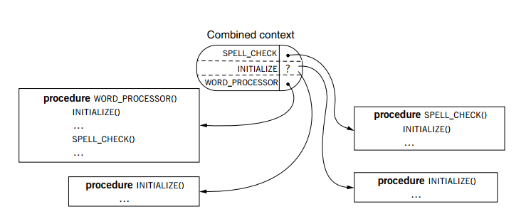
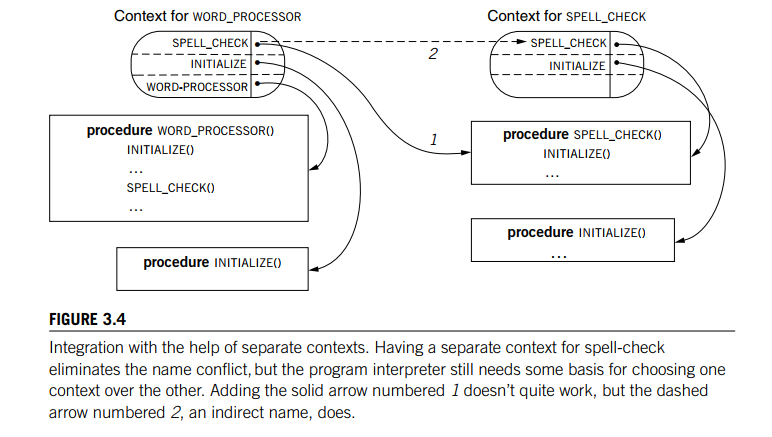
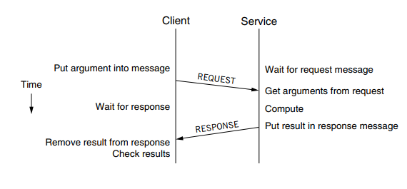
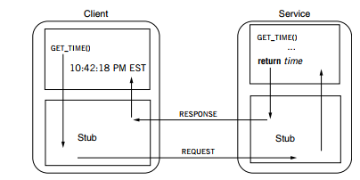

# 计算机系统设计原理

## 1 系统

系统（飞机）、组件（引擎、座椅）、环境（乘客）、接口（乘客所感受到的服务）

系统之间各个组件的数量、连接方式、以及组件自身特性形成了系统的复杂性，新增需求（引入新组件）的速度小于系统复杂性的增长速度。

会增加系统复杂的设计：

* 过度追求通用性
* 消除扩展不相称
* 需求
* 追求提高利用率（收益递减）

如何处理复杂性：

* 模块化（但是要注意正确模块化，保证只修改一个模块而不是同时修改多个模块）
* 抽象化：也叫功能模块化，把一个模块用它的功能抽象方便用户理解和使用
  * 抽象化要注意鲁棒性原则（可以接受较广类型的输入数据，但是输入数据要规范，避免错误在模块中传播）
  * 安全边界：与鲁棒性相互影响，输入不满足某个规范的安全范围就要开始修正

* 层次化：模块之间的互联模式的选择
* 分级化：组织模块的方式，将模块组成子系统，子系统组成系统。
* 命名&延迟绑定：一个模块通过另一个模块的名字来调用它，此时不一定需要实现另一个模块而是假设其已经存在，等到真正调用时再将模块和它的名字绑定。
* 迭代开发：先实现简单功能，后面再完善

## 2 计算机组成

三种基本抽象：存储器、解释器、通信链路

### 2.1 基本抽象

**存储器**

读写两种操作；易失性存储器和非易失性存储器；存储器通常读写一段连续的存储单元

两个重要属性：

* 读写一致性：从一个存储单元读出的值等于最近一次写入的值
* 前后原子性：读写一个存储单元时没有其他对这个单元进行的读写操作

下面这些场景会引起这两个属性的一些问题：

1.并发 2.远程存储（需要判断哪个远程设备最近） 3.对性能的提升（编译器会打乱一些指令追求性能提升，从而破坏一致性） 4. 副本问题（存储副本增强读写并发度，但是涉及到副本和原本的一致性问题）5. 多个存储单元情况下，对一个单元进行读操作时却有其他任务对另外一个单元进行写操作，导致读出的是混合数据。

存储延迟：读写操作需要的时间

命名和寻址：存储空间划分为若干单元，每个单元一般是连续整数。可以使用关联存储器的设计方式建立高层名字和底层存储单元编号的映射，比如高速缓存，传入一个name，它就会把这个name映射到具体的地址里。

存储器抽象实例:RAID系统（一个控制器+N个磁盘，可以实现并发读写）

**解释器**

抽象为3个部分：

* 指令引用：保存下一条指令地址
* 指令表：从这个表中查询一个指令具体要做什么事情
* 环境引用：解释器执行执行时所处的状态

图2-5讲述了指令的执行流程，一旦出现中断，那么指令引用和环境引用可能会被修改，解释器会处理中断事件对应的新的指令序列，也会修改环境引用。

解释器是异步的，它们所依赖的时钟独立，而且速度也不同。

解释器例子：CPU。它的指令引用是PC，环境引用包括一组寄存器、内存。

解释器层次：对于某个java写成的app，它这里涉及到3层解释器，从顶往下的层次分别为：应用程序对于用户鼠标来说就是一个解释器，这是最高层次的解释器，解释用户行为——java解释器——硬件

**通信链路**

包含send、receive两种操作

通信链路典例：以太网、Unix管道

### 2.2 计算机系统命名

命名的用途：

* 值传递和引用传递，比如f()需要变量x，值传递的方式导致很难通过f修改x的值，引用传递可以传入x的名字，这样在f内部可以修改x。
* 延迟绑定：一个名字可以代表多个实现，等到具体使用时再确定使用哪个版本的实现（类似多态，运行时确定类型）

如何命名：使用命名模型，命名模型包括3部分：名字空间、值空间、将名字和值绑定的名字映射算法(命名方案)。

一个系统中会使用多种命名方案，遇到一个名字时如何选择命名方案？取决于上下文，不同上下文使用不同的命名方案，即value = resolve(name, context)。比如代码块就是一个上下文，变量a在不同段中对应不同的值。

命名方案涉及的行为：绑定（将名字和值绑到一起）、解绑定、枚举（以列表形式给出当前上下文中所有名字——值的映射）、比较（比较名字是否一致）

命名模型例子：CPU中寄存器的代号(eax等)就是其名字，它的值就是数字，映射算法使用硬连线实现。

上下文：分为显式上下文（由对象提供）和默认上下文（解析器提供），上下文用于如何解析一个名字，如果名字里或者对象本身提供了一个显式上下文信息那就使用这个信息，否则使用环境里的默认上下文。比如解析一个文件，名字为a.txt，那么就会寻找当前路径下的a.txt，这里的默认上下文就是当前路径；C://a.txt就会到C盘寻找这个文件，此时的上下文为C盘，它是显式上下文。

解析名字的3种方式：

1. 查表。
2. 递归解析。某些名字包含路径，如usr/bin/a，其中a被称为最低有效组件，usr/bin是显式上下文，解析这个路径时使用的方式说递归解析，先解析usr，再解析bin，最后解析到a，路径本身也是要被解析的对象。路径提供了两种类型的默认上下文，一种是绝对路径（从全局根目录开始），一种是相对路径。
3. 多重查找。为增强灵活性，使用多种默认上下文，一个名字可以在不同上下文出现，解析时遍历所有上下文去解析名字，返回最先被解析出的值。使用场景为编译器在不同函数库中查找一个函数，尽管存在同名函数查找错误的风险，但是这种通过遍历去查找的方式使用广泛。有些查找具有层次性，会一层一层去找，比如找不到就到另一层，比如沙箱安全机制。

比较名字：对于两个名字，比较的内容可以根据需要包括以下3个方面：要比较名字本身是否相同，比如amy和bily这是两个名字；进而比较两个名字绑定的值是否相同，如两个a，可能一个为10，一个为4；最后比较它们的存储位置是否相同，修改一个另一个是否会变。

名字发现：给一个对象命名后，如何让别人知道这个名字进而使用它？一个名字被发现，包括：公认名字（大家都知道它，要用它就会找到它，比如点外卖就会到meituan，这就是公认的名字，以及保存根目录的DNS服务器）、查询、查询广播（ARP协议根据ip地址查询到我们需要知道的MAC地址）、解析等。

你要知道某个名字必须建立在已知其他一些名字的基础上，比如你想知道目标MAC地址你必须先知道ARP协议这个概念然后才会利用它去查MAC地址，我们对名字的知识是一种递归过程、知道一个然后才能去知道另一个、在设计名字发现方案的时候，要注意这种递归必须是有尽头的，不要出现回路。

### 2.3 名字+层次结构

计算机系统分为3层：软件系统层——OS——硬件，应用层并非完全依赖OS去操作硬件，os只对应用层隐藏危险的操作硬件的指令，有些情况下应用层可以直接操作硬件。

**硬件的三个抽象**：

解释器：CPU处理器；存储器：随机访问1存储器模块；通信链路：IO模块

IO模块本身就是特殊的IO程序解释器，如磁盘控制器这一IO模块就是磁盘IO程序的解释器。

处理器、IO模块、存储设备这些模块都有总线接口，通过总线连接到一起。

总线的特征：

* 共享，连接各种模块，分为数据线、地址线和控制线。
* 总线仲裁协议，各个模块通过总线传递消息，发消息时可先通过协议独占链路然后再发
* 广播链路：所有模块都可以收到消息，模块先检查地址是不是自己的，如果是就接受数据

总线地址：每个连接到总线上的模块都有总线地址，为保证性能，每个内存模块假设有1024个存储单元，每个单元对应一个总线地址。

总线收发消息：

* 各个模块必须知道其他模块的总线地址，可以把模块的总线地址写入到对应的处理软件中，这个软件会在总线上把地址信息传播出去。
* 分离传送：数据线传递数据、地址线传送总线地址、控制线发控制信号。
* 收发消息过程：模块A给模块B发消息
  * 模块A通过控制线给总线仲裁协议发消息请求独占总线
  * 请求批准后，模块A把消息放到数据线，把B的总线地址放到地址线。如何模块B和总线的时钟周期一致（同步），也就是说A把这些消息放到总线后B就立刻能收到；但B和总线异步时，A就要在一条控制线上发消息给B，告诉B消息在总线上了。
  * B收到消息，发现地址总线上的地址就是B，那就把地址和数据线上数据复制到其内部的寄存器，通过另一条控制线（没有被A独占的）给A发ACk消息、
  * A释放总线

一般的IO设备和内存之间的数据交换都要通过处理器，为提升性能，一些磁盘实现了DMA技术。比如要把磁盘数据读到内存，处理器把内存地址和read请求发给磁盘，磁盘直接把数据发到内存而不是经由处理器再发到内存。此时总线上数据传输此时由两次降为一次，而且处理器也可以处理其他事务。

内存映射IO：磁盘控制器可能在总线上就对应一个总线地址，这时候可以像把总线地址分配到具体内存单元那样，直接给磁盘控制器的寄存器和缓冲区们分配总线地址，那么操作磁盘的时候可以像对内存使用Load和store那样的方式去操作磁盘寄存器。书的例子先把数据加载到4个普通寄存器，然后从执行普通寄存器和磁盘寄存器之间的store操作，通过这种方式来操作磁盘。但是要注意如果给磁盘中每个单元都分配总线地址的话可能会耗尽总线空间（32位空间），而且磁盘的load和store操作可能更费时，导致出现其他情况。

**软件层面的抽象**

以文件来抽象，文件具有持久性，有名字两个特点。

文件的API：

* open:打开文件，给文件设置一个临时名字检查权限，设置文件指针
* read:从read文件指针开始读取固定字节的内容并返回，移动read文件指针作为下一次的读取起点
* write：参数为缓冲区和缓冲区长度，将缓冲区数据从write指针处写入文件，移动write指针
* close：释放在操作文件所需的一些内部状态

文件和文件名字通常保存在磁盘中，文件系统必须知道文件所存储的位置并且能够根据名字定位到文件，这里使用的名字发现方法是在磁盘中设置一个特别的扇区，在这里保存其他文件的信息。

open和close有什么用呢？为什么不直接用read和write？

1. 文件名很复杂，open方法在早期被设计的原因是它会解析文件名，然后将其转为一个临时简单名，这样read和write就不用再解析了，同时可以把权限检查都放到open中而不是read中，减小开销。
2. close是简化资源管理，每个应用程序操作文件时都会维护各自的文件指针和内部状态，这些东西有什么用？这可以实现了程序操作文件的安全性，比如应用A正在读写文件、应用B把文件删除了，此时不影响A对文件的读写。一个程序一旦执行了close操作，那么就表示这个程序不需要再维护这些资源了，此时释放即可，如果把这种过程放到read和wirte里，那就会比较麻烦。
3. 在open和close里加入一些机制把文件操作变成原子性操作，比如两个应用都要访问一个文件时可以利用open阻止并发性的访问；完成close后所有修改都将保存到文件中，即使断电也不会丢失。

### 2.5 UNIX文件系统

Unix文件系统具有层次结构，这些层次分为面向硬件的和面向用户的，这些层次堆叠形成文件，Unix采用持久对象命名方案将文件名映射到文件，层次分为：

* 块（标志磁盘块）：
  * 最底层的可持久存储数据的设备，磁盘空间分配的最小单位——扇区就是块，块太大了会造成浪费，块太小了会需要更多空间记录块的分配情况。块名一般为距离起始块的偏移量，根据块名查找块。块的名字发现算法基于超级块。在超级块中记录哪些块空闲或正在使用，一般磁盘第0块存储启动OS的小程序，第1块就是超级块。现代OS使用bitmap记录块的使用情况，它在磁盘上的位置位于超级块和inode表中间。
  * block_num_to_num(i)：给定块号i，返回第i号磁盘块
* 文件层（将磁盘块组织为文件）：
  * 有些文件需要占用多个磁盘块，由此形成文件块。unix使用inode记录文件的元数据。inode是一个结构体。
  * 在第六版Unix中，inode内部包含文件大小(字节)和组成文件的底层块号数组block_numbers，数组元素是文件内容所在的块号。若文件第一块的块号为1033，那么block_numbers[0]= 1033。对于块数大于8的文件，会转而使用B树等结构存储块号序列（和hashmap有点像）。在书上给的例子中，inode.block_numbers也是存储在块里，块大小为512B,块号大小为16位(2B)，存储block_numbers的前7块为间接块（保存块号），第8块为二次间接块（保存间接块块号），如果一个文件涉及到的块号前7个块装不下，那么就会用第8个块，只不过第8个块记录的是保存存放文件块号的地址。这些总共可以存储7\*256 + 256^2=67328个块号，保存67328\*2^9，近似为2^25的数据。不过保存inode.block_numbers应该不用8个块，因为第6版Unix规定文件最大offset为3字节，所以一个文件最多6个块。
  * index_to_block_num(i,x)：给定inode i，给定文件所占的第x个磁盘块，返回第x个磁盘块的块号。
  * inode_to_block(off,i)：给定inode i，给定文件的第off个字节，返回第off字节所在磁盘。
* inode编号层（为文件指定面向机器的名字）
  * 给所有inode分配inode号，记录在存储在固定位置的inode表中，inode号也是连续整数，inode表维护每个inode的状态（是否空闲）。
  * inode_num_to_inode(x)：返回第x个inode
  * inode_num_to_block(off,x)：返回第x个inode对应的文件第off个字节所在磁盘
* 文件名层（人机接口）
  * 这里就涉及用户了。inode号不好记，所以每个文件、目录都有一个inode号，通过文件名来隐藏元数据。文件的字符串名字和它的inode号在哪绑定？文件所在的目录。一个目录会在其存储空间内维护它下面子文件和它们inode号的对应关系（表），或者说一个目录的存储空间包括这种映射表。inode有一个域type，标记它是否为目录、文件、或者连接。
  * 在一个目录下创建新文件，首先文件系统会为这个文件分配一个inode，并且在目录的存储空间内将文件和分配的inode号绑定。写入文件时，文件系统为inode分配块。
  * Look_up(file,dir):file是文件名，该方法的目的是查询目录dir下某个文件对应的inode号。它代表目录的inode号，该方法会在dir对应的目录的每一个存储空间内去搜索file并查询其inode号。
* 路径名称（将文件名组织为名字层次结构）
  * 路径有很多层，以斜线/划分。
  * path_to_inode_num(path,dir)：在当前目录wd下，查询一个子路径path(path是相对当前目录的子路径）对应的inode号。比如path=usr/a，dir为根/对应的inode号，查询path对应的inode号，方法使用递归实现，先查出usr的inode号，在将其作为dir，去查询path=/a的inode号，当路径不存在/时，调用上面的look_up查询最终的inode号。
  * 改变工作路径的实现：chdir(path)，这里path是要切换到的目录（位于当前目录下）wd为一个状态值，代表当前目录的inode号，那么只要把wd设置为path对应的inode号，这样就实现了切换。这种切换是从当前路径向其子路径切换，好像没法切换到当前路径的同级目录中（至少实现上是这样的）
  * 连接：有些文件路径名很长，为防止拼写长长的路径，可以给这个文件起一个别名，这就是连接。使用LINK(path,a)就是给path起个别名为a，同时在a所在的工作目录下会多一组映射(a,inode_num(path))，如果a已经存在了会报错。即别名a对应的inode号就是path的inode号。执行UNLINK(path,a)，就会在a所在的工作目录下删除映射(a,inode_num(path))，同时a本身也会被删除（注意，删除a这个别名和删除文件本身不是一回事）。引入连接之后，一个inode号可以与许多文件名绑定，所以在inode结构体中存在一个成员refcnt，维护与这个Inode绑定的文件数量。执行一次unlink操作，unlink中的别名被删除，同时文件的refcnt减一，当没有文件与这个inode绑定即refcnt减为零时才能删除成功。连接是相互的，是同一个文件的两个别名。
  * 引用计数成果的关键：不存在回路。Unix不允许对目录创建连接，原因就是有可能造成回路。a是目录，b是a下子目录，现在给a创建一个连接c:Link(a,a/b/c)（书上例子有问题，应该第一个参数是a，给a创建c这个别名），那么c就是a，形成回路a/b/a/b/a/b......。a对应的inode的引用计数为2。现在执行Unlink(a)，a这个目录被删除了，但是a对应的inode的refcnt为1，也就是说a的inode还没有被回收，如何才能使其回收呢？执行UNLINK(a/b/c)，但是a这个别名现在已经被删除了，没法找到c，a/b/c这个命名网络在a那里断开了，a这个inode就算回收不了了。unix为防止出现这种情况，直接禁止为目录创建连接，因为这样的连接很容易导致回路，再删除目录时命名网络会中断，但是对文件创建连接是安全的，因为文件本身就是命名网络末梢，没法形成回路。实际上，在删除目录时，向刚刚例子里那样a下还存在b时是无法删除a的，unix规定只有一个目录它的下级目录都被删除时才可以被成功删除。
  * 每个目录包含一个指向自身的连接：'.'。所以目录被创建时其inode.refcnt=2。一个是自身一个是'.'。比如目录a的上级目录会维护(.,inode(a))和(a,inode(a))两个映射。
  * 每个下级目录使用'..'作为指向上级目录的连接。a/b，在b的存储空间中存在('..',inode(a))这个连接。
  * rename操作把文件原名字x改成y，第六版unix实际上执行的就是三步 1:unlink(y) 2:Link(x,y); 3:unlink(x) unix系统的文件编辑过程会调用unix提供的rename：比如修改文件a，先创建一个副本#a，在#a上修改，最后调用rename将#a重命名为a。这样的话rename第一步会直接删掉原来的a，然后让a指向#a的文件，最后接触#a与文件的绑定，修改完成。但是存在1 2之间机器挂了的情况，此时旧文件a没有了，但是新文件#a名字还没有改过来。所以要把rename设计成原子性的。书上也给出了没有原子操作支持时给出的弱化的rename方法，实现原理大意是：假设inode(a)=100,inode(#a)=101，a和#a位于同一目录，首先rename直接操作文件内部结构，在a的目录上把(a,100)修改为(a,101)，然后删除(#a,101)。如果两个操作之间出现崩溃了（是之间不是之前也不是之后），恢复之后立即把101的refcnt加上1，因为此时a也是指向101的，不加上1那么删除(#a,101)时文件也被删除了。这个过程很像第2步和第3步，但实际上并不是直接调用 2:Link(#a,a); 3:unlink(#a) ，而是修改底层文件结构实现的，书上只是用这两步来抽象一下因为大意差不多，而且不经过第1步直接调用Link(#a,a)是不可以的，此时原文件a和副本#a都存在，不能拿一个已经存在的名字作为其他文件的别名。
* 绝对路径名层（提供名字层次结构的根）
  * 文件系统提供根目录作为全局上下文，根目录对应的inode号为1。第7版unix可以通过chroot修改根目录，比如可以把某个服务器的/tmp设为根目录，那么该服务器上的应用只能在/tmp内进行，根目录设为/tmp的inode号，对/tmp执行..还是指向/tmp。
* 符号连接层（使用符号连接集成多个文件系统）
  * 挂载mount，unix自己有自己的文件系统，对于外部磁盘，比如u盘之类的，unix无法识别其文件结构，所以使用可以把U盘挂载到unix的某个文件目录下，比如u盘sdb，挂到/dev/sdb-1下，那么unix文件系统就可以使用/dev/sdb-1/xxx访问u盘的内容了。此时/dev/sdb-1/aaa就是/sdb/aaa，sdb等价于sdb-1。挂载点的所有信息都保存在内存上，关机之后，挂载失效。
  * 挂载的实现：mount("/dev/fd1","/flash")，将设备/dev/fd1挂载到/flash上。执行umount操作，/flash的内存inode不再维护/dev/fd1的信息。第一：在/flash的内存inode中通过type=SYMLINK表示这个目录是一个文件挂载点，挂载点的inode中的block_numbrs记录的是挂载到它上面的磁盘设备(/dev/fd1)的路径；第二：在/flash的内存中记录设备(fd1)及其根目录(/)的inode号；第三：在/dev/fd1的内存inode中记录它上级目录dev的inode号。
  * 符号连接：/flash位于原机，它有基于机器上的inode号；/dev/fd1是u盘的文件，它有基于u盘上的inode号。首先挂载之后，/flash和/fd1看起来就是一个文件了，但是没有办法在两个不同的物理设备上将一个设备上的inode号绑定到另一个，所以unix使用别名实现文件名和另一个文件名的绑定。SYMLINK可以实现别名，如/flash被挂载后它的type就变成了SYMLINK，/flash就成为了/dev/fd1的一个别名。对文件挂载点执行Look_up方法时，会根据type判断出它是挂载点，通过其中保存的根目录inode号，执行Look_up(/dev/fd1,inode(/))，这里/是指/dev/fd1的根目录。从/dev/fd1的根路径开始查找fd1的inode。这样就可以从原系统/flash访问被挂载上去的文件/dev/fd1的内容了。
  * 与硬连接的区别：link(x,y) ,y是x的硬连接，x和y绑定同一个inode号，在x和y的父目录会维护x、y和inode号的映射。unlink(x)，x消失了，但是文件没有消失，因为还存在y和文件的绑定。mount(x,y)，y是x的软(符号)连接，y的inode的block_nums记录的是x的路径信息，如果x被删除，那么y成为悬空引用。

文件系统API：

* open：打开一个文件，返回这个文件的描述符fd。每个进程创建后默认打开3个文件：标准输入(fd:0)、标准输出(fd:1)、标准错误(fd:2)，再打开其他文件时会使用其他描述符。
* 一个文件可以被多个进程使用：如多个进程可以向显示器输入数据。每个进程维护自己的读写游标，如果一个进程A获取了另一个进程B传来的文件描述符，那么A、B共享读写游标。父进程创建子进程时就会把其所有打开的文件描述符传给子进程。
* 全局文件打开表：位于文件系统内存中，以表的形式记录所有被打开文件的信息(inode号、游标记录等)以及打开此文件的进程计数，是按文件描述符排列的表。比如(index:10,file_inode_num:55)，这里表示文件打开表第10行是inode号为55的文件。
* 文件描述表：进程独有，文件描述符在全局打开表中的索引。父进程创造子进程时，会把其文件描述表的每一项都复制到子进程的文件描述表中，它们指向文件打开表相同的表项，实现了文件共享。
* open的实现：进程open一个文件时，把这个文件的inode号插入到全局文件打开表中，插入到第x行，然后把读写游标置为0，此时表中多一个记录(index:x,inode_num,游标位置:0，引用计数:1)。在进程的文件描述表中查找到一个没有使用过的文件描述符fd，在文件描述符中维护文件描述符和文件在文件打开表中的映射(fd,index:x)。也就是说，一个文件被不同进程打开时都会在打开表中插入一个记录，它们位于不同的索引，进程通过记录到它的文件描述表中的这个索引定位到这个记录进而操作文件，移动游标。对于子进程，它根据从父进程的传下来的索引也可以定位到父进程能定位到的文件记录。
* 一个进程close一个文件时，在进程的文件描述表移除对应表项，在全局文件打开表中把这个文件项对应的引用计数（打开表中的引用计数，不是inode中的）减1。如果文件打开表中以及没有这个文件的表项，且inode的refcnt为0，这个inode会被释放。

shell与路径搜索：

unix的shell默认从环境变量中获取上下文，比如编译某个程序 

cc x.c

这里的c语言编译器cc就是从环境变量中找到的。如果自己也研发了一个cc编译器，如何在编译时指定使用我们自己的编译器呢？

./cc x.c

首先切换到cc的工作目录，然后在前面加上./，表示是当前目录的cc编译器，这种格式的命令会绕过环境变量（优先级高于环境变量），我们一般不在环境变量最前面加上.(这样的话以后搜索时都优先从当前路径搜索，然后再到环境变量中其他变量那里去搜索)，因为这可能让我们用不了unix系统提供的一些功能。

## 3 命名方案设计

### 3.1 命名方案设计的考虑因素

**模块化共享**

模块化共享导致解析命名冲突：当模块A和模块B中都有方法f时，对于程序解释器来说，如何确定f的上下文是在A中还是在B中？一种解决思路是为不同的模块创建不同的上下文，图3-1中把多个模块中出现所有名字以表结构组织，作为多个模块组合的上下文，



如上图3-1，这种方式的好处在于遇到一个名字后查询这个combined context然后知道这个名字的实现，但是会出现两个模块的重名问题，比如initialize，两个模块都有这个方法。

如何改进呢？

* 采用图3-2的方式，不把不同模块的上下文都统一到combined context中了，而是为模块A和B设置独立的上下文，这样倒是不会出现命名冲突，但是一旦涉及到跨模块函数调用时，比如模块A调用模块B的spell_c方法时得找到模块B的上下文，或者让模块B的上下文暂时覆盖当前模块A的上下文去解析spell_c，需要实现这部分逻辑。

* 图3-3的方式，给模块A和模块B的方法加一个指针或索引，比如w_p方法，不仅让它在上下文部分的名字指向它，而且还要让它新增设的指针指向它在上下文部分的名字。这样涉及到修改模块的实现部分，而有些模块不是可以修改的

* 图3-4可以看作是对3-2的扩展，增加了3-2中跨模块调用的处理逻辑，模块A要调用模块B，那就在A的上下文中增加一项去指向B的函数。那么是让它指向B的上下文表（间接引用）还是直接指向B的具体实现（直接引用）呢？

  ```
  //model A
  void w_p() {
  	s_c();
  	f();//A 中的f()
  }
  //model B
  void s_c() {
  	f();// B中的f()
  }
  ```

  看这个例子，A和B中都有f()，但是实现不同。我们这里把上下文具象为目录,model A的w_p()方法位于A/w_p文件中，model B的s_c方法位于B/s_c中，那么两个f分别位于A/f和B/f中。让A中的上下文的s_c项指向B中的实现时，相当于直接从B/s_c中取出s_c执行，但是当前依然位于A目录，执行到f()时会执行A/f中的f()而不是B/f的f()，出现错误；让A中的上下文的s_c项指向B中的上下文中的s_c而不是具体实现，那么执行s_c时会先cd B切换到B的上下文目录，这样f就是从B/f取出的了，可以正确执行。下图1就是指向实现的，2是指向另一个模块上下文的。

  

涉及到模块化共享时，要注意

* 独立的上下文（防止出现冲突）
* 间接引用而不是直接引用（执行哪个函数就切到哪个函数的上下文环境）

把一个对象的上下文引用连接到这个对象，可以选择构造一种结构体，这种结构体内包含1:原始对象2：该对象的上下文，这种结构体称为闭包。

阮一峰闭包：http://www.ruanyifeng.com/blog/2009/08/learning_javascript_closures.html

```javascript
　　function f1(){
　　　　var n=999;//加上var是局部变量，没加上var是全局变量
　　　　function f2(){
　　　　　　alert(n);
　　　　}
　　　　return f2;
　　}
　　var result=f1();
　　result(); // 999
```

f2就是闭包，它是函数内的函数，它可以读取外部函数f1的局部变量，它的上下文(f1局部变量)和它连接到一起。f1内部的所有局部变量，对f2都是可见的。但是反过来就不行，f2内部的局部变量，对f1就是不可见的。这就是Javascript语言特有的"链式作用域"结构（chain scope），子对象会一级一级地向上寻找所有父对象的变量。所以，父对象的所有变量，对子对象都是可见的，反之则不成立。

**把元数据加入到名字里**

一个文件存在元数据，比如它的名字和上下文都是元数据，代表文件对象的信息。

文件系统如何保存文件的元数据？一种策略是在记录文件物理位置（物理位置也是元数据的一种）以及提供读写、更新元数据的接口的位置保存文件的元数据。这样元数据和文件本身的物理位置就不在一起了，可以让那些不关注元数据的应用程序直接去操作文件、忽略元数据。

元数据重载：有时文件名会携带元数据，这在书中被定义为对名字元数据重载。比如a.txt的txt表明了文件类型这一元数据信息，a_2009_10_01包含文件的创建时间。与元数据重载的名字相对的是单纯名字，里面没有元数据信息，从单纯名字里面无法解析出元数据。

元数据重载的好与坏：包含元数据的名字与单纯名字相比更脆弱，有时一旦要对元数据进行修改，那么这个名字也要改，进而使用这个名字的所有模块也要做出对应修改，比如C:/a移到D盘之后，原来的名字就不能用了，而单纯名字因为没有元数据所以不受修改元数据的影响；多模块传递名字时，如果一个模块知道如何解析一个元数据重载后的名字，比如看到后缀是txt就会自动调用对应的程序去解析，那么这个名字对这个模块来说就是透明的，没必要特意处理这个名字；如果不知道如何解析名字上的元数据信息，那么这个名字对这个模块来说就是不透明的，必须为这个名字增设一些逻辑，单纯名字除了对专门解析名字的模块透明，对剩下其他模块都不透明。

**地址**

对象的地址也可以看作是对名字的重载，根据地址可以直接定位到对象。

地址这种名字很脆弱，一旦移动之后可能会涉及到相关模块大规模的改动，为解决这种问题，可以使用间接层。即一个文件的地址先映射到间接层，然后再从间接层改写为另一个名字给用户使用，底层地址不论怎么更改，通过间接层提供给用户的名字不变。

如果不使用间接层，那么剩下的解决方案为：1.开发者搜索所有旧地址并修改2.用户发现地址更改之后自行搜索3.让新旧地址都和这个对象绑定（地址可回收和可再分配时这种方案很麻烦）4旧地址提供重定向到新地址的逻辑

不包含地址信息的单纯名字为定位到对象增加难度，没法通过名字直接寻址了，此时只能通过枚举和搜索的方式去定位对象了。

**名字的唯一性**

保证名字的唯一性的策略：1.制定为新对象生成名字的明确方案（如自增主键、时间戳），新对象的名字不会和旧对象相同。2.在一个足够大的空间中随机生成名字3.如果一个对象内容可以转为二进制，根据这个内容为其生成唯一的名字，如数字签名等4.权威机构分配，如MAC地址就是每个以太网接口制造商生产的网卡有不同的MAC地址前缀，生产商再自己决定后面部分的地址，保证MAC地址的唯一性。

**面向用户的名字**

一些命名方案是方便用户使用的，便于用户记忆，由于不同用户可能会取相同的名字，所以这种名字上的模糊性不是由系统来区分而是由用户来区分，每个用户自己知道自己是什么名字。此外，系统会给这种名字加一个唯一的标识符，类似微信名（用户友好）和微信号（唯一）。

**名字与绑定**

当名字是从一个有限空间中选取时（比如11位手机号），那么命名方案就要实现分配和去分配功能，比如把某个名字分配给某个用户，某个用户注销之后回收名字，之后把这个名字分配给新用户。

一个名字的寿命可能会比它所分配的对象寿命长，比如一个用户注销之后这个名字还会继续使用。在名字空间无限的情况下，再访问这个对象可能会得到一个not found。在名字空间有限的情况下会把这个名字分配给一个新用户，如果再使用之前的名字会访问到错误的对象。

当对象本身比名字寿命长时，比如某个对象的引用，引用解绑时对象依然存在，当没有引用可以定位到这个对象的时候，这个对象就成了孤儿，就引起了存储泄漏。一些系统会跟踪文件引用数，当没有任何引用可以定位到文件时，这个文件会被当作垃圾收集，空间也会被释放。

### 3.2 url

**网页的名字发现**

用户如何发现万维网上的资源？可以使用底层的统一资源定位符(面向万维网）和顶层的易于理解的超链接（面向用户）。用户浏览页面时，根据自己的需求点击超链接，如：[点击这里下载]()。它的底层是html标签，标签里就是这个文件的url

```
<a href="http://xxx....">
```

url路径的“协议:”后的部分可以看作是要访问的服务器上保存资源的文件路径，但是这种绑定有时会出现问题。

* 服务器上的资源存在连接：

  home.html存储在服务器A的a/www目录下，然后在a下建立一个符号连接a/home.html作为a/www/home.html的连接，那么一下两个url都可以访问到home.html

  ```
  http://A/a/www/home.html
  http://A/a/home.html
  ```

  假设home.html中有指向另一个位于a/www/c.html的超链接<a href = "c.html"\>，浏览器获取到home.html的页面之后，用户再点击这个超链接去访问c.html，那么浏览器会把当前url去掉最后一项home.html作为当前超链接的上下文，和这个超链接拼到一起形成新的UrL，如果是通过第一个url访问的home.html那么当前url就是http://A/a/www/c.html，此时是可以访问到c.html的，但是用的是第二个url，此时新的url http://A/a/c.html就会抛出Not found。

* url中使用..

  比如在a/下存在p.html，且在home.html中指向a的超链接为\<a href = "../p.html"\>。www是a的下级目录，home.html通过这个链接可以定位到p.html。..在文件系统中表示上级工作目录，在url中出现的..最后会除去它前面那一部分的目录，修改上下文。如http://a/b/../c会除掉b，把a作为../后面部分的直接父目录，变成http://a/c。那么如果是通过上面第一种url访问的home.html，再去访问p.html时拼成的url是http://A/a/www/../home.html，最后变成http://A/a/home.html，可以访问到p.html，但是第二种url就不行了。

对于这种问题的解决方式：

* 要么一个文件使用连接了，在其工作目录下的所有文件都使用连接，比如上面的也给c.html在a/下设置连接；要么禁止使用连接。最后，禁止使用在超链接中使用..。（在维护上下文可用性上做努力）
* 客户端把当前url发给服务器，委托服务器决定使用什么上下文，比如在服务器中增设逻辑，处理客户端发来的url，服务器可能会对这个url进行搜索，对于http://A/a/home.html那就在http://A/a/下搜索c.html，如果没有再去搜索其下一级目录，直到搜索到c.html为止。（在上下文选择上努力）
* 服务器在和客户端交互的http头部中放置一个明确的当前文件的上下文引用传给服务器，比如客户端要访问p.html时把A/a/p.html这个路径发给客户端，客户端根据这个目录拼接成合理的url发出访问（提供明确的url）

**url的重载**

url本身也会有各种形式的重载。

比如xx?k1=v1这种，在问号后提交一些信息；

## 4 客户&服务

模块化的目的是减少错误的传播，客户端——服务端是更强的模块化机制。客户端与服务端两个模块只能通过消息来交互，通过检查消息可以限制错误的传播。

### 4.1 客户/服务组织方式

#### 4.1.1 为什么需要强制模块化

软模块化的例子：函数调用。

A函数需要调用B函数获取它运行时必备的信息，A和B实际上就可以视为两个模块。函数的调用需要遵守过程调用规范，比如调用者和被调用者彼此不能破坏各自得栈空间，调用者得参数需要保存到哪些寄存器上，如何恢复栈空间等。一旦违反了这个规范就会出现问题。

软模块化并没有对模块之间的交互提出限制，不同语言也未必总是遵守过程调用规范。如java，c#这种类型安全的语言会遵守调用规范，而C，C++并没有强制遵守严格的调用规范。这表明软模块化并不安全。

所以我们不能仅依靠变成编程语言实现模块化，还需要外部机制实现**强制模块化**

#### 4.1.2 客户&服务组织方式



函数调用会把参数放在寄存器和栈中(见csapp笔记)，客户服务组织方式把参数放在请求中。

客户/服务的组织方式的优点在于：

* 两者不共享数据，只通过消息进行传递，防止彼此修改私有数据
* 可以对消息进行检查，防止错误的传播，降低了同命效应(fate sharing一个模块出错另一个模块必出错)
* 有利于定制清晰、规范的接口

什么时候使用服务端-客户端组织形式：

* 两个模块需要共享数据时(耦合程度高)，不建议使用
* 分成两个模块后无法降低同命效应的，不建议。
* 服务故障恢复计划，有些有必要考虑服务间的故障恢复，有些无需故障恢复，只要好好设计一些函数增强鲁棒性即可。书上提供的平方根函数的例子，就无需设计成服务。

服务端可视为客户端的一个可信中间方：客户端之间彼此不信任，但是服务端会为每个客户端提供服务并保证它们互不影响。服务端/客户端架构可以简化客户端功能。

服务/客户的设计方式的缺点在于，服务端失灵了，客户端就不能正常运行了；还有一种P2P设计方式，没有服务端，每个客户端都是平等的节点，一个节点出故障了依然全局可用。

### 4.2 RPC(远程过程调用)

measure函数会调用gettime函数，如果把gettime作为一个服务方放在与measure不同的机器上，measure调用本地的gettime，此时gettime不是实际的函数而是一个桩(stub)，桩会把gettime及其参数以请求的方式发送到gettime服务所在的机器上，将执行结果作为响应返回。



RPC和普通过程调用不同：

* RPC比普通过程调用需要考虑更复杂的情况，比如网络故障，服务器故障之类
* RPC设计到网络传输，比普通过程调用需要更多时间

比如RPC涉及到的常见错误为服务器没有响应，RPC选择3种策略处理这种情况：

* At least once：没用响应就不断发请求，直到收到响应或达到最大请求次数(服务需要是幂等的)
* At most once：最多发送一次请求，没响应立刻报错(转账问题使用)
* At exactly once：理想状态，很难保证。需要服务方和客户端谨慎保存错误信息，一旦一次请求没用返回，客户端发一个查询请求(不是原来的请求)查询上次请求的状态，

RPC要注意：比如在传递参数时传递的是本机的一个地址，然而这个地址在另一个机器上保存的是其他对象。

RPC可引入通信中间方，它承担一个缓存作用，缓存发送方的消息，接收者在线或方便的时候可用主动在中间方拉取消息，使得发送和接受方不必同时在线。通信中间方可用解耦发送方和接收方，比如过滤消息，发送方只需把消息发给中间方，中间方决定消息该发送给哪些接收者。(消息队列的基本原理)

### 4.3 网络文件系统(NFS)

不同的计算机用户(工作站)有时需要共享文件，可以把共享文件放在共享服务器上，每个用户通过NFS系统访问共享服务器来获取文件。


