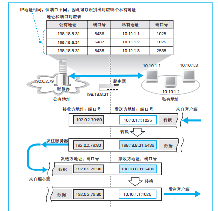
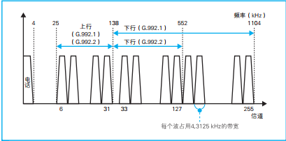

# 网络是怎样连接的

## 1 浏览器

第一章架构图如下：


涉及到作者输入网址以及浏览器和Web服务器、DNS服务器之间的交互过程。

### 1.1 http请求消息

**URL**：统一资源定位符，在浏览器中输入这个然后到互联网上查找资源，格式为：

协议(http,ftp)://服务器名(web,ftp):端口号/文件路径

http://www.jkloli.com:80/dir/korea.html

有时候文件名会被省略，此时访问的是我们实现设置好的默认文件名。

**http:**访问web服务器使用的协议，分为两个要素：操作对象、怎样操作。

* 操作对象：URI（URL中文件部分）

* 常见的操作方法：
  * GET：获取URI指定的信息
  * POST：此时URI指向web服务器中的应用程序，向应用程序发送数据（一般通过表单）
  * 还有HEAD、PUT、DELETE等

http请求消息格式： 请求头 消息头 空格 消息体

```
<操作方法> <URI> <HTTP版本>
<字段名>:<字段值>

<消息体>
```

http响应消息格式：状态行 消息头 空格 消息体

```
<HTTP版本> <状态码> <响应短语>
<字段名>:<字段值>

<消息体>
```

HTTP的头字段分为通用头（请求响应均可用，如Date请求和响应生成日期）、请求头（请求消息附加信息头字段如User-Agent用户信息）、响应头(响应消息附加信息头字段，如Location消息具体位置)、实体头（消息体使用，如Content-Type消息体数据类型）

状态码：1XX(告知请求处理进度),2XX(成功),3XX(需要进一步操作)

有时候访问一个网页内有许多图片：

```html
<body>
    <h1>
        一段话
    </h1>
    
    
</body>
```

请求到这个网页的html文件后，遇到图片时会为图片在屏幕上预留位置，然后再次向web服务器请求位于src指定的路径下的图片，把src作为请求URL。

每个请求消息只能指定一个URL，所以网页和图片是分开请求的，上例中一共向web服务器发送了3次请求。

### 1.2 DNS服务器


计算机通过集线器连接到一起形成子网，子网通过路由器相连形成网络。

IP地址：网络号+主机号

子网掩码：1...(32位)...0，将子网掩码和ip地址与运算，得到的就是这个ip地址的网络号。

ip地址中主机号全为0表示整个子网，全为1表示广播地址，子网所有设备都会收到消息。

DNS的作用：把域名解析成ip地址。

操作系统中有Socket库，库里有一个组件叫DNS域名解析器，它可以视为DNS客户端，负责像DNS服务器发送查询ip地址的请求，浏览器通过执行以下方法调用解析器，传入域名，把返回的ip地址放入指定内存地址中：

```
<内存地址> = gethostbyname("域名")
```

gethostbyname内部包括：

* 生成查询消息
* 向DNS发送查询消息
* 接受响应消息

等环节。

操作系统内部的协议栈通过UDP协议和DNS服务器传递数据。

NS服务器内部持有域名和ip地址的对照表，根据域名返回合适的ip地址，当然一台DNS服务器保存所有域名也是不可能的，全世界的DNS服务器按照域名分层次结构来保存。

对于http://www.jkloli.com这样的域名，

首先是根域，它是com之上的，最顶级的域。它是http://www.jkloli.com.后面的那个.，只是一般忽略这个.，根域DNS服务器持有保存com域的DNS服务器的信息，上级域DNS服务器都知道保存下级域DNS服务器的位置，最后找到保存整个域的DNS服务器。所有DNS服务器都知道根域DNS服务器。

查找域名的过程如下图所示：


可以在DNS服务器中通过缓存加快响应。

### 1.3 协议栈收发数据

浏览器向web服务器收发数据通过Socket委托操作系统内部的协议栈，各种网络程序收发数据也需要通过Socket委托操作系统内部的协议栈。收发数据需要按顺序调用Socket组件。

使用Socket库去收发数据相当于在数据发送方和接收方之间建立了一个管道，管道两端数据出入口就是套接字。创建管道的流程为：

1. 服务端启动，服务端应用程序调用socket让协议栈创建套接字，返回这个套接字对应的描述符（描述符是为了让应用程序识别套接字的，而不是让另一方识别套接字的）。
2. 客户端启动，客户端应用程序调用socket让协议栈创建套接字，而且协议栈会为这个套接字分配一个端口号。
3. 客户端应用程序调用Socket中connect组件，connect需要提供套接字描述符、服务器的ip地址(通过前面的DNS获得)和服务器端口号(这个一般是默认的，web是80号端口，电子邮件是25号端口)，并且在连接过程中把客户端的端口号发送给服务端，（ip地址和端口号是为了让另一方识别套接字的，而不是让应用程序识别套接字的），连接成功后协议栈会把对方的ip地址和端口号保存到套接字中。
4. 通信：客户端应用程序调用write，将要发送的数据从内存中取出让协议栈发送给服务器，
5. 通信：服务器接受数据并响应
6. 通信：消息返回时客户端调用read把消息放到接受缓冲区（内存一部分，位于应用程序内存空间中），应用程序取出数据
7. 服务器调用close断开连接
8. 断开操作传达到客户端
9. 浏览器（应用程序）调用read时，read告知应用程序收发数据结束，应用程序也调用close断开连接

同一台服务器多次执行断开操作效率低，HTTP1.1可以在一次连接中收发多个请求和响应，而且客户端在收发结束后会主动断开连接而非由服务端断开连接。

## 2 协议栈&网卡

第二章总层次图：


### 2.1 创建套接字

应用程序调用socket创建套接字时，协议栈内会分配一个内存空间保存这个套接字的控制信息，控制信息包括通信对象的ip地址、端口号、通信状态(establing、listening)。这些控制信息是给**协议栈**使用的。然后将这个套接字的描述符返回应用程序。此后应用程序委托协议栈收发数据时只要提供这个描述符就可由使用这个套接字了。

windows中可以使用netstat显示当前活跃的套接字。

### 2.2 连接服务器

应用程序调用connect(描述符，服务端ip地址和端口)，执行连接操作。

刚刚创建的套接字不知道通信对象是谁，应用程序调用conncet方法时指定通信对象。然后协议栈中的TCP模块会在数据上加上TCP头部，里面包含要与通信对象交换的控制信息，这些控制信息是给**通信对象**用的。

TCP头部长20字节，包含以下几个重要内容：

* 发送方、接受方端口号（由于识别套接字）
* 序号（告知接收方这个数据相当于总发送数据的第几个字节）
* 确认号(ACK)
* 控制位：ACK(为1表示数据被接收到)、SYN(相互确认序号)、FIN(断开连接)
* 窗口（告知发送方还能接受多少数据）

TCP模块建立一个TCP头部，然后委托IP模块发送这个TCP头部（是的，这个头部后没有数据）。

第一次握手：数据送到服务器的TCP模块，根据头部的端口号找到套接字，写入相应信息，并将套接字状态改为正在连接。此时TCP头部SYN=1，序号为随机生成的x。

第二次握手：服务器返回确认数据，此时TCP头部SYN=1，ACK=1，序号为随机生成的y。客户端看到SYN=1后知道连接成功了，在套接字的内存空间写入服务器ip地址、端口号，同时将状态修改为连接完毕。

第三次握手：客户端返回确认的确认，ACK=1，序号为y+1

经过三次握手后连接建立。

### 2.3 收发数据

应用程序调用write将要发送的数据交给协议栈，此时会出现两种情况：

* 数据过小

  协议栈不会拿到数据就发，而是先把数据放到协议栈内部的发送缓冲区中，等攒够了再一起发，不然会导致网络效率下降。什么叫攒够了？1.当数据大小长度接近MSS时。以太网中一个网络包最大长度1500字节(MTU)，减去IP头部和TCP头部(40字节)，剩下的就是MSS(最大分段大小)，都是纯数据。等数据接近MSS时再发；2.时间，协议栈内部有一个计时器，达到一定时间就发出去。应用程序可以控制发送时机，可以指定"不填满协议栈直接发送"。

* 数据过大

  发送缓冲区的数据以MSS为单位拆分，计算出每一块数据相当于从头数第几个字节，分别放进每一个数据块中。

要发送数据的时候，在每一块数据前加上TCP头部，然后委托IP模块发送。

发送数据之后需要确认，这里的序号就是每块数据在全部数据中偏移，假设每块数据长度都是1460，那么第二块数据的序号就是x+1460(x是初始算出的、第一块数据的序号，不使用1是太简单了防止被攻击)，接受方确认后发回的第二块数据的确认号就是该数据序号+长度，这里是x+2920。对服务端发往客户端的数据也是这样，客户端对服务端做出确认。

TCP采用这种机制确认对方是否受到数据，在对方返回ACK之前，发送过的包都会保存在发送缓存区中，如果对方在一定时间内没有返回ACK，那就重新发送这些包。

TCP的这种ACK+重传网络包机制使得即使传输过程中出现错误也能够确保对方收到的数据是正确的，因此、网卡、集线器、路由器都没有错误补偿机制，一旦错误就直接把包丢弃了。

关于对ACK的等待时间，TCP采用了动态调整的办法，如果网络拥塞的话，会延长等待时间，否则缩短等待时间。

**窗口机制**

如果发送一个包之后等待收到ACK再发送下一个包效率太低，TCP采用滑动窗口的方式发送数据。接收方把数据放到接受缓冲区中，但是当接收方处理数据速度慢时，有可能导致数据溢出，此时接收方可以告知发送方剩余缓冲区的大小s，发送方知道这个s后接着发数据，发送量达到s时，知道接收方缓冲区已经满了，此时不再发送数据。等接收方取出数据，缓冲区又有空间的时候，再告知发送方剩余缓冲区大小，发送方接着发。

更新窗口的时机：接收方应用程序发出指令，从缓冲区取出数据时，此时缓冲区又有空间了，可以向发送方更新窗口大小。

发送ACK的时机：接收方收到数据，马上返回ACK。

实际上这两个事可以一起做，减少发送包的总量。要更新窗口或者发送ACK时先等一会，比如要发送ACK了，等一会，等到应用程序取出数据，准备更新窗口时，把更新窗口和ACK在一个包发出。

**接受响应消息**

服务端发回响应数据，最后保存到客户端的接受缓冲区中。客户端应用程序调用read组件从接受缓冲区读数据，如果没有数据那么read阻塞，有数据了接受。read组件的流程为：协议栈检查数据块和TCP头部确认是否有数据丢失，没有的话返回ACK。然后将**数据块**(不含头部)放到接受缓冲区，将数据块还原为原始数据，交给应用程序。

### 2.4 断开连接

当web服务器发送完响应数据的时候就会断开连接，当然协议栈允许任何一方先断开连接，这里说服务器先断开的情况：

第一次挥手：服务器应用程序调用close组件，协议栈生成包含断开信息TCP头部，FIN位为1。协议栈委托ip模块向客户端发送数据，服务器套接字内存空间会记录断开操作的信息。

第二次挥手：客户端收到这个信息后将套接字记为断开操作状态，返回一共ACK。然后应用程序调用read会来取数据。

第三次挥手：客户端应用程序收到所有数据后，调用close，生成一个FIN=1的TCP头部委托ip模块发送给服务器。

第四次挥手：服务端返回ACK

和服务器的通信结束后，客户端的套接字不会立刻删除，而是会等待一段时间。这样做的目的在于防止误操作。比如当客户端主动断开连接时，要进行四次挥手，此时客户端最后一次发送的ACK丢了，服务器没有收到之后又发了一个FIN，此时客户端已经断开连接之后又给之前那个端口分配了新的套接字。结果服务端发的FIN来了之后，那个新套接字会进入断开程序。

### 2.5 IP&以太网

IP模块接受上级模块(TCP、UDP模块)的委托发送数据，他会在数据前加上IP头和MAC头（是的、MAC头部也是它加的，实际上MAC头部属于底层以太网而不是IP模块的范畴，但是这样做的好处是网卡不用打包而是可以直接把包发出去了，减轻了网卡的工作，网卡只管发出去，不管上层是什么样的包，增加了网卡的扩展性）。

网络中有路由器集线器两种设备，它们分工不同：

* 路由器：按照ip协议传输包，根据ip地址判断下一个路由器(ip转发设备)的地址
* 集线器：按照以太网协议将包转发到下一个转发设备（集线器、路由器、主机）

ip模块加上ip头部和mac头部后，把包交给网卡，网卡会把这些由数字信息组成的包(0011101...)转换成光电信号，通过网线或光纤发出去，这些数据会经过网络中的集线器和路由器到达目的地。

接受包的时候，网卡会将光电信号转为数字信号，传递给ip模块，ip去掉mac和ip头部交给tcp模块。

**ip头部**

一共20字节，包括以下重要信息：

* 发送方、接收方ip地址
* 包的生存时间（没经过一个路由器就减1，到0时此包丢弃）
* 协议号(tcp:06，udp:11,icmp:01)

ip地址不是分配给计算机的而是网卡的，一块计算机有一个网卡时那么可以认为这个ip地址是计算机的，有多块时在填写发送方ip地址时就要确认使用哪块网卡发送出去。

我们可以使用计算机内的路由表来判断使用哪块显卡，windows使用route print命令查看路由表，该表保存目标ip地址(network destination）和发送包的网络接口(interface)的匹配关系。如果一个ip地址和network destination对应上了，那么就使用该行的网卡发送数据，发送方ip地址就填写网卡的ip地址，

**MAC头部**

一共14字节，包含：

* 接收方和发送方MAC地址
* 以太类型：(IP:0800、ARP:0806)

MAC地址在网卡生产时写入ROM里，生成MAC头部时，即使计算机中有多块网卡，把具体发送数据的网卡对应的MAC地址作为发送方的MAC地址。但是此时不知道对方的MAC地址。

此时可以使用ARP协议根据ip地址确认MAC地址，即在一个以太网（子网）内，使用广播把包发给所有设备，询问ip为xxx的MAC地址是多少，如果ip为xxx的对方和发送者在一个子网中，就会把它的MAC地址反馈给发送者。

实际中可以使用ARP缓存，就是把ip地址和MAC地址的对应关系保存在缓存里，这样就不用发很多个ARP包了。ip地址有时候会发生变化，所以需要定期清理缓存。

**以太网&网卡**

以太网3个特性：用发送方MAC地址识别发送方、用接受方MAC地址识别接受方、用以太类型识别包头部。

网卡会将ip包转成光电信号发出去，在以太网上传播。

在打开计算机os后，网卡驱动程序会对网卡进行初始化操作，并从网卡的ROM中读取MAC地址设置到网卡的MAC模块中(MAC模块负责数据收发、碰撞检测、重发)。ROM只是提供了一个MAC地址，真正起作用的是MAC模块的MAC地址，当然也可以通过配置的方式给MAC模块设置MAC地址，忽略ROM的。完成这些操作后的网卡可以等待IP模块的委托。

网卡驱动从ip模块获取网络包之后将其复制到网卡的缓冲区中，向MAC模块发起发送包的命令，MAC模块会在包头加上报头和起始帧分界符，尾部加上检验错误的帧校验序列。

**报头**：1010...(56bit)，连续的10交替出现，此时波形会规则地上下变化，它的作用是确定读取时机。通过测量这一波形的时间，判断比特信号的中间位置。

**起始帧界定符**：10101011(8bit)，最后读到11的时侯发现和前面的波形不一样，网卡会把最后的11后面第1个字节作为起始位置。

当后面数据出现连续个1和0时，对应的电压是一条连续的线，无法判断每个bit的界限在哪里，这时候可以加入时钟信号辅助判断：


时钟信号按照固定频率进行变化，可能是10M/bit，有可能是100M/bit；我们可以通过一定观察确定时钟信号的变化周期，所以我们一开始先发送报头而不是直接发送数据，目的就是为了先找到时钟频率的变化周期。知道时钟频率后，就可以根据c信号提取出b信号，再由c和b判断出a信号。

**帧校验序列/FCS(32bit)**：检查包是否因为噪声导致波形紊乱，数据错误等问题。它根据包从头到尾计算出的，如果包中有一个bit变了，那么计算出的FCS也不一样。接收方对接受到的数据计算FCS然后判断是否数据有没有错误。

**发送网络包**

有两种方式：

* 集线器的半双工模式（同一时刻只能进行发送或接受）
* 交换机的全双工模式（发送与接受并行）

半双工模式需要监听网线中是否有其他设备发送的信号，如果有。则等待信号传输完毕，然后发信号。在发信号过程中一旦有其他信号也在网线上传输了，那么就会发生信号碰撞，此时发送操作终止，发送方还会发送一段阻塞信号通知其他设备当前线路已经发生碰撞，所有发送工作会全部终止。此时会让发送方随机等待一段时间之后再发送，如果又碰撞了那么等待时间延长2倍，一旦重试10次还不行就报告错误。

开始发送信号时，MAC模块将数字信息转化为电信号，PHY或MAU将电信号转化成可以在网线上传输的格式。MAC将数字信息转化为电信号的速率就是网络的传输速率（每秒将多少数字信息转为电信息）。

**接受包**

半双工式以太网中，**一台设备发送的信号会到达连接在集线器上所有设备，信号不论是不是自己的都会传进来。**然后各级模块开始处理信号：

* PHY(MAU)将信号转成通用模式发给MAC模块
* MAC将信号转成数字信息，放到网卡的缓冲区中，然后检查FCS，看看数据传输过程中有没有被篡改，一旦有错则丢弃此包；继续检查MAC头部是否和该网卡的MAC一致，不是还丢弃，如果一致那就放进缓冲区中，接下来网卡会通知计算机收到一个包。
* 网卡向CPU发一个中断信号，然后CPU调用网卡驱动开始处理这个包，从缓冲区取出这个包，通过MAC头部中的以太类型判断协议类型，如果是IP协议就交给TCP/IP协议栈，其他协议就交给其他协议栈
* IP模块检查IP头部格式是否正确，检查IP地址是否是自己的地址。如果接受方是一个客户端计算机，但是却发现ip地址不是自己的，说明出现了错误，因为客户端计算机不负责转发包，不应受到ip地址不是自己的包。因此ip模块通过icmp消息将错误告诉发送方。如果没错误，ip模块将其转还原成原始的包，因为ip协议有分片功能，会将大包分解成小片在网络上传输，（后面路由器部门会解释为什么要分片）。分片的包在ip头部的分片偏移量字段显示当前片在包中的位置。同一个包的不同分片在ip头部具有相同的id，ip模块等到所有具有相同id的分片到达后将其重组为原来的包，交给tcp模块。
* tcp模块根据接收方发送方的ip地址和接收方发送方的端口号确定套接字，根据套接字中的状态进行相应操作。


路由器&集线器进行数据传递流程如下：

* 主机发的数据根据路由表提供的要先到达路由器r1，但是它不知道r1的MAC地址，所以先使用ARP协议得到r1的MAC地址，因为图中主机和r1在一个子网内，r1把它的MAC地址返回主机，主机加上目的MAC头:r1，目的ip地址:T,之后把包发给r1了。
* r1是转发设备，虽然数据的ip目的地址为T，但是r1的ip模块不会为此发送icmp，而是查询路由表，得知要去往T那么下一个合适的路由器是r2，于是它发送ARP协议查询r2的mac地址。由于r1,r2之间都是集线器，假设网线是半双工的，所以发送的信号会到达连接在集线器上的所有设备，会到达s1，会到达s2，最后到达r2。r2反馈它的MAC地址，r1将包的mAc地址修改为r2。
* r2的下一个目标就是T，与r1发给r2一样，将包的MAC地址修改为T，直接发过去。


### 2.6 udp

TCP的ACK和重发机制确保可靠性，但是有时候不用这么复杂。

* 当包数据很少时，只用一个包就能装下时，那就不需要tcp那样复杂的连接机制了，反正重传也不过是重传一个包。这就是为什么DNS用UDP，因为DNS包很短。UDP协议不管丢包，也不监控包，它只负责发包。可靠性是上层应用程序保证的，应用程序觉得对方没有回复就会委托udp重新发包。
* 对实时性要求高，比如音视频，因为这种场景下重发也没有意义。

UDP头部：

* 接收方、发送方端口号
* 数据长度
* 校验和（校验错误）

## 3 网线&网络设备

### 3.1 网线&集线器

集线器与网卡连接图：


网卡和集线器都有PHY/MAU模块，每个模块有发送线路和接受线路，以太网信号的本质是正负变化的电压，从+-两个信号端输出信号。每个PHY/MAU模块的线路都和RJ-45接口相连。两个RJ-45接口之间使用双绞线相连。网卡的PHY/MAU模块背后是MAC模块，而集线器有多个端口，每个端口都对应一个RJ-45和PHY/MAU模块，这些模块背后是中继电路。

**信号在网线中传输遇到的问题：**

* 失真。信号长距离传输时能量减弱、原本方形的波形变圆，甚至会出现0和1的误判
* 噪声。对于网线来说，由网线外设备（电机、显示器）散发的电磁波和网线内相邻信号线泄漏的电磁波（串扰）遇到信号线时产生的右旋电流对原本的电信号（也是电流）造成干扰，将两根信号线以双绞形式缠在一起，使噪声电流方向相反互相抵消。

**集线器将信号发往所有线路**

可以看到，上图中网卡发送端使用1，2针脚（直连接线），接收方使用3，6针脚（交叉接线），而另一端的集线器是反过来的，这可以保证两种互相收发数据。

PHY/MAU模块和RJ-45接口的连接方式分为MDI/MDI-X，MDI是直连的，即发送线路和接受线路就水平连到对应的针脚上，而MDI-X是交叉连的。发送线路连到MDI模式下接受线路所使用的针脚上。一般一个集线器有MDI和MDI_X的切换开关，在连接集线器时将一个设为MDI，一个设为MDI-X，两者可以用网线连起来。但是当两者都是MDI-X改不了时，可以使用**交叉网线**。交叉网线将发送和接受是反过来接的。这样两端的PHY/MAU模块的发送线路和接受线路可以使用RJ-45接口相同的针脚。因为这个性质，交叉网线也可以将两台计算机直接连在一起（计算机网卡使用的都是MDI）


集线器中信号通过PHY/MAU模块后会进入中继电路，然后**原封不动**的从**所有**端口（除了进来的那个端口）转出。

### 3.2 交换机

交换机结构：


交换机有多个端口，每个端口背后是PHY/MAU模块,PHY/MAU模块后面是MAC模块，MAC后是内存，然后每个内存都连接着交换电路。

交换机的端口很像计算机的网卡，但是与网卡不同，网卡收到MAC地址不是自己的包会将其丢弃，但是交换机会接受所有的包，不核对包的MAC地址，将包放到缓冲区中。交换机的端口不具有MAC地址。

交换机内维护一个MAC地址表，它维护MAC地址-端口号的映射，收到某个包，到MAC地址表中应该把这个包转发到哪个端口，然后通过交换电路把这个包从那个端口中发出去。发送的流程和网卡一样，MAC模块会监听线路上是否有其他信号，没有的话就发送，如果发生碰撞那就等待一段时间在发送。

交换电路结构：


如果想从2号口进的包发到7号口，那就把输入端2号口前六个开关水平相连，第7个竖直相连。

MAC表的维护：

* 收到某个包后，把这个包的mAC地址和从哪个端口进的记录到MAC地址表中，以后遇到要发往这个MAC地址的包就发往这个端口。

* 因为设备会移动，地址会过期。所以定期删除没使用过的地址表中的记录。

* 遇到从a端口收进来的包结果mAC地址表显示要发往a端口，直接丢弃这个包，这样做是避免以下情况，A要发给B一个包，结果因为交换机和集线器的影响，B会受到两次同样的包。

  

* 地址表找不到该发往哪个端口，此时会将这个包从除源端口外的所有端口传出去。

**全双工模式**

* 集线器：多台设备发送的信号来到集线器中，会混杂在一起，无法使用，这种情况是碰撞，所以集线器不具有全双工模式。
* 双绞线：发送和接受的信号线是各自独立的，不会发生信号碰撞。
* 网卡和交换机端口中的PHY/MAU模块、MAC模块：内部发送和接受电路各自独立，不会发生碰撞。集线器内也有PHY/MAU模块，但是内部的中继电路会出现碰撞。
* 交换机：可以同时进行接受和发送，支持全双工。

可以看到，这么多网络设备只有集线器不支持全双工，所以只要不使用集线器的话可以支持全双工模式的传输。全双工模式无需像半双工那样等到其他信号结束了再发送信号，发送接受可以同时进行，因此效率更高。

**自动协商机制**

不同网络设备之间可以彼此探测对方是否支持全双工，如果可以支持那么能支持多大的传输速率，而后双方会按照协商后的最大速率进行信息传递。

在以太网中没有信号传输时会填充一种脉冲信号，使以太网中经常有数据流过。脉冲信号可以检验对方设备是否正常工作，以太网设备网线接口周围有绿色的LED灯，他表示是否可以监测到脉冲信号，如果绿灯亮说明PHY/MAU、MAC、网线连接都正常。

以太网会使用一种特殊的脉冲信号告知对方自己支持的工作模式和传输速率，根据这个协商出一个最佳工作组合。设备A支持全双工/1000Mb/s，设备B支持全双工/100Mb/s，那么A和B之间就以全双工、100Mb/s传输数据。

交换机可以同时转发多个包（端口a把数据转给端口b时，其他端口都空闲，可用于转发包），而集线器会将包广播到所有端口，无法同时传递多个信号否则会发生碰撞，因此集线器的转发能力低于交换机。

### 3.3 路由器


路由器由转发模块和端口模块组成，转发模块类似于协议栈的ip模块（负责包的转发），端口模块类似协议栈的网卡（负责包的收发）。

路由器的端口可以支持不同类型的网络，安装了支持无线局域网的硬件，就可以支持无线局域网了，还可以支持ADSL、 FTTH  等网络、只要安装相应硬件。

路由器的每个端口都具有ip地址和Mac地址，它本身就可以是包的接收者而不是像交换机那样只负责转发包。

**路由表**  

路由器内维护一个路由表，根据路由表判断转发目标：


* 目标地址：可以是子网ip地址、经过路由聚合的子网ip地址、也可以是某一台计算机的ip地址。

  路由聚合，有时候某几个子网有共同的前缀，可以把它们聚合到一起，如下图B发往3个子网的包都需要A转发，那么为了在路由表中少记录些内容，可以在路由表中将这 3 个子网的目标地址合并成 10.10.0.0/16  ：

  

* 子网掩码：收到的包ip头部的目标ip地址要和子网掩码相与，得到的结果如果和该行的目标地址相匹配，那就将这个包转给这个目标地址。子网掩码的目的是在32位的ip地址中区分网络号和主机号，因为目标地址那一列记录的一般是一个子网的ip地址。像上面第四行就是一个ip地址，所以这里子网掩码就全是1，将包中目标ip地址的每一位比较无误后转给192.168.1.10这台计算机。

* 网关：如果路由表的网关列内容为 IP 地址，则该地址就是下一个转发目标；如果路由表的网关列内容为空，则 IP 头部中的接收方 IP 地址就是下一个转发目标。当包可以直接发送到最终接收方时，一般网关列是留空的。（*前面这段话是书上原文，这里提到的直接转发也不一定是下一步不经过路由器直接送到目的地，比如上面发往10.10.1.0这个子网的包就至少还需要A转发。只是网关如果留空的话，可以直接拿ip头部的目标地址执行ARP协议，得到下一步发往的MAC地址；没有置空的话，那就拿网关列中的ip地址执行arp协议，得到下一步的mac地址。*）   

* 接口：根据目标地址和子网掩码匹配到某条记录后， 路由器就会将网络包交给接口列中指定的网络接口（ 即端口）

* 跃点数：它表示距离目标 IP 地址的距离是远还是近。 这个数字越小， 表示距离目的地越近； 数字越大， 表示距离目的地越远。  

路由器维护路由表的方式：

* 由人手动维护路由记录  
* 根据路由协议机制， 通过路由器之间的信息交换由路由器自行维护路由表的记录 ，如RIP、 OSPC、 BGP 等路由协议 

**接受包：**

和网卡一样，PHY（ MAU） 模块和 MAC 模块将信号转换为数字信息， 然后通过包末尾的 FCS 进行错误校验，如果没问题则检查 MAC 头部中的接收方 MAC 地址， 看看是不是发给自己的包，如果是就放到接收缓冲区中， 否则就丢弃这个包。   

**输出端口确定：**

路由器接受MAC地址为发往自己的包，去掉这个包的MAC头部，查询路由表，为这个包加上一个新的mAc头部。

首先查询路由表，将子网掩码和ip头部的目标地址与运算后查看是否可以和路由表中目标地址列匹配上，一旦遇到多个匹配记录，选择：1.首先寻找网络号比特数最长的一条记录，网络号越长，主机号越短，范围越小有利于查找。比如192.168.1.10/255.255.255.255肯定比192.168.1.0/255.255.255.0  2.网络号相同，选择跃点数小的。      

此外，我们可以选择使用配置默认路由，因为要把所有转发目标地址都保存在路由表中也不现实，当找不到匹配路由的时候就会匹配到优先级最低的默认路由，如上面图中第5行子网掩码为0.0.0.0，说明需要匹配的网络号长度是0。在这一行的网关列写入接入互联网的路由器地址， 匹配不到其他路由时， 网络包就会被转发到互联网接入路由器。  

如果没有配置默认路由的话，一旦没有匹配记录，那么路由器会丢弃这个包同时向发送方发送icmp报文（不会像交换机那样从所有端口都传出去，因为路由器工作的网络环境就是互联网，规模远大于交换机的以太网。如果找不到目标地址就全部端口转发的话，会给互联网造成极大的压力。  

这里又使用了icmp，本书中两次使用了icmp协议，都和ip协议有关：

* 计算机中ip模块收到ip地址不是自己的包会向发送者发送icmp报文
* 路由器没有匹配的ip地址也会向发送者发送icmp报文

**发送**

发送前，要更新包ip头部的TTL（生存时间），将其减去1.TTL 字段表示包的有效期， 包每经过一个路由器的转发， 这个值就会减 1， 当这个值变成 0 时， 就表示超过了有效期， 这个包就会被丢弃。 

每个路由器都有自己的输入端口 ，有些端口MTU比1500字节大，可以发送包；有些比1500字节小，那就需要对这个包分片：


对MSS分片，加上新的ip头部和mac头部（这是协议栈中ip模块干的事，现在路由器也做这样的操作，路由器真是遵守ip协议的设备啊），同时在ip头部里更新用于分片的信息；遇到不能分片的网络包，会直接丢弃。

发送时先查询路由器中的ARP缓存，如果没有的话就使用ARP协议先确定MAC地址，然后加上mAC头部发送出去。

**路由器vs交换机**

路由器转发包是会加上mac头部。IP 协议本身没有传输包的功能， 因此包的实际传输要委托以太网来进行。 路由器是基于 IP 设计的， 而交换机是基于以太网设计的， 因此 IP 与以太网的关系也就是路由器与交换机的关系，路由器将包的传输工作委托给交换机来进行 。**理论上纯粹的路由器**是没有转发功能的，它应该加上mac头部后委托交换机转发，不过现在的路由器都内置交换机功能。

IP 并不是委托以太网将包传输到最终目的地， 而是传输到下一个路由器。 在创建MAC 头部时， 也是从 IP 的路由表中查找出下一个路由器的 IP 地址， 并通过 ARP 查询出 MAC 地址， 然后将 MAC 地址写入 MAC 头部中的， 这表示 IP 对以太网的委托只是将包传输到下一个路由器就行了。     

IP（路由器）负责将包送达通信对象这一整体过程，而其中将包传输到下一个路由器的过程则是由以太网（交换机）来负责的。  

**路由器的其他功能：**

* 地址转换

  ip地址分为不可重复的公网ip地址和允许重复的私有ip地址，私有ip地址包括10.0.0.0 ～ 10.255.255.255、
  172.16.0.0 ～ 172.31.255.255、192.168.0.0 ～ 192.168.255.255，一般不会给公有ip地址分配这个范围内的数，但是不同内网中却可以有各自的10.0.0.1，这样提高了ip地址的利用率。

  私有地址的存在涉及到私网ip和公网ip交互的问题：

  

  内网和公网之间存在一个路由器，它有公网ip，两者信息的传递要经过这个路由器，路由器承担了地址转换的功能。内网某台机器要发数据给公网，包到达路由器后会随机选择一个空闲的端口，将这个包的ip地址和端口号改为（路由器ip+端口），发到公网，同时把（路由器ip+端口）——（私有ip+端口）的对应关系保存到表中。收到公网返回的包之后，（公网目的ip肯定是发给路由器），路由器查表，将包转发给对应的内网机器。

  **改写端口号的原因：**增加内网ip地址数量，一个端口就能对应一个ip地址（一共几万个端口）；如果不使用端口号的话，那么内网有多少ip地址就得准备多少公有ip。

  保护安全：从上面的机制可以看出，内网机器不先主动访问外网，外网是无法访问不了内网机器的，因为路由器的表中没有对应记录。这样可以保证内网的安全，不会遭到外网非法入侵。希望能够从互联网访问公司内网，可以事先手动添加这样的记录 。一般用于外网访问的机器可以放在地址转换设备的外面并为它分配一
  个公有地址， 也可以将机器的私有地址手动添加到地址转换设备中。

   **包过滤：**路由器的另一个功能就是包过滤，对包进行转发时， 根据 MAC 头部、 IP 头部、 TCP 头部的内容， 按照事先设置好的规则决定是转发这个包，还是丢弃这个包。一般防火墙等软件就是利用这个原理防止非发入侵。   

## 4 接入网&运营商

子网内的网络包通过互联网接入路由器后，就进入了互联网 。我们至今介绍了两类路由器：1.以太网路由器 ，按照以太网的规则转发包 2.互联网接入路由器，按照接入网的规则转发包。接入网， 就是指连接互联网与家庭、 公司网络的通信线路 。 一般家用的接入网方式包括 ADSLB、 FTTHC、 CATV、 电话线、 ISDN 等。

### 4.1 ADSL接入方式

adsl(Asymmetric Digital Subscriber Line，不对称数字用户线。它是一种利用架设在电线杆上的金属电话线来进行高速通信的技术，它的上行方向（用户到互联网）和下行方向（互联网到用户）的通信速率是不对称的。  )接入流程图：


上图的几个关键点：

* 互联网接入路由器和 ADSL Modem 之间是通过以太网连接的 ，按照以太网的规则执行包发送的操作 。加上PPP、PPPoE、MAC3个头部。这里面3对应的MAC地址是互联网接入路由器的mac地址，它通过用户机执行ARP协议获取；5对应得MAC地址是BAS得MAC地址，通过PPPoE发现机制获取。然后按照以太网规则转换成电信号后被发送出去   。

* ADSL Modem 会把包拆分成信元，信元大小（5字节开头+48字节数据），用于ATM通信技术

* ADSL会将信元调制成信号，与以太网使用方形波号表示0、1不同（方波容易失真），信元使用正弦波表示0、1（这种技术就是调制），常用的调制方法：调幅、调相、正交振幅（一个振幅+相位可以表示两个比特，传输速率更大）

  

  

* 除了振幅、相位，频率信息也可以用于表示更多比特，我们使用不同频率的波表示不同的比特，ADSL 使用间隔为 4.3125 kHz 的上百个不同频率的波进行合成， 每个波都采用正交振幅调制， 而且， 根据噪声等条件的不同， 每个波表示的比特数是可变的。 频率越高的波噪声就越大，噪声小的频段可以给波分配更多的比特， 噪声大的频段则给波分配较少的比特。

  

  如图，总频率1104khz，以4.3125khz为一单位划分信道，一共255个信道，下行波被分配6-31信道，上行波被分配32-255信道，因为下行波频段多，所以速率快；但是也因为下行波频段高，受噪声影响大，因此这些频段可能只能表示较少的比特数 。当 Modem 通电后， 会发送测试信号， 并根据信号的接收情况判断使用的频段数量和每个频段的比特数， 这个过程称为训练（ 握手）， 需要几秒到几十秒的时间。     

* ADSL调制好波之后，将频率相对高的波**沿着电话线**和频率相对低的电话信号一起传递，分离器的作用是把电话和 ADSL 的信号进行分离，对于电话线来说高频的adsl信号是噪声，会影响电话信号，将其过滤掉。
* 信号到达电话局之后，最终到达DSLAM，它是ASDL的集成，这样就不用安装很多ASDL了。DSLAM 通过读取信号波形， 根据振幅和相位判断对应的比特值， 将信号还原成数字信息 ，以ATM信元的形式发送。DSLAM 和用户端 ADSL Modem 相比的不同之处在于用户端 ADSL Modem 具备以太网接口， 可以与用户端的路由器和计算机交互， 收发以太网包， 而 DSLAM 一般不用以太网接口， 而是用 ATM 接口，和后方路由器收发数据时使用的是原始网络包拆分后的 ATM 信元形式 。  

### 4.2 接入网使用的PPP和隧道

BAS是一个路由器，和接入网连接。

ADSL接入网需要先输入用户名和密码， 登录之后才能访问互联网， 而 BAS 就是登录操作的窗口。BAS 使用 PPPoE方式来实现这个功能。 PPPoE 是由传统电话拨号上网上使用的 PPP 协议发展而来的，     

PPP(拨号上网/ISDN上网)的工作流程：


​                                                                                    图4-2-1

* 用户向运营商的接入点拨打电话(1-1)，电话接通后(1-2) ，输入用户名和密码进行登录操作(2-2) 。   
* 用户名和密码通过 RADIUS协议从 RAS 发送到认证服务器， 认证服务器校验这些信息是否正确。
* 认证无误后， 认证服务器会返回 IP 地址等配置信息， 并将这些信息下发给用户(2-3)。用户的计算机根据这些信息配置 IP 地址等参数， 完成 TCP/IP 收发网络包的准备工作， 接下来就可以发送 TCP/IP 包了。2-3环节会为计算机分配公有ip地址。        

ADSL使用的PPPoE 与PPP一样，也是需要为计算机分配公有地址才能上网 。不过， ADSL中， 用户和 BAS 之间是通过电缆或光纤固定连接在一起的， 因此没有必要验证用户身份， 所以实际上并不需要 PPP 的所有这些功能。当然，ADSL实际还是会使用PPP的，因为通过用户名和密码登录的步骤可以根据用户名来切换不同的运营商 。

传输 PPP 消息的思路和将 IP 包装入以太网包中传输是一样的。 PPP 协议中没有定义以太网中的报头和 FCS 等元素， 也没有定义信号的格式， 因此无法直接将 PPP 消息转换成信号来发送。 要传输 PPP 消息， 必须有另一个包含报头、 FCS、 信号格式等元素的“容器”， 然后将 PPP 消息装在这个容器里才行。 于是， 在拨号接入中 PPP 借用了 HDLC协议作为容器， 而HDLC 协议原本是为在专线中传输网络包而设计的， 拨号接入方式对这一规格进行了一些修正。如下图所示：


​                                                                                     图4-2-2

ADSL并不能使用 HDLC，因此需要寻找另一个机制作为替代。 于是我们用以太网包代替 HDLC 来装载 PPP 协议。 此外， 以太网和PPP 在设计上有所不同， 为了弥补这些问题就重新设计了一个新的规格，这就是 PPPoE。PPPoE 是将 PPP 消息装入以太网包进行传输的方式。  

ADSL使用的PPPoE格式：


​																					图4-2-3       


BAS 和运营商路由器之间的 ADSL/FTTH 接入服务商的网络中建立一条隧道，隧道的作用是将包含头部在内的整个包从隧道的一头扔进去， 这个包就会原封不动地从隧道的另一头出来。可以使用TCP连接实现隧道，也可以基于封装的隧道实现方式：将包含头部在内的整个包装入另一个包中传输到隧道的另一端。

**ASDL接入网工作原理：**

* 用户端的互联网接入路由器中需要配置运营商分配的用户名和密码。
* 接入路由器会根据 **PPPoE 的发现机制**来寻找 BAS的MAC地址，这个机制和ARP类似也是使用广播，但是它是直接问BAS在不在，BAS收到之后把MAC地址返回 。
*  然后是用户认证和配置下发的环节，互联网接入路由器将用户名和密码已加密的形式传递给BAS。BAS校验无误后，将配置信息下发到互联网接入路由器的BAS端的端口上。配置信息包括分配给上网设备的 IP 地址 、 DNS 服务器的IP 地址以及默认网关的 IP 地址。 当使用路由器连接互联网时， 路由器会根据这些信息配置自身的参数。 这样一来， 路由器的 BAS 端的端口就有了公有地址， 路由表中也配置好了默认网关， 接下来就可以将包转发到互联网中了。 
* 客户端发送发往互联网的包。包首先到达互联网接入路由器，此时路由器的路由表中可能没有这个这个包目标地址的记录，那就发往默认路由；发送方式为PPPoE的方式： MAC 头部中接收方 MAC 地址填写通过PPPoE 发现机制查询到的BAS 的 MAC 地址， 发送方 MAC 地址填写互联网接入路由器的 BAS 端的端口的 MAC 地址， 然后以太类型填写代表 PPPoE 的 8864（ 十六进制）。接下来是 PPPoE 头部和 PPP 头部，再往后的部分就是包含 IP 头部在内的原始网络包。           

* BAS 在收到用户路由器发送的网络包之后，会去掉 MAC 头部和PPPoE 头部，然后用隧道机制将包发送给网络运营商的路由器。
* 地址转换：如果计算机是通过互联网接入路由器上网的，那么BAS 向用户端下发 TCP/IP配置信息会被分配到互联网接入路由器上，会给路由器分配一个公网ip，那么计算机会被分配一个私有地址，计算机发送的包需要通过路由器进行地址转换然后再转发到互联网中。有些程序会因为地址转换无法工作，因为需要将自己在公网的ip告诉对方，如果计算机只是分配到一个私有地址的话是不行的。所以这时可以不使用路由器， 而是直接让计算机接收来自 BAS 的 PPPoE 消息 ，这时候计算机就有公有ip了。 

### 4.3  互联网内部


互联网由多个运营商网络相连，ADSL等接入网是与用户签约的运营商设备相连的，这些设备被称为POP。POP里面是各种路由器。NOC 是运营商的核心设备， 从 POP 传来的网络包都会集中到这里，并从这里被转发到离目的地更近的 POP， 或者是转发到其他的运营商。POP 和 NOC 遍布全国各地， 它们各自的规模有大有小， 但看起来跟公司里的机房没什么太大区别。

对于互联网内部的路由器来说， 无论最终目的地是否属于同一家运营商， 都可以从路由表中查到， 因此只要一次接一次按照路由表中的目标地址来转发包， 最终一定可以到达 Web 服务器所在的 POP。进而通过与POP相连接入网转给目标地址。

运营商路由器的路由信息交换：让相连的路由器告知路由信息就可以了。这种机制就是BGP。


两个运营商之间仅将与各自网络相关的路由信息告知对方。 这样， 只有双方之间的网络可以互相收发网络包， 这种方式称为非转接， 也叫对等。

**互联网和子网路由交换机制的区别：**

子网内采用寻找与目的地之间的最短路由， 并按照最短路由来转发包， 因此， 周围的所有路由器都是平等对待的。

互联网中路由器涉及到缴费，某运营商的路由器只会转发给它交过费的运营商的包，没交过费的不转发，所以不是简单的最短路由。首先， 互联网中可以指定路由交换的对象。其次， 在判断路由时，该机制不仅可以判断是否是最短路由， 还可以设置其他一些判断因素。 例如当某个目的地有多条路由时， 可以对每条路由设置优先级。                        

**IX的作用：**不同运营商交换数据的中心设备，用于减少线路数量。


## 5 服务器端局域网

### 5.1 web服务器的部署方式

部署方式一共有3种：

* 直接部署在公司网络上，与服务器端的路由器相连（缺点1：IP 地址不足，这样的方式需要为公司网络中的所有设备， 包括服务器和客户端计算机， 都分配各自的公有地址。缺点2：从互联网传来的网络包会无节
  制地进入服务器，不安全。）
* 部署防火墙  
* 将web服务器放在网络运营商等管理的数据中心里， 或者直接租用运营商提供的服务器。（访问快，数据中心一般都有防火墙）  


### 5.2 防火墙

基本思路是只允许发往特定服务器中的特定应用程序的包通过， 然后屏蔽其他的包。实现方式为包过滤方式：

通过检查网络包头部的控制信息并设定过滤规则。   

过滤规则示例：


允许互联网的包发到服务器(ip地址为192.0.2.0)，但是不允许服务器的包访问互联网，所以：

* 允许起点为任意，接收方为服务器的包通过。接收方不是服务器的不允许通过。
* 此外还有端口号，web服务器不同端口对应不同应用程序，允许访问80端口的程序通过(http)，如果允许访问其他端口的应用程序的话有可能造成数据泄漏，所以不允许访问其他端口的通过。
* 还要注意3次握手时包的1传递。第三行阻止web服务器向互联网发送第一次握手的包（ACK=0，这样web服务器就不会主动和互联网建立连接，web服务器第二次握手的包不会被拦。）对于挥手的包，防火墙也不会拦截的，不论是谁先主动断开连接。
* 实际上也存在无法将希望允许和阻止的访问完全区分开的情况 。DNS 查询使用的是UDP 协议， 而 UDP 与TCP 不同， 它没有连接操作， 因此无法像 TCP 一样根据控制位来判断访问方向。 所以， 我们无法设置一个规则， 只允许公司内部访问互联网上的 DNS 服务器， 而阻止从互联网访问公司内部的 DNS服务器。 这一性质不仅适用于 DNS， 对于所有使用 UDP 协议的应用程序都是共通的。 在这种情况下， 只能二者择其一——要么冒一定的风险允许该应用程序的所有包通过， 要么牺牲一定的便利性阻止该应用程序的所有包通过 。（对于使用包过滤之外的其他方式的防火墙，有时候是可以判断 UDP 应用程序的访问方向的。  ）    

上图web服务器所在的公开区域和公司内网不在一起，我们需要谨慎设置互联网和公开区域之间、公司内网和互联网之间或公司内网与公开区域之间的包过滤规则。如果允许公司内网和公开区域的包可以自由流通的话，那么要对防火墙增加特别设置，防止某些包通过公司内网流窜到公开区域对公开区域的服务器产生影响。

防火墙会以日志形式记录被判定为阻止的包，用于分析入侵者使用的手法；防火墙本质上相当于路由器的附加功能，只是在一个路由器内承担记录日志功能太重，所以出现了专门的防火墙硬件和软件。如不需要记录日志的话可以使用一个普通路由器充当防火墙。

防火墙并非可以抵御所有攻击，它根据包的起点和终点来判断是否允许其通过， 但仅凭起点和终点并不能筛选出所有有风险的包，有些包中的数据可能会有问题，这就只能依靠修复软件的bug解决这一问题。

### 5.3 负载均衡

当请求量较大时，一台服务器是支持不住的，可以使用多台服务器，并且把请求均匀的分配到各个机器上。

**DNS实现负载均衡**：

客户端需要先向 DNS 服务器查询服务器的 IP地址， 如果在 DNS 服务器中填写多个名称相同的记录， 则每次查询时DNS 服务器都会按顺序返回不同的 IP 地址。  


如上图，同一个域名对应3个ip地址，第一次访问时返回的3个ip地址是以192.0.2.60为第一个，下一次以192.0.2.70为第1个，再下一次以192.0.2.80为第一个，这种机制叫轮询。

DNS实现负载均衡的方式很简单，但是有两个缺点：

* DNS无法感知服务器是否可以正常工作，可能将出现故障的服务器的ip地址返回
* 有一些跨页面操作，需要发两次独立请求，与同一台服务器建立两次TCP连接，如果使用轮询的话可能两次连接不会与同一个服务器建立。

**负载均衡器 ：** 

使用负载均衡器时， 首先要用负载均衡器的 IP 地址代替 Web 服务器的实际地址注册到 DNS 服务器上。 假设有一个域名 www.lab.glasscom.com， 我们将这个域名对应的 IP 地址设置为负载均衡器的 IP 地址并注册到 DNS 服务器上。 于是， 客户端会认为负载均衡器就是一台 Web 服务器， 并向其发送请求， 然后由负载均衡器来判断将请求转发给哪台 Web 服务器 。

负载均衡器首先判断请求是否跨页面，如果不跨页面，它定期采集 Web 服务器的 CPU、 内存使用率， 并根据这些数据判断服务器的负载状况， 也可以向 Web 服务器发送测试包， 根据响应所需的时间来判断负载状况。根据这些信息觉得把请求路由到哪个服务器上。

当请求需要跨页面时：

* 请求是独立的，在不知道请求之间的相关性时， 能不能根据一系列请求的发送方IP 地址相同这一点，将发送ip地址相同请路由到同一台机器上？不行，因为我们有可能引入代理，请求的发送方 IP 地址都会变成代理服务器的 IP 地址， 无法判断实际发送请求的客户端是哪个。此外还有可能有地址转换机制的影响。
* 只能从发送的数据本身着手。发送表单数据时在里面加上用来表示关联的信息， 或者是对 HTTP 规格进行扩展， 在 HTTP 头部字段中加上用来判断相关性的信息。        

### 5.4 缓存

可以将整个系统按功能分成不同的服务器 ， 如 Web 服务器、 数据库服务器。 缓存服务器就是一种按功能来分担负载的方法。缓存服务器是一台通过代理机制对数据进行缓存的服务器。 代理介于Web 服务器和客户端之间， 具有对 Web 服务器访问进行中转的功能。 当进行中转时， 它可以将 Web 服务器返回的数据保存在磁盘中， 并可以代替Web 服务器将磁盘中的数据返回给客户端。 这种保存的数据称为缓存， 缓存服务器指的也就是这样的功能。缓存直接从磁盘返回数据，无需执行Web 服务器需要执行检查网址和访问权限， 以及在页面上填充数据等
内部操作过程，因此速度更快，但是缓存会过期。

缓存服务器和负载均衡器一样， 需要代替 Web 服务器被注册到 DNS 服务器中。客户端会向缓存服务器发http请求消息，缓存服务器检查所请求的消息是否已经保存到服务器中，如果不在那就把这个请求转到web服务器中并且加上via字段表示这是经过缓存服务器转发的。转发时，如果一台缓存服务器对应多台 Web 服务器就需要根据请求消息的内容来判断应该转发给哪台 Web 服务器。可以根据uri确定要转给哪个服务器，比如uri为xxx/dir1时，转给www.a1这个域名；uri为xxx/dir2时，转给www.a2这个域名  。然后缓存服务器会以客户端的身份向目标 Web 服务器发送请求消息。 也就是说， 它会先创建套接字， 然后连接到 Web 服务器的套接字， 并发送请求消息。 从Web 服务器来看， 缓存服务器就相当于客户端。收到web服务器发来的响应之后， 缓存服务器会在响应消息中加上 Via 头部字段， 它表示这个消息是经过缓存服务器中转的， 然后缓存服务器会以Web 服务器的身份向客户端发送响应消息。 同时， 缓存服务器会将响应消息保存到缓存中， 并记录保存的时间。      


**正向代理**

缓存服务器使用的代理机制最早就是放在客户端一侧的， 这被称为正向代理 。

正向代理的作用是缓存和防火墙。要想使用防火墙保证阻止来自互联网的非法入侵，只能把所有的包都公司内网和互联网的所有包，这样公司内也访问不了互联网了。利用代理可以先接收来自客户端的请求消息，然后再转发到互联网中。代理在转发过程中可以查看请求的内容， 所以可以根据内容判断是否允许访问，这就比依靠ip地址实现过滤的防火墙要好得多。

正向代理的使用：一般需要在浏览器的设置窗口中的“代理服务器”一栏中填写正向代理的 IP 地址。在没有设置正向代理的情况下， 浏览器会根据网址栏中输入的http://... 字符串判断 Web 服务器的域名， 并向其发送请求消息； 当设置了正向代理时， 浏览器会忽略网址栏的内容， 直接将所有请求发送给正向代理。 请求消息的内容也会有一些不同。 没有正向代理时， 浏览器会从网址中提取出 Web 服务器域名后面的文件名或目录名， 然后将其作为请求的URI 进行发送； 而有正向代理时， 浏览器会 在请求的 URI字段中填写完整的 http://... 网址。

正向代理和服务器端的缓存服务器不同，正向代理服务器可以向任意web服务器转发请求，然而缓存服务器需要实现设置好转发目标 Web 服务器。

**反向代理**         

在浏览器设置代理很麻烦。我们可以通过将请求消息中的 URI 中的目录名与 Web 服务器进行关联，使得代理能够转发一般的不包含完整网址的请求消息。这种技术就是反向代理。我们前面介绍的缓存服务器就是反向代理。

正向代理：接受完整的http域名；反向代理：接受不完整的http域名，因为URI目录名与web服务器关联，只需目录名就知道应该发到哪个web服务器，这样看起来反向代理服务器好像在web服务器一侧，收到请求之后根据URI目录和web服务器的映射关系转发请求；而正向代理服务器在客户端一侧，需要在浏览器设置，转出的请求是一个完整的请求，web服务器不知道是代理发的请求还是客户端发的请求，两者从服务端视角看没区别。

**透明代理**  

透明代理：查看请求消息的包头部。 因为包的 IP 头部中包含接收方 IP 地址， 只要知道了这个地址， 就知道用户要访问哪台服务器了。

透明代理无需向正向代理一样，在浏览器中设置；也不用像反向代理那样（缓存服务器）事先绑定uri和要转发web服务器。那如何让消息到达透明代理呢？需要放在请求消息从浏览器传输到 Web 服务器的路径中， 当消息经过时进行拦截。不能像反向代理那样去设置透明代理，让透明代理代替web服务器注册在DNS服务器中、客户端通过ARP获取到的mac地址是代理服务器（缓存）的mac地址 ，这样代理就不透明了。透明代理会被放在连接互联网的接入网的位置上，用户不会察觉到透明代理的存在。

### 5.5 内容分发服务

缓存代理放置位置有讲究：

* 当缓存服务器放在服务器端时， 可以减轻 Web 服务器的负载，但无法减少互联网中的流量。流量大会在互联网引起拥塞，如果把缓存放在客户端一侧时，可以直接从缓存返回一些内容，减少了发往互联网的流量，客户端要访问什么东西时更加顺畅。
* 当缓存服务器放在客户端侧时，Web服务器的运营者无法控制它。当某网站的运营者觉得最近网站上增加了很多大容量的内容， 因此想要增加缓存服务器的容量时以免让请求大内容的请求全打到自己身上，他无法做到这一点。
* Web 服务器运营者和网络运营商签约， 将可以自己控制的缓存服务器放在客户端的运营商处，这样离客户端就近了，减少了一部分发往互联网的流量。互联网有许多和不同用户相连的POP，要把缓存服务器放在所有运营商 的POP中吗？不用。只需放在几个主要运营商的POP中，这样即使对于某些用户来说与它最近的POP中没有缓存，但是其他POP中有，而且离他比web服务器离他近。          


**寻找最近的缓存服务器：**

找到离客户端最近的缓存服务器，并且通过该缓存给客户端返回数据，可以提升效率。

方案一：使用DNS，在 DNS 服务器返回 Web 服务器 IP 地址时， 对返回的内容进行一些加工，使其能够返回距离客户端最近的缓存服务器的 IP 地址。客户端会向客户端侧的DNS服务器发送DNS请求，这个请求通过互联网内DNS服务器大接力到达web服务器一侧的DNS服务器。该服务器内保存web服务器的ip地址，然后将地址返回。


 如上图，互联网中不同位置的4台缓存服务器旁边有4台路由器，我们需要分别获取这 4 台路由器的路由表， 并将 4 张路由表集中到 DNS 服务器上。DNS 服务器根据这4张路由表查询从该路由器到 **DNS 查询消息的发送方**，也就是客户端 DNS 服务器的路由信息。估算出哪一台路由器距离*客户端 DNS 服务器*最近。提供路由表的路由器位于缓存服务器的位置， 而客户端 DNS 服务器也应该和客户端在同一位置， 这样就等于估算出了缓存服务器与客户端之间的距离， 从而能够判断出哪台缓存服务器距离客户端最近了。 实际上， 客户端 DNS 服务器不一定和客户端在同一位置，因此可能无法得出准确的距离， 但依然可以达到相当的精度。

最后把最近的缓存信息保存到DNS响应报文中。         

综上，方案一将最近的路由器通过DNS报文返回，它为什么不估算发送方的ip地址到各个路由器的距离而是估算它们与发送方DNS服务器的距离？因为服务端DNS服务器受到的包的ip头部的源ip地址不是客户端而是客户端一侧的DNS服务器，它受到的消息是客户端一侧的DNS服务器发过来的，客户端ip地址在数据部分，它只根据ip头部的源ip地址和去估算路由。

方案二：

使用HTTP中的location字段，它是重定向字段，当 Web 服务器数据转移到其他服务器时可以使用这个字段，将客户端访问引导到另一台Web 服务器。当使用重定向告知客户端最近的缓存服务器时， 首先需要将重定向服务器注册到 Web 服务器端的 DNS 服务器上。 这样一来， 客户端会将 HTTP请求消息发送到重定向服务器上。 重定向服务器和刚才一种方法中的 DNS服务器一样， 收集了来自各个路由器的路由信息， 并根据这些信息找到距离http消息中的发送方ip地址最近的缓存服务器， 然后将缓存服务器的地址放到 Location 字段中返回响应。


这种方式会增加http消息的交互次数，因为第一次http响应消息只是告诉客户端重定向信息，让客户端再一次发出请求去请求缓存中的内容。但是重定向的方法是根据客户端发送来的 HTTP 消息的发送方 IP 地址来估算距离的， 因此精度较高。  

方案二使用重定向服务器，基于http重定向机制，将最近的缓存服务器地址放在Location位置中返回。      

**高效率的更新缓存的方法：**

1. 让 Web 服务器在原始数据发生更新时，立即通知缓存服务器， 使得缓存服务器上的数据一直保持最新状态， 这样就不需要每次确认原始数据是否有变化了， 而且从第一次访问就可以发挥缓存的效果。

2. 一些动态页面不能保存在缓存中，但是可以把动态页面的静态部分保存在页面中，动态部分由web服务器的应用程序生成。

## 6 web服务器

### 6.1 概览

服务器与客户端功能不同。客户端：发起连接。服务器：等待连接。两者底层的网卡、协议栈、Socket库是完全相同的，但是使用方式不同。不同体现在：对于连接操作，一方发起连接（客户端），一方等待连接（服务端），如果两方同时发起连接是无法建立连接的。所以应用程序调用Socket库的方式不同。

服务端程序分为两个模块：等待连接模块和负责与客户端通信的模块。前者处理所有来自客户端的连接，遇到一个客户端的连接请求就启动一个与客户端通信的模块；后者和每一个客户端是一对一的。

服务端等待连接与接受连接流程：

```
=====等待连接模块==========
<描述符1> = socket();//创建套接字
bind(<描述符1>,端口号);//将端口号写入套接字中，服务器使用哪个端口在这一步确定，端口号根据服务器种类确定,web服务器使用80端口。
listen(<描述符1>);// 向套接字写入等待连接状态这一控制信息，此时套接字进入等待状态
<描述符2>=accept(<描述符1>);//一旦客户端的包到达，开始执行accept，先返回响应包开始接受连接操作。协议栈会给等待连接的套接字复制一个副本， 然后将连接对象等控制信息写入新的套接字中(描述符2)
=====等待连接过程结束，新套接字移交到客户端通信模块负责与客户端通信，等待连接模块继续保持等待状态==========
<数据长度>=read(<描述符2>,<接受缓冲区>);//接受数据
write(<描述符2>,<发送缓冲区>);//发送数据
close(<描述符2>);//断开拦截
```

这里涉及到一个关键点：

等待连接模块创建的客户端通信的模块与等待连接模块具有相同的端口号，这样的话对于客户端来说它无法仅凭ip地址+端口区分哪一个是负责对接它的套接字了。

这里使用的方法：通过客户端ip+客户端端口+服务端ip+服务端端口四个因素来确定套接字。

协议栈中维护一个套接字一览表，里面记录当前哪个程序在与哪个对象通信。


服务器从收到的包的tcp头部和ip头部中取出以上4个因素，到表中对比，确定这个包应该交给哪个应用程序，然后转交给该程序对应的套接字。（应用程序可以通过描述符确认它自己的套接字）。

### 6.2 服务器接受操作

**网卡MAC模块的工作：**

* 网卡接受到光电信号，在报头处测定时钟信号变化的频率，与时钟信号保持同步，然后按相同周期延长时钟信号，观察每个周期内电压的变化情况，确定该周期对应的数字信号。
* 根据包末尾的帧校验序列（ FCS） 来校验错误  ，不一致就丢弃。
* 检查 MAC 头部中的接收方 MAC 地址，接收者不是自己就丢弃。
*   检查通过后保存在网卡内部缓冲区中。

**网卡&网卡驱动的工作：**

* 网卡通过中断将网络包到达的事件通知给 CPU。CPU调用网卡驱动从网卡缓冲区中将接收到的包读取出来。根据 MAC头部的以太类型字段判断协议的种类并移交给对应得协议栈，比如IP协议那就调用 TCP/IP协议栈，并且把包交给它。

**IP模块：**          

* 检查 IP 头部的格式是否符合规范， 然后检查接收方 IP 地址，看包是不是发给自己的。如果服务器启用了包转发功能，会对包进行转发；否则发送icmp报文。
* 检查ip头部得内容确定是否分片，如果是分片的包， 则将包暂时存放在内存中， 等所有分片全部到达之后将分片组装起来还原成原始包；
* 检查ip头部协议号字段， 并将包转交给相应的模块。06就交给tcp，11就交给udp。      

**tcp模块：**

对于发起连接的包：

* 检查TCP头部中的控制位SYN是否为1，如果为1，tcp模块就开始检查包的接收方端口号， 并确认在该端口上有没有与接收方端口号相同且正在处于**等待连接状态的套接字**(等待连接模块的套接字)。 如果指定端口号没有等待连接的套接字， 则向客户端返回错误通知的icmp包。 
* 如果存在，则为这个套接字创建副本（执行accept方法），将发送方 IP 地址、 端口号、 序号初始值、 窗口大小等必要的参数写入这个套接字中，分配用于发送缓冲区和接收缓冲区的内存空间。  
* 生成代表接收确认的 ACK 号、用于从服务器向客户端发送数据的序号初始值y、表示接收缓冲区剩余容量的窗口大小。把这3个信息放到tcp头部中委托ip模块发出。然后服务端的accept方法挂起，等到返回客户端的ACK之后accept方法执行完毕，把新套接字描述符返回服务器应用程序。     

对于数据包：

* 检查包对应哪一个套接字（根据4要素到套接字一览表中确定套接字）
* 对比该套接字的数据收发状态是否和TCP 头部中的信息匹配。套接字保存根据上一个序号计算出的下一个序号并检查与收到的包的 TCP 头部中的序号是否一致，如果两者一致，就说明包正常到达了服务器， 没有丢失。
* 从包中取出数据放到接受缓冲区中，与上次收到的数据块连接起来。
* 数据放到接受缓冲区后，TCP 模块就会生成确认应答的 TCP并根据接收包的序号和数据长度计算出 ACK 号， 然后委托 IP 模块发送给客户端。
* 应用程序调用的read一直处于挂起阶段，数据进入缓冲区后read方法就会把它们读到应用程序中。             

对于断开连接的操作：

HTTP1.0规定服务端先断开连接，按照这个规则：

* 服务器程序会调用 Socket 库的 close， TCP 模块会生成一个控制位 FIN 为 1 的 TCP 头部， 并委托 IP 模块发送给客户端。
* 客户端返回ACK
* 客户端调用 close， 生成一个FIN 为 1 的 TCP 头部发给服务器
* 服务器再返回 ACK 号     

HTTP1.1规定客户端先断开连接，只要将上面的操作颠倒一下即可。

断开连接后套接字会保存一段时间再删除。

### 6.3 web服务器处理请求&做出响应

* 请求消息中URI中的目录结构并不与服务器磁盘目录结构完全对等，否则磁盘内容就暴露了。web服务器会进行文件名转换操作：/~user2/sub-user2/sample.html(URI)——>/home/user2/sub-user2/sample.html(磁盘)，web服务器从磁盘读取相应文件并返回给客户端。
* 如果请求的是html文件，那么直接将文件放在响应消息里返回即可。如果请求的是程序，那么服务器会委托操作系统运行这个程序并且从请求消息中取出数据交给程序执行，得到结果，一般都是把结果嵌入到html中返回。
* web访问控制：web服务器需要访问控制手段（比如只允许会员或某些部门访问），一般访问控制手段有：
  * 客户端 IP 地址 ，禁止某些ip地址访问
  * 客户端域名，禁止某些域名访问。要实现这一点，首先要使用DNS服务器根据客户端ip地址查询客户端域名。DNS可以实现根据域名查ip地址，也可以反过来。服务器收到客户端请求消息后，拿着发送方ip地址生成DNS查询报文，通过DNS接力到客户端所在区域网内查出这条ip地址对应的域名。然后，还要再次根据这个域名查询ip地址看结果是否匹配。两次查询的目的在于，客户端有可能在DNS注册假域名，所以服务器获取域名再查询一下确保域名和ip地址是对应的，然后根据规则决定是否允许其访问。
  * 用户名、密码 

最后返回相应消息：

* Web 服务器调用 Socket 库的 write，传入套接字描述符，将响应消息交给协议栈。
* 协议栈会将数据拆分成多个网络包， 然后加上头部发送出去。    

### 6.4 浏览器接受响应消息

判断响应的数据属于哪种数据类型：

可以根据响应消息开头的 Content-Type 头部字段的值来进行判断。

Content-Type: text/html ；/左边的表示数据大分类，text表示文本数据；/右边表示具体类型，子类型为html

当数据类型为文本时，还要通过charset指定编码类型：charset=utf-8  表示数据通过utf-8编码 ；

还要检查Content-Encoding头部字段，如果消息中存放的内容是通过压缩或编码技术对原始数据进行转换得到的， 那么 Content-Encoding 的值就表示具体的转换方式。Content-Type 字段使用的表示数据类型的方法是在 MIME规格中定义的， 这个规格不仅用于 Web， 也是邮件等领域中普遍使用的一种方式。不过现实中web管理员未必会严格设置Content-Type 的值。所以实际中我们也得采用其他手段去判断数据类型。

显示html文档：

浏览器根据标签显示html文档，如果遇到图片标签会在页面上预留出图片的位置然后按照图片标签上src的路径再次发送http请求去请求图片。        


  


