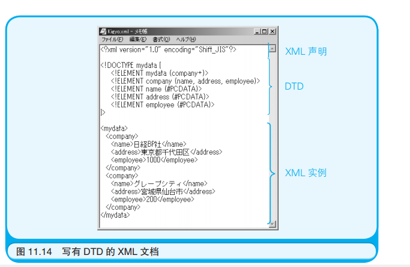
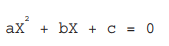
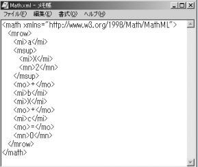

# 计算机是怎样跑起来的

## 第一章 

三原则：

* 计算机是输入、输出、运算的机器
* 程序 = 指令 + 数据
* 计算机思维 ！= 人类思维

计算机硬件由大量IC(Intergrated Circuit，集成电路)组成，每块IC上有引脚，有些引脚用于输入，有些用于输出

## 第二章

造一台计算机所需元件 : CPU 内存 IO(PIO)。（这三个都是IC的一种)

CPU需要的额外元件：时钟发生器（输出时钟信号、时钟信号每隔一段时间变换一次电压，信号频率衡量CPU运转速度）

问题1：时钟发生器有什么用？  

造计算机流程

* 1.首先给每个IC元件连接电源供电（cpu,内存这些都需要供电）

* 2.连接CPU和内存之间的地址总线和数据总线

  * 这两个总线在CPU和内存上都有，用于连接地址总线的引脚被称为地址总线引脚，假设CPU上有16个地址总线引脚，分别记为A0-A15(A:Address)，CPU要传一个16位的地址到内存，那么A0传最低位的那个bit，A15传最高位的那个bit，16位的地址通过16位的地址总线传到内存。可以看到，16个地址引脚所能决定的地址数为(2^16=65536个)

    问题2：16位地址总线可以确定32位的地址吗？（把32位地址分两次传递）

  * 数据总线用于传输数据，假设数据总线为8位，分为D0-D7连接到数据总线引脚上，假设要一次性输入16bit的数据，只能把这个数据分两次传进去。

  * 内存上可以划分位存储单元，一个存储单元大小是8bit（一字节），地址总线传输的就是存储单元的编号。

    问题3：一个有2048个存储单元的内存，如果只有8个地址引脚与CPU相连，地址的位数是10位还是8位？应该是8位，只有256个单元可用的话。

* 3.连接PIO：

  PIO中包含寄存器和端口，也有数据总线引脚。

  * 将PIO数据总线引脚和CPU的数据总线引脚相连。
  * 如果这个PIO有4个寄存器的话那么会有两个引脚和CPU的地址引脚相连，比如A0,A1，这样会组合成4个地址代表4个寄存器。

* 4.连接时钟信号

  把时钟发生器和CPU、PIO的CLK（时钟）引脚连接起来

* 5.连接用于区分读写对象是内存还是IO的引脚

  CPU的A0、A1同时与内存的地址引脚和CPU相连，如何区分是要访问内存还是CPU?

  将CPU的MREQ和内存的CE引脚连接，CPU和内存上有数据交换时，MREQ引脚的值为0，否则为1；

  将CPU的IORQ和PIO的CE引脚连接，CPU和PIO上有数据交换时，IORQ引脚的值为0，否则为1；

  将内存的CE引脚设为0时，此时内存可以和CPU正常通信；设为1时内存进入高阻抗状态，接入电路了也不会和CPU产生信号交换；PIO的CE引脚和IORQ同时为0表示PIO和CPU同时可以传递信号；同时为1表示出现高阻抗（PIO之所以使用这种两个引脚来判断的发生是因为使用多路IO）

* 6.连接用于区分CPU是读还是写的引脚
  * CPU、内存、PIO都有RD引脚，将CPU上的RD引脚和内存、PIO上的RD引脚连接起来，CPU的RD引脚为0表示正在执行输入操作，为1时表示没有再执行输入操作
  * CPU、内存都有WD引脚（为0表示输出，为1表示没在执行输出操作），

* 7.连接其余控制引脚
  * M1引脚（cpu和pio）：机器周期1引脚，用于同步
  * INT引脚（cpu和pio）：PIO向CPU发中断请求
  * RESET引脚（连到按键开关上，按下键连通电源）：用于重置CPU（重新从内存0号地址开始执行）
  * BUSRQ引脚：总线（连接到CPU数据引脚、控制引脚、地址引脚的总称）请求，连接CPU和总线缓冲器上，BUSRQ为0，CPU从电路中隔离，可以手动向内存写入程序(DMA)
  * BUSAK：BUSRQ为0后它的值自动变成0，只有确认BUSAK为0后才可以进行DMA

* 8.连接外部设备

## 第三章

### 3.1 机器语言汇编语言

时钟信号频率：时钟发生器发给CPU电信号的频率，单位兆赫兹（百万回/秒）。时钟信号就是一个0和1来回切换的电信号，发出一次01的时间记为一个时钟周期。

机器语言：0100010，就是由01组成的一个个bit，代表不同类型的命令，比如给某个寄存器的值加上几，

汇编语言：使用助记符，把机器语言用英文字符表示

汇编语言语法： [标签] 操作码 操作数

汇编语言例子：LD A,207  把207写到寄存器A中。

多个操作数之间用逗号分割

汇编语言和CPU的两个引脚MREQ和IORQ的关系：

* 执行LD命令（CPU读写内存），MREQ引脚值为0
* 执行IN/OUT命令（读写IO），IORQ为0

### 3.2 CPU寄存器

CPU和IO中都有寄存器，（CPU中能运算数据，肯定就得有个地方存数据），而CPU寄存器除了可用保存数据外也可以对数据进行计算（ADD A ,num:把num加到寄存器A上），寄存器可作为操作数。

几个经典寄存器例子：

* PC寄存器：程序指针，保存CPU接下来要执行的指令的地址，依靠时钟信号自动更新
* SP寄存器：栈顶指针，在内存中创建栈的区域

汇编语言解读：

例1：设置PIO的寄存器 （端口A寄存器、端口B寄存器）

```
LD A,207 #把207写入到CPU的寄存器A中
OUT (2),A #把寄存器A的值写入到地址2上，对应PIO端口A寄存器的地址，(2)表示地址2
LD A,255 #把255写入到CPU的寄存器A中
OUT (3),A #把寄存器A的值写入到地址3上，对应PIO端口B寄存器的地址，(3)表示地址3
```

* 问题1：为什么不直接写成OUT (2),207，而是非得走一下CPU的A

  回答：把一个数字读写到非CPU元件中时，那个数字必须已经存储在CPU中

* 问题2：LD A,207翻译成机器指令是什么样的？

  回答：00111110 11001111。其中00111110对应指令LD，11001111代表A。A哪去了？补充一下这里的寄存器A不是一个代号而是一个名字，A就是CPU中的累加寄存器，唯一的，所以汇编语言就把A省略了，反正LD reg,num命令代表把某个num写到CPU的寄存器中，这个寄存器一般就是A。

  同理 OUT (2),A里面也没A的事

* 问题3 ：地址

  将程序保存在内存，第一个内存地址为00000000，存放LD A,207，它的机器码占两个字节的内存，CPU先读到LD这个指令，然后把下一个数据207加到A上，两个字节的指令就这么被执行完了。接下来就从00000002开始读取并执行OUT (2),A。

例2：标签

```
LOOP:IN A,(0)
     OUT (3),A
     JP LOOP #跳到LOOP
```

 这里标签名：指令的格式就是给某个指令打上标签，JP LOOP就是让CPU重新执行LOOP对应的指令。LOOP:代表这一行指令的内存地址。

## 第四章

顺序执行：PC寄存器的值从低地址向高地址累加

循环执行：汇编语言的JP指令，让PC寄存器的值跳转到之前某个指令

条件分支：PC的值跳转到后面某个还没执行的指令

中断处理：CPU的INT（用于处理一般的中断请求）、NMI（用于CPU屏蔽了中断时，执行结束后立刻响应中断）两个引脚可以接受IO设备的中断请求

事件驱动：特殊的条件分支，收到某个事件后决定下一步流程

## 第五章

哨兵机制：多用于线性搜索，比如要搜1-100个箱子里面看有没有黄金，使用哨兵的技巧就是设一个虚拟的101号箱子里面保存黄金，当找打黄金时检查箱子编号，如果是101就说明没有黄金

## 第六章

计算机所有数据都保存在内存中，分为若干内存单元，每个单元有一个地址。我们一般都是把某个数据放在变量中。先定义变量（在内存开一个空间），把数据赋给变量（把数据保存到变量对应的内存地址中）

数组：一块保存多个数据的连续的内存空间

## 第七章

OOP可以借助UML编程，UML有各种图用于对现实世界建模

## 第八章

DBMS 应用程序和数据库的中介，应用程序通过DBMS操作数据库，DBMS示例（SQL Server）

数据库系统：应用程序+DBMS+数据文件

* 独立性系统：数据文件、DBMS、应用程序位于同一台机器上

* 文件共享系统：数据文件放在一台机器上，DBMS和应用程序放在其他机器上共享数据文件

* C-S系统：数据文件和DBMS在一台（多台）机器上、应用程序访问DBMS和数据文件

两个表出现多对多关系：可以再这两个表的基础上再加一个表，将多对多分成两个一对多关系，新加的表为多方，两个原表为一方，两个表的主键作为新表的外键。

为什么不为每个字段创建索引？每次更新数据时都必须更新索引

## 第九章

LAN：通常一个办公室内的小规模网络称为LAN，每台机器上的设备可以用集线器连接起来；在一个LAN内部有路由器将LAN和互联网(WAN)相连。

MAC地址：以太网中某一台机器发送的电信号会被其他所有计算机接受到，电信号中包含目标机器的MAC地址，受到这个电信号的机器看到这个电信号目标机器不是自己就忽略这个信号；每个机器的网卡中独一无二的MAC地址

IP地址：软件地址，对机器进行分组，分为网络号、主机号；子网掩码：1的部分代表网络号，0的部分代表主机号。

IP地址和子网掩码可以在机器上手动设置，也可以自动获取，机器在启动时可以从DHCP服务器获取子网掩码和ip地址。DHCP内记录当前已经分配给LAN内机器的IP地址，以及还没分配的地址。

当有机器发送了一个目标IP地址不在LAN的数据，LAN内其他机器会忽略这个数据，路由器不会，它发现IP地址不在LAN内就会把数据发到互联网上。路由器内维护路由表。可以执行：tracert+网址，查看这个网址的数据发送到本机上所经过的ip地址。

DNS：把域名解析成ip地址。我们每台机器都有自己的主机名（通过hostname查看）每个LAN有自己的域名（有的没有）LAN域名.主机名的组合被称为完整限定域名(FQDN)，等价于ip地址。DNS内部保存FQDN和ip地址的映射。

ARP协议:**缓存**MAC地址和IP地址的映射，对LAN内所有机器广播”哪个MAC的IP地址是XXX"，IP地址正是广播信号中的那个的MAC会回复自己的MAC地址。

在网络中因为发送者和接受者遵守了TCP/IP协议才能保证正常收发数据。操作系统自身提供了一部分实现了TCP/IP协议的程序。

TCP/IP协议软件硬件栈

* 应用程序(Web、email)
* 实现TCP协议的软件
* 实现IP协议的软件
* 设备驱动程序（控制网卡等硬件 ）
* 网卡（发送数据）


## 第十章

**对称加密技术**：在加密和解密时使用的密钥相同

对称加密技术不适合互联网，原因在于，发送者把密文告诉接收者之后还得把密钥告诉接收者，传输密钥的过程不安全、且有成本。

**公开密钥加密技术**：

每个用户都有一对公钥和私钥；公钥是公开的，发送者用公钥对数据加密；私钥是接收者个人的，接收者用私钥解密数据。

公开密钥的一个算法：RSA算法

RSA算法生成公钥和私钥的大概流程是先随机选取两个素数a,b；经过一系列操作计算出公钥c,e和私钥c,f

* 加密：密文 = (明文^e)%c
* 解密：明文  = (密文 ^f )%c

数字签名：

发送一段数据：首先计算出数据的信息摘要；使用私钥对数据进行加密；把加密后数据附加到明文后；

接受数据：用公钥解密信息摘要；计算明文部分信息摘要；如果两者相同那么说明信息有效。

简单来说：这里没有对明文进行加密，而是通过数字签名的方式来验证明文是否在传输过程中被篡改，明文内容只要发生一点改动那么计算出的信息摘要也完全不同，对发送前的信息摘要加密，然后发送方自己根据明文算一遍信息摘要，看看它是否等于之前算出得信息摘要。整个传输过程只对信息摘要加密。

不过这里不明白为什么要用私钥加密而不是公钥加密？

这篇博客总结了：

https://www.cnblogs.com/lene-y/p/10368269.html

1.RSA是不对称加密算法，它的公钥可能会被多人持有(公钥公钥，公开的密钥)，而私钥只有一人拥有，例如支付宝开放平台，私钥只有支付宝公司持有，而公钥则是所有接入它API的公司都能得到。对于公钥加密的信息，只有私钥才能解密，从而实现了数据可以的保密的到达拥有私钥的一方。即使被第三方截取，也无法解密。

 

2.因为私钥本身长度更长，对于破解难度更大。（两把钥匙，一把加密就能用另一把解密，选择用破解难度更大得去解密）

 

3.而私钥加密，公钥解密一般被用于数字签名。数字签名是用于防篡改和防止假冒的，因为只有一人拥有私钥。甲方通过私钥对数据进行签名，乙方通过甲方的公钥验证签名，如果成功，说明确实是甲方发来的，并且数据没有被修改。一旦相反，公钥是公开的，大家都能做签名，就没意义了。（甲给乙发送100这个数，用公钥做了数字签名；丙截获了100，将其篡改为80，然后用甲的公钥做了数字签名，乙受到数据后，检验数字签名和明文计算出的信息摘要一致，那就完了；如果甲使用私钥加密，即使并截获了80，还是使用公钥去加密；乙受到数据后使用公钥解密时发现结果不对，就说明数据被篡改了）

 

总结：公钥加密|私钥解密用于防止密文被破解、被第三方得到明文；私钥加密|公钥解密用于防止明文被篡改，确保消息的完整性和正确的发送方。那么既然为了防止明文被篡改，我们是不是直接都可以用公钥加密的方式呢，这样整串都是密文了，其实当然也可以，只不过签名的效率要高的多，而非对称加解密很费时间，所有对于不值得加密的非关键性数据，还是用签名合适。

经典数字签名算法：MD5

## 第十一章

XML(Extensible Markup Language，可扩展标记语言)

* 标记：添加标签为数据赋予意义，比如\<head\>表示网页头部，\<body\>表示网页体，规定了什么标签代表什么意义的语言就是标记语言，比他html就是标记语言。
* 可扩展：可以自己创建标签，比如\<和\>中的单词可以自己给定。

**元语言**：我们可以通过自定义标签创造一套属于自己的语言，比如html中定义那一大堆标签都有自己的含义，而我们也可以自己定义一些有特殊意义的标签来创造自己的语言，比如\<cat\>,\<dog\>等标签的宠物语言。XML这种可以创造语言的语言就是元语言，当然，我们自己创造语言需要遵守XML一些约束，比如：

* 信息名用\<标签\>和\<\标签\>括起来
* 标签名区分大小写

**格式良好的XML文档**：遵守了XML约束写出的文档

**XML的作用**：为信息赋予意义，比如我们可以定义\<price\>标签，这个标签内的数据全部表示价格，XML通过标签为数据赋予意义。

**XML是W3C的推荐标准**，所以是一种通用的数据交换格式。某厂商将数据保存到XML文件中，那么另一个厂商就能从这个文件中取出数据。

**XML和csv都是通用的数据交换格式**，csv中使用半角逗号分割信息，如：

* 123，"lisi"
* 333，"wangwu"

可以看到csv中只是保存数据，但是没有为数据赋予意义，比xml强的地方在于占内存少

**命名空间**：

同一个标签\<cat\>可能有不同的含义，使用XML命名空间防止混乱。通过xmlns=xxx作为标签的一个属性，一般使用URI作为命名空间。比如JKLoLi公司创建的\<cat\>表示猫，那么这里的\<cat\>就可以写为：

\<cat xmlns="https://JKLoli.com">小比奈\</cat\>

那么这个标签下的小比奈就表示一只猫了。

**有效的XML文档**：文档中写有DTD(Document Type Definition，文档类型描述)信息。

**一个完整的XML文档**：XML声明（写在开头，形如\<?xml version="1.0"\>）+XML实例（通过标签被标记的部分）+DTD（定义XML实例的结构），DTD可以省略，但是加上它可以检查实例内容是否有效。



DTD规定了mydata中可以有一个以上company标签，company中可以包含name,address等信息；定义了这样的DTD就可以检查XML实例是否符合有效。

XML Schema也可用于定义XML实例的结构，而且正在取代DTD。

**解析XML的组件**：

* 符合W3C标准的DOM(Document Object Model 文档对象模型)
* XML-dev社区开发的SAX
* windows中的msxml3.dll文件，符合dom规范标准

**XML的应用**：

* MathML：W3C推荐描述数学公式

  

  可以表示为：

  


* SOAP简单对象访问协议：用于分布式计算

  SOAP收发的数据格式用XML表示，凡是能收发XML格式数据的协议都可以使用。SOAP收发数据一般使用HTTP，SMTP等

## 第十二章

